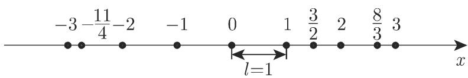
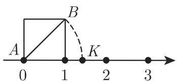

#### 1.1.1 数

1.1.1.1 自然数、整数和有理数

1. 定义和记号

正整数、负整数、分数和零统称为有理数．相关的符号有 (参见第 439 页 5.2.1,1.)

\- 自然数集: $\mathbb{N} = \{0,1,2,3,\dots\}$ ,

\- 整数集: $\mathbb{Z} = \{\cdots, -2, -1, 0, 1, 2, \cdots\}$ ,

\- 有理数集: $\mathbb{Q} = \left\{x \mid x = \frac{p}{q}, p \in \mathbb{Z}, q \in \mathbb{Z}, q \neq 0\right\}$ .

自然数的概念来源于计数和排序. 自然数也被称为非负整数.

2. 有理数集的性质

\- 有理数集是无限的.

\- 有理数集是有序的, 即任意给定两个不同的有理数 $a$ 和 $b$ , 总可以确定何者小, 何者大.

\- 有理数集是处处稠密的, 即在任意两个不同的有理数 $a$ 和 $b(a < b)$ 之间, 至少存在一个有理数 $c(a < c < b)$ . 从而, 在任意两个不同的有理数之间, 存在着无限多个其他的有理数.

3. 算术运算

算术运算 (加、减、乘、除) 可以在任意两个有理数之间执行, 结果仍是一个有理数. 唯一的例外是被零除, 这是不可能的. 被写成 $a:0$ 的运算是无意义的, 因为其不能得到任何结果: 如果 $a \neq 0$ , 那么不存在任何有理数 $b$ 能使 $b \cdot 0 = a$ 成立; 而如果 $a=0$ , 则 $b$ 可以是任意有理数. 常常出现的表达式 $a:0=\infty$ (无限大) 并不意味这一除法是可能的, 这只是一种记号, 其意义是: 当除数趋近于零, 而被除数不趋于零时, 那么商的绝对值 (大小) 可以大于任何有限的数.

4. 十进小数和连分数

每个有理数都可以表示为一个有限的或无限循环的十进小数, 或者表示为一个有限的连分数 (参见第 3 页 1.1.1.4).

5. 几何表示

在一条直线上确定一个原点作为零点, 确定一个正的方向作为定向, 确定一个长度单位 $l$ 作为量尺(参见第 149 页 2.17.1 和图 1.1), 那么每一个有理数都对应此直线上一个确定的点. 该点具有坐标 $a$ , 并称为有理点. 该直线称为数轴. 因为有理数集处处稠密, 所以在任意两个有理点之间存在无限多个其他有理点.

  
图1.1

1.1.1.2 无理数和超越数

有理数在运算中并不够用．虽然有理数是处处稠密的，但它却不能覆盖整个数轴．例如，让单位正方形的对角线 AB 绕点 A 旋转，使 B 落在数轴上的点 K 处，那么其坐标将不是任何有理数（图 1.2）.

  
图1.2

无理数的引进使数轴上每个点都有一个与之对应的数. 一般教科书中对无理数都有精确的定义, 比如借助区间套的定义. 而这里则仅限于指出: 无理数填充了数轴上所有的非有理点, 每一个无理数都对应于数轴上的一个点, 每个无理数都可以用一个无限不循环的十进小数来表示.

首先, 代数方程

$x^{n}+a_{n-1}x^{n-1}+\cdots+a_{1}x+a_{0}=0$ (n>1,整数;方程系数均为整数) (1.1a)的非整数实根属于无理数,这些根称为代数无理数.

■ A: 代数无理数最简单的例子是方程 $x^{n} - a = 0 (a > 0)$ 的非有理实根, 记作 $\sqrt[n]{a}$ .

■ B: $\sqrt[2]{2}=1.414\cdots,\sqrt[3]{10}=2.154\cdots$ 是代数无理数.

不是代数无理数的无理数称为超越数.

■ A: $\pi = 3.141592 \cdots, e = 2.718281 \cdots$ 是超越数.

■ B: 形如 $10^{n}$ 以外的所有整数的以 10 为底的对数都是超越数.

二次方程

$$
x ^ {2} + a _ {1} x + a _ {0} = 0 \quad (a _ {1}, a _ {0} \text {为整数})\tag{1.1b}
$$

的非整数根称为二次无理数, 它们具有 $\frac{a+b\sqrt{D}}{c}(a,b,c$ 均为整数, $c\neq0; D>0$ , 是非平方数) 形式.

■ 一条线段按黄金比例 $x / a = (a - x) / x$ (参见第260页3.5.2.3,(3))所作的分割, 当 $a = 1$ 时导出方程 $x^{2} + x - 1 = 0$ . 解 $x = (\sqrt{5} - 1) / 2$ 是一个二次无理数, 其包含了无理数 $\sqrt{5}$ .

1.1.1.3 实数

有理数与无理数合起来形成实数集, 记为 $\mathbb{R}$ .

1. 最重要的性质

实数集有下列重要性质 (亦可参见第 1 页 1.1.1.1, 2.):

\- 无限性.

\- 有序性.

\- 处处稠密.

\- 封闭性, 即数轴上任意一点都对应于一个实数. 有理数不具有这一性质.

2. 算术运算

任意两个实数之间都可以进行算术运算, 其结果仍为实数. 唯一的例外是不能被零除 (参见第 1 页 1.1.1.1, 3). 实数可以进行乘方及其逆运算, 任一正实数都可以求其任意次开方根. 每一个正实数都有一个以除 1 外任意正数为底的对数.

数概念的进一步推广将导出复数的概念 (参见第 43 页 1.5).

3. 数区间

一个具有端点 $a$ 和 $b$ 的连通的实数集称为以 $a$ 和 $b$ 为端点的数区间，此处 $a < b, a$ 允许为 $-\infty, b$ 允许为 $+\infty$ 。如果区间不包含端点，则称其为开区间，反之，则称之为闭区间。

一个区间用置于括号内的端点来表示：方括号表示闭区间，圆括号表示开区间。两个端点都不属内的开区间记为 $(a, b)$ ；只有一个端点属内的半开（半闭）区间记为 $[a, b)$ 或 $(a, b]$ ；两个端点都属内的闭区间记为 $[a, b]$ 。有时会用 $a, b$ 替代 $(a, b)$ 来标记开区间，类似地用 $[a, b$ 来替代 $[a, b)$ 。在图示情形，本书中以圆箭头表示区间的开端，以实点表示其闭端。

1.1.1.4 连分数

连分数是具有套式结构的分数, 有理数和无理数都可以用它来表示并获得比十进小数更好的逼近 (参见第 1300 页 19.8.1.1 和第 5 页 ■A 与 ■B).

1. 有理数

一个有理数的连分数是有限的表示式. 大于 1 的正有理数的连分数形如 (1.2)

$$
{\frac {p}{q}} = a _ {0} + {\frac {1}{a _ {1} + {\frac {1}{a _ {2} + {\frac {1}{\ddots + {\frac {1}{a _ {n - 1} + {\frac {1}{a _ {n}}}}}}}}}}}.\tag{1.2}
$$

上式可以缩写为 $\frac{p}{q} = [a_{0}; a_{1}, a_{2}, \cdots, a_{n}]$ ，其中 $a_{k} \geqslant 1 (k = 1, 2, \cdots, n)$ .

数 $a_{k}$ 可以借助欧几里得算法来计算:

$$
\frac {p}{q} = a _ {0} + \frac {r _ {1}}{q} \quad \left(0 <   \frac {r _ {1}}{q} <   1\right),\tag{1.3a}
$$

$$
{\frac {q}{r _ {1}}} = a _ {1} + {\frac {r _ {2}}{r _ {1}}} \left(0 <   {\frac {r _ {2}}{r _ {1}}} <   1\right),\tag{1.3b}
$$

$$
\frac {r _ {1}}{r _ {2}} = a _ {2} + \frac {r _ {3}}{r _ {2}} \quad \left(0 <   \frac {r _ {3}}{r _ {2}} <   1\right),\tag{1.3c}
$$

$$
\frac {r _ {n - 2}}{r _ {n - 1}} = a _ {n - 1} + \frac {r _ {n}}{r _ {n - 1}} \left(0 <   \frac {r _ {n}}{r _ {n - 1}} <   1\right),\tag{1.3d}
$$

$$
\frac {r _ {n - 1}}{r _ {n}} = a _ {n} \quad (r _ {n + 1} = 0).\tag{1.3e}
$$

$$
\frac {6 1}{2 7} = 2 + \frac {7}{2 7} = 2 + \frac {1}{3 + \frac {6}{7}} = 2 + \frac {1}{3 + \frac {1}{1 + \frac {1}{6}}} = [ 2; 3, 1, 6 ].
$$

2. 无理数

无理数的连分数是不中断的, 它们称为无限连分数, 记作 $[a_{0}; a_{1}, a_{2}, \cdots]$ .

如果在一个连分数表示式中有某个 $a_{k}$ 重复出现, 就称此分数为循环连分数或循环链分数(recurring chain fraction). 每个循环连分数都表示一个二次无理数, 反之, 每个二次无理数都可以表示为循环连分数.

■ $\sqrt{2}=1.4142135\cdots$ 是一个二次无理数，它有循环连分数表示式 $\sqrt{2}=[1;2,2,2,\cdots]$ .

3. 实数的逼近

如果 $\alpha = [a_{0}; a_{1}, a_{2}, \cdots]$ 是任一实数，则每一个有限连分数

$$
\alpha_ {k} = [ a _ {0}; a _ {1}, a _ {2}, \dots , a _ {k} ] = \frac {p}{q}\tag{1.4}
$$

表示 $\alpha$ 的一个逼近. 连分数 $\alpha_{k}$ 称为 $\alpha$ 的 $k$ 阶逼近. 它可以通过递推公式

$$
\alpha_ {k} = \frac {p _ {k}}{q _ {k}} = \frac {a _ {k} p _ {k - 1} + p _ {k - 2}}{a _ {k} q _ {k - 1} + q _ {k - 2}} (k \geqslant 1; p _ {- 1} = 1, p _ {0} = a _ {0}; q _ {- 1} = 0, q _ {0} = 1)\tag{1.5}
$$

来计算. 根据刘维尔逼近定理, 下列误差估计式成立

$$
\mid \alpha - \alpha_ {k} \mid = \left| \alpha - \frac {p _ {k}}{q _ {k}} \right| <   \frac {1}{q _ {k} ^ {2}}\tag{1.6}
$$

还可以进一步证明：该近似式以渐增的精度上下交替地逼近实数 $\alpha$ 。当 (1.4) 中的 $a_{i}(i=1,2,\cdots,k)$ 具有大数值时，近似式迅速收敛于 $\alpha$ 。因此，对于数 $[1;1,1,\cdots]$ 而言，收敛是最差的。

■ A: 通过 (1.3a)—(1.3e) 可以从 $\pi$ 的十进小数表示得到其连分数表示 $\pi = [3;7,15,1,292,\dots]$ . 相应的近似值 (1.5) 及根据 (1.6) 得到的误差估计为: $\alpha_{1} = \frac{22}{7}$ 和 $|\pi - \alpha_{1}| < \frac{1}{7^{2}} \approx 2 \cdot 10^{-2}$ , $\alpha_{2} = \frac{333}{106}$ 和 $|\pi - \alpha_{2}| < \frac{1}{106^{2}} \approx 9 \cdot 10^{-5}$ , $\alpha_{3} = \frac{355}{113}$ 和 $|\pi - \alpha_{3}| < \frac{1}{113^{2}} \approx 8 \cdot 10^{-5}$ . 实际误差更小些, 对 $\alpha_{1}$ 而言小于 $1.3 \cdot 10^{-3}$ , 对 $\alpha_{2}$ 而言小于 $8.4 \cdot 10^{-5}$ , 对 $\alpha_{3}$ 而言小于 $2.7 \cdot 10^{-7}$ . 近似值 $\alpha_{1}, \alpha_{2}$ 和 $\alpha_{3}$ 是对 $\pi$ 的比相应位数的小数表示更好的逼近.

■ B: 黄金分割公式 $x/a=(a-x)/x$ (参见第 260 页 3.5.2.3,(3)) 可由以下两个连分数来表示： $x=a[1;1,1,\cdots]$ 和 $x=\frac{a}{2}(1+\sqrt{5})=\frac{a}{2}(1+[2;4,4,4,\cdots])$ . 第一个表示式中近似值 $\alpha_{4}$ 的精确度为 0.018a，第二个表示式的精确度则达到 0.000001a.

1.1.1.5 可公度性

一个表示式中如果两个数 $a$ 和 $b$ 分别为第三个数 $c$ 的整数倍, 则称它们为可公度的, 即可以被同一个数量度. 由 $a = mc, b = nc (m, n \in \mathbb{Z})$ 可得

$$
\frac {a}{b} = x \quad (x \text {是有理数}),\tag{1.7}
$$

否则就称 a 和 b 为不可公度的.

■ A: 一个正方形边长与其对角线长是不可公度的, 因为它们的比是无理数 $\sqrt{2}$ .

■ B: 黄金分割线段是不可公度的, 因为它们的比包含有无理数 $\sqrt{5}$ (参见第 260 页 3.5.2.3,(3)). 因此, 一个正五边形的边长与其对角线长是不可公度的 (参见第 182 页 3.1.5.3). 现在认为梅塔蓬图姆的希帕索斯 (Hippasos of Metapontum, 公元前 450 年) 正是通过这一例子发现了无理数.
