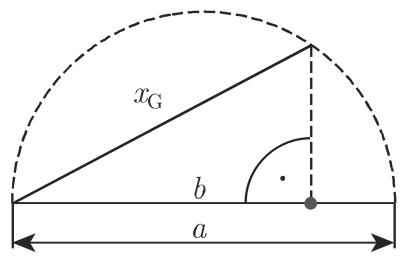

### 1.2 有限级数

#### 1.2.1 有限级数的定义

和式

$$
s _ {n} = a _ {0} + a _ {1} + a _ {2} + \dots + a _ {n} = \sum_ {i = 0} ^ {n} a _ {i}\tag{1.51}
$$

称为有限级数．被加数 $a_{i}(i=0,1,2,\cdots,n)$ 由一定的公式给出，它们是数，称为级数的项．

#### 1.2.2 等差级数

1. 一阶等差级数

一阶等差级数是其项构成等差数列的有限级数, 即相邻两项的差是常数:

$$
\Delta a _ {i} = a _ {i + 1} - a _ {i} = d = \text {常数}, \quad \text {故} \quad a _ {i} = a _ {0} + i d.\tag{1.52a}
$$

因此

$$
s _ {n} = a _ {0} + (a _ {0} + d) + (a _ {0} + 2 d) + \dots + (a _ {0} + n d),\tag{1.52b}
$$

$$
s _ {n} = \frac {a _ {0} + a _ {n}}{2} (n + 1) = \frac {n + 1}{2} (2 a _ {0} + n d).\tag{1.52c}
$$

2. $k$ 阶等差级数

k 阶等差级数是序列 $a_{0}, a_{1}, a_{2}, \cdots, a_{n}$ 的 k 阶差分 $\Delta^{k}a_{i}$ 为常数的有限级数. 高阶差分可通过公式

$$
\Delta^ {v} a _ {i} = \Delta^ {v - 1} a _ {i + 1} - \Delta^ {v - 1} a _ {i} (v = 2, 3, \dots , k)\tag{1.53a}
$$

计算. 由差分模式(也称为差分表或三角模式), 可以很方便地计算高阶差分:

$$
\begin{array}{c c c c c} a _ {0} & & & & \\ \Delta a _ {0} & & & & \\ a _ {1} & \Delta^ {2} a _ {0} & & & \\ \Delta a _ {1} & & \Delta^ {3} a _ {0} & & \\ a _ {2} & \Delta^ {2} a _ {1} & & \ddots & \Delta^ {k} a _ {0} \\ \Delta a _ {2} & & \Delta^ {3} a _ {1} & & \\ a _ {3} & \Delta^ {2} a _ {2} & & \ddots & \Delta^ {k} a _ {1} & \ddots \\ \vdots & & \vdots & \vdots & \Delta^ {n} a _ {0} \\ \vdots & \vdots & & \Delta^ {k} a _ {n - k} & \ddots \\ & & \Delta^ {3} a _ {n - 3} & \ddots \\ & \Delta^ {2} a _ {n - 2} & & \\ \Delta a _ {n - 1} & & & \\ a _ {n} & & & \end{array}\tag{1.53b}
$$

对于其通项与前 n 项和, 有下述公式成立:

$$
\begin{array}{l} a _ {i} = a _ {0} + \binom {i} {1} \Delta a _ {0} + \binom {i} {2} \Delta^ {2} a _ {0} + \dots + \binom {i} {k} \Delta^ {k} a _ {0} \quad (i = 1, 2, \dots , n), \\ s _ {n} = \binom {n + 1} {1} a _ {0} + \binom {n + 1} {2} \Delta a _ {0} + \binom {n + 1} {3} \Delta^ {2} a _ {0} + \dots + \binom {n + 1} {k + 1} \Delta^ {k} a _ {0}. \end{array} \tag {1.53c}\tag{1.53d}
$$

#### 1.2.3 等比级数

和式 (1.51) 称为等比级数, 若其项构成等比数列, 即相邻两项的比值为常数:

$$
\frac {a _ {i + 1}}{a _ {i}} = q = \text {常数}, \quad \text {故} \quad a _ {i} = a _ {0} q ^ {i}.\tag{1.54a}
$$

因此

$$
s _ {n} = a _ {0} + a _ {0} q + a _ {0} q ^ {2} + \dots + a _ {0} q ^ {n} = a _ {0} \frac {q ^ {n + 1} - 1}{q - 1} (q \neq 1),\tag{1.54b}
$$

$$
s _ {n} = (n + 1) a _ {0} \quad (q = 1).\tag{1.54c}
$$

当 $n \to \infty$ 时 (参见第616页7.2.1.1, 2.), 上式是无穷等比级数, 若 $|q| < 1$ , 级数有极限, 且极限值称为和 $s$ :

$$
s = \frac {a _ {0}}{1 - q}.\tag{1.54d}
$$

#### 1.2.4 特殊的有限级数

$$
1 + 2 + 3 + \dots + (n - 1) + n = \frac {n (n + 1)}{2},\tag{1.55}
$$

$$
p + (p + 1) + (p + 2) + \dots + (p + n) = \frac {(n + 1) (2 p + n)}{2},\tag{1.56}
$$

$$
1 + 3 + 5 + \dots + (2 n - 3) + (2 n - 1) = n ^ {2},\tag{1.57}
$$

$$
2 + 4 + 6 + \dots + (2 n - 2) + 2 n = n (n + 1),\tag{1.58}
$$

$$
1 ^ {2} + 2 ^ {2} + 3 ^ {2} + \dots + (n - 1) ^ {2} + n ^ {2} = \frac {n (n + 1) (2 n + 1)}{6},\tag{1.59}
$$

$$
1 ^ {3} + 2 ^ {3} + 3 ^ {3} + \dots + (n - 1) ^ {3} + n ^ {3} = \frac {n ^ {2} (n + 1) ^ {2}}{4},\tag{1.60}
$$

$$
1 ^ {2} + 3 ^ {2} + 5 ^ {2} + \dots + (2 n - 1) ^ {2} = \frac {n (4 n ^ {2} - 1)}{3},\tag{1.61}
$$

$$
1 ^ {3} + 3 ^ {3} + 5 ^ {3} + \dots + (2 n - 1) ^ {3} = n ^ {2} (2 n ^ {2} - 1),\tag{1.62}
$$

$$
1 ^ {4} + 2 ^ {4} + 3 ^ {4} + \dots + n ^ {4} = \frac {n (n + 1) (2 n + 1) (3 n ^ {2} + 3 n - 1)}{3 0},\tag{1.63}
$$

$$
1 + 2 x + 3 x ^ {2} + \dots + n x ^ {n - 1} = \frac {1 - (n + 1) x ^ {n} + n x ^ {n + 1}}{(1 - x) ^ {2}} \quad (x \neq 1).\tag{1.64}
$$

#### 1.2.5 均值

参见第 1088 页 16.3.2.2, 1. 和第 1108 页 16.4.1.3, 1..

1.2.5.1 算术平均或算术平均值

n 个数 $a_{1}, a_{2}, \cdots, a_{n}$ 的算术平均值是

$$
x _ {\mathrm{A}} = \frac {a _ {1} + a _ {2} + \cdots + a _ {n}}{n} = \frac {1}{n} \sum_ {k = 1} ^ {n} a _ {k}.\tag{1.65a}
$$

对于两个数 $a$ 和 $b$ , 有

$$
x _ {\mathrm{A}} = \frac {a + b}{2}.\tag{1.65b}
$$

数值 $a, x_{\mathrm{A}}, b$ 构成等差数列.

1.2.5.2 几何平均或几何平均值

n 个正数 $a_{1}, a_{2}, \cdots, a_{n}$ 的几何平均值是

$$
x _ {\mathrm{G}} = \sqrt [ n ]{a _ {1} a _ {2} \cdots a _ {n}} = \left(\prod_ {k = 1} ^ {n} a _ {k}\right) ^ {\frac {1}{n}}.\tag{1.66a}
$$

对于两个正数 $a$ 和 $b$ , 有

$$
x _ {\mathrm{G}} = \sqrt {a b}.\tag{1.66b}
$$

数值 $a, x_{\mathrm{G}}, b$ 构成等比数列．若 $a$ 和 $b$ 是给定的直线段，则可借助于图1.3(a)或图1.3(b)中的任一种方式构造长度为 $x_{\mathrm{G}} = \sqrt{ab}$ 的线段.

根据黄金分割, 几何平均值的一种特殊情形可通过分割直线段得到 (参见第 260 页 3.5.2.3, (3)).

  
(a)

  
图1.3  
(b)

1.2.5.3 调和平均

n 个数 $a_{1}, a_{2}, \cdots, a_{n} (a_{i} \neq 0; i = 1, 2, \cdots, n)$ 的调和平均值是

$$
x _ {\mathrm{H}} = \left[ \frac {1}{n} \left(\frac {1}{a _ {1}} + \frac {1}{a _ {2}} + \dots + \frac {1}{a _ {n}}\right) \right] ^ {- 1} = \left[ \frac {1}{n} \sum_ {k = 1} ^ {n} \frac {1}{a _ {k}} \right] ^ {- 1}.\tag{1.67a}
$$

对于两个数 a 和 b, 有

$$
x _ {\mathrm{H}} = \left[ \frac {1}{2} \left(\frac {1}{a} + \frac {1}{b}\right) \right] ^ {- 1}, x _ {\mathrm{H}} = \frac {2 a b}{a + b}.\tag{1.67b}
$$

1.2.5.4 二次均值

n 个数 $a_{1}, a_{2}, \cdots, a_{n}$ 的二次均值是

$$
x _ {\mathrm{Q}} = \sqrt {\frac {1}{n} (a _ {1} ^ {2} + a _ {2} ^ {2} + \cdots + a _ {n} ^ {2})} = \sqrt {\frac {1}{n} \sum_ {k = 1} ^ {n} a _ {k} ^ {2}}.\tag{1.68a}
$$

对于两个数 $a$ 和 $b$ , 有

$$
x _ {\mathrm{Q}} = \sqrt {\frac {a ^ {2} + b ^ {2}}{2}}.\tag{1.68b}
$$

二次均值在观测误差理论中很重要.

1.2.5.5 两个正数均值之间的关系

对于 $x_{\mathrm{A}} = \frac{a + b}{2}, x_{\mathrm{G}} = \sqrt{ab}, x_{\mathrm{H}} = \frac{2ab}{a + b}, x_{\mathrm{Q}} = \sqrt{\frac{a^2 + b^2}{2}}$ ，有

(1) 若 $a < b$ , 则

$$
a <   x _ {\mathrm{H}} <   x _ {\mathrm{G}} <   x _ {\mathrm{A}} <   x _ {\mathrm{Q}} <   b,\tag{1.69a}
$$

(2) 若 $a = b$ , 则

$$
a = x _ {\mathrm{A}} = x _ {\mathrm{G}} = x _ {\mathrm{H}} = x _ {\mathrm{Q}} = b.\tag{1.69b}
$$
