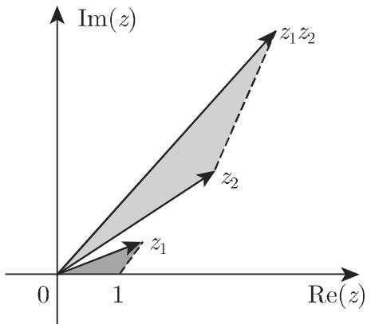
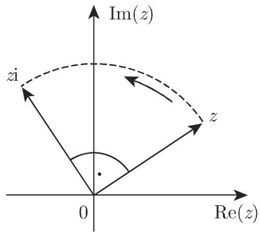
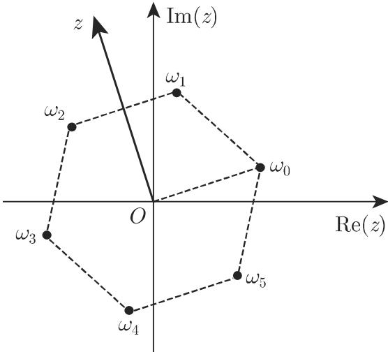

### 1.5 复数

#### 1.5.1 虚数和复数

1.5.1.1 虚数单位

虚数单位用 i 表示, 代表不同于任何实数的一个数, 其平方等于 -1. 在电学中, 通常用字母 j 代替 i, 以避免和同样用 i 表示的电流强度混淆. 引入虚数单位使得数的概念广义化, 并产生复数, 这在代数和分析中意义重大. 在几何和物理学中, 复数有多种解释.

1.5.1.2 复数

复数的代数形式是

$$
z = a + \mathrm{i} b.\tag{1.131a}
$$

当 $a$ 和 $b$ 取遍所有可能实数值时，则得到所有可能的复数 $z$ 。数 $a$ 是数 $z$ 的实部，数 $b$ 是虚部：

$$
a = \operatorname{Re} (z), \quad b = \operatorname{Im} (z).\tag{1.131b}
$$

若 b = 0，则 z = a，故实数是复数的子集。若 a = 0, z = ib，则是一个“纯虚数”。

复数集用 $\mathbb{C}$ 表示.

注 关于复变量 $z = x + \mathrm{i}y$ 的函数 $\omega = f(z)$ 将在函数论中进行讨论 (参见第953页14.1及其后).

#### 1.5.2 几何表示

1.5.2.1 向量表示

与实数在数轴上的表示类似, 复数可表示为所谓高斯平面上的点: 数 $z = a + \mathrm{i}b$ 用横坐标为 $a$ 、纵坐标为 $b$ 的点表示 (图1.5). 实数在横轴上, 横轴也称为实轴, 纯虚数在纵轴上, 纵轴也称为虚轴. 在高斯平面上, 每个点由其位置向量或径向量唯一给出 (参见第243页3.5.1.1, 6.), 故任一复数都对应一个向量, 该向量的起点为原点, 且指向复数所定义的点. 因此, 复数可表示为点或向量 (图1.6).

  
图1.5

  
图1.6

1.5.2.2 复数的相等

两个复数相等是指其实部和虚部对应相等．从几何观点来看，两个复数相等是指其对应的位置向量相等．反之，则称两个复数不相等．对复数而言，概念“大于”和“小于”是无意义的.

1.5.2.3 复数的三角形式

形式

$$
z = a + \mathrm{i} b\tag{1.132a}
$$

称为复数的代数形式. 使用极坐标可得复数的三角形式(图 1.7):

  
图1.7

(1.132b)

一个点的位置向量的长度 $\rho = |z|$ 称为复数的绝对值或复数的模, 角 $\varphi$ 称为复数的辐角, 用弧度度量, 记为 $\arg z$ :

$$
\rho = | z |, \quad \varphi = \arg z = \omega + 2 k \pi ,
$$

其中， $0 \leqslant \rho < \infty, -\pi < \omega \leqslant +\pi, k = 0, \pm 1, \pm 2, \cdots.$

(1.132c)

$\varphi$ 称为复数的辐角主值.

对于一个点来说, $\rho, \varphi$ 和 $a, b$ 的关系, 与该点笛卡儿坐标和极坐标的关系是相同的 (参见第257页3.5.2.2, 3.) :

$$
a = \rho \cos \varphi ,\tag{1.133a}
$$

$$
b = \rho \sin \varphi ,\tag{1.133b}
$$

$$
\rho = \sqrt {a ^ {2} + b ^ {2}},
$$

$$
\varphi = \left\{ \begin{array}{l l} {{\arccos {\frac {a}{\rho}},}} & {{b \geqslant 0, \rho > 0,}} \\ {{- \arccos {\frac {a}{\rho}},}} & {{b <   0, \rho > 0,}} \\ {{\text {无定义},}} & {{\rho = 0,}} \end{array} \right.\tag{1.133c}
$$

(1.133d)

$$
\varphi = \left\{ \begin{array}{l l} \arctan \frac {b}{a}, & a > 0, \\ \frac {\pi}{2}, & a = 0, b > 0, \\ - \frac {\pi}{2}, & a = 0, b <   0, \\ \arctan \frac {b}{a} + \pi , & a <   0, b \geqslant 0, \\ \arctan \frac {b}{a} - \pi , & a <   0, b <   0. \end{array} \right.\tag{1.133e}
$$

复数 z = 0 的绝对值等于 0, 其辐角 arg0 无定义.

1.5.2.4 复数的指数形式

表达式

$$
z = \rho \mathrm{e} ^ {\mathrm{i} \varphi}\tag{1.134a}
$$

称为复数的指数形式, 其中 $\rho$ 是复数的模, $\varphi$ 是辐角.

欧拉关系式是公式

$$
\mathrm{e} ^ {\mathrm{i} \varphi} = \cos \varphi + \mathrm{i} \sin \varphi .\tag{1.134b}
$$

■ 复数表达式有三种形式:

a) $z = 1 + \mathrm{i}\sqrt{3}$ (代数形式).

b) $z = 2\left(\cos \frac{\pi}{3} +\mathrm{i}\sin \frac{\pi}{3}\right)$ (三角形式).

c) $z = 2\mathrm{e}^{\mathrm{i}\frac{\pi}{3}}$ (指数形式), 对应复数的辐角主值.

该式成立并不仅限于主值.

$$
\begin{array}{r l} & {z = 1 + \mathrm{i} \sqrt {3} = 2 \exp \left[ \mathrm{i} \left(\frac {\pi}{3} + 2 k \pi\right) \right]} \\ & {= 2 \left[ \cos \left(\frac {\pi}{3} + 2 k \pi\right) + \mathrm{i} \sin \left(\frac {\pi}{3} + 2 k \pi\right) \right] (k = 0, \pm 1, \pm 2, \dots).} \end{array}
$$

1.5.2.5 共轭复数

两个复数 $z$ 和 $z^{*}$ 称为共轭复数, 若其实部相等, 虚部互为相反数:

$$
\operatorname{Re} (z ^ {*}) = \operatorname{Re} (z), \quad \operatorname{Im} (z ^ {*}) = - \operatorname{Im} (z).\tag{1.135a}
$$

共轭复数对应点的几何解释是关于实轴的点对称．共轭复数有相同的绝对值，其辐角仅相差一个符号：

$$
z = a + \mathrm{i} b = \rho (\cos \varphi + \mathrm{i} \sin \varphi) = \rho \mathrm{e} ^ {\mathrm{i} \varphi},\tag{1.135b}
$$

$$
z ^ {*} = a - \mathrm{i} b = \rho (\cos \varphi - \mathrm{i} \sin \varphi) = \rho \mathrm{e} ^ {- \mathrm{i} \varphi}.\tag{1.135c}
$$

通常使用记号 $\bar{z}$ 代替 $z^{*}$ ，表示 z 的共轭复数.

#### 1.5.3 复数的计算

1.5.3.1 加法和减法

以代数形式给出的两个或多个复数的加法和减法, 定义如下:

$$
\begin{array}{r l} z _ {1} + z _ {2} - z _ {3} + \dots & = (a _ {1} + \mathrm{i} b _ {1}) + (a _ {2} + \mathrm{i} b _ {2}) - (a _ {3} + \mathrm{i} b _ {3}) + \dots \\ & = (a _ {1} + a _ {2} - a _ {3} + \dots) + \mathrm{i} (b _ {1} + b _ {2} - b _ {3} + \dots). \end{array}\tag{1.136}
$$

上述计算与一般二项式的处理方式相同. 对加法和减法进行几何解释可考虑对应向量的加减法 (图 1.8), 一般的向量计算法则对复数都适用 (参见第 242 页 3.5.1.1). 对于 $z$ 和 $z^{*}, z + z^{*}$ 总是实数, $z - z^{*}$ 是纯虚数.

  
图1.8

1.5.3.2 乘法

以代数形式给出的两个复数 $z_{1}$ 和 $z_{2}$ 的乘法, 定义如下:

$$
z _ {1} z _ {2} = (a _ {1} + \mathrm{i} b _ {1}) (a _ {2} + \mathrm{i} b _ {2}) = (a _ {1} a _ {2} - b _ {1} b _ {2}) + \mathrm{i} (a _ {1} b _ {2} + b _ {1} a _ {2}).\tag{1.137a}
$$

若复数以三角形式给出，则有

$$
\begin{array}{r l} & z _ {1} z _ {2} = [ \rho_ {1} (\cos \varphi_ {1} + \mathrm{i} \sin \varphi_ {1}) ] [ \rho_ {2} (\cos \varphi_ {2} + \mathrm{i} \sin \varphi_ {2}) ] \\ & \qquad = \rho_ {1} \rho_ {2} [ \cos (\varphi_ {1} + \varphi_ {2}) + \mathrm{i} \sin (\varphi_ {1} + \varphi_ {2}) ], \end{array}\tag{1.137b}
$$

即乘积的模等于各因子的模之积, 积的辐角等于各因子的辐角之和.

积的指数形式为

$$
z _ {1} z _ {2} = \rho_ {1} \rho_ {2} \mathrm{e} ^ {\mathrm{i} (\varphi_ {1} + \varphi_ {2})}.\tag{1.137c}
$$

两个复数 $z_{1}$ 和 $z_{2}$ 乘积的几何解释是一个向量 (图1.9). 该向量由 $z_{1}$ 对应的向量旋转而成, 旋转的角度为向量 $z_{2}$ 的辐角 (是顺时针旋转还是逆时针旋转, 取决于辐角的符号), 且向量长度伸展 $|z_{2}|$ 倍.

积 $z_{1}z_{2}$ 也可通过简单的三角式表示 (图1.9). 复数 $z$ 的i倍即指旋转 $\frac{\pi}{2}$ 的角度, 其模不变(图1.10).

对于 $z$ 和 $z^{*}$ ，有

$$
z z ^ {*} = p ^ {2} = | z | ^ {2} = a ^ {2} + b ^ {2}.
$$

  
图1.9

  
图1.10

1.5.3.3 除法

除法定义为乘法的逆运算. 对于以代数形式给出的复数, 有

$$
{\frac {z _ {1}}{z _ {2}}} = {\frac {a _ {1} + \mathrm{i} b _ {1}}{a _ {2} + \mathrm{i} b _ {2}}} = {\frac {a _ {1} a _ {2} + b _ {1} b _ {2}}{a _ {2} ^ {2} + b _ {2} ^ {2}}} + \mathrm{i} {\frac {a _ {2} b _ {1} - a _ {1} b _ {2}}{a _ {2} ^ {2} + b _ {2} ^ {2}}}.\tag{1.138a}
$$

若复数以三角形式给出，则有

$$
\frac {z _ {1}}{z _ {2}} = \frac {\rho_ {1} (\cos \varphi_ {1} + \mathrm{i} \sin \varphi_ {1})}{\rho_ {2} (\cos \varphi_ {2} + \mathrm{i} \sin \varphi_ {2})} = \frac {\rho_ {1}}{\rho_ {2}} \left[ \cos (\varphi_ {1} - \varphi_ {2}) + \mathrm{i} \sin (\varphi_ {1} - \varphi_ {2}) \right],\tag{1.138b}
$$

即商的模等于被除数和除数模的比值；商的辐角等于两辐角之差.

对于指数形式, 有

$$
\frac {z _ {1}}{z _ {2}} = \frac {\rho_ {1}}{\rho_ {2}} \mathrm{e} ^ {\mathrm{i} (\varphi_ {1} - \varphi_ {2})}.\tag{1.138c}
$$

向量 $\frac{z_1}{z_2}$ 的几何表示为: 把向量 $z_1$ 旋转角度 $-\arg z_2$ , 然后收缩 $|z_2|$ 倍生成.

注 除以零向量不存在.

1.5.3.4 基本运算法则

关于复数 $z = a + \mathrm{i}b$ 的运算, 与一般二项式运算法则相同, 但需考虑到 $\mathrm{i}^2 = -1$ . 两个复数相除时, 首先对分式的分子分母同乘以除数的共轭复数, 把分母的虚部去掉. 这是可行的, 因为

$$
(a + \mathrm{i} b) (a - \mathrm{i} b) = a ^ {2} + b ^ {2}\tag{1.139}
$$

是一个实数.

$$
\begin{array}{l} \blacksquare \frac {(3 - 4 \mathrm{i}) (- 1 + 5 \mathrm{i}) ^ {2}}{1 + 3 \mathrm{i}} + \frac {1 0 + 7 \mathrm{i}}{5 \mathrm{i}} = \frac {(3 - 4 \mathrm{i}) (1 - 1 0 \mathrm{i} - 2 5)}{1 + 3 \mathrm{i}} + \frac {(1 0 + 7 \mathrm{i}) \mathrm{i}}{5 \mathrm{i}} \\ = \frac {- 2 (3 - 4 \mathrm{i}) (1 2 + 5 \mathrm{i})}{1 + 3 \mathrm{i}} + \frac {7 - 1 0 \mathrm{i}}{5} = \frac {- 2 (5 6 - 3 3 \mathrm{i}) (1 - 3 \mathrm{i})}{(1 + 3 \mathrm{i}) (1 - 3 \mathrm{i})} + \frac {7 - 1 0 \mathrm{i}}{5} \\ = \frac {- 2 (- 4 3 - 2 0 1 \mathrm{i})}{1 0} + \frac {7 - 1 0 \mathrm{i}}{5} = \frac {1}{5} (5 0 + 1 9 1 \mathrm{i}) = 1 0 + 3 8. 2 \mathrm{i}. \end{array}
$$

1.5.3.5 复数的幂

复数的 $n$ 次幂可用二项式公式计算, 非常不便. 由于实际原因会经常使用三角形式, 即所谓的棣莫弗公式:

$$
[ \rho (\cos \varphi + \mathrm{i} \sin \varphi) ] ^ {n} = \rho^ {n} (\cos n \varphi + \mathrm{i} \sin n \varphi),\tag{1.140a}
$$

即幂的模是 $\rho$ 的 n 次幂, 辐角是 $\varphi$ 的 n 倍. 特别地, 有

$$
\mathrm{i} ^ {2} = - 1, \quad \mathrm{i} ^ {3} = - \mathrm{i}, \quad \mathrm{i} ^ {4} = + 1.\tag{1.140b}
$$

一般地，

$$
\mathbf {i} ^ {4 n + k} = \mathbf {i} ^ {k}.\tag{1.140c}
$$

1.5.3.6 复数的 $n$ 次根

求复数的 $n$ 次方根是幂的逆运算. 对于 $z = \rho (\cos \varphi + \mathrm{i}\sin \varphi) \neq 0$ , 记号

$$
z ^ {\frac {1}{n}} = \sqrt [ n ]{z} (n > 0, n \text {是整数})\tag{1.141a}
$$

是 $n$ 个不同值

$$
\omega_ {k} = \sqrt [ n ]{\rho} \left(\cos \frac {\varphi + 2 k \pi}{n} + \mathrm{i} \sin \frac {\varphi + 2 k \pi}{n}\right) (k = 0, 1, 2, \dots , n - 1)\tag{1.141b}
$$

的简单记法. 复数的加、减、乘、除和整数次幂, 都有唯一结果, 而 $n$ 次方根有 $n$ 个不同的解 $\omega_{k}$ .

点 $\omega_{k}$ 的几何解释是：中心在原点的正 $n$ 边形的顶点．图1.11中给出了 $\sqrt[6]{z}$ 的6个值.

  
图1.11
