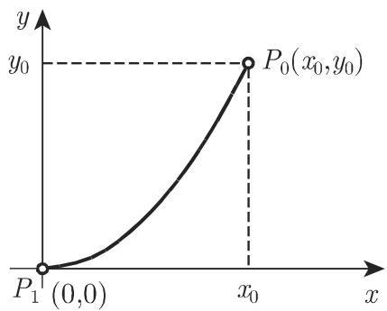

### 11.5 奇异积分方程

一个积分方程被称为奇异积分方程(singular integral equation) ，如果方程中积分的范围不是有限的，或者，如果在积分区域的内部核有奇点．总是假设，积分在反常积分，或者柯西主值（参见第 673 8.2.3) 意义下存在．奇异积分方程解的性质和条件与“通常的＇积分方程的情形大不相同在下面几节中只讨论一些特殊问题．进一步的讨论见 [11.2], [11.3], [11.7], [11.8].

#### 11.5.1 阿贝尔积分方程

把积分方程对物理问题的首批应用之一是巾阿贝尔 (Abel) 考虑的．一个质点在一个铅垂平面中沿着一条曲线仅在重力影响下从点 $P _ { 0 } ( x _ { 0 } , y _ { 0 } )$ 到点 $P _ { 1 } ( x _ { 1 } , y _ { 1 } )$ （图 11.2) 运动着

  
11.2

质点在曲线一个点处的速度是

$$
v = \frac {\mathrm{d} s}{\mathrm{d} t} = \sqrt {2 g (y _ {0} - y)}.\tag{11.68}
$$

下落时间作为 $y _ { 0 }$ 的函数由下述积分所计算：

$$
T (y _ {0}) = \int_ {0} ^ {l} \frac {\mathrm{d} s}{\sqrt {2 g (y _ {0} - y)}}.\tag{11.69a}
$$

如果 $s$ 被视为 $y$ 的函数，即 $s = f ( y )$ ，则

$$
T (y _ {0}) = \int_ {0} ^ {y _ {0}} \frac {1}{\sqrt {2 g}} \frac {f ^ {\prime} (y)}{\sqrt {y _ {0} - y}} \mathrm{d} y.\tag{11.69b}
$$

下一个问题是当下落时间被给定后，作为 $y _ { 0 }$ 的函数确定曲线的形状．由代换

$$
\sqrt {2 g} \cdot T (y _ {0}) = F (y _ {0}) \quad \text {以及} \quad f ^ {\prime} (y) = \varphi (y),\tag{11.69c}
$$

并改变记号，把 $y _ { 0 }$ 记作 $x ,$ ，就得到一个第一类沃尔泰拉积分方程：

$$
F (x) = \int_ {0} ^ {x} \frac {\varphi (y)}{\sqrt {x - y}} \mathrm{d} y.\tag{11.69d}
$$

现在考虑稍微一般的方程

$$
f (x) = \int_ {a} ^ {x} {\frac {\varphi (y)}{(x - y) ^ {\alpha}}} \mathrm{d} y, \quad \text {其中} \quad 0 <   \alpha <   1.\tag{11.70}
$$

当 $y = x$ 时，这个方程的核不是有界的．在 (11.70) 中，形式地用 $\xi$ 代替变量 $y _ { \mathrm { { i } } }$ ，用$y$ 代替变量 x. 在这些代换 ${ \sf F } ,$ ，得到形如 $\varphi = \varphi ( x )$ 的解．如果在 (11.70) 的两端都乘以 $\frac { 1 } { ( x - y ) ^ { 1 - \alpha } }$ ，并在 $[ a , x ]$ 上关千 积分，即产生方程

$$
\int_ {a} ^ {x} \frac {1}{(x - y) ^ {1 - \alpha}} \left(\int_ {a} ^ {y} \frac {\varphi (\xi)}{(y - \xi) ^ {\alpha}} d \xi\right) \mathrm{d} y = \int_ {a} ^ {x} \frac {f (y)}{(x - y) ^ {1 - \alpha}} \mathrm{d} y.\tag{11.71a}
$$

改变左端的积分次序，得到

$$
\int_ {a} ^ {x} \varphi (\xi) \bigg \{\int_ {\xi} ^ {x} \frac {\mathrm{d} y}{(x - y) ^ {1 - \alpha} (y - \xi) ^ {\alpha}} \bigg \} \mathrm{d} \xi = \int_ {a} ^ {x} \frac {f (y)}{(x - y) ^ {1 - \alpha}} \mathrm{d} y.\tag{11.71b}
$$

可以用代换 $y = \xi + ( x - \xi ) u$ 来计算内积分：

$$
\int_ {\xi} ^ {x} \frac {\mathrm{d} y}{(x - y) ^ {1 - \alpha} (y - \xi) ^ {\alpha}} = \int_ {0} ^ {1} \frac {\mathrm{d} u}{u ^ {\alpha} (1 - u) ^ {1 - \alpha}} = \frac {\pi}{\sin (\alpha \pi)}.\tag{11.71c}
$$

将此结果代入 (11.71b) ．在关千 求微商后即得到函数 $\varphi ( x )$

$$
\varphi (x) = \frac {\sin (\alpha \pi)}{\pi} \frac {\mathrm{d}}{\mathrm{d} x} \int_ {a} ^ {x} \frac {f (y)}{(x - y) ^ {1 - \alpha}} \mathrm{d} y.\tag{11.71d}
$$

$$
x = \int_ {0} ^ {x} \frac {\varphi (y)}{\sqrt {x - y}} \mathrm{d} y, \quad \varphi (x) = \frac {1}{\pi} \frac {\mathrm{d}}{\mathrm{d} x} \int_ {0} ^ {x} \frac {y}{\sqrt {x - y}} \mathrm{d} y = \frac {2}{\pi} \sqrt {x}.
$$

#### 11.5.2 有柯西核的奇异积分方程

11.5.2.1 问题的表述

考虑下述积分方程

$$
a (x) \varphi (x) + \frac {1}{\pi \mathrm{i}} \int_ {\Gamma} \frac {K (x , y)}{y - x} \varphi (y) \mathrm{d} y = f (x), \quad x \in \Gamma .\tag{11.72}
$$

I' 是复平面中一组有限数目的光滑简单闭曲线，它们形成一个包含原点的连通内部区域 $S ^ { + }$ 和一个外部区域 $S ^ { - }$ ．沿着曲线行进， $S ^ { + }$ 总是在 I' 的左边．一个函数 $u ( x )$ 是赫尔德连续的 (Holder continuous) （或者满足赫尔德条件 (Holder condi-tion)），如果对千任意一对 $x _ { 1 } , x _ { 2 } \in T$ 成立关系式

$$
| u (x _ {1}) - u (x _ {2}) | <   K | x _ {1} - x _ {2} | ^ {\beta}, \quad 0 <   \beta \leqslant 1, \quad K > 0.\tag{11.73}
$$

假设函数 $\alpha ( x ) , f ( x )$ 和 $\varphi ( x )$ 是赫尔德连续的，其指数为 $\beta _ { 1 }$ ，并且 $K ( x , y )$ 关千两个自变量都是赫尔德连续的，指数为 $\beta _ { 2 } ( > \beta _ { 1 } )$ ．当 $x = y$ 时，核 $K ( x , y ) ( y -$ $x ) ^ { - 1 }$ 有一个强奇点积分作为柯西积分主值存在．记 $K ( x , x ) = b ( x ) , k ( x , y ) =$ $\frac { K ( x , y ) - K ( x , x ) } { y - x }$ ，则 (11.72) 以下述形式成立：

$$
(\mathcal {L} \varphi) (x) := a (x) \varphi (x) + \frac {b (x)}{\pi \mathrm{i}} \int_ {\Gamma} \frac {\varphi (y)}{y - x} \mathrm{d} y + \frac {1}{\pi \mathrm{i}} \int_ {\Gamma} k (x, y) \varphi (y) \mathrm{d} y = f (x),\tag{\(x\in \Gamma\}
$$

(11.74a)

表达式 $( { \mathcal { L } } \varphi ) ( x )$ 以缩写形式表示积分方程的左端． 是一个奇异算子．函数 $k ( x , y )$ 是一个弱奇异核．假设成立正规性条件 $a ( x ) ^ { 2 } - b ( x ) ^ { 2 } \neq 0 , x \in T$ 方程

$$
(\mathcal {L} _ {0} \varphi) (x) = a (x) \varphi (x) + \frac {b (x)}{\pi \mathrm{i}} \int_ {\Gamma} \frac {\varphi (y)}{y - x} \mathrm{d} y = f (x), \quad x \in \Gamma\tag{11.74b}
$$

是与 (11.74a) 相关的特征方程 (characteristic equation) ．算子 $\mathcal { L } _ { 0 }$ 是算子 的特征部分(11.74a) 的伴随积分方程导致等式

$$
\begin{array}{l} \left(\mathcal {L} ^ {\top} \psi\right) (y) = a (y) \psi (y) - \frac {b (y)}{\pi \mathrm{i}} \int_ {\Gamma} \frac {\psi (x)}{x - y} \mathrm{d} x + \frac {1}{\pi \mathrm{i}} \int_ {\Gamma} \left(k (x, y) - \frac {b (x) - b (y)}{x - y}\right) \psi (x) \mathrm{d} x \\ = g (y), \quad y \in \Gamma . \end{array} \tag {11.74c}
$$

11.5.2.2 解的存在性

方程（ $( { \mathcal { L } } \varphi ) ( x ) = f ( x )$ 有解，当且仅当齐次转置方程 $( \mathcal { L } ^ { \mathrm { T } } \psi ) ( y ) = 0$ 的每个解$\psi ( y )$ 满足正交性条件

$$
\int_ {\Gamma} f (y) \psi (y) \mathrm{d} y = 0.\tag{11.75a}
$$

类似地，转置方程( $( \mathcal { L } ^ { \mathrm { T } } \psi ) ( y ) = g ( y )$ 有解，如果齐次方程 $( { \mathcal { L } } \varphi ) ( x ) = 0$ 的每个解$\varphi ( x )$ 满足

$$
\int_ {\Gamma} g (x) \varphi (x) \mathrm{d} x = 0.\tag{11.75b}
$$

11.5.2.3 柯西型积分的性质

下述函数被称为 上的一个柯西型积分(Cauchy type integral):

$$
\varPhi (z) = \frac {1}{2 \pi \mathrm{i}} \int_ {\Gamma} \frac {\varphi (y)}{y - z} \mathrm{d} y, \qquad z \in \mathbb {C}.\tag{11.76a}
$$

当 $z \not \in \varGamma$ 时积分在通常的意义下存在，并且表示一个全纯函数（参见第 95414.1.2) ．还成立 $\varPhi ( \infty ) = 0$ ．当 $z = x \in T$ 时，（11.76a) 被考虑为柯西积分主值

$$
(\mathcal {H} \varphi) (x) = \frac {1}{2 \pi \mathrm{i}} \int_ {\Gamma} \frac {\varphi (y)}{y - x} \mathrm{d} y, \quad x \in \Gamma .\tag{11.76b}
$$

柯西型积分 $\varPhi ( z )$ 可以从 $S ^ { + }$ 和 $S ^ { - }$ 连续地延拓到 上．当 趋近千 $x \in T$ 时的极限分别表示为 $\Phi ^ { + } ( x )$ 和 $\varPhi ^ { - } ( x )$ ．普勒梅利 (Plemelj) Sochozki 公式成立：

$$
\varPhi^ {+} (x) = \frac {1}{2} \varphi (x) + (\mathcal {H} \varphi) (x), \quad \varPhi^ {-} (x) = - \frac {1}{2} \varphi (x) + (\mathcal {H} \varphi) (x).\tag{11.76c}
$$

11.5.2.4 希尔伯特边值问题

1. 关系式

特征积分方程的解与希尔伯特边值问题密切相关．如果 $\varphi ( x )$ (11.74b) 的一个解，则 (11.76a) 是 $S ^ { + }$ 和 $S ^ { - }$ 上的全纯函数，并且 $\varPhi ( \infty ) = 0$ 巾千普勒梅利和Sochozki 公式 (11.76c) ，有

$$
\varphi (x) = \varPhi^ {+} (x) - \varPhi^ {-} (x), 2 (\mathcal {H} \varphi) (x) = \varPhi^ {+} (x) + \varPhi^ {-} (x), x \in \varGamma .\tag{11.77a}
$$

引进记号

$$
G (x) = {\frac {a (x) - b (x)}{a (x) + b (x)}} \quad {\text {和}} \quad g (x) = {\frac {f (x)}{a (x) + b (x)}},\tag{11.77b}
$$

则特征积分方程有形式：

$$
\varPhi^ {+} (x) = G (x) \varPhi^ {-} (x) + g (x), \quad x \in \varGamma .\tag{11.77c}
$$

2. 希尔伯特边值问题

求一个函数 $\varPhi ( x )$ ，它在 $S ^ { + }$ 和 一上是全纯的，在无穷远处为 ，并且在满足边界条件 (11.77c)．在 (11.76a) 中给出了希尔伯特问题的一个解 $\varPhi ( x )$ ．因而，(11.77a) 第一个方程就确定了特征积分方程的一个解 $\varphi ( x )$

11.5.2.5 希尔伯特边值问题（简言之：希尔伯特问题）之解

1. 齐次边界条件

$$
\varPhi^ {+} (x) = G (x) \varPhi^ {-} (x), \quad x \in \varGamma .\tag{11.78}
$$

在点 沿着曲线 $\varGamma _ { l }$ 的单个环流期间， $\log G ( x )$ 的值改变了 $2 \pi \mathrm { i } \lambda _ { l }$ ，这里 $\lambda _ { l }$ 是一个整数．在对完全的曲线组 I' 做了单个的遍历后函数 $\log G ( x )$ 值的改变为

$$
\sum_ {l = 0} ^ {n} 2 \pi \mathrm{i} \lambda_ {l} = 2 \pi \mathrm{i} \kappa .\tag{11.79a}
$$

数 $\kappa = \sum _ { l = 0 } ^ { n } \lambda _ { l }$ 被称为希尔伯特问题的指数 (index of the Hilbert problem) ．现在构成一个函数 $G _ { 0 } ( x )$

$$
G _ {0} (x) = (x - a _ {0}) ^ {- \kappa} \Pi (x) G (x),\tag{11.79b}
$$

$$
\varPi (x) = \left(x - a _ {1}\right) ^ {\lambda_ {1}} (x - a _ {2}) ^ {\lambda_ {2}} \cdot \cdot \cdot (x - a _ {n}) ^ {\lambda_ {n}},\tag{11.79c}
$$

其中 $a _ { 0 } \in S ^ { + }$ ，而 $a _ { l } ( l = 1 , \cdots , n )$ 是 $\varGamma _ { l }$ 内部任意的固定点．如果 $T = T _ { 0 }$ 是一条简单闭曲线 $( n = 0 )$ ，则定义 $\pi ( x ) = 1$ .

$$
I (z) := \frac {1}{2 \pi \mathrm{i}} \int_ {\Gamma} \frac {\log G _ {0} (y)}{y - z} \mathrm{d} y,\tag{11.79d}
$$

就得到齐次希尔伯特问题的下述称为基本解的特解

$$
X (z) = \left\{ \begin{array}{l l} \Pi^ {- 1} (z) \exp I (z), & z \in S ^ {+}, \\ (z - a _ {0}) ^ {- \kappa} \exp I (z), & z \in S ^ {-}. \end{array} \right.\tag{11.79e}
$$

对千任何有限的 $z ,$ ，这个函数不为 0. 对千 $\kappa > 0$ ，齐次希尔伯特问题在无穷远处为 的最一般的解为

$$
\varPhi_ {h} (z) = X (z) P _ {\kappa - 1} (z), \qquad z \in \mathbb {C},\tag{11.80}
$$

其中 $P _ { \kappa - 1 } ( z )$ 是一个次数至多为 $\kappa - 1$ 的任意多项式．对千 $\kappa \leqslant 0 .$ 满足条件$\varPhi _ { h } ( \infty ) = 0$ 的只有平凡解 $\varPhi _ { h } ( z ) = 0$ , 因而在此情形 $P _ { \kappa - 1 } ( z ) \equiv 0$ . 对千 $\kappa > 0$ 齐次希尔伯特问题有 $\kappa$ 个线性无关解在无穷远处为 0.

2. 非齐次边界条件

非齐次希尔伯特问题的解是

$$
\varPhi (z) = X (z) R (z) + \varPhi_ {h} (z),\tag{11.81}
$$

其中

$$
R (z) = \frac {1}{2 \pi \mathrm{i}} \int_ {\Gamma} \frac {g (y) \mathrm{d} y}{X ^ {+} (y) (y - z)}.\tag{11.82}
$$

如果 $\kappa < 0$ ，对千在无穷远处为 的解的存在性，必须满足下述充要条件：

$$
\int_ {\Gamma} \frac {y ^ {k} g (y) \mathrm{d} y}{X ^ {+} (y)} = 0 \quad (k = 0, 1, \dots , - \kappa - 1).\tag{11.83}
$$

11.5.2.6 特征积分方程的解

1. 齐次特征积分方程

如果 $\varPhi _ { h } ( z )$ 是相应的齐次希尔伯特问题的解，从 (11.77a) 即得齐次积分方程的解

$$
\varphi_ {h} (x) = \varPhi_ {h} ^ {+} (x) - \varPhi_ {h} ^ {-} (x), \quad x \in \Gamma .\tag{11.84a}
$$

对千 $\kappa \leqslant 0$ ，只存在平凡解 $\varphi _ { h } ( x ) = 0$ . 对千 $\kappa > 0$ ，通解为

$$
\varphi_ {h} (x) = [ X ^ {+} (x) - X ^ {-} (x) ] P _ {\kappa - 1} (x),\tag{11.84b}
$$

其中多项式 $P _ { \kappa - 1 }$ 的次数至多为 $\kappa - 1$

2. 非齐次特征积分方程

如果 $\varPhi ( z )$ 是非齐次希尔伯特问题的通解，那么由 (11.77a) 可以给出齐次积分方程的解：

$$
\varphi (x) = \varPhi^ {+} (x) - \varPhi^ {-} (x)\tag{11.85a}
$$

$$
= X ^ {+} (x) R ^ {+} (x) - X ^ {-} (x) R ^ {-} (x) + \Phi_ {h} ^ {+} (x) - \Phi_ {h} ^ {-} (x), \quad x \in \Gamma . (1 1. 8 5 b)
$$

利用普勒梅利和 Sochozki 公式 (11.76c) ，对千 $R ( z )$ 有

$$
R ^ {+} (x) = \frac {1}{2} \frac {g (x)}{X ^ {+} (x)} + \left(\mathcal {H} \frac {g}{X ^ {+}}\right) (x), \quad R ^ {-} (x) = - \frac {1}{2} \frac {g (x)}{X ^ {+} (x)} + \left(\mathcal {H} \frac {g}{X ^ {+}}\right) (x).\tag{11.85c}
$$

(11.85c) 代入 (11.85a) ，并考虑 (11.76b) 以及 $g ( x ) = f ( x ) / ( a ( x ) + b ( x ) )$ ），最终得到解

$$
\begin{array}{r l} & {\varphi (x) = \frac {X ^ {+} (x) + X ^ {-} (x)}{2 (a (x) + b (x)) X ^ {+} (x)} f (x)} \\ & {\qquad + (X ^ {+} (x) - X ^ {-} (x)) \frac {1}{2 \pi \mathrm{i}} \int_ {\Gamma} \frac {f (y)}{(a (y) + b (y)) X ^ {+} (y) (y - x)} \mathrm{d} y} \\ & {\qquad + \varphi_ {h} (x), \quad x \in \Gamma .} \end{array}\tag{11.86}
$$

根据 (11.83) ，在 $\kappa < 0$ 的情形，为了保证解的存在性，下述关系式必须同时成立：

$$
\int_ {\Gamma} \frac {y ^ {k} f (y)}{(a (y) + b (y)) X ^ {+} (y)} \mathrm{d} y = 0 \quad (k = 0, 1, \dots , - \kappa - 1).\tag{11.87}
$$

·用常系数 给出特征积分方程 $a \varphi ( x ) + { \frac { b } { \pi \mathrm { i } } } \int _ { \Gamma } { \frac { \varphi ( y ) } { y - x } } \mathrm { d } y = f ( x )$ ．这里一条简单闭曲线即 $T = T _ { 0 } ( n = 0 )$ ．从 (11.77b) 即得 $G = \frac { a - b } { a + b }$ 和 $g ( x ) = { \frac { f ( x ) } { a + b } }$ 是一个常数，所以 $\kappa = 0$ ．因而 $\pi ( x ) = 1$ 以及 $G _ { 0 } = G = \frac { a - b } { a + b } . I ( z ) =$ $\log { \frac { a - b } { a + b } } { \frac { 1 } { 2 \pi \mathrm { i } } } \int _ { r } { \frac { 1 } { y - x } } \mathrm { d } y = { \left\{ \begin{array} { l l } { \log { \frac { a - b } { a + b } } , } & { z \in S ^ { + } , } \\ { 0 , } & { z \in S ^ { - } , } \end{array} \right. } X ( z )  = { \left\{ \begin{array} { l l } { { \frac { a - b } { a + b } } , } & { z \in S ^ { + } , } \\ { 1 , } & { z \in S ^ { - } , } \end{array} \right. }$ 即$X ^ { + } = \frac { a - b } { a + b } , X ^ { - } = 1$ . 由千有 $\kappa = 0$ ，所以齐次希尔伯特边值问题在无穷远处为的解只有函数 $\varPhi _ { h } ( z ) = 0$ (11.86) 即得

$$
\begin{array}{r} \varphi (x) = \frac {X ^ {+} + X ^ {-}}{2 (a + b) X ^ {+}} f (x) + \frac {X ^ {+} - X ^ {-}}{2 (a + b) X ^ {+}} \frac {1}{\pi \mathrm{i}} \int_ {\Gamma} \frac {f (y)}{y - x} \mathrm{d} y \\ = \frac {a}{a ^ {2} - b ^ {2}} f (x) - \frac {b}{a ^ {2} - b ^ {2}} \frac {1}{\pi \mathrm{i}} \int_ {\Gamma} \frac {f (y)}{y - x} \mathrm{d} y. \end{array}
$$

（陆柱家译）

12 章 泛函分析

1. 泛函分析

随着科学、工程和经济等各种门类不同学科的共有结构特性不断地被揭示，泛函分析诞生了．从而发现了蕴涵在微积分、线性代数、儿何学以及其他数学领域中通用的统一方法的一般原理

．无穷维空间

有许多问题在其建模时要求引入无穷个方程或不等式组．仅仅使用有穷维空间将无法处理微分或积分方程、逼近、变分或优化问题．

3. 线性和非线性算子

在泛函分析的最初阶段，尤其是 20 世纪上半叶对线性或线性化问题的透彻研究直接导致了线性算子理论的发展近来，需要解决越来越多的仅能用非线性方法描述的问题，从而泛函分析应用千实际问题迫切要求发展非线性算子理论．泛函分析已经越来越多地用千求解微分方程、数值分析和优化问题，其原理和方法已经成为工程技术和其他应用科学中不可或缺的工具．

4. 基本结构

本章中我们仅介绍基本结构并且也仅讨论最重要的抽象空间以及这些空间中某些特殊类型的算子．一些抽象概念将通过某些例子予以说明而其详细的论述将在本书其他章节中展开，具体描述并证明这样的问题解的存在唯一性定理．由千其抽象和一般的特性，显然，泛函分析以数学定理的形式阐明了众多现象的一般关系，这些数学定理可直接用千求解各种各样的实际问题．
