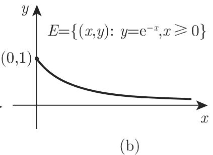
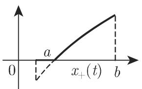

### 12.1 向量空间

#### 12.1.1 向量空间概念

一个非空集 称作标量域 IF 上的向量空间或线性空间，是指存在 上的两种运算 中元素的加法和 IF 中标量与元素的乘法 使之具有如下性质：

(1) 对千任意两元素 $x , y \in V$ ，存在元素 $z = x + y$ ，称作两元素之和．

(2) 对千任意元素 $x \in V$ 和任意标量（数） $| \alpha \in \mathbb { F }$ ，存在元素 $\alpha x \in V$ ，称作之积，使得对千任意元素 $x , y , z \in V$ 和标量 $\alpha , \beta \in \mathbb { F }$ 满足如下性质，即所谓向量空间公理（亦可参见第 489 5.3.8.1):

$$
\mathrm{(V1)} x + (y + z) = (x + y) + z.\tag{12.1}
$$

$$
(\mathrm{V} 2) \text {存在元素} 0 \in V, \text {即零元}, \text {使得} x + 0 = x.\tag{12.2}
$$

$$
\text {(V3)} \text {对于任意向量} x \in V, \text {存在元素} - x \text {使得} x + (- x) = 0.\tag{12.3}
$$

$$
\text {(V4)} x + y = y + x.\tag{12.4}
$$

$$
\text {(V5)} 1 \cdot x = x, 0 \cdot x = 0.\tag{12.5}
$$

$$
(\mathrm{V} 6) \alpha (\beta x) = (\alpha \beta) x.\tag{12.6}
$$

$$
(\mathrm{V} 7) (\alpha + \beta) x = \alpha x + \beta x.\tag{12.7}
$$

$$
\alpha (x + y) = \alpha x + \alpha y. \tag {V8}\tag{12.8}
$$

称作实或复向量空间，取决千 IF 是实数域叹还是复数域 C. 的元素也可以称点或按照线性代数，称向量在泛函分析中一般不使用向量记号 $\xrightarrow [ { x } ] { }$ 或芷

任意两个向量 $x , y \in V$ 的差 $x - y$ 也可以定义为 $x - y = x + ( - y )$ ．从上述定义可知方程 $x + y = z$ 对于任意 $y , z \in V$ 都可以求解，其解为 $x = z - y$ . 从公理$( \mathrm { V 1 } ) { \sim } ( \mathrm { V 8 } )$ 可以得到如下进一步的性质：

．零元是唯一确定的，

$\alpha x = \beta x$ 且 $x \neq 0$ , $\alpha = \beta$

$\alpha x = \alpha y$ 且 $\alpha \neq 0$ , $x = y$

$- ( \alpha x ) = \alpha \cdot ( - x )$

#### 12.1.2 线性和放射子集

1. 线性子集

向量空间 的一非空子集 $V _ { 0 }$ 称作 的一线性子空间或线性流形，是指对任意两个元 $x , y \in V _ { 0 }$ 和任意两个标量 $\alpha , \beta \in \mathbb { F }$ ，其线性组合 $\alpha x + \beta y$ 也在 $V _ { 0 }$ 中． $V _ { 0 }$ 本身是一个向量空间，从而也满足公理 $( \mathrm { V 1 } ) { \sim } ( \mathrm { V 8 } )$ ．子空间 $V _ { 0 }$ 可以是 本身，也可以是仅含零元这样的子空间称为平凡子空间

2. 放射子空间

向量空间 的子集称作放射子空间或放射流形，是指它有形式

$$
\{x _ {0} + y \in V _ {0}: y \in V _ {0} \},\tag{12.9}
$$

其中 $x _ { 0 } \in V$ 为一给定元， $V _ { 0 }$ 是一线性子空间它可以看作（在 $x _ { 0 } \neq 0$ 的情形下）不通过 $\mathbb { R } ^ { 3 }$ 中原点的直线或平面的推广．

3. 线性包 (linear hull)

中任意多个子空间之交也是一子空间因此对千任意非空子集 $E \subset V , V$ 中存在包含 的最小子空间 $\operatorname* { l i n } ( E )$ ，或记作 [E]，即所有包含 的线性子空间之交．集合 $\operatorname* { l i n } ( E )$ 称作集合 的线性包，或由集合 生成的线性子空间．它也是元素$x _ { 1 } , x _ { 2 } , \cdot \cdot \cdot , x _ { n } \in V$ 和标量 $\alpha _ { 1 } , \alpha _ { 1 } , \cdots , \alpha _ { n } \in \mathbb { F }$ 的所有有穷线性组合

$$
\alpha_ {1} x _ {1} + \alpha_ {2} x _ {2} + \dots + \alpha_ {n} x _ {n}\tag{12.10}
$$

组成的集合

4. 序列向量空间的例子

A: 向量空间 $\mathbb { F } ^ { n }$ 气设 是一给定的自然数， 是所有 数组组成的集合，即所个标量项构成的有穷序列全体｛（已， $\{ ( \xi _ { 1 } , \xi _ { 2 } , \cdot \cdot \cdot , \xi _ { n } ) : \xi _ { i } \in \mathbb { F } , i = 1 , 2 , \cdot \cdot \cdot , n \}$ 其中的运算定义成逐个分量或逐项之间的运算，即若 $x = ( \xi _ { 1 } , \xi _ { 2 } , \cdot \cdot \cdot , \xi _ { n } )$ ）和 $y =$ $\left( \eta _ { 1 } , \eta _ { 2 } , \cdots , \eta _ { n } \right)$ 为 中任意两个元 为任一标量， $\alpha \in \mathbb { F }$ ,

$$
x + y = (\xi_ {1} + \eta_ {1}, \xi_ {2} + \eta_ {2}, \dots , \xi_ {n} + \eta_ {n}),\tag{12.11a}
$$

$$
\alpha \cdot x = (\alpha \xi_ {1}, \alpha \xi_ {2}, \dots , \alpha \xi_ {n}),\tag{12.11b}
$$

这样就定义了向量空间 IF. 线性空间良和 则是 $n = 1$ 情形下的特例．这个例子可以两种方式推广（见例 C).

B: 所有序列的向量空间 S: 考虑 $x = \{ \xi _ { n } \} _ { n = 1 } ^ { \infty }$ 这样的无穷序列，这里 $\xi _ { n } \in \mathbb { F }$ ，并类似千 (12.lla) (12.llb) 定义无穷序列中的运算，就得到由所有这些无穷序列组成的向量空间 s.

■ C: 所有有穷序列的向量空间 $\varphi$ 也记作 $\scriptstyle \mathbf { c _ { 0 0 } } )$ ：设 中所有仅含有限个非零分量（非零分量个数依赖各元而不同）的元所组成的子集．这个向量空间（其中的运算定义与上述相仿）记作 $\varphi$ 或 $\scriptstyle c _ { 0 0 }$ , 称作所有有穷数列的空间．

D: 所有有界序列的向量空间 （也记作 $\ell ^ { \infty } )$ ：序列 $x = \{ \xi _ { n } \} _ { n = 1 } ^ { \infty } \in { m }$ 当且仅当存在常 $C _ { x }$ 使得 $\left| \xi _ { n } \right| \leqslant C _ { x } , \forall n = 1 , 2 , \cdot \cdot \cdot$ ，该向量空间也记作 $\ell ^ { \infty }$

■ E: 所有收敛序列的向量空间 C: 序列 $x = \{ \xi _ { n } \} _ { n = 1 } ^ { \infty } \in \mathfrak { c }$ 当且仅当存在一数$\xi _ { 0 } \in \mathbb { F } ,$ ，使得 $\forall \varepsilon > 0$ ，存在一标号 $n _ { 0 }$ 。满足 $| \xi _ { n } - \xi _ { 0 } | < \varepsilon ~ \forall ~ n > n _ { 0 }$ （参见第 6147.1.2).

■ F: 所有零序列空间 $\mathbf { c _ { 0 } }$ :是所有零序列组成的向量空间，即 中所有收敛千零$( \xi _ { 0 } = 0 )$ 的序列组成的子空间

G: 向量空间 $\ell ^ { p }$ 所有使得 $\textstyle \sum _ { n = 1 } ^ { \infty } | \xi _ { n } | ^ { p }$ 收敛的序列 $x = \{ \xi _ { n } \} _ { n = 1 } ^ { \infty }$ 组成的向量空间记作 $\ell ^ { p \ }$ ．利用闵可夫斯基不等式可以证明， $\ell ^ { p \ }$ 中两个序列之和还在 $\ell ^ { p \ }$ 中（参见41 1.4.2.13).

对千在A\~G中介绍的向量空间，成立如下的包含关系：

$$
\varphi \subset \pmb {c} _ {0} \subset \pmb {c} \subset \pmb {m} \subset \pmb {s}, \quad \varphi \subset \ell^ {p} \subset \ell^ {q} \subset \pmb {c} _ {0}, \text {其中} 1 \leqslant p <   q <   \infty .\tag{12.12}
$$

5. 函数向量空间的例子

：向量空间 $\mathcal { F } ( T )$ : 是一给定集 上所有实值或复值函数的集合，这里的运算定义为点点运算，即如果 $x ( t )$ 和 $y ( t )$ 中任意两个元， $\alpha \in \mathbb { F }$ 为任意标量，则我们定义 $x + y$ 和 $\alpha \cdot x$ 如下：

$$
(x + y) (t) = x (t) + y (t), \quad \forall t \in T.\tag{12.13a}
$$

$$
(\alpha x) (t) = \alpha \cdot x (t), \quad \forall t \in T.\tag{12.13b}
$$

该向量空间记作 $\mathcal { F } ( T )$

■ B: 向量空间 B(T) $\mathcal { M } ( T ) \colon B ( T )$ 上所有有界函数的空间．该向量空间有时也记作 ${ \mathbf { } } M ( T )$ ．在 T=N 的情形下，得到空间 $\mathcal { M } ( T ) = m$ 即上节例 的空m.

■ C: 向量空间 $\mathcal { C } ( [ a , b ] )$ ）：集合 $\mathcal { C } ( [ a , b ] )$ 是区间 [a, b] 上所有连续函数全体（参见第74 2.1.5.1).

D: 向量空间 $\mathcal { C } ^ { ( k ) } ( [ a , b ] )$ ）：设 $k \in \mathbb { N } , k \geqslant 1 . \ [ a , b ]$ 上所有 －次连续可微函数的集合 $\mathcal { C } ^ { ( k ) } ( [ a , b ] )$ （参见第 581 6.1) 是一向量空间在区间 $[ a , b ]$ 的端点 b,数必须分别理解为右导数和左导数．

对千本节例A\~D中的向量空间，当 $T = [ a , b ]$ 时，成立如下的包含关系：

$$
\mathcal {C} ^ {(k)} ([ a, b ]) \subset \mathcal {C} ([ a, b ]) \subset \mathcal {B} ([ a, b ]) \subset \mathcal {F} ([ a, b ]).\tag{12.14}
$$

■ E: $\textstyle { \mathcal { C } } ( [ a , b ] )$ 的向量子空间：对千任意给定的点 $t _ { 0 } \in [ a , b ]$ ，集合 $\{ x \in \mathcal { C } ( [ a , b ] )$ $x ( t _ { 0 } ) = 0 \}$ 构成 $\mathcal { C } ( [ a , b ] )$ ）的一线性子空间

#### 12.1.3 线性无关元

1. 线性无关性

向量空间 的一有穷子集 $\{ x _ { 1 } , x _ { 2 } , \cdots , x _ { n } \}$ 称作线性无关的，是指

$$
\alpha_ {1} x _ {1} + \alpha_ {2} x _ {2} + \dots + \alpha_ {n} x _ {n} = 0 \text {蕴涵} \alpha_ {1} = \alpha_ {2} = \dots = \alpha_ {n} = 0.\tag{12.15}
$$

否则，该子集称作线性相关的．如果 $\alpha _ { 1 } = \alpha _ { 2 } = \cdot \cdot \cdot = \alpha _ { n } = 0$ , 那么对千 中的任意向量 $x _ { 1 } , x _ { 2 } , \cdots , x _ { n }$ 向量 $\alpha _ { 1 } x _ { 1 } + \alpha _ { 2 } x _ { 2 } + \cdot \cdot \cdot + \alpha _ { n } x _ { n }$ 显然是 的零元．向量$x _ { 1 } , x _ { 2 } , \cdots , x _ { n }$ 的线性无关性意味着，为了得到零元 $0 = \alpha _ { 1 } x _ { 1 } + \alpha _ { 2 } x _ { 2 } + \cdot \cdot \cdot + \alpha _ { n } x _ { n } .$ 必须所有系数全等千零： $\alpha _ { 1 } = \alpha _ { 2 } = \cdot \cdot \cdot = \alpha _ { n } = 0$ . 这一重要的概念在线性代数中是熟知的（参见第 490 5.3.8.2)，并且被用千线性齐次微分方程的基本解组（参见732 9.1.2.3,2. ）．一个无穷子集 $E \subset V$ 称作是线性无关的，是指 的每个有穷子集都是线性无关的．否则 称作是线性相关的．

·如果第 个分量等千 ，而其余分量皆为零的序列记作 $e _ { k }$ ，那么 $e _ { k }$ 属千空间 $\varphi$ 从而也属千任意一个序列空间集合 $\{ e _ { 1 } , e _ { 2 } , \cdots \}$ 在任意序列空间中都是线性无关的．在空间 ${ \mathcal { C } } ( [ 0 , \pi ] )$ ］）中，例如函数组

$$
1, \quad \sin n t, \quad \cos n t \quad (n = 1, 2, 3, \dots)
$$

是线性无关的，而函数 1, $\cos 2 t , \cos ^ { 2 } t$ 则是线性相关的（参见第 104 (2.97)).

2. 向量空间的基和维数

向量空间 的一线性无关子集 称作 的一个代数基或哈梅尔基，是指它生成整个空间 V, $\operatorname* { l i n } ( B ) = V$ （参见第 490 5.3.8.2). $B = \{ x _ { \xi } \mid \xi \in \Xi \}$ 是 $V$ 的一基，当且仅当每一向量 $x \in V$ 可以写成形式 $\begin{array} { r } { x = \sum _ { \xi \in \Xi } \alpha _ { \xi } x _ { \xi } } \end{array}$ ，其中系数 $\alpha _ { \xi }$ 由$x$ 唯一确定而且其中仅有穷多个（依赖千 $x )$ 不等千零．每一个非平凡的向量空间V, $V \neq \{ 0 \}$ ，至少有一个代数基，并且对千 的每一个线性无关子集 E,少有一个包含该子集的基．

向量空间 称作 $m$ 维的，是指它有一个由 个向量组成的基，也就是说，存个线性无关的向量，并且其中任意 $m + 1$ 个向量都是线性相关的．

空间 $\mathbb { F } ^ { n }$ 是 维空间，在例 $\mathbf { B } { \sim } \mathbf { E }$ 中所有其他的空间都是无穷维的空间$\operatorname* { l i n } ( \{ 1 , t , t ^ { 2 } \} )$ ）是三维的．

在有穷维情形，同一向量空间的任意两个基都有相同的元数目．而无穷维向量空间中，任意两个基都有相同的基数，记作 $\dim ( V )$ ．维数是向量空间的一个不变量，它不依赖千特定代数基的选择．

#### 12.1.4 凸子集和凸包

12.1.4.1 凸集

实向量空间 的一子集 称作凸的，是指对千每一对向量 $x , y \in C ,$ ，所有向量 $\lambda x + ( 1 - \lambda y )$ 也属千 $C ,$ ，这里 $0 \leqslant \lambda \leqslant 1$ ．换句话说，集合 是凸集，如果对千任意两个元 $x , y \in C ,$ ，整个线段

$$
\{\lambda x + (1 - \lambda y): 0 \leqslant \lambda \leqslant 1 \}\tag{12.16}
$$

（它也称作区间）属千 C.（关千 $\mathbb { R } ^ { 2 }$ 中的凸集，参见第 893 页图 12.5 中标记为的集合）

任意多个凸集之交仍是凸集，这里我们约定空集也是凸集．因此，对千每一个子集 $E \subset V$ ，存在包含 的最小的凸集，即 中包含 的所有凸子集之交．它称作 的凸包，记作 $\mathrm { c o } ( E ) . \ \mathrm { c o } ( E )$ 等同千 中所有元的有穷 $\boldsymbol { \mathfrak { L } }$ 线性组合构成的集合，即 $\mathrm { c o } ( E )$ 由所有形式为 $\lambda _ { 1 } x _ { 1 } + \lambda _ { 2 } x _ { 2 } + \cdot \cdot \cdot + \lambda _ { n } x _ { n }$ 的元组成的集合，这里$x _ { 1 } , x _ { 2 } , \cdots , x _ { n }$ 为 中任意元， $\lambda _ { i } \in [ 0 , 1 ]$ 满足 $\lambda _ { 1 } + \lambda _ { 2 } + \cdot \cdot \cdot + \lambda _ { n } = 1$ . 线性和放射子空间总是凸的．

12.1.4.2 锥心

一个（实）向量空间 中非空子集 称作凸锥，是指它满足：

(1) 是凸集，

也在本章中，作者并未区分锥和凸锥，下面所谓的锥都是指凸锥． 译者注

(2) $x \in K$ 和 $\lambda \geqslant 0$ 可得 $\lambda x \in K$

(3) $x \in K$ 和 $- x \in K$ 可得 $x = 0$

一个锥 也可用上述 (3) 再加上如下性质刻画：

$$
x, y \in K   \text {和}   \lambda , \mu \geqslant 0    \text {推出}    \lambda x + \mu y \in K.\tag{12.17}
$$

■ A: 所有具有非负分量的向量 $x = ( \xi _ { 1 } , \cdots , \xi _ { n } )$ ）的集合配｝是民中的一个锥．

：所有 $[ a , b ]$ 上非负值连续函数的集 $\mathcal { C } _ { + }$ 是 $\mathcal { C } ( [ a , b ] )$ 中的一个锥．

■ C: 所有具非负分量（即 $\xi _ { n } \geqslant 0 , \ \forall \ n \big )$ 的实数列 $\{ \xi _ { n } \} _ { n = 1 } ^ { \infty }$ 中的一个锥．

：给定某个 $a > 0$ ，则所有满足

$$
\sum_ {n = 1} ^ {\infty} | \xi_ {n} | ^ {p} \leqslant a\tag{12.18}
$$

的序列 $\{ \xi _ { n } \} _ { n = 1 } ^ { \infty }$ 组成的集合 $C \subset \ell ^ { p } ( 1 \leqslant p < \infty )$ 是一凸集，但显然不是锥．

■ $\mathbf { E } \colon \mathbb { R } ^ { 2 }$ 中的例子，见图 12.1: (a) 凸集，但非锥； b) 非凸集； c) 凸包．

  
12.1

#### 12.1.5 线性算子和泛函

12.1.5.1 映射

从集合 $D \subset X$ 到集合 的映射 $T : \ { \cal D } \longrightarrow Y$ 称作

• 内射，是指

$$
T (x) = T (y) \Longrightarrow x = y.\tag{12.19}
$$

．满射，是指

$$
\forall y \in Y, \text {   存在元   } x \in D \text {   使得   } T (x) = y.\tag{12.20}
$$

称作映射 的定义域记作 $D _ { T }$ 或 $D ( T )$ ，而 的子集 $\{ y \in Y : \ \exists x \in D _ { T }$ 使得 $T ( x ) = y \}$ 称作映射 的值域并记作冗(T) $\operatorname { I m } ( T )$

12.1.5.2 同态和自同态

是同一个域 IF 上的两个向量空间， 的一线性子集，映射$T : \ D \to Y$ 称作是线性的（或线性变换、线性算子或同态），是指对千任意 $x , y \in D$

和 $\alpha , \beta \in \mathbb { F }$ ，有

$$
T (\alpha x + \beta y) = \alpha T x + \beta T y.\tag{12.21}
$$

对千线性算子，类似千线性函数那样，习惯喜欢使用记号 $T x$ ，而对千一般的算子，则使用记号 $T ( x )$

值域 $\mathcal { R } ( T )$ 是使得方程 $T x = y$ 至少有一个解的所有 $y \in Y$ 的全体组成的集合． $N ( T ) = \{ x \in X \ : \ T x = 0 \}$ 是算子 $T$ 的零空间或核，有时也记作 $\ker ( T )$

向量空间 到其自身的映射称作自同态．如果 是一个线性内射，那么由关系

$$
y \mapsto x \text {使得} T x = y, y \in \mathcal {R} (T)\tag{12.22}
$$

确定的 $\mathcal { R } ( T )$ 上的映射是线性的，记作 $T ^ { - 1 } : { \mathcal { R } } ( T ) \to X$ ，称作 $T$ 的逆．如果向量空间 $\mathbb { F } _ { : }$ 那么线性映射 $f : X \to \mathbb { F }$ 称作线性泛函或线性型．

12.1.5.3 同构向量空间

一个双内射 $T : X  Y$ 称作向量空间 的同构（映射）．两个向量空间称作同构的，是指它们之间存在同构映射．

#### 12.1.6 实向量空间的复化

每一个实向量空间 都可以扩张成一个复向量空间 $\tilde { V } .$ 集合 $\tilde { V }$ 由所有 $x , y \in$ 的偶对 $( x , y )$ 组成．其中的运算（加法以及复数 $a + \mathrm { i } b$ 与元素的乘法）定义如下：

$$
(x _ {1}, y _ {1}) + (x _ {2}, y _ {2}) = (x _ {1} + x _ {2}, y _ {1} + y _ {2}),\tag{12.23a}
$$

$$
(a + \mathrm{i} b) (x, y) = (a x - b y, b x + a y).\tag{12.23b}
$$

由千有特殊关系

$$
(x, y) = (x, 0) + (0, y) \quad {\text {和}} \quad \mathrm{i} (y, 0) = (0 + \mathrm{i} 1) (y, 0) = (0, y),\tag{12.24}
$$

故偶对 $( x , y )$ 也可以写成 $x + \mathrm { i } y$ . 集合 $\tilde { V }$ 是一个复向量空间，这里集合 等同千线性子空间 $\tilde { V } _ { 0 } = \{ ( x , 0 ) : x \in V \}$ ，即 $x \in V$ 可以看作 $( x , 0 )$ 或看作 $x + i 0$

这一程序称作向量空间 的复化． 中线性无关子集在 $\tilde { V }$ 中也是线性无关的同样的论述对千 中的基也成立，从而 $\mathrm { d i m } ( V ) = \mathrm { d i m } ( \tilde { V } )$

#### 12.1.7 有序向量空间

12.1.7.1 锥和偏序

如果给定向量空间 中一个锥 ，那么就可以对 中某些向量对引入序关系就是说，如果对千 $x , y \in V$ 有 $x - y \in C$ 则我们写作 $x \geqslant y$ 或 $y \leqslant x ,$ 并且称作 $x$ 大于或等于 $^ { \cdot y , }$ 小于或等于x. 偶对 $( V , C )$ 称作由锥 形成的有序向量空间或偏序向量空间．元 称作正的，是指 $x \geqslant 0 ,$ 或等价千指 $x \in C$ 此外，

$$
C = \{x \in V: x \geqslant 0 \}.\tag{12.25}
$$

如果向量空间 $\mathbb { R } ^ { 2 }$ 序由其第一象限（锥） ${ \mathcal { C } } = \mathbb { R } _ { + } ^ { 2 }$ 所产生，则我们会看到有序向量空间的一种典型的现象．这就是所谓的“偏序”，有时也称作“半序”．也就是说，向量空间中只有某些向量对才是可比较的例如考虑向量 $x = ( 1 , - 1 )$ 和$y = ( 0 , 2 )$ ，那么无论是向量 $x - y = ( 1 , - 3 )$ ，还是向量 $y - x = ( - 1 , 3 )$ 都不在中，从而 $x \geqslant y$ 和 $x \leqslant y$ 都不成立．向量空间中由锥生成的序只能是一种偏序．

可以证明二元关系 $\leqslant$ <有如下性质

(01) $x \geqslant x \forall x \in V ( \sharp \sqrt { \mathsf { x } } \cdot \mathsf { h } _ { \pm } ^ { \prime } )$

(12.26)

$$
(\mathrm{O2}) \quad x \geqslant y \text {和} y \geqslant z \text {蕴涵} x \geqslant z (\text {传递性}).\tag{12.27}
$$

$$
(\mathrm{O} 3) \quad x \geqslant y \text {和} \alpha \geqslant 0, \alpha \in \mathbb {R} \text {蕴涵} \alpha x \geqslant \alpha y.\tag{12.28}
$$

$$
(\mathrm{O} 4) \quad x _ {1} \geqslant y _ {1} \text {和} x _ {2} \geqslant y _ {2} \text {蕴涵} x _ {1} + x _ {2} \geqslant y _ {1} + y _ {2}.\tag{12.29}
$$

反之，如果在一向量空间 中存在一序关系，即对某些元对定义了一种二元关系> $\geqslant$ ，满足公理 $( \mathrm { O 1 } ) { \sim } ( \mathrm { O 4 } )$ ，并令

$$
V _ {+} = \{x \in V: x \geqslant 0 \},\tag{12.30}
$$

那么可以证明 $V _ { + }$ 是一个锥．在 中由 $V _ { + }$ 十诱导的序 $\geqslant _ { V _ { + } }$ 等同千原始的序 $\geqslant$ ，因而在同一向量空间中引入序的这两种可能的方法是等价的．

一个锥 $C \subset V$ 称作生成的或再生的，是指每一元 $x \in V$ 可以表示成 $x =$ $u - v , \ u , v \in C$ ．它可以写成形式 $V = C - C$

：空间 （参见第 857 页例B) 中的一个显然的序关系可以由锥

$$
C = \{x = \{\xi_ {n} \} _ {n = 1} ^ {\infty}: \xi \geqslant 0 \forall n \}\tag{12.31}
$$

诱导而成．在序列空间中（参见第 860 页例C)，通常会考虑自然的逐个坐标序．这可通过所考虑的空间与 （参见 (12.31)）之交这个锥诱导而得．千是这些有序向量空间中的正元正是具非负分量的序列．显然，不同的锥可以定义出不同的序，从而可以得到与自然序不同的序关系．（见 [12.20], [12.22]

■ B: 在实函数空间 $\mathcal { F } ( T ) , \boldsymbol { B } ( T ) , \mathcal { C } ( [ a , b ] )$ ）和 $\mathcal { C } ^ { k } ( [ a , b ] )$ 中（参见第 857 12.1.2,5.),两个函数 的自然序 $x \geqslant y$ 定义为 $x ( t ) \geqslant y ( t ) , \forall t \in T .$ ，或\ $\forall t \in [ a , b ]$ ．千是， $x \geqslant 0$ 当且仅当 上的非负函数相应的锥分别记作乒 $\mathcal { F } _ { + } ( T ) , \mathcal { B } _ { + } ( T )$ 等.此外，当 $T = [ a , b ]$ 时可以得到 $\mathcal { C } _ { + } = \mathcal { C } _ { + } ( T ) = \mathcal { F } _ { + } ( T ) \cap \mathcal { C } ( T )$

12.1.7.2 序有界集

是有序向量空间 的任一非空子集．元 $z \in V$ 称作集合 的上界，是指对千每个 $x \in E$ ，都有 $x \leqslant z . { \mathrm { ~ } } { \overline { { \mathcal { T } } } } { \mathrm { ~ } } u \in V$ 称作集合 的下界，是指对千每个 $x \in E$ 都有 $u \leqslant x$ . 对千满足 $x \leqslant y$ 任意两个元 $x , y \in V$ 集合

$$
[ x, y ] = \{v \in V: x \leqslant v \leqslant y \}\tag{12.32}
$$

称作序区间或 (o) 区间．

显然，元 x,y 分别是集合 $[ x , y ]$ 的下界和上界，而且它们甚至都属千这个集合一个集合 $E \subset V$ 称作序有界，或简称 (o)有界，是指 是某个序区间的子集，即存在两个元 $u , z \in V$ 使得 $u \leqslant x \leqslant z \forall x \in E$ ，或等价地， $E \subset [ u , z ]$ ．一个集合称作上有界或下有界，是指它分别有上界或有下界．

12.1.7.3 正算子

一个从有序向量空间 $ { \boldsymbol { X } } = ( X , X _ { + } )$ 到有序向量空间 ${ Y = \ ( Y , Y _ { + } ) }$ 的线性算子（见 $[ 1 2 . 2 ] , [ 1 2 . 2 0 ] ) T : X  Y$ 称作正的，是指

$$
T (X _ {+}) \subset Y _ {+}, \quad \text {即} \quad T x \geqslant 0, \forall x \geqslant 0.\tag{12.33}
$$

12.1.7.4 向量格

1. 向量格

在实向量空间 $\mathbb { R } ^ { 1 }$ ，（o) 有界性和（通常意义下）有界性是等价的．熟知每一个上有界的数集都有上确界：其所有上界的最小值（或最小上界，有时记作 lub).类似地，如果一实数集下有界，则它有下确界，即最大下界，有时记作 $\mathrm { g l b }$ 在一般的有序向量空间中，上确界和下确界即使对千有穷集也是无法保证的．它们必须要利用公理来给出．一个有序向量空间 称作一个 $\Lsh$ 量格或线性格或里斯 (Riesz)间，是指对于任意两个元 $x , y \in V$ ，存在元 $z \in V$ 具有如下性质：

(1) $x \leqslant z$ 和 $y \leqslant z$

(2) 如果 $u \in V$ 使得 $x \leqslant u$ 和 $y \leqslant u .$ 那么 $z \leqslant u .$

这样的元是唯一确定的，记作 $x \vee y ,$ ，称作 的上确界（更确切地说，由组成的集合的上确界）．在向量格中，也存在任意元 的下确界，记作 $x \wedge y$ 至千正算子在向量格中的应用，例如可见 [12.3].

一个向量格称作是戴德金完备的，或称作 空间（康托洛维奇空间），是指每一个序上有界的非空子集 都有上确界 $\operatorname { l u b } ( E )$ （等价地，每一个序下有界的非空子集都有下确界 $\mathrm { g l b } ( E ) )$ .

■ A: 在向量格 ${ \mathcal { F } } ( [ a , b ] )$ （参见第 857 12.1.2, 5.）中，两个函数 的上确界由下式逐点计算：

$$
(x \vee y) (t) = \max \{x (t), y (t) \}, \quad \forall t \in [ a, b ].\tag{12.34}
$$

在 $[ a , b ] = [ 0 , 1 ]$ 的情形下，设 $x ( t ) = 1 - { \frac { 1 } { 3 } } t , \ y ( t ) = t ^ { 2 }$ （图 12.2) ，则

$$
(x \lor y) (t) = \left\{ \begin{array}{l l} 1 - \frac {3}{2} t, & 0 \leqslant t \leqslant \frac {1}{2}, \\ t ^ {2}, & \frac {1}{2} <   t \leqslant 1. \end{array} \right.\tag{12.35}
$$

  
12.2

■ B: 空间 $\mathcal { C } ( [ a , b ] )$ 和 $B ( [ a , b ] )$ ）（参见第 857 12.1.2, 5.) 也是向量格，而有序向量空间 $\mathcal { C } ^ { ( 1 ) } ( [ a , b ] )$ 则不是向量格，因为两个可微函数的最大或最小在区间 $[ a , b ]$ 上一般是不可微的．

从向量格 到向量格 的线性算子 $T : X  Y$ 称作向量格同态，或向量格的同态，是指对千所有 $x , y \in X$ ，有

$$
T (x \vee y) = T x \vee T y \quad {\text {和}} \quad T (x \wedge y) = T x \wedge T y.\tag{12.36}
$$

2. 元的正、负部和模

对千一个向量格 中的任意元 ，元

$$
x _ {+} = x \vee 0, x _ {-} = (- x) \vee 0 \text {和} | x | = x _ {+} + x _ {-}\tag{12.37}
$$

分别称作元 的正部、负部和模．对千每个元 $x \in V$ 三个元 $x _ { + } , x _ { - } , | x |$ 是正的，这里对千 $x , y \in V$ ，如下关系式成立：

$$
x \leqslant x _ {+} \leqslant | x |, \quad x = x _ {+} - x _ {-}, \quad x _ {+} \wedge x _ {-} = 0, \quad | x | = x \vee (- x).\tag{12.38a}
$$

$$
(x + y) _ {+} \leqslant x _ {+} + x _ {-}, \quad (x + y) _ {-} \leqslant x _ {-} + y _ {-}, \quad | x + y | \leqslant | x | + | y |.\tag{12.38b}
$$

$$
x \leqslant y \quad {\text {蕴涵}} \quad x _ {+} \leqslant y _ {+}, \quad x _ {-} \geqslant y _ {-}.\tag{12.38c}
$$

并且对任意 $\alpha \geqslant 0$ 5

$$
(\alpha x) _ {+} = \alpha x _ {+}, (\alpha x) _ {-} = \alpha x _ {-}, | \alpha x | = \alpha | x |.\tag{12.38d}
$$

在向量空间 ${ \mathcal { F } } ( [ a , b ] )$ 和 $\mathcal { C } ( [ a , b ] )$ 中，函数 $x ( t )$ 的正部、负部和模可以由如下公式给出（图 12.3):

$$
x _ {+} (t) = \left\{ \begin{array}{l l} x (t), & x (t) \geqslant 0, \\ 0, & x (t) <   0. \end{array} \right.\tag{12.39a}
$$

$$
x _ {-} (t) = \left\{ \begin{array}{l l} 0, & x (t) > 0, \\ - x (t), & x (t) \leqslant 0. \end{array} \right.\tag{12.39b}
$$

$$
| x | (t) = | x (t) |, \forall t \in [ a, b ].\tag{12.39c}
$$

  
(a)

  
(b)

12.3  
  
(c)

  
(d)
