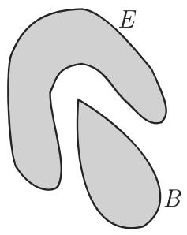
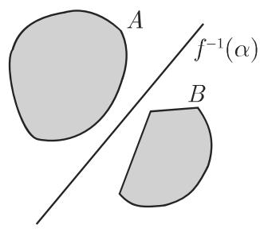
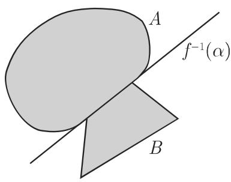

### 12.5 连续线性算子和泛函

#### 12.5.1 线性算子的有界性,范数和连续性

12.5.1.1 线性算子的有界性和范数

设 $X = ( X , \parallel \cdot \parallel )$ ）和 $Y = \left( Y , \parallel \cdot \parallel \right)$ 是赋范空间在下面的讨论中，用来强调空的范数记号 $\| \cdot \| _ { X }$ 中的标号 将被略去，这是因为从上下文看，所涉及的范数和空间并不会产生混淆．一个算子称作有界的，是指存在实数 $\lambda > 0$ 使得

$$
\| T (x) \| \leqslant \lambda \| x \|, \quad \forall x \in X.\tag{12.132}
$$

带常数入的有界算子将每个向量至多“放大”入倍，并且把 中的有界集变成中有界集，特别地 的单位球的像在 中是有界的．上述的这个性质正是有界线性算子的特征线性算子是连续的（参见第 873 12.2.3)，当且仅当它是有界的．(12.132) 成立的最小常数入称作算子 的范数，记作 $\lVert \boldsymbol { T } \rVert$ ，即

$$
\| T \| := \inf \{\lambda > 0: \| T x \| \leqslant \lambda \| x \| x \in X \}.\tag{12.133}
$$

对千连续线性算子，如下等式成立：

$$
\| T \| = \sup _ {\| x \| \leqslant 1} \| T x \| = \sup _ {\| x \| <   1} \| T x \| = \sup _ {\| x \| = 1} \| T x \|,\tag{12.134}
$$

此外，还有如下估计：

$$
\| T x \| \leqslant \| T \| \cdot \| x \|, \quad \forall x \in X.\tag{12.135}
$$

·设 为由积分

$$
(T x) (s) = y (s) = \int_ {a} ^ {b} K (s. t) x (t) \mathrm{d} t \quad (s \in [ a, b ])\tag{12.136}
$$

定义的 $\mathcal { C } ( [ a , b ] )$ 中的算子，这里 $\mathcal { C } ( [ a , b ] )$ 中范数为 (12.89e), $K ( s , t )$ 是矩形 $\{ a \leqslant$ $s , t \leqslant b \}$ 上的（复值）连续函数．那么 是将 $\mathcal { C } ( [ a , b ] )$ 映入 $\mathcal { C } ( [ a , b ] )$ 的有界线性算子，其范数是

$$
\| T \| = \max _ {s \in [ a, b ]} \int_ {a} ^ {b} | K (s, t) | \mathrm{d} t.\tag{12.137}
$$

12.5.1.2 线性连续算子空间

两个（连续）线性算子 $S , T : X \longrightarrow Y$ 之和 $U = S + T$ 及数乘 $\alpha T$ 由逐点定义：

$$
U (x) = S (x) + T (x), \quad (\alpha T) (x) = \alpha \cdot T (x), \quad \forall x \in X, \quad \forall \alpha \in \mathbb {F}.\tag{12.138}
$$

所有 的有界线性算子集合 $L ( X , Y )$ ，有时也记作 $B ( X , Y )$ ，赋以运算(12.138) 后是一个向量空间，这里 IITII (12.133) 是其上的范数．因此 $L ( X , Y )$ 是一个赋范空间，甚至当 为巴拿赫空间时它也是巴拿赫空间千是满足公理 $( \mathrm { V 1 } ) { \sim } ( \mathrm { V 8 } )$ (Nl)rv(N3) （参见第 855 12.1.1; 874 12.3.1).

如果 $X = Y$ ，则对于任意两个算子 $S , T \in L ( X , X ) = L ( X ) = \ B ( X )$ ，可以定义它们的乘积：

$$
(S T) (x) = S (T x), \quad \forall x \in X,\tag{12.139}
$$

其满足第 878 12.3.4 的公理 $( \mathrm { A 1 } ) { \sim } ( \mathrm { A 4 } )$ ，以及与范数的相容性条件 (12.100) ．一般说来， $L ( X )$ 不是交换的赋范代数，但若 是巴拿赫空间，则它也是巴拿赫代数．千是对千每个算子 $T \in L ( X )$ ，可以定义其幕次：

$$
T ^ {0} = I, \quad T ^ {n} = T ^ {n - 1} T \quad (n = 1, 2, \dots),\tag{12.140}
$$

这里 是恒等算子 $I x = x , \ \forall \ x \in X$ 千是

$$
\| T ^ {n} \| \leqslant \| T \| ^ {n} \quad (n = 1, 2, \dots),\tag{12.141}
$$

此外，总存在（有穷）极限

$$
r (T) = \lim _ {n \to \infty} \sqrt [ n ]{\| T ^ {n} \|}\tag{12.142}
$$

称作算子 的谱半径，并满足关系式

$$
r (T) \leqslant \| T \|, r (T ^ {n}) = [ r (T) ] ^ {n}, r (\alpha T) = | \alpha | r (T), r (T) = r (T ^ {*}),\tag{12.143}
$$

其中 $T ^ { * }$ 是 的伴随算子（参见第 894 12.6 以及 (12.159) ）．如果 $L ( X )$ 是完备的，那么当 $| \lambda | > r ( T )$ 时算子（ $( \lambda I - T ) ^ { - 1 }$ 可以表示成诺伊曼级数形式：

$$
(\lambda I - T) ^ {- 1} = \lambda^ {- 1} I + \lambda^ {- 2} T + \dots + \lambda^ {- n} T ^ {n - 1} + \dots ,\tag{12.144}
$$

并且当 $| \lambda | > r ( T )$ 时上述级数在 L(X) 中按算子范数收敛

12.5.1.3 算子序列的收敛性

1. 点点收敛

线性连续算子序列 $T _ { n } : X \longrightarrow Y$ 点点收敛千算子 $T : X \longrightarrow Y$ 意指

$$
T ^ {n} x \rightarrow T x \text {在} Y \text {中} \forall x \in X.\tag{12.145}
$$

2. 一致收敛

算子序列 $\{ T ^ { n } \} _ { n = 1 } ^ { \infty }$ 在 $L ( X , Y )$ 中按通常的范数收敛千 T,

$$
\| T _ {n} - T \| = \sup _ {\| x \| \leqslant 1} \| T _ {n} x - T x \| \rightarrow 0 \quad (n \rightarrow \infty)\tag{12.146}
$$

就是在 的单位球上一致收敛一致收敛蕴涵点点收敛，但逆命题一般不成立．

3. 应用

当插值节点数 趋千无穷时求积公式的收敛性、求和的性能原理、极限方法等

#### 12.5.2 巴拿赫空间中的连续线性算子

现在假定 是巴拿赫空间

1. 巴拿赫—施泰因豪斯 (Steinhaus) 定理（一致有界性原理）

这个定理是说，如果线性连续算子序列 $T _ { n }$ 满足条件：

a) 对千儿乎处处稠子集 $D \subset X$ 的每一点 $x ,$ ，序列 $\{ T _ { n } x \}$ 在 中有极限；

b) 存在一常数 所得 $\| T _ { n } \| \leqslant C , \ \forall \ n ;$ 那么序列 $T _ { n }$ 点收敛千某个线性连续算子．

2. 开映射定理

这个定理告诉我们，从 的线性连续算子映射 是开的，即 中每个开集 $G \subset X$ 的像集 $T ( G )$ 中的开集．

3. 闭图像定理

算子 $T : D _ { T } \longrightarrow Y$ （其中 $D _ { T } \subset X )$ 称作闭的，是指若 $x _ { n } \ \in \ D _ { T }$ ，在 X 中$x _ { n } \longrightarrow x _ { 0 }$ ，并且在 $T x _ { n }  y _ { 0 }$ ' $T x _ { 0 } = y _ { 0 }$ . 算子 是闭的充分必要条件是算在空间 $X \times Y$ 中的图像，即

$$
\Gamma_ {T} = \{(x, T x): x \in D _ {T} \}\tag{12.147}
$$

是闭的，这里 $( x , y )$ 表示集合 $X \times Y$ 的元．

如果闭算子 的定义域 $D _ { T }$ 是闭的，则 是连续的．

4. 黑林格—特普利茨（ Hellinger-Toeplitz) 定理

是希尔伯特空间 中的线性算子．如果 $( x , T y ) = ( T x , y ) \ \forall \ x , y \in H$ 那么 是连续的（其中 $( x , T y )$ 表示 中的标量积）．

5. 正线性算子的克莱因—洛桑诺夫斯基 (Losanovskij) 定理

如果 $X = ( X , X _ { + } , \parallel \cdot \parallel )$ 和 $Y = ( Y , Y _ { + } , \parallel \cdot \parallel )$ 是有序赋范空间，其中 $X _ { + }$ 是生成锥，那么所有正线性连续算子 （即 $T X _ { + } \subset Y _ { + } )$ 的集合 $L _ { + } ( X , Y )$ 是 $L ( X , Y )$ 中一个锥克莱因和洛桑诺夫斯基定理断定（参见 [12.20]）：如果 是有序巴拿赫空间， $X _ { + }$ 和 $Y _ { + }$ 是闭锥，并且 $X _ { + }$ 是生成锥，那么线性算子的正性意味着连续性

6. 逆算子

是任意两个赋范空间，并设 : X -------+ 是线性但不必连续的算子．如果 $T ( X ) = Y$ 并且存在常数 $m > 0$ 使得 $\| T x \| \geqslant m \| x \|$ , $\forall \ : x \in X$ 那么 $T$ 有连续逆 $T ^ { - 1 } : Y \longrightarrow X$ ，并且 $\| T ^ { - 1 } \| \leqslant \frac { 1 } { m }$ 这里考虑的情形是 (12.22) 中的一个特例（参见第 861 12.1.5.2)，因为在那里可以是 $D \neq X$ 和 $\mathcal { R } ( T ) \neq Y$

在巴拿赫空间 情形下，成立如下定理．

7. 逆算子连续性的巴拿赫定理

如果 的线性连续双射算子，那么逆算子 $T ^ { - 1 }$ 也是连续的．

这个定理的一个重要应用是，例如只要入I-T 是双射和满射， $( \lambda I - T ) ^ { - 1 }$ 必定是连续的这一事实在研究算子谱时具有重要意义（参见第 889 12.5.3.2)．它也可应用千线性微分方程初值问题解对千右端项和初始数据的连续依赖性．

8. 解对千右端项和初始数据的连续依赖性

下面的例子说明这一事实

·考虑初值问题

$$
\ddot {x} (t) + p _ {1} (t) \dot {x} + p _ {2} (t) x = q (t), t \in [ a, b ], x (t _ {0}) = \xi , \dot {x} _ {n} (t _ {0}) = \dot {\xi},\tag{12.148a}
$$

其中 $t _ { 0 } \in [ a , b ] , p _ { 1 } ( t ) , p _ { 2 } ( t ) \in \mathcal { C } ( [ a , b ] )$ ），那么对千每个右端项 $q ( t ) \in \mathcal { C } ( [ a , b ] )$ ）和每一对数 $\xi , \dot { \xi } ,$ (12.148a) 正好有一个解 属千 $ { \mathcal { C } } ^ { 2 } ( [ a , b ] )$ ）．解 在如下意义下连续依赖于 $q ( t ) , \xi$ 和 $\dot { \xi } { : }$ 如果给定 $q _ { n } \in \mathcal { C } ( [ a , b ] ) , \xi _ { n } , \dot { \xi } _ { n } \in \mathbb { R } ^ { 1 }$ ，并且 $x _ { n } \in \mathcal { C } ( [ a , b ] )$ ）表示

$$
\ddot {x} _ {n} (t) + p _ {1} (t) \dot {x} _ {n} + p _ {2} (t) x _ {n} (t) = q _ {n} (t), \quad x _ {n} (a) = \xi_ {n}, \dot {x} _ {n} (a) = \dot {\xi} _ {n}\tag{12.148b}
$$

的解， $n = 1 , 2 , \cdots$ ·，那么，

$$
\left.\begin{array}{c c}{{q _ {n} (t) \rightarrow q (t)}}&{{\text {在} \mathcal {C} ([ a, b ]) \text {中}}}\\{{\xi_ {n} \rightarrow \xi}}&{}\\{{\dot {\xi} _ {n} \rightarrow \dot {\xi}}}&{}\end{array}\right\} \mathrm{蕴涵} x _ {n} \rightarrow x \text {在} \mathcal {C} ^ {2} ([ a, b ]) \text {中}.\tag{12.148c}
$$

9. 逐次逼近法

考虑求解形如方程

$$
x - T x = y\tag{12.149}
$$

的逐次逼近法其中 是巴拿赫空间 中的连续线性算子， 是给定元．这一方法从任意初始元 $x _ { 0 }$ 开始，并通过公式

$$
x _ {n + 1} = y + T x _ {n} \quad (n = 0, 1, \dots)\tag{12.150}
$$

构建近似解序列 $\{ x _ { n } \}$ ．这个序列在 中收敛千 (12.149) 的解 $x ^ { * }$ ．这一方法的收敛，即 $x _ { n } \to x ^ { * }$ ，是基千级数 (12.144) 在入＝ 时的收敛

设 $\| T \| \leqslant q < 1$ ，那么如下结论成立：

a) 算子 $I - T$ 有连续逆算子， $\| ( I - T ) ^ { - 1 } \| \leqslant { \frac { 1 } { 1 - q } }$ ，并且对千每一 方程(12.149) 恰有一个解

b) 级数 (12.144) 收敛，并且其和正好是算子 $( I - T ) ^ { - 1 }$

c) 对千任意初始元 $x _ { 0 }$ , 如果级数 (12.144) 收敛，则方法 (12.150) 收敛千(12.149) 的唯一解 $x ^ { * }$ 并且有如下估计：

$$
\left\| x _ {n} - x ^ {*} \right\| \leqslant \frac {q ^ {n}}{1 - q} \left\| T x _ {0} - x _ {0} \right\| \quad (n = 1, 2, \dots).\tag{12.151}
$$

如下类型的方程

$$
x - \mu T x = y, \quad \lambda x - T x = y, \quad \mu , \lambda \in \mathbb {F}\tag{12.152}
$$

可以用类似的方法处理（参见第 821 11.2.2 以及 [12.9]).

#### 12.5.3 线性算子谱理论初步

12.5.3.1 算子的预解集和预解式

为了研究方程的可解性，人们试图把问题改写成形式

$$
(I - T) x = y,\tag{12.153}
$$

其中 是可能具有小范数的算子．由千 (12.43) (12.44)，这种形式特别适千应用泛函分析方法为了也能处理大值 $\lVert \boldsymbol { T } \rVert$ ，有必要在复巴拿赫空间中研究整个方程族

$$
(\lambda I - T) x = y, \quad x \in X, \quad \lambda \in \mathbb {C}.\tag{12.154}
$$

是巴拿赫空间 中线性但未必有界的算子．所有使得 $( \lambda I - T ) ^ { - 1 } \in$ $B ( X ) = L ( X )$ 的复数入的集合 $\varrho ( T )$ 称作预解集，而算子 $R _ { \lambda } = R _ { \lambda } ( T ) = ( \lambda I -$ $T ) ^ { - 1 }$ 称作预解式．现在设 是巴拿赫空间 中有界线性算子．那么下列命题成立：

a) 集合 $\varrho ( T )$ 是开的．更确切地说，如果 $\lambda _ { 0 } \in \varrho ( T )$ 和 $\lambda \in \mathbb { C }$ 满足不等式

$$
\left| \lambda - \lambda_ {0} \right| \leqslant \frac {1}{\left\| R _ {\lambda_ {0}} \right\|},\tag{12.155}
$$

那么 $R _ { \lambda }$ 存在，并且

$$
R _ {\lambda} = R _ {\lambda_ {0}} + (\lambda - \lambda_ {0}) R _ {\lambda_ {0}} ^ {2} + (\lambda - \lambda_ {0}) ^ {2} R _ {\lambda_ {0}} ^ {3} + \dots = \sum_ {k = 1} ^ {\infty} (\lambda - \lambda_ {0}) ^ {k - 1} R _ {\lambda_ {0}} ^ {k}.\tag{12.156}
$$

b) $\{ \lambda \in \mathbb { C } : | \lambda | > \| T \| \} \subset \varrho ( T )$ ．更确切地说， $\forall \lambda \in \mathbb { C } , | \lambda | > \| T \|$ ，算 $R _ { \lambda }$ 存在，并且

$$
R _ {\lambda} = - \frac {1}{\lambda} - \frac {T}{\lambda^ {2}} - \frac {T ^ {2}}{\lambda^ {3}} - \dots .\tag{12.157}
$$

c) 如果 $\lambda \to \lambda _ { 0 } ( \lambda , \lambda _ { 0 } \in \varrho ( T ) )$ ），则 $\| R _ { \lambda } - R _ { \lambda _ { 0 } } \| \to 0$ 而如果 $\lambda \longrightarrow \infty ( \lambda \in \varrho ( T ) )$ 则 $\| R _ { \lambda } \| \to 0$

d) 如果 $\lambda  \lambda _ { 0 }$ ，则 $\left\| \frac { R _ { \lambda } - R _ { \lambda _ { 0 } } } { \lambda - \lambda _ { 0 } } - R _ { \lambda _ { 0 } } ^ { 2 } \right\| \to 0 .$

e) 对千任意泛函 $f \in X ^ { * }$ （参见第 890 12.5.4.1) 和任意 $x \in X$ 函数 $F ( \lambda ) =$ $f ( R _ { \lambda } ( x ) )$ ）在 $\varrho ( T )$ 上是正则的．

f) 对千任意入 $\lambda , \mu \in \varrho ( T ) , \lambda \neq \mu$ ，有

$$
R _ {\lambda} R _ {\mu} = R _ {\mu} R _ {\lambda} = \frac {R _ {\lambda} - R \mu}{\lambda - \mu}.\tag{12.158}
$$

12.5.3.2 算子的谱

1. 谱的定义

集合 $\sigma ( T ) = \mathbb { C } \setminus \varrho ( T )$ 称作算子 的谱．由千 有连续逆（因此 (12.153)有连续依赖千右端的解），当且仅当 $1 \in \varrho ( T )$ ，从而对谱 $\sigma ( T )$ 必须有尽可能多的了解从预解集的性质直接可知谱 $\sigma ( T )$ 是闭集，并位千圆盘 $\{ \lambda \in \mathbb { C } : | \lambda | \leqslant \| T \| \}$ ｝，然而在很多情形下， $\sigma ( T )$ 比这个圆盘要小得多复巴拿赫空间上任意一个线性连续算子的谱绝不会是空集，并且

$$
r (T) = \sup _ {\lambda \in \sigma (T)} | \lambda |.\tag{12.159}
$$

对千各种特殊类型算子的谱可以说得更多些．如果 是有穷维空间 中的算子，并且方程（ $( \lambda I - T ) x = 0$ 仅有平凡解（即 $\lambda I - T$ 是内射），那么 $\lambda \in \varrho ( T )$ （即$\lambda I - T$ 是满射）．如果该方程在某个巴拿赫空间中有非平凡解，那么算子 $\lambda I - T$ 不是满射，并且 $( \lambda I - T ) ^ { - 1 }$ 一般是无法定义的．

数 $\lambda \in \mathbb { C }$ 称作线性算子 的本征值，是指方 $\lambda x = T x$ 有非平凡解所有这些非平凡解称作本征向量，或当 是函数空间（这在应用中常常出现）时，称作算的与入相关的本征函数由这些本征向量张成的子空间称作与入相关的本征空间（或特征空间）． 的所有本征值的集合 $\sigma _ { p } ( T )$ 称作算子 的点谱．

2. 与线性代数比较、剩余谱

线性代数中考虑的有穷维情形与泛函分析中讨论的无穷维情形之间的本质区别在千，在前者， $\sigma ( T ) = \sigma _ { p } ( T )$ 始终成立，而在后者，谱通常还包括不是 的本征值的点．如果 $\lambda I - T$ 既是内射又是满射，那么根据逆算子的连续性定理（参见第887 $1 2 . 5 . 2 , 7 . )$ $\lambda \in \varrho ( T )$ ．在有穷维情形，满射性自动从内射性推出，而无穷维情形则完全不一样，必须以非常不同的方式处理

a(T) 中所有使得 $\lambda I - T$ 为内射并且 $\operatorname { I m } ( \lambda I - T )$ 中稠的入构成的集合$\sigma _ { c } ( T )$ 称作连续谱，而所有使得 $\lambda I - T$ 为内射但其值域在 中不稠的入构成的集合 $\sigma _ { r } ( T )$ 称作算子 的剩余谱．

对千复巴拿赫空间 中的有界线性算子 $T ,$ ，有

$$
\sigma (T) = \sigma_ {p} \cup \sigma_ {c} (T) \cup \sigma_ {r} (T),\tag{12.160}
$$

其中右端各项两两不相交．

#### 12.5.4 连续线性泛函

12.5.4.1 定义

= IF 时线性映射称作线性泛函，或线性型．在下面的讨论中，对千希尔伯特空间，考虑复情形；而在其他情形，儿乎都是考虑实情形．所有连续线性泛函的巴拿赫空间 $L ( X ; \mathbb { F } )$ 称作 的伴随空间或对偶空间，记作 $X ^ { * }$ （有时也记作 $X ^ { \prime } )$ ）．线性泛函 $f \in X ^ { * }$ 在 $x \in X$ 处（在 IF 中）的值记作 $f ( x )$ ，往往也记作 $( x , f )$ 强调X和 $X ^ { * }$ ＊的双线性关系 也可比较里斯定理（参见 12.5.4.2).

■ A: $t _ { 1 } , t _ { 2 } , \cdots , t _ { n }$ 是区间 $[ a , b ]$ 的固定点．而 $c _ { 1 } , c _ { 2 } , \cdots , c _ { n }$ 是实数公式

$$
f (x) = \sum_ {k = 1} ^ {n} c _ {k} x (t _ {k})\tag{12.161}
$$

定义空间 $\mathcal { C } ( [ a , b ] )$ 上一连续线性泛函； $f$ 的范数是 $\textstyle \left\| f \right\| = \sum _ { k = 1 } ^ { n } \left| c _ { k } \right|$ (12.161) 在一个固定点 $t \in [ a , b ]$ 情形下的特例是 $\delta$ 泛函

$$
\delta_ {t} (x) = x (t) \quad (x \in \mathcal {C} ([ a, b ])).\tag{12.162}
$$

：设 $\varphi ( t )$ 是 $[ a , b ]$ 上的可积函数，那么

$$
f (x) = \int_ {a} ^ {b} \varphi (t) x (t) \mathrm{d} t\tag{12.163}
$$

在 $\mathcal { C } ( [ a , b ] )$ 和 $B ( [ a , b ] )$ 上都是连续线性泛函，并且两种情形下 $f$ 的范数都是 $\| f \| =$ $\int _ { a } ^ { b } | \varphi ( t ) | \mathrm { d } t$

12.5.4.2 希尔伯特空间中连续线性泛函、里斯表示定理

为一希尔伯特空间，其标量积为(·, $( \cdot , \cdot )$ ），那么每一元 $y \in H$ 由公式 $f ( x ) =$ $( x , y )$ 定义一连续线性泛函，其范数为 $\| f \| = \| y \|$ ．反之，如果 上一连续线性泛函，那么存在唯一元 $y \in H$ 使得

$$
f (x) = (x, y), x \in H,\tag{12.164}
$$

其中 $\| f \| = \| y \|$ ．这就是里斯表示定理根据这个定理空间 $H ^ { * }$ 等距同构，可以认为是等同

里斯表示定理暗示我们如何在任意赋范空间中引进正交概念．设 $A \subset X , A ^ { * } \subset$ $X ^ { * }$ ．那么集合

$$
A ^ {\perp} = \{f \in X: f (x) = 0, \forall x \in A \} \quad \text {和} \quad A ^ {* \perp} = \{x \in X: f (x) = 0, \forall f \in A ^ {*} \}\tag{12.165}
$$

分别称作 $A ^ { * }$ 的正交补．

12.5.4.3 $L ^ { p }$ 中连续线性泛函

设 $p \geqslant 1$ ．数 $q$ 称作 的共扼指数，是指 $\frac { 1 } { p } + \frac { 1 } { q } = 1$ ，这里假定当 $p = 1$ 时$q = \infty$

基千赫尔德积分不等式（参见第 40 1.4.2.12)，也可以在空间 $L ^ { p } ( [ a , b ] )$ ）中$\begin{array} { l } { ( 1 \leqslant p \leqslant \infty ) } \\ { \displaystyle \frac { 1 } { p } + \frac { 1 } { q } = 1 . \ \overset { = } { \div } } \end{array}$ （参见第 910 12.9.4) 考虑泛函 (12.163) ，这里 $\varphi \in L ^ { q } ( [ a , b ] )$ 并且千是其范数是

$$
\| f \| = \| \varphi \| = \left\{ \begin{array}{l l} \left(\int_ {a} ^ {b} | \varphi | ^ {q} \mathrm{d} t\right) ^ {\frac {1}{q}}, & 1 <   p \leqslant \infty , \\ \operatorname * {e s s} _ {t \in [ a, b ]} | \varphi |, & p = 1 \end{array} \right.\tag{12.166}
$$

（关千 $\exp | \varphi |$ 的定义参见第 910 (12.221)）．对千空间 $L ^ { p } ( [ a , b ] )$ ）中的连续线性泛函 $f ,$ ，存在唯一（按等价类）确定的元 $y \in L ^ { q } ( [ a , b ] )$ ）使得

$$
f (x) = (x, y) = \int_ {a} ^ {b} x (t) \overline {{{{y (t)}}}} \mathrm{d} t, \quad x \in L ^ {p} \quad \text {和} \quad \| f \| = \| y \| _ {q} = \left(\int_ {a} ^ {b} | y (t) | ^ {q} \mathrm{d} t\right) ^ {\frac {1}{q}}\tag{12.167}
$$

至千 $p = \infty$ 情形，见 [12.18].

#### 12.5.5 线性泛函的延拓

1. 准范数

为向量空间，映射 : X -------+厌称作准范数或拟范数，是指它具有如下性质：

(NHl) $p ( x ) \geqslant 0 ,$

(12.168)

$$
(\mathrm{NH2}) p (\alpha x) = | \alpha | p (x),\tag{12.169}
$$

$$
(\mathrm{NH} 3) p (x + y) \leqslant p (x) + p (y).\tag{12.170}
$$

比较 874 12.3.1, 表明准范数是范数当且仅当 $p ( x ) = 0$ 仅对 $x = 0$ 成立．

无论是从理论数学本身，还是数学应用中的实际需要，将给定在一线性子空间$X _ { 0 } \subset X$ 上的线性泛函延拓到整个空间（同时也是为避免无足轻重和无意义情形出现）并使之保持某些“好”的性质，都是一个具有基本重要性的问题．下面的定理确保该问题的解决

2. 哈恩巴拿赫定理的解析形式

IF 上的向量空间， 上的拟范数．设 $X _ { 0 }$ 是 的线性 $( \# \mathbb { F } = \mathbb { C }$ 情形为复，而在 $\mathbb { F } = \mathbb { R }$ 情形为实）子空间，并设 $f _ { 0 }$ 是 $X _ { 0 }$ 上（在 $\mathbb { F } = \mathbb { C }$ 情形为复值，而在 $\mathbb { F } = \mathbb { R }$ 情形为实值）线性泛函，满足关系

$$
\left| f _ {0} (x) \right| \leqslant p (x), \quad \forall x \in X _ {0}.\tag{12.171}
$$

那么存在 上一线性泛函 使得

$$
f (x) = f _ {0} (x), \quad \forall x \in X _ {0}, \quad | f (x) | \leqslant p (x), \quad \forall x \in X.\tag{12.172}
$$

于是f 是 $f _ { 0 }$ 在整个 上的延拓，并保持了关系 (12.171)．如果 $X _ { 0 }$ 。是赋范空间的线性子空间，并且 $f _ { 0 }$ 是 $X _ { 0 }$ 。上的连续线性泛函，那么 $p ( x ) = \| f _ { 0 } \| \cdot \| x \|$ 是 $X _ { 0 }$ 。上满足 (12.171) 的拟范数，由此得到连续线性泛函的哈恩—巴拿赫延拓定理．

两个重要的推论是：

(1) 对千每一元 $x \neq 0$ ，存在一泛函 $f \in X ^ { * }$ 使得 $f ( x ) = \| x \| , \| f \| = 1$

(2) 对千每一线性子空间 $X _ { 0 } ~ \subset ~ X$ 和 $x _ { 0 } \notin X _ { 0 }$ ，并且距离 $d = \operatorname* { i n f } _ { x \in X _ { 0 } } \left\| x - \right.$ $x _ { 0 } \| > 0$ 则存在 $f \in X ^ { * }$ 使得

$$
f (x) = 0, \quad \forall x \in X _ {0}, \quad f (x _ {0}) = 1 \text {和} \| f \| = {\frac {1}{d}}.\tag{12.173}
$$

#### 12.5.6 凸集的分离

1. 超平面

实向量空间 的一线性子集 $L \neq X$ 称作过 点的超子空间或超平面，是指存在元 $x _ { 0 } \in X$ 使得 $X = \operatorname* { l i n } ( x _ { 0 } , L )$ ．形如 $x + L ( L$ 为线性子集）的集合是放射线性流形（参见第 856 12.1.2)．如果 是一超子空间，则这些流形称作超平面．超子空间、超平面和线性泛函之间存在如下密切的关系：

a) 上线性泛函 的核 $f ^ { - 1 } ( 0 ) = \{ x \in X : f ( x ) = 0 \}$ 中一超子空间，对千每个数 $\lambda \in \mathbb { R }$ ，存在一元 $x _ { \lambda } \in X$ 使得 $f ( x _ { \lambda } ) = \lambda$ 并且 $f ^ { - 1 } ( \lambda ) = x _ { \lambda } + f ^ { - 1 } ( 0 )$

b) 对千任意给定的超子空间 $L \subset X$ 和 $x _ { 0 } \neq L , \ \lambda \neq 0 ( \lambda \in \mathbb { R } )$ ），总存在唯一确定的线性泛函 使得 $f ^ { - 1 } ( 0 ) = L$ ，并且 $f ( x _ { 0 } ) = \lambda$

在赋范空间情形， $f ^ { - 1 } ( 0 )$ 的闭性等价千泛函 的连续性．

2. 哈恩—巴拿赫延拓定理的儿何形式

是赋范空间， $x _ { 0 } ~ \in ~ X$ 并且 的一线性子空间那么对千每个与放射线性流形 $x _ { 0 } + L$ 不相交的非空凸开集 K, 必存在一闭的超子空间 使得$x _ { 0 } + L \subset H$ 并且 $H \cap K = \emptyset$

3. 凸集的分离

实赋范空间 中的两个子集 A,B 称作被一超平面分离，是指存在一泛函 $f \in$ $X ^ { * }$ 使得

$$
\sup _ {x \in A} f (x) \leqslant \inf _ {y \in B} f (y).\tag{12.174}
$$

千是若令 $\alpha = \operatorname* { s u p } _ { x \in A } f ( x )$ ，则 $f ^ { - 1 } ( \alpha )$ 就给出分离超平面，这意味着两个集合包含在不同的半空间：

$$
A \subset \{x \in X: f (x) \leqslant \alpha \} \text {和} B \subset \{x \in X: f (x) \geqslant \alpha \}.\tag{12.175}
$$

在图 12.5(b),(c) 中示出了由超平面分离的两种情形为了两个集合的分离，它们是否相交远非是决定性的因素事实上，图 12.5(a) 表示两集 没有被分离，尽管 不相交并且 是凸集．两个集合的凸性才是决定它们分离的最本质的要素在这种情形下，两个集合有可能会在分离超平面中含有公共点．

  
(a)

  
(b)  
12.5

  
(c)

如果 是赋范空间 中的凸集，具有非空内部 $\operatorname { I n t } ( A )$ ，并且 $B \subset X$ 是非空凸集使得 $\operatorname { I n t } ( A ) \cap B = \varnothing$ ，那么 可以被分离．在上述命题中，假设 $\operatorname { I n t } ( A ) \neq \varnothing$ 是无法省略的（参见 [12.3]，例 4.47)．一个（实线性）泛函 $f \in X ^ { * }$ 称作集合 在点$x _ { 0 }$ 的支撑泛函，是指存在一实数 $\lambda \in$ 匣使得 $f ( x _ { 0 } ) = \lambda$ 和 $A \subset \{ x \in X : f ( x ) \leqslant \lambda \}$ $f ^ { - 1 } ( \lambda )$ 称作点 $x _ { 0 }$ 处的支撑超平面．对千具有非空内部的凸集 ，在其边界上的每一点处都有支撑泛函

著名的库恩—塔克定理（参见第 1201 18.2) 也是基千凸集的分离，从该定理可导出求解凸优化问题极小值的行之有效的方法．

#### 12.5.7 第二伴随空间和自反空间

如果赋范空间 的伴随空间 $X ^ { * }$ 赋以范数 $\| f \| = \operatorname* { s u p } _ { \| x \| \leqslant 1 } | f ( x ) |$ ，则 $X ^ { * }$ 也是一个赋范空间从而也可以考虑 的笫二伴随空间，即 $( X ^ { * } ) ^ { * } = X ^ { * * }$ ＊．标准的嵌入映射

$$
J X \longrightarrow X ^ {* *}, \quad \text {其中} J x = F _ {x}, F _ {x} (f) = f (x), \forall f \in X ^ {*}\tag{12.176}
$$

是一个等距同构（参见第 874 12.3.1)，由此 X 等同千 $X ^ { * * }$ 的子集 $J ( X ) \subset X ^ { * * }$ 巴拿赫空间称作自反的，是指 $J ( X ) = X ^ { * * }$ ＊．由此可知标准嵌入映射是一个满射的范数等距同构

·每个有穷维巴拿赫空间和每个希尔伯特空间，以及空间 $L ^ { p } ( 1 \leqslant p < \infty )$ 都是自反的，而 $\mathcal { C } ( [ a , b ] ) , L ^ { 1 } ( [ 0 , 1 ] )$ ), co 则是非自反空间的例子．
