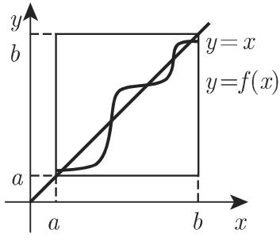
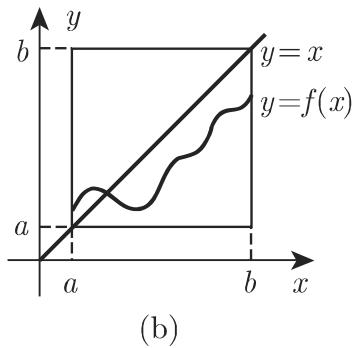

### 12.8 非线性算子

在非线性算子方程的理论中，最重要的方法是基千如下几个原理：

(1) 压缩映射原理、巴拿赫不动点定理（参见第 870 12.2.2.3 871 12.2.2.4). 这些原理的进一步改进，参见 [12.9], [12.12], [12.1s], [12.21 l.

(2) 牛顿方法推广至无穷维情形（参见第 1211 18.2.5.2 1234 19.1.1.2).

(3) 绍德尔不动点原理（参见第 902 12.8.4).

(4) 勒雷－绍德尔理论（参见第 903 12.8.5).

基千原理 (1) 和原理 (2) 的方法会导出有关解的存在性、唯一性、构造性等的信息，而基千原理 (3) 和原理 (4) 的方法一般来说，仅仅会得到解的定性表述如果能获知算子的进一步性质，则也可参阅第 903 12.8.6 和第 904 12.8.7.

#### 12.8.1 非线性算子的例子

一般来说，在 884 12.5.1 中讨论的线性算子的连续性和有界性之间的关系，对千非线性算子就不再成立在研究非线性边值问题和非线性积分方程这样的非线性算子方程时，经常会出现如下的非线性算子．在第 871 12.2.2.4 中描述的迭代方法可以用来成功求解非线性积分方程

1. 聂梅茨基算子

设Ω是 $\mathbb { R } ^ { n }$ 中的开可测子集（参见第 905 12.9.1), f : $\varOmega \times$ 厌\~为双变量函数，并且 $f ( x , s )$ 对几乎每个 相对千 连续，而对每个 相对千 则可测（卡拉泰奥多里条件）． ${ \mathcal { F } } ( varOmega )$ 上的非线性算子 定义为

$$
(\mathcal {N} u) (x) = f (x, u (x)) \quad (x \in \Omega),\tag{12.190}
$$

称作聂梅茨基算子．如果它把 $L ^ { p } ( \varOmega )$ 映入 $L ^ { q } ( \varOmega )$ , 是连续且有界的，这里$\frac { 1 } { p } + \frac { 1 } { q } = 1$ . 例如，当

$$
| f (x, s) | \leqslant a (x) + b | s | ^ {\frac {p}{q}}, \quad \text {其中} \quad a (x) \in L ^ {q} (\varOmega) (b > 0),\tag{12.191}
$$

或当 $f : \varOmega \times$ 屈连续时，就是这样的情形．仅在特殊情形下 是紧算子．

2. 哈默斯坦算子

设Ω是 $\mathbb { R } ^ { n }$ 相对紧子集， 是满足卡拉泰奥多里条件的函数，而 $K ( x , y )$ 是${ \overline { { \varOmega } } } \times { \overline { { \varOmega } } }$ 上的连续函数． ${ \mathcal { F } } ( varOmega )$ 上的非线性算子

$$
(\mathcal {H} u) (x) = \int_ {\Omega} K (x, y) f (y, u (y)) \mathrm{d} y (x \in \Omega)\tag{12.192}
$$

称作哈默斯坦算子． 可以写成 $\mathcal { H } = \mathcal { K } \cdot \mathcal { N } ,$ ，其中 $\mathcal { N }$ 为聂梅茨基算子，而 为由积分核 $K ( x , y )$ 确定的积分算子：

$$
(\mathcal {K} u) (x) = \int_ {\Omega} K (x, y) u (y) \mathrm{d} y \quad (x \in \Omega).\tag{12.193}
$$

如果核 $K ( x , y )$ 满足附加条件

$$
\int_ {\Omega \times \Omega} | K (x, y) | ^ {q} \mathrm{d} x \mathrm{d} y <   \infty ,\tag{12.194}
$$

并且函数 满足条件 (12.191)，那么 $L ^ { p } ( \varOmega )$ 上的连续紧算子．

3. 乌雷松算子

设 $\varOmega \subset \mathbb { R } ^ { n }$ 一开可测子集， $K ( x , y , s ) : \varOmega \times \varOmega \times$ 厌-------+民是三变量函数．那么 ${ \mathcal { F } } ( varOmega )$ 上的非线性算子

$$
(\mathcal {U} u) (x) = \int_ {\Omega} K (x, y, u (y)) \mathrm{d} y (x \in \Omega)\tag{12.195}
$$

称作 $\ntrianglelefteq$ 雷松算子．如果核 $K ( x , y , s )$ 满足适当的条件，则 分别是 $\mathcal { C } ( \varOmega )$ 和 $L ^ { p } ( \varOmega )$ 上的连续紧算子．

#### 12.8.2 非线性算子的可微性

X,Y 是巴拿赫空间， $D \subset X$ 是一开子集，并且 $T : D \longrightarrow Y$ 算子 $T$ 称作在点 $x \in D$ 弗雷歇可微的（或简称可微），是指存在线性算子 $L \in B ( X , Y )$ （一般说来，依赖千点 $x )$ ，使得

$$
T (x + h) - T (x) = L h + \omega (h), \text {其中} \| \omega (h) \| = o (\| h \|),\tag{12.196}
$$

或以等价的形式表示为

$$
\lim _ {\| h \| \to 0} \frac {\| T (x + h) - T (x) - L h \|}{\| h \|} = 0,\tag{12.197}
$$

即 $\forall \varepsilon > 0 , \exists \delta > 0$ 使得 $\left\| h \right\| \leqslant \delta$ 蕴涵着 $\| T ( x + h ) - T ( x ) - L h \| \leqslant \varepsilon \| h \|$ ．算通常记作 $T ^ { \prime } ( x ) , T ( x , \cdot )$ ），或 $T ^ { \prime } ( x ) ( \cdot )$ ，称作算子 在点 的弗雷歇导数值$\mathrm { d } T ( x ; h ) = T ^ { \prime } ( x ) h$ 称作算子 在点 （关千增量 h) 的弗雷歇微分．

算子在一点处的可微性蕴涵着其在该点的连续性．如果 $T \in B ( X , Y )$ ，即其本身是线性连续的，则 在每一点可微，并且其导数等千 T.

#### 12.8.3 牛顿方法

X,D 12.8.2 ，且 $T : D \longrightarrow Y$ 假定 的每一点处可微，千是对每一点 $x \in D$ 可对应一算子 $T ^ { \prime } ( x ) \in B ( X , Y )$ ，从而得到算子 $T ^ { \prime } : D \longrightarrow B ( X , Y )$ 假定算子 $T ^ { \prime }$ 上（按算子范数）连续，这时称 上连续可微．

假定 $X = Y$ ，并且集合 含有方程

$$
T (x) = 0\tag{12.198}
$$

的一解 $x ^ { * }$ ．进而假定算子 $T ^ { \prime } ( x )$ 对每一 $x \in D$ 连续可逆，因此 $[ T ^ { \prime } ( x ) ] ^ { - 1 } \in B ( X )$ 由千 (12.196) ，对千任意 $x _ { 0 } \in D _ { \cdot }$ 我们猜测元 $T ( x _ { 0 } ) = T ( x _ { 0 } ) – T ( x ^ { * } )$ ）和 $T ^ { \prime } ( x _ { 0 } ) ( x _ { 0 } -$ $x ^ { * } )$ 彼此相差“不远”，因此由

$$
x _ {1} = x _ {0} - [ T ^ {\prime} (x _ {0}) ] ^ {- 1} T (x _ {0})\tag{12.199}
$$

确定的元 $x _ { 1 }$ 是 $x ^ { * }$ （在给定假设下）的近似．从任意 $x _ { 0 }$ 出发，可以构造出所谓牛顿近似序列

$$
x _ {n + 1} = x _ {n} - [ T ^ {\prime} (x _ {n}) ] ^ {- 1} T (x _ {n}) (n = 0, 1, \dots).\tag{12.200}
$$

文献中有许多熟知的定理来讨论这一方法的特点和收敛性质．这里我们仅列出一个最重要的结果，以说明牛顿方法的主要性质和优点： $\forall \ \varepsilon \in \left( 0 , 1 \right)$ ，存在 中一球$B = B ( x _ { 0 } ; \delta ) , \delta = \delta ( \varepsilon )$ ，使得所有点 $x _ { n }$ 位千 $B ,$ ，并且牛顿序列收敛千 (12.198)解 $x ^ { * }$ ．此外， $\| x _ { n } - x _ { 0 } \| \leqslant \varepsilon ^ { n } \| x _ { 0 } - x ^ { * } \|$ ，这是一个很实用的误差估计．

如果在 (12.200) 中代替 $[ T ^ { \prime } ( x _ { n } ) ] ^ { - 1 }$ 使用 $[ T ^ { \prime } ( x _ { 0 } ) ] ^ { - 1 } , \forall n = 1 , 2 , \cdot \cdot \cdot$ ·,则得到改进的牛顿方法．至千牛顿方法的收敛速度的进一步估计，以及对千初始点 $x _ { 0 }$ 选择的（一般是敏感的）依赖性研究可参阅 [12. 7], [12.13], [12.15], [12.21 l.

·雅可比矩阵或泛函矩阵 给定开集 $D \subset \mathbb { R } ^ { n }$ 上的非线性算子 $T = F : D \longrightarrow \mathbb { R } ^ { m }$ 其中 $F _ { 1 } , F _ { 2 } , \cdots , F _ { m }$ 为 个非线性坐标函数， $x _ { 1 } , x _ { 2 } , \cdots , x _ { n }$ 为 个独立变量．那么

$$
F (x) = \left[ \begin{array}{c} F _ {1} (x) \\ F _ {2} (x) \\ \vdots \\ F _ {m} (x) \end{array} \right] \in \mathbb {R} ^ {m}, \quad \forall x = (x _ {1}, x _ {2}, \dots , x _ {n}) \in D.\tag{12.201}
$$

如果坐标函数 $F _ { i } ( i = 1 , 2 , \cdots , m )$ 的偏导数 ${ \frac { \partial F _ { i } } { \partial x _ { k } } } ( k = 1 , 2 , \cdot \cdot \cdot , n )$ 上存在且连续那么映射（算子） 的每个点上可微，并且其在点 $x = ( x _ { 1 } , x _ { 2 } , \cdot \cdot \cdot , x _ { n } ) \in$ 的导数是线性算子 $F ^ { \prime } ( x ) : \mathbb { R } ^ { n }$ -----+ 尺气相应的矩阵表达为

$$
F ^ {\prime} (x) = \left( \begin{array}{c c c c} \frac {\partial F _ {1}}{\partial x _ {1}} & \frac {\partial F _ {1}}{\partial x _ {2}} & \dots & \frac {\partial F _ {1}}{\partial x _ {n}} \\ \frac {\partial F _ {2}}{\partial x _ {1}} & \frac {\partial F _ {2}}{\partial x _ {2}} & \dots & \frac {\partial F _ {2}}{\partial x _ {n}} \\ \vdots & \vdots & & \vdots \\ \frac {\partial F _ {m}}{\partial x _ {1}} & \frac {\partial F _ {m}}{\partial x _ {2}} & \dots & \frac {\partial F _ {m}}{\partial x _ {n}} \end{array} \right).\tag{12.202}
$$

导数 $F ^ { \prime } ( x )$ (m,n) 阶矩阵，称作 的雅可比矩阵或泛函矩阵．应用牛顿迭代方法（参见第 1250 19.2.2.2) 求解非线性方程组，或者刻画函数独立性（参见159 2.18.2.6, 3) 时就出现雅可比矩阵这种特殊情形．

当 $m = n$ 时，就得到所谓的泛函行列式或雅可比行列式，简记作

$$
\frac {D (F _ {1} , F _ {2} , \cdots , F _ {m})}{D (x _ {1} , x _ {2} , \cdots , x _ {n})}.\tag{12.203}
$$

这个行列式大多用千内部数学问题的求解（例如，也可参见第 712 8.5.3.2).

#### 12.8.4 绍德尔不动点定理

: D -------+ 是定义在巴拿赫空间 的子集 上的一非线性算子．方程$x = T ( x )$ 是否至少有一个解，这个并非不足道的问题可以回答如下：如果 $X = \mathbb { R }$ $D = [ - 1 , 1 ]$ ，那么每个将 映入 的连续函数在 中有一个不动点．如果任意有穷维赋范空间 $( \dim X \geqslant 2 )$ ，则布劳威尔不动点定理成立．

(1) 布劳威尔不动点定理 是有穷维赋范空间的一非空闭有界凸子集．如是将 映入自身的连续映射，则 中至少有一个不动点．

在任意无穷维巴拿赫空间情形的答案则由绍德尔不动点定理给出．

(2) 绍德尔不动点定理 是巴拿赫空间的一非空闭有界凸子集． 如果T:D 是连续且紧的（从而是全连续的），并且将 映入自身，那么中至少有一个不动点

使用该定理，例如，可以证明只要假定右端连续，则初值问题（如第 872(12.70) ）总有局部解

#### 12.8.5 勒雷-绍德尔理论

是全连续算子，基千映射度的性质，人们发现了方程 $x = T ( x )$ 和 $( I +$ $T ) ( x ) = y$ 解的存在性的进一步原理这个原理可以成功用千证明非线性边值问题解的存在性．这里我们仅提及这一理论在实际问题中最有用的一些结果，并且为简单起见，选择了一种避免使用映射度概念的表述．

勒雷－绍德尔定理：设 是实巴拿赫空间 的开有界集， $T : { \overline { { D } } } \longrightarrow X$ 是一全连续算子．设 $y \in D$ 使得对千每个 $x \in \partial D , \ \lambda \in [ 0 , 1 ]$ ，有 $x + \lambda T ( x ) \neq y$ , 其中8D 的边界那么方程 $( I + T ) ( x ) = y$ 至少有一个解．

这一定理的如下形式在应用中是非常有用的：

是巴拿赫空间中的全连续算子．如果方程族

$$
x = \lambda T (x) (\lambda \in [ 0, 1 ])\tag{12.204}
$$

的所有解一致有界，即存在 $c > 0$ 使得对千满足 (12.204) 的所有入和 ，有先验估计 $\| x \| \leqslant c ,$ 那么方程 $x = T ( x )$ 有解．

#### 12.8.6 正非线性算子

为了成功地应用绍德尔不动点定理，要求适当选择一个集合，使得所考虑的算子将之映入其自身在应用中，尤其是在非线性边值问题理论中，常常考虑有序赋范函数空间和保持相应锥不变的正算子，或者保序增算子，即若 $x \leqslant y \Longrightarrow T ( x ) \leqslant$ $T ( y )$ ．如果不至千混淆（例如，参见第 904 12.8.7)，这些算子也可以称作单调算子．

设 $X ~ = ~ ( X , X _ { + } , \| ~ \cdot ~ \| )$ |）是一个有序巴拿赫空间， $X _ { + }$ 十是一闭锥，而 $[ a , b ]$ 是的一序区间如果 $X _ { + }$ 十是规范锥，并且 是全连续（不一定单调）算子，满足$T ( [ a , b ] ) \subset [ a , b ]$ ．那么 $[ a , b ]$ 中至少有一个不动点（图 12.6(b)).

注意，如果 是定义在 X 的 (o) 区间（序区间）［a, b] 上的单调增算子，并且将两个端点 a,b 映入 $[ a , b ]$ ，即满足条件 $T ( a ) \geqslant a , T ( b ) \leqslant b ,$ ，那么条件 $T ( [ a , b ] ) \subset [ a , b ]$ 自动成立千是两个序列

$$
x _ {0} = a, \quad x _ {n + 1} = T (x _ {n}) (n \geqslant 0) \text {和} y _ {0} = b, \quad y _ {n + 1} = T (y _ {n}) (n \geqslant 0)\tag{12.205}
$$

是适定的，即 $x _ { n } , y _ { n } \in [ a , b ] , \ n \geqslant \ 0$ ．它们分别是单调增序列和单调减序列，即$a = x _ { 0 } \leqslant x _ { 1 } \leqslant \cdots \leqslant x _ { n } \leqslant \cdots$ .和 $b = y _ { 0 } \geqslant y _ { 1 } \geqslant \cdots \geqslant y _ { n } \geqslant \cdots .$ 的不动点$x _ { * } , x ^ { * }$ 分别叫作最小不动点和最大不动点，是指对千 $T$ 的任意不动点 $z ,$ 分别有不等式 $x _ { * } \leqslant z$ 和 $z \leqslant x ^ { * }$

  
12.6

现在有如下命题（图 12.6(a)）：设 是有序巴拿赫空间， $X _ { + }$ 是闭锥， $D \subset X$ $T : D \longrightarrow X$ 是连续单调算子．设 $[ a , b ] \subset D$ 使得 $T ( a ) \geqslant a$ 和 $T ( b ) \leqslant b$ 那么$T ( [ a , b ] ) \subset [ a , b ]$ ，并且如果下列条件之一满足，则算子 $[ a , b ]$ 中有不动点：

a) $X _ { + }$ 规范锥，且 是紧算子；

b) $X _ { + }$ 是正则锥．

千是 (12.205) 中定义的序列 $\{ x _ { n } \} _ { n = 0 } ^ { \infty }$ 和 $\{ y _ { n } \} _ { n = 0 } ^ { \infty }$ 分别收敛千 $T$ 在 $[ a , b ]$ 中最小和最大不动点

上解和下解的概念就是基千以上结论（参见 [12.7], [12.13], [12.14])

#### 12.8.7 巴拿赫空间中的单调算子

1. 特殊性质

X,Y 为赋范空间， $T : D \subset X \longrightarrow Y$ 称作在点 $x _ { 0 } \in D$ 半连续，是指对千每个（按 的范数）收敛千 $x _ { 0 }$ 的序列 $\{ x _ { n } \} _ { n = 1 } ^ { \infty } \subset D _ { : }$ 序列 $\{ T x _ { n } \} _ { n = 1 } ^ { \infty }$ 在 $Y$ 中弱收敛千 $x _ { 0 } , \ T$ 称作在 上半连续，是指 的每一点半连续本节中介绍实分析中熟知的单调性概念的另一种推广．设 是一实巴拿赫空间， $X ^ { * }$ ＊是其对偶，$D \subset X , T : D \longrightarrow X ^ { * }$ 是一非线性算子． 称作单调的，是指 $\forall x , y \in D$ ，成立不等式 $( T ( x ) - T ( y ) , x - y ) \geqslant 0$ ．如果 $X = H$ 是希尔伯特空间，那么(·,.)意指标量积，而在任意巴拿赫空间情形，则可参阅第 890 12.5.4.1 中介绍的记号．算子 称作强单调的，是指存在常数 $c > 0$ 使得 $( T ( x ) - T ( y ) , x - y ) \geqslant c \| x - y \| ^ { 2 } , \forall x , y \in D$ 算子 $T : X \longrightarrow X ^ { * }$ 称作强制的，是指它满足 $\operatorname* { l i m } _ { \| x \|  \infty } \frac { ( T ( x ) , x ) } { \| x \| } = \infty$

2. 存在性定理

这里仅通过举例说明含单调算子的算子方程解的存在性：设 是实可分巴拿赫空间，如果算子 $T : X \longrightarrow X ^ { * }$ 是单调半连续且强制的 $( D _ { T } = X )$ ，那么方程

$T ( x ) = f$ 对千任意 $f \in X ^ { * }$ 有解．此外，如果算子 $T$ 还是强单调的，那么其解是唯一的．在这种情形下，逆算子 $T ^ { - 1 }$ 也存在

对千希尔伯特空间 中单调半连续算子 $T : H \longrightarrow H , D _ { T } = H$ ，有 $\mathrm { I m } ( I +$ $T ) = H $ ，这里 $( I + T ) ^ { - 1 }$ 连续．如果假定 是强单调的，那么 $T ^ { - 1 }$ 是双射，并且$T ^ { - 1 }$ 是连续的求解与希尔伯特空间中单调算子 有关的方程 $T ( x ) = 0$ 的构造性近似方法则是基千伽辽金方法的思想（参见第 1266 19.4.2.2 [12.11], [12.21]).据此理论也可处理集值算子 $T : X \longrightarrow 2 ^ { X ^ { * } }$ ：通过 $( f - g , x - y ) \geqslant 0 , \forall x , y \in$ $D _ { T } , \ f \in T ( x ) , g \in T ( y )$ ，把单调性概念推广到集值算子．
