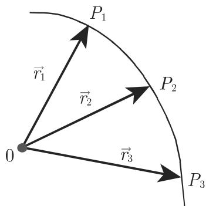
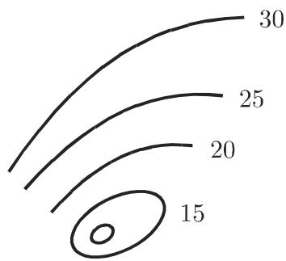
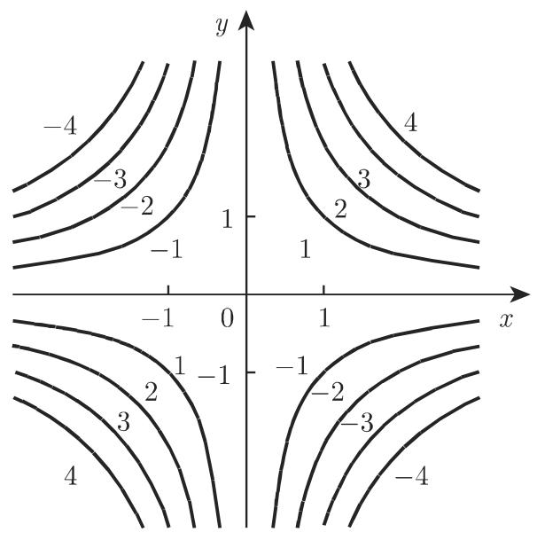
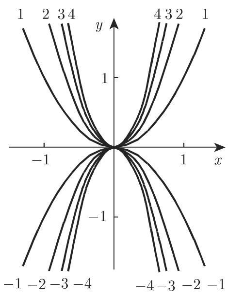
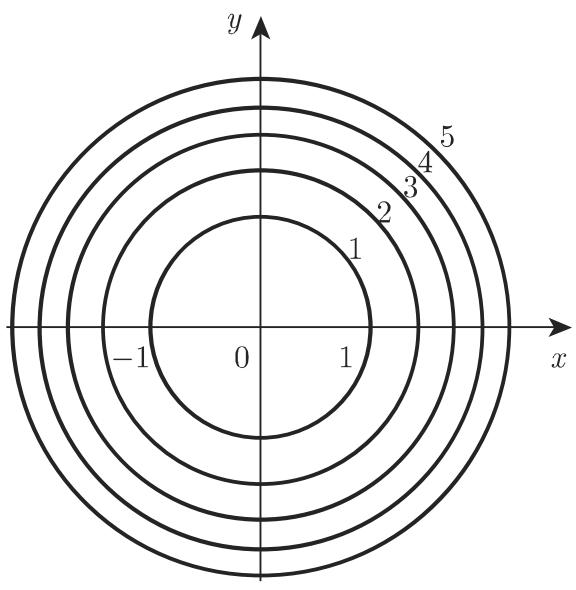
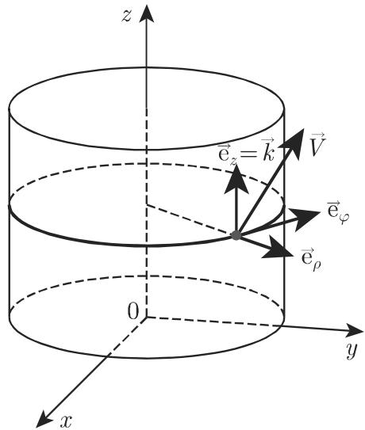
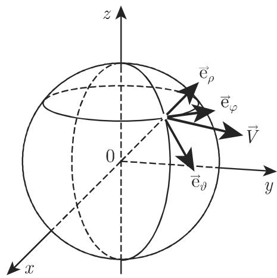
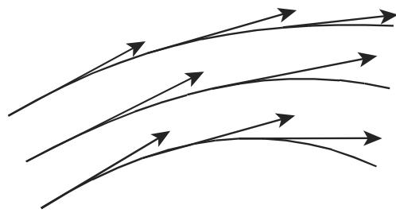

### 13.1 向量场理论的基本概念

#### 13.1.1 一个标量变量的向量函数

13.1.1.1 定义

1. 一个标量变量 的向量函数

一个标量变量 的向量函数是一个向量 ${ \vec { a } } ,$ ，其分量是 的实函数：

$$
\vec {a} = \vec {a} (t) = a _ {x} (t) \vec {e} _ {x} + a _ {y} (t) \vec {e} _ {y} + a _ {z} (t) \vec {e} _ {z}.\tag{13.1}
$$

对向量 $\vec { a } ( t )$ ，可按分量地定义其极限、连续性、可微性等概念．

2. 向量函数的速端曲线

把向量函数 $\vec { a } ( t )$ 视作点 的位置或径向量 $\vec { r } = \vec { r } ( t )$ ，则当 变化时，这个函数就描绘了一条空间曲线（图 13.1)．这条空间曲线被称为向量函数 $\vec { a } ( t )$ 的速端曲(hodograph).

  
13.1

13.1.1.2 向量函数的导数

(13.1) 关千 的导数也是 的一个向量函数：

$$
\frac {\mathrm{d} \vec {a}}{\mathrm{d} t} = \lim _ {\Delta t \rightarrow 0} \frac {\vec {a} (t + \Delta t) - \vec {a} (t)}{\Delta t} = \frac {\mathrm{d} a _ {x} (t)}{\mathrm{d} t} \vec {e} _ {x} + \frac {\mathrm{d} a _ {y} (t)}{\mathrm{d} t} \vec {e} _ {y} + \frac {\mathrm{d} a _ {z} (t)}{\mathrm{d} t} \vec {e} _ {z}.\tag{13.2}
$$

径向量的导数— $\frac { \mathrm { d } { \vec { r } } } { \mathrm { d } t }$ 的儿何描述是在 点处的一个指向速端曲线切线方向的向最（图 13.2)．其长度依赖千参数 的选取．如果 是时间，则巩t) 描述点 在空间的运动（所述空间曲线是其路径）， $\frac { \mathrm { d } { \vec { r } } } { \mathrm { d } t }$ 具有这个运动的方向和大小．如果 $t = s$ 是从某点开始度量的这条空间曲线的弧长，则显然 $\left| \frac { \mathrm { d } \vec { r } } { \mathrm { d } s } \right| = 1$

  
13.2

  
13.3

13.1.1.3 向量的微分法则

$$
\frac {\mathrm{d}}{\mathrm{d} t} (\vec {a} \pm \vec {b} \pm \vec {c}) = \frac {\mathrm{d} \vec {a}}{\mathrm{d} t} \pm \frac {\mathrm{d} \vec {b}}{\mathrm{d} t} \pm \frac {\mathrm{d} \vec {c}}{\mathrm{d} t},\tag{13.3a}
$$

$$
\frac {\mathrm{d}}{\mathrm{d} t} (\varphi \vec {a}) = \frac {\mathrm{d} \varphi}{\mathrm{d} t} \vec {a} + \varphi \frac {\mathrm{d} \vec {a}}{\mathrm{d} t} \quad (\varphi \text {是} t \text {的一个标量函数}),\tag{13.3b}
$$

$$
\frac {\mathrm{d}}{\mathrm{d} t} (\vec {a} \vec {b}) = \frac {\mathrm{d} \vec {a}}{\mathrm{d} t} \vec {b} + \vec {a} \frac {\mathrm{d} \vec {b}}{\mathrm{d} t},\tag{13.3c}
$$

$$
\frac {\mathrm{d}}{\mathrm{d} t} (\vec {a} \times \vec {b}) = \frac {\mathrm{d} \vec {a}}{\mathrm{d} t} \times \vec {b} + \vec {a} \times \frac {\mathrm{d} \vec {b}}{\mathrm{d} t} \quad (\text {因子不必可交换}),\tag{13.3d}
$$

$$
\frac {\mathrm{d}}{\mathrm{d} t} \vec {a} [ \varphi (t) ] = \frac {\mathrm{d} \vec {a}}{\mathrm{d} \varphi} \cdot \frac {\mathrm{d} \varphi}{\mathrm{d} t} \quad (\text {链规则}).\tag{13.3e}
$$

如果 $| \vec { a } ( t ) | =$ 常数，即 $\begin{array} { r } { \vec { a } ^ { 2 } ( t ) = \vec { a } ( t ) \cdot \vec { a } ( t ) = } \end{array}$ 常数，则从 (13.3c) 即得 $\vec { a } \cdot \frac { \mathrm { d } \vec { a } } { \mathrm { d } t } = 0 .$ ，即$\frac { \mathrm { d } { \vec { a } } } { \mathrm { d } t }$ 和 相互垂直．这个事实的例子如下：

：平面中一个圆周的径向量和切向量；

：球而上一条曲线的位置向量和切向量．此时速端曲线是一条球面曲线．

13.1.1.4 向量函数的泰勒展开

$$
\vec {a} (t + h) = \vec {a} (t) + h \frac {\mathrm{d} \vec {a}}{\mathrm{d} t} + \frac {h ^ {2}}{2 !} \frac {\mathrm{d} ^ {2} \vec {a}}{\mathrm{d} t ^ {2}} + \dots + \frac {h ^ {n}}{n !} \frac {\mathrm{d} ^ {n} \vec {a}}{\mathrm{d} t ^ {n}} + \dots .\tag{13.4}
$$

一个向量函数用泰勒级数的展开只是在该级数收敛时才有意义．因为极限是按分量来定义的，因此收敛性可以按分量来验证，所以具有向量项的这个级数的收敛性可以用与具有复数项级数的收敛性（参见第 980 14.3.2) 完全一样的方法来确定因而具有向量项的一个级数的收敛性被归结为具有标量项的级数的收敛性．一个向量函数 $\vec { a } ( t )$ 的微分由下式定义：

$$
\mathrm{d} \vec {a} = \frac {\mathrm{d} \vec {a}}{\mathrm{d} t} \Delta t.\tag{13.5}
$$

#### 13.1.2 标量场

13.1.2.1 标量场或标量点函数

如果对千空间一个子集的每个点 都指定一个数（标量值） ，则记为

$$
U = U (P),\tag{13.6a}
$$

并称 (13.6a) 为一个标量场 (scalar field) （或标量函数 (scalar function)).

·一个物体的温度、密度、位势等都是标量场的例子．

一个标量场 $U = U ( P )$ 可以被视作

$$
U = U (\vec {r}),\tag{13.6b}
$$

其中 $\vec { r }$ 是具有一个给定极 （参见第 243 3.5.1.1, 6.) 的点 的位置向量．

13.1.2.2 标量场的一些重要特殊情形

1. 平面场

如果所论函数只是对千空间中一个平面的点有定义，则它就是一个平面场．

2. 中心场

如果一个函数在离一个称为中心的固定点 $C ( \vec { r } _ { 1 } )$ ）有相同距离的所有点有相同的值，那么它被称为是一个中心对称场 (central symmetrc field)，或中心场(central field) ，或球面场 (spherical field) ．该函数 仅依赖千距离 ${ \overline { { C P } } } = | { \vec { r } } |$

$$
U = f (| \vec {r} |).\tag{13.7a}
$$

·一个点状源的强度场，例如在极点处一个点光源的亮度场，可以用离光源的距离 $| \vec { r } | = r$ 被描述为

$$
U = \frac {c}{r ^ {2}} \quad (c \text {为常数}).\tag{13.7b}
$$

3. 轴向场

如果函数 在位千离一条直线（场的轴）有相同距离的所有点 处有相同的值，那么该场被称为是一个柱面对称场 (cylindrically symmetric field) ，或轴对称场(axially symmetric field) ，或简单地称为轴向场 (axiial field).

13.1.2.3 标量场的坐标表示

如果空间的一个子集的点用它们的坐标，例如笛卡儿坐标、柱面坐标，或球面坐标给出，则一般地，相应的标量场 (13.6a) 由一个 个变量的函数所表示：

$$
U = \varPhi (x, y, z), \quad U = \varPsi (\rho , \varphi , z) \quad \text {或} \quad U = \chi (r, \vartheta , \varphi).\tag{13.8a}
$$

在平面场的情形，两个变量的函数就足够了．它有笛卡儿坐标和极坐标的形式：

$$
U = \Phi (x, y) \quad {\text {或}} \quad U = \Psi (\rho , \varphi).\tag{13.8b}
$$

一般地 (13.8a) (13.8b) 中的函数被假设是连续的，也许除了在间断性的某些点、曲线或曲面上．这些函数有形式：

对千中心场

$$
U = U \big (\sqrt {x ^ {2} + y ^ {2} + z ^ {2}} \big) = U \big (\sqrt {\rho^ {2} + z ^ {2}} \big) = U (r),\tag{13.9a}
$$

其中坐标系的原点是场的极点 (pole),

对千轴向场

$$
U = U \big (\sqrt {x ^ {2} + y ^ {2}} \big) = U (\rho) = U (r \sin \vartheta),\tag{13.9b}
$$

其中 轴是场的轴．

用球面坐标处理中心场最方便，用柱面坐标处理轴向场最方便．

13.1.2.4 一个场的等值面和等值线

1. 等值面

一个等值面是空间中所有点 的集合，在这些点处函数 (13.6a) 有常数值

$$
U = U (P) = \text {常数}.\tag{13.10a}
$$

不同的常数 $U _ { 0 } , U _ { 1 } , U _ { 2 } , \cdots$ ·定义不同的等值面．对千每个点都存在一个等值面通过该点除非在该点处函数没有定义在目前所用的 个坐标系中的等值面方程是

$$
U = \Phi (x, y, z) = \text {常数}, \quad U = \Psi (\rho , \varphi , z) = \text {常数}, \quad U = \chi (r, \vartheta , \varphi) = \text {常数}.\tag{13.10b}
$$

·不同场的等值面的例子：

$$
\begin{array}{l l} {{\mathbf {A}: U = \vec {c r} = c _ {x} x + c _ {y} y + c _ {z} z:}} & {{\quad \text {平行平面}.}} \\ {{\mathbf {B}: U = x ^ {2} + 2 y ^ {2} + 4 z ^ {2}:}} & {{\quad \text {在相同位置的相似椭球面}.}} \\ {{\mathbf {C}: \text {中心场}:}} & {{\quad \text {同心球面}.}} \\ {{\mathbf {D}: \text {轴向场}:}} & {{\quad \text {同轴柱面}.}} \end{array}
$$

2. 等值线

在平面场中等值线替代了等值面．它们满足方程

$$
U = \text { 常数 }.\tag{13.11}
$$

通常，对千 的相等的间隔来画等值线它们中的每一条都被标以相应的值（参见第 915 页图 13.3).

·熟知的例子有天气图上的等压线和地形图上的等高线．

在一些特别的情形，等值而退化为一些点或线等值线退化为一些分离的点

·下列一些场的等值线被展示在图 13.4 中： (a) $U = x y$ (b) $U = { \frac { y } { x ^ { 2 } } }$ （ c) $U =$ $x ^ { 2 } + y ^ { 2 } = \rho ^ { 2 }$ (d) $U = { \frac { 1 } { \rho } }$

  
(b)

(a)  
  
(c)

  
13.4  
(d)

#### 13.1.3 向量场

13.1.3.1 向量场或向量点函数

如果对千空间一个子集的每个点 都指定一个向量 $\vec { V }$ ，则记为

$$
\vec {V} = \vec {V} (P),\tag{13.12a}
$$

并称 (13.12a) 为一个向量场 (vector field).

·运动中流体的速度场、力场、磁强度场和电强度场都是向量场的例子．

一个向量场 $\vec { V } = \vec { V } ( P )$ 可以被视作为一个向最函数

$$
\vec {V} = \vec {V} (\vec {r}),\tag{13.12b}
$$

其中 $\vec { r }$ 是具有一个给定极 的点 的位置向量．如果 $\vec { r }$ 以及 $\vec { V }$ 的所有的值位千一个平面中，则称此场为一个平面向量场（参见第 254 3.5.2).

13.1.3.2 一些重要的向量场

1. 中心向量场

在一个中心向量场中，所有向量 $\vec { V }$ 都位千通过一个称为中 $\aleph _ { \aleph }$ (center) 的固定点（图 13.5(a) ）直线上．

把极点置为该中心，则向量场由公式

$$
\vec {V} = f (\vec {r}) \vec {r}\tag{13.13a}
$$

所表示，该场的所有向量与径向量 $\vec { r }$ 有同一方向用公式

$$
\vec {V} = \varphi (\vec {r}) \frac {\vec {r}}{r} (r = | \vec {r} |).\tag{13.13b}
$$

  
(a)

  
(b)  
13.5

  
(c)

定义向量场常会有某些便利其中 $\vert \varphi ( \vec { r } ) \vert$ 是向量 $\vec { V }$ 的长度，而 $\frac { \vec { r } } { r }$ 是 $\vec { r }$ 方向的单位向量

2. 球面向量场

球面向量场是中心向量场的一个特殊情形，其中向量 $\vec { V }$ 的长度仅依赖千距离同（图 13.5(b) ）．一个点状质量或一个点电荷的牛顿力场 (Newton force field) 和库仑力场 (Coulomb force field) 是球面向量场的例子：

$$
\vec {V} = \frac {c}{r ^ {3}} \vec {r} = \frac {c}{r ^ {2}} \frac {\vec {r}}{r} (c \mathrm{是常数}).\tag{13.14}
$$

平面球面向量场的特殊情形被称为一个圆场(circular field).

3. 柱面向量场

a) 所有向量 $\vec { V }$ 都位千一些与某一直线（称为轴 (axis)）相交并垂直千它的直线上，并且

b) 离轴有同样距离的点处的所有向量 $\vec { V }$ 都有同样长度，并且它们或者指向轴，或者背离轴（图 13.5(c)).

把极点置千平行千单位向量 $\vec { c }$ 的轴上，则向量场有形式

$$
\vec {V} = \varphi (\rho) \frac {\vec {r} ^ {*}}{\rho},\tag{13.15a}
$$

其中 ${ \vec { r } } ^ { * }$ 是 $\vec { r }$ 在垂直千轴的一个平面上的投影：

$$
\vec {r} ^ {*} = \vec {c} \times (\vec {r} \times \vec {c}).\tag{13.15b}
$$

用垂直千轴的平而截这个向量场，总是得到相同的圆场．

13.1.3.3 向量场的坐标表示

1. 笛卡儿坐标系中的向量场

向量场 (13.12a) 可以由标量场 $V _ { 1 } ( \vec { r } ) , V _ { 2 } ( \vec { r } )$ 和 $V _ { 3 } ( \vec { r } )$ 来定义这些标量场是 $\vec { V }$ 的坐标函数，即 $\vec { V }$ 分解为任意 个非共面基向量 $\vec { \mathrm { e } } _ { 1 } , \vec { \mathrm { e } } _ { 2 }$ 和 $\vec { \mathrm { e } } _ { 3 }$ 的系数：

$$
\vec {V} = V _ {1} \vec {\mathrm{e}} _ {1} + V _ {2} \vec {\mathrm{e}} _ {2} + V _ {3} \vec {\mathrm{e}} _ {3}.\tag{13.16a}
$$

利用坐标单位向最 $\vec { i } , \vec { j } , \vec { k }$ 为基向量，并用笛卡儿坐标表示系数，即得

$$
\vec {V} = V _ {x} (x, y, z) \vec {i} + V _ {y} (x, y, z) \vec {j} + V _ {z} (x, y, z) \vec {k}.\tag{13.16b}
$$

因而可以借助千 个标量变量的 个标量函数来定义向量场

2. 柱面坐标系和球面坐标系中的向量场

在柱面坐标系和球面坐标系中，坐标单位向量

$$
\vec {\mathrm{e}} _ {\rho}, \vec {\mathrm{e}} _ {\varphi}, \vec {\mathrm{e}} _ {z} (= \vec {k}) \quad \text {和} \quad \vec {\mathrm{e}} _ {r} \left(= \frac {\vec {r}}{r}\right), \quad \vec {\mathrm{e}} _ {\vartheta}, \vec {\mathrm{e}} _ {\varphi}\tag{13.17a}
$$

在各点处切千坐标线（图 13.6, 13.7)．在这个次序下，它们总是形成一个右手坐标系诸系数被表示为相应坐标的函数：

$$
\vec {V} = V _ {\rho} (\rho , \varphi , z) \vec {\mathrm{e}} _ {\rho} + V _ {\varphi} (\rho , \varphi , z) \vec {\mathrm{e}} _ {\varphi} + V _ {z} (\rho , \varphi , z) \vec {\mathrm{e}} _ {z},\tag{13.17b}
$$

$$
\vec {V} = V _ {r} (r, \vartheta , \varphi) \vec {\mathrm{e}} _ {r} + V _ {\varphi} (r, \vartheta , \varphi) \vec {\mathrm{e}} _ {\varphi} + V _ {\vartheta} (r, \vartheta , \varphi) \vec {\mathrm{e}} _ {\vartheta}.\tag{13.17c}
$$

在从一点转移到另一点时，诸坐标单位向量改变其方向，但仍保持相互垂直．

  
13.6

  
13.7

13.1.3.4 坐标系变换

亦见表 13.1.

13.1 笛卡儿、柱面和球面坐标系中一个向量的分量之间的关系

<table><tr><td>笛卡儿坐标系</td><td>柱面坐标系</td><td>球面坐标系</td></tr><tr><td> $\vec{V} = V_x \vec{e}_x + V_y \vec{e}_y + V_z \vec{e}_z$ </td><td> $V_\rho \vec{e}_\rho + V_\varphi \vec{e}_\varphi + V_z \vec{e}_z$ </td><td> $V_r \vec{e}_r + V_\vartheta \vec{e}_\vartheta + V_\varphi \vec{e}_\varphi$ </td></tr><tr><td> $V_x$ </td><td> $= V_\rho \cos \varphi - V_\varphi \sin \varphi$ </td><td> $= V_r \sin \vartheta \cos \varphi + V_\vartheta \cos \vartheta \cos \varphi$  $-V_\varphi \sin \varphi$ </td></tr><tr><td> $V_y$ </td><td> $= V_\rho \sin \varphi + V_\varphi \cos \varphi$ </td><td> $= V_r \sin \vartheta \sin \varphi + V_\vartheta \cos \vartheta \sin \varphi$  $+V_\varphi \cos \varphi$ </td></tr><tr><td> $V_z$ </td><td> $= V_z$ </td><td> $= V_r \cos \vartheta - V_\vartheta \sin \vartheta$ </td></tr><tr><td> $V_x \cos \varphi + V_y \sin \varphi$ </td><td> $= V_\rho$ </td><td> $= V_r \sin \vartheta + V_\vartheta \cos \vartheta$ </td></tr><tr><td> $-V_x \sin \varphi + V_y \cos \varphi$ </td><td> $= V_\varphi$ </td><td> $= V_\varphi$ </td></tr><tr><td> $V_z$ </td><td> $= V_z$ </td><td> $= V_r \cos \vartheta - V_\vartheta \sin \vartheta$ </td></tr><tr><td> $V_x \sin \vartheta \cos \varphi + V_y \sin \vartheta \sin \varphi$  $+V_z \cos \vartheta$ </td><td> $= V_\rho \sin \vartheta + V_z \cos \vartheta$ </td><td> $= V_r$ </td></tr><tr><td> $V_x \cos \vartheta \cos \varphi + V_y \cos \vartheta \sin \varphi$  $-V_z \sin \varphi$ </td><td> $= V_\rho \cos \vartheta - V_z \sin \vartheta$ </td><td> $= V_\vartheta$ </td></tr><tr><td> $-V_x \sin \varphi + V_y \cos \varphi$ </td><td> $= V_\varphi$ </td><td> $= V_\varphi$ </td></tr></table>

1. 用柱面坐标系表示笛卡儿坐标系

$$
V _ {x} = V _ {\rho} \cos \varphi - V _ {\varphi} \sin \varphi , \quad V _ {y} = V _ {\rho} \sin \varphi + V _ {\varphi} \cos \varphi , \quad V _ {z} = V _ {z}.\tag{13.18}
$$

．用笛卡儿坐标系表示柱面坐标系

$$
V _ {\rho} = V _ {x} \cos \varphi + V _ {y} \sin \varphi , \quad V _ {\varphi} = - V _ {x} \sin \varphi + V _ {y} \cos \varphi , \quad V _ {z} = V _ {z}.\tag{13.19}
$$

．用球而坐标系表示笛卡儿坐标系

$$
\begin{array}{l} {V _ {x} = V _ {r} \sin \vartheta \cos \varphi - V _ {\varphi} \sin \varphi + V _ {\vartheta} \cos \varphi \cos \vartheta ,} \\ {V _ {y} = V _ {r} \sin \vartheta \sin \varphi + V _ {\varphi} \cos \varphi + V _ {\vartheta} \sin \varphi \cos \vartheta ,} \\ {V _ {z} = V _ {r} \cos \vartheta - V _ {\vartheta} \sin \vartheta .} \end{array}\tag{13.20}
$$

4. 用笛卡儿坐标系表示球面坐标系

$$
\begin{array}{l} {V _ {r} = V _ {x} \sin \vartheta \cos \varphi + V _ {y} \sin \vartheta \sin \varphi + V _ {z} \cos \vartheta ,} \\ {V _ {\vartheta} = V _ {x} \cos \vartheta \cos \varphi + V _ {y} \cos \vartheta \sin \varphi - V _ {z} \sin \vartheta ,} \\ {V _ {\varphi} = - V _ {x} \sin \varphi + V _ {y} \cos \varphi .} \end{array}\tag{13.21}
$$

．用笛卡儿坐标系表示球面向量场

$$
\vec {V} = \varphi \left(\sqrt {x ^ {2} + y ^ {2} + z ^ {2}}\right) (x \vec {i} + y \vec {j} + z \vec {k}).\tag{13.22}
$$

．用笛卡儿坐标系表示柱面向量场

$$
\vec {V} = \varphi \Big (\sqrt {x ^ {2} + y ^ {2}} \Big) (x \vec {i} + y \vec {j}).\tag{13.23}
$$

在球面向量场的情形，球面坐标系，即形式 ${ \vec { V } } = V ( r ) { \vec { \mathrm { e } } } _ { \tau }$ 最易千进行研究而对千柱面向量场柱面坐标系，即形式 ${ \vec { V } } = V ( \varphi ) { \vec { \mathrm { e } } } _ { \varphi }$ 最方便在平面向量场的情形（图 13.8) ，成立

$$
\vec {V} = V _ {x} (x, y) \vec {i} + V _ {y} (x, y) \vec {j} = V \rho (\rho , \varphi) \vec {\mathrm{e}} _ {\rho} + V _ {\varphi} (\rho , \varphi) \vec {\mathrm{e}} _ {\varphi},\tag{13.24}
$$

  
13.8

对千圆场，有

$$
\vec {V} = \varphi \Big (\sqrt {x ^ {2} + y ^ {2}} \Big) (x \vec {i} + y \vec {j}) = \varphi (\rho) \vec {\mathrm{e}} _ {\rho}.\tag{13.25}
$$

13.1.3.5 向量线

一条曲线 被称为一个向量的线 (line of a vector)，或者向量场 $\vec { V } ( \vec { r } )$ 的向量(vector line) ，如果在每一点 处向量 $\vec { V } ( \vec { r } )$ 是曲线 的切向量（图 13.9)．通过向量场的每一点都有一条向量线．向量线相互间不相交，除非可能在函数 $\vec { V }$ 无定义的点处，或者在一个 向量的点处．在笛卡儿坐标系中，一个向量场 $\vec { V }$ 的向量线的微分方程是

a) 一般的场

$$
{\frac {\mathrm{d} x}{V _ {x}}} = {\frac {\mathrm{d} y}{V _ {y}}} = {\frac {\mathrm{d} z}{V _ {z}}}.\tag{13.26a}
$$

b) 平面场

$$
{\frac {\mathrm{d} x}{V _ {x}}} = {\frac {\mathrm{d} y}{V _ {y}}}.\tag{13.26b}
$$

  
13.9

为了解这些微分方程，请见第 717 页的 9.1.1.2 或第 754 页的 9.2.1.1.

■ A: 中心场的向量线是从向量场的中心出发的射线．

■ B: 向量场 $\vec { V } = \vec { c } \times \vec { r }$ 的向量线是位千垂直千向量 $\vec { c }$ 的那些平面中的圆周．它们的圆心在平行千 的轴上．
