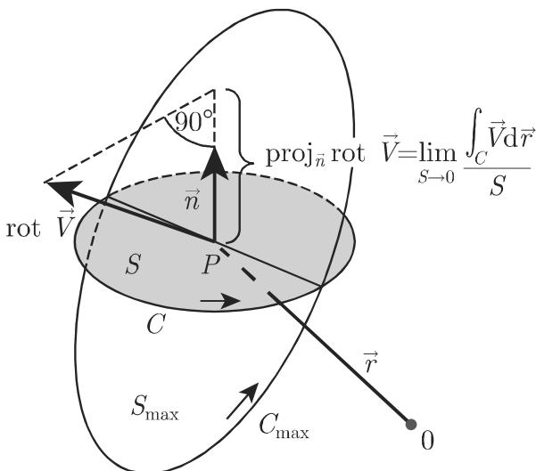

#### 13.2.5 向量场的旋度

13.2.5.1 旋度的定义

1. 定义

一个向量场 $\vec { V }$ 在点 $\vec { r }$ 处的旋度 (rotation curl) 是用 $\operatorname { r o t } \vec { V } , \operatorname { c u r l } \vec { V }$ 或用梯度算子 $\nabla \times \vec { V }$ 表示的一个向量，并被定义为该向量场的负空间导数：

$$
\operatorname{rot} \vec {V} = - \lim _ {V \to 0} \frac {\oiint_ {\Sigma} \vec {V} \times \mathrm{d} \vec {S}}{V} = \lim _ {V \to 0} \frac {\oiint_ {\Sigma} \mathrm{d} \vec {S} \times \vec {V}}{V}.\tag{13.57}
$$

2. 定义

可以用如下方式定义向量场 $\vec { V } ( \vec { r } )$ 旋度向量场：

a) 通过点 $\vec { r }$ 放置一小片曲而 （图 13.12)，并用向量 $\vec { S }$ 来描述该曲面片，其方向是曲面的法向 ${ \vec { n } } ,$ ，其绝对值等千该曲面片的面积．该曲面的边界用 $C$ 表示．

b) 沿曲线 $C ($ （在从曲而的法向看曲线是正定向的意义上）（图 13.12) 计算积分$\oint _ { C } { \vec { V } } \cdot \mathrm { d } { \vec { r } } .$

c) 在曲面片位置不变时确定极限（如果存在的话） 归 1 V. dr.

d) 为了得到极限的最大值，改变曲面片的位置．在这个位置曲面面积是 $S _ { \mathrm { m a x } }$ 相应的边界曲线是 $C _ { \mathrm { m a x } }$

e) 在点 $\vec { r }$ 处确定向量 $\cot \vec { V }$ ，其绝对值等千上面发现的最大值，其方向与相应的曲面的法线方向一致因而得到

$$
| \mathrm{rot} \vec {V} | = \lim _ {S _ {\max} \to 0} \frac {\oint_ {C _ {\max}} \vec {V} \cdot \mathrm{d} \vec {r}}{S _ {\max}}.\tag{13.58a}
$$

ro $\vec { V }$ 在面积为 $S$ 的一曲面的法向上的投影，即向量 $\cot \vec { V }$ 在任一方向 $\vec { n } = \vec { l }$ 「上的分量为

$$
\vec {l} \cdot \mathrm{rot} \vec {V} = \mathrm{rot} _ {l} \vec {V} = \lim _ {S \to 0} \frac {\oint_ {C} \vec {V} \cdot \mathrm{d} \vec {r}}{S}.\tag{13.58b}
$$

向量场 $\cot \vec { V }$ 的向量线被称为向量场 $\vec { V }$ 的旋度线 (curl lines of the vector field $\vec { V } )$

  
13.12

13.2.5.2 不同坐标系中的旋度

1. 笛卡儿坐标系中的旋度

$$
\begin{array}{l} \operatorname{rot} \vec {V} = \vec {i} \left(\frac {\partial V _ {z}}{\partial y} - \frac {\partial V _ {y}}{\partial z}\right) + \vec {j} \left(\frac {\partial V _ {x}}{\partial z} - \frac {\partial V _ {z}}{\partial x}\right) + \vec {k} \left(\frac {\partial V _ {y}}{\partial x} - \frac {\partial V _ {x}}{\partial y}\right) \\ = \left| \begin{array}{c c c} \vec {i} & \vec {j} & \vec {k} \\ \frac {\partial}{\partial x} & \frac {\partial}{\partial y} & \frac {\partial}{\partial z} \\ V _ {x} & V _ {y} & V _ {z} \end{array} \right|. \end{array}\tag{13.59a}
$$

向量场 $\cot \vec { V }$ 可以被表示为梯度算子 和向量 $\vec { V }$ 的向量积：

$$
\mathrm{rot} \vec {V} = \nabla \times \vec {V}.\tag{13.59b}
$$

2. 柱面坐标系中的旋度

$$
\mathrm{rot} \vec {V} = \mathrm{rot} _ {\rho} \vec {V} \vec {\mathrm{e}} _ {\rho} + \mathrm{rot} _ {\varphi} \vec {V} \vec {\mathrm{e}} _ {\varphi} + \mathrm{rot} _ {z} \vec {V} \vec {\mathrm{e}} _ {z},\tag{13.60a}
$$

其中

$$
\mathrm{rot} _ {\rho} \vec {V} = \frac {1}{\rho} \frac {\partial V _ {z}}{\partial \varphi} - \frac {\partial V _ {\varphi}}{\partial z}, \mathrm{rot} _ {\varphi} \vec {V} = \frac {\partial V _ {\rho}}{\partial z} - \frac {\partial V _ {z}}{\partial \rho}, \mathrm{rot} _ {z} \vec {V} = \frac {1}{\rho} \bigg \{\frac {\partial}{\partial \rho} (\rho V _ {\varphi}) - \frac {\partial V _ {\rho}}{\partial \varphi} \bigg \}.\tag{13.60b}
$$

3. 球面坐标系中的旋度

$$
\mathrm{rot} \vec {V} = \mathrm{rot} _ {r} \vec {V} \vec {\mathrm{e}} _ {r} + \mathrm{rot} _ {\vartheta} \vec {V} \vec {\mathrm{e}} _ {\vartheta} + \mathrm{rot} _ {\varphi} \vec {V} \vec {\mathrm{e}} _ {\varphi},\tag{13.61a}
$$

其中

$$
\operatorname{rot} _ {r} \vec {V} = \frac {1}{r \sin \vartheta} \left\{\frac {\partial}{\partial \vartheta} (\sin \vartheta V _ {\varphi}) - \frac {\partial V _ {\vartheta}}{\partial \varphi} \right\},
$$

$$
\mathrm{rot} _ {\vartheta} \vec {V} = \frac {1}{r \sin \vartheta} \frac {\partial V _ {r}}{\partial \varphi} - \frac {1}{r} \frac {\partial}{\partial r} (r V _ {\varphi}),\tag{13.61b}
$$

$$
\mathrm{rot} _ {\varphi} \vec {V} = \frac {1}{r} \bigg \{\frac {\partial}{\partial r} (r V _ {\vartheta}) - \frac {\partial V _ {r}}{\partial \vartheta} \bigg \}.
$$

4. 一般直角坐标系中的旋度

$$
\mathrm{rot} \vec {V} = \mathrm{rot} _ {\xi} \vec {V} \vec {\mathrm{e}} _ {\xi} + \mathrm{rot} _ {\eta} \vec {V} \vec {\mathrm{e}} _ {\eta} + \mathrm{rot} _ {\zeta} \vec {V} \vec {\mathrm{e}} _ {\zeta},\tag{13.62a}
$$

其中

$$
\left(\operatorname{rot} _ {\xi} \vec {V} = \frac {1}{D} \left| \frac {\partial \vec {r}}{\partial \xi} \right| \left[ \frac {\partial}{\partial \eta} \left(\left| \frac {\partial \vec {r}}{\partial \zeta} \right| V _ {\zeta}\right) - \frac {\partial}{\partial \zeta} \left(\left| \frac {\partial \vec {r}}{\partial \eta} \right| V _ {\eta}\right) \right], \right.
$$

$$
\mathrm{rot} _ {\eta} \vec {V} = \frac {1}{D} \left| \frac {\partial \vec {r}}{\partial \eta} \right| \left[ \frac {\partial}{\partial \zeta} \left(\left| \frac {\partial \vec {r}}{\partial \xi} \right| V _ {\xi}\right) - \frac {\partial}{\partial \xi} \left(\left| \frac {\partial \vec {r}}{\partial \zeta} \right| V _ {\zeta}\right) \right],\tag{13.62b}
$$

$$
\mathrm{rot} _ {\zeta} \vec {V} = \frac {1}{D} \left| \frac {\partial \vec {r}}{\partial \zeta} \right| \left[ \frac {\partial}{\partial \xi} \left(\left| \frac {\partial \vec {r}}{\partial \eta} \right| V _ {\eta}\right) - \frac {\partial}{\partial \eta} \left(\left| \frac {\partial \vec {r}}{\partial \xi} \right| V _ {\xi}\right) \right].
$$

$$
\vec {r} (\xi , \eta , \zeta) = x (\xi , \eta , \zeta) \vec {i} + (\xi , \eta , \zeta) \vec {j} + (\xi , \eta , \zeta) \vec {k}; D = \left| \frac {\partial \vec {r}}{\partial \xi} \right| \cdot \left| \frac {\partial \vec {r}}{\partial \eta} \right| \cdot \left| \frac {\partial \vec {r}}{\partial \zeta} \right|.\tag{13.62c}
$$

13.2.5.3 旋度的运算法则

$$
\operatorname{rot} \left(\vec {V} _ {1} + \vec {V} _ {2}\right) = \operatorname{rot} \vec {V} _ {1} + \operatorname{rot} \vec {V} _ {2}, \quad \operatorname{rot} \left(c \vec {V}\right) = c \operatorname{rot} \vec {V}.\tag{13.63}
$$

$$
\operatorname{rot} \left(U \vec {V}\right) = U \operatorname{rot} \vec {V} + \operatorname{grad} U \times \vec {V}.\tag{13.64}
$$

$$
\operatorname{rot} \left(\vec {V} _ {1} \times \vec {V} _ {2}\right) = (\vec {V} _ {2} \cdot \operatorname{grad}) \vec {V} _ {1} - (\vec {V} _ {1} \cdot \operatorname{grad}) \vec {V} _ {2} + \vec {V} _ {1} \operatorname{div} \vec {V} _ {2} - \vec {V} _ {2} \operatorname{div} \vec {V} _ {1}.\tag{13.65}
$$

13.2.5.4 位势场的旋度

从斯托克斯 (Stokes) 定理（参见第 946 13.3.3.2) 也可以得到一个位势场的旋度场恒为零

$$
\mathrm{rot} \vec {V} = \mathrm{rot} (\mathrm{grad} U) = \vec {0}.\tag{13.66}
$$

如果施瓦茨 (Schwarz) 互换定理的假设条件被满足（参见第 602 6.2.2.2, 1.),则从 (13.59a) 即得上式对千 ${ \vec { V } } = \operatorname { g r a d } U$ 也成立．

·对千满足 $r = | { \vec { r } } | = { \sqrt { x ^ { 2 } + y ^ { 2 } + z ^ { 2 } } }$ 的 $\vec { r } = x \vec { i } + y \vec { j } + z \vec { k } .$ 成立下列等式： $\cot { \vec { r } } = { \vec { 0 } } .$ 以及 $\mathrm { r o t } \left( \varphi ( r ) { \vec { r } } \right) = { \vec { 0 } } .$ 其中 $\varphi ( r )$ 的可微函数
