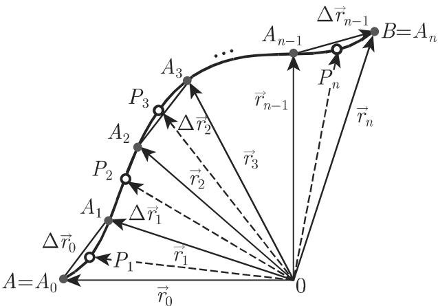
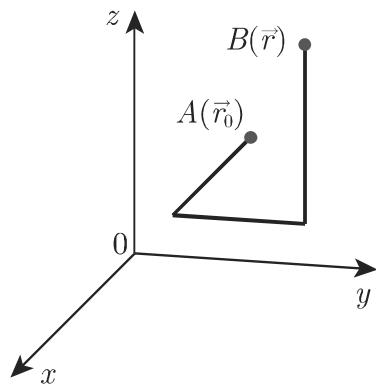
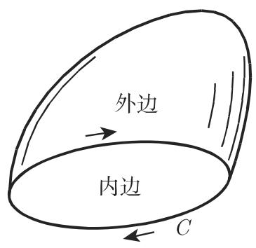
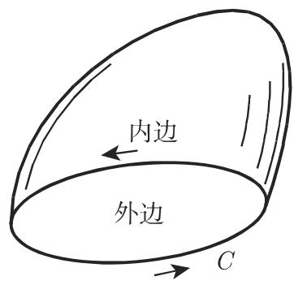
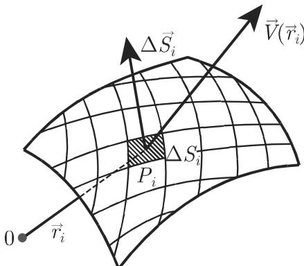

### 13.3 向量场中的积分

向量场中的积分通常是在笛卡儿、柱面或球面坐标系中所施行．积分通常是展布在曲线、曲面或高维区域上．对千这些计算所需要的线元、面元和体积元被汇集在表 13.4 中．

13.4 笛卡儿、柱面和球面坐标系中的线元、面元和体积元

<table><tr><td></td><td>笛卡儿坐标系</td><td>柱面坐标系</td><td>球面坐标系</td></tr><tr><td> $\mathrm{d}\vec{r}$ </td><td> $\vec{\mathrm{e}}_{x}\mathrm{d}x + \vec{\mathrm{e}}_{y}\mathrm{d}y + \vec{\mathrm{e}}_{z}\mathrm{d}z$ </td><td> $\vec{\mathrm{e}}_{\rho}\mathrm{d}\rho + \vec{\mathrm{e}}_{\varphi}\rho\mathrm{d}\varphi + \vec{\mathrm{e}}_{z}\mathrm{d}z$ </td><td> $\vec{\mathrm{e}}_{r}\mathrm{d}r + \vec{\mathrm{e}}_{\vartheta}r\mathrm{d}\vartheta + \vec{\mathrm{e}}_{\varphi}r\sin\vartheta\mathrm{d}\varphi$ </td></tr><tr><td> $\mathrm{d}\vec{S}$ </td><td> $\vec{\mathrm{e}}_{x}\mathrm{d}y\mathrm{d}z + \vec{\mathrm{e}}_{y}\mathrm{d}x\mathrm{d}z$  $+\vec{\mathrm{e}}_{z}\mathrm{d}x\mathrm{d}y$ </td><td> $\vec{\mathrm{e}}_{\rho}\rho\mathrm{d}\varphi\mathrm{d}z + \vec{\mathrm{e}}_{\varphi}\mathrm{d}\rho\mathrm{d}z$  $+\vec{\mathrm{e}}_{z}\rho\mathrm{d}\rho\mathrm{d}\varphi$ </td><td> $\vec{\mathrm{e}}_{r}r^{2}\sin\vartheta\mathrm{d}\vartheta\mathrm{d}\varphi$  $+\vec{\mathrm{e}}_{\vartheta}r\sin\vartheta\mathrm{d}r\mathrm{d}\varphi$  $+\vec{\mathrm{e}}_{\varphi}r\mathrm{d}r\mathrm{d}\vartheta\mathrm{d}\varphi$ </td></tr><tr><td> $\mathrm{d}V^{*}$ </td><td> $\mathrm{d}X\mathrm{d}Y\mathrm{d}Z$ </td><td> $\rho\mathrm{d}\rho\mathrm{d}\varphi\mathrm{d}Z$ </td><td> $r^{2}\sin\vartheta\mathrm{d}r\mathrm{d}\vartheta\mathrm{d}\varphi$ </td></tr><tr><td></td><td> $\vec{\mathrm{e}}_{x} = \vec{\mathrm{e}}_{y} \times \vec{\mathrm{e}}_{z}$  $\vec{\mathrm{e}}_{y} = \vec{\mathrm{e}}_{z} \times \vec{\mathrm{e}}_{x}$  $\vec{\mathrm{e}}_{z} = \vec{\mathrm{e}}_{x} \times \vec{\mathrm{e}}_{y}$ </td><td> $\vec{\mathrm{e}}_{\rho} = \vec{\mathrm{e}}_{\varphi} \times \vec{\mathrm{e}}_{z}$  $\vec{\mathrm{e}}_{\varphi} = \vec{\mathrm{e}}_{z} \times \vec{\mathrm{e}}_{\rho}$  $\vec{\mathrm{e}}_{z} = \vec{\mathrm{e}}_{\rho} \times \vec{\mathrm{e}}_{\varphi}$ </td><td> $\vec{\mathrm{e}}_{r} = \vec{\mathrm{e}}_{\vartheta} \times \vec{\mathrm{e}}_{\varphi}$  $\vec{\mathrm{e}}_{\vartheta} = \vec{\mathrm{e}}_{\varphi} \times \vec{\mathrm{e}}_{r}$  $\vec{\mathrm{e}}_{\varphi} = \vec{\mathrm{e}}_{r} \times \vec{\mathrm{e}}_{\vartheta}$ </td></tr><tr><td></td><td> $\vec{\mathrm{e}}_{i} \cdot \vec{\mathrm{e}}_{j} = \begin{cases} 0, & i \neq j^{**}\\ 1, & i = j \end{cases}$ </td><td> $\vec{\mathrm{e}}_{i} \cdot \vec{\mathrm{e}}_{j} = \begin{cases} 0, & i \neq j\\ 1, & i = j \end{cases}$ </td><td> $\vec{\mathrm{e}}_{i} \cdot \vec{\mathrm{e}}_{j} = \begin{cases} 0, & i \neq j\\ 1, & i = j \end{cases}$ </td></tr></table>

\* 这里用 表示体积是为了避免与向量函数的绝对值 $| { \vec { V } } | = V$ 混淆  
\*\* 指标 $j$ 代替 $x , y , z$ 或 $\rho , \varphi , z$ 或 $r , \vartheta , \varphi .$ 译者注

#### 13.3.1 向量场中的线积分和位势

13.3.1.1 向量场中的线积分

1. 定义

一个向量函数 $\vec { V } ( \vec { r } )$ 沿一条可求长曲线 $\widehat { A B }$ （图 13.13) 的标量值线积分或线积分是标量值

$$
P = \int_ {\widehat {A B}} \vec {V} (\vec {r}) \cdot \mathrm{d} \vec {r}.\tag{13.99a}
$$

  
13.13

2. 个步骤计算这个积分

a) 用分点小 $A _ { 1 } ( \vec { r } _ { 1 } ) , A _ { 2 } ( \vec { r } _ { 2 } ) , \cdot \cdot \cdot , A _ { n - 1 } ( \vec { r } _ { n - 1 } ) ( A = A _ { 0 } , B = A _ { n } )$ 把路径 $\widehat { A B }$ 分个小弧段（图 13.13)，用向量 ${ \vec { r _ { i } } } - { \vec { r _ { i - 1 } } } = \Delta { \vec { r _ { i - 1 } } }$ 来逼近这些弧．

b) 在每个小弧段的内部或边界任意选取位置向量为 $\vec { \xi _ { i } }$ 的点 $P _ { i }$

c) 在这些所选取的点处计算函数 $\vec { V } ( \vec { \xi _ { i } } )$ 与相应的 $\Delta \vec { r } _ { i - 1 }$ 的内积．

d) 取所有 个积之和

e) $| \triangle \vec { r } _ { i - 1 } | ~ \longrightarrow ~ 0$ 时显然亦当 $n  \infty$ 时计算和 $\sum _ { i = 1 } ^ { n } \tilde { \vec { V } } ( \vec { \xi _ { i } } ) \cdot \Delta \vec { r _ { i - 1 } }$ 的极限

如果这个极限与诸点 $A _ { i }$ 和 $P _ { i }$ 的选取无关，则它被称为线积分

$$
\int_{\widehat{AB}}\vec{V}\cdot \mathrm{d}\vec{r} = \lim_{\substack{|\triangle \vec{r}_{i - 1}| \to 0\\ n\to \infty}}\sum_{i = 1}^{n}\tilde{\vec{V}} (\vec{\xi}_{i})\cdot \triangle \vec{r}_{i - 1}.\tag{13.99b}
$$

线积分 (13.99a), (13.99b) 存在性的一个充分条件是，向量函 $\vec { V } ( \vec { r } )$ 和曲线$\widehat { A B }$ 连续的，并且曲线有连续改变的切线一个向量函数 $\vec { V } ( \vec { r } )$ 连续的，如果其分量， 个标量函数是连续的．

  
13.14

13.3.1.2 力学中线积分的解释

如果 $\vec { V } ( \vec { r } )$ 是一个力场，即 $\vec { V } ( \vec { r } ) = \vec { F } ( \vec { r } )$ ，则线积分 (13.99a) 表示当一个粒子$m$ 沿路径 $\widehat { A B }$ 移动时 $\vec { F }$ 所做的功（见第 939 页图 13.13, 13.14).

13.3.1.3 线积分的性质

$$
\int_ {\widehat {A B C}} \vec {V} (\vec {r}) \cdot \mathrm{d} \vec {r} = \int_ {\widehat {A B}} \vec {V} (\vec {r}) \cdot \mathrm{d} \vec {r} + \int_ {\widehat {B C}} \vec {V} (\vec {r}) \cdot \mathrm{d} \vec {r} \quad (\mathrm{图} 1 3. 1 4),\tag{13.100}
$$

$$
\int_ {\widehat {A B}} \vec {V} (\vec {r}) \cdot \mathrm{d} \vec {r} = - \int_ {\widehat {B A}} \vec {V} (\vec {r}) \cdot \mathrm{d} \vec {r},\tag{13.101}
$$

$$
\int_ {\widehat {A B}} \left[ \vec {V} (\vec {r}) + \vec {W} (\vec {r}) \right] \cdot \mathrm{d} \vec {r} = \int_ {\widehat {A B}} \vec {V} (\vec {r}) \cdot \mathrm{d} \vec {r} + \int_ {\widehat {A B}} \vec {W} (\vec {r}) \cdot \mathrm{d} \vec {r},\tag{13.102}
$$

$$
\int_ {\widehat {A B}} c \vec {V} (\vec {r}) \cdot \mathrm{d} \vec {r} = c \int_ {\widehat {A B}} \vec {V} (\vec {r}) \cdot \mathrm{d} \vec {r} (c \text {为常数}).\tag{13.103}
$$

13.3.1.4 笛卡儿坐标系中的线积分

在笛卡儿坐标系中下述公式成立：

$$
\int_ {\widehat {A B}} \vec {V} (\vec {r}) \cdot \mathrm{d} \vec {r} = \int_ {\widehat {A B}} (V _ {x} \mathrm{d} x + V _ {y} \mathrm{d} y + V _ {z} \mathrm{d} z).\tag{13.104}
$$

13.3.1.5 沿向量场中一条闭曲线的积分

一个线积分被称为周线积分 (contour integral) ，如果积分路径是一条闭曲线．如果标量积分值用 表示，闭曲线用 表示，则用下述记号：

$$
P = \oint_ {C} \vec {V} (\vec {r}) \cdot \mathrm{d} \vec {r}.\tag{13.105}
$$

13.3.1.6 保守场或位势场

1. 定义

如果一个向量场中的线积分 (13.99a) 的值 仅依赖千初始点 和终点 ，而与连接它们的路径无关则该场被称为保守场 (conservative field) 或位势场 (pota-tial field).

在保守场中的周线积分之值恒为零：

$$
\oint_ {C} \vec {V} (\vec {r}) \cdot \mathrm{d} \vec {r} = 0.\tag{13.106}
$$

保守场总是无旋的：

$$
\mathrm{rot} \vec {V} = \vec {0},\tag{13.107}
$$

并且反之，此等式是一个向量场成为保守场的一个充分条件．当然，必须假设场函数$\vec { V }$ 关千相应的坐标的偏导数是连续的，并且 $\vec { V }$ 的定义域是单连通的．这个条件也称为可积性条件 (integrability condition) （参见第 692 8.3.4.2) ，它在笛卡儿坐标系中有下述形式

$$
\frac {\partial V _ {x}}{\partial y} = \frac {\partial V _ {y}}{\partial x}, \quad \frac {\partial V _ {y}}{\partial z} = \frac {\partial V _ {z}}{\partial y}, \quad \frac {\partial V _ {z}}{\partial x} = \frac {\partial V _ {x}}{\partial z}.\tag{13.108}
$$

2. 保守场的位势

一个保守场的位势，或者其位势函数，是标量函数

$$
U (\vec {r}) = \int_ {\vec {r} _ {0}} ^ {\vec {r}} \vec {V} (\vec {r}) \cdot \mathrm{d} \vec {r}.\tag{13.109a}
$$

在保守场中，它作为具有一个固定初始点 $A ( \vec { r } _ { 0 } )$ 和一个变动终点 $B ( \vec { r } )$ 的线积分来计算

$$
U (\vec {r}) = \int_ {\widehat {A B}} \vec {V} (\vec {r}) \cdot \mathrm{d} \vec {r}.\tag{13.109b}
$$

在物理学中，一个函 $\vec { V } ( \vec { r } )$ 的位势 $U ^ { * } ( \vec { r } )$ 门经常被认为有相反的符号

$$
U ^ {*} (\vec {r}) = - \int_ {\vec {r} _ {0}} ^ {\vec {r}} \vec {V} (\vec {r}) \cdot \mathrm{d} \vec {r} = - U (\vec {r}).\tag{13.110}
$$

3. 梯度、线积分和位势之间的关系

如果关系式 $\vec { V } ( \vec { r } ) = \mathrm { g r a d } U ( \vec { r } )$ ，则 $U ( \vec { r } )$ 门是场 $\vec { V } ( \vec { r } )$ 位势，并且反之， $\vec { V } ( \vec { r } )$ 门是保守场或位势场．在物理学中，相应千 (13.110)，经常用相反的符号

4. 保守场中位势的计算

如果在笛卡儿坐标系中给定函 $\vec { V } ( \vec { r } ) = V _ { x } \vec { i } + V _ { y } \vec { j } + V _ { z } \vec { k } ;$ ，则其位势函数全微分为

$$
\mathrm{d} U = V _ {x} \mathrm{d} x + V _ {y} \mathrm{d} y + V _ {z} \mathrm{d} z.\tag{13.111a}
$$

这里，系数 $V _ { x } , V _ { y } , V _ { z }$ 必须满足可积性条件 (13.108)．从方程组

$$
\frac {\partial U}{\partial x} = V _ {x}, \quad \frac {\partial U}{\partial y} = V _ {y}, \quad \frac {\partial U}{\partial z} = V _ {z}\tag{13.111b}
$$

即得 U. 在实践中，可以通过沿 段平行千坐标轴并相连的直线段（图 13.15) 的积分来计算位势

$$
\begin{array}{r l} & U = \int_ {\vec {r} _ {0}} ^ {\vec {r}} \vec {V} (\vec {r}) \cdot \mathrm{d} \vec {r} = & U (x _ {0}, y _ {0}, z _ {0}) + \int_ {x _ {0}} ^ {x} V _ {x} (x, y _ {0}, z _ {0}) \mathrm{d} x \\ & \qquad + \int_ {y _ {0}} ^ {y} V _ {y} (x, y, z _ {0}) \mathrm{d} y + \int_ {z _ {0}} ^ {z} V _ {z} (x, y, z) \mathrm{d} z. \end{array}\tag{13.112}
$$

  
13.15

#### 13.3.2 面积分

13.3.2.1 平面片向量

一般型的面积分（参见第 692 8.3.4.2) 的向量表示要求对一个平面区域定一个向量 ${ \vec { S } } ,$ 它垂直千这个区域并且其绝对值等千 的面积．图 13.16(a) 展示了一个平面片的情形．根据右手定律 (right-hand law) （也称为右旋法则 (right-screwrule)）定义沿一条闭曲线 的正指向来给出 的正方向：从向量 $\vec { S }$ 的起始点向其终点看去，则正指向 (positive sense) 就是顺时针方向．由边界曲线定向的这个选择就确定了这个曲面区域的外边，即向量 $\vec { S }$ 所在的那一边．这个定义对千由一条闭曲线所界的任意曲面区域的情形都有效（图 13.16(b),(c)).

  
(a)

  
(b)  
13.16

  
(c)

13.3.2.2 面积分的计算

标量场或向量场中一个面积分的计算与曲面 是否由一条闭曲线所界或它本身就是一个闭曲面无关．计算分 个步骤

a) 的边界曲线定向所定义的外边把曲面区域 分成 个任意的基本曲面 $\Delta S _ { i }$ （图 13.17)，使得这些面元都可被平面元素所逼近．如在 (13.33a) 中给出的那样，对每个而元 $\Delta S _ { i }$ 指定一个向量 $\Delta \vec { S } _ { i }$ ．在闭曲面的情形，定义 $\Delta \vec { S } _ { i }$ 的正方向，使得 的外边是其出发之处

b) 在每个面元的内点集或边界上任取一点 $P _ { i }$ ，其位置向量为 $\vec { r _ { i } }$ .

c) 在标量场的情形作乘积 $U ( \vec { r } _ { i } ) \Delta \vec { S } _ { i }$ ，在向量场的情形作乘积 $\vec { V } ( \vec { r _ { i } } ) \cdot \Delta \vec { S } _ { i }$ 或$\Vec { V } ( \Vec { r } _ { i } ) \times \Delta \Vec { S } _ { i }$

d) 取所有这些积之和．

e) $\Delta S _ { i }$ 的直径趋千零，即 $| \Delta \vec { S } _ { i } |  0$ 时亦当 $n \to \infty$ 时计算和之极限．因而对于二重积分，在第 694 8.4.1.1, 1. 中给出的意义下面元趋千零．

如果这个极限的存在与曲面 的划分以及点 $\vec { r _ { i } }$ 的选取无关，则称此极限为在给定曲面上 $\vec { V }$ 的面积分

  
13.17

13.3.2.3 面积分和场流

1. 标量场的向量流

$$
\vec {P} = \lim _ {| \Delta \vec {S} _ {i} | \to 0 \atop n \to \infty} \sum_ {i = 1} ^ {n} U (\vec {r} _ {i}) \Delta \vec {S} _ {i} = \int_ {S} U (\vec {r}) \mathrm{d} \vec {S}.\tag{13.113}
$$

2. 向量场的标量流

$$
Q = \lim_{\substack{|\Delta \vec{S}_{i}|\to 0\\ n\to \infty}}\sum_{i = 1}^{n}\vec{V} (\vec{r}_{i})\cdot \Delta   \vec{S}_{i} = \int_{S}\vec{V} (\vec{r})\cdot \mathrm{d}\vec{S}.\tag{13.114}
$$

3. 向量场的向量流

$$
\vec {R} = \lim _ {| \Delta \vec {S} _ {i} | \to 0 \atop n \to \infty} \sum_ {i = 1} ^ {n} \vec {V} (\vec {r} _ {i}) \times \Delta \vec {S} _ {i} = \int_ {S} \vec {V} (\vec {r}) \times \mathrm{d} \vec {S}.\tag{13.115}
$$

13.3.2.4 笛卡儿坐标系中作为第二型面积分的面积分

$$
\int_ {S} U \mathrm{d} \vec {S} = \iint_ {S _ {y z}} U \mathrm{d} y \mathrm{d} z \vec {i} + \iint_ {S _ {z x}} U \mathrm{d} z \mathrm{d} x \vec {j} + \iint_ {S _ {x y}} U \mathrm{d} x \mathrm{d} y \vec {k}.\tag{13.116}
$$

$$
\int_ {S} \vec {V} \cdot \mathrm{d} \vec {S} = \iint_ {S _ {y z}} V _ {x} \mathrm{d} y \mathrm{d} z + \iint_ {S _ {z x}} V _ {y} \mathrm{d} z \mathrm{d} x + \iint_ {S _ {x y}} V _ {z} \mathrm{d} x \mathrm{d} y.\tag{13.117}
$$

$$
\begin{array}{r l} & {\int_ {S} \vec {V} \times \mathrm{d} \vec {S} = \iint_ {S _ {y z}} (V _ {z} \vec {j} - V _ {y} \vec {k}) \mathrm{d} y \mathrm{d} z + \iint_ {S _ {z x}} (V _ {x} \vec {k} - V _ {z} \vec {i}) \mathrm{d} z \mathrm{d} x} \\ & {\qquad + \iint_ {S _ {x y}} (V _ {y} \vec {i} - V _ {x} \vec {j}) \mathrm{d} x \mathrm{d} y.} \end{array}\tag{13.118}
$$

类似千第 710 8.5.2.1, 4. 中的存在性定理，可以给出关千这些积分的存在性定理在上面这些公式中，每个积分被展布在 在相应的坐标平面的投影上（图 13.18)，在每个投影上变量 x,y,z 之一要根据 的方程由其他两个变量来表示．

  
13.18

用下列式子表示在闭曲面上的积分：

$$
\oint_ {S} U \mathrm{d} \vec {S} = \oiint_ {S} U \mathrm{d} \vec {S}, \quad \oint_ {S} \vec {V} \cdot \mathrm{d} \vec {S} = \oiint_ {S} \vec {V} \cdot \mathrm{d} \vec {S}, \quad \oint_ {S} \vec {V} \times \mathrm{d} \vec {S} = \oiint_ {S} \vec {V} \times \mathrm{d} \vec {S}.\tag{13.119}
$$

■ A: 计算积分 $\vec { P } = \int _ { S } x y z \mathrm { d } \vec { S } .$ 其中曲面 是由 个坐标平面所围的平面区域

$x + y + z = 1$ ．其向上的边是正边：

$$
\begin{array}{r l} & {\vec {P} = \iint_ {S _ {y z}} (1 - y - z) y z \mathrm{d} y \mathrm{d} z \vec {i} + \iint_ {S _ {z x}} (1 - x - z) x z \mathrm{d} z \mathrm{d} x \vec {j} + \iint_ {S _ {x y}} (1 - x - y) x y \mathrm{d} x \mathrm{d} y \vec {k};} \\ & {\qquad \iint_ {S _ {y z}} (1 - y - z) y z \mathrm{d} y \mathrm{d} z = \int_ {0} ^ {1} \int_ {0} ^ {1 - z} (1 - y - z) y z \mathrm{d} y \mathrm{d} z = \frac {1}{1 2 0}.} \end{array}
$$

可以类似地求另两个积分结果为： $\vec { P } = \frac { 1 } { 1 2 0 } ( \vec { i } + \vec { j } + \vec { k } )$

■ B: 在如 中同一平面区域上计算积分 $Q \ = \ \int _ { S } { \vec { r } } \cdot \mathrm { d } { \vec { S } } \ = \ \iint x \mathrm { d } y \mathrm { d } z \ +$ $\int _ { S _ { z x } } y \mathrm { d } z \mathrm { d } x + \iint _ { S _ { x y } } z \mathrm { d } x \mathrm { d } y . \mathrm { ~ } \iint x \mathrm { d } y \mathrm { d } z = \int _ { 0 } ^ { 1 } \int _ { 0 } ^ { 1 - z } ( 1 - y - z ) \mathrm { d } y \mathrm { d } z = \frac { 1 } { 6 } .$ ．可以类似地求另两个积分．结果为： $Q = { \frac { 1 } { 6 } } + { \frac { 1 } { 6 } } + { \frac { 1 } { 6 } } = { \frac { 1 } { 2 } }$

■ C: 在如 中同一平面区域上计算积分 $\vec { R } = \int _ { S } \vec { r } \times \mathrm { d } \vec { S } = \int _ { S } ( x \vec { i } + y \vec { j } + z \vec { k } ) \times$ $( \mathrm { d } y \mathrm { d } z \vec { i } + \mathrm { d } z \mathrm { d } x \vec { j } + \mathrm { d } x \mathrm { d } y \vec { k } )$ ．计算后给出 $\vec { R } = \vec { 0 }$

#### 13.3.3 积分定理

13.3.3.1 高斯积分定理和高斯积分公式

1. 高斯积分定理或散度定理

高斯积分定理 (integral theorem of Gauss) 给出了在一个体积 $\vec { V }$ 的散度的体积分与在围住 的曲面 上的一个面积分之间的关系．定义 的定向，使得其外边是正边向量函数 $\vec { V }$ 是连续的，并且其一阶偏导数存在并连续．高斯积分定理如下叙述

$$
\oiint_ {S} \vec {V} \cdot \mathrm{d} \vec {S} = \iiint_ {v} \operatorname{div} \vec {V} \mathrm{d} v,\tag{13.120a}
$$

即场 $\vec { V }$ 通过一个闭曲面 的标量流等千 $\vec { V }$ 在由 所界的体积 上散度的积分．在笛卡儿坐标系中有

$$
\oiint_ {S} \left(V _ {x} \mathrm{d} y \mathrm{d} z + V _ {y} \mathrm{d} z \mathrm{d} x + V _ {z} \mathrm{d} x \mathrm{d} y\right) = \iiint_ {v} \left(\frac {\partial V _ {x}}{\partial x} + \frac {\partial V _ {y}}{\partial y} + \frac {\partial V _ {z}}{\partial z}\right) \mathrm{d} x \mathrm{d} y \mathrm{d} z.\tag{13.120b}
$$

2. 高斯积分公式

在平面的情形，限制千 $x , y$ 平面的高斯积分定理就变为高斯积分公式 (integralformula of Gauss)．它表示一个线积分与其相应的面积分之间的对应．高斯积分公式如下叙述

$$
\iint_ {B} \left[ \frac {\partial Q (x , y)}{\partial x} - \frac {\partial P (x , y)}{\partial y} \right] \mathrm{d} x \mathrm{d} y = \oint_ {C} [ P (x, y) \mathrm{d} x + Q (x, y) \mathrm{d} y ].\tag{13.121}
$$

表示由 所界的一个平面区域． 是有一阶连续偏导数的连续函数．

3. 扇形公式

扇形公式 (sector formula) 是高斯积分公式用以计算平面区域面积的一个重要的特殊情形．对千 $Q = x , P = - y$ 即得

$$
F = \iint_ {B} \mathrm{d} x \mathrm{d} y = \frac {1}{2} \oint_ {C} [ x \mathrm{d} y - y \mathrm{d} x ].\tag{13.122}
$$

13.3.3.2 斯托克斯积分定理

斯托克斯积分定理 (integral theorem of Stokes) 给出了在一个定向曲面区域（在其上定义了向量场 $\vec { V } )$ 的一个曲面积分与沿曲面 的边界 的积分之间的关系选取曲线 $C$ 的指向，使得其与曲面法线形成右旋 (right-screw) （参见第 94213.3.2.1) ．向量函数 $\vec { V }$ 是连续的，并有连续的一阶偏导数．斯托克斯积分定理如下叙述

$$
\iint_ {S} \mathrm{rot} \vec {V} \cdot \mathrm{d} \vec {S} = \oint_ {C} \vec {V} \cdot \mathrm{d} \vec {r},\tag{13.123a}
$$

即向量场 $\vec { V }$ 通过由闭曲线 所界的曲面 的旋度流等千 $\vec { V }$ 沿曲线 的周线积分

在笛卡儿坐标系中有

$$
\begin{array}{l} \iint_ {S} \left[ \left(\frac {\partial V _ {z}}{\partial y} - \frac {\partial V _ {y}}{\partial z}\right) \mathrm{d} y \mathrm{d} z + \left(\frac {\partial V _ {x}}{\partial z} - \frac {\partial V _ {z}}{\partial x}\right) \mathrm{d} z \mathrm{d} x + \left(\frac {\partial V _ {y}}{\partial x} - \frac {\partial V _ {x}}{\partial y}\right) \mathrm{d} x \mathrm{d} y \right] \\ = \oint_ {C} (V _ {x} \mathrm{d} x + V _ {y} \mathrm{d} y + V _ {z} \mathrm{d} z). \end{array} \tag {13.123}\tag{13.123b}
$$

在平面的情形，就如高斯积分定理那样，斯托克斯积分定理也变为高斯积分公式(13.121).

13.3.3.3 格林积分定理

格林积分定理给出了体积分和面积分之间的关系．它们是格林定理对函数 $\vec { V } =$ $U _ { 1 } \mathrm { g r a d } U _ { 2 }$ 的应甩这里 $U _ { 1 }$ 历 $U _ { 2 }$ 标量场函数， 是由曲面 所围的体积下面一些定理成立：

$$
\iiint_ {v} \left(U _ {1} \triangle U _ {2} + \operatorname{grad} U _ {2} \cdot \operatorname{grad} U _ {1}\right) \mathrm{d} v = \oiint_ {S} U _ {1} \operatorname{grad} U _ {2} \cdot \mathrm{d} \vec {S}, \tag {1}\tag{13.124}
$$

(2)

$$
\iiint_ {v} \left(U _ {1} \triangle U _ {2} - U _ {2} \triangle U _ {1}\right) \mathrm{d} v = \oiint_ {S} \left(U _ {1} \operatorname{grad} U _ {2} - U _ {2} \operatorname{grad} U _ {1}\right) \cdot \mathrm{d} \vec {S}.\tag{13.125}
$$

特别地对千 $U _ { 1 } = 1 , U _ { 2 } = U$ ，有如下结论

(3)

$$
\iiint_ {v} \triangle U \mathrm{d} v = \oiint_ {S} \operatorname{grad} U \cdot \mathrm{d} \vec {S}.\tag{13.126}
$$

在笛卡儿坐标系中，第 个格林定理有下述形式（比较 (13.120b)):

$$
\iiint_ {v} \left(\frac {\partial^ {2} U}{\partial x ^ {2}} + \frac {\partial^ {2} U}{\partial y ^ {2}} + \frac {\partial^ {2} U}{\partial z ^ {2}}\right) \mathrm{d} v = \iint_ {S} \left(\frac {\partial U}{\partial x} \mathrm{d} y \mathrm{d} z + \frac {\partial U}{\partial y} \mathrm{d} z \mathrm{d} x + \frac {\partial U}{\partial z} \mathrm{d} x \mathrm{d} y\right)\tag{13.127}
$$

■ A: 计算线积分 $I = \oint _ { C } \left( x ^ { 2 } y ^ { 3 } \mathrm { d } x + \mathrm { d } y + z \mathrm { d } z \right)$ ，其中 是圆柱 $x ^ { 2 } + y ^ { 2 } = a ^ { 2 }$ 与平面 $z = 0$ 的交线是一个圆周．用斯托克斯定理 (13.123a) 得到： $I = \oint _ { C } { \vec { V } } \cdot \mathrm { d } { \vec { r } } =$ $\iint _ { S } \mathrm { r o t } \vec { V } \cdot \mathrm { d } \vec { S } = - \iint _ { S ^ { * } } 3 x ^ { 2 } y ^ { 2 } \mathrm { d } x \mathrm { d } y = - 3 \int _ { \varphi = 0 } ^ { 2 \pi } \int _ { r = 0 } ^ { \alpha } r ^ { 5 } \cos ^ { 2 } \varphi \sin ^ { 2 } \varphi \mathrm { d } r \mathrm { d } \varphi = - \frac { a ^ { 6 } } 8 \pi ,$ ，其中 $\cot { \vec { V } } = - 3 x ^ { 2 } y ^ { 2 } { \vec { k } } , \mathrm { d } { \vec { S } } = { \vec { k } } \mathrm { d } x \mathrm { d } y$ 圆盘 $S ^ { * } \colon x ^ { 2 } + y ^ { 2 } \leqslant a ^ { 2 }$

■ B: 确定漂移空间 $\vec { V } = x ^ { 3 } \vec { i } + y ^ { 3 } \vec { j } + z ^ { 3 } \vec { k }$ 通过球面S: $x ^ { 2 } + y ^ { 2 } + z ^ { 2 } = a ^ { 2 }$ 的通量 $I = \oint _ { S } { \vec { V } } \cdot \mathrm { d } { \vec { S } } ,$ 高斯定理导出 $I = \oint _ { S } { \vec { V } } \cdot \mathrm { d } { \vec { S } } = \iiint _ { v } \mathrm { d i v } { \vec { V } } \mathrm { d } v = 3 \iiint _ { v } ( x ^ { 2 } + y ^ { 2 } + { }$ $z ^ { 2 } ) \mathrm { d } x \mathrm { d } y \mathrm { d } z = 3 \int _ { \varphi = 0 } ^ { 2 \pi } \int _ { \vartheta = 0 } ^ { \pi } \int _ { r = 0 } ^ { a } r ^ { 4 } \sin \vartheta \mathrm { d } r \mathrm { d } \vartheta \mathrm { d } \varphi = \frac { 1 2 } { 5 } a ^ { 5 } \pi .$

■ C: 热导方程一个不包含热源的空间区域 的热量随时间的变化 ${ \frac { \mathrm { d } Q } { \mathrm { d } t } } \ =$ $\iint _ { v } c \varrho { \frac { \partial T } { \partial t } } \mathrm { d } v ( c$ 为比热容、 $\varrho$ 为密度、 $T$ 为温度）给出，同时热流通过 的边界曲面相应的依赖千时间的变化 ${ \frac { \mathrm { d } Q } { \mathrm { d } t } } = \oiint _ { S } \lambda \operatorname { g r a d } T \cdot \mathrm { d } { \vec { S } }$ 队为热导率）给出对千面积分 (13.120a) 应用高斯定理，从 $\iiint _ { v } \left[ c \varrho { \frac { \partial T } { \partial t } } - \operatorname { d i v } \left( \lambda \operatorname { g r a d } T \right) \right] \mathrm { { d } } v = 0$ 推得热导方程 $c \lambda { \frac { \partial T } { \partial t } } = \operatorname { d i v } \left( \lambda \operatorname { g r a d } T \right)$ ，在均匀物体的情形 $( c , \varrho , \lambda$ 入均为常数），热导方程有形式${ \frac { \partial T } { \partial t } } = a ^ { 2 } \Delta T$
