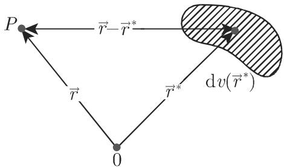
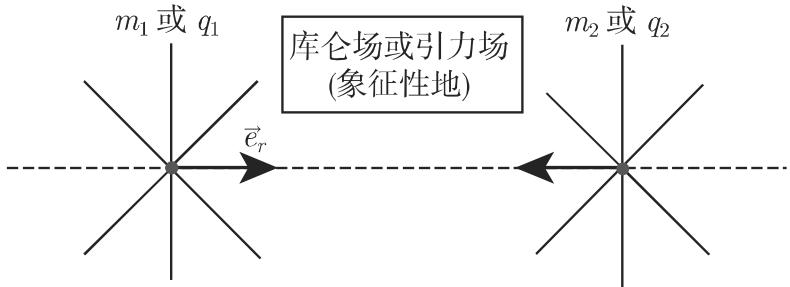

### 13.4 场的求值

#### 13.4.1 纯源场

一个场 $\vec { V _ { 1 } }$ 被称为纯源场 (pure source field) 或无旋源场 (irrotational sourcefield) ，当其旋度处处为零时若其散度 (divergence) $q ( \vec { r } )$ , 则有

$$
\operatorname{div} \vec {V} _ {1} = q (\vec {r}), \quad \operatorname{rot} \vec {V} _ {1} \equiv \vec {0}.\tag{13.128}
$$

在此情形，场有一个位势，它在每点 由下述泊松微分方程 (Poisson differentialequation) （参见第 951 13.5.2) 所定义

$$
\vec {V} _ {1} = \operatorname{grad} U, \quad \operatorname{div} \operatorname{grad} U = \Delta U = q (\vec {r}),\tag{13.129a}
$$

其中 $\vec { r }$ 是 $P$ 的位置向量．（在物理学中，经常用 $\vec { V } _ { 1 } = - \mathrm { g r a d } U )$ 从

$$
U (\vec {r}) = - \frac {1}{4 \pi} \iiint \frac {\operatorname{div} \vec {V} (\vec {r} ^ {*}) \mathrm{d} v (\vec {r} ^ {*})}{| \vec {r} - (\vec {r} ^ {*}) |}\tag{13.129b}
$$

来计算 $U .$ 上述积分是展布在整个空间上的（图 13.19). $\vec { V }$ 的散度必须是可微的，并且对千大距离是充分快地衰减的．

  
13.19

#### 13.4.2 纯旋场或无散场

纯旋场 (pure rotation （或 curl) field) 或螺线管场 (solenoidal field) 是一个向量场 $\vec { V } _ { 2 }$ ，其散度处处为零；这个场是无源的．用 $\vec { w } ( \vec { r } )$ 门表示旋度密度 (rotation$\mathrm { { d e n s i t y } ) }$ ，则有

$$
\operatorname{div} \vec {V} _ {2} \equiv 0, \quad \text {   rot   } \vec {V} _ {2} = \vec {w} (\vec {r}).\tag{13.130a}
$$

旋度密度 $\vec { w } ( \vec { r } )$ 不是任意的；它必须满足方程 $\mathrm { d i v } \vec { w } = 0$ 在下述要求下

$$
\vec {V} _ {2} (\vec {r}) = \operatorname{rot} \vec {A} (\vec {r}), \quad \operatorname{div} \vec {A} = 0, \quad \text {即} \quad \operatorname{rot} \operatorname{rot} \vec {A} = \vec {w},\tag{13.130b}
$$

根据 (13.97) 即得

$$
\operatorname{grad} \operatorname{div} {\vec {A}} - \Delta {\vec {A}} = {\vec {w}}, \quad \text {即} \quad \Delta {\vec {A}} = - {\vec {w}}.\tag{13.130c}
$$

因而正如无旋场 $\vec { V _ { 1 } }$ 的位势 一样， $\vec { A } ( \vec { r } )$ 形式地满足泊松微分方程（参见第 951(13.135a) ），并且这就是为什么它被称为向量位势 (vector potential) ．对千每个，有

$$
\vec {V} _ {2} = \mathrm{rot} \vec {A}, \quad \text {其中} \quad \vec {A} = \frac {1}{4 \pi} \iiint \frac {\vec {w} (\vec {r} ^ {*})}{| \vec {r} - (\vec {r} ^ {*}) |} \mathrm{d} v (\vec {r} ^ {*}).\tag{13.130d}
$$

$\vec { r }$ 如同 (13.129b) 中的含义；上述积分是展布在全空间上的．

#### 13.4.3 有点状源的向量场

13.4.3.1 一个点状荷的库仑场

库仑场 (Coulomb field) 是无旋场的一个例子，它也是螺线管场，除了在点源点荷 $q$ 处（图 13.20)．对千库仑力 $\vec { F } _ { \mathrm { C } }$ ，有

$$
\begin{array}{r l} & {\vec {F} _ {\mathrm{C}} = \frac {1}{4 \pi \varepsilon_ {0}} \frac {q _ {1} q _ {2}}{r ^ {2}} \vec {e} _ {r} = \frac {q _ {1}}{4 \pi \varepsilon_ {0}} q _ {2} \frac {\vec {r}}{r ^ {3}}} \\ & {\qquad = e q _ {2} \frac {\vec {r}}{r ^ {3}}, \qquad e = \frac {q _ {1}}{4 \pi \varepsilon_ {0}}.} \end{array}\tag{13.131a}
$$

  
13.20

对千具有不同符号的电荷 $q _ { 1 } , q _ { 2 }$ ，这个力相互吸引地作用着，对千具有相同符号的点荷，这个力相互排斥地作用着． $\varepsilon _ { 0 }$ 。是电常数（参见第 1368 页表 21.2), 是源的强度在荷 $q _ { 1 }$ 周围空间产生的，并影响荷 $q _ { 2 }$ 的电场强度和电位势由下述给出

$$
\vec {E} _ {\mathrm{C}} = \frac {\vec {F} _ {\mathrm{C}}}{q _ {2}} = \frac {e}{r ^ {3}} \vec {r} = - \mathrm{grad} U, \qquad U = \frac {e}{r}.\tag{13.131b}
$$

表示场的电位势．根据曲面 是否包含点源，与高斯定理一致（参见第 945(13.120a) ），标量流等千 0:

$$
\oint_ {S} \vec {E} \cdot \mathrm{d} \vec {S} = \left\{ \begin{array}{l l} {{4 \pi e,}} & {{S \mathrm{包含点源},}} \\ {{0,}} & {{S \mathrm{不包含点源}.}} \end{array} \right.\tag{13.131c}
$$

由千电场的无旋性，有

$$
\mathrm{rot} \vec {E} _ {\mathrm{C}} \equiv \vec {0}.\tag{13.131d}
$$

13.4.3.2 一个质点的引力场

一个质点的引力场或牛顿场是无旋场也是螺线管场的第二个例子，除了在质心点处．对千牛顿质量吸引力 $\vec { F } _ { \mathrm { N } }$ ，有

$$
\vec {F} _ {\mathrm{N}} = \gamma \frac {m _ {1} m _ {2}}{r ^ {2}} \vec {e} _ {r},\tag{13.132}
$$

其中？ $\gamma$ 是引力常数（参见第 1368 页表 21.2)．对千库仑场成立的每个关系，类似地对千牛顿场也成立

#### 13.4.4 场的叠加

13.4.4.1 离散源分布

类似千物理学中场的叠加，向量场也相互叠加．叠加律 (superposition law) 为：如果向量场 $\vec { V } _ { \nu }$ 有位势 $U _ { \nu }$ ，则向量场

$$
\vec {V} = \sum \vec {V} _ {\nu} \text {有位势} U = \sum U _ {\nu}.\tag{13.133a}
$$

对千具有源强度 $e _ { \nu } ( \nu = 1 , 2 , \cdot \cdot \cdot , n )$ 的 $n$ 个离散点源，它们的场被叠加，所得的场可以由诸位势 $U _ { \nu }$ 的代数和所确定

$$
\vec {V} (\vec {r}) = - \mathrm{grad} \sum_ {\nu = 1} ^ {n} U _ {\nu}, \quad \text {其中} \quad U _ {\nu} = \frac {e _ {\nu}}{| \vec {r} - \vec {r} _ {\nu} |}.\tag{13.133b}
$$

这里，向量 $\vec { r }$ 仍为所考虑点的位置向量， $\vec { r _ { \nu } }$ 是源的位置向量．

如果存在一个无旋场 $\vec { V _ { 1 } }$ 以及一个无散场启 $\vec { V _ { 2 } }$ 并且它们是处处连续的，则

$$
\vec {V} = \vec {V _ {1}} + \vec {V _ {2}} = - \frac {1}{4 \pi} \bigg [ \mathrm{grad} \iiint \frac {q (\vec {r ^ {*}})}{| \vec {r} - \vec {r ^ {*}} |} \mathrm{d} v (\vec {r ^ {*}}) - \mathrm{rot} \iiint \frac {\vec {w} (\vec {r ^ {*}})}{| \vec {r} - \vec {r ^ {*}} |} \mathrm{d} v (\vec {r ^ {*}}) \bigg ].\tag{13.133c}
$$

如果向量场被拓广到无穷远则当 $r = | \vec { r } |  \infty , | \vec { V } ( \vec { r } ) |$ 充分快地衰减时， $\vec { V } ( \vec { r } )$ 的分解是唯一的．上述积分是展布在全空间上的．

13.4.4.2 连续源分布

如果源沿空间的曲线、曲面或在一个区域中连续分布，那么代替有限个源强度$e _ { \nu } .$ ，有相应千源分布密度的无穷小量，而代替利有展布在这些对象（曲线、曲面或区域）上的积分在源强度在空间连续分布的情形，散度是 $q ( \vec { r } ) = \mathrm { d i v } \vec { V }$

类似的命题对千由旋度定义的场的位势也成立．在旋度在空间连续分布的情形，“旋度密度”(rotation density) 由 $\vec { w } ( \vec { r } ) = \mathrm { r o t } \vec { V }$ 定义

13.4.4.3 结论

一个向量场由其在空间中的源和旋度唯一确定，如果所有这些源和旋度只局限千一个有限空间中．
