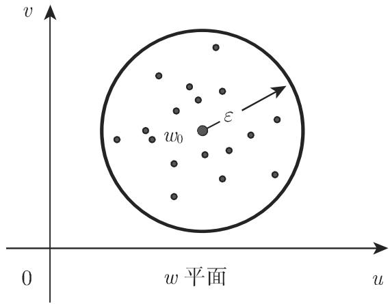

#### 14.1.1 连续性、可微性

14.1.1.1 复函数的定义

与实函数类似，对千复值可以指定复值与其对应，即对千值 $z = x + \mathrm { i } y$ ，可以指定一个复数 $w = u + \mathrm { i } v$ 与其对应其中 $u = u ( x , y ) , v = v ( x , y )$ 是两个实变量 $x , y$ 的实函数．这个关系被记为 $w = f ( z )$ ．函数 $w = f ( z )$ 是从复数 $z$ 平面到复数 $w$ 平面的一个映射

可以与实变量的实函数那样类似地定义复函数 $w = f ( z )$ 的极限、连续性和导数的概念

14.1.1.2 复函数的极限

一个函数 $f ( z ) ( \not \equiv z _ { 0 }$ 处）的极限 (limit) 等千复数 $w _ { 0 }$ 如果当 趋千 $z _ { 0 }$ 时函数值 $f ( z )$ 趋千 $w _ { 0 }$ :

$$
w _ {0} = \lim _ {z \to z _ {0}} f (z).\tag{14.1a}
$$

换言之：对千任何正的 $\varepsilon ,$ ，存在一个（实的） $\delta > 0$ ，使得对满足 (14.lb) 的每个 $z ,$ ，也许除了 $z _ { 0 }$ 本身外，成立不等式 (14.lc):

$$
| z _ {0} - z | <   \delta ,\tag{14.1b}
$$

$$
\left| w _ {0} - w \right| <   \varepsilon .\tag{14.1c}
$$

儿何意义如下：以 $z _ { 0 }$ 为圆心， 为半径的圆中的任一点 $z ,$ ，也许除了 $z _ { 0 }$ 本身外，被映为 $w$ 平面中以 $w _ { 0 }$ 为圆心， $\varepsilon$ 为半径的圆中的点 $w = f ( z )$ ，如图 14.1 所展示．半径为 $\delta$ 和 $\varepsilon$ 的两个圆也被称为邻域 $U _ { \delta } ( z _ { 0 } )$ 和 $U _ { \varepsilon } ( w _ { 0 } )$

14.1.1.3 连续的复函数

一个函数 $w = f ( z )$ 在 $z _ { 0 }$ 处是连续的，如果它在该处有极限，并且该极限与函数在该处的值相等，即，如果对 $w$ 平面中的点 $w _ { 0 } = f ( z _ { 0 } )$ 的任意给定的小邻域

$U _ { \varepsilon } ( w _ { 0 } )$ ，在 平面中存在 $z _ { 0 }$ 的一个邻域 $U _ { \delta } ( z _ { 0 } )$ ，使得对千每个点 $z \in U _ { \delta } ( z _ { 0 } )$ ，有$w = f ( z ) \in U _ { \varepsilon } ( w _ { 0 } )$ ．如图 14.1 所示，例如， $U _ { \varepsilon } ( w _ { 0 } )$ 是围绕点 $w _ { 0 }$ 的半径为 $\varepsilon$ 的圆用通常的记号， 的连续性表达为少

$$
\lim _ {z \to z _ {0}} f (z) = f (z _ {0}) \quad {\text {或}} \quad \lim _ {\delta \to 0} f (z _ {0} + \delta) = f (z _ {0}).\tag{14.2}
$$

  
(a)

  
14.1  
(b)

14.1.1.4 复函数的可微性

函数 $w = f ( z )$ 处是可微的，如果微商

$$
{\frac {\triangle w}{\triangle z}} = {\frac {f (z + \triangle z) - f (z)}{\triangle z}}\tag{14.3}
$$

当 $\Delta z  0$ 时有不依赖千 $\Delta z$ 趋千零的方式的极限这个极限用 $f ^ { \prime } ( z )$ 表示，并被称为 $f ( z )$ 的导数．

·函数 $f ( z ) = \operatorname { R e } z = x$ 在任何点 $z = z _ { 0 }$ 处都不是可微的，因为平行千 轴趋千$z _ { 0 }$ 时该差商的极限为 ，而平行千 轴趋千 $z _ { 0 }$ 时该值为零．
