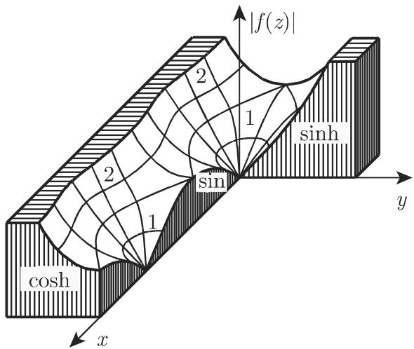

#### 14.1.2 解析函数

14.1.2.1 解析函数的定义

函数 f(z) 被称为在区域 上是解析的，正则的 (anlytic, regular)，或全纯的(holomorphic) ，如果它在 $G$ 的每个点处都是可微的． $G$ 的边界点在那里 $f ^ { \prime } ( z )$ 不存在，是 $f ( z )$ 的奇点．

函数 $f ( z ) = u ( x , y ) + \mathrm { i } v ( x , y )$ 中是可微的，如果在 关千有连续偏导数，并且它们满足柯西—黎曼微分方程 (Cauchy-Riemann differentialequations):

$$
{\frac {\partial u}{\partial x}} = {\frac {\partial v}{\partial y}}, \quad {\frac {\partial u}{\partial y}} = - {\frac {\partial v}{\partial x}}.\tag{14.4}
$$

解析函数的实部和虚部满足拉普拉斯微分方程：

$$
\Delta u (x, y) = \frac {\partial^ {2} u}{\partial x ^ {2}} + \frac {\partial^ {2} u}{\partial y ^ {2}} = 0,\tag{14.5a}
$$

$$
\Delta v (x, y) = \frac {\partial^ {2} v}{\partial x ^ {2}} + \frac {\partial^ {2} v}{\partial y ^ {2}} = 0.\tag{14.5b}
$$

一个复变量初等函数的导数可以借助千相应实函数导数的相同公式来计算．

■ A: $f ( z ) = z ^ { 3 } , \ f ^ { \prime } ( z ) = 3 z ^ { 2 }$

■ B: $f ( z ) = \sin \ z , \ f ^ { \prime } ( z ) = \cos \ z$

14.1.2.2 解析函数的一些例子

1. 初等函数

除了在一些孤立奇点处外，初等的代数函数和超越函数在整个 平面中是解析的．如果一个函数在一个域上是解析的，即它是可微的，那么它是任意多次可微的．

■ A: 函数 $w = z ^ { 2 }$ , 满足 $u = x ^ { 2 } - y ^ { 2 } , v = 2 x y .$ ，它是处处解析的．

■ B: 由方程组 $u = 2 x + y , v = x + 2 y$ 定义的函数 $w = u + \mathrm { i } v$ 在任意点都不解析．

■ C: 函数 $f ( z ) = z ^ { 3 }$ ，满足 $f ^ { \prime } ( z ) = 3 z ^ { 2 }$ ，它是解析的．

■ D: 函数 $f ( z ) = \sin { z } ,$ ，满足 $f ^ { \prime } ( z ) = \cos { z } ,$ ，它是解析的．

2. 函数 的确定

如果函数 都满足拉普拉斯微分方程，那么它们是调和函数 (harmonicfunctions) （参见第 951 13.5.1)．如果这些调和函数之一，例如 是已知的，那么个函数 ，作为共辄调和函数，可以利用柯西—黎曼微分方程组来确定，只相差一个附加常数：

$$
v = \int {\frac {\partial u}{\partial x}}   \mathrm{d} y + \varphi (x), \quad \text {其中}   \varphi (x) \text {满足}   {\frac {\mathrm{d} \varphi}{\mathrm{d} x}} = - \left({\frac {\partial u}{\partial y}} + {\frac {\partial}{\partial x}} \int {\frac {\partial u}{\partial x}}   \mathrm{d} y\right).\tag{14.6}
$$

类似地如果 已知也可确定 u.

14.1.2.3 解析函数的性质

1. 解析函数的绝对值或模

一个解析函数的绝对值（模）是

$$
| w | = | f (z) | = \sqrt {[ u (x , y) ] ^ {2} + [ v (x , y) ] ^ {2}} = \varphi (x, y).\tag{14.7}
$$

曲面 $| w | = \varphi ( x , y )$ 被称为它的模曲面 (relief)，即间是点 $z = x + \mathrm { i } y$ 之上的第个坐标．

■ A: 函数 $\sin z = \sin x \cosh y + \mathrm { i } \cos x \sinh y$ 的绝对值是 $| \sin z | = \sqrt { \sin ^ { 2 } x + \sinh ^ { 2 } y }$ 14.2(a) 展示了其模曲面．

■ B: 函数 $w = \mathrm { e } ^ { 1 / z }$ 的模曲面在图 14.2(b) 中展示．

[14.8] 中有一些解析函数的模曲面．

(b)  
  
(a)

  
14.2

2.

巾千一个函数的绝对值是正的或零，因此模曲面总是在 平面之上，除非在$| f ( z ) | = 0$ （因而 $f ( z ) = 0 )$ 的点处．使 $f ( z ) = 0$ 值，被称为函数 f(z) 的根(roots of the function f (z)).

3. 有界性

一个函数 f(z) 在某个区域 中是有界的 (bounded)，如果存在一个正数 N,使得对所有 中的 $| f ( z ) | < N$ 在相反的情形，如果没有这样的数 存在，则该函数被称为在 中是无界的．

4. 关千最大值的定理

如果 $w = f ( z )$ 在一个闭区域上是一个解析函数，那么其绝对值的最大值在区域的边界上达到

5. 关千常数的定理（刘维尔定理）

如果 $w = f ( z )$ 在整个 平面是解析的，并且还是有界的，那么这个函数是常数： f(z) ＝常数

14.1.2.4 奇点

如果一个函数 $w = f ( z )$ 在 $z = a$ 的一个邻域（即，在以 为圆心的一个小圆）中除了 本身外是解析的，则 处有一个奇点．有 种类型的奇点

(1) f(z) 在该邻域是有界的．则存在 $w = \operatorname* { l i m } _ { z \to a } f ( z )$ ，并且在令 $f ( a ) = w$ 后该函数在 处也变成解析的了．在此情形， 处有一个可去奇点 (removable$\mathrm { \ s i n g u l a r i t y ) }$

(2) 如果 $\operatorname* { l i m } _ { z \to a } | f ( z ) | = \infty$ 处有一个极点．关千不同阶的极点见第982 14.3.5.1.

(3) 如果 f(z) 处既不是一个可去奇点，也不是一个极点，则 处有一个本质奇点 (essential singularity) ．在此情形，对千任意复数 $w ,$ 存在一个序列$z _ { n } \longrightarrow a$ ，使得 $f ( z _ { n } )  w$

■ A: 函数 $w = \frac { 1 } { z - a }$ 处有一个极点．

■ B: 函数 $w = \mathrm { e } ^ { 1 / z }$ 处有一个本质奇点
