#### 14.1.3 共形映射

14.1.3.1 共形映射的概念和性质

1. 定义

一个从 平面到 平面的映射被称为是一个共形映射，如果它是解析的和单射的．在此情形，

$$
w = f (z) = u + \mathrm{i} v, \qquad f ^ {\prime} (z) \neq 0.\tag{14.8}
$$

共形映射有下述一些性质

线元 $\mathrm { d } z = { \binom { \mathrm { d } x } { \mathrm { d } y } }$ 的变换 $\mathrm { d } w = f ^ { \prime } ( z ) \mathrm { d } z$ 是数量为 $\sigma = | f ^ { \prime } ( z ) |$ 的一个伸缩和角度为 $\alpha = \arg \ f ^ { \prime } ( z )$ 的一个旋转的组合．这意味着无穷小的圆被变为差不多的圆，三角形被变为（差不多的）相似三角形（图 14.3)．相交的曲线保持其交角，因而正交曲线族被变为正交曲线族（图 14.4).

  
(a)

  
14.3  
(b)

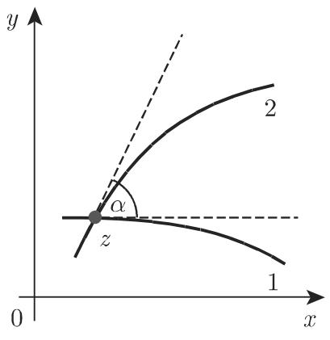  
(a)

  
(b)  
14.4

共形映射出现在物理学、电工学、流体动力学、空气动力学和其他的数学领域中．

2. 柯西—黎曼方程组

dz $\mathrm { d } w$ 之间的映射由仿射微分变换

$$
\mathrm{d} u = \frac {\partial u}{\partial x} \mathrm{d} x + \frac {\partial u}{\partial y} \mathrm{d} y, \quad \mathrm{d} v = \frac {\partial v}{\partial x} \mathrm{d} x + \frac {\partial v}{\partial y} \mathrm{d} y\tag{14.9a}
$$

所给出，该变换用矩阵形式表为

$$
\mathrm{d} w = A \mathrm{d} z, \qquad \text {其中} \quad A = \left( \begin{array}{c c} {{u _ {x}}} & {{u _ {y}}} \\ {{v _ {x}}} & {{v _ {y}}} \end{array} \right).\tag{14.9b}
$$

根据柯西—黎曼微分方程组， 有旋转—伸缩矩阵的形式（参见第 256 3.5.2.2, 2.),$\sigma$ 为伸缩因子

$$
\boldsymbol {A} = \left( \begin{array}{c c} u _ {x} & - v _ {x} \\ v _ {x} & u _ {x} \end{array} \right) = \sigma \left( \begin{array}{c c} \cos \alpha & - \sin \alpha \\ \sin \alpha & \cos \alpha \end{array} \right),\tag{14.10a}
$$

$$
u _ {x} = v _ {y} = \sigma \cos \alpha ,\tag{14.10b}
$$

$$
- u _ {y} = v _ {x} = \sigma \sin \alpha ,\tag{14.10c}
$$

$$
\sigma = | f ^ {\prime} (z) | = \sqrt {u _ {x} ^ {2} + u _ {y} ^ {2}} = \sqrt {v _ {x} ^ {2} + v _ {y} ^ {2}},\tag{14.10d}
$$

$$
\alpha = \arg f ^ {\prime} (z) = \arg (u _ {x} + \mathrm{i} v _ {x}).\tag{14.10e}
$$

3. 正交系

平面的坐标线 ＝常数和 ＝常数通过一个共形映射被变为两族正交曲线一般地，一束正交曲线坐标系可以由解析函数生成；反之对千每个共形映射，存在一个正交曲线网，它被变为一个正交坐标系．

■ A: $u = 2 x + y , v = x + 2 y$ 的情形（图 14.5) ，正交性不成立．

  
(a)

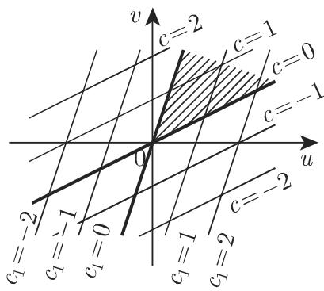  
(b)  
14.5

■ B: $w = z ^ { 2 }$ 的情形正交性被保持，除了在点 $z = 0$ 处，因为在那里 $w ^ { \prime } = 0$ 坐标线被变为两族共焦抛物线（图 14.6), 平面的第一象限被变为 $w$ 平面的上半平面

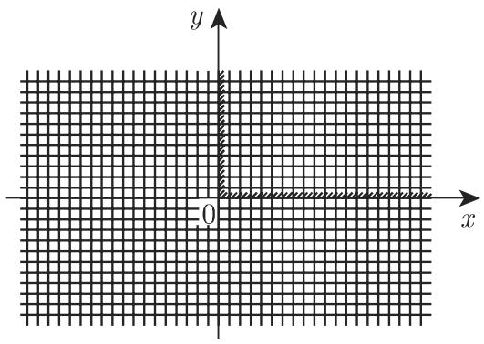  
(a)

  
14.6  
(b)

14.1.3.2 最简单的一些共形映射

在这一节中，将讨论一些变换及其最重要的性质，并且在 平面中给出一些等距网 (isometric nets) 的图像，这些网被变为 平面中的正交笛卡儿网 平面中区域的边界被映入 平面的上半平面中，以阴影表示．黑色区域通过共形映射被映平面中以 (0,0), (0,1),(1,0) (1,1) 为顶点的正方形（图 14.7).

1. 线性函数

对千以线性函数形式

$$
w = a z + b \quad (a, b \text {是复常数}; a \neq 0),\tag{14.11a}
$$

给出的共形映射，可以分 步完成其变换：

a) 平面经过角度 $\alpha = \arg a$ 的旋转： $w _ { 1 } = \mathrm { e } ^ { \mathrm { i } \alpha } z .$

b) $w _ { 1 }$ 平面伸缩因子为 $| a |$ 的伸缩：

$$
w _ {2} = | a | w _ {1}.\tag{14.11b}
$$

c) $w _ { 2 }$ 平面平行移动 b:

$$
w = w _ {2} + b.
$$

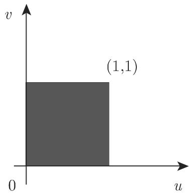  
14.7

总之， $z$ 平面的每个图形都被变为 $w$ 平面的相似图形．点 $z _ { 1 } = \infty$ 和 $a \neq 1$ 时的点$z _ { 2 } = { \frac { b } { 1 - a } }$ 被变为它们自身，因此它们被称为不动点 (fixed points)．图 14.8 展示了被变为正交笛卡儿网的正交网

  
14.8

2. 反演

共形映射

$$
w = \frac {1}{z}\tag{14.12}
$$

表示关千单位圆周 (unit circle) 的一个反演 (inversion) 以及对实轴的一个镜射，即$z$ 平面的一个绝对值为 以及辐角为 $\varphi$ 的点 $z = r \mathrm { e } ^ { \mathrm { i } \varphi }$ 被变为 $^ { \dag } w$ 平面的一个绝对值为 $1 / r$ 以及辐角为— $- \varphi$ 的点 $w = { \frac { 1 } { r } } \mathrm { e } ^ { - \mathrm { i } \varphi }$ （图 14.10). 圆周变为圆周，这里直线被视为圆周的极限情形（半径－ OO）．圆周的内点变为圆周的外点并且外点变为内点（图 14.11) ．点 $z = 0$ 变为 $w = \infty$ ．点 $z = - 1$ 和 $z = 1$ 是这个共形映射的不动点变换 (14.12) 的正交网展示在图 14.9 中．

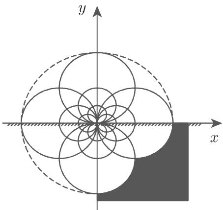  
14.9

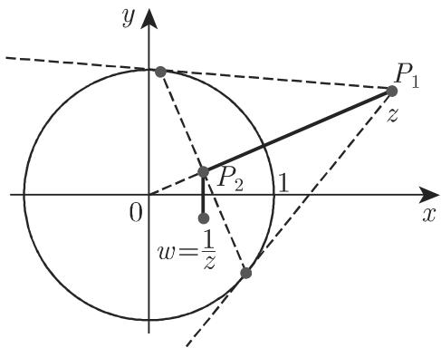  
14.10

一般地一个儿何变换被称为关于一个半径为 圆周的反演 (inversionwith respect to a circle with radius r) ，如果该圆周内部径向长度为 $r _ { 2 } = \overline { { O P _ { 2 } } }$ 的点 $P _ { 2 }$ 被变为圆外位千向量 $\overrightarrow { O P _ { 2 } }$ 延长线上满足 $\overline { { O P _ { 1 } } } = r _ { 1 } = r ^ { 2 } / r _ { 2 }$ 的点 $P _ { 1 }$ . 圆周的内点变为外点并且外点变为内点．

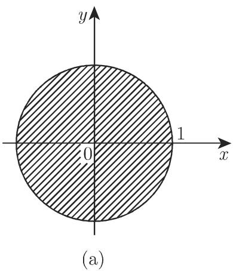

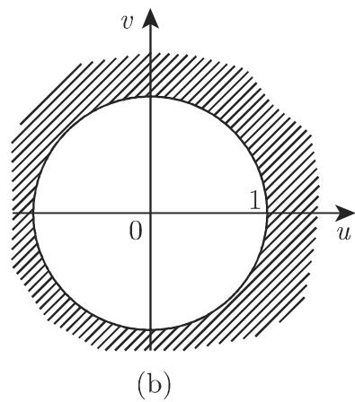  
14.11

3. 线性分式函数

对千以线性分式函数形式

$w = { \frac { a z + b } { c z + d } }$ (a,b,c,d 是复常数； $b c - a d \neq 0 ; c \neq 0 )$

(14.13a)

给出的共形映射，可以分 步实现其变换：

a) 线性函数： $w _ { 1 } = c z + d .$

b) 反演： $w _ { 2 } = \frac { 1 } { w _ { 1 } } .$

(14.13b)

c) 线性函数： $w = \frac { a } { c } + \frac { b c - a d } { c } w _ { 2 }$

圆周仍被变为圆周（圆变换 (circular transformation) ），这里直线被视为圆周当 $r $ $\infty$ 时的极限情形．这个共形映射的不动点是满足二次方程

$$
z = \frac {a z + b}{c z + d}\tag{14.14}
$$

的两个点．如果点 $z _ { 1 }$ 和 $z _ { 2 }$ 关千 平面的圆周 $K _ { 1 }$ 互为反演，那么它们在 $w$ 平面中的像 $w _ { 1 }$ 和 $w _ { 2 }$ 关千 $K _ { 1 }$ 的像圆周 $K _ { 2 }$ 互为反演．

有正交笛卡儿网为其像的正交网被表示在图 14.12 中．

  
14.12

4. 二次函数

由二次函数

$$
w = z ^ {2}\tag{14.15a}
$$

描述的共形映射有极坐标形式

$$
w = \rho^ {2} \mathrm{e} ^ {\mathrm{i} 2 \varphi},\tag{14.15b}
$$

并可作为 $y$ 的函数：

$$
w = u + \mathrm{i} v = x ^ {2} - y ^ {2} + 2 \mathrm{i} x y.\tag{14.15c}
$$

从极坐标表达式显然可知 平面的上半平面被映为整个 $w$ 平面，即 平面的全部像集覆盖整个 $w$ 平面两次

在笛卡儿坐标中的表达式表明， $w$ 平面的坐标线 ＝常数和 ＝常数来自千平面的正交双曲线族 $x ^ { 2 } - y ^ { 2 } = u$ 和 $2 x y = v$ （图 14.13).

这个映射的不动点是 $z = 0$ 和 $z = 1$ . 这个映射在 $z = 0$ 处不是共形的．

5. 平方根

的平方根形式

$$
w = \sqrt {z}\tag{14.16}
$$

给出的共形映射把整个 平面或者映为 $w$ 平面的上半平面，或者映为它的下半平面即此函数是双值的，亦即，每个 $z \left( z \neq 0 \right)$ 值对应千两个 $w$ 值（参见第 48

1.5.3.6). 平面的坐标线来自千 平面中以原点为焦点并分别以正半实轴和负半实轴为轴的两族正交的共焦抛物线（图 14.14).

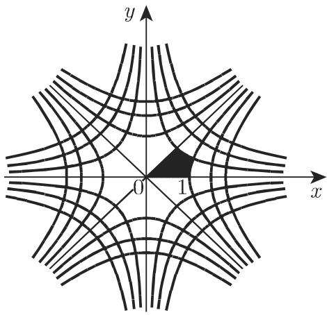  
14.13

  
14.14

这个映射的不动点是 $z = 0$ 和 $z = 1$ . 这个映射在 $z = 0$ 处不是共形的．

6. 线性与分式线性函数之和

用函数

$$
w = \frac {k}{2} \left(z + \frac {1}{z}\right) \quad (k \text {是一个实常数}, k > 0)\tag{14.17a}
$$

给出的共形映射，根据 (14.8)，以极坐标表示 $z = \rho \mathrm { e } ^ { \mathrm { i } \varphi }$ ，并分离其实部和虚部，可以变为

$$
u = \frac {k}{2} \left(\rho + \frac {1}{\rho}\right) \cos \varphi , v = \frac {k}{2} \left(\rho - \frac {1}{\rho}\right) \sin \varphi .\tag{14.17b}
$$

$z$ 平面的圆周 $\rho { = } \rho _ { 0 }$ ＝常数（图 14.15(a) ）被变为 $w$ 平面中的共焦椭圆（图 14.15(b))

$$
\frac {u ^ {2}}{a ^ {2}} + \frac {v ^ {2}}{b ^ {2}} = 1, \quad \text {其中} \quad a = \frac {k}{2} \left(\rho_ {0} + \frac {1}{\rho_ {0}}\right), \quad b = \frac {k}{2} \left| \rho_ {0} - \frac {1}{\rho_ {0}} \right|.\tag{14.17c}
$$

其焦点是实轴上的点 $\pm k . z$ 平面的单位圆周 $\rho = \rho _ { 0 } = 1$ 的像为 $w$ 平面的退化椭圆，实轴上被跑过两次的线段(—k,k)．单位圆周的内部和外部都被变为带有截口(— k,k) 的整个 $w$ 平面因而其反函数

$$
z = \frac {w + \sqrt {w ^ {2} - k ^ {2}}}{k}\tag{14.17d}
$$

是双值的． $z$ 平面的直线 $\varphi = \varphi _ { 0 }$ （图 14.15(C) ）变为焦点在 $\pm k$ 的共焦双曲线（图 14.15(d)):

$$
\frac {u ^ {2}}{\alpha^ {2}} - \frac {v ^ {2}}{\beta^ {2}} = 1, \quad \text {其中} \quad \alpha = k   \cos   \varphi_ {0}, \quad \beta = k   \sin   \varphi_ {0}.\tag{14.17e}
$$

相应千 平面的半坐标轴 $\left( \varphi = 0 , \frac { \pi } { 2 } , \pi , \frac { 3 \pi } { 2 } \right)$ 双曲线是退化的，在轴 $u = 0$ (v轴）上和实轴的区间 $( - \infty , - k )$ 和 $( k , \infty )$ （跑过两次）上．

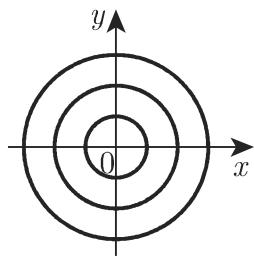

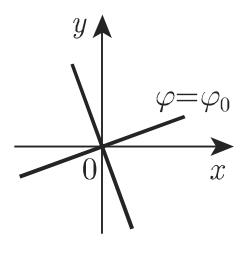  
14.15

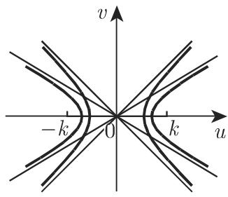

7. 对数

用对数函数形式

$$
w = \mathrm{Ln} z\tag{14.18a}
$$

给出的共形映射当 用极坐标给出时有形式

$$
u = \ln \rho , \quad v = \varphi + 2 k \pi \quad (k = 0, \pm 1, \pm 2, \dots).\tag{14.18b}
$$

从这个表达式即知坐标线 ＝常数和 ＝常数来自千 平面中以原点为中心的同心圆以及从 平面中以原点为起点的射线（图 14.16)．等距网是极网

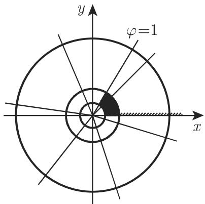  
14.16

对数函数 Lnz 是无穷多值的（参见第 990 (14.74c)).

局限千考察 Lnz 的主值 $\ln z \left( - \pi < v < \pi \right)$ ），那么整个 平面被映为 平面中由两条直线 $v = \pm \pi$ 所界的一条带， $v = \pi$ 属千此带．

8. 指数函数

用指数函数形式（亦见第 990 14.5.2,1.)

$$
w = \mathrm{e} ^ {z}\tag{14.19a}
$$

给出的共形映射在极坐标中有形式

$$
w = \rho \mathrm{e} ^ {\mathrm{i} \psi}.\tag{14.19b}
$$

从 $z = x + \mathrm { i } y$ 即得

$$
\rho = \mathrm{e} ^ {x} \quad {\text {和}} \quad \psi = y.\tag{14.19c}
$$

如果 从—冗到兀变化并且 从—oo 到＋oo 变化，那么 $\rho$ 取从0到 $\infty$ 的所有值，并且 $\psi$ 取从—冗到亢的所有值． 平面的平行千 $x$ 轴的加宽的带被变为整个$w$ 平面（图 14.17).

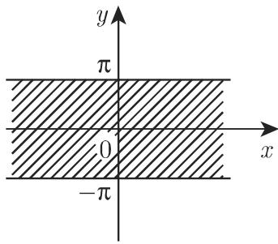  
(a)

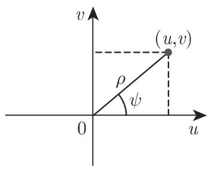  
(b)  
14.17

9. 施瓦茨—克里斯托费尔 (Christoffel) 公式

由施瓦茨—克里斯托费尔公式

$$
z = C _ {1} \int_ {0} ^ {w} \frac {\mathrm{d} t}{(t - w _ {1}) ^ {\alpha_ {1}} (t - w _ {2}) ^ {\alpha_ {2}} \cdots (t - w _ {n}) ^ {\alpha_ {n}}} + C _ {2},\tag{14.20a}
$$

$z$ 平面中一个多边形的内部被映为 $w$ 平面的上半平面． 该多边形有 个外角$\alpha _ { 1 } \mathfrak { N } , \alpha _ { 2 } \mathfrak { N } , \cdot \cdot \cdot , \alpha _ { n } \mathfrak { N }$ （图 $1 4 . 1 8 ( \mathrm { a } ) , ( \mathrm { b } ) )$ . 平而实轴上相应千多边形顶点的那些点记为 $w _ { i } ( i = 1 , \cdots , n )$ ，积分变量记为 t. 通过这个映射，多边形的有向边界被变为 $w$ 平面的有向实轴．对千大的 值，被积函数性状如 $1 / t ^ { 2 }$ ，并且在无穷远处是正规的．由千一个 $n$ 边形的所有外角之和等千 $2 \pi ,$ ，因而

$$
\sum_ {\nu = 1} ^ {n} \alpha_ {\nu} = 2.\tag{14.20b}
$$

复常数 $C _ { 1 }$ 和 $C _ { 2 }$ 产生一个旋转、一个伸缩和一个平移；它们不依赖千多边形的形式而只依赖千多边形在 平面中的位置

$w$ 平面的 个任意点 $w _ { 1 } , w _ { 2 } , w _ { 3 }$ 可以被指定给 平面多边形的 个点 $z _ { 1 } , z _ { 2 } , z _ { 3 }$ 在 $w$ 平面指定一个点为无穷远点 $w _ { 1 } = \pm \infty$ 相应千 $z$ 平面多边形的一个顶点例如 $z = z _ { 1 }$ ，此时因子 $( t - w _ { 1 } ) ^ { \alpha _ { 1 } }$ 就被略去了．如果多边形是退化的，即一个顶点在无穷远处，则相应的外角是亢，因而 $\alpha _ { \infty } = 1$ , 即多边形是一个半带形．

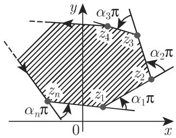  
(a)

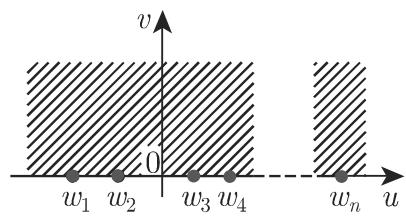  
(b)  
14.18

■ A: 平面中某个区域（图 14.19(a) 中阴影所围区域）的映射：考虑到 $\sum \alpha _ { \nu } = 2$ 如右表所示取 个点（图 14.19(a), (b)）．该映射的公式为

$$
z = C _ {1} \int_ {0} ^ {w} \frac {\mathrm{d} t}{(t + 1) t ^ {- 1 / 2}} = 2 C _ {1} (\sqrt {w} - \arctan \sqrt {w}) = \mathrm{i} \frac {2 d}{\pi} (\sqrt {w} - \arctan \sqrt {w}).
$$

<table><tr><td></td><td> $z_{\nu}$ </td><td> $\alpha_{\nu}$ </td><td> $w_{\nu}$ </td></tr><tr><td>A</td><td> $\infty$ </td><td>1</td><td>-1</td></tr><tr><td>B</td><td>0</td><td>-1/2</td><td>0</td></tr><tr><td>C</td><td> $\infty$ </td><td>3/2</td><td> $\infty$ </td></tr></table>

为了确定 $C _ { 1 }$ 作替换 $t = \rho \mathrm { e } ^ { \mathrm { i } \varphi } - 1$ , 得到

$\mathrm { i } d = C _ { 1 } \operatorname* { l i m } _ { \rho \to 0 } \int _ { \pi } ^ { 0 } \frac { \big ( - 1 + \rho \mathrm { e } ^ { \mathrm { i } \varphi } \big ) ^ { 1 / 2 } \mathrm { i } \rho \mathrm { e } ^ { \mathrm { i } \varphi } \mathrm { d } \varphi } { \rho \mathrm { e } ^ { \mathrm { i } \varphi } } = C _ { 1 } \pi ,$ 即 $C _ { 1 } = \mathrm { i } \frac { d } { \pi }$

  
14.19

考虑到映射对应 ${ } ^ {  } z = 0 \longrightarrow w = 0 { } ^ {  }$ , 即得 $C _ { 2 } = 0$

：一个矩形区域的映射．令矩形的顶点为 $z _ { 1 , 4 } = \pm K , z _ { 2 , 3 } = \pm K + \mathrm { i } K ^ { \prime }$ ．点 $z _ { 1 }$ 和$z _ { 2 }$ 被变为实轴上的点 $w _ { 1 } = 1$ 和 $w _ { 2 } = 1 / k ( 0 < k < 1 )$ ' $z _ { 4 }$ 和 $z _ { 3 }$ 是 $z _ { 1 }$ 和 $z _ { 2 }$ 关千虚轴的反射根据施瓦茨反射原理（参见第 967 14.1.3.3)，它们必定相应千点 $w _ { 4 } =$ -1 和 $w _ { 3 } = - 1 / k$ （图 14.20(a), (b)）．因而，上面描述的位置的矩形 $( \alpha _ { 1 } = \alpha _ { 2 } =$ $\alpha _ { 3 } = \alpha _ { 4 } = 1 / 2 )$ 映射公式为： $z = C _ { 1 } \int _ { 0 } ^ { w } { \frac { \mathrm { d } t } { \sqrt { ( t - w _ { 1 } ) ( t - w _ { 2 } ) ( t - w _ { 3 } ) ( t - w _ { 4 } ) } } } =$

$C _ { 1 } \int _ { 0 } ^ { w } \frac { \mathrm { d } t } { \sqrt { ( t ^ { 2 } - 1 ) \bigg ( t ^ { 2 } - \frac { 1 } { k ^ { 2 } } \bigg ) } }$ ．点 $z = 0$ 有像 $w = 0$ ，而 $z = \mathrm { i } K$ 的像为 $w = \infty$ .当$C _ { 1 } = 1 / k$ 时即得 $z = \int _ { 0 } ^ { w } \frac { \mathrm { d } t } { \sqrt { ( 1 - t ^ { 2 } ) ( 1 - k ^ { 2 } t ^ { 2 } ) } } = \int _ { 0 } ^ { \varphi } \frac { \mathrm { d } \vartheta } { \sqrt { 1 - k ^ { 2 } \sin ^ { 2 } \vartheta } } = F ( \varphi , k )$ （作替换 $t = \sin \vartheta , w = \sin \varphi ) . \ : F ( \varphi , k )$ 是第一类椭圆积分（参见第 653 8.1.4.3).考虑到映射对应 ${ } ^ {  } z = 0 \longrightarrow w = 0 { } ^ {  }$ 即得 $C _ { 2 } = 0$

  
(a)

  
(b)  
14.20

14.1.3.3 施瓦茨反射原理

1. 叙述

假设 f(z) 是域 中的一个复解析函数，并且 的边界包含一个线段 $g _ { 1 }$ .果 $f$ 在 $g _ { 1 }$ 上是连续的，并且它把线段 $g _ { 1 }$ 映为一个线段 $g _ { 1 } ^ { \prime }$ ，则关千 $g _ { 1 }$ 对称的两个点被变为关千 $g _ { 1 } ^ { \prime }$ 对称的两个点（图 14.21).

  
14.21

2. 应用

这个原理的应用使得施行运算以及具有直线边界平面区域的表示变得容易了：如果直线边界是一条流线（图 14.22 中的孤立边界），那么源被反射为源，汇被反射为汇，并且旋度被反射为相反旋转方向的旋度．如果直线边界是一条位势线（图 14.23中的高导电边界），那么源被反射为汇，汇被反射为源，并且旋度被反射为相同旋转方向的旋度

  
14.22

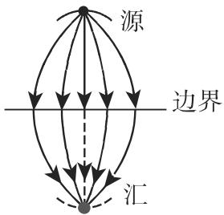  
14.23

14.1.3.4 复位势

1. 复位势的概念

考虑 $x , y$ 平面中具有连续和可微分量 $V _ { x } ( x , y )$ 和 $V _ { y } ( x , y )$ 的向量 $\vec { V }$ 的无源场和无旋场 $\vec { V } = \vec { V } ( x , y )$

a) 无源场 $\vec { V }$ 满足 $\mathrm { d i v } \vec { V } = 0$ ，即 $\frac { \partial V _ { x } } { \partial x } + \frac { \partial V _ { y } } { \partial y } = 0 ;$ 这是用场函数 (field function)或流函数 (stream function) $\varPsi ( x , y )$ 表达的微分方程

$$
\mathrm{d} \varPsi = - V _ {y} \mathrm{d} x + V _ {x} \mathrm{d} y = 0\tag{14.21a}
$$

的可积性条件，因而有

$$
V _ {x} = \frac {\partial \Psi}{\partial y}, \quad V _ {y} = - \frac {\partial \Psi}{\partial x}.\tag{14.21b}
$$

对千场 $\vec { V }$ 的两个点 $P _ { 1 }$ 和 $P _ { 2 }$ ，差 $\varPsi ( P _ { 2 } ) - \varPsi ( P _ { 1 } )$ 是通过连接点 $P _ { 1 }$ 和 $P _ { 2 }$ 的曲线当整个曲线在该场中时 流量的一个度量．

b) 无旋场 $\vec { V }$ 满足 $\cot { \vec { V } } = { \vec { 0 } } ;$ 即— $\frac { \partial V _ { y } } { \partial x } - \frac { \partial V _ { x } } { \partial y } = 0 ;$ 这是用势函数 $\varPhi ( x , y )$ 表达的微分方程

$$
\mathrm{d} \varPhi = V _ {x} \mathrm{d} x + V _ {y} \mathrm{d} y = 0\tag{14.22a}
$$

的可积性条件，因而有

$$
V _ {x} = \frac {\partial \Phi}{\partial x}, \quad V _ {y} = \frac {\partial \Phi}{\partial y}.\tag{14.22b}
$$

如果场既是无源的，又是无旋的，那么函数 $\varPhi$ 和 $\varPsi$ 满足柯西—黎曼微分方程（参见955 14.1.2.1)，并且两者都满足拉普拉斯微分方程 $( \Delta \phi = 0 , \Delta \varPsi = 0 )$ ．把函数 $\varPhi$ 和山组合为解析函数

$$
W = f (z) = \Phi (x, y) + \mathrm{i} \Psi (x, y),\tag{14.23}
$$

那么这个函数被称为场 $\vec { V }$ 的复位势．

此时，在物理学和电工学中通常记号意义下（参见第 941 13.3.1.6, 2.) $- \varPhi ( x$ $y )$ 是向量场 $\vec { V }$ 的位势． $\varPsi$ 和 $\varPhi$ 的等值线形成一个正交网对千复位势的导数和向量场 $\vec { V }$ ，下述方程成立：

$$
\frac {\mathrm{d} W}{\mathrm{d} z} = \frac {\partial \varPhi}{\partial x} - \mathrm{i} \frac {\partial \varPhi}{\partial y} = V _ {x} - \mathrm{i} V _ {y}, \qquad \frac {\overline {{\mathrm{d} W}}}{\mathrm{d} z} = \overline {{f ^ {\prime} (z)}} = V _ {x} + \mathrm{i} V _ {y}.\tag{14.24}
$$

2. 齐次场的复位势

当 $a$ 是实数时，函数

$$
W = a z\tag{14.25}
$$

是一个场的复位势，该场的位势线平行千 $y$ 轴，而方向线平行千 $x$ 轴（图 14.24) ．而一个复数 则导致场的旋转（图 14.25).

  
14.24

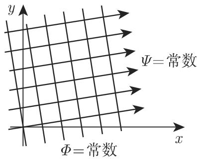  
14.25

3. 源与汇的复位势

在点 $z = z _ { 0 }$ 处有强度为 $s > 0$ 的源，其场的复位势满足方程

$$
W = \frac {s}{2 \pi} \ln (z - z _ {0}).\tag{14.26}
$$

在点 $z = z _ { 0 }$ 处有强度为 $s > 0$ 的汇，其场的复位势满足方程

$$
W = - \frac {s}{2 \pi} \ln (z - z _ {0}).\tag{14.27}
$$

方向线从 $z = z _ { 0 }$ 处径向地离去，而位势线是以点 $z = z _ { 0 }$ 为圆心的同心圆（图 14.26).

  
14.26

4. 源—汇系统的复位势

对千在点 $z _ { 1 }$ 有一源，在点 $z _ { 2 }$ 处有一与源同样强度的汇，通过叠加得到其复位势为

$$
W = \frac {s}{2 \pi} \ln \frac {z - z _ {1}}{z - z _ {2}}.\tag{14.28}
$$

位势线 $\varPhi =$ 常数形成关千 $z _ { 1 }$ 和 $z _ { 2 }$ 的阿波罗尼奥斯圆 (Apollonius circles) ；方向＝常数是通过 $z _ { 1 }$ 和 $z _ { 2 }$ 的圆（图 14.27).

  
14.27

5. 偶极子的复位势

一个在 $z _ { 0 }$ 处具有双极矩 $M > 0$ 的，并且其轴与 $x$ 轴的夹角为 $\alpha$ 的偶极子（图 14.28) 的复位势满足方程

$$
W = \frac {M \mathrm{e} ^ {\mathrm{i} \alpha}}{2 \pi (z - z _ {0})}.\tag{14.29}
$$

6. 旋度的复位势

如果旋度的强度是 $| { \cal T } |$ ，这里 是实的，并且其中心位千点 $z _ { 0 }$ 处，那么它的方程是

$$
W = \frac {\Gamma}{2 \pi \mathrm{i}} \ln (z - z _ {0}).\tag{14.30}
$$

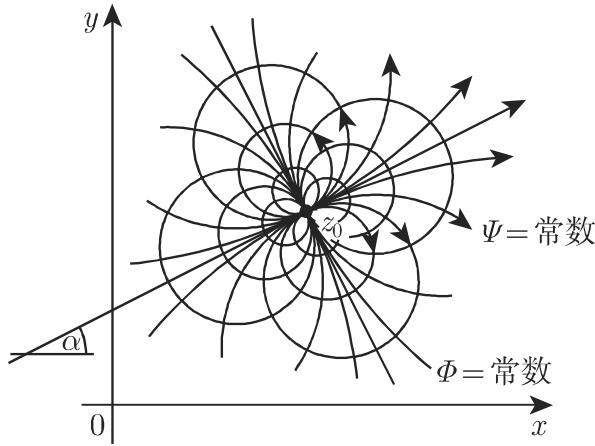  
14.28

与图 14.26 比较，方向线和位势线的作用互换了．对千复的 $T ,$ (14.30) 给出了旋度源的位势，其方向线和位势线形成相互正交的两族螺线（图 14.29).

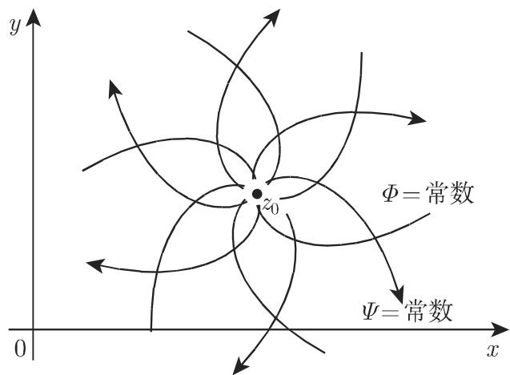  
14.29

14.1.3.5 叠加原理

1. 复位势的叠加

一个由一些源、汇和旋度组成的系统是一些单个场的叠加，即通过把它们的复位势和流函数相加而得到该系统的函数由千拉普拉斯微分方 $\Delta \varPhi = 0$ 和 $\Delta \varPsi = 0$ 的线性性，在数学上这是可能的．

2. 向量场的合成

(1) 积分 除了把复位势相加以外，还可以通过应用千权函数的积分来构作新的场．

·在具有密度函数 $\varrho ( s )$ 的一条曲线段上给定一个旋度．复位势的导数由一个柯西型积分（参见第 977 14.2.3) 给出

$$
\frac {\mathrm{d} W}{\mathrm{d} z} = \frac {1}{2 \pi \mathrm{i}} \int_ {(l)} \frac {\varrho (s) \mathrm{d} s}{z - \zeta (s)} = \frac {1}{2 \pi \mathrm{i}} \int_ {(l)} \frac {\varrho^ {*} (\zeta)}{z - \zeta} \mathrm{d} \zeta ,\tag{14.31}
$$

其中 ((s) 是具有弧长参数 的曲线 的复参数表示．

(2) 麦克斯韦 (Maxwell) 对角线方法 如果想做具有位势 $\varPhi _ { 1 }$ 和 $\varPhi _ { 2 }$ 的两个位势的叠加那么可以画位势线图［［ $\left[ \left[ \varPhi _ { 1 } \right] \right]$ 和［ $\left[ \left[ \varPhi _ { 2 } \right] \right]$ ］］，使得通过在两个系统中两条相邻的位势线之间的相同的量 而改变位势的值．此时，位势线的指向使得较大值的＠位千左边．对千由［ $\left[ \left[ \varPhi _ { 1 } \right] \right]$ 和［ $\left[ \left[ \varPhi _ { 2 } \right] \right]$ ］形成的网元素，位千对角线方向的线给出了场［［ $[ [ \phi ] ]$ 的位势线其位势为 $\varPhi = \varPhi _ { 1 } + \varPhi _ { 2 }$ 或＠ $\varPhi = \varPhi _ { 1 } - \varPhi _ { 2 }$ 此时，如果网元素的有向边作为向量是相加的，则得到［ $\left[ \left[ \varPhi _ { 1 } + \varPhi _ { 2 } \right] \right]$ ］的图 $1 4 . 3 0 ( \mathrm { a } )$ ，如果是相减的，则得到［ $\left[ \left[ \varPhi _ { 1 } - \varPhi _ { 2 } \right] \right]$ 的图 14.30(b)．通过从一条位势线到另一条对 作平移，就改变了复合位势的值．

·强度商为 $| e _ { 1 } | / | e _ { 2 } | = 3 / 2$ 的一个源和一个汇的向量线和位势线（图 14.31(a),(b)).

(a)  
  
(a)

  
(b)  
14.30

  
14.31  
(b)

14.1.3.6 复平面的任意映射

函数

$$
w = f (z = x + \mathrm{i} y) = u (x, y) + \mathrm{i} v (x, y)\tag{14.32a}
$$

被定义如果实变量的两个函数 $u ( x , y )$ 和 $v ( x , y )$ 被定义并且是已知的．函数 f(z)不一定是解析的，因为解析性要求它是一个共形映射．函数 $w$ 把 $z$ 平面映入 $w$ 平面即，对千每个点 $z _ { \nu } ,$ ，它指定了一个对应点 $w _ { \nu }$

a) 坐标线的变换

$$
\begin{array}{l l} {{y = c \longrightarrow u = u (x, c), \qquad v = v (x, c), \qquad x \mathrm{是参数};}} \\ {{x = c _ {1} \longrightarrow u = u (c _ {1}, y), \qquad v = v (c _ {1}, y), \qquad y \mathrm{是参数}.}} \end{array}\tag{14.32b}
$$

b) 几何图形的变换 $z$ 平面中的曲线或区域这样的儿何图形通常被变换为 $w$ 平面中的曲线或区域

$$
x = x (t), \quad y = y (t) \quad \rightarrow \quad u = u (x (t), y (t)), v = v (x (t), y (t)),
$$

是参数．

(14.32c)

·对千 $u = 2 x + y , v = x + 2 y$ 一族直线 $y = c$ 被变为 $u = 2 x + c , v = x + 2 c ,$ 因而变为直线族 $\displaystyle v = \frac { u } { 2 } + \frac { 3 } { 2 } c .$ 直线族 $x = c _ { 1 }$ 被变为族 $v = 2 u - 3 c _ { 1 }$ （图 14.5).14.5(a) 中的阴影部分被变为图 14.5(b) 中的阴影部分．

c) 黎曼曲面 对千儿个不同的 值，映射 $w = f ( z )$ 给出同一个 值，那么函的像由儿个“相互交叠＂的平面组成．切割这些平面，并沿着一条曲线把它们连接起来，就给出一个多层曲面，即所谓的多层黎曼曲面 (many-sheeted Riemannsurface) （见 [14.16] ）．在多值函数的情形，例如函数 $\sqrt [ n ] { z }$ Lnz, Arcsinz, Arctanz,这个对应也可以被考虑为一个逆关系

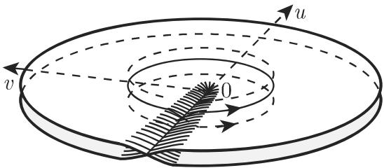  
14.32

■ $w = z ^ { 2 }$ ：当 $z = r \mathrm { e } ^ { \mathrm { i } \varphi }$ 跑遍整个 $z$ 平面即 $0 \leqslant \varphi < 2 \pi .$ ，则 $w = \varrho \mathrm { e } ^ { \mathrm { i } \psi } = r ^ { 2 } \mathrm { e } ^ { \mathrm { i } 2 \varphi }$ 覆盖 $w$ 平面两次根据图 14.32，可以想象把两个 平面相互置千另一个之上，沿着负实轴切割并把两个平面连接在一起．这个曲面被称为函数 $w = z ^ { 2 }$ 的黎曼曲面．原点被称为一个分支点 (branch point) ．函数 $w = \mathrm { e } ^ { z }$ （见 (14.69)）的像是一个无穷多层的黎曼曲面（在许多情形，黎曼曲面被沿着正实轴切割这取决千复数的主值是对千区间 $\left( - \pi , \pi \right]$ ］定义，还是对千区间 $[ 0 , 2 \pi )$ 定义的．）
