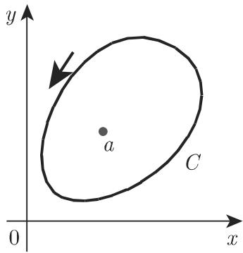

### 14.2 复平面中的积分

#### 14.2.1 定积分和不定积分

14.2.1.1 复平面中积分的定义

1. 复定积分

假设 f(z) 在一个域 中是连续的并且连接点 的曲线 完全在中曲线 被任意分点 $z _ { i }$ 分为 个子弧段（图 14.33).

在每个子弧段中选取一个点 $\zeta _ { i }$ ，并形成和式

$$
\sum_ {i = 1} ^ {n} f (\zeta_ {i}) \Delta z _ {i}, \quad \text {其中} \quad \Delta z _ {i} = z _ {i} - z _ {i - 1}.\tag{14.33a}
$$

如果当 $\Delta z _ { i }  0$ 以及 $n \to \infty$ 时，与诸点 $z _ { i }$ 和 $\zeta _ { i }$ 的选取无关地存在极限

$$
\lim _ {n \to \infty} \sum_ {i = 1} ^ {n} f (\zeta_ {i}) \Delta z _ {i},\tag{14.33b}
$$

则此极限被称为沿着连接点 的曲线 的复定积分 (definite complex inte-gral)

$$
I = \int_ {\widehat {A B}} f (z) \mathrm{d} z = (C) \int_ {A} ^ {B} f (z) \mathrm{d} z.\tag{14.33c}
$$

该积分的值通常依赖千积分的路径．

  
14.33

2. 复不定积分

如果定积分不依赖千积分路径（参见第 976 14.2.2)，则成立

$$
F (z) = \int f (z)   \mathrm{d} z + C, \quad \text {其中} \quad F ^ {\prime} (z) = f (z).\tag{14.34}
$$

这里 是积分常数，一般而言它是复的． $F ( z )$ 被称为复不定积分 (indefinitecomplex integral)．一个复变量初等函数的不定积分可以用一个实变量相应的初等函数的积分公式来计算．

$$
\blacksquare \mathbf {A} \colon \int \sin z \mathrm{d} z = - \cos z + C. \qquad \blacksquare \mathbf {B} \colon \int \mathrm{e} ^ {z} \mathrm{d} z = \mathrm{e} ^ {z} + C.
$$

3. 复定积分和复不定积分的关系

如果函数 $f ( z )$ 是解析的（参见第 954 14.1.2.1)，并且有一个不定积分，则其定积分和不定积分之间的关系为

$$
\int_ {\widehat {A B}} f (z) \mathrm{d} z = \int_ {A} ^ {B} f (z) \mathrm{d} z = F (z _ {B}) - F (z _ {A}).\tag{14.35}
$$

14.2.1.2 复积分的性质和求值

1. 与第二型线积分的比较

复定积分与第二型线积分（参见第 687 8.3.2) 有相同的性质

a) 颠倒积分路径的方向，积分改变符号．

b) 把积分路径分解成几个部分，总积分值等千这些部分积分值之和．

2. 积分值的估计

如果在积分路径 $\widehat { A B }$ 的每个点 处函数 $f ( z )$ 的绝对值不超过一个正数 M,并且 $\widehat { A B }$ 有长度 ，则

$$
\left| \int_ {\widehat {A B}} f (z) \mathrm{d} z \right| \leqslant M s.\tag{14.36}
$$

．用参数表示的复积分值的求值

如果用下述形式给出积分路径 $\widehat { A B }$ （或曲线 C)

$$
x = x (t), \quad y = y (t),\tag{14.37}
$$

其中 的可微函数，并且起始点和终点的 值是 $t _ { A }$ 和 $t _ { B }$ ，那么可以用两个实积分来计算复定积分．把被积函数的实部和虚部分开，则复积分为

$$
\begin{array}{r l} (C) \int_ {A} ^ {B} f (z) \mathrm{d} z & = \int_ {A} ^ {B} (u \mathrm{d} x - v \mathrm{d} y) + \mathrm{i} \int_ {A} ^ {B} (v \mathrm{d} x + u \mathrm{d} y) \\ & = \int_ {t _ {A}} ^ {t _ {B}} [ u (t) x ^ {\prime} (t) - v (t) y ^ {\prime} (t) ] \mathrm{d} t \\ & \quad + \mathrm{i} \int_ {t _ {A}} ^ {t _ {B}} [ v (t) x ^ {\prime} (t) + u (t) y ^ {\prime} (t) ] \mathrm{d} t, \end{array}\tag{14.38a}
$$

其中

$$
f (z) = u (x, y) + \mathrm{i} v (x, y), \quad z = x + \mathrm{i} y.\tag{14.38b}
$$

记号 $( C ) \int _ { A } ^ { B } f ( z ) \mathrm { d } z$ 意味着定积分是沿着在 之间的曲线 而被计算的记号 $\int _ { \widehat { A B } } f ( z ) \mathrm { d } z$ 也经常被用到它有相同的含义．

$I = \int _ { ( C ) } ( z - z _ { 0 } ) ^ { n } \mathrm { d } z \ ( n \in \mathbb { Z } )$ ．令曲线 是半径为 $r _ { 0 }$ ，圆心为 $z _ { 0 }$ 。的圆周：$x = x _ { 0 } + r _ { 0 } \cos t , y = y _ { 0 } + r _ { 0 } \sin t$ 其中 $0 \leqslant t \leqslant 2 \pi$ ．对千曲线 上的每个点 $z \colon$ $z = x + \mathrm { i } y = z _ { 0 } + r _ { 0 } ( \cos t + \mathrm { i } \sin t )$ ，有 $\mathrm { d } z = r _ { 0 } ( - \sin t + \mathrm { i } \cos t ) \mathrm { d } t$ 根据棣莫弗 (deMoivre) 公式在代入这些值并变换后即得 $I = r _ { 0 } ^ { n + 1 } \int _ { 0 } ^ { 2 \pi } ( \cos n t + \mathrm { i } \sin n t ) ( - \sin t +$ $\mathrm { i } \cos t ) \mathrm { d } t = r _ { 0 } ^ { n + 1 } \int _ { 0 } ^ { 2 \pi } [ \mathrm { i } \cos { ( n + 1 ) } t - \sin { ( n + 1 ) } t ] \mathrm { d } t = { \left\{ \begin{array} { l l } { 0 , } & { n \neq - 1 , } \\ { 2 \pi \mathrm { i } , } & { n = - 1 . } \end{array} \right. }$

4. 与积分路径的无关性

假设在一个单连通区域中定义了一个复变量的一个函数 f(z)．该函数的积分(14.33c) 可以与连接两个固定点 $A ( z _ { A } )$ ）和 $B ( z _ { B } )$ ）的路径无关．一个充要条件是：函f(z) 在此区域中是解析的，即函数 满足柯西—黎曼微分方程（参见第 955(14.4)）．此时等式 (14.35) 也成立如果一个区域由一条简单闭曲线所围，那么这个区域是单连通的 (simply connected).

5. 沿着一条闭曲线的复积分

假设在一个单连通区域 中函数 f(z) 是解析的．沿着 的边界闭曲线分函数 f(z)，根据柯西积分定理，这个积分的值为零（参见第 976 14.2.2):

$$
(C) \oint f (z) \mathrm{d} z = 0.\tag{14.39}
$$

如果 f(z) 在这个区域中有奇点则用留数定理（参见第 984 14.3.5.5), 或由公式(14.38a) 来计算积分

·在 $z = a$ 处有一个奇点的函数 $f ( z ) = { \frac { 1 } { z - a } }$ 对千以逆时针方向围绕 的闭曲（图 14.34) 有积分值 $( C ) \oint z - a { \mathrm { ~ } } \mathrm { d } z = 2 \pi { \mathrm { i } } \operatorname { R e s } f ( z ) | _ { z = a } = 2 \pi { \mathrm { i } }$

  
14.34

#### 14.2.2 柯西积分定理

14.2.2.1 单连通区域的柯西积分定理

如果在一个单连通区域 中函数 f(z) 是解析的，则成立两个等价的陈述：

a) 沿着 中任意一条闭曲线 $C ,$ ，积分等千零：

$$
(C) \oint f (z) \mathrm{d} z = 0.\tag{14.40}
$$

b) 积分 $\int _ { A } ^ { B } f ( z ) \mathrm { d } z$ 的值与连接点 的，并在 中的曲线 无关即它仅依赖千 B.

这就是柯西积分定理 (Cauchy integral theorem).

14.2.2.2 多连通区域的柯西积分定理

如果 $C , C _ { 1 } , C _ { 2 } , \cdots , C _ { n }$ 是一些简单闭曲线，使得曲线 包围了所有的 $C _ { \nu } \left( \nu \right. =$ $1 , 2 , \cdots , n )$ ，诸曲线 $C _ { \nu }$ 互不包含和相交，并且函数 f(z) 在包含诸曲线以及诸 $C _ { \nu }$ 之间区域的区域 14.35 中的阴影区域 中是解析的以及诸曲线 $C , C _ { 1 } , C _ { 2 } , \cdots , C _ { n }$ 有相同的定向，如都是逆时针方向，则有

$$
\oint_ {C} f (z) \mathrm{d} z = \oint_ {C _ {1}} f (z) \mathrm{d} z + \oint_ {C _ {2}} f (z) \mathrm{d} z + \dots + \oint_ {C _ {n}} f (z) \mathrm{d} z.\tag{14.41}
$$

当一条闭曲线 还包含了函数 $f ( z )$ 的一些奇点在内时（参见第 984 14.3.5.5),这个定理对千沿着曲线 计算 f(z) 的积分是很有用的．

·计算积分 $\oint _ { C } { \frac { z - 1 } { z ( z + 1 ) } } \mathrm { d } z$ ，其中 是包含原点和点Z= 的一条简单闭曲线（图 14.36)．应用柯西积分定理沿着 的积分等千沿着 $C _ { 1 }$ 和 $C _ { 2 }$ 的积分之和，其中 $C _ { 1 }$ 是以原点为心，半径为 $r _ { 1 } = 1 / 2$ 的圆周 $C _ { 2 }$ 是以 $z = - 1$ 为心，半径为$r _ { 2 } = 1 / 2$ 的圆周．被积函数可以被分解为部分分式．因而得到 $\oint _ { C } { \frac { z - 1 } { z ( z + 1 ) } } \mathrm { d } z =$ $\oint _ { C _ { 1 } } { \frac { 2 \mathrm { d } z } { z + 1 } } + \oint _ { C _ { 2 } } { \frac { 2 \mathrm { d } z } { z + 1 } } - \oint _ { C _ { 1 } } { \frac { \mathrm { d } z } { z } } - \oint _ { C _ { 2 } } { \frac { \mathrm { d } z } { z } } = 0 + 4 \pi \mathrm { i } - 2 \pi \mathrm { i } = 2 \pi \mathrm { i }$ . （与第 97514.2.1.2, 3. 例中的积分比较．）

  
14.35

  
14.36

#### 14.2.3 柯西积分公式

14.2.3.1 在一个区域内点集上的解析函数

如果 f(z) 在一条简单闭曲线 以及它内部的单连通区域上是解析的，那么对千该单连通区域的每个内点 （图 14.37)，下述表达式成立：

$$
f (z) = \frac {1}{2 \pi \mathrm{i}} \oint_ {C} \frac {f (\zeta)}{\zeta - z}   \mathrm{d} \zeta \qquad (\text {柯西积分公式}),\tag{14.42}
$$

其中 $\zeta$ （逆时针地走过曲线 C. 利用这个公式，解析函数在一个区域内部的值被该函数在区域边界上的值所表示．从 (14.42) 即得该函数的 次导数的存在性以及其积分表达式在区域 上是解析的：

$$
f ^ {(n)} (z) = \frac {n !}{2 \pi \mathrm{i}} \oint_ {C} \frac {f (\zeta)}{(\zeta - z) ^ {n + 1}} \mathrm{d} \zeta .\tag{14.43}
$$

因而如果一个复函数是可微的，即，它是解析的，那么它是无穷多次可微的．与此相反，在实数的情形，可微性并不包含反复的可微性．

方程 (14.42) (14.43) 被称为柯西积分公式 (Cauchy integral formulas).

14.2.3.2 在一个区域外点集上的解析函数

如果一个函数 f(z) 在平面上一条闭积分曲线 的整个外部是解析的，那么函f(z) 在此外部区域中的一点 处的值及其各阶导数的值可以用相同的柯西公式(14.42), (14.43) 来给出，但是曲线 现在是顺时针方向（图 14.38).

借助千柯西积分公式还可以计算某些实积分（参见第 984 14.4).

  
14.37

  
14.38
