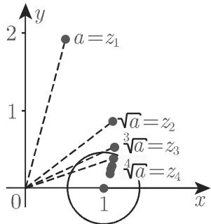
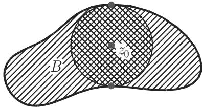
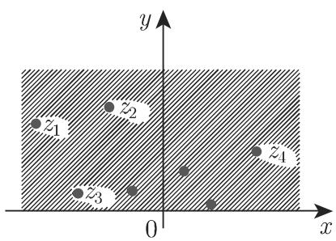

### 14.3 解析函数的幂级数展开

#### 14.3.1 复项级数的收敛性

14.3.1.1 复数序列的收敛性

复数的一个无穷序列 $z _ { 1 } , z _ { 2 } , \cdots , z _ { n } , \cdots$ ·有一个极限 $z \ ( z = \operatorname* { l i m } _ { n  \infty } \ z _ { n } )$ ，如果对每个任意给定的正数 ，存在一个 $n _ { 0 }$ ，使得对每个 $n > n _ { 0 }$ 。成立不等式 $\vert z - z _ { n } \vert < \varepsilon$ 即，从某个 $n _ { 0 }$ 开始，诸数 $z _ { n } , z _ { n + 1 } , \cdot \cdot \cdot$ ·所表示的点都在以 为圆心，半径为 $\varepsilon$ 的圆内．

·如果表达式｛妒计表示具有最小非负辐角的根，那么对千任意复数 $a \neq 0$ 极限等式 $\operatorname* { l i m } _ { n \to \infty } \{ \sqrt [ n ] { a } \} = 1$ 成立（图 14.39).

14.3.1.2 复项无穷级数的收敛性

具有复项 $a _ { i }$ 的一个级数 $a _ { 1 } + a _ { 2 } + \cdots + a _ { n } + \cdot \cdot$ ·收敛到数 $s ,$ 称为该级数的和，如果部分和 $s _ { n }$

$$
s _ {n} = a _ {1} + a _ {2} + \dots + a _ {n} \quad (n = 1, 2, \dots)\tag{14.44}
$$

的序列收敛到 s. 平面上用折线连接相应千诸数 $s _ { n } = a _ { 1 } + a _ { 2 } + \cdots + a _ { n }$ 的点那么收敛性就意味着折线的末端趋近千点 s.

$$
\text {A:} \mathrm{i} + \frac {\mathrm{i} ^ {2}}{2} + \frac {\mathrm{i} ^ {3}}{3} + \frac {\mathrm{i} ^ {4}}{4} + \dots . \quad \text {B:} \mathrm{i} + \frac {\mathrm{i} ^ {2}}{2} + \frac {\mathrm{i} ^ {3}}{2 ^ {2}} + \dots \quad (\text {图 14.40}).
$$

一个级数被称为绝对收敛的 (absolutely convergent) （见 B) ，如果绝对值级数 $| a _ { 1 } | + | a _ { 2 } | + | a _ { 3 } | + \cdot \cdot \cdot$ ..也是收敛的．级数被称为条件收敛的 (conditionallyconvergent) （见 A)，如果该级数收敛，但不是绝对收敛的．如果级数的诸项是函fi(Z) ，如

$$
f _ {1} (z) + f _ {2} (z) + \dots + f _ {n} (z) + \dots ,\tag{14.45}
$$

那么其和是一个函数，它对千使得函数值级数收敛的那些 值有定义．

  
14.39

  
14.40

14.3.1.3 复项幕级数

1. 收敛性

一个具有复系数的幕级数有形式

$$
P (z - z _ {0}) = a _ {0} + a _ {1} (z - z _ {0}) + a _ {2} (z - z _ {0}) ^ {2} + \dots + a _ {n} (z - z _ {0}) ^ {n} + \dots ,\tag{14.46a}
$$

其中 $z _ { 0 }$ 是复平面中的一个固定点诸系数是复常数（也可以有实值）．对千 $z _ { 0 } = 0$ 幕级数有形式

$$
P (z) = a _ {0} + a _ {1} z + a _ {2} z ^ {2} + \dots + a _ {n} z ^ {n} + \dots .\tag{14.46b}
$$

如果对于某个值 $z _ { 1 }$ 幕级数 $P ( z - z _ { 0 } )$ 收敛，那么在以 $z _ { 0 }$ 为心，半径为 $r = | z _ { 1 } - z _ { 0 } |$ 的圆内部的每个点 z, $P ( z - z _ { 0 } )$ 是绝对且一致收敛的．

2. 收敛圆

一个复幕级数的收敛性区域与发散性区域之间的界限是一个唯一确定的圆周．如在实数情形一样，如果极限

$$
r = \frac {1}{\lim _ {n \to \infty} \sqrt [ n ]{| a _ {n} |}} \quad \text {或} \quad r = \lim _ {n \to \infty} \left| \frac {a _ {n}}{a _ {n + 1}} \right|\tag{14.47}
$$

存在，则就确定了该圆的半径．如果级数除了在 $z = z _ { 0 }$ 外处处发散，则 $r = 0 \cdot$ ；如果它处处收敛，则 $r = \infty$ ．幕级数在收敛性区域的边界圆周上的性状必须逐点地加以考察．

·收敛半径为 的幕级数 $P ( z ) = \sum _ { n = 1 } ^ { \infty } { \frac { z ^ { n } } { n } }$ 当 $z = 1$ 时是发散的（调和级数），当$z = - 1$ 时是收敛的（根据交错级数的莱布尼茨准则（参见第 621 7.2.3.3, 1.)).除了点 $z = 1$ 之外，这个幕级数对千单位圆 $| z | = 1$ 上所有别的点都是收敛的．

3. 收敛圆中幕级数的导数

在收敛圆内部每个幕级数表示一个解析函数通过逐项求导得到其导数导数级数与原级数有相同的收敛半径．

4. 收敛圆中幕级数的积分

通过对 f(z) 的幕级数的逐项积分可以得到积分 $\int _ { z _ { 0 } } ^ { z } f ( \zeta ) \mathrm { d } \zeta$ 的幕级数表达式．收敛半径保持不变

#### 14.3.2 泰勒级数

在一个区域 中每个解析函数 f(z) 对千任意 $z _ { 0 } \in G$ 都可以被唯一地展开为形如

$$
f (z) = \sum_ {n = 0} ^ {\infty} a _ {n} (z - z _ {0}) ^ {n} \quad (\text {泰勒级数})\tag{14.48a}
$$

的幕级数，其收敛圆是以 $z _ { 0 }$ 为心的完全属千区域 的最大的圆（图 14.41)．一般而言 $a _ { n }$ 是复数；它们巾下式得到

$$
a _ {n} = \frac {f ^ {(n)} (z _ {0})}{n !}.\tag{14.48b}
$$

这样，泰勒级数就可以被写为

$$
f (z) = f \left(z _ {0}\right) + \frac {f ^ {\prime} \left(z _ {0}\right)}{1 !} \left(z - z _ {0}\right) + \frac {f ^ {\prime \prime} \left(z _ {0}\right)}{2 !} \left(z - z _ {0}\right) ^ {2} + \dots + \frac {f ^ {(n)} \left(z _ {0}\right)}{n !} \left(z - z _ {0}\right) ^ {n} + \dots .\tag{14.48c}
$$

每个幕级数在其收敛圆内部是其和函数的泰勒展式．

·第 990 14.5.2 中函数 $\mathrm { e } ^ { z }$ , sin z, cos z, sinh z, cosh 的级数表达式是泰勒展式的例子

  
14.41

#### 14.3.3 解析延拓原理

考虑两个幕级数

$$
f _ {0} (z) = \sum_ {n = 0} ^ {\infty} a _ {n} (z - z _ {0}) ^ {n} \quad {\text {和}} \quad f _ {1} (z) = \sum_ {n = 0} ^ {\infty} b _ {n} (z - z _ {1}) ^ {n},\tag{14.49a}
$$

它们各自围绕 $z _ { 0 }$ 和 $z _ { 1 }$ 的收敛圆 $K _ { 0 }$ 和 $K _ { 1 }$ 有某个公共区域（图 14.42)，并且在这个区域中它们相等

$$
f _ {0} (z) = f _ {1} (z).\tag{14.49b}
$$

此时，属千点 $z _ { 0 }$ 和 $z _ { 1 }$ 的两个幕级数是同一个解析函数 $f ( z )$ 的泰勒展式．函数 $f _ { 1 } ( z )$ 被称为只定义在 $K _ { 0 }$ 。中的函数 $f _ { 0 } ( z )$ 在 $K _ { 1 }$ 中的解析延拓 (analytic continuation).

·儿何级数 $f _ { 0 } ( z ) = \sum _ { n = 0 } ^ { \infty } z ^ { n }$ 围绕 $z _ { 0 } = 0$ 有收敛圆 $K _ { 0 } \left( r _ { 0 } = 1 \right)$ ，函数 $f _ { 1 } ( z ) =$ ${ \frac { 1 } { 1 - \mathrm { i } } } \sum _ { n = 0 } ^ { \infty } \left( { \frac { z - \mathrm { i } } { 1 - \mathrm { i } } } \right) ^ { n }$ 绕 $z _ { 1 } = \mathrm { i }$ 有收敛圆 $K _ { 1 } \left( r _ { 1 } = { \sqrt { 2 } } \right)$ 在它们自己的收敛圆中它们以解析函数 $f ( z ) = 1 / ( 1 - z )$ 作为它们的和，因而在两个收敛圆的公共部分（图 14.42 中的双重阴影部分）中亦然 $( z \neq 1 )$ ．所以 $, f _ { 1 } ( z )$ $f _ { 0 } ( z )$ 从 $K _ { 0 }$ 到 $K _ { 1 }$ 中的解析延拓（反之亦然）．

  
14.42

  
14.43

#### 14.3.4 洛朗展开式

每个在以 $z _ { 0 }$ 为心，半径分别为 $r _ { 1 }$ 和 $r _ { 2 }$ 的两个同心圆周之间的圆环内部解析的函数可以被展开为一个广义幕级数，所谓的洛朗 (Laurent) 级数：

$$
\begin{array}{l} f (z) = \sum_ {n = - \infty} ^ {\infty} a _ {n} \left(z - z _ {0}\right) ^ {n} \\ = \dots + \frac {a _ {- k}}{\left(z - z _ {0}\right) ^ {k}} + \frac {a _ {- k + 1}}{\left(z - z _ {0}\right) ^ {k - 1}} + \dots + \frac {a _ {- 1}}{z - z _ {0}} + a _ {0} + a _ {1} \left(z - z _ {0}\right) \\ + a _ {2} \left(z - z _ {0}\right) ^ {2} + \dots + a _ {k} \left(z - z _ {0}\right) ^ {k} + \dots . \end{array} \tag {14}\tag{14.50a}
$$

诸系数 $a _ { n }$ 通常是复的，它们由公式

$$
a _ {n} = \frac {1}{2 \pi \mathrm{i}} \oint_ {C} \frac {f (\zeta)}{(\zeta - z _ {0}) ^ {n + 1}} \mathrm{d} \zeta (n = 0, \pm 1, \pm 2, \dots)\tag{14.50b}
$$

唯一确定，其中 表示一条任意的闭曲线它在圆环 $r _ { 1 } < | z | < r _ { 2 }$ 中，并且半径为$r _ { 1 }$ 的圆在其内部，其方向是逆时针的（图 14.43)．如果函数 f(z) 的定义域 大千该圆环，那么其洛朗级数 (Laurent series) 的收敛域是以 $z _ { 0 }$ 为心，整个包含在的最大圆环

·在围绕 $z _ { 0 } = 0$ 的圆环 $1 < | z | < 2$ 中函数 $f ( z ) = { \frac { 1 } { ( z - 1 ) ( z - 2 ) } }$ 的洛朗级数展式被确定， $f ( z )$ 在此圆环中是解析的首先把 $f ( z )$ 分解为部分分式： $f ( z ) =$ $\frac { 1 } { z - 2 } - \frac { 1 } { z - 1 }$ 因为在所考虑的区域中成立 $| 1 / z | < 1 \ F \mathbb { I } \ | z / 2 | < 1$ ，因此这个分解的两项都可以被写为在整个圆环 $1 < | z | < 2$ 中绝对收敛的几何级数之和因此得到

$$
\begin{array}{r l} & {f (z) = \frac {1}{(z - 1) (z - 2)} = - \frac {1}{z \left(1 - \frac {1}{z}\right)} - \frac {1}{2 \left(1 - \frac {z}{2}\right)} = - \underbrace {\sum_ {n = 1} ^ {\infty} \frac {1}{z ^ {n}}} _ {| z | > 1} - \frac {1}{2} \underbrace {\sum_ {n = 0} ^ {\infty} \left(\frac {z}{2}\right) ^ {n}} _ {| z | <   2}} \\ & {\qquad = \sum_ {n = - \infty} ^ {\infty} a _ {n} z ^ {n}, \quad \text {其中} \quad a _ {n} = \left\{ \begin{array}{l l} {- 1,} & {n = - 1, - 2, \dots ,} \\ {\frac {- 1}{2 ^ {n + 1}},} & {n = 0, 1, 2, \dots .} \end{array} \right.} \end{array}
$$

#### 14.3.5 孤立奇点和留数定理

14.3.5.1 孤立奇点

如果一个函数中点 $z _ { 0 }$ 的一个邻域中除了点 $z _ { 0 }$ 本身外是解析的，则称 $z _ { 0 }$ 为函数 $f ( z )$ 的一个孤立奇点 (isolated singular point) ．如果在 $z _ { 0 }$ 的邻域中 $f ( z )$ 可以被展开为一个洛朗级数

$$
f (z) = \sum_ {n = - \infty} ^ {\infty} a _ {n} (z - z _ {0}) ^ {n},\tag{14.51}
$$

则可以根据洛朗级数的性状对孤立奇点加以分类：

1. 如果洛朗级数不包含 $\left( z - z _ { 0 } \right)$ 的任意负幕次项，即，对千 $n < 0$ 有 $a _ { n } = 0$ 则洛朗级数是一个泰勒级数，其系数由柯西积分定理给出

$$
a _ {n} = \frac {1}{2 \pi \mathrm{i}} \oint_ {K} (\zeta - z _ {0}) ^ {- n - 1} f (\zeta) \mathrm{d} \zeta = \frac {f ^ {(n)} (z _ {0})}{n !} \quad (n = 0, 1, 2, \dots).\tag{14.52}
$$

在此情形，函数 $f ( z )$ 本身在点 $z _ { 0 }$ 处也是解析的，并且 $f ( z _ { 0 } ) = a _ { 0 }$ ，或者说 $z _ { 0 }$ 是一个可去奇点

2. 如果洛朗级数包含 $\left( z - z _ { 0 } \right)$ 的有限个负幕次项，即，存在 $m > 0$ 使得$a _ { - m } \neq 0$ 且对千 $n > m$ 有 $a _ { - n } = 0 .$ ，则 $z _ { 0 }$ 被称为一个极点 (pole)，一个 阶极点(pole of order m) ，或者一个 重极点 (pole of multiplicity m) ．乘以 $( z - z _ { 0 } ) ^ { m }$ 并且不是乘以任何低次幕， $f ( z )$ 就被变为一个在 $z _ { 0 }$ 及其邻域中的解析函数

■ $f ( z ) = { \frac { 1 } { 2 } } \left( z + { \frac { 1 } { z } } \right)$ 在 $z = 0$ 处有一个一阶极点．

3. 如果洛朗级数包含 $\left( z - z _ { 0 } \right)$ 的无穷多个负幕次项，那么 $z _ { 0 }$ 是 $f ( z )$ 的一个本质奇点 (essential singularity).

趋近千一个极点 $| f ( z ) |$ 趋千无穷趋近千一个本质奇点 $f ( z )$ 任意接近千任一复数 c.

·函数 $f ( z ) = \mathrm { e } ^ { 1 / z }$ ，其洛朗级数为 $f ( z ) = \sum _ { n = 0 } ^ { \infty } { \frac { 1 } { n ! } } { \frac { 1 } { z ^ { n } } }$ 在 z=O 处有一个本质奇点

14.3.5.2 亚纯函数

如果一个函数在除了一些都是极点的孤立奇点之外是全纯的，那么这个函数被称为亚纯的 (meromorphic)．亚纯函数总可以表示为两个解析函数之商．

·有有限个极点的有理函数，还有如 $\tan z = { \frac { \sin z } { \cos z } }$ 和 $\cot z = { \frac { \cos z } { \sin z } }$ 的超越函数是在全平面亚纯的函数的例子．

14.3.5.3 椭圆函数

椭圆函数是双周期函数，它的奇点是极点，即，它们是有两个独立周期的亚纯函数（参见第 995 14.6)．如果两个周期是 $\omega _ { 1 }$ 和 $\omega _ { 2 }$ ，它们不是实相关的，则

$$
f (z + m \omega_ {1} + n \omega_ {2}) = f (z) \quad \left(m, n = 0, \pm 1, \pm 2, \dots ; \operatorname{Im} \left(\frac {\omega_ {1}}{\omega_ {2}}\right) \neq 0\right).\tag{14.53}
$$

在顶点为 $0 , \omega _ { 1 } , \omega _ { 1 } + \omega _ { 2 } , \omega _ { 2 }$ 的原始周期平行四边形中， $f ( z )$ 已遍及其值域．

14.3.5.4 留数

设 $z _ { 0 }$ 为函数 $f ( z )$ 的一个孤立奇点则在 $z _ { 0 }$ 的邻域中成立的 $f ( z )$ 的洛朗展式中 $( z - z _ { 0 } ) ^ { - 1 }$ 的系数 $a \mathrm { - } 1$ 被称为在点 $z _ { 0 }$ 处函数 f(z) 的留数 (residue of thefunction f (z) ）．根据 (14.50b) ，有

$$
a _ {- 1} = \mathrm{Res} f (z) | _ {z = z _ {0}} = \frac {1}{2 \pi \mathrm{i}} \oint_ {K} f (\zeta) \mathrm{d} \zeta .\tag{14.54a}
$$

由公式

$$
a _ {- 1} = \mathrm{Res} f (z) | _ {z = z _ {0}} = \lim _ {z \to z _ {0}} \frac {1}{(m - 1) !} \frac {\mathrm{d} ^ {m - 1}}{\mathrm{d} z ^ {m - 1}} [ f (z) (z - z _ {0}) ^ {m} ]\tag{14.54b}
$$

可以计算属千一个 阶极点的留数．如果函数可以表示成商 $f ( z ) = \varphi ( z ) / \psi ( z )$ ，其中函数 $\varphi ( z )$ 和 $\psi ( z )$ 在点 $z = z _ { 0 }$ 处是解析的，并且 $z _ { 0 }$ 。是函数 $\psi ( z )$ 的一个单根，即有 $\psi ( z _ { 0 } ) = 0$ 且 $\psi ^ { \prime } ( z _ { 0 } ) \ne 0$ ，则 $z _ { 0 }$ 。是函数 $f ( z )$ 的一个一阶极点心从 (14.54b)即得

$$
\mathrm{Res} \left[ \frac {\varphi (z)}{\psi (z)} \right] _ {z = z _ {0}} = \frac {\varphi (z _ {0})}{\psi^ {\prime} (z _ {0})}.\tag{14.54c}
$$

也为 $\vec { \textbf { J } } \boldsymbol { z } _ { 0 }$ 是函数 $f ( z )$ 的一阶极点还需加上条件 ${ } ^ { 6 \ell } \varphi ( z _ { 0 } ) \ne 0 ^ { \mathfrak { s } }$ . 译者注如果 $z _ { 0 }$ 是函数 $\psi ( z )$ 的一个 重的根，即成立 $\psi ( z _ { 0 } ) = \psi ^ { \prime } ( z _ { 0 } ) = \cdots = \psi ^ { ( m - 1 ) } ( z _ { 0 } ) = 0$ 且 $\psi ^ { ( m ) } ( z _ { 0 } ) \neq 0$ ，则点 $z = z _ { 0 }$ 是 $f ( z )$ 的一个 阶极点．

14.3.5.5 留数定理

借助千留数可以计算函数在沿着一条包含孤立奇点在其内部的闭曲线（图 14.44)的积分

如果在一个其边界为闭曲线 的单连通区域 中除了有限个点 $z _ { 0 } , z _ { 1 } , z _ { 2 } , \cdots ,$ $z _ { n }$ 处外函数 $f ( z )$ 是单值的和解析的，则该函数沿着逆时针方向边界曲线 $C$ 的积分为 而与所有这些奇点处留数之和的乘积：

$$
\oint_ {C} f (z) \mathrm{d} z = 2 \pi \mathrm{i} \sum_ {k = 0} ^ {n} \mathrm{Res} f (z) | _ {z = z _ {k}}.\tag{14.55}
$$

·函数 $f ( z ) = \mathrm { e } ^ { z } / ( z ^ { 2 } + 1 )$ 在 $z _ { 1 , 2 } = \pm \mathrm { i }$ 处有一阶极点．相应的留数之和为 sin 1.如果 是以原点为心，半径 $r > 1$ 的一个圆周，则

$$
\oint_ {K} \frac {\mathrm{e} ^ {z}}{z ^ {2} + 1} \mathrm{d} z = 2 \pi \mathrm{i} \left(\frac {\mathrm{e} ^ {z _ {1}}}{2 z _ {1}} + \frac {\mathrm{e} ^ {z _ {2}}}{2 z _ {2}}\right) = 2 \pi \mathrm{i} \left(\frac {\mathrm{e} ^ {\mathrm{i}}}{2 \mathrm{i}} - \frac {\mathrm{e} ^ {- \mathrm{i}}}{2 \mathrm{i}}\right) = 2 \pi \mathrm{i} \sin 1.
$$

  
14.44

  
14.45
