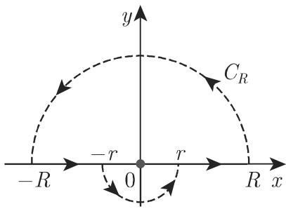
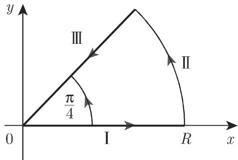

### 14.4 用复积分计算实积分

#### 14.4.1 柯西积分定理的应用

借助千柯西积分定理可以计算某些实积分的值．

·函数 $f ( z ) = \mathrm { e } ^ { z }$ 在整个 平面中是解析的，它可以用柯西积分公式 (14.42) 来表示，其中积分路径 是中心为 z, 半径为 的圆周该圆周的方程为 $\zeta = z + r \mathrm { e } ^ { \mathrm { i } \varphi }$ (14.43) 即得

$$
\begin{array}{r l} & {\mathrm{e} ^ {z} = \frac {n !}{2 \pi \mathrm{i}} \oint_ {C} \frac {\mathrm{e} ^ {\zeta}}{(\zeta - z) ^ {n + 1}} \mathrm{d} \zeta = \frac {n !}{2 \pi \mathrm{i}} \int_ {\varphi = 0} ^ {\varphi = 2 \pi} \frac {\mathrm{e} ^ {(z + r \mathrm{e} ^ {\mathrm{i} \varphi})}}{r ^ {n + 1} \mathrm{e} ^ {\mathrm{i} \varphi (n + 1)}} \mathrm{i} r \mathrm{e} ^ {\mathrm{i} \varphi} \mathrm{d} \varphi} \\ & {\quad = \frac {n !}{2 \pi r ^ {n}} \int_ {0} ^ {2 \pi} \mathrm{e} ^ {z + r \cos \varphi + \mathrm{i} r \sin \varphi - \mathrm{i} n \varphi} \mathrm{d} \varphi ,} \end{array}
$$

因而

$$
\begin{array}{r l} & {\frac {2 \pi r ^ {n}}{n !} = \int_ {0} ^ {2 \pi} \mathrm{e} ^ {r \cos \varphi + \mathrm{i} (r \sin \varphi - n \varphi)} \mathrm{d} \varphi = \int_ {0} ^ {2 \pi} \mathrm{e} ^ {r \cos \varphi} [ \cos (r \sin \varphi - n \varphi) ] \mathrm{d} \varphi} \\ & {\qquad + \mathrm{i} \int_ {0} ^ {2 \pi} \mathrm{e} ^ {r \cos \varphi} [ \sin (r \sin \varphi - n \varphi) ] \mathrm{d} \varphi .} \end{array}
$$

比较实部和虚部既然虚部为零，即有 $\int _ { 0 } ^ { 2 \pi } \mathrm { e } ^ { r \cos \varphi } \bigl [ \cos \left( r \sin \varphi - n \varphi \right) \bigr ] \mathrm { d } \varphi = \frac { 2 \pi r ^ { n } } { n ! } .$

#### 14.4.2 留数定理的应用

借助千留数定理可以计算一个变量实函数的一些定积分．如果在复平面的包含实轴的上半平面中除了实轴上方有限个奇点 $z _ { 1 } , z _ { 2 } , \cdots , z _ { n }$ 处（图 14.45) 外，函数$f ( z )$ 是解析的，并且如果方程 $f ( 1 / z ) = 0$ 的根之一有重数 $m \geqslant 2$ （参见第 561.6.3.1, 1.) ，则

$$
\int_ {- \infty} ^ {+ \infty} f (x) \mathrm{d} x = 2 \pi \mathrm{i} \sum_ {i = 1} ^ {n} \operatorname{Res} f (z) | _ {z = z _ {i}}.\tag{14.56}
$$

·积分 $\int _ { - \infty } ^ { + \infty } \frac { \mathrm { d } x } { ( 1 + x ^ { 2 } ) ^ { 3 } }$ 的计算方程 $f \left( { \frac { 1 } { x } } \right) = { \frac { 1 } { \left( 1 + { \frac { 1 } { x ^ { 2 } } } \right) ^ { 3 } } } = { \frac { x ^ { 6 } } { ( x ^ { 2 } + 1 ) ^ { 3 } } } = 0$ 在$x = 0$ 处有一个 重根函数 $w = \frac { 1 } { ( 1 + z ^ { 2 } ) ^ { 3 } }$ 在上半平面有一个单奇点 $z = \mathrm { i }$ , 它是一个 阶极点因为 和— 分别是方程 $( 1 + z ^ { 2 } ) ^ { 3 } = 0$ 的三重根根据 (14.54b) ，留数为少$\mathrm { R e s } { \frac { 1 } { ( 1 + z ^ { 2 } ) ^ { 3 } | _ { z = \mathrm { i } } } } = { \frac { 1 } { 2 ! } } { \frac { \mathrm { d } ^ { 2 } } { \mathrm { d } z ^ { 2 } } } \bigg [ { \frac { ( z - \mathrm { i } ) ^ { 3 } } { ( 1 + z ^ { 2 } ) ^ { 3 } } } \bigg ] _ { z = \mathrm { i } }$ II 从 ${ \frac { \mathrm { d } ^ { 2 } } { \mathrm { d } z ^ { 2 } } } \bigg ( { \frac { z - \mathrm { i } } { 1 + z ^ { 2 } } } \bigg ) ^ { 3 } = { \frac { \mathrm { d } ^ { 2 } } { \mathrm { d } z ^ { 2 } } } ( z + \mathrm { i } ) ^ { - 3 } =$ $1 2 ( z + \mathrm { i } ) ^ { - 5 }$ 即得 $\mathrm { R e s } { \frac { 1 } { ( 1 + z ^ { 2 } ) ^ { 3 } | z = \mathrm { i } } } = 6 ( z + \mathrm { i } ) ^ { - 5 } | _ { z = \mathrm { i } } = { \frac { 6 } { ( 2 \mathrm { i } ) ^ { 5 } } } = - { \frac { 3 } { 1 6 } } \mathrm { i }$ 再利用(14.56) ， $\int _ { - \infty } ^ { + \infty } f ( x ) \mathrm { d } x = 2 \pi \mathrm { i } \Bigg ( - \frac { 3 } { 1 6 } \mathrm { i } \Bigg ) = \frac { 3 } { 8 } \pi$ 兀．留数定理的进一步应用见 [14.18].心函数 $\frac { 1 } { ( 1 + z ^ { 2 } ) ^ { 3 } }$ z=i 处留数应表示为 ${ \mathrm { R e s } } \frac { 1 } { ( 1 + z ^ { 2 } ) ^ { 3 } } \Big | _ { z = \mathrm { i } }$ . 译者注

#### 14.4.3 若尔当引理的应用

14.4.3.1 若尔当引理

在许多情形中，可以用沿一条闭曲线的复积分来计算具有无限积分区间的实反常积分为了避免总是反复地估计，若尔当引理 (Jordan lemma) 被用到形如

$$
\int_ {C _ {R}} f (z) \mathrm{e} ^ {\mathrm{i} \alpha z} \mathrm{d} z\tag{14.57a}
$$

的反常积分上，其中 $C _ { R }$ 是以 平面的上半平而中心为原点半径为 的半圆弧（图 14.46) ．若尔当引理区分下述 种情形：

  
14.46

a) $\alpha > 0$ 如果在上半平面以及在实轴上，当 $| z | \to \infty$ 时， $f ( z )$ 一致地趋千零，并且 $\alpha > 0$ ，则当 $R \to \infty$ 时有

$$
\int_ {C _ {R}} f (z) \mathrm{e} ^ {\mathrm{i} \alpha z} \mathrm{d} z \rightarrow 0.\tag{14.57b}
$$

b) $\alpha = 0$ 如果 $| z | \to \infty$ 时表达式 $z f ( z )$ 一致地趋千零，则上述陈述(14.57b) $\alpha = 0$ 时亦成立

c) $\alpha < 0$ 如果半圆 $C _ { R }$ 在实轴之下，则相应千 (14.57b) 的陈述对千 $\alpha < 0$ 亦成立

d) 如果用一个弧段代替完整的半圆陈述 (14.57b) 亦成立

e) $C _ { R } ^ { * }$ 是左半平面中的半圆或一个弧段，而 $\alpha > 0$ ，或在右半平面而 $\alpha < 0$ 则对千形如

$$
\int_ {C _ {R} ^ {*}} f (z) \mathrm{e} ^ {\alpha z} \mathrm{d} z\tag{14.57c}
$$

的积分，相应千 (14.57b) 的陈述成立 $\underline   \vec { \mathbf { \nabla } } \vec { \mathbf { \nu } } \vec { \mathbf { \nu } } \vec { \mathbf { \nu } } \vec { \mathbf { \nu } } \vec { \mathbf { \nu } } \vec { \mathbf { \nu } } \vec { \mathbf { \nu } } \vec { \mathbf { \nu } } \vec { \mathbf { \nu } } \vec { \mathbf { \nu } } \vec { \mathbf { \nu } } \vec { \mathbf { \nu } } \vec { \mathbf { \nu } } \vec { \mathbf { \nu } } \vec { \mathbf { \nu } } \vec { \mathbf { \nu } } \vec { \mathbf { \nu } } \vec { \mathbf { \nu } } \vec { \mathbf { \nu } } \vec { \mathbf { \nu } } \vec { \mathbf { \nu } } \vec { \mathbf { \nu } } \vec { \mathbf { \nu } } \vec { \mathbf { \nu } } \vec { \mathbf { \nu } } \vec { \mathbf { \nu } } \vec { \mathbf { \nu } } \vec { \mathbf { \nu } } \vec { \mathbf { \nu } } \vec { \mathbf { \nu } } \vec { \mathbf { \nu } } \vec { \mathbf { \nu } } \vec { \mathbf { \nu } } \vec { \mathbf { \nu } } \vec { \mathbf { \nu } } \vec { \mathbf { \nu } } \vec { \mathbf { \nu } } \vec { \mathbf { \nu } } \vec { \mathbf { \nu } } \vec { \mathbf { \nu } } \vec { \mathbf { \nu } } \vec { \mathbf { \nu } } \vec { \mathbf \nu } \vec { \mathbf { \nu } \nu } \vec \nu \mathbf { \nu } \vec { \nu \nu } \vec \mathbf { \nu \nu } \vec \nu \nu \nu \mathbf { \nu } \nu \nu \nu \nu \mathbf \nu \nu \nu \nu \nu \nu \nu \nu \nu \nu \nu \nu \nu \nu \nu \nu \nu \nu \nu \nu \nu \nu \nu \nu \nu \nu \nu \nu \nu \nu \nu \nu \nu \nu \nu \nu \nu \nu \nu \nu \nu \nu \nu \nu \nu \nu \nu \nu \nu \nu \nu \nu \nu \nu \nu \nu \nu \nu \nu \nu \nu \nu \nu \nu \nu \nu \nu \nu \nu \nu \nu \nu \nu \nu \nu \nu \nu \nu \nu \nu \nu \nu \nu \nu \nu \nu \nu \nu \nu \nu \nu \nu \nu \nu \nu \nu \nu \nu \nu $

14.4.3.2 若尔当引理的例子

1. 求积分

$$
\int_ {0} ^ {\infty} \frac {x \sin \alpha x}{x ^ {2} + a ^ {2}} \mathrm{d} x (\alpha > 0, a \geqslant 0).\tag{14.58a}
$$

对千上面的实积分，以下述复积分与其相联：

$$
2 \mathrm{i} \int_ {0} ^ {R} \underbrace {\frac {x \sin \alpha x}{x ^ {2} + a ^ {2}}} _ {\text {偶函数}} \mathrm{d} x = \mathrm{i} \int_ {- R} ^ {R} \frac {x \sin \alpha x}{x ^ {2} + a ^ {2}} \mathrm{d} x + \underbrace {\int_ {- R} ^ {R} \frac {x \cos \alpha x}{x ^ {2} + a ^ {2}} \mathrm{d} x} _ {= 0 (\text {奇被积函数})} = \int_ {- R} ^ {R} \frac {x \mathrm{e} ^ {\mathrm{i} \alpha x}}{x ^ {2} + a ^ {2}} \mathrm{d} x.\tag{14.58b}
$$

最后一个积分是复积分 $\oint _ { C } { \frac { z \mathrm { e } ^ { \mathrm { i } \alpha z } } { z ^ { 2 } + a ^ { 2 } } } \mathrm { d } z$ 的一部分曲线 包含上面定义的半圆 $C _ { R }$ 和实轴上在值— $R \ ( R > a )$ 之间的部分这个复积分的复被积函数在上半平面中只有唯一的奇点 $z = a \mathrm { i }$ 由留数定理即得 $I = \oint _ { C } { \frac { z \mathrm { e } ^ { \mathrm { i } \alpha z } } { z ^ { 2 } + a ^ { 2 } } } \mathrm { d } z = 2 \pi \mathrm { i } \operatorname* { l i m } _ { z  a \mathrm { i } } [ { \frac { z \mathrm { e } ^ { \mathrm { i } \alpha z } } { z ^ { 2 } + a ^ { 2 } } } $ $( z - a \mathrm { i } ) \Biggr ] = 2 \pi \mathrm { i } \operatorname* { l i m } _ { z  a \mathrm { i } } \frac { z \mathrm { e } ^ { \mathrm { i } } \alpha z } { z + a \mathrm { i } } = \pi \mathrm { i } \mathrm { e } ^ { - \alpha a }$ i, 因而 $I = \int _ { C _ { R } } \frac { z \mathrm { e } ^ { \mathrm { i } \alpha z } } { z ^ { 2 } + a ^ { 2 } } \mathrm { d } z + \int _ { - R } ^ { R } \frac { x \mathrm { e } ^ { \mathrm { i } \alpha x } } { x ^ { 2 } + a ^ { 2 } } \mathrm { d } x =$ $\pi \mathrm { i e } ^ { - \alpha a }$ ．从 $\operatorname* { l i m } _ { R \to \infty } I$ 和若尔当引理即得

$$
\int_ {0} ^ {\infty} \frac {x \sin \alpha x}{x ^ {2} + a ^ {2}} \mathrm{d} x = \frac {\pi}{2} \mathrm{e} ^ {- \alpha a} (\alpha > 0, a \geqslant 0).\tag{14.58c}
$$

用类似的方法可以计算一些别的积分（见第 1418 页表 21.8).

2. 正弦积分（亦见第 681 8.2.5, 1., (8.95))

积分 $\int _ { 0 } ^ { \infty } { \frac { \sin { x } } { x } } \mathrm { d } x$ 被称为正弦积分 (sine integral) 或积分正弦 (integral sine).类似千上一个例子考察复积分 $I = \oint _ { C _ { R } } { \frac { \mathrm { e } ^ { \mathrm { i } z } } { z } }$ dz，其中曲线 $C _ { R }$ 如图 14.47 所示心．此复积分的被积函数在 $z = 0$ 处有一个一阶极点因而 $I = 2 \pi \mathrm { i } \operatorname* { l i m } _ { z  0 } [ \frac { \mathrm { e } ^ { \mathrm { i } z } } { z } z ] = 2 \pi \mathrm { i }$ 因而$I = 2 \mathrm { i } \int _ { r } ^ { R } \frac { \sin { x } } { x } \mathrm { d } x + \mathrm { i } \int _ { \pi } ^ { 2 \pi } \mathrm { e } ^ { \mathrm { i } r ( \cos \varphi + \mathrm { i } \sin \varphi ) } \mathrm { d } \varphi + \int _ { C _ { R } } \frac { \mathrm { e } ^ { \mathrm { i } z } } { z } \mathrm { d } z = 2 \pi \mathrm { i } .$ ．当 $R \to \infty , r \to 0$ 时，计算 的极限，其中第 个积分当 $r  0$ 时关千 $\varphi$ 一致地趋千 $\pi ^ { \mathcal { ( 2 ) } }$ 即此极限过程 $r \longrightarrow 0$ 可以在积分号下完成．利用若尔当引理即得

$$
2 \mathrm{i} \int_ {0} ^ {\infty} {\frac {\sin x}{x}}   \mathrm{d} x + \pi \mathrm{i} = 2 \pi \mathrm{i}, \quad \text {因而} \quad \int_ {0} ^ {\infty} {\frac {\sin x}{x}}   \mathrm{d} x = {\frac {\pi}{2}}.\tag{14.59}
$$

  
14.47

3. 阶梯函数

间断的实函数可以表示为复积分．所谓的阶梯函数 (step function) （亦见第 101115.2.1.3) 就是一个例子：

$$
F (t) = \frac {1}{2 \pi \mathrm{i}} \int_ {- \smile \rightarrow} \frac {\mathrm{e} ^ {\mathrm{i} t z}}{z} \mathrm{d} z = \left\{\begin{array}{l l}1,&t > 0,\\1 / 2,&t = 0,\\0,&t <   0.\end{array}\right.\tag{14.60}
$$

符 $\frac { \Pi } { \Xi } \mathrm { ~ -- ~ } \smile \longrightarrow$ 表示沿着实轴 $( | R | \to \infty )$ 向下绕开原点的积分路径（图 14.47).

如果 表示时间，则函数 $\varPhi ( t ) = c F ( t - t _ { 0 } )$ 表示在时刻 $t = t _ { 0 }$ 处从 通过值 $c / 2$ 跳到值 的函数．它被称为阶梯函数，也被称为赫维赛德函数 (Heavisidefunction)．在电工学中它被用来描述电压或电流突跳．

4. 矩形脉冲

矩形脉冲（亦见第 1012 15.2.1.3) 是复积分和若尔当引理的又一个例子：

$$
\varPsi (t) = \frac {1}{2 \pi \mathrm{i}} \int_ {- \smile \rightarrow} \frac {\mathrm{e} ^ {\mathrm{i} (b - t) z}}{z} \mathrm{d} z - \frac {1}{2 \pi \mathrm{i}} \int_ {- \smile \rightarrow} \frac {\mathrm{e} ^ {\mathrm{i} (a - t) z}}{z} \mathrm{d} z = \left\{\begin{array}{l l}0,&t <   a \text {和} t > b,\\1,&a <   t <   b,\\1 / 2,&t = a \text {和} t = b.\end{array}\right.\tag{14.61}
$$

5. 菲涅耳积分

为了推导菲涅耳积分 (Fresnel integral)

$$
\int_ {0} ^ {\infty} \sin (x ^ {2}) \mathrm{d} x = \int_ {0} ^ {\infty} \cos (x ^ {2}) \mathrm{d} x = \frac {1}{2} \sqrt {\pi / 2},\tag{14.62}
$$

必须考察沿展示在图 14.48 中闭积分路径的积分 $I = \int _ { K } \mathrm { e } ^ { - z ^ { 2 } } \mathrm { d } z$ . 根据柯西积分定理有 $I { = } I _ { \mathrm { I } } { + } I _ { \mathrm { I I } } { + } I _ { \mathrm { I I I } } { = } 0$ ，其中 $I _ { \mathrm { I } } { = } \int _ { 0 } ^ { R } { \mathrm { e } ^ { - x ^ { 2 } } \mathrm { d } x } , I _ { \mathrm { I I } } { = } { \mathrm { i } R } \int _ { 0 } ^ { \pi / 4 } { \mathrm { e } ^ { - R ^ { 2 } ( \cos { 2 \varphi } + \mathrm { i } \sin { 2 \varphi } ) + \mathrm { i } \varphi } } \mathrm { d } \varphi .$ $I _ { \mathrm { I I I } } = \mathrm { e } ^ { \mathrm { i } \pi / 4 } \int _ { R } ^ { 0 } \mathrm { e } ^ { \mathrm { i } r ^ { 2 } } \mathrm { d } r = { \frac { 1 } { 2 } } { \sqrt { 2 } } \left( 1 + \mathrm { i } \right) \left[ \mathrm { i } \int _ { 0 } ^ { R } \sin { r ^ { 2 } } \mathrm { d } r - \int _ { 0 } ^ { R } \cos { r ^ { 2 } } \mathrm { d } r \right] . I _ { \mathrm { I I } }$ 的估计由千$\lVert \mathbf { i } \rVert = | \mathrm { e } ^ { \mathrm { i } \tau } | = 1 ( \tau$ 为实数），即得

$$
\begin{array}{r l} & {| I _ {\mathrm{II}} | \leqslant R \int_ {0} ^ {\pi / 4} \mathrm{e} ^ {- R ^ {2} \cos 2 \varphi} \mathrm{d} \varphi = \frac {R}{2} \int_ {0} ^ {\alpha} \mathrm{e} ^ {- R ^ {2} \cos \varphi} \mathrm{d} \varphi + \frac {R}{2} \int_ {\alpha} ^ {\pi / 2} \mathrm{e} ^ {- R ^ {2} \cos \varphi} \mathrm{d} \varphi} \\ & {\quad <   \frac {R}{2} \int_ {0} ^ {\alpha} \mathrm{e} ^ {- R ^ {2} \cos \alpha} \mathrm{d} \varphi + \frac {R}{2} \int_ {\alpha} ^ {\pi / 2} \frac {\sin \varphi}{\sin \alpha} \mathrm{e} ^ {- R ^ {2} \cos \varphi} \mathrm{d} \varphi} \\ & {\quad <   \frac {\alpha R}{2} \mathrm{e} ^ {- R ^ {2} \cos \alpha} + \frac {1 - \mathrm{e} ^ {- R ^ {2} \cos \alpha}}{2 R \sin \alpha} (0 <   \alpha <   \frac {\pi}{2}).} \end{array}
$$

施行极限过程 $\operatorname* { l i m } _ { R \to \infty } I$ 即给出积分 ${ \mathrm { \cdot } } I _ { \mathrm { I } }$ 和 $I _ { \mathrm { I I } }$ 的值： $\operatorname* { l i m } _ { R \to \infty } I _ { \mathrm { I } } = \frac { 1 } { 2 } \sqrt { \pi } , \operatorname* { l i m } _ { R \to \infty } I _ { \mathrm { I I } } = 0$ ．分离实部和虚部即可得到所给的公式 (14.62).

  
14.48
