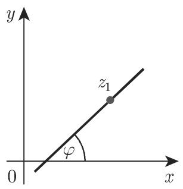
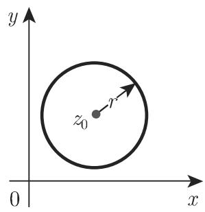
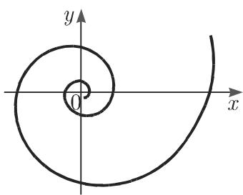

### 14.5 代数函数和初等超越函数

#### 14.5.1 代数函数

1. 定义

一个函数，它是对 ，也许还对有限多个常数施行有限多次代数运算的结果，被称为一个代数函数 (algebraic function)．一般地，一个复代数函数 $w ( z )$ 可以用一个多项式隐含地定义，就如在实的情形一样：

$$
a _ {1} z ^ {m _ {1}} w ^ {n _ {1}} + a _ {2} z ^ {m _ {2}} w ^ {n _ {2}} + \dots + a _ {k} z ^ {m _ {k}} w ^ {n _ {k}} = 0.\tag{14.63}
$$

$w$ 不能被显式地表示时有发生

2. 代数函数的例子

$$
\mathrm{线性函数}: w = a z + b.\tag{14.64}
$$

$$
\mathrm{反函数}: w = \frac {1}{z}.\tag{14.65}
$$

$$
\text { 二次函数 }: w = z ^ {2}.\tag{14.66}
$$

$$
\text { 平方根函数 }: w = \sqrt {z ^ {2} - a ^ {2}}.\tag{14.67}
$$

$$
\text { 分式线性函数 }: w = \frac {z + \mathrm{i}}{z - \mathrm{i}}.\tag{14.68}
$$

#### 14.5.2 初等超越函数

正如在代数函数的情形，复超越函数有相应千实超越函数的定义它们的详细讨论，请见 [21.1] [21.11].

1. 自然指数函数

$$
\mathrm{e} ^ {z} = 1 + \frac {z}{1 !} + \frac {z ^ {2}}{2 !} + \frac {z ^ {3}}{3 !} + \dots .\tag{14.69}
$$

此级数在整个 $z$ 平面中是绝对收敛的．

a) 纯虚指数 $\mathrm { i } y \mathrm { : }$ 根据欧拉关系式 (Euler relation) （参见第 45 1.5.2.4) ，成立

$$
\mathrm{e} ^ {\mathrm{i} y} = \cos y + \mathrm{i} \sin y, \quad \text {并且} \quad \mathrm{e} ^ {\pi \mathrm{i}} = - 1.\tag{14.70}
$$

b) 一般情形 $z = x + \mathrm { i } y \colon$

$$
\mathrm{e} ^ {z} = \mathrm{e} ^ {x + \mathrm{i} y} = \mathrm{e} ^ {x} \mathrm{e} ^ {\mathrm{i} y} = \mathrm{e} ^ {x} (\cos y + \mathrm{i} \sin y),\tag{14.71a}
$$

$$
\operatorname{Re} \left(\mathrm{e} ^ {z}\right) = \mathrm{e} ^ {x} \cos y, \operatorname{Im} \left(\mathrm{e} ^ {z}\right) = \mathrm{e} ^ {x} \sin y, | \mathrm{e} ^ {z} | = \mathrm{e} ^ {x}, \arg \left(\mathrm{e} ^ {z}\right) = y.\tag{14.71b}
$$

函数 $\mathrm { e } ^ { z }$ 是周期的，其周期为 忒： $\mathrm { e } ^ { z } = \mathrm { e } ^ { z + 2 k \pi \mathrm { i } } ( k = 0 , \pm 1 , \pm 2 , \cdot \cdot \cdot ) .$

(14.71c)

$$
\mathrm{特别地}: \quad \mathrm{e} ^ {0} = \mathrm{e} ^ {2 k \pi \mathrm{i}} = 1, \quad \mathrm{e} ^ {(2 k + 1) \pi \mathrm{i}} = - 1.\tag{14.71d}
$$

c) 一个复数的指数形式（参见第 45 1.5.2.4):

$$
a + \mathrm{i} b = \rho \mathrm{e} ^ {\mathrm{i} \varphi}.\tag{14.72}
$$

d) 复数的欧拉关系 (Euler relation of complex numbers):

$$
\mathrm{e} ^ {\mathrm{i} z} = \cos z + \mathrm{i} \sin z,\tag{14.73a}
$$

$$
\mathrm{e} ^ {- \mathrm{i} z} = \cos z - \mathrm{i} \sin z,\tag{14.73b}
$$

．自然对数

$$
w = \mathrm{Ln}   z, \quad \text {如果} \quad z = \mathrm{e} ^ {w}.\tag{14.74a}
$$

由千 $z = \rho \mathrm { e } ^ { \mathrm { i } \varphi }$ ，则有

$$
\mathrm{Ln} z = \ln \rho + \mathrm{i} (\varphi + 2 k \pi)\tag{14.74b}
$$

和

$$
\operatorname{Re} (\ln z) = \ln \rho , \quad \operatorname{Im} (\ln z) = \varphi + 2 k \pi \quad (k = 0, \pm 1, \pm 2, \dots).\tag{14.74c}
$$

由千 $\operatorname { L n } z$ 是一个多值函数（参见第 112 2.8.2)，通常只给出该对数的主值 (prin-cipal value of the logarithm) ln z:

$$
\ln z = \ln \rho + \mathrm{i} \varphi (- \pi <   \varphi \leqslant \pi).\tag{14.74d}
$$

函数 Lnz 对千除了 $z = 0$ 以外的所有复数都有定义．

3. 一般指数函数

$$
a ^ {z} = \mathrm{e} ^ {z \mathrm{Ln} a}.\tag{14.75a}
$$

$a ^ { z } \left( a \neq 0 \right)$ 是一个多值函数（参见第 112 2.8.2)，其主值为

$$
a ^ {z} = \mathrm{e} ^ {z \ln a}.\tag{14.75b}
$$

4. 三角函数和双曲函数

$$
\sin z = \frac {\mathrm{e} ^ {\mathrm{i} z} - \mathrm{e} ^ {- \mathrm{i} z}}{2 \mathrm{i}} = z - \frac {z ^ {3}}{3 !} + \frac {z ^ {5}}{5 !} - \dots ,\tag{14.76a}
$$

$$
\cos z = \frac {\mathrm{e} ^ {\mathrm{i} z} + \mathrm{e} ^ {- \mathrm{i} z}}{2 \mathrm{i}} = 1 - \frac {z ^ {2}}{2 !} + \frac {z ^ {4}}{4 !} - \dots ,\tag{14.76b}
$$

$$
\sinh z = \frac {\mathrm{e} ^ {z} - \mathrm{e} ^ {- z}}{2} = z + \frac {z ^ {3}}{3 !} + \frac {z ^ {5}}{5 !} + \dots ,\tag{14.77a}
$$

$$
\cosh z = \frac {\mathrm{e} ^ {z} + \mathrm{e} ^ {- z}}{2} = 1 + \frac {z ^ {2}}{2 !} + \frac {z ^ {4}}{4 !} + \dots ,\tag{14.77b}
$$

所有这 个级数在整个 平面上是收敛的，并且它们都是周期函数．函数 (14.76a),(14.76b) 的周期是 兀，函数 (14.76c), (14.76d) 的周期是

对任意实或复的 ，这些函数之间的关系是

$$
\sin \mathrm{i} z = \mathrm{i} \sinh z,\tag{14.78a}
$$

$$
\cos \mathrm{i} z = \cosh z,\tag{14.78b}
$$

$$
\sinh \mathrm{i} z = \mathrm{i} \sin z,\tag{14.79a}
$$

$$
\cosh \mathrm{i} z = \cos z.\tag{14.79b}
$$

实三角和双曲函数的变换公式（参见第 103 2.7.2 和第 117 2.9.3) 对千复三角和双曲函数也成立．可以借助千 $\sin { ( a + b ) } , \cos { ( a + b ) }$ ), sinh (a + b), cosh (a + b)的公式或利用欧拉关系（参见第 45 1.5.2.4) 来计算变量 $z = x + \mathrm { i } y$ 的函数sin z, cos z, sinh z, cosh 的值

■ COS (X + iy) = COS X COS iy —sin x sin iy = cos x cosh y —isin x sinh y.(14.80) 因而

$$
\operatorname{Re} (\cos z) = \cos \operatorname{Re} (z) \cosh \operatorname{Im} (z),\tag{14.81a}
$$

$$
\operatorname{Im} (\cos z) = - \sin \operatorname{Re} (z) \sinh \operatorname{Im} (z).\tag{14.81b}
$$

通过下列公式定义来函数 tan z, cot z, tanh z, coth z:

$$
\tan z = \frac {\sin z}{\cos z}, \quad \cot z = \frac {\cos z}{\sin z},\tag{14.82a}
$$

$$
\tanh z = \frac {\sinh z}{\cosh z}, \quad \coth z = \frac {\cosh z}{\sinh z}.\tag{14.82b}
$$

．反三角函数和反双曲函数

这些函数都是多值函数，可以借助千对数函数来表示它们：

$$
\operatorname{Arcsin} z = - \mathrm{i} \ln (\mathrm{i} z + \sqrt {1 - z ^ {2}}),\tag{14.83a}
$$

$$
\operatorname{Arsinh} z = \operatorname{Ln} (z + \sqrt {z ^ {2} + 1}),\tag{14.83b}
$$

$$
\operatorname{Arccos} z = - \mathrm{i} \ln (z + \sqrt {z ^ {2} - 1}),\tag{14.84a}
$$

$$
\operatorname{Arcosh} z = \mathrm{Ln} (z + \sqrt {z ^ {2} - 1}),\tag{14.84b}
$$

$$
\mathrm{Arctan} z = \frac {1}{2 \mathrm{i}} \mathrm{Ln} \frac {1 + \mathrm{i} z}{1 - \mathrm{i} z},\tag{14.85a}
$$

$$
\operatorname{Artanh} z = \frac {1}{2} \mathrm{Ln} \frac {1 + z}{1 - z},\tag{14.85b}
$$

$$
\operatorname{Arccot} z = - \frac {1}{2 \mathrm{i}} \mathrm{Ln} \frac {\mathrm{i} z + 1}{\mathrm{i} z - 1},\tag{14.86a}
$$

$$
\operatorname{Arcoth} z = \frac {1}{2} \mathrm{Ln} \frac {z + 1}{z - 1}.\tag{14.86b}
$$

反三角函数和反双曲函数的主值 (principal values) 可以用对数 ln 主值的相同公式来表示：

$$
\arcsin z = - \mathrm{i} \ln (\mathrm{i} z + \sqrt {1 - z ^ {2}}),\tag{14.87a}
$$

$$
\operatorname{arsinh} z = \ln (z + \sqrt {z ^ {2} + 1}),\tag{14.87b}
$$

$$
\arccos z = - \mathrm{i} \ln (z + \sqrt {z ^ {2} - 1}),\tag{14.88a}
$$

$$
\operatorname{arcosh} z = \ln (z + \sqrt {z ^ {2} - 1}),\tag{14.88b}
$$

$$
\arctan z = \frac {1}{2 \mathrm{i}} \ln \frac {1 + \mathrm{i} z}{1 - \mathrm{i} z},\tag{14.89a}
$$

$$
\operatorname{artanh} z = \frac {1}{2} \ln \frac {1 + z}{1 - z},\tag{14.89b}
$$

$$
\operatorname{arccot} z = - \frac {1}{2 \mathrm{i}} \ln {\frac {\mathrm{i} z + 1}{\mathrm{i} z - 1}},\tag{14.90a}
$$

$$
\operatorname{arcoth} z = \frac {1}{2} \ln {\frac {z + 1}{z - 1}}.\tag{14.90b}
$$

6. 三角函数和双曲函数的实部和虚部（表 14.1)

14.1 三角函数和双曲函数的实部和虚部

<table><tr><td>函数  $w = f(x + iy)$ </td><td>实部  $\text{Re}(w)$ </td><td>虚部  $\text{Im}(w)$ </td></tr><tr><td> $\sin (x \pm iy)$ </td><td> $\sin x \cosh y$ </td><td> $\pm \cos x \sinh y$ </td></tr><tr><td> $\cos (x \pm iy)$ </td><td> $\cos x \cosh y$ </td><td> $\mp \sin x \sinh y$ </td></tr><tr><td> $\tan (x \pm iy)$ </td><td> $\frac{\sin 2x}{\cos 2x + \cosh 2y}$ </td><td> $\pm \frac{\sinh 2y}{\cos 2x + \cosh 2y}$ </td></tr><tr><td> $\sinh (x \pm iy)$ </td><td> $\sinh x \cos y$ </td><td> $\pm \cosh x \sin y$ </td></tr><tr><td> $\cosh (x \pm iy)$ </td><td> $\cosh x \cos y$ </td><td> $\pm \sinh x \sin y$ </td></tr><tr><td> $\tanh (x \pm iy)$ </td><td> $\frac{\sinh 2x}{\cosh 2x + \cos 2y}$ </td><td> $\pm \frac{\sin 2y}{\cosh 2x + \cos 2y}$ </td></tr></table>

7. 三角函数和双曲函数的绝对值和辐角（表 14.2)

14.2 三角函数和双曲函数的绝对值和辐角

<table><tr><td>函数  $w = f(x + \mathrm{i}y)$ </td><td>绝对值  $|w|$ </td><td>辐角  $\arg w$ </td></tr><tr><td> $\sin (x \pm \mathrm{i}y)$ </td><td> $\sqrt{\sin^2 x + \sinh^2 y}$ </td><td> $\pm \arctan (\cot x \tanh y)$ </td></tr><tr><td> $\cos (x \pm \mathrm{i}y)$ </td><td> $\sqrt{\cos^2 x + \sinh^2 y}$ </td><td> $\mp \arctan (\tan x \tanh y)$ </td></tr><tr><td> $\sinh (x \pm \mathrm{i}y)$ </td><td> $\sqrt{\sinh^2 x + \sin^2 y}$ </td><td> $\pm \arctan (\coth x \tan y)$ </td></tr><tr><td> $\cosh (x \pm \mathrm{i}y)$ </td><td> $\sqrt{\sinh^2 x + \cos^2 y}$ </td><td> $\pm \arctan (\tanh x \tan y)$ </td></tr></table>

#### 14.5.3 曲线用复形式的描述

一个实变量 的复函数可以表示为参数形式：

$$
z = x (t) + \mathrm{i} y (t) = f (t).\tag{14.91}
$$

变动时，点 画出一条曲线 $z ( t )$ ．现在提出直线、圆周、双曲线、椭圆和对数螺线的方程和相应的图形表示

1. 直线

a) 直线，通过一个点 $( z _ { 1 } , \varphi ) ( \varphi$ 是与 轴的夹角，图 14.49(a)):

$$
z = z _ {1} + t \mathrm{e} ^ {\mathrm{i} \varphi}.\tag{14.92a}
$$

b) 直线，通过两个点 Zl 五（图 14.49(b)):

$$
z = z _ {1} + t (z _ {2} - z _ {1}).\tag{14.92b}
$$

2. 圆周

a) 圆周，半径为 $r ,$ 圆心在点 zo = （图 14.50(a)):

$$
z = r \mathrm{e} ^ {\mathrm{i} t} \quad (| z | = r).\tag{14.93a}
$$

b) 圆周，半径为 $r ,$ 圆心在点 $z _ { 0 }$ （图 14.50(b)):

$$
z = z _ {0} + r \mathrm{e} ^ {\mathrm{i} t} \quad (| z - z _ {0} | = r).\tag{14.93b}
$$

  
(a)

  
(b)  
14.49

  
(a)

  
(b)  
14.50

3. 椭圆 3. 椭圆

a) 椭圆，范式 ${ \frac { x ^ { 2 } } { a ^ { 2 } } } + { \frac { y ^ { 2 } } { b ^ { 2 } } } = 1$ （图 14.51(a)):

$$
z = a \cos t + \mathrm{i} b \sin t,\tag{14.94a}
$$

或

$$
z = c \mathrm{e} ^ {\mathrm{i} t} + d \mathrm{e} ^ {- \mathrm{i} t},\tag{14.94b}
$$

其中

$$
c = \frac {a + b}{2}, d = \frac {a - b}{2},\tag{14.94c}
$$

即 $c$ 是任意实数

b) 椭圆，一般形式（图 14.51(b)）：中心在 $z _ { 1 }$ ，轴被旋转了一个角度．

$$
z = z _ {1} + c \mathrm{e} ^ {\mathrm{i} t} + d \mathrm{e} ^ {- \mathrm{i} t}.\tag{14.95}
$$

这里 $c$ 是任意复数，它们决定了椭圆轴的长度和旋转角度．

  
(a)

  
(b)  
14.51

4. 双曲线

双曲线、范式 ${ \frac { x ^ { 2 } } { a ^ { 2 } } } - { \frac { y ^ { 2 } } { b ^ { 2 } } } = 1$ （图 14.52):

$$
z = a \cosh t + \mathrm{i} b \sinh t,\tag{14.96}
$$

或

$$
z = c \mathrm{e} ^ {t} + \bar {c} \mathrm{e} ^ {- t},\tag{14.97}
$$

其中 $c$ 是共辄复数：

$$
c = \frac {a + \mathrm{i} b}{2}, \quad \bar {c} = \frac {a - \mathrm{i} b}{2}.\tag{14.98}
$$

．对数螺线（图 14.53)

$$
z = a \mathrm{e} ^ {\mathrm{i} b t},\tag{14.99}
$$

其中 是任意复数

  
14.52

  
14.53
