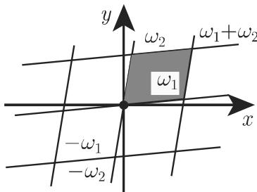

### 14.6 椭圆函数

#### 14.6.1 与椭圆积分的关系

如果 P(x) 是一个 次或 次的多项式，除非在某些特殊情形，则具有被积函数 $R ( x , \sqrt { P ( x ) } )$ 的 (8.22) 形的积分不能被积分成闭形式，但是它们作为椭圆积分（参见第 653 8.1.4.3) 可以被数值地计算．椭圆积分的反函数是椭圆函数 (ellipticfunctions)．它们类似千三角函数，并且可以被考虑为三角函数的推广．作为一个解释，考虑特殊情形

$$
\int_ {0} ^ {u} (1 - t ^ {2}) ^ {- \frac {1}{2}} \mathrm{d} t = x \quad (| u | \leqslant 1).\tag{14.100}
$$

a) 在三角函数 $u = \sin { x }$ 与其反函数的主值之间有一个关系

$$
u = \sin x \Leftrightarrow x = \arcsin u, \quad \text {当} - {\frac {\pi}{2}} \leqslant x \leqslant {\frac {\pi}{2}}, - 1 \leqslant u \leqslant 1   \text {时}.\tag{14.101}
$$

b) 积分 (14.100) 等千 arcsin u. 正弦函数可以被视为积分 (14.100) 的反函数．对千椭圆函数，类似的事情成立

·质最为 $m$ ，挂在一根长为 儿乎无重量的非弹性绳索上一个数学摆 (mathemat-ical pendulum) （图 14.54) 的周期可以由一个二阶非线性微分方程来计算．这个方程由作用在摆的质量上的力的平衡即得

$$
\frac {\mathrm{d} ^ {2} \vartheta}{\mathrm{d} t ^ {2}} + \frac {g}{l} \sin \vartheta = 0, \text {并且} \vartheta (0) = \vartheta_ {0}, \dot {\vartheta} (0) = 0 \quad \text {或者} \frac {\mathrm{d}}{\mathrm{d} t} \left[ \left(\frac {\mathrm{d} \vartheta}{\mathrm{d} t}\right) ^ {2} \right] = 2 \frac {g}{l} \frac {\mathrm{d}}{\mathrm{d} t} (\cos \vartheta).\tag{14.102a}
$$

长度 和离正常位置的振幅 之间的关系是 $s = l \vartheta$ ，因而 ${ \dot { s } } = l { \dot { \vartheta } } .$ 并且 ${ \ddot { s } } = l { \ddot { \vartheta } }$ 作用在质量上的力是 $F = m g$ ，其中 $g$ 是重力加速度（参见第 1368 页表 21.2)，这个力被分解为法向分量 $F _ { N }$ 和关千摆的路径的切向分量 $F _ { T }$ （图 14.54) ．法向分量$F _ { N } = m g \cos \vartheta$ 被绳索应力所平衡由千它垂直千运动的方向，因此它对千运动方程没有影响切向分量 $F _ { T } \vec { \bf \Delta }$ 生运动的加速度 $F _ { T } = m { \ddot { s } } = m l { \ddot { \vartheta } } = - m g \sin \vartheta$ .总是指向正常位置的方向．通过分离变量即得

$$
t - t _ {0} = \sqrt {\frac {l}{g}} \int_ {0} ^ {\vartheta} \frac {\mathrm{d} \Theta}{\sqrt {2 (\cos \Theta - \cos \vartheta_ {0})}}.\tag{14.102b}
$$

这里， $t _ { 0 }$ 。表示摆首次位千最低位置的时刻，即有 $\vartheta ( t _ { 0 } ) = 0 . \Theta$ 表示积分变量．在一些变换和代换 $\sin \ { \frac { \theta } { 2 } } = k \sin \ \psi , \ k = \sin \ { \frac { \vartheta _ { 0 } } { 2 } }$ 之后即得

$$
t - t _ {0} = \sqrt {\frac {l}{g}} \int_ {0} ^ {\varphi} \frac {\mathrm{d} \psi}{\sqrt {1 - k ^ {2} \sin^ {2} \psi}} = \sqrt {\frac {l}{g}} F (k, \varphi).\tag{14.102c}
$$

这里 $F ( k , \varphi )$ 是第一类的椭圆积分（参见第 654 (8.25a) ）．偏转角度,{ $\vartheta = \vartheta ( t )$ 是周期为 $2 T$ 的一个周期函数，这里

$$
T = \sqrt {\frac {l}{g}} F \left(k, \frac {\pi}{2}\right) = \sqrt {\frac {l}{g}} K,\tag{14.102d}
$$

其中 表示一个第一类完全椭圆积分（参见第 1424 页表 21.9). 表示摆的周(period) ，即，两个相继极端位置（满 ${ \frac { \mathrm { d } { \boldsymbol { \vartheta } } } { \mathrm { d } t } } = 0 )$ 之间的时间如果振幅小，即$\sin \vartheta \approx \vartheta$ ，则 $T = 2 \pi \sqrt { l / g }$

  
14.54

#### 14.6.2 雅可比函数

1. 定义

对千第一类椭圆积分 $F ( k , \varphi )$ ，当 $0 < k < 1$ 时从表达式 (8.24a) (8.25a) （参见第 653 8.1.4.3) 即得

$$
\frac {\mathrm{d} F}{\mathrm{d} \varphi} = (1 - k ^ {2} \sin^ {2} \varphi) ^ {- \frac {1}{2}} > 0,\tag{14.103}
$$

即， $F ( k , \varphi )$ 关千 $\varphi$ 是严格单调的，因而 (14.104b) 的反函数 (14.104a) 存在：

$$
\varphi = \operatorname{am} (k, u) = \varphi (u),\tag{14.104a}
$$

$$
u = \int_ {0} ^ {\varphi} \frac {\mathrm{d} \psi}{\sqrt {1 - k ^ {2} \sin^ {2} \psi}} = u (\varphi).\tag{14.104b}
$$

此反函数被称为振幅函数 (amplitude function) ．所谓的雅可比函数 (Jacobian func-tions) 被定义为

$$
\operatorname{sn} u = \sin \varphi = \sin \operatorname{am} (k, u) \quad (\text {振幅正弦}),\tag{14.105a}
$$

$$
\operatorname{cn} u = \cos \varphi = \cos \operatorname{am} (k, u) \quad (\mathrm{振幅余弦}),\tag{14.105b}
$$

$$
\mathrm{dn} u = \sqrt {1 - k ^ {2} \mathrm{sn} ^ {2} u} \quad (\text {振幅} \delta).\tag{14.105c}
$$

2. 亚纯函数和双周期函数

雅可比函数可以被解析延拓到 平面．因而诸函数 snz, cnz, dnz 都是亚纯(meromorphic) 函数（参见第 983 14.3.5.2) ，即，它们的奇点只是极点．除此之外，它们是双周期的 (double periodic) ．这些函数 $f ( z )$ 中的每一个都恰有两个周期$\omega _ { 1 }$ 和 $\omega _ { 2 }$ ，满足

$$
f (z + \omega_ {1}) = f (z), \quad f (z + \omega_ {2}) = f (z).\tag{14.106}
$$

这里， $\omega _ { 1 }$ 和 $\omega _ { 2 }$ 是两个其比值不是实数的任意复数．从 (14.106) 即得一般公式

$$
f (z + m \omega_ {1} + n \omega_ {2}) = f (z),\tag{14.107}
$$

其中 是任意整数全纯的双周期函数被称为椭圆函数 (elliptic functions).设 $z _ { 0 } \in \mathbb { C }$ 为一个任意的固定点则集合

$$
\left\{z _ {0} + \alpha_ {1} \omega_ {1} + \alpha_ {2} \omega_ {2}: 0 \leqslant \alpha_ {1}, \alpha_ {2} <   1 \right\}\tag{14.108}
$$

被称为椭圆函数的周期平行四边形 (period parallelogram) ．如果双周期函数在整个周期平行四边形（图 14.55) 中是有界的，那么它是一个常数．

·雅可比函数 (14.105a) (14.105b) 是椭圆函数．振幅函数 (14.104a) 不是椭圆函数

  
14.55

3. 雅可比函数的性质

巾下述代换

$$
k ^ {\prime 2} = 1 - k ^ {2}, \quad K ^ {\prime} = F \left(k ^ {\prime}, \frac {\pi}{2}\right), \quad K = F \left(k, \frac {\pi}{2}\right)\tag{14.109}
$$

可以得到在表 14.3 中给出的雅可比函数的那些性质，其中 是任意整数．

14.3 雅可比函数的周期、根和极点

<table><tr><td></td><td>周期 ω1,ω2</td><td>根</td><td>极点</td></tr><tr><td>sn z</td><td>4K,2iK&#x27;</td><td>2mK+2niK&#x27;</td><td rowspan="3">2mK+(2n+1)iK&#x27;</td></tr><tr><td>cn z</td><td>4K,2(K+iK&#x27;)</td><td>(2m+1)K+2niK&#x27;</td></tr><tr><td>dn z</td><td>2K,4iK&#x27;</td><td>(2m+1)K+(2n+1)iK&#x27;</td></tr></table>

14.56 中有函数 $\operatorname { s n } z , \operatorname { c n } z$ dnz 的图形．除了在极点处外，下列关系式对雅可比函数成立：

$$
(1) \mathrm{sn} ^ {2} z + \mathrm{cn} ^ {2} z = 1, k ^ {2} \mathrm{sn} ^ {2} z + \mathrm{dn} ^ {2} z = 1,\tag{14.110}
$$

$$
(2) \mathrm{sn} (u + v) = \frac {(\mathrm{sn} u) (\mathrm{cn} v) (\mathrm{dn} v) + (\mathrm{sn} v) (\mathrm{cn} u) (\mathrm{dn} u)}{1 - k ^ {2} (\mathrm{sn} ^ {2} u) (\mathrm{sn} ^ {2} v)},\tag{14.111a}
$$

$$
\operatorname{cn} (u + v) = \frac {(\operatorname{cn} u) (\operatorname{cn} v) - (\operatorname{sn} u) (\operatorname{dn} u) (\operatorname{sn} v) (\operatorname{dn} v)}{1 - k ^ {2} (\operatorname{sn} ^ {2} u) (\operatorname{sn} ^ {2} v)},\tag{14.111b}
$$

$$
\mathrm{dn} (u + v) = \frac {(\mathrm{dn} u) (\mathrm{dn} v) - k ^ {2} (\mathrm{sn} u) (\mathrm{cn} u) (\mathrm{sn} v) (\mathrm{cn} v)}{1 - k ^ {2} (\mathrm{sn} ^ {2} u) (\mathrm{sn} ^ {2} v)},\tag{14.111c}
$$

$$
(3) (\operatorname{sn} z) ^ {\prime} = (\operatorname{cn} z) (\operatorname{dn} z),\tag{14.112a}
$$

$$
(\operatorname{cn} z) ^ {\prime} = - (\operatorname{sn} z) (\operatorname{dn} z),\tag{14.112b}
$$

$$
(\mathrm{dn} z) ^ {\prime} = - k ^ {2} (\mathrm{sn} z) (\mathrm{cn} z).\tag{14.112c}
$$

雅可比函数的其他性质和另一些椭圆函数见 [14.10], [14.18]

  
14.56

#### 14.6.3 μ函数

可以用 函数 (theta functions) 来计算雅可比函数：

$$
\vartheta_ {1} (z, q) = 2 q ^ {\frac {1}{4}} \sum_ {n = 0} ^ {\infty} (- 1) ^ {n} q ^ {n (n + 1)} \sin (2 n + 1) z,\tag{14.113a}
$$

$$
\vartheta_ {2} (z, q) = 2 q ^ {\frac {1}{4}} \sum_ {n = 0} ^ {\infty} q ^ {n (n + 1)} \cos (2 n + 1) z,\tag{14.113b}
$$

$$
\vartheta_ {3} (z, q) = 1 + 2 \sum_ {n = 1} ^ {\infty} q ^ {n ^ {2}} \cos 2 n z,\tag{14.113c}
$$

$$
\vartheta_ {4} (z, q) = 1 + 2 \sum_ {n = 1} ^ {\infty} (- 1) ^ {n} q ^ {n ^ {2}} \cos 2 n z.\tag{14.113d}
$$

如果 $| q | < 1 ( q$ 是复数），则级数 (14.113a)rv(l4.113d) 对千每个复变量 都是收敛的．当 是常数的情形，用下述简单的记号：

$$
\vartheta_ {k} (z) := \vartheta_ {k} (\pi z, q) \quad (k = 1, 2, 3, 4).\tag{14.114}
$$

此时，雅可比函数有表达式：

$$
\operatorname{sn} z = 2 K \frac {\vartheta_ {4} (0)}{\vartheta_ {1} ^ {\prime} (0)} \frac {\vartheta_ {1} \left(\frac {z}{2 K}\right)}{\vartheta_ {4} \left(\frac {z}{2 K}\right)},\tag{14.115a}
$$

$$
\operatorname{cn} z = \frac {\vartheta_ {4} (0)}{\vartheta_ {2} (0)} \frac {\vartheta_ {2} \left(\frac {z}{2 K}\right)}{\vartheta_ {4} \left(\frac {z}{2 K}\right)},\tag{14.115b}
$$

$$
\mathrm{dn} z = \frac {\vartheta_ {4} (0)}{\vartheta_ {3} (0)} \frac {\vartheta_ {3} \bigg (\frac {z}{2 K} \bigg)}{\vartheta_ {4} \bigg (\frac {z}{2 K} \bigg)},\tag{14.115c}
$$

其中

$$
q = \exp \bigg (- \pi \frac {K ^ {\prime}}{K} \bigg), k = \bigg (\frac {\vartheta_ {2} (0)}{\vartheta_ {3} (0)} \bigg) ^ {2},\tag{14.115d}
$$

以及 $K , K ^ { \prime }$ (14.109) 所述

#### 14.6.4 魏尔斯特拉斯函数

魏尔斯特拉斯引进了函数

$$
\wp (z) = \wp (z, \omega_ {1}, \omega_ {2}),\tag{14.116a}
$$

$$
\zeta (z) = \zeta (z, \omega_ {1}, \omega_ {2}),\tag{14.116b}
$$

$$
\sigma (z) = \sigma (z, \omega_ {1}, \omega_ {2}),\tag{14.116c}
$$

这里 $\omega _ { 1 }$ 和 $\omega _ { 2 }$ 是其商非实数的两个任意复数．做代换

$$
\omega_ {m n} = 2 (m \omega_ {1} + n \omega_ {2}),\tag{14.117a}
$$

其中 是任意整数，并定义

$$
\wp (z, \omega_ {1}, \omega_ {2}) = z ^ {- 2} + \sum_ {m, n} ^ {\prime} \big [ (z - \omega_ {m n}) ^ {- 2} - \omega_ {m n} ^ {- 2} \big ].\tag{14.117b}
$$

求和号后面的撇表示忽略 $m = n = 0$ 项．函数 $\wp ( z , \omega _ { 1 } , \omega _ { 2 } )$ ）有下列性质：

(1) 它是一个有周期 $\omega _ { 1 }$ 和 $\omega _ { 2 }$ 的椭圆函数．

(2) 对千每个 $z \neq \omega _ { m n }$ ，级数 (14.117b) 收敛．

(3) 函数 $\wp ( z , \omega _ { 1 } , \omega _ { 2 } )$ ）满足微分方程

$$
\wp^ {\prime 2} = 4 \wp^ {3} - g _ {2} \wp - g _ {3},\tag{14.118a}
$$

其中

$$
g _ {2} = 6 0 \sum_ {m, n} ^ {\prime} \omega_ {m n} ^ {- 4}, g _ {3} = 1 4 0 \sum_ {m, n} ^ {\prime} \omega_ {m n} ^ {- 6}.\tag{14.118b}
$$

量 $g _ { 2 }$ 和 $g _ { 3 }$ 被称为 $\wp ( z , \omega _ { 1 } , \omega _ { 2 } )$ ）的不变量 (invariants).

(4) 函数 $\wp ( z , \omega _ { 1 } , \omega _ { 2 } )$ 是积分

$$
z = \int_ {u} ^ {\infty} \frac {\mathrm{d} t}{\sqrt {4 t ^ {3} - g _ {2} t - g _ {3}}}\tag{14.119}
$$

的反函数

$$
(5) \wp (u + v) = \frac {1}{4} \left[ \frac {\wp^ {\prime} (u) - \wp^ {\prime} (v)}{\wp (u) - \wp (v)} \right] ^ {2} - \wp (u) - \wp (v).\tag{14.120}
$$

魏尔斯特拉斯函数

$$
\zeta (z) = z ^ {- 1} + \sum_ {m, n} ^ {\prime} \big [ (z - \omega_ {m n}) ^ {- 1} + \omega_ {m n} ^ {- 1} + \omega_ {m n} ^ {- 2} z \big ],\tag{14.121a}
$$

$$
\begin{array}{r l} & {\sigma (z) = z \exp \left(\int_ {0} ^ {z} [ \zeta (t) - t ^ {- 1} ] \mathrm{d} t\right)} \\ & {\qquad = z \prod_ {m, n} ^ {\prime} \left(1 - \frac {z}{\omega_ {m n}}\right) \exp \left(\frac {z}{\omega_ {m n}} + \frac {z ^ {2}}{2 \omega_ {m n} ^ {2}}\right)} \end{array}\tag{14.121b}
$$

不是双周期的，因而它们不是椭圆函数．下列关系式成立：

$$
(1) \zeta^ {\prime} (z) = - \wp (z), \quad \zeta (z) = \ln \sigma (z);\tag{14.122}
$$

$$
(2) \zeta (- z) = - \zeta (z), \quad \sigma (- z) = - \sigma (z);\tag{14.123}
$$

$$
(3) \zeta (z + 2 \omega_ {1}) = \zeta (z) + 2 \zeta (\omega_ {1}), \quad \zeta (z + 2 \omega_ {2}) = \zeta (z) + 2 \zeta (\omega_ {2});\tag{14.124}
$$

$$
(4) \zeta (u + v) = \zeta (u) + \zeta (v) + \frac {1}{2} \frac {\wp^ {\prime} (u) - \wp^ {\prime} (v)}{\wp (u) - \wp (v)};\tag{14.125}
$$

(5) 每个椭圆函数是魏尔斯特拉斯函数 $\wp ( z )$ 和 $\zeta ( z )$ 的有理函数．

（陆柱家译）

15 章 积分变换
