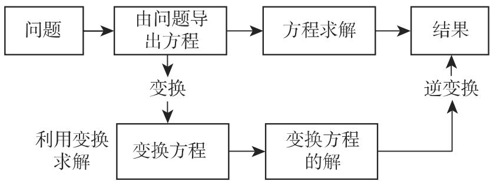

### 15.1 积分变换的概念

#### 15.1.1 积分变换的一般定义

积分变换指两个函数 f(t) $F ( p )$ 之间形如

$$
F (p) = \int_ {- \infty} ^ {+ \infty} K (p, t) f (t) \mathrm{d} t\tag{15.1a}
$$

的对应．函数 $f ( t )$ 称为原函数，其定义域是原像空间．函数 $F ( p )$ 称为变换，其定义域是像空间．

函数 $K ( p , t )$ 称为变换的核．一般情况下， 是实变量， $p = \sigma + \mathrm { i } \omega$ 是复变量．引入符号 ，对千核为 $K ( p , t )$ 的积分变换，则可使用较简洁的记号：

$$
F (p) = \mathcal {T} \left\{f (t) \right\}.\tag{15.1b}
$$

(15.lb) 式称为 $\tau$ 变换．

#### 15.1.2 特殊的积分变换

不同的核 $K ( p , t )$ 和不同的原始空间生成不同的积分变换．最广为人知的是拉普拉斯变换、拉普拉斯—卡森变换和傅里叶变换．本书给出了关千单变量函数的积分变换综述（可参见表 15.1)．近来，已引入一些特殊变换，如小波变换、加博变换和沃尔什变换，用千模式识别和表征信号（参见第 1052 15.6).

#### 15.1.3 逆变换

一个变换的逆变换给出原函数，这在应用中特别重要．使用符号 ${ { \mathcal { T } } ^ { - 1 } }$ , (15.la)的逆积分变换为

$$
f (t) = \mathcal {T} ^ {- 1} \left\{F (p) \right\}.\tag{15.2a}
$$

算子 ${ { \mathcal { T } } ^ { - 1 } }$ 称为 的逆算子，故

$$
\mathcal {T} ^ {- 1} \left\{\mathcal {T} \left\{f (t) \right\} \right\} = f (t).\tag{15.2b}
$$

表15.1 对单变量函数的积分变换综述

<table><tr><td>变换</td><td>核K(p,t)</td><td>符号</td><td>注</td></tr><tr><td>拉普拉斯变换</td><td> $\left\{\begin{array}{ll}0,&t<0\\ \mathrm{e}^{-pt},&t>0\end{array}\right.$ </td><td> $\mathcal{L}\{f(t)\}=\int_{0}^{\infty}\mathrm{e}^{-pt}f(t)\mathrm{d}t$ </td><td> $p=\sigma+\mathrm{i}\omega$ </td></tr><tr><td>双侧拉普拉斯变换</td><td> $\mathrm{e}^{-pt}$ </td><td> $\mathcal{L}_{\mathrm{II}}\{f(t)\}=\int_{-\infty}^{+\infty}\mathrm{e}^{-pt}f(t)\mathrm{d}t$ </td><td> $\mathcal{L}_{\mathrm{II}}\{f(t)1(t)\}=\mathcal{L}\{f(t)\}$ 其中 $1(t)=\left\{\begin{array}{ll}0,&t<0\\ 1,&t>0\end{array}\right.$ </td></tr><tr><td>有限拉普拉斯变换</td><td> $\left\{\begin{array}{ll}0,&t<0\\ \mathrm{e}^{-pt},&0\(0, & t>a\end{array}\right.$ </td><td> $\mathcal{L}_{a}\{f(t)\}=\int_{0}^{a}\mathrm{e}^{-pt}f(t)\mathrm{d}t$ </td><td></td></tr><tr><td>拉普拉斯-卡森变换</td><td> $\left\{\begin{array}{ll}0,&t<0\\ \mathrm{pe}^{-pt},&t>0\end{array}\right.$ </td><td> $\mathcal{C}\{f(t)\}=\int_{0}^{\infty}pe^{-pt}f(t)\mathrm{d}t$ </td><td>卡森变换也可以是双侧变换和有限变换</td></tr><tr><td>傅里叶变换</td><td> $\mathrm{e}^{-\mathrm{i}\omega t}$ </td><td> $\mathcal{F}\{f(t)\}=\int_{-\infty}^{+\infty}\mathrm{e}^{-\mathrm{i}\omega t}f(t)\mathrm{d}t$ </td><td> $p=\sigma+\mathrm{i}\omega,\quad\sigma=0$ </td></tr><tr><td>单侧傅里叶变换</td><td> $\left\{\begin{array}{ll}0,&t<0\\ \mathrm{e}^{-\mathrm{i}\omega t},&t>0\end{array}\right.$ </td><td> $\mathcal{F}_{\mathrm{I}}\{f(t)\}=\int_{0}^{\infty}\mathrm{e}^{-\mathrm{i}\omega t}f(t)\mathrm{d}t$ </td><td> $p=\sigma+\mathrm{i}\omega,\quad\sigma=0$ </td></tr></table>

续表

<table><tr><td>变换</td><td>核K(p,t)</td><td>符号</td><td>注</td></tr><tr><td>有限傅里叶变换</td><td> $\left\{\begin{array}{ll}0,&t<0\\e^{-i\omega t},&0\( \mathcal{F}_{a}\{f(t)\}=\int_{0}^{a}e^{-i\omega t}f(t)dt\\0,&t>a\end{array}\right.$ </td><td> $\mathcal{F}_{a}\{f(t)\}=\int_{0}^{a}e^{-i\omega t}f(t)dt$ </td><td>p=σ+iω, σ=0</td></tr><tr><td>傅里叶余弦变换</td><td> $\left\{\begin{array}{ll}0,&t<0\\Re[e^{i\omega t}],&t>0\end{array}\right.$ </td><td> $\mathcal{F}_{c}\{f(t)\}=\int_{0}^{\infty}f(t)\cos\omega tdt$ </td><td>p=σ+iω, σ=0</td></tr><tr><td>傅里叶正弦变换</td><td> $\left\{\begin{array}{ll}0,&t<0\\Im[e^{i\omega t}],&t>0\end{array}\right.$ </td><td> $\mathcal{F}_{s}\{f(t)\}=\int_{0}^{\infty}f(t)\sin\omega tdt$ </td><td>p=σ+iω, σ=0</td></tr><tr><td>梅林变换</td><td> $\left\{\begin{array}{ll}0,&t<0\\t^{p-1},&t>0\end{array}\right.$ </td><td> $\mathcal{M}\{f(t)\}=\int_{0}^{\infty}t^{p-1}f(t)dt$ </td><td></td></tr><tr><td>v阶汉克尔变换</td><td> $\left\{\begin{array}{ll}0,&t<0\\tJ_{v}(\sigma t),&t>0\end{array}\right.$ </td><td> $\mathcal{H}_{v}\{f(t)\}=\int_{0}^{\infty}tJ_{v}(\sigma t)f(t)dt$ </td><td>p=σ+iω, ω=0 $J_{v}(\sigma t)$ 是v阶第一类贝塞尔函数</td></tr><tr><td>斯蒂尔切斯变换</td><td> $\left\{\begin{array}{ll}0,&t<0\\\frac{1}{p+t},&t>0\end{array}\right.$ </td><td> $\mathcal{S}\{f(t)\}=\int_{0}^{\infty}\frac{f(t)}{p+t}dt$ </td><td></td></tr></table>

计算逆变换即指求解积分方程 (15.la)，其中函数 $F ( p )$ 已知，函数 f(t) 待定．若方程只有一个解，则可记作形式

$$
f (t) = \mathcal {T} ^ {- 1} \left\{F (p) \right\}.\tag{15.2c}
$$

对千不同的积分变换，如对千不同的核 $K ( p , t )$ ，其逆算子的显式确定是积分变换理论的基本问题．读者可根据相应表格（参见第 1431 页表 21.13, 1436 页表21.14 和第 1454 页表 21.15) 中所给出的变换和原函数之间的对应关系去解决实际问题

#### 15.1.4 积分变换的线性性质

若 $f _ { 1 } ( t )$ 和 $f _ { 2 } ( t )$ 是可变换函数，则

$$
\mathcal {T} \left\{k _ {1} f _ {1} (t) + k _ {2} f _ {2} (t) \right\} = k _ {1} \mathcal {T} \left\{f _ {1} (t) \right\} + k _ {2} \mathcal {T} \left\{f _ {2} (t) \right\}.\tag{15.3}
$$

其中 $k _ { 1 }$ 和 $k _ { 2 }$ 是任意数也就是说，在可 变换函数定义的集合 $T$ 上，积分变换满足线性性质

#### 15.1.5 多变量函数的积分变换

多变量函数的积分变换也称为多重积分变换（参见 [15.14]）．最著名的是二重拉普拉斯变换，即两个变量函数的拉普拉斯变换，二重拉普拉斯—卡森变换和二重傅里叶变换二重拉普拉斯变换的定义是

$$
F (p, q) = \mathcal {L} ^ {2} \left\{f (x, y) \right\} \equiv \int_ {x = 0} ^ {\infty} \int_ {y = 0} ^ {\infty} \mathrm{e} ^ {- p x - q y} f (x, y) \mathrm{d} x \mathrm{d} y.\tag{15.4}
$$

符号 表示单变量函数的拉普拉斯变换（参见表 15.1).

#### 15.1.6 积分变换的应用

1. 应用领域

积分变换除了在积分方程理论和线性算子理论等基础数学领域有重要理论意义外，在物理学和工程学实际问题求解中也有广泛应用．应用积分变换求解问题的方法通常称为算子方法，适用千求解常微分方程、偏微分方程、积分方程和差分方程

2. 算子方法的框架图

15.1 给出了运用积分变换算子方法的一般框架．为了得到问题的解，我们不直接求解初始定义方程，而是首先应用积分变换把方程变为另一个方程，然后求变换方程的解，并应用逆变换给出初始问题的解．

运用算子方法求解常微分方程包括下述三个步骤：

(1) 把关千未知函数的微分方程转化为其变换方程．

(2) 求变换方程在像空间的解．变换方程通常不再是微分方程，而是代数方程．

  
15.1  
(3) 利用变换的逆变换 ${ { \mathcal { T } } ^ { - 1 } }$ 回到原始空间，即确定初始问题的解．

算子方法的主要困难通常不是求解变换方程，而在千求函数变换和逆变换．
