#### 15.2.1 拉普拉斯变换的性质

15.2.1.1 拉普拉斯变换、原始空间和像空间

1. 拉普拉斯变换的定义

设 $f ( t )$ 为实变量 的函数，若下述广义积分

$$
\mathcal {L} \left\{f (t) \right\} = \int_ {0} ^ {\infty} \mathrm{e} ^ {- p t} f (t) \mathrm{d} t = F (p)\tag{15.5}
$$

存在，则定义了复变量 的函数 $F ( p ) . \ f ( t )$ 称为原函数， $F ( p )$ 称为 $f ( t )$ 的拉普拉斯变换．在进一步讨论中，假定广义积分存在，如果在原始空间内，原函数 $f ( t )$ 当$t \geqslant 0$ 时分段光滑，且对千特定的常数 $K > 0 , \alpha > 0 .$ 当 $t \to \infty$ 时， $| f ( t ) | \leqslant K \mathrm { e } ^ { \alpha t }$ 成立变换 $F ( p )$ 的定义域称为像空间．

在一些文献中，拉普拉斯变换经常也以瓦格纳或拉普拉斯—卡森变换的形式

$$
\mathcal {L} _ {W} \left\{f (t) \right\} = p \int_ {0} ^ {\infty} \mathrm{e} ^ {- p t} f (t) \mathrm{d} t = p F (p)\tag{15.6}
$$

出现

2. 收敛性

拉普拉斯积分 $\mathcal { L } \left\{ f ( t ) \right\}$ 在半平面 $\operatorname { R e } p > \alpha$ 内收敛（图 15.2) ．变换 $F ( p )$ 是解析函数，具有性质：

(1) $\operatorname* { l i m } _ { \operatorname { R e } p \to \infty } F ( p ) = 0 .$

(15. 7 a)

该性质是 $F ( p )$ 成为变换的必要条件

(2) 若原函数 $f ( t )$ 的极限是有限数，即 $\operatorname* { l i m } _ { t \to \infty \atop ( t \to 0 ) } f ( t ) = A$ ，则

$$
\lim_{\substack{p\to 0\\ (p\to \infty)}}pF(p) = A.\tag{15.7b}
$$

  
15.2

(3) 拉普拉斯变换的逆变换

利用公式

$$
\mathcal {L} ^ {- 1} \left\{F (p) \right\} = \frac {1}{2 \pi \mathrm{i}} \int_ {c - \mathrm{i} \infty} ^ {c + \mathrm{i} \infty} \mathrm{e} ^ {p t} F (p) \mathrm{d} p = \left\{ \begin{array}{l l} f (t), & t > 0, \\ 0, & t <   0 \end{array} \right.\tag{15.8}
$$

可由像函数得到原函数．

该复积分的积分路径是平行千虚轴的直线 $\mathrm { R e } p = c ,$ ，其中 $\mathrm { R e } p = c > \alpha$ . 若函数 $f ( t )$ 在 $t = 0$ 处有跳跃，即 $\operatorname* { l i m } _ { t \to + 0 } f ( t ) \neq 0$ ，则积分在该点处的值为 ${ \frac { 1 } { 2 } } f ( + 0 )$

15.2.1.2 拉普拉斯变换的运算规则

运算规则是从原始域内运算到变换空间内运算的映射．

此后原函数将用小写字母表示，变换用相应的大写字母表示

1. 加法或线性法则

只要变换存在，函数线性组合的拉普拉斯变换是拉普拉斯变换式相同的线性组合，即对千常数 $\lambda _ { 1 } , \lambda _ { 2 } , \cdots , \lambda _ { n }$ 丛，有

$$
\mathcal {L} \left\{\lambda_ {1} f _ {1} (t) + \lambda_ {2} f _ {2} (t) + \dots + \lambda_ {n} f _ {n} (t) \right\} = \lambda_ {1} F _ {1} (p) + \lambda_ {2} F _ {2} (p) + \dots + \lambda_ {n} F _ {n} (p).\tag{15.9}
$$

2. 相似法则

$f ( a t ) \ ( a > 0 , a$ 为实数）的拉普拉斯变换是原函数除以 $^ { a , }$ ，且自变量为 $p / a$ 的拉普拉斯变换：

$$
\mathcal {L} \left\{f (a t) \right\} = \frac {1}{a} F \left(\frac {p}{a}\right) \quad (a > 0, a \text {为实数}).\tag{15.10a}
$$

类似地对千逆变换，有

$$
\mathcal {L} ^ {- 1} \left\{F (a p) \right\} = \frac {1}{a} f \left(\frac {t}{a}\right) \quad (a > 0).\tag{15.10b}
$$

15.3 展示了相似法则在正弦函数中的一个应用．

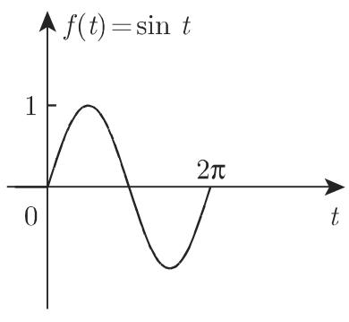

  
15.3

·确定 $f ( t ) = \sin ( \omega t )$ 的拉普拉斯变换．正弦函数的变换式为

$$
\mathcal {L} \left\{\sin (t) \right\} = F (p) = 1 / (p ^ {2} + 1).
$$

运用相似法则可给出

$$
\mathcal {L} \left\{\sin (\omega t) \right\} = \frac {1}{\omega} F (p / \omega) = \frac {1}{\omega} \frac {1}{(p / \omega) ^ {2} + 1} = \frac {\omega}{p ^ {2} + \omega^ {2}}.
$$

3. 平移法则

(1) 向右平移 原函数向右平移 $a \ ( a > 0 )$ 个单位的拉普拉斯变换等千非移位原函数的拉普拉斯变换乘以因子 $\mathrm { e } ^ { - a p }$

$$
\mathcal {L} \left\{f (t - a) \right\} = \mathrm{e} ^ {- a p} F (p).\tag{15.11a}
$$

(2) 向左平移 原函数向左平移 个单位的拉普拉斯变换等千非移位函数的拉普拉斯变换与积分 $\int _ { 0 } ^ { a } f ( t ) \mathrm { e } ^ { - p t } \mathrm { d } t$ 之差乘以 $\mathrm { e } ^ { a p }$ :

$$
\mathcal {L} \left\{f (t + a) \right\} = \mathrm{e} ^ {a p} \left[ F (p) - \int_ {0} ^ {a} \mathrm{e} ^ {- p t} f (t) \mathrm{d} t \right].\tag{15.11b}
$$

15.4 和图 15.5 显示了余弦函数的向右平移和直线的向左平移．

  
15.4

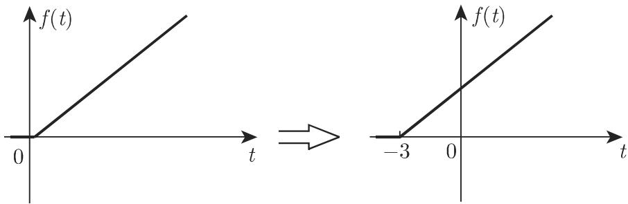  
15.5

4. 频移定理

原函数乘以 $\mathrm { e } ^ { - b t }$ 的拉普拉斯变换等千自变量为 $p + b$ 的拉普拉斯变换 (b 是任意复数）：

$$
\mathcal {L} \left\{\mathrm{e} ^ {- b t} f (t) \right\} = F (p + b).\tag{15.12}
$$

．在原始空间内的微分

当 $t > 0$ 时，若导数 $f ^ { \prime } ( t ) , f ^ { \prime \prime } ( t ) , \cdot \cdot \cdot , f ^ { ( n ) } ( t )$ 存在，且 f(t) 最高阶导数的变换存在，则 f(t) 的低阶导数和 f(t) 也有变换，且

$$
\left. \begin{array}{l} {{\mathcal {L} \left\{f ^ {\prime} (t) \right\} = p F (p) - f (+ 0),}} \\ {{\mathcal {L} \left\{f ^ {\prime \prime} (t) \right\} = p ^ {2} F (p) - f (+ 0) p - f ^ {\prime} (+ 0),}} \\ {{\dots \dots}} \\ {{\mathcal {L} \left\{f ^ {(n)} (t) \right\} = p ^ {n} F (p) - f (+ 0) p ^ {n - 1} - f ^ {\prime} (+ 0) p ^ {n - 2} - \dots}} \\ {{\qquad \qquad \qquad - f ^ {(n - 2)} (+ 0) p - f ^ {(n - 1)} (+ 0),}} \\ {{\text {其中} f ^ {(v)} (+ 0) = \lim _ {t \to + 0} f ^ {(v)} (t).}} \end{array} \right\}\tag{15.13}
$$

方程 (15.13) 给出了下述拉普拉斯积分表达式，可用千逼近拉普拉斯积分：

$$
\mathcal {L} \{f (t) \} = \frac {f (+ 0)}{p} + \frac {f ^ {\prime} (+ 0)}{p ^ {2}} + \frac {f ^ {\prime \prime} (+ 0)}{p ^ {3}} + \dots + \frac {f ^ {(n - 1)} (+ 0)}{p ^ {n - 1}} + \frac {1}{p ^ {n}} \mathcal {L} \left\{f ^ {(n)} (t) \right\}.\tag{15.14}
$$

．在像空间内的微分

$$
\mathcal {L} \left\{t ^ {n} f (t) \right\} = (- 1) ^ {n} F ^ {(n)} (p).\tag{15.15}
$$

变换的 阶导数等千原函数 f(t) 的 $( - t ) ^ { n }$ 倍的拉普拉斯变换：

$$
\mathcal {L} \left\{(- 1) ^ {n} t ^ {n} f (t) \right\} = F ^ {(n)} (p) \quad (n = 1, 2, \dots).\tag{15.16}
$$

7. 在原始空间内的积分

原函数积分的变换等千原函数的变换乘以 $1 / p ^ { n } \left( n > 0 \right)$

$$
\mathcal {L} \left\{\int_ {0} ^ {t} \mathrm{d} \tau_ {1} \int_ {0} ^ {\tau_ {1}} \mathrm{d} \tau_ {2} \dots \int_ {0} ^ {\tau_ {n - 1}} f (\tau_ {n}) \mathrm{d} \tau_ {n} \right\}
$$

$$
= \frac {1}{(n - 1) !} \mathcal {L} \left\{\int_ {0} ^ {t} (t - \tau) ^ {(n - 1)} f (\tau) \mathrm{d} \tau \right\} = \frac {1}{p ^ {n}} F (p).\tag{15.17a}
$$

在单积分的特殊情况下，有

$$
\mathcal {L} \left\{\int_ {0} ^ {t} f (\tau) \mathrm{d} \tau \right\} = \frac {1}{p} F (p)\tag{15.17b}
$$

成立在原始空间内，若初始值为 ，则微分和积分互逆．

．在像空间内的积分

$$
\mathcal {L} \left\{\frac {f (t)}{t ^ {n}} \right\} = \int_ {p} ^ {\infty} \mathrm{d} p _ {1} \int_ {p _ {1}} ^ {\infty} \mathrm{d} p _ {2} \dots \int_ {p _ {n - 1}} ^ {\infty} F (p _ {n}) \mathrm{d} p _ {n} = \frac {1}{(n - 1) !} \int_ {p} ^ {\infty} (z - p) ^ {n - 1} F (z) \mathrm{d} z.\tag{15.18}
$$

仅当 $f ( t ) / t ^ { n }$ 存在拉普拉斯变换时该公式才成立．为此，当 ----+ 时， $f ( x ) ^ { \mathbb { \left( 1 \right) } }$ 必须足够快地趋向千 o. 积分路径可以是始于 点、与实轴正半轴成锐角的任意射线．

9. 除法法则

(15.18) 中，对千 $n = 1$ 的特殊情况有

$$
\mathcal {L} \left\{\frac {f (t)}{t} \right\} = \int_ {p} ^ {\infty} F (z) \mathrm{d} z\tag{15.19}
$$

成立若积分 (15.19) 式存在，极限 $\operatorname* { l i m } _ { t \to 0 } { \frac { f ( t ) } { t } }$ 也必须存在．

10. 对参数的微分和积分

$$
\mathcal {L} \left\{\frac {\partial f (t , \alpha)}{\partial \alpha} \right\} = \frac {\partial F (p , \alpha)}{\partial \alpha},\tag{15.20a}
$$

$$
\mathcal {L} \left\{\int_ {\alpha_ {1}} ^ {\alpha_ {2}} f (t, \alpha) \mathrm{d} \alpha \right\} = \int_ {\alpha_ {1}} ^ {\alpha_ {2}} F (p, \alpha) \mathrm{d} \alpha .\tag{15.20b}
$$

借助这些公式有时可根据已知积分计算拉普拉斯积分．

11. 卷积

(1) 在原始空间内的卷积 两个函数 $f _ { 1 } ( t )$ 和 $f _ { 2 } ( t )$ 的卷积是积分

$$
f _ {1} * f _ {2} = \int_ {0} ^ {t} f _ {1} (\tau) f _ {2} (t - \tau) \mathrm{d} \tau .\tag{15.21}
$$

方程 (15.21) 也称为区间 (O,t) 上的单侧卷积．傅里叶变换产生双侧卷积（区间$( - \infty , \infty )$ 上的卷积，参见第 1031 15.3.1.3, 9. ）．卷积 (15.21) 满足性质：

a) 交换律： $f _ { 1 } * f _ { 2 } = f _ { 2 } * f _ { 1 } ,$

(15.22a)

b) 结合律： $\left( f _ { 1 } * f _ { 2 } \right) * f _ { 3 } = f _ { 1 } * \left( f _ { 2 } * f _ { 3 } \right) .$

(15.22b)

c) 分配律： $( f _ { 1 } + f _ { 2 } ) * f _ { 3 } = f _ { 1 } * f _ { 3 } + f _ { 2 } * f _ { 3 } .$

(15.22c)

在像域内，一般的乘积对应千卷积：

$$
\mathcal {L} \left\{f _ {1} * f _ {2} \right\} = F _ {1} (p) \cdot F _ {2} (p).\tag{15.23}
$$

15.6 显示了两函数的卷积．我们可运用卷积定理确定原函数：

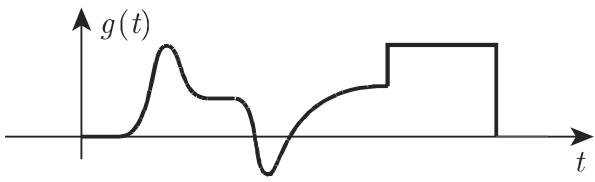

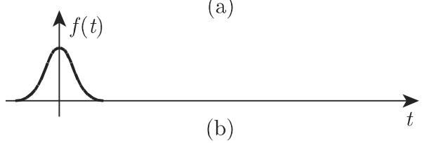

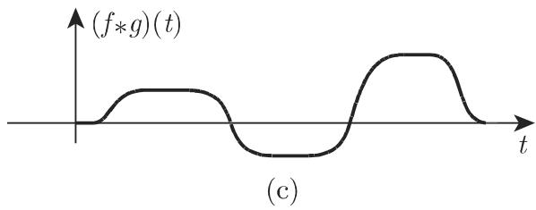  
15.6

a) 分解像函数

$$
F (p) = F _ {1} (p) \cdot F _ {2} (p);
$$

b) 确定变换 $F _ { 1 } ( p )$ 和 $F _ { 2 } ( p )$ 的原函数 $f _ { 1 } ( t )$ 和 $f _ { 2 } ( t )$ （根据表格）；

c) 在原始空间中，结合 $F ( p )$ ，巾 $f _ { 1 } ( t )$ 和 $f _ { 2 } ( t )$ 的卷积确定原函数 $( f ( t ) =$ $f _ { 1 } ( t ) * f _ { 2 } ( t ) )$

(2) 在像空间内的卷积（复卷积）

$$
\mathcal {L} \left\{f _ {1} (t) \cdot f _ {2} (t) \right\} = \left\{ \begin{array}{l l} \frac {1}{2 \pi \mathrm{i}} \int_ {x _ {1} - \mathrm{i} \infty} ^ {x _ {1} + \mathrm{i} \infty} F _ {1} (z) \cdot F _ {2} (p - z) \mathrm{d} z, \\ \frac {1}{2 \pi \mathrm{i}} \int_ {x _ {2} - \mathrm{i} \infty} ^ {x _ {2} + \mathrm{i} \infty} F _ {1} (p - z) \cdot F _ {2} (z) \mathrm{d} z. \end{array} \right.\tag{15.24}
$$

积分路径为沿着与虚轴平行的直线．在第一个积分中，必须选定 $x _ { 1 }$ 和 $p ,$ ，使得位千 $\mathcal { L } \left\{ f _ { 1 } \right\}$ 的收敛半平面内，且 $p - z$ 位千 $\mathcal { L } \left\{ f _ { 2 } \right\}$ 的收敛半平面内．对千第二个积分，也有相应的要求

15.2.1.3 特殊函数的变换

1. 阶梯函数

在 $t = t _ { 0 }$ 处的单位跳跃称为阶梯函数（图 15.7) （也可参见第 988 14.4.3.2,3.）；也称为赫维赛德单位阶梯函数：

  
15.7

$$
u (t - t _ {0}) = \left\{ \begin{array}{l l} 1, & t > t _ {0}, \\ 0, & t <   t _ {0} \end{array} \right. \quad (t _ {0} > 0).\tag{15.25}
$$

■ A: $f ( t ) = u ( t - t _ { 0 } ) \sin \omega t , F ( p ) = \mathrm { e } ^ { - t _ { 0 } p } \frac { \omega \cos \omega t _ { 0 } + p \sin \omega t _ { 0 } } { p ^ { 2 } + \omega ^ { 2 } } .$ ．（图 15.8)

■ B: : $f ( t ) = u ( t - t _ { 0 } ) \sin \omega ( t - t _ { 0 } ) , F ( p ) = \mathrm { e } ^ { - t _ { 0 } p } \frac { \omega } { p ^ { 2 } + \omega ^ { 2 } } .$ （图 15.9)

  
15.8

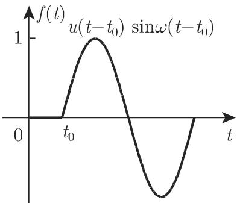  
15.9

2. 矩形脉冲

高度为 、宽度为 的矩形脉冲（图 15.10) 由两个阶梯函数以如下形式叠加而成．

$$
\begin{array}{r l} & u _ {T} (t - t _ {0}) = u (t - t _ {0}) - u (t - t _ {0} - T) = \left\{ \begin{array}{l l} 0, & t <   t _ {0}, \\ 1, & t _ {0} <   t <   t _ {0} + T, \\ 0, & t > t _ {0} + T, \end{array} \right. \\ & \mathcal {L} \left\{u _ {T} (t - t _ {0}) \right\} = \frac {\mathrm{e} ^ {- t _ {0} p} (1 - \mathrm{e} ^ {- T p})}{p}. \end{array}\tag{15.26}
$$

(15.27)

3. 脉冲函数（狄拉克 函数）

（也可参见第 912 12.9.5.4) 脉冲函数 $\delta ( t - t _ { 0 } )$ 显然可解释为宽度是 $T$ 、高度是 $1 / T$ 的矩形脉冲在点 $t = t _ { 0 }$ 处的极限（图 15.11):

$$
\delta (t - t _ {0}) = \lim _ {T \to 0} \frac {1}{T} \left[ u (t - t _ {0}) - u (t - t _ {0} - T) \right].\tag{15.28}
$$

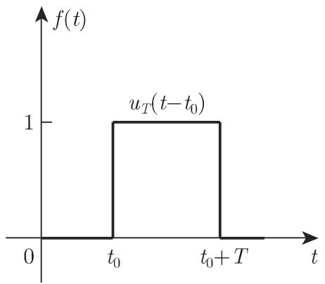  
15.10

  
15.11

对千连续函数 $h ( t )$

$$
\int_ {a} ^ {b} h (t) \delta (t - t _ {0}) \mathrm{d} t = \left\{ \begin{array}{l l} h (t _ {0}), & t _ {0} \in (a, b), \\ 0, & t _ {0} \notin (a, b). \end{array} \right.\tag{15.29}
$$

比如

$$
\delta (t - t _ {0}) = \frac {\mathrm{d} u (t - t _ {0})}{\mathrm{d} t}, \quad \mathcal {L} \left\{\delta (t - t _ {0}) \right\} = \mathrm{e} ^ {- t _ {0} p} \quad (t _ {0} \geqslant 0).\tag{15.30}
$$

等关系式通常在广义函数论中进行研究（参见第 912 12.9.5.3).

4. 分段可微函数

分段可微函数的变换可借助 函数轻松确定：若 $f ( t )$ 是分段可微的，且在点$t _ { v } ~ ( v = 1 , 2 , \cdot \cdot \cdot , n )$ 处有跳跃 $a _ { v }$ ，则其一阶导数可表示为

$$
\frac {\mathrm{d} f (t)}{\mathrm{d} t} = f _ {s} ^ {\prime} (t) + a _ {1} \delta (t - t _ {1}) + a _ {2} \delta (t - t _ {2}) + \dots + a _ {n} \delta (t - t _ {n}),\tag{15.31}
$$

其中， $f _ { s } ^ { \prime } ( t )$ J(t) 的一般导数， $f _ { s } ^ { \prime } ( t )$ 也是可微的．

若跳跃首先出现在导数中，则有类似的公式成立．在这种方式下，我们可以轻松确定由任意高度抛物线组成的曲线所对应函数的变换，例如，实证研究曲线．当正式应用 (15.13) 时，在跳跃情况下，数值 $f ( + 0 ) , f ^ { \prime } ( + 0 ) , \cdot \cdot \cdot$ 应该用 代替A:

$$
f (t) = \left\{ \begin{array}{l l} a t + b, & 0 <   t <   t _ {0}, \\ 0, & \text {其他} \end{array} \right. (\text {图} 1 5. 1 2);
$$

$$
\begin{array}{r l} & f ^ {\prime} (t) = a u _ {t _ {0}} (t) + b \delta (t) - (a t _ {0} + b) \delta (t - t _ {0}); \\ & \mathcal {L} \left\{f ^ {\prime} (t) \right\} = \frac {a}{p} (1 - \mathrm{e} ^ {- t _ {0} p}) + b - (a t _ {0} + b) \mathrm{e} ^ {- t _ {0} p}; \\ & \mathcal {L} \left\{f (t) \right\} = \frac {1}{p} \left[ \frac {a}{p} + b - \mathrm{e} ^ {- t _ {0} p} \left(\frac {a}{p} + a t _ {0} + b\right) \right]. \end{array}
$$

B:

, 0 < t < to, f(t) = ..)2 ,() 00 ot2 ,0tttp \_, 0, 0, t > 2t0 1, 0 < t < to, f′(t) = −1, t0 < t < 2to, (图 15.14); 0, t > 2to .' \_ ,C { J" (t) } = 1 —2e—top+ e—2top; -2 L {f(t)} = p2

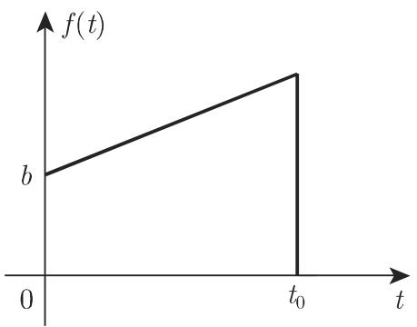  
15.12

  
15.13

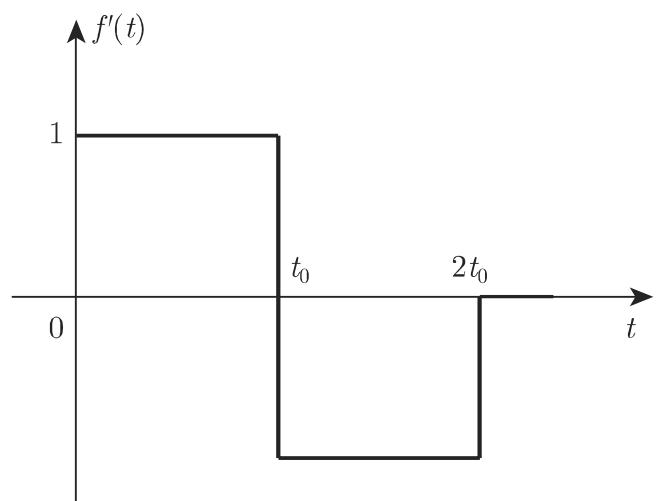  
15.14

C:

$$
\begin{array}{r l} & {f (t) = \left\{ \begin{array}{l l} {E t / t _ {0},} & {0 <   t <   t _ {0},} \\ {E,} & {t _ {0} <   t <   T - t _ {0},} \\ {- E (t - T) / t _ {0},} & {T - t _ {0} <   t <   T,} \\ {0,} & {\text {其他}} \end{array} \right. (\text {图} 1 5. 1 5);} \\ & {f ^ {\prime} (t) = \left\{ \begin{array}{l l} {E / t _ {0},} & {0 <   t <   t _ {0},} \\ {0,} & {t _ {0} <   t <   T - t _ {0} (t > T),} \\ {- E / t _ {0},} & {T - t _ {0} <   t <   T,} \\ {0,} & {\text {其他}} \end{array} \right. (\text {图} 1 5. 1 6);} \\ & {f ^ {\prime \prime} (t) = \frac {E}{t _ {0}} \delta (t) - \frac {E}{t _ {0}} \delta (t - t _ {0}) - \frac {E}{t _ {0}} \delta (t - T + t _ {0}) + \frac {E}{t _ {0}} \delta (t - T);} \\ & {\mathcal {L} \left\{f ^ {\prime \prime} (t) \right\} = \frac {E}{t _ {0}} \left[ 1 - \mathrm{e} ^ {- t _ {0} p} - \mathrm{e} ^ {- (T - t _ {0}) p} + \mathrm{e} ^ {- T p} \right];} \\ & {\mathcal {L} \left\{f (t) \right\} = \frac {E}{t _ {0}} \frac {(1 - \mathrm{e} ^ {- t _ {0} p}) (1 - \mathrm{e} ^ {- (T - t _ {0}) p})}{p ^ {2}}.} \end{array}
$$

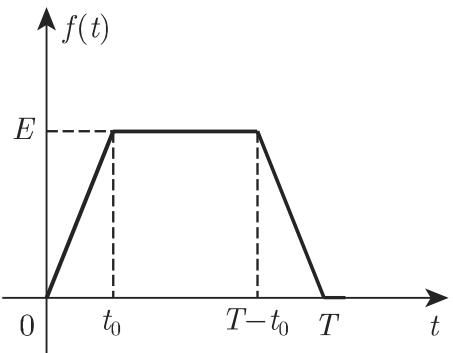  
15.15

  
15.16

D:

$$
\begin{array}{r l} & {f (t) = \left\{ \begin{array}{l l} {t - t ^ {2},} & {0 <   t <   1,} \\ {0,} & {\text {其他}} \end{array} \right. (\text {图} 1 5. 1 7);} \\ & {f ^ {\prime} (t) = \left\{ \begin{array}{l l} {1 - 2 t,} & {0 <   t <   1,} \\ {0,} & {\text {其他}} \end{array} \right. (\text {图} 1 5. 1 8);} \\ & {f ^ {\prime \prime} (t) = - 2 u _ {1} (t) + \delta (t) + \delta (t - 1);} \\ & {\mathcal {L} \left\{f ^ {\prime \prime} (t) \right\} = - \frac {2}{p} (1 - \mathrm{e} ^ {- p}) + 1 + \mathrm{e} ^ {- p}; \quad \mathcal {L} \left\{f (t) \right\} = \frac {1 + \mathrm{e} ^ {- p}}{p ^ {2}} - \frac {2 (1 - \mathrm{e} ^ {- p})}{p ^ {3}}.} \end{array}
$$

5. 周期函数

周期为 $T$ 的周期函数 $f ^ { * } ( t )$ ，是函数 $f ( t )$ 的周期延拓，其变换可由 f(t) 的拉普拉斯变换乘以周期因子

$$
(1 - \mathrm{e} ^ {- T p}) ^ {- 1}\tag{15.32}
$$

得到

  
15.17

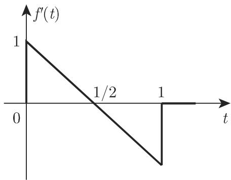  
15.18

A: 由例 （见上例），以周期 $T = 2 t _ { 0 }$ 把 f(t) 周期延拓得到 $f ^ { * } ( t )$ ，且

$$
\mathcal {L} \left\{f ^ {*} (t) \right\} = \frac {(1 - \mathrm{e} ^ {- t _ {0} p}) ^ {2}}{p ^ {2}} \cdot \frac {1}{1 - \mathrm{e} ^ {- 2 t _ {0} p}} = \frac {1 - \mathrm{e} ^ {- t _ {0} p}}{p ^ {2} (1 + \mathrm{e} ^ {- t _ {0} p})}.
$$

B: 由例 （见上例），以周期 f(t) 周期延拓得到 $f ^ { * } ( t )$ ，且

$$
\mathcal {L} \left\{f ^ {*} (t) \right\} = \frac {E (1 - \mathrm{e} ^ {- t _ {0} p}) (1 - \mathrm{e} ^ {- (T - t _ {0}) p})}{t _ {0} p ^ {2} (1 - \mathrm{e} ^ {- T p})}.
$$

15.2.1.4 狄拉克 $\delta$ 函数及其分布

在利用线性微分方程描述某些技术系统时函数 $u ( t )$ 和 $\delta ( t )$ 经常作为扰动函数和输入函数出现，尽管第 1006 15.2.1.1, 1. 要求的条件并不满足： $u ( t )$ 是不连续的， $\delta ( t )$ 不能在经典分析意义下进行定义．

通过引入所谓的广义函数（分布），提供了一种解决方法，从而可以使 8(t) 作用到已知的连续实函数，而且还可以保证其可微性．分布的表示有很多方式，最著名的方式之一是由施瓦兹引入的连续实线性泛函（参见第 911 12.9.5)．傅里叶系数和傅里叶级数可与周期分布唯一联系，类似千实函数（参见第 633 7.4).

1. 函数的近似

类似千 (15.28) 式脉冲函数 $\delta ( t )$ 可用宽度为 、高度为 $1 / \varepsilon ( \varepsilon > 0 )$ 的矩形脉冲近似：

$$
f (t, \varepsilon) = \left\{ \begin{array}{l l} 1 / \varepsilon , & | t | <   \varepsilon / 2, \\ 0, & | t | \geqslant \varepsilon / 2. \end{array} \right.\tag{15.33a}
$$

更深入的 $\delta ( t )$ 近似实例是误差曲线（参见第 94 2.6.3) 和洛伦兹函数（参见123 2.11.2):

$$
f (t, \varepsilon) = \frac {1}{\varepsilon \sqrt {2 \pi}} \mathrm{e} ^ {- \frac {t ^ {2}}{2 \varepsilon^ {2}}} (\varepsilon > 0),\tag{15.33b}
$$

$$
f (t, \varepsilon) = \frac {\varepsilon / \pi}{t ^ {2} + \varepsilon^ {2}} (\varepsilon > 0).\tag{15.33c}
$$

这些函数具有共同的性质：

$$
(1) \int_ {- \infty} ^ {\infty} f (t, \varepsilon) \mathrm{d} t = 1.\tag{15.34a}
$$

(2) $f ( - t , \varepsilon ) = f ( t , \varepsilon )$ ，即它们是偶函数．

(15.34b)

$$
(3) \lim _ {\varepsilon \to 0} f (t, \varepsilon) = \left\{ \begin{array}{l l} \infty , & t = 0, \\ 0, & t \neq 0. \end{array} \right.\tag{15.34c}
$$

2. 函数的性质

函数的重要性质是

$$
(1) \int_ {x - a} ^ {x + a} f (t) \delta (x - t) \mathrm{d} t = f (x) \quad (f \text {是连续的}, a > 0).\tag{15.35}
$$

$$
(2) \delta (\alpha x) = \frac {1}{\alpha} \delta (x) \quad (\alpha > 0).\tag{15.36}
$$

$$
(3) \delta (g (x)) = \sum_ {i = 1} ^ {n} \frac {1}{| g ^ {\prime} (x _ {i}) |} \delta (x - x _ {i}) \quad g (x _ {i}) = 0, g ^ {\prime} (x _ {i}) \neq 0 (i = 1, 2, \dots , n).\tag{15.37}
$$

此处考虑了 $g ( x )$ 的所有根，且它们必须是单根．

(4) 函数的 阶导数：对

$$
f ^ {(n)} (x) = \int_ {x - a} ^ {x + a} f ^ {(n)} (t) \delta (x - t) \mathrm{d} t,\tag{15.38a}
$$

重复进行 次偏积分后，可得到 函数的 阶导数法则：

$$
(- 1) ^ {n} f ^ {(n)} (x) = \int_ {x - a} ^ {x + a} f (t) \delta^ {(n)} (x - t) \mathrm{d} t.\tag{15.38b}
$$
