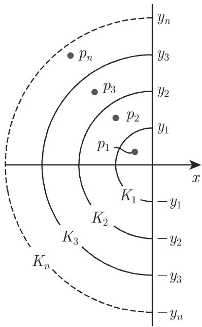
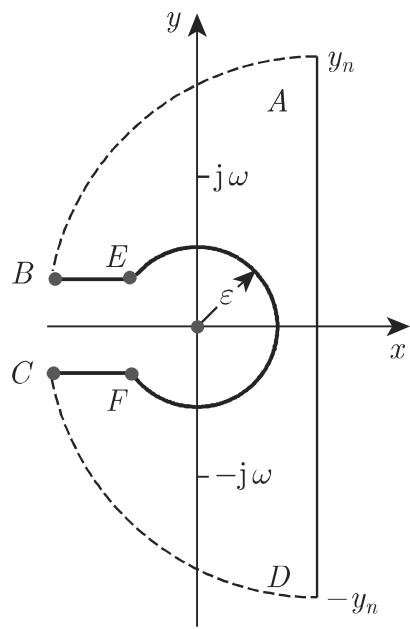

#### 15.2.2 到原始空间的逆变换

为进行逆变换，有下述可能方法：

(1) 使用对应表，即原函数和积分相对应的表格（参见第 1431 页表 21.13).

(2) 利用变换的一些性质，约化为已知的对应（参见第 1018 15.2.2.2 101915.2.2.3).

(3) 借助反演公式（参见第 1020 15.2.2.4).

15.2.2.1 借助表格求逆变换

通过第 1431 页表 21.13 的例子说明对表格的使用．

更多表格可见 [15.3].

$$
{\bf \Pi} F (p) = \frac {1}{(p ^ {2} + \omega^ {2}) (p + c)} = F _ {1} (p) \cdot F _ {2} (p),
$$

$$
\mathcal {L} ^ {- 1} \left\{F _ {1} (p) \right\} = \mathcal {L} ^ {- 1} \left\{\frac {1}{p ^ {2} + \omega^ {2}} \right\} = \frac {1}{\omega} \sin \omega t = f _ {1} (t),
$$

$$
\mathcal {L} ^ {- 1} \left\{F _ {2} (p) \right\} = \mathcal {L} ^ {- 1} \left\{\frac {1}{p + c} \right\} = \mathrm{e} ^ {- c t} = f _ {2} (t).
$$

运用卷积定理 (15.23) 得到

$$
\begin{array}{r l} & {f (t) = \mathcal {L} ^ {- 1} \left\{F _ {1} (p) \cdot F _ {2} (p) \right\}} \\ & {\quad = \int_ {0} ^ {t} f _ {1} (\tau) \cdot f _ {2} (t - \tau) \mathrm{d} \tau = \int_ {0} ^ {t} \mathrm{e} ^ {- c (t - \tau)} \frac {\sin \omega \tau}{\omega} \mathrm{d} \tau} \\ & {\quad = \frac {1}{c ^ {2} + \omega^ {2}} \left(\frac {c \sin \omega t - \omega \cos \omega t}{\omega} + \mathrm{e} ^ {- c t}\right).} \end{array}
$$

15.2.2.2 部分分式分解

1. 原则

在很多应用中，有形如 $F ( p ) = H ( p ) / G ( p )$ 的变换，其中 $G ( p )$ 是关千 $p$ 的多项式．若 $H ( p )$ 和 $1 / G ( p )$ 的原函数已知则所求 $F ( p )$ 的原函数可运用卷积定理得到

2. $G ( p )$ 只有单实根

若变换 $1 / G ( p )$ 只有一阶极点 $p _ { v } \ ( v = 1 , 2 , \cdot \cdot \cdot , n )$ ，则它有下述最简分解分式：

$$
{\frac {1}{G (p)}} = \sum_ {v = 1} ^ {n} {\frac {1}{G ^ {\prime} (p _ {v}) (p - p _ {v})}}.\tag{15.39}
$$

对应的原函数是

$$
q (t) = \mathcal {L} ^ {- 1} \left\{\frac {1}{G (p)} \right\} = \sum_ {v = 1} ^ {n} \frac {1}{G ^ {\prime} (p _ {v})} \mathrm{e} ^ {p _ {v} t}.\tag{15.40}
$$

3. 赫维赛德展开定理

若分子 $H ( p )$ 也是关千 $p$ 的多项式，且次数比 $G ( p )$ 的次数低，则可借助赫维赛德公式得到 $F ( p )$ 的原函数

$$
f (t) = \sum_ {v = 1} ^ {n} \frac {H (p _ {v})}{G ^ {\prime} (p _ {v})} \mathrm{e} ^ {p _ {v} t}.\tag{15.41}
$$

4. 复根

即使在分母有复根的情况，也同样可以使用赫维赛德展开定理．对应共辄复根的项可以合并为一个二次表达式，其逆变换也可在关千高阶重根的表格中找到．

■ $F ( p ) = { \frac { 1 } { ( p + c ) ( p ^ { 2 } + \omega ^ { 2 } ) } }$ ，即

$$
H (p) = 1, \quad G (p) = (p + c) (p ^ {2} + \omega^ {2}), \quad G ^ {\prime} (p) = 3 p ^ {2} + 2 p c + \omega^ {2}.
$$

$G ( \boldsymbol { p } )$ 的零点 $p _ { 1 } = - c , p _ { 2 } = \mathrm { i } \omega , p _ { 3 } = - \mathrm { i } \omega$ 都是单根．根据赫维赛德定理，可得到

$$
f (t) = \frac {1}{\omega^ {2} + c ^ {2}} \mathrm{e} ^ {- c t} - \frac {1}{2 \omega (\omega - \mathrm{i} c)} \mathrm{e} ^ {\mathrm{i} \omega t} - \frac {1}{2 \omega (\omega + \mathrm{i} c)} \mathrm{e} ^ {- \mathrm{i} \omega t}.
$$

或通过使用部分分式分解和表格，可得到

$$
F (p) = \frac {1}{\omega^ {2} + c ^ {2}} \left[ \frac {1}{p + c} + \frac {c - p}{p ^ {2} + \omega^ {2}} \right], f (t) = \frac {1}{\omega^ {2} + c ^ {2}} \left[ \mathrm{e} ^ {- c t} + \frac {c}{\omega} \sin \omega t - \cos \omega t \right].
$$

f(t) 的上述表达式是恒等的．

15.2.2.3 级数展开

为了根据 $F ( p )$ 得到 f(t)，我们可试着把 $F ( p )$ 展开成级数 $F ( p ) = \sum _ { n = 0 } ^ { \infty } F _ { n } ( p )$ 而项 $F _ { n } ( p )$ 是已知函数的变换， $F _ { n } ( p ) = \mathcal { L } \left\{ f _ { n } ( t ) \right\}$

l. $F ( p )$ 是绝对收敛级数

当 $| p | > R$ 时若 $F ( p )$ 有绝对收敛级数

$$
F (p) = \sum_ {n = 0} ^ {\infty} \frac {a _ {n}}{p ^ {\lambda_ {n}}},\tag{15.42}
$$

其中值 $\lambda _ { n }$ 形成任意递增序列 $0 < \lambda _ { 0 } < \lambda _ { 1 } < \cdots < \lambda _ { n } < \cdots  \infty$ ，则逐项逆变换是可能的：

$$
f (t) = \sum_ {n = 0} ^ {\infty} a _ {n} \frac {t ^ {\lambda_ {n} - 1}}{\Gamma (\lambda_ {n})}.\tag{15.43}
$$

表示 函数（参见第 682 8.2.5, 6.)．特别地对千 $\lambda _ { n } = n + 1$ , 即对千$F ( p ) = \sum _ { n = 0 } ^ { \infty } \frac { a _ { n + 1 } } { p ^ { n + 1 } }$ ，可得到级数 $f ( t ) = \sum _ { n = 0 } ^ { \infty } { \frac { a _ { n + 1 } } { n ! } } t ^ { n }$ ，该级数对任意实数和复数敛而且可以得到 $| f ( t ) | < C \mathrm { e } ^ { c | t | } \ ( C , c$ 是实常数）形式的估计．

$F ( p ) = { \frac { 1 } { \sqrt { 1 + p ^ { 2 } } } } = { \frac { 1 } { p } } \left( 1 + { \frac { 1 } { p ^ { 2 } } } \right) ^ { - 1 / 2 } = \sum _ { n = 0 } ^ { \infty } \left( { - { \frac { 1 } { 2 } } } \right) { \frac { 1 } { p ^ { 2 n + 1 } } }$ . 逐项变换到原始土 间后结果是 $f ( t ) = \sum _ { n = 0 } ^ { \infty } { \binom { - { \frac { 1 } { 2 } } } { n } } { \frac { t ^ { 2 n } } { ( 2 n ) ! } } = \sum _ { n = 0 } ^ { \infty } { \frac { ( - 1 ) ^ { n } } { ( n ! ) ^ { 2 } } } \left( { \frac { t } { 2 } } \right) ^ { 2 n } = J _ { 0 } ( t )$ (0 阶贝塞尔函 数）．

2. $F ( p )$ 是亚纯函数

若 $F ( p )$ 是亚纯函数，可表示为两个没有共同根的整函数（处处有收敛幕级数展开的函数）之商，则 $F ( p )$ 可被重新写为整函数和无穷部分分式之和，从而可得等式

$$
\frac {1}{2 \pi \mathrm{i}} \int_ {c - \mathrm{i} y _ {n}} ^ {c + \mathrm{i} y _ {n}} \mathrm{e} ^ {t p} F (p) \mathrm{d} p = \sum_ {v = 1} ^ {n} b _ {v} \mathrm{e} ^ {p _ {v} t} - \frac {1}{2 \pi \mathrm{i}} \int_ {(K _ {n})} \mathrm{e} ^ {t p} F (p) \mathrm{d} p,\tag{15.44}
$$

此处， $p _ { v } \ ( v = 1 , 2 , \cdot \cdot \cdot , n )$ 是函数 $F ( p )$ 的一阶极点 $b _ { v }$ 是相应处的留数（参见第983 14.3.5.4), $y _ { v }$ 是特定值 $K _ { v }$ 凡是特定曲线例如图 15.19 给出了该意义下的半圆．解 f(t) 具有形式

$$
f (t) = \sum_ {v = 1} ^ {\infty} b _ {v} \mathrm{e} ^ {p _ {v} t}, \quad \text {若} \quad {\frac {1}{2 \pi \mathrm{i}}} \int_ {(K _ {n})} \mathrm{e} ^ {t p} F (p) \mathrm{d} p \to 0,\tag{15.45}
$$

当 $y  \infty$ 时这一点通常不容易证明．

在某些情况下，比如当亚纯函数 $F ( p )$ 的有理部分一致为 时，上述结果是赫维赛德展开定理对亚纯函数的正式应用．

15.2.2.4 逆积分

反演公式

$$
f (t) = \lim _ {y _ {n} \to \infty} \frac {1}{2 \pi \mathrm{i}} \int_ {c - \mathrm{i} y _ {n}} ^ {c + \mathrm{i} y _ {n}} \mathrm{e} ^ {t p} F (p) \mathrm{d} p\tag{15.46}
$$

表示特定区域内解析函数的复积分．复函数积分理论可使用的积分方法此时都可以应用比如，留数计算或根据柯西积分定理对积分路径进行变化．

·巾千 $\sqrt { p } , \ F ( p ) = \frac { p } { p ^ { 2 } + \omega ^ { 2 } } \mathrm { e } ^ { - \sqrt { p } \alpha }$ 是双值函数．因此，我们选择下述积分路径（图 15.20):

$$
\begin{array}{r l r} & & {\frac {1}{2 \pi \mathrm{i}} \oint_ {(K)} \mathrm{e} ^ {t p} \frac {p}{p ^ {2} + \omega^ {2}} \mathrm{e} ^ {- \sqrt {p} \alpha} \mathrm{d} p = \int_ {\widehat {A B}} \dots + \int_ {\widehat {C D}} \dots + \int_ {\widehat {E F}} \dots + \int_ {\overline {{D A}}} \dots + \int_ {\overline {{B E}}} \dots + \int_ {\overline {{F C}}}} \\ & & {= \sum \mathrm{Res} \mathrm{e} ^ {t p} F (p) = \mathrm{e} ^ {- \alpha \sqrt {\omega / 2}} \cos (\omega t - \alpha \sqrt {\omega / 2}).} \end{array}
$$

  
15.19

  
15.20

根据若尔当引理（参见第 986 14.4.3)，当 $y _ { n } \to \infty$ 时， $\widehat { A B }$ 和 $\widehat { C D }$ 上的积分消失圆周 $\widehat { E F }$ 上的积分保持有界（留数为 $\varepsilon )$ ，且当 $\varepsilon \to 0$ 时积分路径的长度趋向于 $0 ,$ ，故这一项的积分也消失了．只需研究两个水平线段万万和 $\overline { { F C } }$ 上的积分，分别需要考虑实轴负半轴的上边 $( p = r \mathrm { e } ^ { \mathrm { i } \pi } )$ ）和下边 $( p = r \mathrm { e } ^ { - \mathrm { i } \pi } )$

$$
\begin{array}{r l} & {\int_ {- \infty} ^ {0} F (p) \mathrm{e} ^ {t p} \mathrm{d} p = - \int_ {0} ^ {\infty} \mathrm{e} ^ {- t r} \frac {r}{r ^ {2} + \omega^ {2}} \mathrm{e} ^ {- \mathrm{i} \alpha \sqrt {r}} \mathrm{d} r,} \\ & {\int_ {0} ^ {- \infty} F (p) \mathrm{e} ^ {t p} \mathrm{d} p = \int_ {0} ^ {\infty} \mathrm{e} ^ {- t r} \frac {r}{r ^ {2} + \omega^ {2}} \mathrm{e} ^ {\mathrm{i} \alpha \sqrt {r}} \mathrm{d} r.} \end{array}
$$

最终可得

$$
f (t) = \mathrm{e} ^ {- \alpha \sqrt {\omega / 2}} \cos \left(\omega t - \alpha \sqrt {\frac {\omega}{2}}\right) - \frac {1}{\pi} \int_ {0} ^ {\infty} \mathrm{e} ^ {- t r} \frac {r \sin \alpha \sqrt {r}}{r ^ {2} + \omega^ {2}} \mathrm{d} r.
$$
