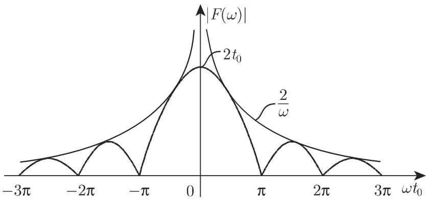
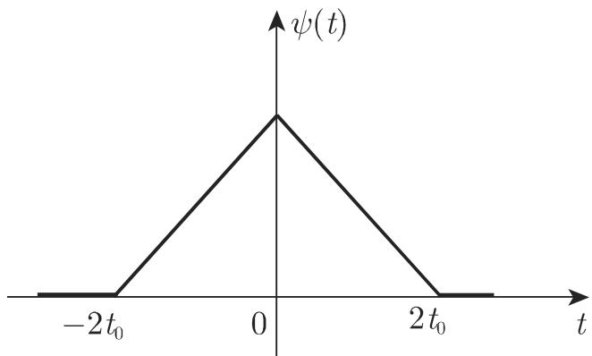
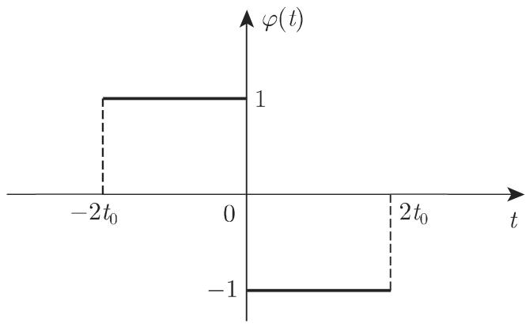
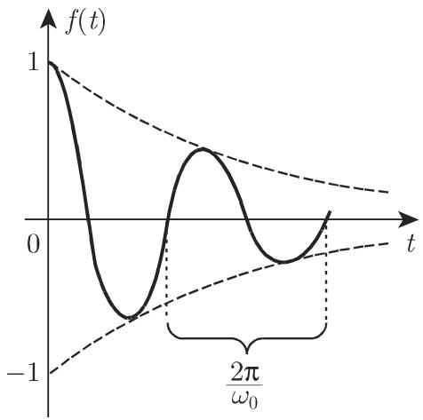

### 15.3 傅里叶变换

#### 15.3.1 傅里叶变换的性质

15.3.1.1 傅里叶积分

1. 傅里叶积分的复形式

傅里叶变换的基础是傅里叶积分，也称傅里叶积分公式．若非周期函数 f(t)任意有限区间内满足狄利克雷条件（参见第 635 7.4.1.2, 3.），而且积分

$$
\int_ {- \infty} ^ {+ \infty} | f (t) | \mathrm{d} t\tag{15.64a}
$$

收敛，则

$$
f (t) = \frac {1}{2 \pi} \int_ {- \infty} ^ {+ \infty} \int_ {- \infty} ^ {+ \infty} \mathrm{e} ^ {\mathrm{i} \omega (t - \tau)} f (\tau) \mathrm{d} \omega \mathrm{d} \tau\tag{15.64b}
$$

在任意连续点处成立，在间断点处有

$$
{\frac {f (t + 0) + f (t - 0)}{2}} = {\frac {1}{\pi}} \int_ {0} ^ {\infty} \mathrm{d} \omega \int_ {- \infty} ^ {+ \infty} f (\tau) \cos \omega (t - \tau) \mathrm{d} \tau .\tag{15.64c}
$$

2. 等价表示

傅里叶积分 (15.64b) 的其他等价形式是：

$$
f (t) = \frac {1}{2 \pi} \int_ {- \infty} ^ {+ \infty} \int_ {- \infty} ^ {+ \infty} f (\tau) \cos [ \omega (t - \tau) ] \mathrm{d} \omega \mathrm{d} \tau .\tag{15.65a}
$$

$$
f (t) = \int_ {0} ^ {\infty} [ a (\omega) \cos \omega t + b (\omega) \sin \omega t ] \mathrm{d} \omega , \tag {2}\tag{15.65b}
$$

且系数

$$
a (\omega) = \frac {1}{\pi} \int_ {- \infty} ^ {+ \infty} f (t) \cos \omega t \mathrm{d} t,\tag{15.65c}
$$

$$
b (\omega) = \frac {1}{\pi} \int_ {- \infty} ^ {+ \infty} f (t) \sin \omega t \mathrm{d} t.\tag{15.65d}
$$

$$
f (t) = \int_ {0} ^ {\infty} A (\omega) \cos [ \omega t + \psi (\omega) ] \mathrm{d} \omega . \tag {3}\tag{15.66}
$$

$$
(4) f (t) = \int_ {0} ^ {\infty} A (\omega) \sin [ \omega t + \varphi (\omega) ] \mathrm{d} \omega .\tag{15.67}
$$

此处，有下述关系式成立：

$$
A (\omega) = \sqrt {a ^ {2} (\omega) + b ^ {2} (\omega)},\tag{15.68a}
$$

$$
\varphi (\omega) = \psi (\omega) + \frac {\pi}{2},\tag{15.68b}
$$

$$
\cos \psi (\omega) = \frac {a (\omega)}{A (\omega)},\tag{15.68c}
$$

$$
\sin \psi (\omega) = \frac {b (\omega)}{A (\omega)},\tag{15.68d}
$$

$$
\cos \varphi (\omega) = \frac {b (\omega)}{A (\omega)},\tag{15.68e}
$$

$$
\sin \varphi (\omega) = \frac {a (\omega)}{A (\omega)}.\tag{15.68f}
$$

15.3.1.2 傅里叶变换和逆变换

1. 傅里叶变换的定义

傅里叶变换是一种 (15.la) 的积分变换，它来自千傅里叶积分 (15.64b) ，定义为

$$
F (\omega) = \int_ {- \infty} ^ {+ \infty} \mathrm{e} ^ {- \mathrm{i} \omega \tau} f (\tau) \mathrm{d} \tau .\tag{15.69}
$$

在实原函数 $f ( t )$ 和一般的复变换 $F ( \omega )$ 之间有下述关系式成立：

$$
f (t) = \frac {1}{2 \pi} \int_ {- \infty} ^ {+ \infty} \mathrm{e} ^ {\mathrm{i} \omega t} F (\omega) \mathrm{d} \omega .\tag{15.70}
$$

为符号简洁可使用 $\mathcal { F }$

$$
F (\omega) = \mathcal {F} \left\{f (t) \right\} = \int_ {- \infty} ^ {+ \infty} \mathrm{e} ^ {- \mathrm{i} \omega t} f (t) \mathrm{d} t.\tag{15.71}
$$

若积分 (15.69)，即含参数 $\omega$ 的广义积分存在，则原函数 $f ( t )$ 可傅里叶变换．若傅里叶积分作为普通广义积分不存在，则它可视为柯西主值（参见第 677 8.2.3.3,1.) ．变换 $F ( \omega )$ 也称为傅里叶变换； $F ( \omega )$ 有界、连续，且 $| \omega |  \infty$ 时， $F ( \omega )$ 趋向千 0:

$$
\lim _ {| \omega | \to \infty} F (\omega) = 0.\tag{15.72}
$$

$F ( \omega )$ 的存在性和有界性直接可由不等式得到

$$
| F (\omega) | \leqslant \int_ {- \infty} ^ {+ \infty} | \mathrm{e} ^ {- \mathrm{i} \omega t} f (t) | \mathrm{d} t \leqslant \int_ {- \infty} ^ {+ \infty} | f (t) | \mathrm{d} t.\tag{15.73}
$$

傅里叶变换的存在性是 $F ( \omega )$ 连续和当 $| \omega | \to \infty$ 时， $F ( \omega ) \to 0$ 成立的充分条件．该结论通常以下述形式使用：若函数 $f ( t )$ 在 $( - \infty , \infty )$ 内是绝对可积的，则其傅里叶变换是 $\omega$ 的连续函数，且式 (15.72) 成立．

下述函数是不可傅里叶变换的：常数函数、任意周期函数（比如 sinwt $\cos \omega t )$ 幕函数、多项式、指数函数（比如 $\mathrm { e } ^ { \alpha t }$ ，双曲线函数）｀

2. 傅里叶余弦变换和傅里叶正弦变换

在傅里叶变换 (15.71) 中，被积函数可分解成正弦部分和余弦部分，从而可得到傅里叶正弦变换和傅里叶余弦变换．

(1) 傅里叶正弦变换

$$
F _ {s} (\omega) = \mathcal {F} _ {s} \left\{f (t) \right\} = \int_ {0} ^ {\infty} f (t) \sin (\omega t) \mathrm{d} t.\tag{15.74a}
$$

(2) 傅里叶余弦变换

$$
F _ {c} (\omega) = \mathcal {F} _ {c} \left\{f (t) \right\} = \int_ {0} ^ {\infty} f (t) \cos (\omega t) \mathrm{d} t.\tag{15.74b}
$$

(3) 转换公式 由傅里叶正弦变换 (15.74a) ，傅里叶余弦变换 (15.74b) 以及傅里叶变换 (15.71)，有下述关系式成立：

$$
F (\omega) = \mathcal {F} \left\{f (t) \right\} = \mathcal {F} _ {c} \left\{f (t) + f (- t) \right\} - \mathrm{i} \mathcal {F} _ {s} \left\{f (t) - f (- t) \right\},\tag{15.75a}
$$

$$
F _ {s} (\omega) = \frac {\mathrm{i}}{2} \mathcal {F} \left\{f (| t |) \mathrm{sign} t \right\},\tag{15.75b}
$$

$$
F _ {c} (\omega) = \frac {1}{2} \mathcal {F} \left\{f (| t |) \right\}.\tag{15.75c}
$$

对千偶函数或奇函数 f(t)，有下述关系式：

(t) 为偶函数时： $\mathcal { F } \left\{ f ( t ) \right\} = 2 \mathcal { F } _ { c } \left\{ f ( t ) \right\}$ };

f(t) 为奇函数时： $\mathcal { F } \left\{ f ( t ) \right\} = - 2 \mathrm { i } \mathcal { F } _ { s } \left\{ f ( t ) \right\}$

(15.75d)

3. 指数型傅里叶变换

与式 (15.71) $F ( \omega )$ 的定义不同变换

$$
F _ {e} (\omega) = \mathcal {F} _ {e} \left\{f (t) \right\} = \frac {1}{2} \int_ {- \infty} ^ {+ \infty} \mathrm{e} ^ {\mathrm{i} \omega t} f (t) \mathrm{d} t\tag{15.76}
$$

称为指数型傅里叶变换，因此

$$
F (\omega) = 2 F _ {e} (- \omega).\tag{15.77}
$$

4. 傅里叶变换表

我们要么是以公式 (15.75a)r-v(l5. 75c) 为基础，不需要傅里叶正弦变换和傅里叶余弦变换相对应的特殊表格，要么是使用傅里叶正弦变换和傅里叶余弦变换表，借助 $( 1 5 . 7 5 \mathrm { a } ) \sim ( 1 5 . 7 5 \mathrm { c } )$ 计算 $\mathcal { F } ( \omega )$ ．表 21.14.1 （见 1436 页）和表 21.14.2 （见 1444 页）分别列出了傅里叶正弦变换 $\mathcal { F } _ { s } ( \omega )$ 和傅里叶余弦变换 $\mathcal { F } _ { c } ( \omega )$ ，表 21.14.3（见 1451页）给出了一些函数的傅里叶变换 $\mathcal { F } ( \omega )$ ，且表 21.14.4（见 1453 页）给出了指数型傅里叶变换 $\mathcal { F } _ { e } ( \omega )$

·单极性矩形脉冲函数当 $| t | < t _ { 0 }$ 时， $f ( t ) = 1$ , $| t | > t _ { 0 }$ 时， $f ( t ) = 0 ( \mathrm { A } . 1 )$ （图 15.21) ，满足傅里叶积分 (15.64a) 存在性的假定．根据 (15.65c) (15.65d) ，系数是

$$
a (\omega) = {\frac {1}{\pi}} \int_ {- t _ {0}} ^ {+ t _ {0}} \cos \omega t \mathrm{d} t = {\frac {2}{\pi \omega}} \sin \omega t _ {0} \quad {\text {和}} \quad b (\omega) = {\frac {1}{\pi}} \int_ {- t _ {0}} ^ {+ t _ {0}} \sin \omega t \mathrm{d} t = 0.\tag{A.2}
$$

故由式 (15.65b) ，可推出 $f ( t ) = \frac { 2 } { \pi } \int _ { 0 } ^ { \infty } \frac { \sin \omega t _ { 0 } \cos \omega t } { \omega } \mathrm { d } \omega .$

(A.3)

  
15.21

5. 傅里叶变换的谱解释

类似千周期函数的傅里叶级数，非周期函数的傅里叶积分也有简单的物理解释．根据 (15.66) (15.67) ，存在傅里叶积分的函数 $f ( t )$ ，可表示为含有持续变化频率$\omega$ 的正弦振动之和其形式为

$$
A (\omega) \mathrm{d} \omega \sin [ \omega t + \varphi (\omega) ],\tag{15.78a}
$$

$$
A (\omega) \mathrm{d} \omega \cos [ \omega t + \psi (\omega) ].\tag{15.78b}
$$

表达式 $A ( \omega ) \mathrm { d } \omega$ 给出了波的振幅， $\varphi ( \omega )$ ）和 $\psi ( \omega )$ 是相位．对千复公式有相同的解释：函数 f(t) 是依赖千 $\omega$ 形如

$$
\frac {1}{2 \pi} F (\omega) \mathrm{d} \omega \mathrm{e} ^ {\mathrm{i} \omega t}\tag{15.79}
$$

的被加项之和（或积分）．其中，量 ${ \frac { 1 } { 2 \pi } } F ( \omega )$ 也确定了所有部分的振幅和相位．

傅里叶积分和傅里叶变换的谱解释在物理学和工程学应用中有很大优势．变换

$$
F (\omega) = | F (\omega) | \mathrm{e} ^ {\mathrm{i} \psi (\omega)} \quad \text {或} \quad F (\omega) = | F (\omega) | \mathrm{e} ^ {\mathrm{i} \varphi (\omega)}\tag{15.80a}
$$

称为函数 f(t) 的谱或频谱．量

$$
| F (\omega) | = \pi A (\omega)\tag{15.80b}
$$

称为函数 (t) 的振幅谱， $\varphi ( \omega )$ ）和 $\psi ( \omega )$ 称为 f(t) 的相位谱．谱 $F ( \omega )$ 和系数(15.65c) (15.65d) 之间的关系为

$$
F (\omega) = \pi [ a (\omega) - \mathrm{i} b (\omega) ],\tag{15.81}
$$

由此可得到下述结论：

(1) f(t) 是实函数，则振幅谱 $| F ( \omega ) |$ 的偶函数，相位谱是 $\omega$ 的奇函数．

(2) f(t) 是实值偶函数，则其谱 $F ( \omega )$ 是实的；若 f(t) 是实值奇函数，则$F ( \omega )$ 是虚的．

·对千第 1028 页单极性矩形脉冲函数，把结果 (A.2) 替换到 (15.81) ，可得到对千变换 $F ( \omega )$ 和振幅谱 $| F ( \omega )$ （图 15.22) ，有

$$
F (\omega) = \mathcal {F} \left\{f (t) \right\} = \pi a (\omega) = 2 \frac {\sin \omega t _ {0}}{\omega},\tag{A.3}
$$

$$
| F (\omega) | = 2 \left| \frac {\sin \omega t _ {0}}{\omega} \right|.\tag{A.4}
$$

振幅谱 $| F ( \omega ) |$ 和双曲线 $\frac { 2 } { \omega }$ 的连接点是 $\omega t _ { 0 } = \pm ( 2 n + 1 ) \frac { \pi } { 2 } ( n = 0 , 1 , 2 , \cdot \cdot \cdot )$

  
15.22

15.3.1.3 傅里叶变换的计算法则

正如对拉普拉斯变换所指出的积分变换的计算法则指在原始空间内的某些运算到像空间运算的映射．设函数 $f ( t )$ 和 $g ( t )$ 在区间 $( - \infty , + \infty )$ 内都是绝对可积的，其傅里叶变换是

$$
F (\omega) = \mathcal {F} \left\{f (t) \right\} \quad \text {和} \quad G (\omega) = \mathcal {F} \left\{g (t) \right\},\tag{15.82}
$$

则下述法则成立．

1. 加法或线性法则

若 $\alpha$ 和 $\beta$ 是 $( - \infty , + \infty )$ 内的两个系数贞

$$
\mathcal {F} \left\{\alpha f (t) + \beta g (t) \right\} = \alpha F (\omega) + \beta G (\omega).\tag{15.83}
$$

．相似法则

对千实数 $\alpha \neq 0$ ，有

$$
\mathcal {F} \left\{f (t / \alpha) \right\} = | \alpha | F (\alpha \omega).\tag{15.84}
$$

3. 移位定理

对千实数 $\alpha \neq 0$ 和实数 $\beta ,$ 有

$$
\mathcal {F} \left\{f (\alpha t + \beta) \right\} = (1 / | \alpha |) \mathrm{e} ^ {\mathrm{i} \beta \omega / \alpha} F (\omega / \alpha)\tag{15.85a}
$$

或

$$
\mathcal {F} \left\{f (t - t _ {0}) \right\} = \mathrm{e} ^ {- \mathrm{i} \omega t _ {0}} F (\omega).\tag{15.85b}
$$

若在 (15.85b) 中用— $- t _ { 0 }$ 。代替 $t _ { 0 }$ ，则

$$
\mathcal {F} \left\{f (t + t _ {0}) \right\} = \mathrm{e} ^ {\mathrm{i} \omega t _ {0}} F (\omega).\tag{15.85c}
$$

4. 频移定理

对千实数 $\alpha > 0$ 和 $\beta \in ( - \infty , + \infty )$ ，有

$$
\mathcal {F} \left\{\mathrm{e} ^ {\mathrm{i} \beta t} f (\alpha t) \right\} = (1 / \alpha) F ((\omega - \beta) / \alpha)\tag{15.86a}
$$

或

$$
\mathcal {F} \left\{\mathrm{e} ^ {\mathrm{i} \omega_ {0} t} f (t) \right\} = F (\omega - \omega_ {0}).\tag{15.86b}
$$

．在像空间内的微分

若函数 $t ^ { n } f ( t )$ 在 $( - \infty , + \infty )$ 内是绝对可积的，则函数 $f ( t )$ 的傅里叶变换有 $n$ 阶连续导数，当 $k = 1 , 2 , \cdots , n$ 时，有

$$
\frac {\mathrm{d} ^ {k} F (\omega)}{\mathrm{d} \omega^ {k}} = \int_ {- \infty} ^ {+ \infty} \frac {\partial^ {k}}{\partial \omega^ {k}} [ \mathrm{e} ^ {- \mathrm{i} \omega t} f (t) ] \mathrm{d} t = (- 1) ^ {k} \int_ {- \infty} ^ {+ \infty} \mathrm{e} ^ {- \mathrm{i} \omega t} t ^ {k} f (t) \mathrm{d} t,\tag{15.87a}
$$

其中

$$
\lim _ {\omega \to \pm \infty} \frac {\mathrm{d} ^ {k} F (\omega)}{\mathrm{d} \omega^ {k}} = 0.\tag{15.87b}
$$

根据上述假定，这些关系式表明

$$
\mathcal {F} \left\{t ^ {n} f (t) \right\} = \mathrm{i} ^ {n} \frac {\mathrm{d} ^ {n} F (\omega)}{\mathrm{d} \omega^ {n}}.\tag{15.87c}
$$

．在原始空间内的微分

(1) 一阶导数 若函数 f(t) 在 $( - \infty , + \infty )$ 内连续且绝对可积，当 $t \to \pm \infty$ 时，有 $f ( t )  0 ,$ ，其导数 $f ^ { \prime } ( t )$ 除了某些点外处处存在，且 $f ^ { \prime } ( t )$ 在 $( - \infty , + \infty )$ 内绝对可积，则

$$
\mathcal {F} \left\{f ^ {\prime} (t) \right\} = \mathrm{i} \omega \mathcal {F} \left\{f (t) \right\}.\tag{15.88a}
$$

(2) 阶导数 若一阶导数定理的要求对千直到 $f ^ { ( n - 1 ) }$ 的所有导数都成立，则

$$
\mathcal {F} \left\{f ^ {(n)} (t) \right\} = (\mathrm{i} \omega) ^ {n} \mathcal {F} \left\{f (t) \right\}.\tag{15.88b}
$$

这些微分法则将用千求解微分方程（参见第 1035 15.3.2).

7. 在像空间内的积分

$$
\int_ {\alpha_ {1}} ^ {\alpha_ {2}} F (\omega) \mathrm{d} \omega = \mathrm{i} [ G (\alpha_ {2}) - G (\alpha_ {1}) ], \text {其中} G (\omega) = \mathcal {F} \left\{g (t) \right\}, g (t) = \frac {f (t)}{t}.\tag{15.89}
$$

8. 在原始空间内的积分和帕塞瓦尔公式

(1) 积分定理若假定

$$
\int_ {- \infty} ^ {+ \infty} f (t) \mathrm{d} t = 0\tag{15.90a}
$$

成立，则

$$
\mathcal {F} \left\{\int_ {- \infty} ^ {t} f (t) \mathrm{d} t \right\} = \frac {1}{\mathrm{i} \omega} F (\omega).\tag{15.90b}
$$

(2) 帕塞瓦尔公式 若函数 $f ( t )$ 及其平方在区间 $( - \infty , + \infty )$ 内可积，则

$$
\int_ {- \infty} ^ {+ \infty} | f (t) | ^ {2} \mathrm{d} t = \frac {1}{2 \pi} \int_ {- \infty} ^ {+ \infty} | F (\omega) | ^ {2} \mathrm{d} \omega .\tag{15.91}
$$

9. 卷积

双侧卷积

$$
f _ {1} (t) * f _ {2} (t) = \int_ {- \infty} ^ {+ \infty} f _ {1} (\tau) f _ {2} (t - \tau) \mathrm{d} \tau\tag{15.92}
$$

定义在区间 $( - \infty , + \infty )$ 内，当假定函数 $f _ { 1 } ( t )$ 和 $f _ { 2 } ( t )$ 在区间 $( - \infty , + \infty )$ 内绝对可积时，双侧卷积存在．当 $t < 0$ 时，若 $f _ { 1 } ( t )$ 和 $f _ { 2 } ( t )$ 都消失，则由 (15.92) 可得到单侧卷积

$$
f _ {1} (t) * f _ {2} (t) = \left\{ \begin{array}{l l} \int_ {0} ^ {t} f _ {1} (\tau) f _ {2} (t - \tau) \mathrm{d} \tau , & t \geqslant 0, \\ 0, & t <   0, \end{array} \right.\tag{15.93}
$$

因此，单侧卷积是双侧卷积的特殊情况．傅里叶变换使用双侧卷积，而拉普拉斯变换使用单侧卷积

对千双侧卷积的傅里叶变换，有

$$
\mathcal {F} \left\{f _ {1} (t) * f _ {2} (t) \right\} = \mathcal {F} \left\{f _ {1} (t) \right\} \cdot \mathcal {F} \left\{f _ {2} (t) \right\}.\tag{15.94}
$$

如果积分

$$
\int_ {- \infty} ^ {+ \infty} | f _ {1} (t) | ^ {2} \mathrm{d} t \quad {\text {和}} \quad \int_ {- \infty} ^ {+ \infty} | f _ {2} (t) | ^ {2} \mathrm{d} t\tag{15.95}
$$

都存在，即函数及其平方在区间 $( - \infty , + \infty )$ 内可积

·对千第 1028 15.3.1.2, ．中的单极性矩形脉冲函数（ 1) ，计算其双侧卷积

$$
\psi (t) = f (t) * f (t) = \int_ {- \infty} ^ {+ \infty} f (\tau) f (t - \tau) \mathrm{d} \tau .\tag{A.1}
$$

由于

$$
\psi (t) = \int_ {- t _ {0}} ^ {t _ {0}} f (t - \tau) \mathrm{d} \tau = \int_ {t - t _ {0}} ^ {t + t _ {0}} f (\tau) \mathrm{d} \tau ,\tag{A.2}
$$

可得到当 $t < - 2 t _ { 0 }$ 和 $t > 2 t _ { 0 }$ 时， $\psi ( t ) = 0$ 当— $- 2 t _ { 0 } \leqslant t \leqslant 0$ 时，

$$
\psi (t) = \int_ {- t _ {0}} ^ {t + t _ {0}} \mathrm{d} \tau = t + 2 t _ {0}.\tag{A.3}
$$

类似地当 $0 < t \leqslant 2 t _ { 0 }$ 时，有

$$
\psi (t) = \int_ {t - t _ {0}} ^ {t _ {0}} \mathrm{d} \tau = - t + 2 t _ {0}\tag{A.4}
$$

成立

总之对千该卷积（图 15.23)，有

$$
\psi (t) = f (t) * f (t) = \left\{ \begin{array}{l l} t + 2 t _ {0}, & - 2 t _ {0} \leqslant t \leqslant 0, \\ - t + 2 t _ {0}, & 0 <   t \leqslant 2 t _ {0}, \\ 0, & | t | > 2 t _ {0} \end{array} \right.\tag{A.5}
$$

成立对千单极性矩形脉冲函数 (A.1) （参见第 1028 15.3.1.2, 4. 和图 15.21)傅里叶变换 $F ( \omega )$ ，有

$$
\varPsi (\omega) = \mathcal {F} \left\{\psi (t) \right\} = \mathcal {F} \left\{f (t) * f (t) \right\} = [ F (\omega) ] ^ {2} = 4 \frac {\sin^ {2} \omega t _ {0}}{\omega^ {2}},\tag{A.6}
$$

且函数 f(t) 的振幅谱为

$$
| F (\omega) | = 2 \left| \frac {\sin \omega t _ {0}}{\omega} \right|.\tag{A.7}
$$

  
15.23

10. 对傅里叶变换和拉普拉斯变换的比较

傅里叶变换和拉普拉斯变换之间存在强相关性，傅里叶变换是拉普拉斯变换在$p = \mathrm { i } \omega$ 时的特例．因此任何可傅里叶变换的函数也一定是可拉普拉斯变换的，而对任意函数 f(t)，该命题的逆命题并不成立．表 15.2 罗列了对两个积分变换性质的比较

15.2 对傅里叶变换和拉普拉斯变换性质的比较

<table><tr><td>傅里叶变换</td><td>拉普拉斯变换</td></tr><tr><td> $F(\omega) = \mathcal{F}\{f(t)\} = \int_{-\infty}^{+\infty} e^{-i\omega t} f(t) dt$ ω是实数,有物理意义,即频率</td><td> $F(p) = \mathcal{L}\{f(t), p\} = \int_{0}^{\infty} e^{-pt} f(t) dt$ p是复数, $p = r + ix$ </td></tr><tr><td>一个移位定理</td><td>两个移位定理</td></tr><tr><td>区间:(-∞,+∞)求解通过双边域描述的问题和微分方程,如波动方程微分法则不包含初始值傅里叶积分的收敛性只依赖于 $f(t)$ 满足双侧卷积法则</td><td>区间:(0,+∞)求解通过单边域描述的问题和微分方程,如热传导方程微分法则包含初始值拉普拉斯积分的收敛性可由因子 $e^{-pt}$ 改善满足单侧卷积法则</td></tr></table>

15.3.1.4 特殊函数的变换

A: 欲探寻原函数 $f ( t ) = \mathrm { { e } } ^ { - | a | t } , \mathrm { { R e } } a > 0 ( \mathrm { { A } } . 1 )$ 对应的像函数，注意当 $t < 0$ 时，$| t | = - t ,$ ，当 $t > 0$ 时， $| t | = t$ ，由（ 15.71) 可得

$$
\begin{array}{r l} & {\int_ {- A} ^ {+ A} \mathrm{e} ^ {- \mathrm{i} \omega t - a | t |} \mathrm{d} t = \int_ {- A} ^ {0} \mathrm{e} ^ {- (\mathrm{i} \omega - a) t} \mathrm{d} t + \int_ {0} ^ {+ A} \mathrm{e} ^ {- (\mathrm{i} \omega + a) t} \mathrm{d} t} \\ & {\qquad = - \frac {\mathrm{e} ^ {- (\mathrm{i} \omega - a) t}}{\mathrm{i} \omega - a} \bigg | _ {- A} ^ {0} - \frac {\mathrm{e} ^ {- (\mathrm{i} \omega + a) t}}{\mathrm{i} \omega + a} \bigg | _ {0} ^ {+ A}} \\ & {\qquad = \frac {- 1 + \mathrm{e} ^ {(\mathrm{i} \omega - a) A}}{\mathrm{i} \omega - a} + \frac {1 - \mathrm{e} ^ {- (\mathrm{i} \omega + a) A}}{\mathrm{i} \omega + a},} \end{array}\tag{A.2}
$$

由千 $| \mathrm { e } ^ { - a A } | = \mathrm { e } ^ { - A \mathrm { R e } a }$ 且 $\mathrm { R e } a > 0$ ，当 $A \to \infty$ (A.2) 的极限存在，故

$$
F (\omega) = \mathcal {F} \left\{\mathrm{e} ^ {- a | t |} \right\} = \frac {2 a}{a ^ {2} + \omega^ {2}}.\tag{A.3}
$$

■ B: 欲探寻原函数 $f ( t ) ~ = ~ \mathrm { e } ^ { - a t }$ $\mathrm { ~ R e a ~ } > ~ 0$ 的像函数，由千当 $A \  \ \infty$ 时，2$\int _ { - A } ^ { A } \mathrm { e } ^ { - \mathrm { i } \omega t - a t } \mathrm { d } t$ 的极限不存在，函数不可傅里叶变换

■ C: 确定双极矩形脉冲函数的傅里叶变换（图 15.24).

$$
\varphi (t) = \left\{ \begin{array}{l l} 1, & - 2 t _ {0} <   t <   0, \\ - 1, & 0 <   t <   2 t _ {0}, \\ 0, & | t | > 2 t _ {0}. \end{array} \right.\tag{C.1}
$$

其中 $\varphi ( t )$ 可用第 1028 15.3.1.2, 4. 的单极矩形脉冲方程 (A.1) 表示，且

$$
\varphi (t) = f (t + t _ {0}) - f (t - t _ {0}).\tag{C.2}
$$

根据傅里叶变换的性质 (15.85b) 、（ 15.85c) ，可得

$$
\varPhi (\omega) = \mathcal {F} \left\{\varphi (t) \right\} = \mathrm{e} ^ {\mathrm{i} \omega t _ {0}} F (\omega) - \mathrm{e} ^ {- \mathrm{i} \omega t _ {0}} F (\omega).\tag{C.3}
$$

由此，使用 (A.1) ，可推出

$$
\phi (\omega) = (\mathrm{e} ^ {\mathrm{i} \omega t _ {0}} - \mathrm{e} ^ {- \mathrm{i} \omega t _ {0}}) \frac {2 \sin \omega t _ {0}}{\omega} = 4 \mathrm{i} \frac {\sin^ {2} \omega t _ {0}}{\omega}.\tag{C.4}
$$

  
15.24

D: 阻尼振荡的像函数：图 15.25(a) 显示的阻尼振荡由函数

$f ( t ) \ = \ \left\{ \begin{array} { l l } { 0 , } & { t < 0 , } \\ { \mathrm { e } ^ { - \alpha t } \cos \omega _ { 0 } t , } & { t \geqslant 0 } \end{array} \right.$ 给出．为简化计算，使用复函数 $f ^ { * } ( t ) ~ =$

$\mathrm { e } ^ { ( - \alpha + \mathrm { i } \omega _ { 0 } ) t }$ 计算傅里叶变换，其中 $f ( t ) = \operatorname { R e } ( f ^ { * } ( t ) )$ ）．傅里叶变换由下式给出

$$
\begin{array}{r l} & {\mathcal {F} \left\{f ^ {*} (t) \right\} = \int_ {0} ^ {\infty} \mathrm{e} ^ {- \mathrm{i} \omega t} \mathrm{e} ^ {(- \alpha + \mathrm{i} \omega_ {0}) t} \mathrm{d} t = \int_ {0} ^ {\infty} \mathrm{e} ^ {(- \alpha + (\omega - \omega_ {0}) \mathrm{i}) t} \mathrm{d} t} \\ & {\qquad = \left. \frac {\mathrm{e} ^ {- \alpha t} \mathrm{e} ^ {\mathrm{i} (\omega - \omega_ {0}) t}}{- \alpha + \mathrm{i} (\omega_ {0} - \omega)} \right| _ {0} ^ {\infty} = \frac {1}{\alpha - \mathrm{i} (\omega_ {0} - \omega)} = \frac {\alpha + \mathrm{i} (\omega_ {0} - \omega)}{\alpha^ {2} + (\omega - \omega_ {0}) ^ {2}}.} \end{array}
$$

结果是洛伦兹曲线或布赖特—维格纳曲线（也可参见第 124 2.11.2).

${ \mathcal { F } } \{ f ( t ) \} = { \frac { \alpha } { \alpha ^ { 2 } + ( \omega - \omega _ { 0 } ) ^ { 2 } } }$ （图 15.25(b)）．时域内的阻尼振荡在频域中只有一个峰点．

  
(a)

  
15.25  
(b)

#### 15.3.2 使用傅里叶变换求解微分方程

与拉普拉斯变换类似由千傅里叶变换可把微分方程转化为简单形式，故傅里叶变换的一个重要应用是求解微分方程．在常微分方程情况，可得到代数方程，在偏微分方程情况，可得到常微分方程．

15.3.2.1 线性常微分方程

微分方程 $y ^ { \prime } ( t ) + a y ( t ) = f ( t )$ ，其中

$$
f (t) = \left\{ \begin{array}{l l} 1, & | t | <   t _ {0}, \\ 0, & | t | \geqslant t _ {0}, \end{array} \right.\tag{15.96a}
$$

即图 15.21 中的函数 f(t)，通过傅里叶变换

$$
\mathcal {F} \left\{y (t) \right\} = Y (\omega).\tag{15.96b}
$$

微分方程转化成代数方程

$$
\mathrm{i} \omega Y + a Y = \frac {2 \sin \omega t _ {0}}{\omega},\tag{15.96c}
$$

解得

$$
Y (\omega) = 2 \frac {\sin \omega t _ {0}}{\omega (a + \mathrm{i} \omega)}.\tag{15.96d}
$$

逆变换给出

$$
y (t) = \mathcal {F} ^ {- 1} \left\{Y (\omega) \right\} = \mathcal {F} ^ {- 1} \left\{2 \frac {\sin \omega t _ {0}}{\omega (a + \mathrm{i} \omega)} \right\} = \frac {1}{\pi} \int_ {- \infty} ^ {+ \infty} \frac {\mathrm{e} ^ {\mathrm{i} \omega t} \sin \omega t _ {0}}{\omega (a + \mathrm{i} \omega)} \mathrm{d} \omega ,\tag{15.96e}
$$

且

$$
y (t) = \left\{ \begin{array}{l l} 0, & - \infty <   t <   - t _ {0}, \\ \frac {1}{a} [ 1 - \mathrm{e} ^ {- a (t + t _ {0})} ], & - t _ {0} \leqslant t \leqslant + t _ {0}, \\ \frac {1}{a} [ \mathrm{e} ^ {- a (t - t _ {0})} - \mathrm{e} ^ {- a (t - t _ {0})} ], & t _ {0} <   t <   + \infty . \end{array} \right.\tag{15.96f) \( ^{①} \}
$$

15.26 给出了函数 (15.96£) 的图像．

  
15.26

15.3.2.2 偏微分方程

1. 一般说明

偏微分方程的解至少是两个变量的函数： $u = u ( x , t )$ ．由千傅里叶变换只对千一个变量进行积分，另一个变量在变换中应视为常数．此处，变量 为常数，对千进行变换：

$$
\mathcal {F} \left\{u (x, t) \right\} = \int_ {- \infty} ^ {+ \infty} \mathrm{e} ^ {- \mathrm{i} \omega t} u (x, t) \mathrm{d} t = U (x, \omega).\tag{15.97}
$$

在对导数的变换中，变量 仍被视为常数：

$$
\mathcal {F} \left\{\frac {\partial^ {(n)} u (x , t)}{\partial t ^ {n}} \right\} = (\mathrm{i} \omega) ^ {n} \mathcal {F} \left\{u (x, t) \right\} = (\mathrm{i} \omega) ^ {n} U (x, \omega).\tag{15.98}
$$

假设关千 的微分和傅里叶积分是可交换的：

$$
\mathcal {F} \left\{\frac {\partial u (x , t)}{\partial x} \right\} = \frac {\partial}{\partial x} \mathcal {F} \{u (x, t) \} = \frac {\partial}{\partial x} U (x, \omega).\tag{15.99}
$$

(15.96f) 中，当 $t _ { 0 } < t < + \infty$ 时， $y ( t )$ 的表达式是错误的． 译者注

通过这种方式可得到像空间内的常微分方程．而且边界条件和初始条件也可转化到像空间内．

2. 均匀介质内一维波动方程的解

(1) 问题表述 在均匀介质内，无扰动项的一维波动方程是

$$
u _ {x x} - u _ {t t} = 0.\tag{15.100a}
$$

像三维波动方程（参见第 777 9.2.3.2)，方程 (15.lOOa) 是双曲线类偏微分方程．柯西问题由下述初始条件给出

$$
u (x, 0) = f (x) \quad (- \infty <   x <   \infty), \quad u _ {t} (x, 0) = g (x) \quad (0 \leqslant t <   \infty).\tag{15.100b}
$$

(2) 傅里叶变换 关千 进行傅里叶变换，时间坐标保持为常数：

$$
\mathcal {F} \left\{u (x, t) \right\} = U (\omega , t).\tag{15.101a}
$$

由此可得

$$
(\mathrm{i} \omega) ^ {2} U (\omega , t) - \frac {\mathrm{d} ^ {2} U (\omega , t)}{\mathrm{d} t ^ {2}} = 0,\tag{15.101b}
$$

且

$$
\mathcal {F} \left\{u (x, 0) \right\} = U (\omega , 0) = \mathcal {F} \left\{f (x) \right\} = F (\omega),\tag{15.101c}
$$

$$
\mathcal {F} \left\{u _ {t} (x, 0) \right\} = U ^ {\prime} (\omega , 0) = \mathcal {F} \left\{g (x) \right\} = G (\omega).\tag{15.101d}
$$

$$
\omega^ {2} U + U ^ {\prime \prime} = 0.\tag{15.101e}
$$

此方程是带有变换参数 $\omega$ 的关千 的常微分方程．该常系数微分方程的通解为

$$
U (\omega , t) = C _ {1} \mathrm{e} ^ {\mathrm{i} \omega t} + C _ {2} \mathrm{e} ^ {- \mathrm{i} \omega t}.\tag{15.102a}
$$

根据初始条件

$$
U (\omega , 0) = C _ {1} + C _ {2} = F (\omega), \quad U ^ {\prime} (\omega , 0) = \mathrm{i} \omega C _ {1} - \mathrm{i} \omega C _ {2} = G (\omega),\tag{15.102b}
$$

确定常数 $C _ { 1 }$ 和 $C _ { 2 }$ ，可得到

$$
C _ {1} = \frac {1}{2} \left[ F (\omega) + \frac {1}{\mathrm{i} \omega} G (\omega) \right], \quad C _ {2} = \frac {1}{2} \left[ F (\omega) - \frac {1}{\mathrm{i} \omega} G (\omega) \right].\tag{15.102c}
$$

因此，解为

$$
U (\omega , t) = \frac {1}{2} \left[ F (\omega) + \frac {1}{\mathrm{i} \omega} G (\omega) \right] \mathrm{e} ^ {\mathrm{i} \omega t} + \frac {1}{2} \left[ F (\omega) - \frac {1}{\mathrm{i} \omega} G (\omega) \right] \mathrm{e} ^ {- \mathrm{i} \omega t}.\tag{15.102d}
$$

(3) 逆变换 由移位定理知

$$
\mathcal {F} \left\{f (a x + b) \right\} = 1 / a \cdot \mathrm{e} ^ {\mathrm{i} b \omega / a} F (\omega / a),\tag{15.103a}
$$

对等式两侧作逆变换可得

$$
\mathcal {F} ^ {- 1} \left\{\mathrm{e} ^ {\mathrm{i} \omega t} F (\omega) \right\} = f (x + t), \quad \mathcal {F} ^ {- 1} \left\{\mathrm{e} ^ {- \mathrm{i} \omega t} F (\omega) \right\} = f (x - t).\tag{15.103b}
$$

运用积分法则

$$
\mathcal {F} \left\{\int_ {- \infty} ^ {x} f (\tau) \mathrm{d} \tau \right\} = \frac {1}{\mathrm{i} \omega} F (\omega)\tag{15.103c}
$$

给出

$$
\begin{array}{r} \mathcal {F} ^ {- 1} \left\{\frac {1}{\mathrm{i} \omega} G (\omega) \mathrm{e} ^ {\mathrm{i} \omega t} \right\} = \int_ {- \infty} ^ {x} \mathcal {F} ^ {- 1} \left\{G (\omega) \mathrm{e} ^ {\mathrm{i} \omega t} \right\} \mathrm{d} \tau \\ = \int_ {- \infty} ^ {x} g (\tau + t) \mathrm{d} \tau = \int_ {- \infty} ^ {x + t} g (z) \mathrm{d} z, \end{array}\tag{15.103d}
$$

其中进行了替换 $\tau + t = z$ . 与以前的积分类似，有

$$
\mathcal {F} ^ {- 1} \left\{- \frac {1}{\mathrm{i} \omega} G (\omega) \mathrm{e} ^ {- \mathrm{i} \omega t} \right\} = - \int_ {- \infty} ^ {x - t} g (z) \mathrm{d} z.\tag{15.103e}
$$

最后，在原始空间内的解是

$$
u (x, t) = \frac {1}{2} f (x + t) + \frac {1}{2} f (x - t) + \int_ {x - t} ^ {x + t} g (z) \mathrm{d} z.\tag{15.104}
$$
