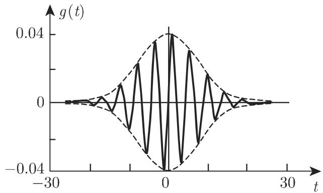

### 15.5 小波变换

#### 15.5.1 信号

如果物体能产生可传播效果，且可数学化描述，比如通过函数或数列，则称其为信号．

信号分析即指通过能代表信号的量来表征信号．从数学上，这意味着：用来描述信号的函数或数列将被映射到另一个函数或数列，由此可清晰掌握信号的典型性质当然，通过这类映射，也会丢失一些信息

信号分析的逆过程，即原始信号的重建，称为信号合成．

信号分析和信号合成的关系，可通过傅里叶变换的例子较好地体现：信号 $f ( t )$ (t 表示时间）用频率 $\omega$ 来表征，则公式 (15.143a) 描述信号分析，公式 (15.143b)述信号合成：

$$
F (\omega) = \int_ {- \infty} ^ {\infty} \mathrm{e} ^ {- \mathrm{i} \omega t} f (t) \mathrm{d} t\tag{15.143a}
$$

和

$$
f (t) = \frac {1}{2 \pi} \int_ {- \infty} ^ {\infty} \mathrm{e} ^ {\mathrm{i} \omega t} F (\omega) \mathrm{d} \omega .\tag{15.143b}
$$

#### 15.5.2 小波

傅里叶变换没有定位性能，即如果信号在一个位置发生了变化则傅里叶变换处处发生了变化，不可能“立刻＇识别发生变化的位置．这个情况是基千傅里叶变换把信号分解成了平面波．平面波通过三角函数刻画三角函数在任意长的时间内都以相同周期进行振荡．但对千小波变换，有儿乎可以自由选取的函数心 $\psi ,$ 小波（小局域波）通过平移和伸缩分析信号．

例子见哈尔小波（图 15.28(a)）和墨西哥草帽小波（图 15.28(b)).

A: 哈尔小波：

$$
\psi = \left\{ \begin{array}{l l} {1,} & {0 \leqslant x <   \frac {1}{2},} \\ {- 1,} & {\frac {1}{2} \leqslant t \leqslant 1,} \\ {0,} & {\text {其他}.} \end{array} \right.\tag{15.144}
$$

(b)  
  
(a)

  
15.28

B: 墨西哥草帽小波：

$$
\psi (x) = - \frac {\mathrm{d} ^ {2}}{\mathrm{d} x ^ {2}} \mathrm{e} ^ {- x ^ {2} / 2}\tag{15.145}
$$

$$
= (1 - x ^ {2}) \mathrm{e} ^ {- x ^ {2} / 2}.\tag{15.146}
$$

通常认为，任何函数 $\psi$ 可视为小波，如果函数二次可积，且根据 (15.143a)，其傅里叶变换 $\varPsi ( \omega )$ 生成正的有限积分

$$
\int_ {- \infty} ^ {\infty} \frac {| \varPsi (\omega) |}{| \omega |} \mathrm{d} \omega .\tag{15.147}
$$

关千小波，下述性质和定义非常重要

(1) 对千小波的均值，有

$$
\int_ {- \infty} ^ {\infty} \psi (t) \mathrm{d} t = 0.\tag{15.148}
$$

(2) 下述积分称为小波 $\psi$ 的 阶矩：

$$
\mu_ {k} = \int_ {- \infty} ^ {\infty} t ^ {k} \psi (t) \mathrm{d} t\tag{15.149}
$$

使得 $\mu _ { n } \neq 0$ 的最小正整数 $n$ , 称为小波 $\psi$ 的阶．

·对千哈尔小波 (15.144), $n = 1$ , 对千墨西哥草帽小波 (15.146), $n = 2$

(3) 若对任意 k, 有 $\mu _ { k } = 0$ ，则 $\psi$ 是无限阶的．具有有界支集的小波总是有限阶的．

(4) 阶小波与任何次数 $\leqslant n - 1$ 的多项式正交．

#### 15.5.3 小波变换

对千小波 $\psi ( t )$ ，可形成参数为 $a$ 的曲线族：

$$
\psi_ {a} (t) = \frac {1}{\sqrt {| a |}} \psi \left(\frac {t}{a}\right) \quad (a \neq 0).\tag{15.150}
$$

在 $| a | > 0$ 的情况下，初始函数 $\psi ( t )$ 可压缩当 $a < 0$ 时有一个附加反射，因子 $1 { \Big / } { \sqrt { | a | } }$ 是调整因子．

也可以通过第二个参数 平移函数 $\psi _ { a } ( t )$ ，则生成两参数曲线族：

$$
\psi_ {a, b} = \frac {1}{\sqrt {| a |}} \psi \left(\frac {t - b}{a}\right) \quad (a, b \text {是实数}; \quad a \neq 0).\tag{15.151}
$$

实平移参数 表示一阶矩，而参数 $a$ 给出函数 $\psi _ { a , b } ( t )$ 的偏差．函数 $\psi _ { a , b } ( t )$ 称为联系 $\varsigma$ 波变换的基函数

函数 $f ( t )$ 的小波变换定义为

$$
\mathcal {L} _ {\psi} f (a, b) = c \int_ {- \infty} ^ {\infty} f (t) \psi_ {a, b} (t) \mathrm{d} t = \frac {c}{\sqrt {| a |}} \int_ {- \infty} ^ {\infty} f (t) \psi \left(\frac {t - b}{a}\right) \mathrm{d} t.\tag{15.152a}
$$

对千其逆变换，有

$$
f (t) = c \int_ {- \infty} ^ {\infty} \int_ {- \infty} ^ {\infty} \mathcal {L} _ {\psi} f (t) \psi_ {a, b} (t) \frac {1}{a ^ {2}} \mathrm{d} a \mathrm{d} b,\tag{15.152b}
$$

其中， $c$ 是依赖千特殊小波 $\psi$ 的常数．

·使用哈尔小波 (15.144) ，可给出

$$
\psi \left({\frac {t - b}{a}}\right) = {\left\{ \begin{array}{l l} {1,} & {b \leqslant t <   b + a / 2,} \\ {- 1,} & {b + a / 2 \leqslant t <   b + a,} \\ {0,} & {{\text {其他}}.} \end{array} \right.}
$$

因此

$$
\begin{array}{r l} & {\mathcal {L} _ {\psi} f (a, b) = \frac {1}{\sqrt {| a |}} \left(\int_ {b} ^ {b + a / 2} f (t) \mathrm{d} t - \int_ {b + a / 2} ^ {b + a} f (t) \mathrm{d} t\right)} \\ & {\qquad = \frac {\sqrt {| a |}}{2} \left(\frac {2}{a} \int_ {b} ^ {b + a / 2} f (t) \mathrm{d} t - \frac {2}{a} \int_ {b + a / 2} ^ {b + a} f (t) \mathrm{d} t\right).} \end{array}\tag{15.153}
$$

(15.153) 中给出的值 $\mathcal { L } _ { \psi } f ( a , b )$ 表示在长度为 $\frac { | a | } { 2 }$ 、在 点处连接的两个相邻区间上，函数 f(t) 均值的差．

(1) 二元小波变换在应用中有重要作用．函数

$$
\psi_ {i, j} (t) = \frac {1}{\sqrt {2 ^ {i}}} \psi \left(\frac {t - 2 ^ {i} j}{2 ^ {i}}\right)\tag{15.154}
$$

被作为基函数使用，即通过对一个小波心(t) 进行宽度加倍或减半，以及平移宽度的整数倍生成不同的基函数．

(2) (15.154) 中给出的基函数形成正交系，则称 $\psi ( t )$ 为正交小波．

(3) 多贝西小波具有特别良好的数值性质．它们是正交的具有紧支撑小波，即仅在时间尺度的有界子集上不等千 o. 它们没有闭合表达式（参见 [15.10]).

#### 15.5.4 离散小波变换

15.5.4.1 快速小波变换

积分表达式 (15.152b) 是冗余的，双重积分可用积分和代替而不会丢失信息．在小波变换的实际应用中考虑该思想，我们需要：

(1) 高效的变换算法可引出多尺度分析的概念；

(2) 高效的逆变换算法即根据其小波变换重建信号的高效方式可引出标架的概念

有关这些概念的更多细节可参见 [15.10] [15.1].

小波在诸多不同应用中有巨大成功，比如

．根据测量序列计算物理量；

·模式与语音识别；

．新闻传播中的数据压缩；

都建立在“快速算法＇的基础上．与FFT（快速傅里叶变换，参见第 1288 19.6.4.2)类似可在此处讨论FWT（快速小波变换）．

15.5.4.2 离散哈尔小波变换

哈尔小波变换是一个离散小波变换的例子：值 $f _ { i } ( i = 1 , 2 , \cdots , N )$ 根据信号给出，具体的数值 $d _ { i } \ ( i = 1 , 2 , \cdot \cdot \cdot , N / 2 )$ 可计算：

$$
s _ {i} = \frac {1}{\sqrt {2}} (f _ {2 i - 1} + f _ {2 i}), \quad d _ {i} = \frac {1}{\sqrt {2}} (f _ {2 i - 1} - f _ {2 i}).\tag{15.155}
$$

当把 (15.155) 应用到数值 $s _ { i }$ 中时首先把数值 $d _ { i }$ 存储起来，即在 (15.155) 中，值 $f _ { i }$ 被 $s _ { i }$ 代替继续进行该程序从而最终由

$$
s _ {i} ^ {(n + 1)} = \frac {1}{\sqrt {2}} (s _ {2 i - 1} ^ {(n)} + s _ {2 i} ^ {(n)}), d _ {i} ^ {(n + 1)} = \frac {1}{\sqrt {2}} (s _ {2 i - 1} ^ {(n)} - s _ {2 i} ^ {(n)})\tag{15.156}
$$

形成了分量为 $d _ { i } ^ { ( n ) }$ 的具体向量列．每一个具体向量包含了有关信号性质的信息．

当数值 较大时，离散小波变换收敛千积分小波变换 (15.152a).

#### 15.5.5 加博变换

时域分析是当其频率出现时，对包含频率和时间周期的信号的表征．因此，信号被分成时间段（窗口），且使用傅里叶变换，称为窗口傅里叶变换 $( \mathrm { W F T } )$

应选取窗函数使得仅在窗口中分析信号．加博变换运用窗函数

$$
g (t) = \frac {1}{\sqrt {2 \pi} \sigma} \mathrm{e} ^ {- \frac {t ^ {2}}{2 \sigma^ {2}}} \quad (\text {图} 1 5. 2 9).\tag{15.157}
$$

该选择可解释为：带有“全单位质量”的 $g ( t )$ 集中在点 t=O 处，且窗口的宽度可视为常数（约为加 $2 \sigma )$

  
15.29

则函数 f(t) 的加博变换形如

$$
\mathcal {G} f (\omega , s) = \int_ {- \infty} ^ {\infty} f (t) g (t - s) \mathrm{e} ^ {- \mathrm{i} \omega t} \mathrm{d} t.\tag{15.158}
$$

由此可确定，出现在 时间区间 $[ s - \sigma , s + \sigma ]$ 内主波（基波） $\mathbf { \Pi } ) \mathrm { e } ^ { \mathrm { i } \omega t }$ 的复振幅即在该区间内若有频率 $\omega _ { : }$ 则它有振幅 $\vert \mathcal { G } f ( \omega , s ) \vert$
