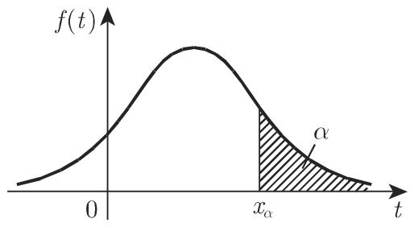

#### 16.2.2 随机变量、分布函数

要应用概率论中的分析方法，变量和函数的概念是很有必要的．

16.2.2.1 随机变量

基本事件集可用随机变量 来描述．随机变量 可视为在实数子集 中随机取值 的量．

包含有限或可数多个不同的值，则称 为离散随机变量．对千连续随机变量， 可能是全体实数或包含一些子区间．随机变量的精确定义见第 106216.2.2.2, 2. ，也存在混合随机变量

A: 在第 1057 页例 中，令基本事件 $A _ { 1 1 } , A _ { 1 2 } , A _ { 2 1 } , A _ { 2 2 }$ 分别取值 1, 2, 3, 4,定义了一个离散随机变量 X.

B: 随机选取的灯泡寿命 是一个连续随机变量．若寿命 等千 ，则发生了基本事件 $T = t$

16.2.2.2 分布函数

1. 分布函数及其性质

随机变量 的分布可由其分布函数

$$
F (x) = P (X \leqslant x), \quad - \infty \leqslant x \leqslant \infty\tag{16.44}
$$

给出，它决定取值千 $( - \infty , x ]$ 的随机变量 的概率，其定义域是全体实数．分布函数具有下述性质：

(1) $F ( - \infty ) = 0 , F ( + \infty ) = 1$

(2) $F ( x )$ 是关千 的非减函数．

(3) $F ( x )$ 是右连续的．

1) 由定义可推出 $P ( X = a ) = F ( a ) - \operatorname* { l i m } _ { x \to a - 0 } F ( x )$

(2) 文献中也经常使用 $F ( x ) = P ( X < x )$ 作为定义．此时

$$
P (X = a) = \lim _ {x \to a + 0} F (x) - F (a).
$$

2. 离散随机变量和连续随机变量的分布函数

a) 离散随机变量 若离散随机变量 的取值为 $x _ { i } \ ( i = 1 , 2 , \cdot \cdot \cdot )$ )，对应的概率为 $P ( X = x _ { i } ) = p _ { i } \ ( i = 1 , 2 , \cdot \cdot \cdot )$ )，则其分布函数为

$$
F (x) = \sum_ {x _ {i} \leqslant x} p _ {i}.\tag{16.45}
$$

b) 连续随机变量 若存在非负函数 f(x)，使得对任何可能在其上考虑积分的区域 $S ,$ 概率 $P ( X \in S )$ 可表示为 $P ( X \in S ) = \int _ { S } f ( x ) \mathrm { d } x$ 则称随机变量 是连续的．函数 $f ( x )$ 即所谓的密度函数连续随机变量在任意给定值 $x _ { i }$ 处的概率为 0,因此我们只需要考虑 取值千有限区间 $[ a , b ]$ 的概率：

$$
P (a \leqslant X \leqslant b) = \int_ {a} ^ {b} f (t) \mathrm{d} t.\tag{16.46}
$$

连续随机变量有处处连续的分布函数：

$$
F (x) = P (X \leqslant x) = \int_ {- \infty} ^ {x} f (t) \mathrm{d} t.\tag{16.47}
$$

f(x) 连续的点处有 $F ^ { \prime } ( x ) = f ( x )$ 成立．

当与积分上限不混淆时，通常用 代替 表示积分变量．

3. 概率的面积解释、分位数

通过引入 (16.47) 中的分布函数和密度函数，概率 $P ( X \leqslant x ) = F ( x )$ 可表示为区间 $- \infty < t \leqslant x$ 上密度函数 f(t) 轴之间的图形面积（图 16.l(a)).

通常给定一个概率值 （经常以％表示），如果

$$
P (X > x) = \alpha\tag{16.48}
$$

成立，对应的横坐标值 $x = x _ { \alpha }$ 称为分位数或 分位数（图 16.l(b) ）．这说明密度函f(t) 下方、 $x _ { \alpha }$ 右侧的图形面积等千 a.

  
(a)

  
(b)  
16.1

文献中也把 $x _ { \alpha }$ 左侧的图形面积作为分位数的定义．在数理统计学中，对千一些较小的 值，如 $\alpha = 5 \%$ 或 $\alpha = 1 \%$ ，也作为笫一类显著性水平或犯笫一类错误的概率．实践中一些重要分布的常用分位数已列表给出（参见第 1456 页表21.16 至第 1463 页表 21.20).

16.2.2.3 期望和方差、切比雪夫不等式

在粗糙描述随机变量 的分布时大多用到的参数是 $\mu$ 表示的期望和 $\sigma ^ { 2 }$ 表示的方差若用力学术语来解释，期望指由密度函数曲线 $f ( x )$ 轴围成的曲面重心的横坐标方差是随机变量 偏离其期望 $\mu$ 的一个度量．

1. 期望

若 $g ( X )$ 是随机变量 的函数，则 $g ( X )$ 也是随机变量，其期望值或期望的定义为

a) 离散情形 $E ( g ( X ) ) = \sum _ { k } g ( x _ { k } ) p _ { k }$ , 若级数 $\sum _ { k = 1 } ^ { \infty } | g ( x _ { k } ) | p _ { k }$ 凇存在

(16.49a)

b) 连续情形 $E ( g ( X ) ) = \int _ { - \infty } ^ { + \infty } g ( x ) f ( x ) \mathrm { d } x ,$ 若 $\int _ { - \infty } ^ { + \infty } | g ( x ) | f ( x ) \mathrm { d } x$ 存在．

(16.49b)

当 $g ( X ) = X$ 时随机变量的期望可定义为

$$
\mu_ {X} = E (X) = \sum_ {k} x _ {k} p _ {k} \quad \text {或} \quad \int_ {- \infty} ^ {+ \infty} x f (x) \mathrm{d} x,\tag{16.50a}
$$

只要对应的级数或积分绝对收敛．根据 (16.49a, 16.49b),

$$
E (a X + b) = a \mu_ {X} + b \quad (a, b \text {是常数})\tag{16.50b}
$$

也成立．当然，随机变量 $g ( X )$ 的期望也可能不存在

2. 阶矩

我们进一步介绍：

a) 阶矩 $E ( X ^ { n } )$

(16.51a)

b) 阶中心矩 $E ( ( X - \mu _ { X } ) ^ { n } )$

(16.51b)

3. 方差和标准差

特别地 阶中心矩称为方差或离差：

$$
E ((X - \mu_ {X}) ^ {2}) = D ^ {2} (X) = \sigma_ {X} ^ {2} = {\left\{ \begin{array}{l l} { \sum_ {k} (x _ {k} - \mu_ {X}) ^ {2} p _ {k}} \\ {{\text {或}}} \\ { \int_ {- \infty} ^ {+ \infty} (x - \mu_ {X}) ^ {2} f (x) \mathrm{d} x,} \end{array} \right.}\tag{16.52}
$$

若公式中的期望存在． $\sigma _ { X }$ 称为标准差．下述关系式成立：

$$
D ^ {2} (X) = \sigma_ {X} ^ {2} = E (X ^ {2}) - \mu_ {X} ^ {2}, D ^ {2} (a X + b) = a ^ {2} D ^ {2} (X).\tag{16.53}
$$

4. 加权平均和算术平均

在离散情形下，期望显然是数值 $x _ { 1 } , \cdots , x _ { n }$ 和概率 $p _ { k } ( k = 1 , \cdots , n )$ 作为权重的加权平均

$$
E (X) = p _ {1} x _ {1} + \dots + p _ {n} x _ {n}.\tag{16.54}
$$

均匀分布的概率是 $p _ { 1 } = p _ { 2 } = \cdot \cdot \cdot = p _ { n } = 1 / n , E ( X )$ 是 $x _ { k }$ 的算术平均：

$$
E (X) = \frac {x _ {1} + x _ {2} + \cdots + x _ {n}}{n}.\tag{16.55}
$$

在连续情形下，在有限区间 $[ a , b ]$ 上连续均匀分布的密度函数是

$$
f (x) = \left\{ \begin{array}{l l} { \frac {1}{b - a},} & {a \leqslant x \leqslant b,} \\ {0,} & {\text {其他}.} \end{array} \right.\tag{16.56}
$$

由此得到

$$
E (X) = \frac {1}{b - a} \int_ {a} ^ {b} x \mathrm{d} x = \frac {a + b}{2}, \quad \sigma_ {X} ^ {2} = \frac {(b - a) ^ {2}}{1 2}.\tag{16.57}
$$

5. 切比雪夫不等式

如果随机变量 的期望为 $\mu ,$ ,标准差为 $\sigma$ 则对任意 $\lambda > 0$ ，有切比雪夫不等式（参见第 39 1.4.2.10):

$$
P (| X - \mu | \geqslant \lambda \sigma) \leqslant \frac {1}{\lambda^ {2}}.\tag{16.58}
$$

也就是说，随机变量 与期望 $\mu$ 的距离不太可能超过标准差的入倍（入很大）．

16.2.2.4 多维随机变量

如果基本事件是指 个随机变量 $X _ { 1 } , \cdots , X _ { n }$ 取 个实值 $x _ { 1 } , \cdots , x _ { n }$ ，则我们定义了一个随机向量 $\underline { { X } } = ( X _ { 1 } , X _ { 2 } , \cdot \cdot \cdot , X _ { n } )$ （也可参见第 1084 页， 16.3.1.1, 4. ）．其相应的分布函数可定义为

$$
F (x _ {1}, \dots , x _ {n}) = P (X _ {1} \leqslant x _ {1}, \dots , X _ {n} \leqslant x _ {n}).\tag{16.59}
$$

若存在函数 $f ( t _ { 1 } , \cdots , t _ { n } )$ ）使得

$$
F (x _ {1}, \dots , x _ {n}) = \int_ {- \infty} ^ {x _ {1}} \dots \int_ {- \infty} ^ {x _ {n}} f (t _ {1}, \dots , t _ {n}) \mathrm{d} t _ {1} \dots \mathrm{d} t _ {n}\tag{16.60}
$$

成立，则随机向量称为连续的．函数 $f ( t _ { 1 } , \cdots , t _ { n } )$ ）称为密度函数，它是非负的．当$x _ { 1 } , \cdots , x _ { n }$ 中的一些变量趋千无穷时，则得到所谓的边际分布．关千边际分布的深入研究和例子可参考相关文献．

随机变量 $X _ { 1 } , \cdots , X _ { n }$ 是独立随机变量，如果

$$
\begin{array}{c} {F (x _ {1}, \dots , x _ {n}) = F _ {1} (x _ {1}) F _ {2} (x _ {2}) \dots F _ {n} (x _ {n}),} \\ {f (x _ {1}, \dots , x _ {n}) = f _ {1} (x _ {1}) f _ {2} (x _ {2}) \dots f _ {n} (x _ {n}).} \end{array}\tag{16.61}
$$
