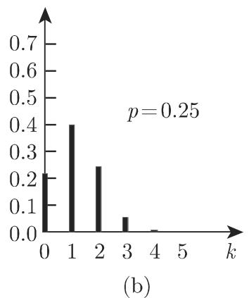
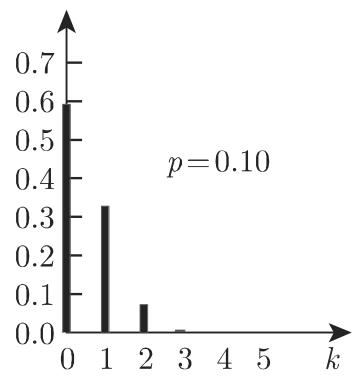
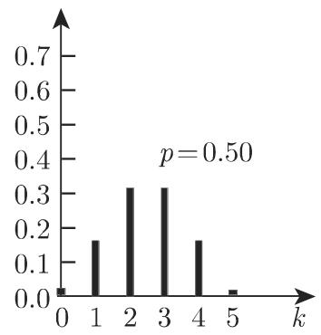

#### 16.2.3 离散分布

1. 两阶段总体和瓮模型

设两阶段总体含有 个元素，即总体包括两类元素一类是具有性质个元素，另一类是不具有性质 $N - M$ 个元素．若对任意选取的元素研究概率$P ( A ) = p$ 和 $P ( { \bar { A } } ) = 1 - p .$ ，则必须区分两种情形：当依次选取 个元素，在选取下一个时，以前已选取的元素要么放回要么不放回．选取的 个元素，其中包含具有性质 个元素，称为样本， 称为样本容量．利用瓮模型对此进行解释．

2. 瓮模型

假设箱子里有一些黑球和白球，问题是：随机摸 个球，其中有 个黑球的概率是多少？若摸到的每个球记下颜色后再放回箱子里，则在摸到的 个球中，黑球的数量 服从二项分布．若摸到的球不再放回且 $n \leqslant M$ 和 $n \leqslant N - M$ ，则黑球的数量服从超几何分布．

16.2.3.1 二项分布

假设试验只有两个可能事件：事件 和事件 ，试验可重复 次且每次试验的伴随概率是 $P ( A ) = p$ 和 $P ( { \bar { A } } ) = 1 - p .$ ，则事件 恰好发生 次的概率是

$$
W _ {p} ^ {n} (k) = \left( \begin{array}{l} n \\ k \end{array} \right) p ^ {k} (1 - p) ^ {n - k} \quad (k = 0, 1, 2, \dots , n).\tag{16.62}
$$

由千每次独立地从总体中选取元素，其概率是

$$
P (A) = \frac {M}{N} = p, \quad P (\bar {A}) = \frac {N - M}{N} = 1 - p = q.\tag{16.63}
$$

因为选取结果互相独立，则前 次选取具有性质 的元素，其余 $n - k$ 次选取具有性质 的元素的概率是 $p ^ { k } ( n - p ) ^ { n - k }$ . 选取顺序无关紧要，因为组合事件有相同的概率，与选取次序无关且事件互不相容，故把

$$
\binom{n}{k} = \frac {n !}{k ! (n - k) !}\tag{16.64}
$$

个相等的数相加得到所求概率．

满足 $P ( X _ { n } = k ) = W _ { p } ^ { n } ( k )$ 的随机变量 $X _ { n }$ 称为参数是 $p$ 的二项分布．

1. 期望和方差

$$
E (X _ {n}) = \mu = n \cdot p.\tag{16.65a}
$$

$$
D ^ {2} (X _ {n}) = \sigma^ {2} = n \cdot p (1 - p).\tag{16.65b}
$$

2. 正态分布对二项分布的逼近

若 $X _ { n }$ 服从二项分布，则

$$
\lim _ {n \to \infty} P \left(\frac {X _ {n} - E (X _ {n})}{D (X _ {n})} \leqslant \lambda\right) = \frac {1}{\sqrt {2 \pi}} \int_ {- \infty} ^ {t} \exp \left(- \frac {t ^ {2}}{2}\right) \mathrm{d} t.\tag{16.65c}
$$

也就是说，如果 很大，且 $1 - p$ 不是太小，则二项分布可用参数为 $\mu _ { X } = E ( X _ { n } ) $ 和 $\sigma ^ { 2 } = D ^ { 2 } ( X _ { n } ) $ 的正态分布较好地逼近（参见第 1069 16.2.4.1). 越接近千0.5, 越大，则近似程度越好，但仅当 $n p > 4$ 和 $n ( 1 - p ) > 4$ 时成立．当 $1 - p$ 很小时二项分布可由泊松分布逼近（参见第 1068 16.2.3.3(16.68)).

3. 递推公式

对千二项分布的实际计算，有下述递推公式：

$$
W _ {p} ^ {n} (k + 1) = \frac {n - k}{k + 1} \cdot \frac {p}{q} \cdot W _ {p} ^ {n} (k).\tag{16.65d}
$$

4. 服从二项分布的随机变量之和

若随机变量 $X _ { n }$ 和 $X _ { m }$ 分别服从参数为 $n , p$ 和 $m , p$ 的二项分布，则随机变量 $X = X _ { n } + X _ { m }$ 也服从参数为 $n + m , p$ 的二项分布．

16.2(a), (b), (c) 给出了参数为 $n = 5 , p = 0 . 5 , 0 . 2 5$ 0.1 的三个二项分布图形．由千二项系数是对称的，当 $p = q = 0 . 5$ 时，分布是对称的． 偏离 0.5远分布的对称性越弱

  
(a)

  
16.2

  
(c)

16.2.3.2 超几何分布

与二项分布相同考虑含有 个元素的两阶段总体，即总体包括两类元素：类是具有性质 个元素，另一类是不具有性质 的 $N - M$ 个元素与二项分布相反，在摸下一个球之前，从瓮模型中已摸到的球不再放回．

在摸到的 个球中，有 个黑球的概率是

$$
P (X = k) = W _ {M, N} ^ {n} (k) = \frac {\binom{M}{k} \binom{N - M}{n - k}}{\binom{N}{n}},\tag{16.66a}
$$

其中

$$
0 \leqslant k \leqslant n, \quad k \leqslant M, \quad n - k \leqslant N - M.\tag{16.66b}
$$

若 $n \leqslant M$ 和 $n \leqslant N - M$ 也成立，则分布式形如 (16.66a) 的随机变量 称为超几何分布．

1. 超几何分布的期望和方差

$$
\mu = E (X) = \sum_ {k = 0} ^ {n} k \frac {\left( \begin{array}{l} M \\ k \end{array} \right) \left( \begin{array}{l} N - M \\ n - k \end{array} \right)}{\left( \begin{array}{l} N \\ k \end{array} \right)} = n \frac {M}{N},\tag{16.67a}
$$

$$
\begin{array}{l} \sigma^ {2} = D ^ {2} (X) = E \left(X ^ {2}\right) - [ E (X) ] ^ {2} = \sum_ {k = 0} ^ {n} k ^ {2} \frac {\binom {M} {k} \binom {N - M} {n - k}}{\binom {N} {k}} - \left(n \frac {M}{N}\right) ^ {2} \\ = n \frac {M}{N} \left(1 - \frac {M}{N}\right) \frac {N - n}{N - 1}. \end{array} \tag {16.67}
$$

2. 递推公式

$$
W _ {M, N} ^ {n} (k + 1) = \frac {(n - k) (M - k)}{(k + 1) (N - M - n + k + 1)} W _ {M, N} ^ {n} (k).\tag{16.67c}
$$

16.3 (a), (b), (c) 给出了当 $N = 1 0 0 , n = 5$ 时， $M = 5 0 , 2 5$ 10 三种情形下的超几何分布，分别对应千图 16.2 (a), (b), (c) $p = 0 . 5 , 0 . 2 5$ 0.1 的情形．这些例子中二项分布和超儿何分布之间无明显区别．如果 $N - M$ 也比 大很多，则超儿何分布可由二项分布很好地逼近，二项分布的参数见 (16.63).

  
(a)

  
(b)  
16.3

  
(c)

16.2.3.3 泊松分布

若随机变量 的可能取值是非负整数，且概率为

$$
P (X = k) = \frac {\lambda^ {k}}{k !} \mathrm{e} ^ {- \lambda} \quad (k = 0, 1, 2, \dots ; \lambda > 0),\tag{16.68}
$$

则称 服从参数为入的泊松分布．

1. 泊松分布的期望和方差

$$
E (X) = \lambda ,\tag{16.69a}
$$

$$
D ^ {2} (X) = \lambda .\tag{16.69b}
$$

2. 服从泊松分布的独立随机变量之和

若随机变量 $X _ { 1 }$ 和凡 $X _ { 2 }$ 互独立，且分别服从参数为 $\lambda _ { 1 }$ 和 $\lambda _ { 2 }$ 的泊松分布，则随机变量 $X = X _ { 1 } + X _ { 2 }$ 也服从参数为 $\lambda = \lambda _ { 1 } + \lambda _ { 2 }$ 的泊松分布．

3. 递推公式

$$
P (X = k + 1) = \frac {\lambda}{k + 1} P (X = k).\tag{16.69c}
$$

4. 泊松分布和二项分布的联系

对千参数为 $n , p$ 的二项分布，当 $n \longrightarrow \infty , p ( p \longrightarrow 0 )$ 随着 变化，使得 $n p = \lambda =$ 常数时，其极限即为泊松分布，即对满足 $\lambda = n p$ 的大的 和小的 ，泊松分布是二项 $p ,$ 分布的良好逼近．实际情况中，由千泊松分布更易千计算，当 $p \leqslant 0 . 0 8$ 和 $n \geqslant 1 5 0 0 p$ 时，即使用此公式．第 1456 页表 21.16 列出了泊松分布值．图 16.4 (a), (b), (c)出了参数为 $\lambda = n p = 2 . 5 , 1 . 2 5$ 0.5 的三个泊松分布图，分别与图 16.2 和图 16.3中的参数相对应．

  
(a)

  
16.4

  
(c)

5. 应用

连续情形下点状不连续事件独立发生的次数通常可用泊松分布来描述，比如特定时间段内到商店的顾客人数，一本书中出现印刷错误的个数，放射性衰变率等．
