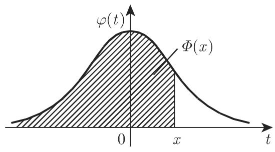
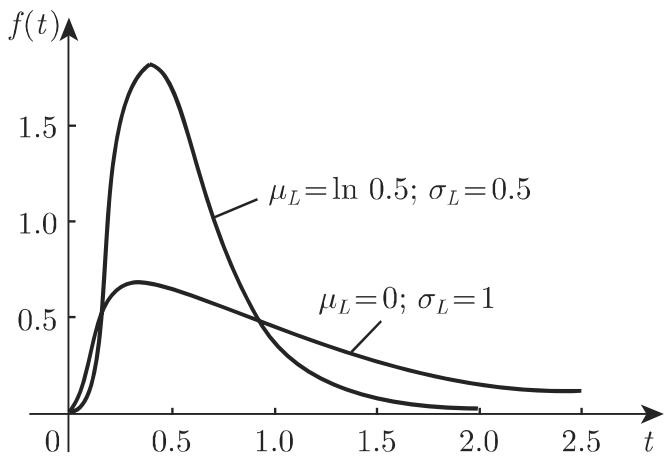
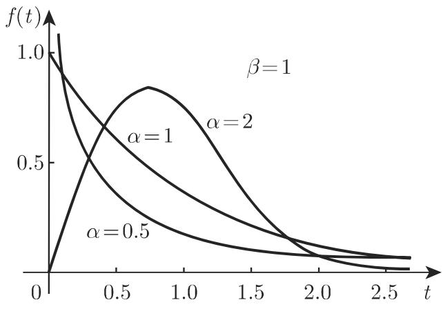
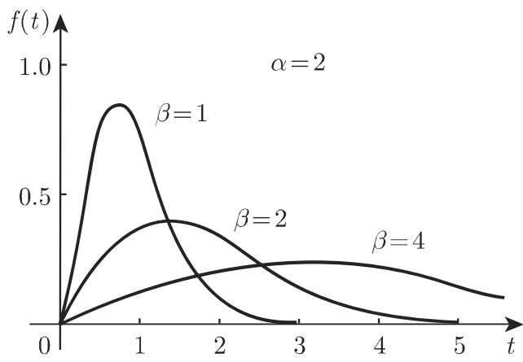
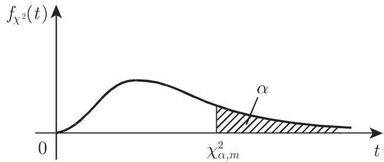
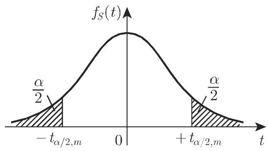

#### 16.2.4 连续分布

16.2.4.1 正态分布

1. 分布函数和密度函数

随机变量 称为服从正态分布，如果其分布函数是

$$
P (X \leqslant x) = F (x) = \frac {1}{\sigma \sqrt {2 \pi}} \int_ {- \infty} ^ {x} \mathrm{e} ^ {- \frac {(t - \mu) ^ {2}}{2 \sigma^ {2}}} \mathrm{d} t.\tag{16.70a}
$$

也称为正态变量，此分布也称为参数为( $( \mu , \sigma ^ { 2 } )$ 的正态分布．函数

$$
f (t) = \frac {1}{\sigma \sqrt {2 \pi}} \mathrm{e} ^ {- \frac {(t - \mu) ^ {2}}{2 \sigma^ {2}}}\tag{16.70b}
$$

是正态分布的密度函数，它在 $t = \mu$ 处取得最大值，在 $\mu \pm \sigma$ 处有拐点（参见第 94(2.59) 和图 16.5(a)).

  
(a)

  
(b)  
16.5

2. 期望和方差

正态分布的期望和方差分别是其参数 $\mu$ 和 $\sigma ^ { 2 }$ ，即

$$
E (X) = \frac {1}{\sigma \sqrt {2 \pi}} \int_ {- \infty} ^ {+ \infty} x \mathrm{e} ^ {- \frac {(x - \mu) ^ {2}}{2 \sigma^ {2}}} \mathrm{d} x = \mu ,\tag{16.71a}
$$

$$
D ^ {2} (X) = E [ (X - \mu) ^ {2} ] = \frac {1}{\sigma \sqrt {2 \pi}} \int_ {- \infty} ^ {+ \infty} (x - \mu) ^ {2} \mathrm{e} ^ {- \frac {(x - \mu) ^ {2}}{2 \sigma^ {2}}} \mathrm{d} x = \sigma^ {2}.\tag{16.71b}
$$

若随机变量 $X _ { 1 }$ 和凡 $X _ { 2 }$ 互独立，且分别服从参数为 $\mu _ { 1 } , \sigma _ { 1 }$ 和 $\mu _ { 2 } , \sigma _ { 2 }$ 的正态分布，则随机变量 $X = k _ { 1 } X _ { 1 } + k _ { 2 } X _ { 2 } ( k _ { 1 } , k _ { 2 }$ 为实常数）也服从正态分布，其参数为$\mu = k _ { 1 } \mu _ { 1 } + k _ { 2 } \mu _ { 2 } , \sigma = \sqrt { k _ { 1 } \sigma _ { 1 } ^ { 2 } + k _ { 2 } \sigma _ { 2 } ^ { 2 } }$

(16.70a) 式进行变量代换 $\tau = \frac { t - \mu } { \sigma }$ ，则对一般正态分布函数值的计算可转化为 (0, 1) 正态分布函数值的计算， $( 0 , 1 )$ 正态分布也称为标准正态分布．因此，正态变量的概率 $P ( a \leqslant X \leqslant b )$ 可用标准正态分布的分布函数 $\varPhi ( x )$ 表示：

$$
P (a \leqslant X \leqslant b) = \Phi \left(\frac {b - \mu}{\sigma}\right) - \Phi \left(\frac {a - \mu}{\sigma}\right).\tag{16.72}
$$

16.2.4.2 标准正态分布、高斯误差函数

1. 分布函数和密度函数

(16.70a) 式中，当 $\mu = 0 , \sigma ^ { 2 } = 1$ 时即得到所谓标准正态分布的分布函数

$$
P (X \leqslant x) = \varPhi (x) = \frac {1}{\sqrt {2 \pi}} \int_ {- \infty} ^ {x} \mathrm{e} ^ {- \frac {t ^ {2}}{2}} \mathrm{d} t = \int_ {- \infty} ^ {x} \varphi (t) \mathrm{d} t\tag{16.73a}
$$

其密度函数是

$$
\varphi (t) = \frac {1}{\sqrt {2 \pi}} \mathrm{e} ^ {- \frac {t ^ {2}}{2}},\tag{16.73b}
$$

也称为高斯误差曲线（图 16.5(b)).

1458 页表 21.17 列出了标准正态分布函数 $\varPhi ( x )$ 的值，表中只给出了自变量$x > 0$ 时的函数值，当 $x < 0$ 时，函数值可由下式求出：

$$
\Phi (- x) = 1 - \Phi (x).\tag{16.74}
$$

2. 概率积分

积分 $\varPhi ( x )$ 也称为概率积分或高斯误差积分．在文献中，有时也用函数 $\varPhi _ { 0 } ( x )$ 和 $\operatorname { e r f } ( x )$ 表示误差积分，定义如下：

$$
\varPhi_ {0} (x) = \frac {1}{\sqrt {2 \pi}} \int_ {0} ^ {x} \mathrm{e} ^ {- \frac {t ^ {2}}{2}} \mathrm{d} t = \varPhi (x) - \frac {1}{2},\tag{16.75a}
$$

$$
\operatorname{erf} (x) = \frac {2}{\sqrt {\pi}} \int_ {0} ^ {x} \mathrm{e} ^ {- \frac {t ^ {2}}{2}} \mathrm{d} t = 2 \cdot \varPhi_ {0} (\sqrt {2} x).\tag{16.75b}
$$

其中 erf 表示误差函数．

16.2.4.3 对数正态分布

1. 密度函数和分布函数

称连续随机变量 服从参数为 $\mu _ { L }$ 和 $\sigma _ { L } ^ { 2 }$ 的对数正态分布，若 全部取正值，且由

$$
Y = \log X\tag{16.76}
$$

定义的随机变量 服从期望为 $\mu _ { L }$ 和方差为 $\sigma _ { L } ^ { 2 }$ 的正态分布（参见第 1071 b)).因此，随机变量 有密度函数

$$
f (t) = \left\{ \begin{array}{l l} 0, & t \leqslant 0, \\ \frac {\log \mathrm{e}}{t \sigma_ {L} \sqrt {2 \pi}} \exp \left(- \frac {(\log t - \mu_ {L}) ^ {2}}{2 \sigma_ {L} ^ {2}}\right), & t > 0. \end{array} \right.\tag{16.77a}
$$

其分布函数为

$$
F (x) = \left\{ \begin{array}{l l} 0, & x \leqslant 0, \\ \frac {1}{\sigma_ {L} \sqrt {2 \pi}} \int_ {- \infty} ^ {\log x} \exp \left(- \frac {(t - \mu_ {L}) ^ {2}}{2 \sigma_ {L} ^ {2}}\right) \mathrm{d} t, & x > 0. \end{array} \right.\tag{16.77b}
$$

实际应用中主要使用自然对数或常用对数．

2. 期望和方差

使用自然对数可得到对数正态分布的期望和方差为

$$
\mu = \exp \left(\mu_ {L} + \frac {\sigma_ {L} ^ {2}}{2}\right), \quad \sigma^ {2} = (\exp \sigma_ {L} ^ {2} - 1) \exp (2 \mu_ {L} + \sigma_ {L} ^ {2}).\tag{16.78}
$$

3.

a) 对数正态分布的密度函数处处连续，且只对正的自变量取正值．图 16.6出了 $\mu _ { L }$ 和 $\sigma _ { L }$ 取不同值的对数正态分布密度函数图，此处使用了自然对数．

  
16.6

b) $\mu _ { L }$ 和 $\sigma _ { L } ^ { 2 }$ 不是对数正态随机变量 本身的期望和方差，而是变量 $Y = \log X$ 的期望和方差，但 $\mu$ 和 $\sigma ^ { 2 }$ 与随机变量 的期望和方差 (16.78) 式是一致的．

c) 对数正态分布的分布函数值 $F ( x )$ 可通过标准正态分布的分布函数 $\varPhi ( x )$ 计算（参见 (16.73a)），公式如下：

$$
F (x) = \Phi \left(\frac {\log x - \mu_ {L}}{\sigma_ {L}}\right).\tag{16.79}
$$

d) 对数正态分布经常应用千经济学、技术、生物过程中的寿命分析．

e) 正态分布可用千大量独立随机变量的加法叠加，对数正态分布可用千大量独立随机变量的乘法叠加．

16.2.4.4 指数分布

1. 密度函数和分布函数

称连续随机变量 服从参数为 $\lambda \ ( \lambda > \ 0 )$ 的指数分布，如果其密度函数是（图 16.7)

$$
f (t) = \left\{ \begin{array}{l l} 0, & t <   0, \\ \lambda \mathrm{e} ^ {- \lambda t}, & t \geqslant 0. \end{array} \right.\tag{16.80a}
$$

因此其分布函数为

$$
F (x) = \int_ {- \infty} ^ {x} f (t) \mathrm{d} t = \left\{ \begin{array}{l l} 0, & x <   0, \\ 1 - \mathrm{e} ^ {- \lambda x}, & x \geqslant 0. \end{array} \right.\tag{16.80b}
$$

  
16.7

2. 期望和方差

$$
\mu = \frac {1}{\lambda}, \quad \sigma^ {2} = \frac {1}{\lambda^ {2}}.\tag{16.81}
$$

下述问题常用指数分布描述：电话的通话时间，放射性粒子的寿命，某些过程中机器在两次故障之间的工作时间，灯泡或某建筑构件的寿命等．

16.2.4.5 韦布尔分布

1. 密度函数和分布函数

称连续随机变量 服从参数为 $\alpha$ 和 $\beta \left( \alpha > 0 , \ \beta > 0 \right)$ 的韦布尔分布，如果其密度函数是

$$
f (t) = \left\{ \begin{array}{l l} 0, & t <   0, \\ \frac {\alpha}{\beta} \left(\frac {t}{\beta}\right) ^ {\alpha - 1} \exp \left[ - \left(\frac {t}{\beta}\right) ^ {\alpha} \right], & t \geqslant 0. \end{array} \right.\tag{16.82a}
$$

故其分布函数为

$$
F (x) = \left\{ \begin{array}{l l} 0, & x <   0, \\ 1 - \exp \left[ - \left(\frac {x}{\beta}\right) ^ {\alpha} \right], & x \geqslant 0. \end{array} \right.\tag{16.82b}
$$

2. 期望和方差

$$
\mu = \beta \Gamma \left(1 + \frac {1}{\alpha}\right), \quad \sigma^ {2} = \beta^ {2} \left[ \Gamma \left(1 + \frac {2}{\alpha}\right) - \Gamma^ {2} \left(1 + \frac {1}{\alpha}\right) \right].\tag{16.83}
$$

此处， r(x) 表示 函数（参见第 682 8.2.5, 6.):

$$
\Gamma (x) = \int_ {0} ^ {\infty} t ^ {x - 1} \mathrm{e} ^ {- t} \mathrm{d} t, \quad x > 0.\tag{16.84}
$$

(16.82a) 中， $\alpha$ 是形状参数， $\beta$ 是尺度参数（图 16.8, 16.9).

  
16.8

  
16.9

a) a=l $\lambda = \frac { 1 } { \beta }$ 时，韦布尔分布即为指数分布

b) 引入位置参数 $\gamma ,$ ，韦布尔分布也有三参数形式其分布函数是

$$
F (x) = 1 - \exp \left[ - \left(\frac {x - \gamma}{\beta}\right) ^ {\alpha} \right].\tag{16.85}
$$

c) 韦布尔分布在可靠性理论中特别有用比如它可以极灵活地描述建筑构件的系统寿命

16.2.4.6 $\chi ^ { 2 }$ 分布

1. 密度函数和分布函数

设随机变量 $X _ { 1 } , X _ { 2 } , \cdots , X _ { n }$ 个相互独立的标准正态随机变量，则随机变量

$$
\chi^ {2} = X _ {1} ^ {2} + X _ {2} ^ {2} + \dots + X _ {n} ^ {2}\tag{16.86}
$$

的分布称为自由度 $\chi ^ { 2 }$ 分布．其分布函数用 $F _ { \chi ^ { 2 } } ( x )$ 表示，对应的密度函数用$f _ { \chi ^ { 2 } } ( t )$ 表示．

$$
f _ {\chi^ {2}} (t) = \left\{ \begin{array}{l l} \frac {1}{2 ^ {n / 2} \Gamma \left(\frac {n}{2}\right)} t ^ {\frac {n}{2} - 1} \mathrm{e} ^ {- \frac {t}{2}}, & t > 0, \\ 0, & t \leqslant 0. \end{array} \right.\tag{16.87a}
$$

$$
F _ {\chi^ {2}} (x) = P \left(\chi^ {2} \leqslant x\right) = \frac {1}{2 ^ {n / 2} \Gamma \left(\frac {n}{2}\right)} \int_ {0} ^ {x} t ^ {\frac {n}{2} - 1} \mathrm{e} ^ {- \frac {t}{2}} \mathrm{d} t \quad (x > 0).\tag{16.87b}
$$

2. 期望和方差

$$
E (\chi^ {2}) = n,\tag{16.88a}
$$

$$
D ^ {2} (\chi^ {2}) = 2 n.\tag{16.88b}
$$

3. 独立随机变量之和

若随机变量 $X _ { 1 }$ 和劝 $X _ { 2 }$ 互独立，且分别服从自由度为 的 $\chi ^ { 2 }$ 分布，则随机变量 $X = X _ { 1 } + X _ { 2 }$ 也服从自由度为 $n + m$ 的 $\chi ^ { 2 }$ 分布．

4. 独立正态随机变量之和

如果随机变量 $X _ { 1 } , X _ { 2 } , \cdots , X _ { n }$ 是参数为 (0,CJ') 的独立正态随机变最，则

$$
X = \sum_ {i = 1} ^ {n} X _ {i} ^ {2} \text {有密度函数} f (t) = \frac {1}{\sigma^ {2}} f _ {\chi^ {2}} \left(\frac {t}{\sigma^ {2}}\right).\tag{16.89}
$$

$$
X = \frac {1}{n} \sum_ {i = 1} ^ {n} X _ {i} ^ {2} \text {有密度函数} f (t) = \frac {n}{\sigma^ {2}} f _ {\chi^ {2}} \left(\frac {n t}{\sigma^ {2}}\right).\tag{16.90}
$$

$$
X = \sqrt {\frac {1}{n} \sum_ {i = 1} ^ {n} X _ {i} ^ {2}} \text {有密度函数} f (t) = \frac {2 t}{\sigma^ {2}} f _ {\chi^ {2}} \left(\frac {t ^ {2}}{\sigma^ {2}}\right)\tag{16.91}
$$

．分位数

对千自由度为 $\chi ^ { 2 }$ 分布（图 16.10)，其分位数 $\chi _ { \alpha , m } ^ { 2 }$ （参见第 106216.2.2.2, 3. ）满足

$$
P (X > \chi_ {\alpha , m} ^ {2}) = \alpha .\tag{16.92}
$$

$\chi ^ { 2 }$ 分布的分位数数值可查阅第 1460 页表 21.18.

  
16.10

16.2.4.7 费希尔 $F$ 分布

1. 密度函数和分布函数

若随机变量 $X _ { 1 }$ 和凡 $X _ { 2 }$ 互独立，且分别服从自由度为 $m _ { 1 }$ 和 $m _ { 2 }$ 的 $\chi ^ { 2 }$ 分布，则随机变量

$$
F _ {m _ {1}, m _ {2}} = \frac {X _ {1}}{m _ {1}} \bigg / \frac {X _ {2}}{m _ {2}}\tag{16.93}
$$

的分布是自由度为 $m _ { 1 } , m _ { 2 }$ 的费希尔分布或 分布．其密度函数为

$$
f _ {F} (t) = \left\{ \begin{array}{l l} \left(\frac {m _ {1}}{2}\right) ^ {m _ {1} / 2} \left(\frac {m _ {2}}{2}\right) ^ {m _ {2} / 2} \frac {\Gamma \left(\frac {m _ {1}}{2} + \frac {m _ {2}}{2}\right)}{\Gamma \left(\frac {m _ {1}}{2}\right) \Gamma \left(\frac {m _ {2}}{2}\right)} \frac {t ^ {\frac {m _ {1}}{2} - 1}}{\left(\frac {m _ {1}}{2} t + \frac {m _ {2}}{2}\right) ^ {\frac {m _ {1}}{2} + \frac {m _ {2}}{2}}}, & t > 0, \\ 0, & t \leqslant 0. \end{array} \right.\tag{16.94a}
$$

当 $x \leqslant 0$ 时，有 $F _ { F } ( x ) = P ( F _ { m _ { 1 } , m _ { 2 } } \leqslant x ) = 0 \mathrm { { , } }$ 当 $x > 0$ 时，有

$$
\begin{array}{l} F _ {F} (x) = P (F _ {m _ {1}, m _ {2}} \leqslant x) \\ = \left(\frac {m _ {1}}{2}\right) ^ {m _ {1} / 2} \left(\frac {m _ {2}}{2}\right) ^ {m _ {2} / 2} \frac {\Gamma \left(\frac {m _ {1}}{2} + \frac {m _ {2}}{2}\right)}{\Gamma \left(\frac {m _ {1}}{2}\right) \Gamma \left(\frac {m _ {2}}{2}\right)} \int_ {0} ^ {x} \frac {\left(t ^ {\frac {m _ {1}}{2} - 1} - 1\right) \mathrm{d} t}{\left(\frac {m _ {1}}{2} t + \frac {m _ {2}}{2}\right) ^ {\frac {m _ {1}}{2} + \frac {m _ {2}}{2}}} \cdot \end{array}\tag{16.94b}
$$

2. 期望和方差

$$
E (F _ {m _ {1}, m _ {2}}) = \frac {m _ {2}}{m _ {2} - 2},\tag{16.95a}
$$

$$
D ^ {2} (F _ {m _ {1}, m _ {2}}) = \frac {2 m _ {2} ^ {2} (m _ {1} + m _ {2} - 2)}{m _ {1} (m _ {2} - 2) ^ {2} (m _ {2} - 4)}.\tag{16.95b}
$$

3. 分位数

对千费希尔分布（图 16.11) 的分位数 $t _ { \alpha , m _ { 1 } , m _ { 2 } }$ （参见第 1062 16.2.2.2, 3.),其数值可查阅第 1461 页表 21.19.

  
16.11

16.2.4.8 分布

1. 密度函数和分布函数

如果随机变量 (0, 1) 正态随机变量， 相互独立，且服从自由度为$m = n - 1$ 的 $\chi ^ { 2 }$ 分布，则随机变量

$$
T = \frac {X}{\sqrt {Y / m}}\tag{16.96}
$$

的分布称为自由度 的学生 分布或 分布．其分布函数用 $F _ { S } ( x )$ 表示，对应的密度函数用 $f _ { S } ( t )$ 表示．

$$
f _ {S} (t) = \frac {1}{\sqrt {m \pi}} \frac {\Gamma \left(\frac {m + 1}{2}\right)}{\Gamma \left(\frac {m}{2}\right)} \frac {1}{\left(1 + \frac {t ^ {2}}{m}\right) ^ {\frac {m + 1}{2}}}.\tag{16.97a}
$$

$$
F _ {S} (x) = P (T \leqslant x) = \int_ {- \infty} ^ {x} f _ {S} (t) \mathrm{d} t = \frac {1}{\sqrt {m \pi}} \frac {\Gamma \left(\frac {m + 1}{2}\right)}{\Gamma \left(\frac {m}{2}\right)} \int_ {- \infty} ^ {x} \frac {\mathrm{d} t}{\left(1 + \frac {t ^ {2}}{m}\right) ^ {\frac {m + 1}{2}}}.\tag{16.97b}
$$

2. 期望和方差

$$
E (T) = 0 \quad (m > 1),\tag{16.98a}
$$

$$
D ^ {2} (T) = \frac {m}{m - 2} \quad (m > 2).\tag{16.98b}
$$

3. 分位数

分布的分位数 $t _ { \alpha , m }$ 和 $t _ { \alpha / 2 , m }$ （图 16.12(a), (b) ）满足

$$
P (T > t _ {\alpha , m}) = \alpha\tag{16.99a}
$$

或

$$
P (| T | > t _ {\alpha / 2, m}) = \alpha .\tag{16.99b}
$$

  
(a)

  
(b)  
16.12

其数值由第 1463 页表 21.20 给出．

由戈赛特 (Gosset) 以笔名“学生”发表的 分布，适用千当样本容量 较小，且只能给出均值和标准差的估计的情形．标准差 (16.98b) 不再依赖千从中取出样本的总体标准差．
