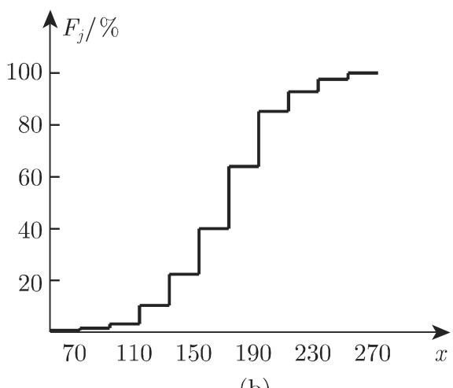

#### 16.3.2 描述性统计学

16.3.2.1 对给定数据的统计汇总与分析

为了对某元素的性质进行统计描述，该性质必须用随机变量 来刻画．性质个测量或观察值 $x _ { i }$ 通常是统计调查的起点，用千探寻 的分布的某些参数或 的分布本身．

如果试验或测量在相同条件下可重复进行无数次，则每个容量为 的测量序列可视为无限总体的随机样本．测量序列的容量 可以很大，统计调查过程如下．

1. 规则、主要记法

测量或观察值 $x _ { i }$ 记录在规则表中．

2. 区间或分组

把样本的 个测量数据 $x _ { i } ~ ( i = 1 , 2 , \cdot \cdot \cdot , n )$ 分到 个子区间，即所谓的分组，或者是长度或宽度为 的等组距分组，通常分成 10\~20 组．

3. 频率和频率分布

绝对频率 $h _ { j } \ ( j = 1 , 2 , \cdot \cdot \cdot , k )$ 指落在给定区间 $\Delta x _ { j }$ 的数据（占有数）的个数$h _ { j }$ . 比值 $h _ { j } / n$ （用％表示）称为相对频率．如果值 $h _ { j } / n$ 用矩形表示分组，则得到给定频率分布的图形表示，也称为直方图（图 16.13(a)). $h _ { j } / n$ 可看作概率或密度函f(x) 的实证数值．

  
(a)

  
(b)  
16.13

4. 累计频率

把绝对频率或相对频率加起来得到累计绝对频率或累计相对频率

$$
F _ {j} = \frac {h _ {1} + h _ {2} + \cdots + h _ {j}}{n} \% (j = 1, 2, \dots , k).\tag{16.125}
$$

16.13(b) 给出了实证分布函数图，可看作未知基本分布函数的近似．

·设某研究进行了 $n = 1 2 5$ 次测量，结果分散千区间 [50, 270] 内，把区间分组为组数 $k = 1 1$ 、长度 $h = 2 0$ 是合理的．频率表见表 16.3.

16.3 频率表

<table><tr><td>分组</td><td> $h_i$ </td><td> $(h_i/n)/\%$ </td><td> $F_i/\%$ </td></tr><tr><td>50—70</td><td>1</td><td>0.8</td><td>0.8</td></tr><tr><td>71—90</td><td>1</td><td>0.8</td><td>1.6</td></tr><tr><td>91—110</td><td>2</td><td>1.6</td><td>3.2</td></tr><tr><td>111—130</td><td>9</td><td>7.2</td><td>10.4</td></tr><tr><td>131—150</td><td>15</td><td>12.0</td><td>22.4</td></tr><tr><td>151—170</td><td>22</td><td>17.6</td><td>40.0</td></tr><tr><td>171—190</td><td>30</td><td>24.0</td><td>64.0</td></tr><tr><td>191—210</td><td>27</td><td>21.6</td><td>85.6</td></tr><tr><td>211—230</td><td>9</td><td>7.2</td><td>92.8</td></tr><tr><td>231—250</td><td>6</td><td>4.8</td><td>97.6</td></tr><tr><td>251—270</td><td>3</td><td>2.4</td><td>100.0</td></tr></table>

16.3.2.2 统计参数

在总结和分析了 16.3.2.1 给定的样本数据后可推知下述参数是随机变量分布

参数的近似值

1. 均值

直接使用所有的样本测量数据，样本均值是

$$
\bar {x} = \frac {1}{n} \sum_ {i = 1} ^ {n} x _ {i}.\tag{16.126a}
$$

使用均值 $\boldsymbol { \bar { x } } _ { j }$ 和分组频数 $h _ { j }$ ，则

$$
\bar {x} = \frac {1}{n} \sum_ {j = 1} ^ {k} h _ {j} \bar {x} _ {j}.\tag{16.126b}
$$

2. 方差

直接使用所有测量数据，样本方差是

$$
s ^ {2} = \frac {1}{n - 1} \sum_ {i = 1} ^ {n} (x _ {i} - \bar {x}) ^ {2}.\tag{16.127a}
$$

使用均值 $\bar { x } _ { j }$ 和分组频数 $h _ { j }$ ，则

$$
s ^ {2} = \frac {1}{n - 1} \sum_ {j = 1} ^ {k} h _ {j} (\bar {x} _ {j} - \bar {x}) ^ {2}.\tag{16.127b}
$$

组中点 $u _ { j }$ （对应区间的中点）也经常用来代替 $\boldsymbol { \bar { x } } _ { j }$

3. 中位数

分布的分位数元定义为

$$
P (X <   \tilde {x}) = \frac {1}{2}.\tag{16.128a}
$$

分位数可能并非唯一确定的点．样本分位数是

$$
\tilde {x} = \left\{ \begin{array}{l l} x _ {m + 1}, & n = 2 m + 1, \\ \frac {x _ {m + 1} + x _ {m}}{2}, & n = 2 m. \end{array} \right.\tag{16.128b}
$$

4. 极差

$$
R = x _ {\mathrm{max}} - x _ {\mathrm{min}}.\tag{16.129}
$$

5. 众数或最可能值

它指以最大频率出现的数值，用 表示．
