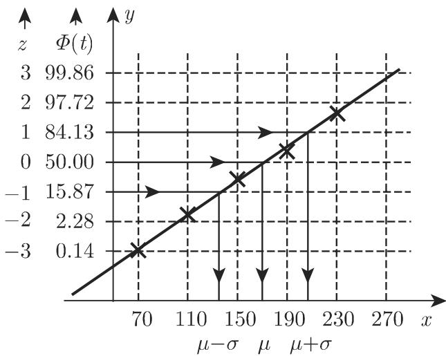
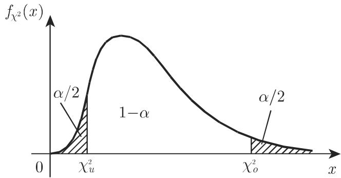

#### 16.3.3 重要检验

数理统计学的一个根本问题就是从样本中推断关千总体的结论．有两类最重要的问题如下．

(1) 分布类型已知欲估计其参数分布的特征通常可由参数 $\mu$ 和 $\sigma ^ { 2 }$ 较好地表示（此处， $\mu$ 是期望的精确值， $\sigma ^ { 2 }$ 是方差的精确值），因此一个至关重要的问题是，如何根据样本较好地估计参数？

(2) 关千参数的假设已知，欲检验其是否正确．最常出现的问题是：

a) 期望值是否等千一个已知数？

b) 两个总体的期望是否相等？

c) 能否用参数为 $\mu$ 和 $\sigma ^ { 2 }$ 的随机变量的分布拟合一个已知分布等？

正态分布在观察和测量中极其重要，下面讨论对正态分布的拟合优度检验．其基本思想也适用于其他分布．

16.3.3.1 对正态分布的拟合优度检验

在数理统计学中有不同的检验方法，用千判断样本数据是否来自千正态分布．此处讨论基千正态概率纸的图形检验和基千 $\chi ^ { 2 }$ 分布的数值检验 $( ^ { 6 6 } \chi ^ { 2 }$ 检验”)．

1. 使用概率纸进行拟合优度检验

a) 概率纸的原理 在直角坐标系中， 轴采用等距刻度， $y$ 轴的刻度由下述方式得到：对 $z$ 等距分割但刻度为

$$
y = \varPhi (z) = \frac {1}{\sqrt {2 \pi}} \int_ {- \infty} ^ {z} \mathrm{e} ^ {- \frac {t ^ {2}}{2}} \mathrm{d} t.\tag{16.130}
$$

若随机变量 服从期望为 $\mu$ 和方差为 $\sigma ^ { 2 }$ 正态分布，则对千其分布函数（参见第 1070 16.2.4.2) ，有

$$
F (x) = \Phi \left(\frac {x - \mu}{\sigma}\right) = \Phi (z),\tag{16.131a}
$$

即

$$
z = \frac {x - \mu}{\sigma}\tag{16.131b}
$$

成立，故 $x$ 之间有线性关系，满足

<table><tr><td>z</td><td>x</td></tr><tr><td>0</td><td>μ</td></tr><tr><td>1</td><td>μ+σ</td></tr><tr><td>-1</td><td>μ-σ</td></tr></table>

(16.131c)

b) 概率纸的应用 对千样本数据，把根据 (16.125) 计算的累计相对频率作为点的纵坐标，组上界作为横坐标，并把对应点描绘到概率纸上．若这些点大致落在一条直线上（偏差很小），则随机变量可视为正态随机变量（图 16.14).

  
16.14

正如从图 16.14 中所看到的，表 16.3 中的数据对应正态分布．进一步可得到$\mu \approx 1 7 6 , \sigma \approx 3 7 . 5$ （由 轴上 和土 对应的 值得到）．

如果关千 轴的刻度是等距的，则累计相对频率值 $F _ { i }$ 更容易描绘到概率纸上，这也意味着对千纵坐标的非等距刻度．

2. $\chi ^ { 2 }$ 拟合优度检验

欲检验随机变量 是否服从正态分布（参见第 1070 16.2.4.2)，可把范围分成 组，第 $( j = 1 , 2 , \cdots , k )$ 的上限用 $\xi _ { j }$ 表示．令 $p _ { j }$ 落在第组的“理论＇概率，即

$$
p _ {j} = F (\xi_ {j}) - F (\xi_ {j - 1}),\tag{16.132a}
$$

其中， $F ( x )$ 的分布函数 $( j = 1 , 2 , \cdots , k ; \xi _ { 0 }$ 是第一组的下限，且 $F ( \xi _ { 0 } ) = 0 )$ 巾千假定 是正态变量，则

$$
F (\xi_ {j}) = \Phi \left(\frac {\xi_ {j} - \mu}{\sigma}\right)\tag{16.132b}
$$

一定成立，其中 $\varPhi \left( x \right)$ 是标准正态分布的分布函数（参见第 1070 16.2.4.2)．总体的参数 $\mu$ 和 $\sigma ^ { 2 }$ 通常是未知的故用元和 $s ^ { 2 }$ 作为其近似值．对 的范围进行分解，使每一组的期望频数大千 5, 即若样本容量为 $n ,$ 则 $n p _ { j } \geqslant 5$ . 对千容量为样本 $( x _ { 1 } , x _ { 2 } , \cdots , x _ { n } )$ ），计算其相应的频数 $h _ { j }$ （根据上述给定的分组），则随机变量

$$
\chi_ {S} ^ {2} = \sum_ {j = 1} ^ {k} \frac {(h _ {j} - n p _ {j}) ^ {2}}{n p _ {j}}\tag{16.132c}
$$

近似服从 $\chi ^ { 2 }$ 分布．若 $\mu$ 和 $\sigma ^ { 2 }$ 已知，则 $\chi ^ { 2 }$ 分布的自由度 $m = k - 1$ ; 若 $\mu$ 和 $\sigma ^ { 2 }$ 其中之一需要根据样本进行估计，则 $m = k - 2$ 若二者都需要根据元和 $s ^ { 2 }$ 估计，则 $m = k - 3$

如果随机变量 服从正态分布（近似 $\chi ^ { 2 }$ 检验），对千给定的统计量显著性水和自由度 $m$ ，检验在千对样本的试验 $\chi _ { S } ^ { 2 }$ 和 1460 页表 21.18 中相应的 $\chi _ { \alpha ; m } ^ { 2 }$ 进行比较

若确定了显著性水平 $\alpha ,$ 并由 1460 页表 21.18 中得到了对应 $\chi ^ { 2 }$ 分布的分位数 $\chi _ { \alpha ; k - i } ^ { 2 } ( i$ 依赖千未知参数的个数），则 $P ( \chi _ { S } ^ { 2 } \geqslant \chi _ { \alpha ; k - i } ^ { 2 } ) = \alpha$ 成立．比较 (16.132c)式的 $\chi _ { S } ^ { 2 }$ 值和上述分位数，若

$$
\chi_ {S} ^ {2} <   \chi_ {\alpha ; k - i} ^ {2}\tag{16.132d}
$$

成立，则接受样本来自千正态分布的假设．该检验也称为 $\chi ^ { 2 }$ 拟合优度检验．

·下述 $\chi ^ { 2 }$ 检验基千第 1087 16.3.2.1 的实例．样本容量 $n = 1 2 5$ 且均值$\bar { x } = 1 7 6 . 3 2$ 方差 $s ^ { 2 } = 3 6 . 7 0$ 它们可作为总体未知参数 $\mu$ 和 $\sigma ^ { 2 }$ 的近似值．根(16.132a) (16.132b) 进行计算后，再根据 (16.132c) 确定检验统计量 $\chi _ { S } ^ { 2 }$ ，所得到的数据见表 16.4.

16.4 $\chi ^ { 2 }$ ；检验

<table><tr><td> $\xi_j$ </td><td> $h_j$ </td><td> $\frac{\xi_j - \mu}{\sigma}$ </td><td> $\Phi\left(\frac{\xi_j - \mu}{\sigma}\right)$ </td><td> $p_j$ </td><td> $np_j$ </td><td> $\frac{(h_j - np_j)^2}{np_j}$ </td></tr><tr><td>70</td><td>1</td><td>-2.90</td><td>0.0019</td><td>0.0019</td><td>0.2375</td><td rowspan="4">0.00005</td></tr><tr><td>90</td><td>1</td><td>-2.35</td><td>0.0094</td><td>0.0075</td><td>0.9375</td></tr><tr><td>110</td><td>2</td><td>-1.81</td><td>0.0351</td><td>0.0257</td><td>3.2125</td></tr><tr><td>130</td><td>9</td><td>-1.26</td><td>0.1038</td><td>0.0687</td><td>8.5857</td></tr><tr><td>150</td><td>15</td><td>-0.72</td><td>0.2358</td><td>0.1320</td><td>16.5000</td><td>0.1635</td></tr><tr><td>170</td><td>22</td><td>-0.17</td><td>0.4325</td><td>0.1967</td><td>24.5875</td><td>0.2723</td></tr><tr><td>190</td><td>30</td><td>0.37</td><td>0.6443</td><td>0.2118</td><td>26.4750</td><td>0.4693</td></tr><tr><td>210</td><td>27</td><td>0.92</td><td>0.8212</td><td>0.1769</td><td>22.1125</td><td>1.0803</td></tr><tr><td>230</td><td>9</td><td>1.46</td><td>0.9279</td><td>0.1067</td><td>13.3375</td><td>1.4106</td></tr><tr><td>250</td><td>6</td><td>2.01</td><td>0.9778</td><td>0.0499</td><td>6.2375</td><td rowspan="2">0.0526</td></tr><tr><td>270</td><td>3</td><td>2.55</td><td>0.9946</td><td>0.0168</td><td>2.1000</td></tr><tr><td colspan="6"></td><td> $\chi_S^2=3.4486$ </td></tr></table>

巾最后一列可 $\chi _ { S } ^ { 2 } = 3 . 4 4 8 6$ 因为要求 $n p _ { j } \geqslant 5 ,$ 分组数量从 $k = 1 1$ 减少到$k ^ { * } = k - 4 = 7$ ．为计算理论频率 $n p _ { j }$ , 用样本估计值 $\bar { x }$ 和 $s ^ { 2 }$ 代替总体的 $\mu$ 和产 $\sigma ^ { 2 }$ 故相应 $\chi ^ { 2 }$ 分布的自由度个数减少 2, 临界值为分位数 $\chi _ { \alpha ; k ^ { * } - 1 - 2 } ^ { 2 }$ · 对千 $\alpha = 0 . 0 5$ 根据 1460 页表 21.18 可得到 $\chi _ { 0 . 0 5 ; 4 } ^ { 2 } = 9 . 5$ 因此由不等式 $\chi _ { S } ^ { 2 } < \chi _ { 0 . 0 5 ; 4 } ^ { 2 }$ 成立，假定样本来自千正态分布总体并无异议．

16.3.3.2 样本均值的分布

是连续随机变量．假设可从相应总体中取出任意多组容量为 的样本，

则样本均值也是随机变量 $\bar { X }$ ，并且也是连续的．

1. 样本均值的置信概率

如果 服从参数为 $\mu$ 和 $\sigma ^ { 2 }$ 的正态分布，则 也是参数为 $\mu$ 和 $\sigma ^ { 2 } / n$ 的正态随机变量，即 的密度函数 ${ \bar { f } } ( x )$ 比总体的密度函数 $f ( x )$ 更集中千 $\mu$ 附近．对任意 $\varepsilon > 0 ,$ 有

$$
P (| X - \mu | \leqslant \varepsilon) = 2 \Phi \left(\frac {\varepsilon}{\sigma}\right) - 1, \quad P (| \bar {X} - \mu | \leqslant \varepsilon) = 2 \Phi \left(\frac {\varepsilon \sqrt {n}}{\sigma}\right) - 1\tag{16.133}
$$

成立．因此，当样本容量 增加时，样本均值是 $\mu$ 的良好近似的概率也在增加．

·当 $\varepsilon = \frac { 1 } { 2 } \sigma$ 时由 (16.133) 式得

$$
P \left(| \bar {X} - \mu | \leqslant \frac {1}{2} \sigma\right) = 2 \Phi \left(\frac {1}{2} \sqrt {n}\right) - 1,
$$

16.5 列出了 $n$ 取不同值时所对应的概率值．由表 16.5 可看出，比如，当样本容量 $n = 4 9$ 时，样本均值元与 $\mu$ 之差小千 $\pm \frac { 1 } { 2 } \sigma$ 的概率是 99.95%.

16.5 样本均值的置信水平

<table><tr><td>n</td><td>P(|X̄ - μ| ≤ 1/2 σ)</td></tr><tr><td>1</td><td>38.29%</td></tr><tr><td>4</td><td>68.27%</td></tr><tr><td>16</td><td>95.45%</td></tr><tr><td>25</td><td>98.76%</td></tr><tr><td>49</td><td>99.96%</td></tr></table>

2. 总体服从任意分布时的样本均值分布

若总体服从期望为 $\mu ,$ 方差为 $\sigma ^ { 2 }$ 的任意分布，则随机变量 $\bar { X }$ 也近似服从参数为 $\mu$ 和 $\sigma ^ { 2 } / n$ 的正态分布．该结论基千中心极限定理．

16.3.3.3 均值的置信限

1. 方差 $\varpi ^ { 2 }$ 已知时，均值的置信区间

如果 是参数为 $\mu$ 和 $\sigma ^ { 2 }$ 的随机变量，则根据 16.3.3.2, 近似为参数是 $\mu$ 和$\sigma ^ { 2 } / n$ 的正态随机变量，则通过变量替换

$$
\bar {Z} = \frac {\bar {X} - \mu}{\sigma} \sqrt {n}\tag{16.134}
$$

6可生成近似服从标准正态分布的随机变量 $\bar { Z }$ 因此

$$
P (| \bar {Z} | \leqslant \varepsilon) = \int_ {- \infty} ^ {\varepsilon} \varphi (x) \mathrm{d} x = 2 \Phi (\varepsilon) - 1.\tag{16.135}
$$

若给定显著性水平 $\alpha .$ ，即

$$
P (| \bar {Z} | \leqslant \varepsilon) = 1 - \alpha\tag{16.136}
$$

成立，则 $\varepsilon = \varepsilon ( \alpha )$ 可由 (16.135) 确定，比如，对千标准正态分布，则可由 145821.17 得到由 $| \bar { Z } | \leqslant \varepsilon ( \alpha )$ 和（16.134)，可得关系式

$$
\mu = \bar {x} \pm \frac {\sigma}{\sqrt {n}} \varepsilon (\alpha)\tag{16.137}
$$

成立 (16.137) 中数值 $\bar { x } \pm \frac { \sigma } { \sqrt { n } } \varepsilon ( \alpha )$ 称为期望的置信限，二者之间的区间称为期望值 $\mathbf { \nabla } \cdot \mu$ 的置信区间，其中方差 $\sigma ^ { 2 }$ 已知给定显著性水平为 $\alpha$ 换言之，期望值 $\mu$ 以概位千 (16.137) 的置信限之间

若样本容量足够大，则 $s ^ { 2 }$ 可用来代替 (16.137) 中的 $\sigma ^ { 2 }$ ．当 $n > 1 0 0$ 时可视为大样本，但实际应用时，要视具体问题而定，当 $n > 3 0$ 时也可视为样本充分大．若 不是足够大，则在正态总体分布情形下，运用 分布确定置信限，见(16.140).

2. 方差62未知时，期望的置信区间

若总体近似服从正态分布，且方差 $\sigma ^ { 2 }$ 未知则在 (16.134) 中用样本方差 $s ^ { 2 }$ 代替 $\sigma ^ { 2 }$ ，可得随机变量

$$
T = \frac {\bar {X} - \mu}{s} \sqrt {n},\tag{16.138}
$$

该变量服从自由度为 $m = n - 1$ 分布（参见第 1076 16.2.4.8) ，其中 $n$ 是样本容量若 很大，比如 $n > 1 0 0$ ，则 $T$ 可视为正态随机变量，如同 (16.134) 中的．对千给定的显著性水平 $\alpha ,$ ，有

$$
P (| T | \leqslant \varepsilon) = \int_ {- \varepsilon} ^ {\varepsilon} f _ {t} (x) \mathrm{d} x = P \left(\frac {| \bar {X} - \mu |}{s} \sqrt {n} \leqslant \varepsilon\right) = 1 - \alpha .\tag{16.139}
$$

(16.139) 可得 $\varepsilon = \varepsilon ( \alpha , n ) = t _ { \alpha / 2 ; n - 1 }$ , 其中 $t _ { \alpha / 2 ; n - 1 }$ 是显著性水平为 $\alpha$ 的 t 分布（自由度为 $n - 1 )$ 的分位数（参见第 1463 页表 21.20) ．由 $| T | = t _ { \alpha / 2 ; n - 1 }$ ,推出

$$
\mu = \bar {x} \pm \frac {s}{\sqrt {n}} t _ {\alpha / 2; n - 1},\tag{16.140}
$$

数值元土 $\frac { s } { \sqrt { n } } t _ { \alpha / 2 ; n - 1 }$ 称为总体方差 $\sigma ^ { 2 }$ 未知、显著性水平为 $\alpha$ 时期望值的置信限，位千置信限之间的区间称为置信区间．

．一组样本包含下述 个测晕数据： 0.842, 0.846, 0.835, 0.839, 0.843, 0.838, 可得到 $\bar { x } = 0 . 8 4 0 5$ 和 $s = 0 . 0 0 3 9 4$

若给定显著性水平 $\alpha$ ％或 ％，那么，样本均值元和总体分布期望 $\mu$ 的最大偏差是多少？

(1) $\alpha = 0 . 0 5$ 1463 页表 21.20 可知 $t _ { \alpha / 2 ; 5 } = 2 . 5 7$ 因此 $| \bar { X } - \mu | \leqslant 2 . 5 7$ $0 . 0 0 3 9 4 / \sqrt { 6 } = 0 . 0 0 4 2$ 故样本均值 $\bar { x } = 0 . 8 4 0 5$ 和期望值 $\mu$ 之差以 95% 的可能性小千士0.0042.

(2) $\alpha = 0 . 0 1 \colon { t _ { \alpha / 2 ; 5 } } = 4 . 0 3 , | \bar { X } - \mu | \leqslant 4 . 0 3 \cdot 0 . 0 0 3 9 4 / \sqrt { 6 } = 0 . 0 0 6 5$ ，即样本均值元和 $\mu$ 之差以 99% 的可能性小千土0.0065.

16.3.3.4 方差的置信区间

若随机变量 服从参数为 $\mu$ 和 $\sigma ^ { 2 }$ 的正态分布，则随机变量

$$
\chi^ {2} = (n - 1) \frac {s ^ {2}}{\sigma^ {2}}\tag{16.141}
$$

服从自由度为 $m = n - 1$ 的 $\chi ^ { 2 }$ 分布，其中 是样本容量， $s ^ { 2 }$ 是样本方差． $f _ { \chi ^ { 2 } } \left( x \right)$ 表示 $\chi ^ { 2 }$ 分布的密度函数，见图 16.15. 由图可知

$$
P (\chi^ {2} <   \chi_ {u} ^ {2}) = P (\chi^ {2} > \chi_ {o} ^ {2}) = \frac {\alpha}{2}.\tag{16.142}
$$

千是，由 $\chi ^ { 2 }$ 分布的分位数表（参见第 1460 页表 21.18) 可给出

$$
\chi_ {u} ^ {2} = \chi_ {1 - \alpha / 2; n - 1} ^ {2}, \quad \chi_ {o} ^ {2} = \chi_ {\alpha / 2; n - 1} ^ {2}.\tag{16.143}
$$

根据 (16.141) 可推出，当显著性水平为 时，总体未知方差 $\sigma ^ { 2 }$ 的估计值：

$$
\frac {(n - 1) s ^ {2}}{\chi_ {\alpha / 2 ; n - 1} ^ {2}} \leqslant \sigma^ {2} \leqslant \frac {(n - 1) s ^ {2}}{\chi_ {1 - \alpha / 2 ; n - 1} ^ {2}}.\tag{16.144}
$$

对千小样本，（ 16.144) 所给出的 $\sigma ^ { 2 }$ 的置信区间相当大．

  
16.15

·对千有 个测量数据的数值实例（见上页），当 = 5% 时，由 1460 页表 21.18可得到 $\chi _ { 0 . 0 2 5 ; 5 } ^ { 2 } = 0 . 8 3 1 , \ \chi _ { 0 . 9 7 5 ; 5 } ^ { 2 } = 1 2 . 8$ 故由 (16.144) 可推出 $0 . 6 2 5 \cdot s \leqslant \sigma \leqslant$ 2.453 · s, $s = 0 . 0 0 3 9 4$

16.3.3.5 假设检验的结构

统计学上的假设检验具有下述结构：

(1) 首先，要对样本来自千具有某种特定性质的总体作出假设 H. 例如

H: 总体服从参数为 $\mu$ 和 $\sigma ^ { 2 }$ 正态分布（或其他已知分布），或者

：对千未知的 $\mu ,$ ，可通过插入近似值（估计值） $\mu _ { 0 }$ 来得到，比如通过样本均值元四舍五入得到或者

H: 两个总体的期望相同即 $\mu _ { 1 } - \mu _ { 2 } = 0$ 等.

(2) 以假设 为基础确定置信区间 （通常用表格给出）．样本函数值应以给定概率落在该区间内，如当 $\alpha = 0 . 0 1$ 时以 99% 的概率落在该区间内．

(3) 计算样本函数值若函数值落在给定区间 内，则接受假设，否则拒绝该假设

·给定显著性水平 $\alpha ,$ 检验假设 $H \colon \mu = \mu _ { 0 }$

根据第 1093 16.3.3.3，随机变量 $T = { \frac { { \bar { X } } - \mu _ { 0 } } { s } } { \sqrt { n } }$ 报从自由度为 $m = n - 1$ 分布，由此可推出，如果元未落入 (16.140) 定义的置信区间，即若

$$
\left| \bar {X} - \mu_ {0} \right| \geqslant \frac {s}{\sqrt {n}} t _ {\alpha / 2; n - 1}\tag{16.145}
$$

成立，则拒绝该假设．此时可称存在显著性差异，对假设检验的深入探讨参见 [16.24].
