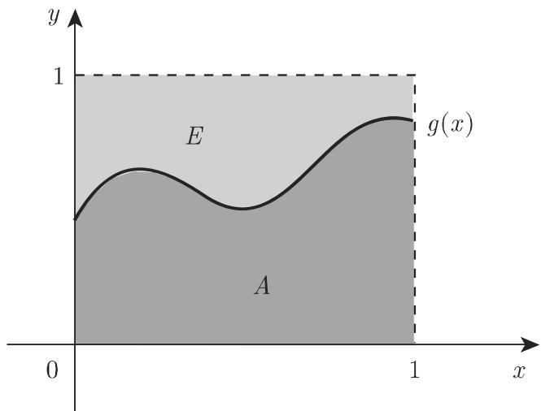

#### 16.3.5 蒙特卡罗方法

16.3.5.1 模拟

模拟法立足千构建等价的数学模型．通过计算机分析这些模型很容易．在这种情形下，可使用数宇模拟．当一定数量的模型被随机选取时，蒙特卡罗方法给出了一个特殊案例．这些随机元素可使用随机数选取．

16.3.5.2 随机数

随机数是满足特定分布的某些随机量的实现（参见第 1061 16.2.2)．通过这种方式可区分不同类型的随机数．

1. 均匀分布的随机数

均匀分布千区间 [O, 1] 的随机数，是密度函数为 $f _ { 0 } ( x )$ 、分布函数为 $F _ { 0 } ( x )$ 的随机变量 的实现：

$$
f _ {0} (x) = {\left\{ \begin{array}{l l} {1,} & {0 \leqslant x \leqslant 1,} \\ {0,} & {{\text {其他}},} \end{array} \right.} \quad F _ {0} (x) = {\left\{ \begin{array}{l l} {0,} & {0 \leqslant x,} \\ {x,} & {0 <   x \leqslant 1,} \\ {1,} & {x \geqslant 1.} \end{array} \right.}\tag{16.168}
$$

(1) 平方取中法 冯·诺伊曼提出了一种产生随机数的简便方法，也称为平方取中法，它从一个 $2 n$ 位小数 $z \in ( 0 , 1 )$ 开始．首先构造 $z ^ { 2 }$ ，得到一个 $4 n$ 位小数．去掉其前 位数字和后 $n$ 位数字，再次得到一个 $2 n$ 位数．重复上述程序，进一步产生新数．通过这种方式即产生了 [O, 1] 区间上的 $2 n$ 位小数，可视为服从均匀分布的随机数．根据计算机可表示的最大数选取 $2 n$ 的值，比如 $2 n = 1 0$ ．由千该程序产生了比它更小的数字，故很少使用，目前已发展了其他一些不同的方法．

$$
2 n = 4
$$

$$
\begin{array}{l l} {{z = z _ {0} = 0, 1 2 3 4, \quad z _ {0} ^ {2} = 0. 0 1 \boxed {5 2 2 7} 5 6,}} \\ {{z = z _ {1} = 0, 5 2 2 7, \quad z _ {0} ^ {2} = 0. 2 7 \boxed {3 2 1 5} 2 9,}} \\ {{z = z _ {2} = 0, 3 2 1 5 \text {等}.}} \end{array}
$$

最初的三个随机数是 $z _ { 0 } , z _ { 1 }$ 和 $z _ { 2 }$ .

(2) 同余法 所谓的同余法应用广泛：整数序列 $z _ { i } ( i = 0 , 1 , 2 , \cdots )$ )由递推公式

$$
z _ {i + 1} \equiv c \cdot z _ {i} \mod m\tag{16.169}
$$

生成其中， $z _ { 0 }$ 是任意正数， 表示正整数，必须合理选取．对千 $z _ { i + 1 }$ ，可取满足同余式 (16.169) 的最小非负整数数 $\frac { z _ { i } } { m }$ 位千 之间，可作为均匀分布随机数．

(3) a) 选取 $m = 2 ^ { r }$ ，其中 是计算机语言中的二进制数，例如 $r = 4 0$ ,依 $\sqrt { m }$ 的次序选取数 c.

b) 随机数生成器使用特定算法，可产生所谓伪随机数．

c) 计算器以及计算机中的 “ran" “rand" 键用千生成随机数．

2. 服从其他分布的随机数

为得到服从任意分布函数 $F ( x )$ 的随机数，可使用下述程序：对千区间 [O, 1]的均匀分布随机数序列令， $\xi _ { 1 } , \xi _ { 2 } , \cdots$ ．，利用它们构造数 $\eta _ { i } = F ^ { - 1 } ( \xi _ { i } ) , \ i = 1 , 2 , \cdot \cdot \cdot$ ．，其中 ${ \cal F } ^ { - 1 } ( x )$ 是分布函数 $F ( x )$ 的逆函数，则可得到

$$
P \left(\eta_ {i} \leqslant x\right) = P \left(F ^ {- 1} \left(\xi_ {i}\right) \leqslant x\right) = P \left(\xi_ {i} \leqslant F (x)\right) = \int_ {0} ^ {F (x)} f _ {0} (t) \mathrm{d} t = F (x),\tag{16.170}
$$

即随机数 $\eta _ { 1 } , \eta _ { 2 } , \cdots$ 服从分布函数为 $F ( x )$ 的分布．

3. 随机数表及其应用

(1) 构造 可通过下述方式构造随机数表．在 10 个完全相同的筹码上标注数字 $0 , 1 , 2 , \cdots , 9$ ，把它们放在一个盒子中并摇匀．选取其中之一，将其对应的号码写到表格中，然后把筹码再次放到盒子中摇匀，选取第二个．通过这种方式即产生一个随机数序列可作为一组记录到表格中（使用更方便）．在 1464 页表 21.21 中，位随机数形成一组．

在程序中，必须保证数字 $0 , 1 , 2 , \cdots , 9$ 总是等概率出现．

(2) 随机数表的应用 举例说明随机数表的应用．

·假设从 $N = 2 5 0$ 项的总体中随机选取 $n = 2 0$ 项．总体中的对象记数为 000249. 然后在 1464 页表 21.21 的任意列或行中选取一个数，明确如何选取其余 19个数的规则如纵向、横向或对角线方向．只要最初的 个数字取自千随机数，且生成的数小千 250 个，该方法即可使用．

16.3.5.3 蒙特卡罗模拟举例

求积分

$$
I = \int_ {0} ^ {1} g (x) \mathrm{d} x\tag{16.171}
$$

的近似值是模拟中应用均匀分布随机数的一个实例．下面讨论两种求解方法．

1. 运用频率

设 $0 \leqslant g ( x ) \leqslant 1$ ．通过积分变换总可保证该条件成立（参见第 1103 (16.175)),则积分 是单位正方形 内的区域面积（图 16.16)．考虑区间 [O, 1] 内均匀分布随机数序列的数值，把它们成对地作为单位正方形 内点的坐标，可得到 个点$P _ { i } ~ ( i = 1 , 2 , \cdot \cdot \cdot , n )$ ．用 表示区域 内点的数量，则可使用频率把积分表示为（参见第 1057 16.2.1.2)

$$
\int_ {0} ^ {1} g (x) \mathrm{d} x \approx \frac {m}{n}.\tag{16.172}
$$

使用 (16.172) 的比值，欲得到较好的精确度，需要大量随机数．这正是人们探究有可能提高精度的原因方法之一是下述蒙特卡罗方法另外一些方法可查阅相关文献（参见文献 [16.19]).

  
16.16

2. 利用均值逼近

为求解式 (16.171)，可从 个均匀分布随机数＆， $\xi _ { 1 } , \xi _ { 2 } , \cdots , \xi _ { n }$ ＆出发，作为均匀分布随机变量 的实现．则 $g _ { i } = g ( \xi _ { i } ) ~ ( i = 1 , 2 , \cdot \cdot \cdot , n )$ 是随机变量 $g ( X )$ 的实现，根据第 1063 页的公式 (16.49a, 16.49b), $g ( X )$ 的期望是

$$
E (g (X)) = \int_ {- \infty} ^ {\infty} g (x) f _ {0} (x) \mathrm{d} x = \int_ {0} ^ {1} g (x) \mathrm{d} x \approx \frac {1}{n} \sum_ {i = 1} ^ {n} g _ {i}.\tag{16.173}
$$

这种方法使用样本得到均值，也称为普通蒙特卡罗方法．

16.3.5.4 在数值数学中应用蒙特卡罗方法

1. 估计多重积分

首先说明如何把单变量的定积分 (16.174a) 变换为包含积分 (16.174b) 的式子．

$$
I ^ {*} = \int_ {a} ^ {b} h (x) \mathrm{d} x,\tag{16.174a}
$$

$$
I = \int_ {0} ^ {1} g (x) \mathrm{d} x \quad {\text {且}} \quad 0 \leqslant g (x) \leqslant 1.\tag{16.174b}
$$

引入下述记号：

$$
x = a + (b - a) u, \quad m = \min _ {x \in [ a, b ]} h (x), \quad M = \max _ {x \in [ a, b ]} h (x),\tag{16.175}
$$

即可使用 16.3.5.3 中给出的蒙特卡罗方法则 (16.174a) 变形为

$$
I ^ {*} = (M - m) (b - a) \int_ {0} ^ {1} \frac {h (a + (b - a) u) - m}{M - m} \mathrm{d} u + (b - a) m,\tag{16.176}
$$

其中被积函数 ${ \frac { h ( a + ( b - a ) u ) - m } { M - m } } = g ( u )$ 满足 $0 \leqslant g ( u ) \leqslant 1$

·通过双重积分

$$
V = \iint_ {S} h (x, y) \mathrm{d} x \mathrm{d} y \quad \text {且} \quad h (x, y) \geqslant 0\tag{16.177}
$$

的例子，说明如何使用蒙特卡罗方法近似估计多重积分． 表示由不等式 $a \leqslant x \leqslant b$ 和 $\varphi _ { 1 } ( x ) \leqslant y \leqslant \varphi _ { 2 } ( x )$ 所围成的平面区域，其中 $\varphi _ { 1 } ( x )$ 和 $\varphi _ { 2 } ( x )$ 表示已知函数．则可视为与 $x y$ 平面垂直、上表面为 $h ( x , y )$ 的圆柱体的体积．若 $h ( x , y ) \leqslant e ,$ 则圆柱体位千由不等式 $a \leqslant x \leqslant b , \ c \leqslant y \leqslant d , \ 0 \leqslant z \leqslant e ( a , b , c , d , e$ 为常数）所围成的立体 $Q$ 内．类似千 (16.175) 进行变换，由 (16.177) 可得到包含积分的表达式

$$
V ^ {*} = \iint_ {S ^ {*}} g (u, v) \mathrm{d} u \mathrm{d} v \quad \text {且} \quad 0 \leqslant g (u, v) \leqslant 1,\tag{16.178}
$$

其中 $V ^ { * }$ 是三维立方体内柱体 $K ^ { * }$ ＊的体积．利用蒙特卡罗方法按照下述方式可求积(16.178) 的近似值：

区间 [O, 1] 内均匀分布随机数序列的三元数组，可视为立方体内点 ${ \cal P } _ { i } ~ ( i =$ $1 , 2 , \cdots , n )$ 的坐标，查找 $P _ { i }$ 中位千柱体 $K ^ { * }$ ＊内点的个数．若 $m$ 个点在 $K ^ { * }$ 内，与(16.172) 类似可得

$$
V ^ {*} \approx \frac {m}{n}.\tag{16.179}
$$

当定积分中只有一个积分变量时，可使用第 1252 19.3 中的方法．若估计多重积分，仍常推荐用蒙特卡罗方法．

2. 使用随机游动过程求解偏微分方程

借助随机游动过程，蒙特卡罗方法可用千近似求解偏微分方程．

a) 边值问题举例 考虑下述边值问题作为例子：

$$
\Delta u = \frac {\partial^ {2} u}{\partial x ^ {2}} + \frac {\partial^ {2} u}{\partial y ^ {2}} = 0, (x, y) \in G,\tag{16.180a}
$$

$$
u (x, y) = f (x, y), \quad (x, y) \in \Gamma .\tag{16.180b}
$$

G是 $x y$ 平面内的单连通区域 I' 表示 的边界（图 16.17) ．与第 1268 19.5.1中的差分法类似用二次格覆盖 $G ,$ ，不失一般性，此处可假定步长 $h = 1$

  
16.17

通过这种方式可得到内部格点 $P ( x , y )$ 和边界点 $R _ { i }$ - 边界点 $R _ { i }$ 同时也是格点，在下面的讨论中可视为 的边界 的点即

$$
u (R _ {i}) = f (R _ {i}) \quad (i = 1, 2, \dots , N).\tag{16.181}
$$

b) 求解原则 设想粒子从内部点 $P ( x , y )$ 开始随机游动，也就是说：

(1) 粒子从 $P ( x , y )$ 向四个临近点中的某一个随机移动．假设移向每一个格点的概率是 $1 / 4$

(2) 如果粒子到达边界点 $R _ { i }$ ，则随机游动以概率 终止．

可以证明，无论粒子从哪一内部格点 开始，经过一定步数后，都将以概率到达边界点 $R _ { i }$ .

$$
p (P, R _ {i}) = p ((x, y), R _ {i})\tag{16.182}
$$

表示始于 $P ( x , y )$ 、将在边界点 $R _ { i }$ 终止的随机游动的概率，则可得到

$$
p (R _ {i}, R _ {i}) = 1, \quad p (R _ {i}, R _ {j}) = 0, \quad i \neq j,\tag{16.183}
$$

$$
\begin{array}{c} {p ((x, y), R _ {i})} \\ {= \frac {1}{4} [ p ((x - 1, y), R _ {i}) + p ((x + 1, y), R _ {i}) + p ((x, y - 1), R _ {i}) + p ((x, y + 1), R _ {i}) ].} \end{array}\tag{16.184}
$$

(16.184) 是关千 $p ( ( x , y ) , R _ { i } )$ ）的差分方程．若 个随机游动从点 $P ( x , y )$ 开始，其中 $m _ { i }$ 个在 $R _ { i } \ ( m _ { i } \leqslant n )$ 终止，则

$$
p ((x, y), R _ {i}) \approx \frac {m _ {i}}{n}.\tag{16.185}
$$

(16.185) 给出了差分方程 (16.180a) 的近似解，其边界条件为 (16.181) ．若进行替换

$$
v (P) = v (x, y) = \sum_ {i = 1} ^ {N} f (R _ {i}) p ((x, y), R _ {i}),\tag{16.186}
$$

则满足边界条件 (16.180b) ．根据 (16.184) ，有 $v ( R _ { j } ) = \sum _ { i = 1 } ^ { N } f ( R _ { i } ) p ( R _ { j } , R _ { i } ) = f ( R _ { j } )$

为计算 $v ( x , y )$ ，用 $f ( R _ { i } )$ 乘以 (16.184)，求和将得到下述关千 $v ( x , y )$ 的差分方程

$$
v (x, y) = \frac {1}{4} [ v (x - 1, y) + v (x + 1, y) + v (x, y - 1) + v (x, y + 1) ].\tag{16.187}
$$

个随机游动从点 $P ( x , y )$ 开始，其中 $m _ { j }$ 个终止千边界点 $R _ { i } \ ( i = 1 , 2 , \cdot \cdot .$ $N )$ ，则在点 $P ( x , y )$ 处边值问题 (16.180a, 16.180b) 的近似值为

$$
v (x, y) \approx \frac {1}{n} \sum_ {i = 1} ^ {n} m _ {i} f (R _ {i}).\tag{16.188}
$$

16.3.5.5 蒙特卡罗方法的进一步应用

作为随机模拟，蒙特卡罗方法有时也称为统计试验方法广泛应用千诸多不同领域例如：

．核技术：穿过材料层的中子数．

．通信：分离信号和噪声．

．运筹学：排队系统过程设计，库存控制服务系统

对这些问题的细节讨论可参见文献 [16.19], [16.23]
