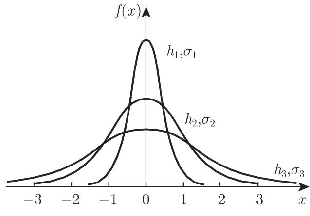

### 16.4 误差验算

无论多么细心，任何科学测量在进行到一定次数时，都会存在误差和不确定性观察误差、测量方法的误差、仪器误差以及通常源千被测现象内在随机性的误差，共同构成测量误差

测量过程中出现的所有测量误差称为偏差．因此，用一些有效数字表示的测量值只能通过舍入误差给出，即通过一定的统计误差给出，它称为结果的不确定性．

(1) 测量过程的偏差应保持尽可能小．基千此，需要尽可能估计最佳逼近，这一点可借助千平滑方法完成，该方法起源千高斯的最小二乘法．

(2) 要尽可能好地估计不确定性，这一点可借助千数理统计方法．

测量结果有随机性，它们可视为具有概率分布的统计样本（参见第 1065 页，16.2.3, 1.），其参数包含着所需要的信息从这个意义上讲，测量误差可看作样本误差

#### 16.4.1 测量误差及其分布

16.4.1.1 测量误差的定性特征

欲根据起因描述测量误差，需要区分下述三类误差：

(1) 粗误差由读数不准确或错误引起，这类误差是可排除的．

(2) 系统测量误差由测量设备的不精确或测量方法引起，包括读取数据的方法，以及测量系统的测量误差，这类误差并非都可以避免．

(3) 统计误差或随机测最误差源千不易或不可能控制的测最条件的随机变化，也可能巾观察事件的某种随机性产生．

在测量误差理论中，通常假定粗误差和系统测量误差是可排除的，故只有统计性质和随机测量误差被纳入到误差计算中．

16.4.1.2 测量误差的密度函数

1. 测量规约

为计算不确定性特征，必须假设把测量结果作为主要记法列入测量记录中，从而可得到不确定数值的频率或密度函数 f(x) 或累计频率或分布函数 F(x)．所考虑的随机变晕 的实现用 表示．

2. 误差密度函数

对千测量误差性质的特别假定，导致了误差分布的密度函数具有一些特殊性质．

(1) 连续密度函数 巾千随机测量误差可在某区间内取任意值，故可用连续密度函数 f(x) 描述．

(2) 偶密度函数 若绝对值相同但符号不同的测量误差是等可能的，则密度函数是偶函数： $f ( - x ) = f ( x )$

(3) 单调递减密度函数 若具有较大绝对值的测量误差与具有较小绝对值的测量误差相比可能性小，则当 $x > 0$ 时密度函数 $f ( x )$ 是单调递减的．

(4) 期望有限 误差绝对值的期望一定是有限数：

$$
E (| X |) = \int_ {- \infty} ^ {\infty} | x | f (x) \mathrm{d} x <   \infty .\tag{16.189}
$$

误差的不同性质导致密度函数的类型各异．

3. 正态分布误差

(1) 密度函数和分布函数 在大多数实际情况下，可假设测量误差的分布是期望 $\mu = 0$ 、方差为 $\sigma ^ { 2 }$ 的正态分布，即测量误差的密度函数 f(x) 和分布函数 $F ( x )$ 是

$$
f (x) = \frac {1}{\sigma \sqrt {2 \pi}} \mathrm{e} ^ {- \frac {x ^ {2}}{2 \sigma^ {2}}}\tag{16.190a}
$$

和

$$
F (x) = \frac {1}{\sigma \sqrt {2 \pi}} \int_ {- \infty} ^ {x} \mathrm{e} ^ {- \frac {t ^ {2}}{2 \sigma^ {2}}} \mathrm{d} t = \varPhi \left(\frac {x}{\sigma}\right),\tag{16.190b}
$$

其中 $\varPhi \left( x \right)$ 是标准正态分布的分布函数（参见第 1070 (16.73a) 145821.17) ．在 (16.190a, 16.190b) 情形下，也称为正态误差．

(2) 几何表示 密度函数 (16.190a) 如图 16.18(a) 所示，图中标出了拐点和重心．图 16.18(b) 给出了不同方差对应的密度函数拐点的横坐标为 $\pm \sigma ,$ 半区域的重心在土 处．当 $x = 0$ 时，函数取得最大值 $1 / ( \sigma \sqrt { 2 \pi } )$ . $\sigma ^ { 2 }$ 增大时曲线变宽，曲线下的面积恒等千 1. 分布图显示，小误差经常发生，大误差很少出现．

  
(a)

  
(b)  
16.18

4. 描述正态分布误差的参数

除了方差 $\sigma ^ { 2 }$ ，或者也被称为均方误差或标准差的标准偏差 $\sigma ,$ ，还有其他一些参数可用千描述正态分布误差，如精确度 、平均误差 和可能误差 $\gamma$ .

(1) 精确度 除了方差 $\sigma ^ { 2 }$ , 精确度

$$
h = \frac {1}{\sigma \sqrt {2}}\tag{16.191}
$$

可用来描述正态分布的宽度．高斯曲线越窄，精确度越高（图 16.18(b) ）．利用试验值 $\tilde { \sigma }$ 或由测量值得到的 $\tilde { \sigma } _ { x }$ 取代 $\sigma ,$ ，精确度可用来说明测量方法的准确性．

(2) 平均误差 误差绝对值的期望 $\eta$ 定义为

$$
\eta = E (| X |) = 2 \int_ {0} ^ {\infty} x f (x) \mathrm{d} x = \sqrt {\frac {2}{\pi}} \sigma .\tag{16.192}
$$

(3) 可能误差 误差绝对值的边界 $\gamma$ 满足性质

$$
P (| X | \leqslant \gamma) = \frac {1}{2},\tag{16.193a}
$$

称为可能误差．这意味着

$$
\int_ {- \gamma} ^ {\gamma} f (x) \mathrm{d} x = 2 \varPhi \left(\frac {\gamma}{\sigma}\right) - 1 = \sqrt {\frac {2}{\pi}} \int_ {0} ^ {\gamma / \sigma} \mathrm{e} ^ {- t ^ {2} / 2} \mathrm{d} t = \frac {1}{2},\tag{16.193b}
$$

其中 $\varPhi ( x )$ 是标准正态分布的分布函数．条件 (16.193b) 是非线性方程，可借助千计算机代数系统近似求解，以得到 $\gamma / \sigma$ 其结果是

$$
\frac {\gamma}{\sigma} \approx 0. 6 7 4 5.\tag{16.193c}
$$

(4) 给定的误差界 若已知误差的上界 $a > 0$ ，则由 (16.193b) 可计算出误差落在区间 $[ - a , a ]$ 内的概率是

$$
P (| X | \leqslant a) = 2 \Phi \left(\frac {a}{\sigma}\right) - 1.\tag{16.194}
$$

(5) 标准差、平均误差、可能误差和精确度之间的关系 若误差服从正态分布，则根据 (16.193c)，下述关系式成立：

$$
\eta = \sqrt {\frac {2}{\pi}} \sigma ,\tag{16.195a}
$$

$$
\gamma = 0. 6 7 4 5 \sigma ,\tag{16.195b}
$$

$$
h = \frac {1}{2 \sqrt {\sigma}}.\tag{16.195c}
$$

16.4.1.3 测量误差的量化特征

1. 真实值及其近似值

一个可测量的真实值 $x _ { w }$ 通常是未知的．故通过测量值 $x _ { i } ( i = 1 , 2 , \cdots , n )$ 实现的随机变量期望，可作为 $x _ { w }$ 的估计值，从而可把下述均值视为 $x _ { w }$ 的近似值．

(1) 算术平均

$$
\bar {x} = \frac {1}{n} \sum_ {i = 1} ^ {n} x _ {i}.\tag{16.196a}
$$

如果测量值以绝对频率 $h _ { j }$ 分成 组，组平均值为 $\hat { x } _ { j } \ ( j = 1 , 2 , \cdot \cdot \cdot , k )$ ，则

$$
\bar {x} = \sum_ {j = 1} ^ {k} h _ {j} \bar {x} _ {j}.\tag{16.196b}
$$

(2) 加权平均

$$
\bar {x} ^ {(g)} = \frac {\sum_ {i = 1} ^ {n} g _ {i} x _ {i}}{\sum_ {i = 1} ^ {n} g _ {i}}.\tag{16.197}
$$

此时对单次测量值以权重因子 $g _ { i } ( g _ { i } > 0 )$ 进行加权（参见第 1112 16.4.1.6,1.).

2. 测量序列中的单次测量误差

(1) 测量序列中单次测量的真实误差 是真实值 $x _ { w }$ 和测量值之差．由千真实值通常是未知的，测量结果为 $x _ { i }$ 的第 次测量之真实误差 $\varepsilon _ { i }$ 也是未知的：

$$
\varepsilon_ {i} = x _ {w} - x _ {i}.\tag{16.198}
$$

(2) 测量序列中单次测量的平均误差或表观误差 是算术平均值和测量值 $x _ { i }$ 之差：

$$
v _ {i} = \bar {x} - x _ {i}.\tag{16.199}
$$

(3) 单次测量的均方误差或标准差 由千 $n$ 次测量真实误差 $\varepsilon _ { i }$ 之和的期望值，以及表观误差 $v _ { i }$ 之和的期望值为 （与它们多大无关），故用误差平方和表示：

$$
\varepsilon^ {2} = \sum_ {i = 1} ^ {n} \varepsilon_ {i} ^ {2},\tag{16.200a}
$$

$$
v ^ {2} = \sum_ {i = 1} ^ {n} v _ {i} ^ {2}.\tag{16.200b}
$$

从实用观点看，既然只有 $v _ { i }$ 的值可由测量过程确定，我们仅对 (16.200b) 感兴趣因此，测量序列中单次测量的均方误差可定义为

$$
\tilde {\sigma} = \sqrt {\sum_ {i = 1} ^ {n} v _ {i} ^ {2} / (n - 1)}.\tag{16.200c}
$$

$\tilde { \sigma }$ 是误差分布标准差 $\sigma$ 的近似值．

在正态误差分布情形下，可得到 $\tilde { \sigma } = \sigma$

$$
P (| \varepsilon | \leqslant \tilde {\sigma}) = 2 \varPhi (1) - 1 = 0. 6 8 2 6,\tag{16.200d}
$$

即真实值的绝对值不超过 $\sigma$ 的概率约为 68%.

(4) 单次测量的可能误差 是数 $\gamma .$ 由千

$$
P (| \varepsilon | \leqslant \gamma) = \frac {1}{2},\tag{16.201a}
$$

即误差绝对值不超过 $\gamma$ 的概率是 50%．横坐标 $\pm \gamma$ 把密度函数下方左右两边的区域分成相等的两部分（图 16.18(a)).

在正态误差分布情形下，根据 (16.193c)，有

$$
\gamma \approx 0. 6 7 4 5 \sigma \approx 0. 6 7 4 5 \tilde {\sigma} = \tilde {\gamma}.\tag{16.201b}
$$

(5) 单次测量的平均误差 是数 $\eta _ { ; }$ ，它是误差绝对值的期望：

$$
\eta = E (| \varepsilon |) = \int_ {- \infty} ^ {\infty} | x | f (x) \mathrm{d} x.\tag{16.202a}
$$

在正态误差分布情形下，有 $\eta = \sqrt { \frac { 2 } { \pi } } \sigma$ 和

$$
P (| \varepsilon | \leqslant \eta) = 2 \Phi \left(\frac {\eta}{\sigma}\right) - 1 = 2 \Phi \left(\sqrt {\frac {2}{\pi}}\right) - 1 \approx 0. 5 7 5 1.\tag{16.202b}
$$

误差不超过 $\eta$ 值的概率约为 57.6%．密度函数下方左右两侧区域重心的横坐标是（图 16.18(a)）．在正态误差分布情形下：

$$
\eta = \sqrt {\frac {2}{\pi}} \sigma \approx \sqrt {\frac {2}{\pi}} \tilde {\sigma} = \tilde {\eta}.\tag{16.202c}
$$

3. 测量序列算术平均值的误差

测量序列算术平均值 $\bar { x }$ 的误差巾单次测量误差给出．

(1) 均方误差或标准差

$$
\tilde {\sigma} _ {\mathrm{AM}} = \sqrt {\sum_ {i = 1} ^ {n} v _ {i} ^ {2} \bigg / [ n (n - 1) ]} = \frac {\tilde {\sigma}}{\sqrt {n}}.\tag{16.203}
$$

(2) 可能误差

$$
\tilde {\gamma} _ {\mathrm{AM}} = 0. 6 7 4 5 \sqrt {\sum_ {i = 1} ^ {n} v _ {i} ^ {2} \bigg / [ n (n - 1) ]} = 0. 6 7 4 5 \cdot \frac {\tilde {\sigma}}{\sqrt {n}}.\tag{16.204}
$$

(3) 平均误差

$$
\tilde {\eta} _ {\mathrm{AM}} = 0. 7 9 7 9 \sqrt {\sum_ {i = 1} ^ {n} v _ {i} ^ {2} \bigg / [ n (n - 1) ]} = 0. 7 9 7 9 \cdot \frac {\tilde {\sigma}}{\sqrt {n}}.\tag{16.205}
$$

(4) 误差的可达水平 由上述 (16.203)\~(16.205) 定义的三类误差，与对应的单次测量误差 (16.200c), (16.201 b), (16.202c) 成比例且与 的平方根的倒数成比例．当达到一定次数后，再增加测量次数则没有实际意义．更有效的方法是提高测最方法的精确度 h(l6.191).

4. 绝对误差和相对误差

(1) 绝对不确定性、绝对误差 测量结果的不确定性用误差 $\varepsilon _ { i } , v _ { i } , \sigma _ { i } , \gamma _ { i } , \eta _ { i }$ 或$\varepsilon , v , \sigma , \gamma , \eta$ 来描述，它们度量了测量的可靠性．由绝对误差给出的绝对不确定性概念，对所有类型的误差和误差传播的计算都有意义（参见第 1114 16.4.2)．作为测量数量，它们的维度相同

引入“绝对＇误差这个词汇是为了避免与相对误差概念混淆，经常使用记号 $\Delta x _ { i }$ 或 $\Delta x$ 表示．＇＇绝对“与绝对值的概念完全不同：它指可测量没有符号限制的数值（比如长度、重量、能量）．

(2) 相对不确定性、相对误差 用相对误差给出的相对不确定性，是关千可测量数值测量方法品质的度量．由千相对误差是绝对误差和可测量数值之商，故与绝对误差相反，相对误差没有维度若测量值未知可用量 的平均值代替：

$$
\delta x _ {i} = \frac {\Delta x _ {i}}{x} \approx \frac {\Delta x _ {i}}{\bar {x}}.\tag{16.206a}
$$

相对误差大多数用百分数给出，也称为百分误差：

$$
\delta x _ {i} / \% = \delta x _ {i} \cdot 100 \%.\tag{16.206b}
$$

5. 最大绝对误差和最大相对误差

(1) 最大绝对误差 欲确定量 z, 是可测量 $x _ { 1 } , x _ { 2 } , \cdots , x _ { n }$ 的函数，即 $z =$ $f ( x _ { 1 } , x _ { 2 } , \cdots , x _ { n } )$ ），则计算所产生的误差时必须考虑到函数 f. 有两种不同方法检测误差．第一种方法是运用统计误差分析，即通过最小二乘法（使 $\sum { \left( z _ { i } - z \right) ^ { 2 } }$ 最小）平滑数据值．第二种方法是确定绝对误差量的上界 $\Delta z _ { \mathrm { m a x } }$ • 对千 个独立变量 $x _ { i } .$ 有

$$
\Delta z _ {\max} = \sum_ {i = 1} ^ {n} \left| \frac {\partial}{\partial x _ {i}} f (x _ {1}, x _ {2}, \dots , x _ {n}) \right| \Delta x _ {i},\tag{16.207}
$$

其中平均值 $\bar { x } _ { i }$ 被 $x _ { i }$ 取代．

(2) 最大相对误差 最大相对误差是最大绝对误差除以测量值（多数情况下用的平均值）：

$$
\delta z _ {\mathrm{max}} = \frac {\Delta z _ {\mathrm{max}}}{z} \approx \frac {\Delta z _ {\mathrm{max}}}{\bar {z}}.\tag{16.208}
$$

16.4.1.4 使用误差界确定测量结果

只有也给出了期望误差时，才可能对测量结果进行实际解释，误差估计值和误差界是测量结果的组成部分．根据数据必须弄清楚误差的类型、置信区间和显著性水平

(1) 定义误差 单次测量值可用下述形式给出

$$
x = x _ {i} \pm \Delta x \approx x _ {i} \pm \tilde {\sigma},\tag{16.209a}
$$

且均值满足

$$
x = \bar {x} \pm \Delta x _ {\mathrm{AM}} \approx \bar {x} \pm \tilde {\sigma} _ {\mathrm{AM}}.\tag{16.209b}
$$

对千 $\Delta x$ ，最常使用标准差 ${ \tilde { \sigma } } ,$ ，有时也用 $\tilde { \gamma }$ 和 $\tilde { \eta }$

(2) 任意置信限法则 若总体服从 $N ( \mu , \sigma ^ { 2 } )$ 分布，根据 (16.96) ，量 $T = \frac { X - x _ { w } } { \tilde { \sigma } _ { \mathrm { A M } } }$ 服从自由度为 $f = n - 1$ 分布（见 (16.97b)）．对千预期的显著性水平 或接受概率 $S = 1 - \alpha$ ，未知量 $x _ { w } = \mu$ 在 分位数 $t _ { \alpha / 2 ; f }$ 处的置信限是

$$
\mu = \bar {x} \pm t _ {\alpha / 2; f} \cdot \tilde {\sigma} _ {\mathrm{AM}},\tag{16.210}
$$

即真实值 $x _ { w }$ 以概率 $S = 1 - \alpha$ 落在上述置信限给出的区间内．

在大多数情况下，以尽可能低的水平保持测量序列的容量 很有意义．当 $1 - \alpha$ 值减小，测量次数 $n$ 增大时置信区间的长度 $2 t _ { \alpha / 2 ; f } \tilde { \sigma } _ { \mathrm { A M } }$ 减小．由千 $\tilde { \sigma } _ { \mathrm { A M } }$ 对应$1 / \sqrt { n }$ 成比例地减小，自由度 $f = n - 1$ 的分位数 $t _ { \alpha / 2 ; f }$ 也对应 $1 / \sqrt { n }$ 订戎比例地减小（对千 10 之间的 值，可参见第 1463 页表 21.20)，对千上述 值，置信区间的长度对应 $1 / n$ 成比例减小．

16.4.1.5 精确度相同时直接测量的误差估计

次测最都有相同的标准差 $\sigma _ { i }$ ，则测最的精确度相同， ＝常数．在这种情况下，（ 16.200c), (16.201b) (16.202b) 给出了由最小二乘法产生的误差量．

·下表给出的测量序列中，包含了精确度相同的 $n = 1 0$ 次直接测量数据，试确定其最终结果

<table><tr><td> $x_{i}$ </td><td>1.592</td><td>1.581</td><td>1.574</td><td>1.566</td><td>1.603</td><td>1.580</td><td>1.591</td><td>1.583</td><td>1.571</td><td>1.559</td></tr><tr><td> $v_{i} \cdot 10^{3}$ </td><td>-12</td><td>-1</td><td>+6</td><td>+14</td><td>-23</td><td>0</td><td>-11</td><td>-3</td><td>+9</td><td>+21</td></tr><tr><td> $v_{i}^{2} \cdot 10^{6}$ </td><td>144</td><td>1</td><td>36</td><td>196</td><td>529</td><td>0</td><td>121</td><td>9</td><td>81</td><td>441</td></tr></table>

$$
\bar {x} = 1. 5 8 0, \quad \tilde {\sigma} = \sqrt {\sum_ {i = 1} ^ {n} v _ {i} ^ {2} / (n - 1)} = 0. 0 1 3 1, \quad \tilde {\sigma} _ {\mathrm{AM}} = \tilde {\sigma} / \sqrt {n} = 0. 0 0 4.
$$

最终结果： $x = \bar { x } \pm \tilde { \sigma } _ { \mathrm { A M } } = 1 . 5 8 0 \pm 0 . 0 0 4 .$

16.4.1.6 精确度不同时直接测量的误差估计

1. 加权测量

如果直接测量值 $x _ { i }$ 根据不同测量方法得到，或表示具有相同均值元、不同方差$\tilde { \sigma } _ { i } ^ { 2 }$ 的单次测量的均值，则计算加权平均

$$
\bar {x} ^ {(g)} = \sum_ {i = 1} ^ {n} g _ {i} x _ {i} \Bigg / \sum_ {i = 1} ^ {n} g _ {i},\tag{16.211}
$$

其中 $g _ { i }$ 定义为

$$
g _ {i} = \frac {\tilde {\sigma} ^ {2}}{\tilde {\sigma} _ {i} ^ {2}}.\tag{16.212}
$$

此时， $\tilde { \sigma }$ 是任意正值，通常是最小的 $\tilde { \sigma } _ { i }$ . 它可作为偏差的加权单位，即对千 $\tilde { \sigma } _ { i } = \tilde { \sigma }$ 有 $g _ { i } = 1$ . 由（16.210) 可推出，测量的权重较大时，会产生较小的偏差 $\tilde { \sigma } _ { i }$

2. 标准差

加权单位的标准差可估计为

$$
\tilde {\sigma} ^ {(g)} = \sqrt {\sum_ {i = 1} ^ {n} g _ {i} v _ {i} ^ {2} \bigg / (n - 1)}.\tag{16.213}
$$

必须确保 $\tilde { \sigma } ^ { ( g ) } < \tilde { \sigma }$ 相反，若 $\tilde { \sigma } ^ { ( g ) } > \tilde { \sigma } .$ ，则存在带有系统偏差的 $x _ { i }$ 值．

单次测量的标准差是

$$
\tilde {\sigma} _ {i} ^ {(g)} = \frac {\tilde {\sigma} ^ {(g)}}{\sqrt {g _ {i}}} = \frac {\tilde {\sigma} ^ {(g)}}{\tilde {\sigma}} \tilde {\sigma} _ {i},\tag{16.214}
$$

其中预期 $\tilde { \sigma } _ { i } ^ { ( g ) } < \tilde { \sigma } _ { i }$

加权平均的标准差是

$$
\tilde {\sigma} _ {\mathrm{AM}} ^ {(g)} = \sigma^ {(g)} \Bigg / \sqrt {\sum_ {i = 1} ^ {n} g _ {i}} = \sqrt {\sum_ {i = 1} ^ {n} g _ {i} v _ {i} ^ {2} \Bigg / \bigg ((n - 1) \sum_ {i = 1} ^ {n} g _ {i} \bigg)}.\tag{16.215}
$$

3. 误差描述

可通过 1111 16.4.1.4 描述误差，或通过误差的定义或根据自由度为分位数

·表 16.6 给出了具有不同均值 ${ \bar { x } } _ { i } ( i = 1 , 2 , \cdot \cdot \cdot , 5 )$ 、不同标准差 $\tilde { \sigma } _ { \mathrm { A M _ { i } } }$ 的测量序列的最终结果 $( n = 5 )$

16.6 测量序列的误差描述

<table><tr><td> $\bar{x}_{i}$ </td><td> $\tilde{\sigma}_{\text{AM}_i}$ </td><td> $\tilde{\sigma}_{\text{AM}_i}^2$ </td><td> $g_i$ </td><td> $z_i$ </td><td> $g_i z_i$ </td><td> $z_i^2$ </td><td> $g_i z_i^2$ </td></tr><tr><td>1.573</td><td>0.010</td><td> $1.0 \cdot 10^{-4}$ </td><td>0.81</td><td> $-1.2 \cdot 10^{-2}$ </td><td> $-9.7 \cdot 10^{-3}$ </td><td> $1.44 \cdot 10^{-4}$ </td><td> $1.16 \cdot 10^{-4}$ </td></tr><tr><td>1.580</td><td>0.004</td><td> $1.6 \cdot 10^{-5}$ </td><td>5.06</td><td> $-5.0 \cdot 10^{-3}$ </td><td> $-2.5 \cdot 10^{-2}$ </td><td> $2.50 \cdot 10^{-5}$ </td><td> $1.26 \cdot 10^{-4}$ </td></tr><tr><td>1.582</td><td>0.005</td><td> $2.5 \cdot 10^{-5}$ </td><td>3.24</td><td> $-3.0 \cdot 10^{-3}$ </td><td> $-9.7 \cdot 10^{-3}$ </td><td> $9.0 \cdot 10^{-6}$ </td><td> $2.91 \cdot 10^{-5}$ </td></tr><tr><td>1.589</td><td>0.009</td><td> $8.1 \cdot 10^{-5}$ </td><td>1.00</td><td> $+4.0 \cdot 10^{-3}$ </td><td> $4.0 \cdot 10^{-3}$ </td><td> $1.6 \cdot 10^{-5}$ </td><td> $1.6 \cdot 10^{-5}$ </td></tr><tr><td>1.591</td><td>0.011</td><td> $1.21 \cdot 10^{-4}$ </td><td>0.66</td><td> $+6.0 \cdot 10^{-3}$ </td><td> $3.9 \cdot 10^{-3}$ </td><td> $3.6 \cdot 10^{-5}$ </td><td> $2.37 \cdot 10^{-5}$ </td></tr><tr><td> $(\bar{x}_i)_m$ </td><td> $\tilde{\sigma}$ </td><td></td><td> $\sum_{i=1}^{n} g_i$ </td><td></td><td> $\sum_{i=1}^{n} g_i z_i$ </td><td></td><td> $\sum_{i=1}^{n} g_i z_i^2$ </td></tr><tr><td>= 1.583</td><td>= 0.009</td><td></td><td>= 10.7</td><td></td><td>=  $3.6 \cdot 10^{-2}$ </td><td></td><td>=  $3.1 \cdot 10^{-4}$ </td></tr></table>

计算可得 $( \bar { x } _ { i } ) _ { m } ~ = ~ 1 . 5 8 3 0$ 选取 $x _ { 0 } ~ = ~ 1 . 5 8 5$ 和 $\tilde { \sigma } ~ = ~ 0 . 0 0 9 .$ 且 $z _ { i } ~ = ~ \bar { x } _ { i } ~ -$ $x _ { 0 } , \ g _ { i } = \tilde { \sigma } ^ { 2 } / \tilde { \sigma } _ { i } ^ { 2 }$ ，得到 $\bar { z } ~ = ~ - 0 . 0 0 3 6$ 和 $\bar { x } = x _ { 0 } + \bar { z } = 1 . 5 8 2$ . 标准差是 $\tilde { \sigma } ^ { ( g ) } =$ $\sqrt { \sum _ { i = 1 } ^ { n } g _ { i } v _ { i } ^ { 2 } \bigg / ( n - 1 ) } \ = \ 0 . 0 0 8 8 \ < \ \tilde { \sigma }$ 和 ${ \tilde { \sigma } _ { x } } ~ = ~ { \tilde { \sigma } _ { \mathrm { A M } } } ~ = ~ 0 . 0 0 2 7$ . 最终结果是 $x =$ $\bar { x } \pm \tilde { \sigma } _ { x } = 1 . 5 8 5 \pm 0 . 0 0 2 7$

#### 16.4.2 误差传播和误差分析

测量数量在最终结果中通常以相关函数形式出现，称为误差传播．若误差很小，则使用略去二阶及更高阶项的误差的泰勒展开式．

16.4.2.1 高斯误差传播定律

1. 问题表述

欲确定由函数 $z = f ( x _ { 1 } , x _ { 2 } , \cdot \cdot \cdot , x _ { k } )$ ）给出的量 的数值和误差，其中 $x _ { j } \ ( j =$ $1 , 2 , \cdots , k )$ 是独立变量．由测量值 $n _ { j }$ 得到的均值 $\bar { x } _ { j }$ 可视为随机变量 $x _ { j }$ 的实现，且方差为 $\sigma _ { j } ^ { 2 }$ ．问题是：变量的误差是如何影响函数值 $f ( x _ { 1 } , x _ { 2 } , \cdots , x _ { k } )$ ）的．设函数 $f ( x _ { 1 } , x _ { 2 } , \cdots , x _ { k } )$ 可微，其变量是随机独立的但服从具有不同方差 $\sigma _ { j } ^ { 2 }$ 的任意分布．

2. 泰勒展开

由千误差表示独立变量相对较小的变化，函数 $f ( x _ { 1 } , x _ { 2 } , \cdots , x _ { k } )$ 大约可由均值$\boldsymbol { \bar { x } } _ { j }$ 泰勒展开式的线性部分逼近展开式的系数为 $a _ { j }$ ，故误差 $\Delta f$ 是

$$
\Delta f = f (x _ {1}, x _ {2}, \dots , x _ {k}) - f (\bar {x} _ {1}, \bar {x} _ {2}, \dots , \bar {x} _ {k}),\tag{16.216a}
$$

$$
\Delta f \approx \mathrm{d} f = \frac {\partial f}{\partial x _ {1}} \mathrm{d} x _ {1} + \frac {\partial f}{\partial x _ {2}} \mathrm{d} x _ {2} + \dots + \frac {\partial f}{\partial x _ {k}} \mathrm{d} x _ {k} = \sum_ {j = 1} ^ {k} \frac {\partial f}{\partial x _ {j}} \mathrm{d} x _ {j} = \sum_ {j = 1} ^ {k} a _ {j} \mathrm{d} x _ {j},\tag{16.216b}
$$

其中偏导数 $\partial f / \partial x _ { j }$ 在（ $\left( { \bar { x } } _ { 1 } , { \bar { x } } _ { 2 } , \cdots , { \bar { x } } _ { k } \right)$ ）处取得．

函数的方差是

$$
\partial f ^ {2} = a _ {1} ^ {2} \sigma_ {x _ {1}} ^ {2} + a _ {2} ^ {2} \sigma_ {x _ {2}} ^ {2} + \dots + a _ {k} ^ {2} \sigma_ {x _ {k}} ^ {2} = \sum_ {j = 1} ^ {k} a _ {j} ^ {2} \sigma_ {x _ {j}} ^ {2}.\tag{16.217}
$$

3. 方差 $\sigma _ { f } ^ { 2 }$ 的近似值

由千独立变量 $x _ { j }$ 的方差未知可用均值的方差近似，均值方差由单个变量的测量值 $x _ { j l } \ ( l = 1 , 2 , \cdots , n _ { l } )$ 确定，公式如下：

$$
\tilde {\sigma} _ {\bar {x} _ {j}} ^ {2} = \frac {\sum_ {l = 1} ^ {n _ {j}} (x _ {j l} - \bar {x} _ {j}) ^ {2}}{n _ {j} (n _ {j} - 1)}.\tag{16.218}
$$

使用上述数值可得到 $\sigma _ { f } ^ { 2 }$ 近似值：

$$
\tilde {\sigma} _ {f} ^ {2} = \sum_ {j = 1} ^ {k} a _ {j} ^ {2} \tilde {\sigma} _ {\bar {x} _ {j}} ^ {2}.\tag{16.219}
$$

公式 (16.219) 称为高斯误差传播定律．

4. 特殊情形

(1) 线性情形 经常出现的清况是：产生的误差是线性的．当 $a _ { j } = 1$ 时其误差值之和是

$$
\tilde {\sigma} _ {f} = \sqrt {\tilde {\sigma} _ {1} ^ {2} + \tilde {\sigma} _ {2} ^ {2} + \cdots + \tilde {\sigma} _ {k} ^ {2}}.\tag{16.220}
$$

·对千光谱辐射，当测量探测器通道脉冲响应输出的脉冲长度时，其误差由三部分组成：

a) 以能量 $E _ { 0 }$ 穿过光谱仪辐射的统计能量分布，用 $\tilde { \sigma } _ { \mathrm { S t r } }$ 表示．

b) 探测器中的统计干扰过程， $\tilde { \sigma } _ { \mathrm { D e t } }$ 表示．

c) 探测器脉冲中，放大器的电子噪声 $\tilde { \sigma } _ { \mathrm { e l } }$ •

脉冲长度的总误差为

$$
\tilde {\sigma} _ {f} = \sqrt {\tilde {\sigma} _ {\mathrm{Str}} ^ {2} + \tilde {\sigma} _ {\mathrm{Det}} ^ {2} + \tilde {\sigma} _ {\mathrm{el}} ^ {2}}.\tag{16.221}
$$

(2) 幕法则 变量 $x _ { j }$ 经常以下述形式出现：

$$
z = f (x _ {1}, x _ {2}, \dots , x _ {k}) = a x _ {1} ^ {b _ {1}} \cdot x _ {2} ^ {b _ {2}} \cdot \dots \cdot x _ {k} ^ {b _ {k}}.\tag{16.222}
$$

取对数差分，相对误差为

$$
{\frac {\mathrm{d} f}{f}} = b _ {1} {\frac {\mathrm{d} x _ {1}}{x _ {1}}} + b _ {2} {\frac {\mathrm{d} x _ {2}}{x _ {2}}} + \dots + b _ {k} {\frac {\mathrm{d} x _ {k}}{x _ {k}}},\tag{16.223}
$$

由此得到均值相对误差的误差传播定律为

$$
\frac {\tilde {\sigma} _ {f}}{f} = \sqrt {\sum_ {j = 1} ^ {k} \left(b _ {j} \frac {\tilde {\sigma} _ {\bar {x} _ {j}}}{\bar {x} _ {j}}\right) ^ {2}}.\tag{16.224}
$$

·假设函数 $f ( x _ { 1 } , x _ { 2 } , x _ { 3 } )$ ）具有形式 $f ( x _ { 1 } , x _ { 2 } , x _ { 3 } ) = \sqrt { x _ { 1 } } x _ { 2 } ^ { 2 } x _ { 3 } ^ { 3 }$ ，且标准差是 $\sigma _ { x _ { 1 } } , \sigma _ { x _ { 2 } }$ 和 $\sigma _ { x _ { 3 } }$ ，则相对误差是

$$
\delta z = \frac {\tilde {\sigma} _ {f}}{f} = \sqrt {\left(\frac {1}{2} \frac {\tilde {\sigma} _ {\bar {x} _ {1}}}{\bar {x} _ {1}}\right) ^ {2} + \left(2 \frac {\tilde {\sigma} _ {\bar {x} _ {2}}}{\bar {x} _ {2}}\right) ^ {2} + \left(3 \frac {\tilde {\sigma} _ {\bar {x} _ {3}}}{\bar {x} _ {3}}\right) ^ {2}}.
$$

．最大误差的差分

规定最大绝对误差或最大相对误差的 (16.207), (16.208) 是指对测量值没作平滑．为使用误差传播定律 (16.219) (16.222) 确定相对误差或绝对误差，测量值$x _ { j }$ 之间的平滑意味着对千之前的给定水平，确定一个置信区间．该过程在第 111216.4.1.4 中给出．

16.4.2.2 误差分析

在计算函数 $\varphi ( x _ { i } )$ 的误差传播时忽略高阶项后的一般性分析称为误差分析．在误差分析的理论框架中，可使用输入误差 $\Delta x _ { i }$ 如何影响 $\varphi ( x _ { i } )$ 值的算法进行研究．巾此而论，也可以讨论微分误差分析

在计算数学中，误差分析指研究方法误差、舍入误差、输入误差对最终结果的影响（参见 [19.31l, [19.35]).

（聂淑媛译）

17 动力系统与混沌
