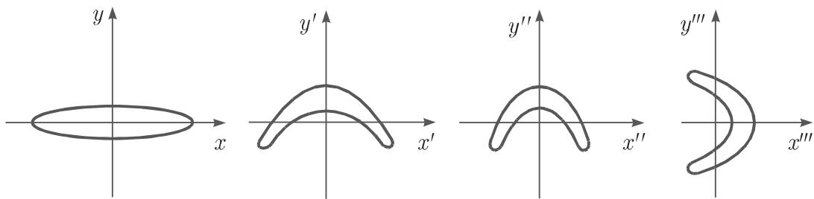

#### 17.1.1 动力系统

17.1.1.1 基本概念

1. 动力系统与轨道的概念

动力系统是数学上的一个概念，描述了物理、生物或其他现实系统随时间演化的情况．设 为相空间， 为时间参数，定义动力系统是一个单参数映射族 $\varphi ^ { t }$ $M  M .$ 在下面的讨论中，相空间一般取配，或贮的某一子集，或一个度量空间时间参数 的取值范围是 （时间连续系统），或是 z, $\mathbb { Z } _ { + }$ （时间离散系统）．进一步，对任意 $x \in M .$ ，我们要求

a) $\varphi ^ { 0 } ( x ) = x$ 并且

b) 对任意 t, s, 有 $\varphi ^ { t } ( \varphi ^ { s } ( x ) ) = \varphi ^ { t + s } ( x )$ ．映射 $\varphi ^ { 1 }$ 简记为 $\varphi$

以后时间集合记为 I'，那么 $\textstyle T = \mathbb { R } , T = \mathbb { R } _ { + } , T = \mathbb { Z }$ ，或者 $T = \mathbb { Z } _ { + }$ ．若 $T = \mathbb { R }$ 则该动力系统也称为流；若 $T = \mathbb { Z }$ 或 $T = \mathbb { Z } _ { + }$ ，则动力系统是离散的．在 $T = \mathbb { R }$ 或 $T = \mathbb { Z }$ 的情况下，因为对任意 $t \in T ,$ 性质 a) 和性质 b) 成立，所以逆映射$( \varphi ^ { t } ) ^ { - 1 } = \varphi ^ { - t }$ 也存在，该动力系统称为可逆动力系统

如果动力系统不可逆，那么对任意集合 $A \subset M$ 和任意 $t > 0 , \varphi ^ { - t } ( A )$ 表示集合 在映射 $\varphi ^ { t }$ 下的原像，即 $\varphi ^ { - t } ( A ) \ = \ \left\{ x \in M : \varphi ^ { t } ( x ) \in A \right\}$ ．若对任意$t \in T ( M \subset \mathbb { R } ^ { n } )$ ，映射 $\varphi ^ { t } : M \to M$ 连续或 阶连续可微，则称动力系统分别是连续的或是 $C ^ { k }$ 光滑的．

给定 $x \in M ,$ ，映射 $t \to \varphi ^ { t } ( x )$ 定义了动力系统中的一个运动，该运动当 $t = 0$ 时，初始值是 x. 为初始值的运动的像 $\gamma ( x )$ 称为 的轨道，即 $\gamma ( x ) = \{ \varphi ^ { t } ( x ) \} _ { t \in T }$ 类似地定义 $\gamma ^ { + } ( x ) = \{ \varphi ^ { t } ( x ) \} _ { t \geqslant 0 }$ 的正半轨．若 $T \neq \mathbb { R } _ { + }$ 或 $T \neq \mathbb { Z } _ { + }$ ，则定义$\gamma ^ { - } ( x ) = \{ \varphi ^ { t } ( x ) \} _ { t \leqslant 0 }$ 的负半轨．

若 $\gamma ( x ) = \{ x \}$ ｝，则称轨道 $\gamma ( x )$ 是稳态的（平衡点，不动点）．若存在 $T \in T , T >$ $0 ,$ 使得对任意 $t \in T ,$ 有 $\varphi ^ { t + T } ( x ) = \varphi ^ { t } ( x )$ 并且 $T \in T$ 是满足上述性质的最小整数，则称轨道 $\gamma ( x )$ 周期的．常数 称为周期

2. 微分方程的流

考虑微分方程

$$
\dot {x} = f (x),\tag{17.1}
$$

其中， $f : M \to \mathbb { R } ^ { n }$ （向量场）是 阶连续可微的， $M = \mathbb { R } ^ { n }$ 或者 是 $\mathbb { R } ^ { n }$ 中的开子集以后，在 $\mathbb { R } ^ { n }$ 采用欧儿里得范数，即对任意 $x \in \mathbb { R } ^ { n } , x = \left( x _ { 1 } , \cdot \cdot \cdot , x _ { n } \right)$ ，模$\| x \| = \sqrt { \sum _ { i = 1 } ^ { n } x _ { i } ^ { 2 } }$ 果将映射 写成分量形式 $f = \left( f _ { 1 } , \cdots , f _ { n } \right)$ ，则 (17.1) 是由标量微分方程 $\dot { x } _ { i } = f _ { i } ( x _ { 1 } , \cdot \cdot \cdot , x _ { n } ) , i = 1 , 2 , \cdot \cdot \cdot , n$ 构成的方程组．

根据微分方程解的存在唯一性定理（皮卡—林德勒夫定理）和解对初值的 阶可微性定理，我们有对任意 $x _ { 0 } \in M$ ，存在常数 $\varepsilon > 0 ,$ ，球面 $B _ { \delta } ( x _ { 0 } ) = \{ x : \| x - x _ { 0 } \| <$ $\delta \} \subset M$ 和映射 $\varphi : ( - \varepsilon , \varepsilon ) \times B _ { \delta } ( x _ { 0 } ) \to M$ ，使得

(1) $\varphi ( \cdot , \cdot )$ ）关千第一个变量（时间）是 $r + 1$ 阶连续可微的，关千第二个变量（相变量）是 阶连续可微的；

(2) 给定 $x \in B _ { \delta } ( x _ { 0 } ) , \varphi ( \cdot , x )$ 是方程 (17.1) 在时间区间 $( - \varepsilon , \varepsilon )$ 上，满足当$t = 0$ 时，初始值为 的局部唯一解，也就是说，对任意 $t \in ( - \varepsilon , \varepsilon )$ ，有 ${ \frac { \partial \varphi } { \partial t } } ( t , x ) =$ $\dot { \varphi } ( t , x ) = f ( \varphi ( t , x ) ) , \varphi ( 0 , x ) = x$ 并且任意一个当 $t = 0$ 时初始值为 的解在 ltl很小范围内与 $\varphi ( t , x )$ 重合．

假设方程 (17.1) 的每个局部解均可唯一延拓至整个记那么存在一个映射 $\varphi$ :$\mathbb { R } \times M \to M$ 满足下面的性质

(1) 对任意 $x \in M .$ 有 $\varphi ( 0 , x ) = x$

(2) 对任意 $t , s \in \mathbb { R } , x \in M$ 有 $\varphi ( t + s , x ) = \varphi ( t , \varphi ( s , x ) )$

(3) $\varphi ( \cdot , \cdot )$ ）关千第一个变量是 $r + 1$ 阶连续可微的，关千第二个变量是 阶连续可微的．

(4) 给定 $x \in M , \varphi ( \cdot , x )$ 是方程 (17.1) 在整个实数厌上的一个解

从而定义 $\varphi ^ { t } : = \varphi ( t , \cdot )$ 是由方程 (17.1) 诱导出的 $C ^ { r }$ 光滑流方程 (17.1)流的运动 $\varphi ( \cdot , x )$ ：厌一 称为积分曲线．

·方程

$$
\dot {x} = \sigma (y - x), \quad \dot {y} = r x - y - x z, \quad \dot {z} = x y - b z\tag{17.2}
$$

称为对流湍流的洛伦茨 (Lorenz) 系统（参见第 1153 17.2.4.3)．其中，参数 $\sigma >$ $0 , r > 0 , b > 0 . \ M = \mathbb { R } ^ { 3 }$ 上的 $C ^ { \infty }$ 流对应千洛伦茨系统

3. 离散动力系统

考虑差分方程

$$
x _ {t + 1} = \varphi (x _ {t}),\tag{17.3}
$$

也可记为 $x \to \varphi ( x )$ ．其中， $\varphi : M \to M$ 是连续映射，或者当 $M \subset \mathbb { R } ^ { n }$ 时， $\varphi : M \to$ $M$ 阶连续可微映射若 $\varphi$ 可逆，则通过 $\varphi$ 的迭代方程 (17.3) 可定义可逆离散动力系统具体地说，

当 $t > 0$ 时， $\varphi ^ { t } = \underbrace { \varphi \circ \cdots \circ \varphi } _ { t : \psi _ { \bar { x } } } ,$

当 $t < 0$ 时， ${ \boldsymbol { \varphi } } ^ { t } = \underbrace { { \boldsymbol { \varphi } } ^ { - 1 } \circ \cdots \circ { \boldsymbol { \varphi } } ^ { - 1 } } _ { - t \nmid x } , \quad { \boldsymbol { \varphi } } ^ { 0 } = i d .$

(17.4)

若 $\varphi$ 不可逆，则仅当 $t \geqslant 0$ 时，可定义映射 $\varphi ^ { t }$

：差分方程

$$
x _ {t + 1} = \alpha x _ {t} (1 - x _ {t}), \quad t = 0, 1, \dots\tag{17.5}
$$

称为逻辑斯谛(logistic) 方程，其中参数 $\alpha \in ( 0 , 4 ]$ ．这里， $M = [ 0 , 1 ]$ ，并且对给定的$\alpha , \varphi : [ 0 , 1 ] \to [ 0 , 1 ]$ 定义为 $\varphi ( x ) = \alpha x ( 1 - x )$ ．显然， $\varphi$ 中是无穷阶可微的，但是不可逆因此，方程 (17.5) 定义了一个不可逆动力系统

：差分方程

$$
x _ {t + 1} = y _ {t} + 1 - a x _ {t} ^ {2}, \quad y _ {t + 1} = b x _ {t}, \quad t = 0, \pm 1, \dots ,\tag{17.6}
$$

称为埃农(Henon) 映射，其中参数 $a > 0 , b \neq 0$ ．在方程 (17.6) 中，映射 $\varphi : \mathbb { R } ^ { 2 } \longrightarrow \mathbb { R } ^ { 2 }$ 定义为 $\varphi ( x , y ) = ( y + 1 - a x ^ { 2 } , b x )$ ．该映射无穷阶可微并且可逆．

4. 积收缩系统和保体积系统

$M \subset \mathbb { R } ^ { n }$ 的可逆动力系统 $\{ \varphi ^ { t } \} _ { t \in T }$ 称为体积收缩或耗散的（保体积或保守$6 9 )$ ），如果对任意具有正 维体积 $\mathrm { v o l } ( A )$ 的集合 $A \subset M ,$ 任意 $t > 0 ( t \in T )$ ，有$\operatorname { v o l } ( \varphi ^ { t } ( A ) ) < \operatorname { v a l } ( A ) \ ( \operatorname { v o l } ( \varphi ^ { t } ( A ) ) = \operatorname { v a l } ( A ) )$

■ A: 在方程 (17.3) 中，设 $\varphi$ 是 $C ^ { r }$ 微分同胚（即 $\varphi : { \cal M } \ : \longrightarrow \ : { \cal M }$ 可逆， $M \subset \mathbb { R } ^ { n }$ 是开集， $\varphi$ 和 $\varphi ^ { - 1 }$ 是 $C ^ { r }$ 光滑）．令 $D \varphi ( x )$ 是 $\varphi$ 在 $x \in M$ 处的雅可比矩阵若对任意 $x \in M , \ | \mathrm { d e t } D \varphi ( x ) | < 1$ ，则离散系统 (17.3) 是耗散系统若在$| \mathrm { d e t } D \varphi ( x ) | \equiv 1$ , 则离散系统 (17.3) 是保守系统

■ B: 对千系统 (17.6), $\begin{array} { r } { D \varphi ( x , y ) = \left( \begin{array} { c c } { - 2 a x } & { 1 } \\ { b } & { 0 } \end{array} \right) } \end{array}$ ，千是 $| \mathrm { d e t } D \varphi ( x , y ) | \equiv b$ ．因此，若 $| b | < 1$ ，系统 (17.6) 是耗散系统；若 $| b | = 1$ ，系统 (17.6) 是保守系统．

埃农映射可以分解成三个映射（图 17.1)：首先，保面积映射 $x ^ { \prime } = x , y ^ { \prime } = y +$ $1 - a x ^ { 2 }$ 将初始区域伸展和弯曲；然后，映射 $x ^ { \prime \prime } = b x ^ { \prime } , y ^ { \prime \prime } = y ^ { \prime }$ 将区域沿 $x ^ { \prime }$ 轴压缩（当 $| b | < 1 )$ ；最后，映射 $x ^ { \prime \prime \prime } = y ^ { \prime \prime } , y ^ { \prime \prime \prime } = x ^ { \prime \prime }$ 将区域以直线 $y ^ { \prime \prime } = x ^ { \prime \prime }$ 为轴作反射．

  
17.1

17.1.1.2 不变集

1. 极限集、 $\omega$ 极限集、吸收集

令 $\{ \varphi ^ { t } \} _ { t \in T }$ 上的动力系统若集合 $A \subset M$ 满足对任意 $t \in T$ ,$\varphi ^ { t } ( A ) = A$ ，则称 是 $\{ \varphi ^ { t } \}$ 的不变集若集合 $A \subset M$ 满足对任意 $t \geqslant 0 , t \in T$ 2有 $\varphi ^ { t } ( A ) \subset A$ ，则称 是 $\{ \varphi ^ { t } \}$ 的正向不变集．对任意 $x \in M , x$ 的轨道的 $\omega$ 极限集定义为下面的集合：

$$
\omega (x) = \{y \in M: \exists t _ {n} \in \Gamma , t _ {n} \rightarrow + \infty , \varphi^ {t _ {n}} (x) \rightarrow y \text {当} n \rightarrow + \infty \}.\tag{17.7}
$$

$\omega ( x )$ 中的点称为轨道的 $\omega$ 极限点．若动力系统是可逆的，则对任意 $x \in M$ ，集合

$$
\alpha (x) = \{y \in M: \exists t _ {n} \in \Gamma , t _ {n} \rightarrow - \infty , \varphi^ {t _ {n}} (x) \rightarrow y \text {当} n \rightarrow + \infty \}\tag{17.8}
$$

称为 的轨道的 极限集； $\alpha ( x )$ 中的点称为轨道的 $\alpha$ 极限点．

对千体积收缩的动力系统在相平而上存在一个有界集合使得随着时间的推移，到达此集合的条轨道将留在这个集合内．一个有界连通开集 $U \subset M$ 称为 $\{ \varphi ^ { t } \} _ { t \in T }$ 的吸收集，如果对任意 $t > 0 , t \in T ,$ ，有 $\varphi ^ { t } ( { \overline { { U } } } ) \subset U . ~ ( { \overline { { U } } }$ 表示 的闭包．）·考虑平面微分方程

$$
\dot {x} = - y + x (1 - x ^ {2} - y ^ {2}), \quad \dot {y} = x + y (1 - x ^ {2} - y ^ {2})\tag{17.9a}
$$

根据极坐标变换 $x = r \cos \theta , y = r \sin \theta$ , 方程 (17.9a) 满足当 $t = 0$ 时，初始状态为$( r _ { 0 } , v _ { 0 } )$ 的解具有下面的形式：

$$
r (t, r _ {0}) = [ 1 + (r _ {0} ^ {- 2} - 1) \mathrm{e} ^ {- 2 t} ] ^ {- 1 / 2}, \quad v (t, v _ {0}) = t + v _ {0}.\tag{17.9b}
$$

上述解的形式表明方程 (17.9a) 的流中存在周期为 $2 \pi$ 的周期轨，它可表示为勹$( ( 1 , 0 ) ) = \{ ( \cos t , \sin t ) , t \in [ 0 , 2 \pi ] \}$ ｝．点 的轨道的极限集是

$$
\alpha (p) = \left\{ \begin{array}{l l} {{(0, 0),}} & {{\| p \| <   1,}} \\ {{\gamma ((1, 0)),}} & {{\| p \| = 1,}} \\ {{\varnothing ,}} & {{\| p \| > 1}} \end{array} \right. \quad \text {和} \quad \omega (p) = \left\{ \begin{array}{l l} {{\gamma ((1, 0)),}} & {{p \neq (0, 0),}} \\ {{(0, 0),}} & {{p = (0, 0).}} \end{array} \right.
$$

对千系统 (17.9a) ，给定 $r > 1$ , 任意开集 $B _ { r } = \{ ( x , y ) : x ^ { 2 } + y ^ { 2 } < r ^ { 2 } \}$ 是吸收集．

2. 不变集的稳定性

是空间 $( M , \rho )$ 上动力系统 $\{ \varphi ^ { t } \} _ { t \in T }$ 的一个不变集若对 的任意邻域$U ,$ 存在 的另一个邻域 $U _ { 1 } \subset U _ { \mathsf { \Gamma } }$ ，使得对任意 $t > 0 ,$ ，有 $\varphi ^ { t } ( U _ { 1 } ) \subset U$ ，则称 是稳定的．设 是 $\{ \varphi ^ { t } \}$ 的不变集，若 是稳定的并且满足

$$
\exists \Delta > 0, \left. \begin{array}{l} {{\forall x \in M}} \\ {{\mathrm{dist} (x, A) <   \Delta}} \end{array} \right\}: \text {当} t \to + \infty , \text {有} \mathrm{dist} (\varphi^ {t} (x), A) \to 0,\tag{17.10}
$$

其中， $\operatorname { d i s t } ( x , A ) = \operatorname* { i n f } _ { y \in A } \rho ( x , y )$ ，则称 是渐近稳定的．

3. 紧致集

设 $( M , \rho )$ 是度量空间一族开集｛ $\{ U _ { i } \} _ { i \in I }$ 称为 的开覆盖，如果 中对任意一点都至少属千某个 $U _ { i }$ ．度量空间 $( M , \rho )$ 称为紧致的，如果任意 的开覆盖$\{ U _ { i } \} _ { i \in I }$ 都存在有限多个集合 $U _ { i _ { 1 } } , \cdots , U _ { i _ { r } }$ 使得 $M = U _ { i _ { 1 } } \cup \dots \cup U _ { i _ { \tau } }$ ．集合 $K \subset M$ 称为紧致的，如果 作为子空间是紧致的．

4. 吸引子、吸引域

设 $\{ \varphi ^ { t } \} _ { t \in T }$ 是 $( M , \rho )$ 上的动力系统 是 $\{ \varphi ^ { t } \}$ 的不变集．那么， $W ( A ) = \{ x \in$ $M : \omega ( x ) \subset A \}$ 称为 的吸引域紧致集 $\varLambda \subset M$ 称为 上动力系统 $\{ \varphi ^ { t } \} _ { t \in T }$ 的吸引子，如果 是 $\{ \varphi ^ { t } \}$ 的不变集，并且存在 的开邻域 $U$ ，使得对儿乎处处的（勒贝格测度意义下） $x \in U ,$ ，有 $\omega ( x ) = \varLambda$

$\pmb { \mathrm { u } } _ { \lambda } = \gamma ( ( 1 , 0 ) )$ 是方程 $\left( 1 7 . 9 \mathrm { a } \right)$ 中流的一个吸引子．其中， $W ( \varLambda ) = \mathbb { R } ^ { 2 } \backslash \{ ( 0 , 0 ) \}$ ．在某些动力系统中，吸引子有更广泛的含义．存在这样的不变集 ，它的任意邻域都含有周期轨，这些周期轨没有被 吸引，例如费根鲍姆 (Feigenbaum) 吸引子集合可能不仅由单个 $\omega$ 极限集组成．紧致集合 称为 上动力系统 $\{ \varphi ^ { t } \} _ { t \in T }$ 的米尔诺(Milnor) 吸引子，如果 是 $\{ \varphi ^ { t } \}$ 的不变集，并且 的吸引域包含一个正的勒贝格测度集
