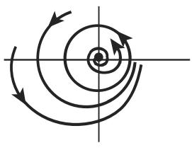
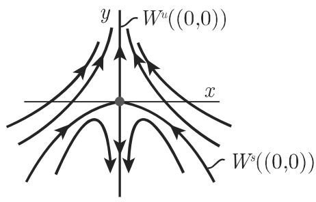
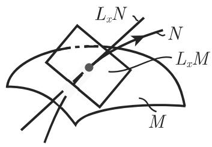
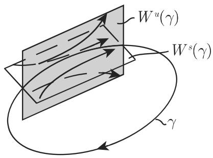
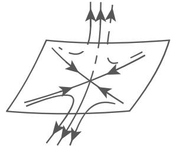
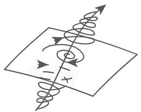
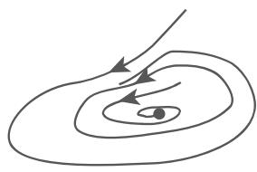
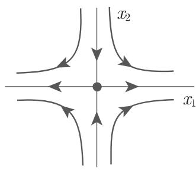

#### 17.1.2 常微分方程的定性理论

17.1.2.1 流的存在性，相空间结构

1. 解的延拓

微分方程 (17.1) 称为自治的．除了自治方程，还存在一类方程其右端项显式地依赖千时间，称为非自治方程，

$$
\dot {x} = f (t, x).\tag{17.11}
$$

令 $M \subset \mathbb { R } ^ { n } , f : \mathbb { R } \times M \to M$ 为 $C ^ { r }$ 映射引入新的变量 $x _ { n + 1 } : = t$ 方程 (17.11)可看作自治微分方程 $\dot { x } = f ( x _ { n + 1 } , x ) , \dot { x } _ { n + 1 } = 1$ . 方程 (17.11) $t _ { 0 }$ 。时刻，初始值为$x _ { 0 }$ 的解记为叭 $\varphi ( \cdot , t _ { 0 } , x _ { 0 } )$ ．为了证明方程 (17.1) 解的全局存在性和流的存在性，我们需要下面的定理

(1) 温特纳 (Wintner) 和康蒂 (Conti) 法则 若在方程 (17.1) $M = \mathbb { R } ^ { n }$ ，并且存在连续函数 $\omega : [ 0 , + \infty ) \to [ 1 , + \infty )$ ，使得对任意 $x \in \mathbb { R } ^ { n }$ ，有 $\| f ( x ) \| \leqslant \omega ( \| x \| )$ 和 $\int _ { 0 } ^ { + \infty } \frac { 1 } { \omega ( r ) } \mathrm { d } r = + \infty$ 成立，那么方程 (17.1) 的解可延拓至整个 $\mathbb { R } _ { + }$

·例如，下面的函数满足温特纳和康蒂法则： $\omega ( r ) = C r + 1$ 或 $\omega ( r ) = C r | \ln r | + 1$ 其中常数 $C > 0$

(2) 延拓法则 若随着时间增加，方程 (17.1) 的一个解始终有界，则该解可延拓至整个区＋·

假设：在下面的讨论中，我们总是假设方程 (17.1) 的流是存在的．

2. 相图

a) 若 $\varphi ( t )$ 是方程 (17.1) 的解，则对任意常数 $c ,$ ，函数 $\varphi ( t + c )$ 也是解．

b) 方程 (17.1) 的任意两条轨线或者没有交点或者重合．因此，方程 (17.1)相空间可分解成不相交的轨线．将相空间分解为不相交的轨线称为相图．

c) 不同千稳态解，每条轨线都是正则光滑的曲线它可能闭合，也可能不闭合

3. 刘维尔定理

设 $\{ \varphi ^ { t } \} _ { t \in \mathbb { R } }$ 是方程 (17.1) 的流， $D \subset M \subset \mathbb { R } ^ { n }$ 任意一个有界可测集， $D _ { t } : =$ $\varphi ^ { t } ( D ) , V _ { t } : = \mathrm { v o l } ( D _ { t } )$ 是 $D _ { t }$ 维体积（图 17.2)．那么，对任意 $t \in \mathbb { R }$ ， ${ \frac { \mathrm { d } } { \mathrm { d } t } } V _ { t } =$ $\int _ { D _ { t } } \mathrm { d i v } f ( x ) \mathrm { d } x$ .当 $n = 3$ 时刘维尔定理形式如下：

$$
\frac {\mathrm{d}}{\mathrm{d} t} V _ {t} = \iint_ {D _ {t}} \operatorname{div} f (x _ {1}, x _ {2}, x _ {3}) \mathrm{d} x _ {1} \mathrm{d} x _ {2} \mathrm{d} x _ {3}\tag{17.12}
$$

  
(a)

  
17.2  
(b)

推论 若方程 (17.1) 中在 $\operatorname { d i v } f ( x ) < 0$ 则方程 (17.1) 的流是体积收缩的若在 $\operatorname { d i v } f ( x ) \equiv 0$ 则方程 (17.1) 的流是保体积的．

■ A: 对千洛伦茨系统 (17.2) ，有 $\operatorname { d i v } f ( x , y , z ) \equiv - ( \sigma + 1 + b )$ ．因为 $\sigma > 0 , b > 0$ 所以 $\mathrm { d i v } f ( x , y , z ) \ : < \ : 0$ . 由刘维尔定理，对任意有界可测集 $D \subset \mathbb { R } ^ { 3 }$ ，有 ${ \frac { \mathrm { d } } { \mathrm { d } t } } V _ { t } =$ $\int \int \int _ { D _ { t } } - ( \sigma + 1 + b ) \mathrm { d } x _ { 1 } \mathrm { d } x _ { 2 } \mathrm { d } x _ { 3 } = - ( \sigma + 1 + b ) V _ { t }$ .线性微分方程 $\dot { V } _ { t } = - ( \sigma + 1 + b ) V _ { t }$ 的解是 $V _ { t } = V _ { 0 } \cdot \mathrm { e } ^ { - ( \sigma + 1 + b ) t }$ ，千是，当 $t \to + \infty$ 时有 $V _ { t } \longrightarrow 0$

：令 $U \subset \mathbb { R } ^ { n } \times \mathbb { R } ^ { n }$ 是开子集， $H : U $ 厌是 $C ^ { 2 }$ 函数．那么， ${ \dot { x } } _ { i } = { \frac { \partial H } { \partial y _ { i } } } ( x , y ) , { \dot { y } } _ { i } =$ $- { \frac { \partial H } { \partial x _ { i } } } ( x , y ) \quad ( i = 1 , 2 , \cdot \cdot \cdot , n )$ 称为哈密顿微分方程函数 称为系统的哈密顿函数若 表示此微分方程的右端项则 $\operatorname { d i v } f ( x , y ) = \sum _ { i = 1 } ^ { n } \left[ { \frac { \partial ^ { 2 } H } { \partial x _ { i } \partial y _ { i } } } ( x , y ) - { \frac { \partial ^ { 2 } H } { \partial y _ { i } \partial x _ { i } } } \right.$ $( x , y ) \Bigg ] \equiv 0$ 千是，哈密顿微分方程是保体积的．

17.1.2.2 线性微分方程

1. 基本陈述

令 $\pmb { A } ( t ) = [ a _ { i j } ( t ) ] _ { i , j = 1 } ^ { n }$ 是照上矩阵函数，其中，分最 $a _ { i j }$ ：厌一照是连续函数．：股一贮是股上连续向量函数．那么，

$$
\dot {x} = A (t) x + b (t)\tag{17.13a}
$$

称为 $\mathbb { R } ^ { n }$ 非齐次一阶线性微分方程；

$$
\dot {x} = A (t) \boldsymbol {x}\tag{17.13b}
$$

称为对应的齐次一阶线性微分方程．

(1) 齐次线性微分方程组的基本定理 方程 (17.13a) 的任一解在整个股上存在方程 (17.13b) 的所有解全体构成厌上 $C ^ { 1 }$ 光滑向量函数空间的一个 维向量子空间 $L _ { H }$

(2) 非齐次线性微分方程组的基本定理 方程 (17.13a) 的所有解全体构成上 $C ^ { 1 }$ 光滑向量函数空间的一个 维仿射向量子空间 $L _ { I } = \varphi _ { 0 } + L _ { H }$ ，其中 $\varphi _ { 0 }$ 是方程 (17.13a) 的任意解

令 $\varphi _ { 1 } , \cdots \varphi _ { n }$ 九是方程 (17.13b) 的解， $\varPhi = ( \varphi _ { 1 } , \cdots , \varphi _ { n } )$ ）是对应的解矩阵．那么，$\varPhi$ 在厌上满足矩阵微分方程 Z $\dot { \boldsymbol { \zeta } } ( t ) = \boldsymbol { A } ( t ) \boldsymbol { Z } ( t )$ ，其中 $Z \in \mathbb { R } ^ { n \cdot n }$ ．若解 $\varphi _ { 1 } , \cdots , \varphi _ { n }$ 九是$L _ { H }$ 中一组基，则 $\varPhi = ( \varphi _ { 1 } , \cdots , \varphi _ { n } )$ ）称为方程 (17.13b) 的基解矩阵． $W ( t ) = \mathrm { d e t } \varPhi ( t )$ 称为方程 (17.13b) 关千解矩阵 $\varPhi$ 的朗斯基行列式．刘维尔公式如下：

$$
\dot {W} (t) = \mathrm{rank} A (t) W (t) \quad (t \in \mathbb {R}).\tag{17.13c}
$$

对任意解矩阵，或者在厌上 $W ( t ) \equiv 0$ 或者对任意 $t \in \mathbb { R } , W ( t ) \neq 0 . \varphi _ { 1 } , \cdot \cdot \cdot , \varphi _ { n }$ 九是$L _ { H }$ 一组基当且仅当在某时刻 （因此，在任意时刻 t)，有det $( \varphi _ { 1 } ( t ) , \cdot \cdot \cdot , \varphi _ { n } ( t ) ) \not = 0$

(3) 常数变异法令 $\varPhi$ 是方程 (17.13b) 的任意基解矩阵那么，方程 (17.13a)满足当 $t = \tau$ 时初始值为 $p$ 的解 $\varphi$ 可表示为

$$
\varphi = \Phi (t) \Phi (\tau) ^ {- 1} p + \int_ {\tau} ^ {t} \Phi (t) \Phi (s) ^ {- 1} b (s) \mathrm{d} s \quad (t \in \mathbb {R}).\tag{17.13d}
$$

2. 自治线性微分方程组

考虑微分方程

$$
\dot {x} = A x,\tag{17.14}
$$

其中， $( n , n )$ 型的常数矩阵矩阵 的算子范数定义为 $\| A \| = \operatorname* { m a x } \{ \| A x \| , x \in$ $\mathbb { R } ^ { n } , \| x \| \leqslant 1 \}$ ，其中，厌九中的向量取欧几里得范数．

令A和B是 $( n , n )$ 型的矩阵那么，

a) $\| A + B \| \leqslant \| A \| + \| B \| .$ I

b) $\| \lambda A \| = | \lambda | \| A \| ( \lambda \in \mathbb { R } )$ n

c) $\| A x \| \leqslant \| A \| \| x \| ( x \in \mathbb { R } ^ { n } )$ ；

cl) $\| A B \| \leqslant \| A \| \| B \|$ 1;

e) $\| A \| = { \sqrt { \lambda _ { \operatorname* { m a x } } } }$ 其中， $\lambda _ { \mathrm { m a x } }$ 是 $A ^ { \mathrm { T } } A$ 的最大特征值．

方程 (17.14) 满足当 $t = 0$ 时初始值为 $E _ { n }$ 基解矩阵是矩阵指数函数

$$
\mathrm{e} ^ {A t} = E _ {n} + \frac {A t}{1 !} + \frac {A ^ {2} t ^ {2}}{2 !} + \dots = \sum_ {i = 0} ^ {\infty} \frac {A ^ {i} t ^ {i}}{i !}.\tag{17.15}
$$

其满足下面的性质：

a) 在任意紧致时间区间上变化时， $\mathrm { e } ^ { \ b { A } t }$ 的级数是一致收敛的．对固定 $t , \mathrm { e } ^ { A t }$ 的级数是绝对收敛的．

b) $\| \mathrm { e } ^ { A t } \| \leqslant \mathrm { e } ^ { \| A \| t } ( t \geqslant 0 )$ );

$$
\mathrm{c)} \frac {\mathrm{d}}{\mathrm{d} t} (\mathrm{e} ^ {A t}) = (\mathrm{e} ^ {A t}) ^ {\cdot} = A \mathrm{e} ^ {A t} = \mathrm{e} ^ {A t} A (t \in \mathbb {R});
$$

d) $\mathrm { e } ^ { ( t + s ) A } = \mathrm { e } ^ { t A } \mathrm { e } ^ { s A } ( s , t \in \mathbb { R } )$ );

e) 对任意 $t , \mathrm { e } ^ { A t }$ 是正则的，并且 $( \mathrm { e } ^ { \boldsymbol { A } t } ) ^ { - 1 } = \mathrm { e } ^ { - \boldsymbol { A } t }$ \

f) A,B $( n , n )$ 型的可交换矩阵，即 $A B = B A$ ，则 $B  { \mathrm { e } } ^ { A } =  { \mathrm { e } } ^ { A } B$ ，并且$\mathrm { e } ^ { \boldsymbol { A } + \boldsymbol { B } } = \mathrm { e } ^ { \boldsymbol { A } } \mathrm { e } ^ { \boldsymbol { B } }$ ;

g) A,B $( n , n )$ 型的矩阵，并且 是正则的，则 $ { \mathrm { e } } ^ { B A B ^ { - 1 } } = B  { \mathrm { e } } ^ { A } B ^ { - 1 }$

3. 周期系数的线性微分方程

考虑齐次线性微分方程 (17.13b)，其中 $A ( t ) = [ a _ { i j } ( t ) ] _ { i , j = 1 } ^ { n }$ 周期矩阵函数，即 $a _ { i j } ( t ) = a _ { i j } ( t + T ) \quad ( \forall t \in \mathbb { R } , i , j = 1 , \cdot \cdot \cdot , n )$ ．该情形下，方程 (17.13b) 称为周期线性微分方程．方程 (17.13b) 的任意基解矩阵中可表示为 $\varPhi ( t ) = G ( t ) \mathrm { e } ^ { t R }$ 其中， $G ( t )$ 是光滑的，正则的 周期矩阵函数， $( n , n )$ 型的常数矩阵（弗洛(Floquet) 定理）．

$\varPhi ( t )$ 周期微分方程 (17.13b) 的基解矩阵，且在 = 处正则化，即$\varPhi ( 0 ) = E _ { n }$ 九．根据弗洛凯定理有形式 $\varPhi ( t ) = G ( t ) \mathrm { e } ^ { t R }$ \_ 矩阵 $\varPhi ( T ) = \mathrm { e } ^ { R T }$ 称为方程(17.13b) 的单值矩阵 ; $\varPhi ( T )$ 的特征值 $\rho _ { j }$ 称为方程 (17.13b) 的乘子． $\rho \in \mathbb { C }$ 是方(17.13b) 的乘子当且仅当存在方程 (17.13b) 的一个解 $\varphi \not \equiv 0$ 使得 $\varphi ( t + T ) =$ $\rho \varphi ( t ) ( t \in \mathbb { R } )$

17.1.2.3 稳定性理论

1. 李雅普诺夫稳定性与轨道稳定性

考虑非自治微分方程 (17.11) ．方程 (17.11) 的解 $\varphi ( t , t _ { 0 } , x _ { 0 } )$ 称为李雅普诺夫意义下稳定，如果

$$
\left. \begin{array}{l} \forall t _ {1} \geqslant t _ {0}, \quad \forall \varepsilon > 0, \quad \exists \delta = \delta (\varepsilon , t _ {1}), \qquad \forall x _ {1} \in M \\ \| x _ {1} - \varphi (t _ {1}, t _ {0}, x _ {0}) \| <   \delta \\ \| \varphi (t, t _ {1}, x _ {1}) - \varphi (t, t _ {0}, x _ {0}) \| <   \varepsilon , \quad t \geqslant t _ {1}. \end{array} \right\}:\tag{17.16a}
$$

解 $\varphi ( t , t _ { 0 } , x _ { 0 } )$ 称为李雅普诺夫意义下渐近稳定，如果该解是稳定的，并且

$$
\begin{array}{r l} & {\forall t _ {1} \geqslant t _ {0}, \quad \exists \Delta = \Delta (t _ {1}), \qquad \forall x _ {1} \in M} \\ & {\| x _ {1} - \varphi (t _ {1}, t _ {0}, x _ {0}) \| <   \Delta} \\ & {\| \varphi (t, t _ {1}, x _ {1}) - \varphi (t, t _ {0}, x _ {0}) \| \to 0 \quad \text {当} t \to + \infty .} \end{array}\tag{17.16b}
$$

对千自治微分方程 (17.1)，除了李雅普诺夫稳定性，还有一些其他重要的稳定性概念方程 (17.1) 的解 $\varphi ( t , x _ { 0 } )$ 称为轨道稳定（渐近轨道稳定），如果轨道 $\gamma ( x _ { 0 } ) =$ $\{ \varphi ( t , x _ { 0 } ) , t \in \mathbb { R } \}$ ｝作为不变集是稳定的（渐近稳定的）．方程 (17.1) 平衡点对应的解是李雅普诺夫稳定的当且仅当它是轨道稳定的．对千方程 (17.1) 的周期解，两种稳定性的类型是不同的．

·给定 $\mathbb { R } ^ { 3 }$ 上的一个流它的不变集是环面 $T ^ { 2 }$ ．在局部直角坐标系中，该流可表示为 $\dot { \Theta } _ { 1 } = 0 , \dot { \Theta } _ { 2 } = f _ { 2 } ( \Theta _ { 1 } )$ ，其中， $f _ { 2 }$ ：厌一匣是 $2 \pi$ 周期的光滑函数，满足

$$
\left. \begin{array}{l l} {{\forall \Theta_ {1} \in \mathbb {R},}} & {{\exists U _ {\Theta_ {1}} (\Theta_ {1} \text {的邻域}), \qquad \forall \delta_ {1}, \delta_ {2} \in U _ {\Theta_ {1}}}} \\ {{\delta_ {1} \neq \delta_ {2}}} & {} \end{array} \right\}: f _ {2} (\delta_ {1}) \neq f _ {2} (\delta_ {2}).
$$

满足初始条件 $( \theta _ { 1 } ( 0 ) , \theta _ { 2 } ( 0 ) )$ ）的解在环面上可表示为

$$
\Theta_ {1} (t) \equiv \Theta_ {1} (0), \quad \Theta_ {2} (t) = \Theta_ {2} (0) + f _ {2} (\Theta_ {1} (0)) t \quad (t \in \mathbb {R}).
$$

从上述表达式可以看出，任意解是轨道稳定的，但不是李雅普诺夫稳定的．

2. 李雅普诺夫渐近稳定性定理

标量函数 在点 $p \in M \subset \mathbb { R } ^ { n }$ 的邻域 内是正定的，如果：

(1) $V : U \subset M \to$ + IR 连续

(2) 对任意 $x \in U \backslash \{ p \}$ ，有 $V ( x ) > 0$ 并且 $V ( p ) = 0$

令 $U \subset M$ 是开集， $V : U  \mathbb { R }$ 是连续函数．函数 称为方程 (17.1) $U$ 内的李雅普诺夫函数，如果对千解 $\varphi ( t ) \in U , V ( \varphi ( t ) )$ 是非增函数．令 $V : U $ 匣是方程 (17.1) 的李雅普诺夫函数，并且 在点 的邻域 内是正定的．那么， 是稳定的．如果对千方程 (17.1) 满足 $\varphi ( t , x ) \in U ( t \geq 0 )$ 的解 $\varphi$ p' 条件$V ( \varphi ( t , x _ { 0 } ) ) = \mathrm { c o n s t a n t } ( t \geqslant 0 )$ （也就是说，李雅普诺夫函数沿着完整轨道等千常值）总蕴含着 $\varphi ( t , x _ { 0 } ) \equiv p _ { : }$ ，那么，该轨道一定是平衡点并且平衡点 $p$ 是渐近稳定的．·点 (0,0) 是平面微分方程 $\mathbf { \Phi } = \mathbf { \Phi } y , \dot { y } \mathbf { \Phi } = \mathbf { \Phi } - x \mathbf { \Phi } - x ^ { 2 } y$ 的平衡点． 函数 $V ( x , y ) =$ $x ^ { 2 } + y ^ { 2 }$ 在点 (0,0) 的任意邻域是正定的，并且沿任意满足 $x ( t ) y ( t ) \neq 0$ 的解，导数$\frac { \mathrm { d } } { \mathrm { d } t } V ( x ( t ) , y ( t ) ) = - 2 x ( t ) ^ { 2 } y ( t ) ^ { 2 } < 0$ . 因此，（0,0) 是渐近稳定的．

3. 稳态解的分类和稳定性

令 $x _ { 0 }$ 是方程 (17.1) 的平衡点．在特定假设下，方程 (17.1) $x _ { 0 }$ 的邻域内轨道的局部性质可由变分方程 ${ \dot { y } } = D f ( x _ { 0 } ) y$ 描述，其中 $D f ( x _ { 0 } )$ 是f在 $x _ { 0 }$ 的雅可比矩阵若 $D f ( x _ { 0 } )$ 没有特征值 $\lambda _ { j }$ 满足 $\operatorname { R e } \lambda _ { j } = 0$ , 则平衡点 $x _ { 0 }$ 称为双曲的．若

$D f ( x _ { 0 } )$ 恰好有 个负实部的特征值和 $k = n - 1 - m$ 个正实部的特征值，则称双曲平衡点 $x _ { 0 }$ 是 $( m , k )$ 型的 $( m , k )$ 型的双曲平衡点称为汇，如果 $m = n ;$ 称为源，如果 $k = n ;$ 称为鞍点，如果 $m \neq 0$ 并且 $k \neq 0 ($ （图 17.3)．汇是渐近稳定的；源和鞍点是不稳定的（一阶近似的稳定性定理）．在双曲平衡点的三种基本拓扑类型内（汇，源，鞍点），还有进一步的代数分类汇（源）称为稳定结点（不稳定结点），如果雅可比矩阵的特征值都是实的；称为稳定焦点（不稳定焦点），如果雅可比矩阵有虚部非零的特征值．当 n=3 时鞍点可分为鞍结点和鞍焦点

  
17.3

4. 周期轨的稳定性

设 $\varphi ( t , x _ { 0 } )$ 是方程 (17.1) 周期解，其轨道是 $\gamma ( x _ { 0 } ) = \{ \varphi ( t , x _ { 0 } ) , t \in [ 0 , T ] \}$ 在特定假设下， $\gamma ( \boldsymbol { x } _ { 0 } )$ 某个邻域的相图可由变分方程 $\dot { y } = D f ( \varphi ( t , x _ { 0 } ) ) y$ 描述．因为 $A ( t ) = D f ( \varphi ( t , x _ { 0 } ) )$ 是 $( n , n )$ 型的 周期连续矩阵函数，根据弗洛凯定理，变分方程的基解矩阵 $\varPhi _ { x _ { 0 } } ( t )$ 可记为 $\varPhi _ { x _ { 0 } } = G ( t ) \mathrm { e } ^ { R t }$ \ 其中， 周期正则光滑矩阵函数，满足 $G ( 0 ) \ = \ E _ { n } , \ R$ 为 $( n , n )$ 型的常数矩阵，其表示不唯一．矩阵$\varPhi _ { x _ { 0 } } ( T ) = \mathrm { e } ^ { R T }$ 称为周期轨 $\scriptstyle { \mathcal { N } } ( x _ { 0 } )$ 的单值矩阵， $\mathrm { e } ^ { R T }$ 的特征值 $\rho _ { 1 } , \cdots , \rho _ { n }$ 称为周期轨 $\gamma ( \boldsymbol { x } _ { 0 } )$ 的乘子．若轨道 $\gamma ( \boldsymbol { x } _ { 0 } )$ 可由其他解 $\varphi ( t , x _ { 1 } )$ 表示，即 $\gamma ( x _ { 0 } ) = \gamma ( x _ { 1 } )$ ，则$\gamma ( \boldsymbol { x } _ { 0 } )$ 和 $\gamma ( x _ { 1 } )$ 的乘子相同一个周期轨总含有等千 的乘子（安德罗诺夫—维特定理）．令 $\rho _ { 1 } , \cdot \cdot \cdot , \rho _ { n - 1 } , \rho _ { n } = 1$ 是周期轨 $\gamma ( \boldsymbol { x } _ { 0 } )$ 的乘子，令 $\varPhi _ { x _ { 0 } } ( T )$ 是 $\gamma ( \boldsymbol { x } _ { 0 } )$ 的单值矩阵那么

$$
\begin{array}{r l} { \sum_ {j = 1} ^ {n} \rho_ {j}   =   \mathrm{Tr} \varPhi_ {x _ {0}} (T) \quad \text {并且} \quad  \prod_ {j = 1} ^ {n} \rho_ {j}   =   \mathrm{det}   \varPhi_ {x _ {0}} (T)   =   \exp \biggl (\int_ {0} ^ {T}   \mathrm{Tr} D f (\varphi (t, x _ {0})) \mathrm{d} t \biggr)} \\ & {\qquad \qquad \qquad \qquad \qquad =   \exp \biggl (\int_ {0} ^ {T}   \mathrm{div} f (\varphi (t, x _ {0})) \mathrm{d} t \biggr),} \end{array}\tag{17.17}
$$

其中，若 n=2，则 $\rho _ { 2 } = 1 , \rho _ { 1 } = \exp \left( \int _ { 0 } ^ { T } \mathrm { d i v } f ( \varphi ( t , x _ { 0 } ) ) \mathrm { d } t \right)$

·令 $\varphi ( t , ( 1 , 0 ) ) = ( \cos { t } , \sin { t } )$ 是方程 (17.9a) 的加周期解．该解变分方程的矩阵$A ( t )$ 为

$$
A (t) = D f (\varphi (t, (1, 0))) = \left( \begin{array}{c c} - 2 \cos^ {2} t & - 1 - \sin 2 t \\ 1 - \sin 2 t & - 2 \sin^ {2} t \end{array} \right).
$$

t=O 处正则化的基解矩阵 $\varPhi _ { ( 1 , 0 ) } ( t )$ 为

$$
\varPhi_ {(1, 0)} (t) = \left( \begin{array}{c c} \mathrm{e} ^ {- 2 t} \cos t & - \sin t \\ \mathrm{e} ^ {- 2 t} \sin t & \cos t \end{array} \right) = \left( \begin{array}{c c} \cos t & - \sin t \\ \sin t & \cos t \end{array} \right) \left( \begin{array}{c c} \mathrm{e} ^ {- 2 t} & 0 \\ 0 & 1 \end{array} \right),
$$

其中，最后一个乘法是 $\varPhi _ { ( 0 , 1 ) } ( t )$ 的弗洛凯表示．因此 $\rho _ { 1 } = \mathrm { e } ^ { - 4 \pi } , \rho _ { 2 } = 1$ . 乘子可不采用弗洛凯表示来确定．对千方程 (17.9a)，有 $\operatorname { d i v } f ( x , y ) = 2 - 4 x ^ { 2 } - 4 y ^ { 2 }$ 气从而$\operatorname { d i v } f ( \cos t , \sin t ) \equiv - 2$ . 根据上述公式 $\rho _ { 1 } = \exp \left( \int _ { 0 } ^ { 2 \pi } - 2 \mathrm { d } t \right) = \exp ( - 4 \pi )$

5. 周期轨的分类

若方程 (I7.1) 的周期轨？在复平面单位圆周上除了 $\rho _ { n } = 1$ 没有其他乘子，则勹称为双曲的．双曲周期轨是 $( m , k )$ 型的，如果在单位圆周内部有 个乘子，在单位圆周外部有 $k = n - 1 - m$ 个乘子．若 $m > 0$ 并且 $k > 0$ ，则 $( m , k )$ 型的周期轨称为鞍点

根据安德罗诺夫—维特 (Andronov-Witt) 定理方程 (I 7.1) $( n - 1 , 0 )$ 型的双曲周期轨 $\gamma$ 是渐近稳定的． $k > 0$ 的 $( m , k )$ 型双曲周期轨是不稳定的．

■ A: 平面上乘子为 $\rho _ { 1 }$ 和 $\rho _ { 2 } = 1$ 的周期轨 $\gamma = \{ \varphi ( t ) , t \in [ 0 , T ] \}$ 是渐近稳定的，如果 $| \rho _ { 1 } | < 1$ , $\int _ { 0 } ^ { T } \mathrm { d i v } f ( \varphi ( t ) ) \mathrm d t < 0$

：若在复单位圆周上除了 $\rho _ { n } = 1$ 还有其他乘子，则不能应用安德罗诺夫—维特定理仅根据乘子的信息无法进行周期轨的稳定性分析．

■ C: 例如，设平面方程组 $\dot { x } = - y + x f ( x ^ { 2 } + y ^ { 2 } ) , \dot { y } = x + y f ( x ^ { 2 } + y ^ { 2 } )$ ，其中光滑函数 $f : ( 0 , + \infty ) \to \mathbb { R }$ 满足 $f ( 1 ) = f ^ { \prime } ( 1 ) = 0$ ，并且对任意 $r \neq 1 , r > 0$ ,$f ( r ) ( r - 1 ) < 0$ . 显然， $, \varphi ( t ) = ( \cos t , \sin t )$ 是该方程组的加周期解，并且

$$
\Phi_ {(1, 0)} (t) = \left( \begin{array}{c c} \cos t & - \sin t \\ \sin t & \cos t \end{array} \right) \left( \begin{array}{c c} 1 & 0 \\ 0 & 1 \end{array} \right)
$$

是基解矩阵的弗洛凯表示．从而，有 $\rho _ { 1 } = \rho _ { 2 } = 1$ ．利用极坐标，得 $\dot { r } = r f ( r ^ { 2 } ) , \dot { v } = 1$ 该形式表明周期轨 $\gamma ( ( 1 , 0 ) )$ ）是渐近稳定的．

6. 极限集、极限环的性质

当 $M \subset \mathbb { R } ^ { n }$ ，微分方程 (17.1) 中流的 极限集和 $\omega$ 极限集有下列性质．令$x \in M$ 为任意一点那么：

a) 集合 $\alpha ( x )$ 和 $\omega ( x )$ 都是闭集

b) 若 $\gamma ^ { + } ( x )$ （相应地 $\gamma ^ { - } ( x ) )$ 是有界集，则 $\omega ( x ) \neq \emptyset$ （相应地 $\alpha ( x ) \neq \varnothing )$ ．进一步，在这种情形下， $\omega ( x )$ （相应地 $\alpha ( x ) )$ ）是方程 (17.1) 中流的不变连通集

·例如若 $\gamma ^ { + } ( x )$ 不是有界的，则 $\omega ( x )$ 不一定连通（图 17.4).

对千平面自治微分方程 (17.1) （即 $M \subset \mathbb { R } ^ { 2 } )$ ，有庞加莱—本迪克松 (Poincare-Bendixson) 定理

庞加莱一本迪克松定理 令 $\varphi ( \cdot , p )$ 是方程 (17.1) 的非周期解， $\gamma ^ { + } ( p )$ 是有界集若 $\omega ( p )$ 不包含方程 (17.1) 的平衡点则 $\omega ( x )$ 是方程 (17.1) 的周期轨

因此，对千平面自治微分方程除了平衡点或周期轨，不存在更复杂的吸引子．

  
(a)

  
(b)  
17.4

  
(c)

方程 (17.1) 的周期轨？ $\gamma$ 称为极限环，如果存在 $x \not \in \gamma$ 使得或者 $\gamma \subset \omega ( x )$ ，或者 $\gamma \subset \alpha ( x )$ ．一个极限环称为稳定的极限环，如果存在 $\gamma$ 的某个邻域 u, 使得对任意 $x \in U$ ，有 $\gamma = \omega ( x )$ ．一个极限环称为不稳定的极限环，如果存在 $\gamma$ 的某个邻域$U$ ，使得对任意 $x \in U ,$ ，有 $\gamma = \alpha ( x )$

■ A: 在方程 (17.9a) 的流中，周期轨 $\gamma = \{ ( \cos t , \sin t ) , t \in [ 0 , 2 \pi ) \}$ ｝满足对任意$p \neq ( 0 , 0 )$ ，有 $\gamma = \omega ( p )$ ．因此， $U = \mathbb { R } ^ { 2 } \backslash \{ ( 0 , 0 ) \}$ 是 $\gamma$ 的邻域使得？ $\gamma$ 稳定极限环．■ B: 相反地对千线性微分方程 ${ \dot { x } } = - y , { \dot { y } } = x$ ，轨线 $\gamma = \{ ( \cos t , \sin t ) , t \in [ 0 , 2 \pi ] \}$ 是周期轨，但不是极限环．

7. 维嵌入不变环面

微分方程 (17.1) 可能存在 维的不变环面． 嵌入到相平面 $M \subset \mathbb { R } ^ { n }$ 的$m$ 维环面 $T ^ { m }$ 定义为一个可微映射 $g : \mathbb { R } ^ { m } \implies \mathbb { R } ^ { n }$ ，满足函数 $( \theta _ { 1 } , \cdots , \theta _ { m } ) \ $ $g ( \theta _ { 1 } , \cdots , \theta _ { m } )$ 对每个坐标 $\Theta _ { i }$ 都是 $2 \pi$ 期的．

·在简单情形下，方程 (17.1) 在环面上的运动可表示为直角坐标系下的微分方程$\dot { \Theta } _ { i } = w _ { i } ( i = 1 , 2 , \cdot \cdot \cdot , m )$ ．该方程组满足 $t = 0$ 时，初始值为 $( \theta _ { 1 } ( 0 ) , \cdots , \theta _ { m } ( 0 ) )$ 的解是 $\theta _ { i } ( t ) = \omega _ { i } t + \theta _ { i } ( 0 ) ( i = 1 , 2 , . . m ; t \in \mathbb { R } )$ ）．连续函数 $f$ : 厌一厌九称为拟周期函数，如果 可表示为 $f ( t ) = g ( \omega _ { 1 } t , \omega _ { 2 } t , \cdot \cdot \cdot , \omega _ { n } t )$ ，其中， $g$ 也是一个可微函数，满足对任意分量是坛周期的，并且频率 $\omega _ { i }$ 是不可约的，即不存在这样的整数 $n _ { i }$ ，使得 $\sum _ { i = 1 } ^ { m } n _ { i } ^ { 2 } > 0$ 且 $n _ { 1 } \omega _ { 1 } + \cdot \cdot \cdot + n _ { m } \omega _ { m } = 0$

17.1.2.4 不变流形

1. 定义、分界面

设？ $\gamma$ 是方程 (17.1) 的双曲平衡点或者双曲周期轨． $\gamma$ 的稳定流形 $W ^ { s } ( \gamma )$ （相应地不稳定流形 $W ^ { u } ( \gamma ) )$ ）是相空间上当 $t \to + \infty$ (相应地 $t \to - \infty )$ 时轨道收敛到 $\gamma$ 的所有点的集合：

$$
W ^ {s} (\gamma) = \{x \in M: \omega (x) = \gamma \}, W ^ {u} (\gamma) = \{x \in M: \alpha (x) = \gamma \},\tag{17.18}
$$

稳定流形和不稳定流形也称为分界面．

·在平面上，考虑微分方程

$$
\dot {x} = - x, \quad \dot {y} = y + x ^ {2}.\tag{17.19a}
$$

方程 (17.19a) 满足 t=O 时初值为 $( x _ { 0 } , y _ { 0 } )$ 的解有显式表达

$$
\varphi (t, x _ {0}, y _ {0}) = \left(\mathrm{e} ^ {- t} x _ {0}, \mathrm{e} ^ {t} y _ {0} + \frac {x _ {0} ^ {2}}{3} (\mathrm{e} ^ {t} - \mathrm{e} ^ {- 2 t})\right).\tag{17.19b}
$$

方程 (17.19a) 中平衡点 (0,0) 的稳定流形和不稳定流形为

$$
\begin{array}{r l} & {{W ^ {s} ((0, 0)) = \left\{(x _ {0}, y _ {0}): \lim _ {t \to + \infty} \varphi (t, x _ {0}, y _ {0}) = (0, 0) \right\}}} \\ & {{\qquad \qquad \qquad = \left\{(x _ {0}, y _ {0}): y _ {0} + \frac {x _ {0} ^ {2}}{3} = 0 \right\},}} \\ & {{W ^ {u} ((0, 0)) = \left\{(x _ {0}, y _ {0}): \lim _ {t \to - \infty} \varphi (t, x _ {0}, y _ {0}) = (0, 0) \right\}}} \\ & {{\qquad \qquad \qquad = \left\{(x _ {0}, y _ {0}): x _ {0} = 0, y _ {0} \in \mathbb {R} \right\} (\mathrm{图} 1 7. 5 (\mathrm{a}))}} \end{array}
$$

M,N 是 $\mathbb { R } ^ { n }$ 内的光滑曲面， $L _ { x } M , L _ { x } N$ 分别是 处相应的切平面曲面 是横截相交的，如果对任意 $x \in M \cap N$ ，下面的关系成立：

$$
\dim L _ {x} M + \dim L _ {x} N - n = \dim (L _ {x} M \cap L _ {x} N).
$$

·在图 7.5(b) 中， $\dim L _ { x } M = 2 , \dim L _ { x } N = 1 , \dim ( L _ { x } M \cap L _ { x } N )$ ，因此它们是横截相交的．

(a)  

  
17.5  
(b)

．阿达马—佩龙定理

阿达 $\frac { \pi } { u }$ —佩龙 (Hadamard-Perron) 定理给出了分界面的重要性质．

设？ $\gamma$ 是方程 (17.1) 的双曲平衡点或双曲周期轨．

a) 流形 $W ^ { r } ( \gamma )$ 和 $W ^ { s } ( \gamma )$ 是广义 $C ^ { r }$ 曲面其局部类似 $C ^ { r }$ 基本曲面．若当$t \to + \infty$ 或对应地 $t \to - \infty$ 时，方程 (17.1) 中一条轨道不收敛到勹 $\gamma _ { : }$ ，则当 $t \to + \infty$ 或对应地 $t \to - \infty$ 时，该轨道会离开 $\gamma$ 的某个充分小的邻域

b) 若" $\gamma = x _ { 0 }$ (m,k) 型平衡点则 $W ^ { s } ( x _ { 0 } )$ 和 $W ^ { u } ( x _ { 0 } )$ 分别是 维曲面和维曲面曲面 $W ^ { s } ( x _ { 0 } )$ 和 $W ^ { u } ( x _ { 0 } )$ 在 $x _ { 0 }$ 处分别相切千方程 ${ \dot { y } } = D f ( x _ { 0 } ) y$ 的稳定向量子空间

$$
E ^ {s} = \{y \in \mathbb {R} ^ {n}: \mathrm{e} ^ {D f (x _ {0}) t} y \rightarrow 0 \quad {\text {当}} t \rightarrow + \infty \}\tag{17.20a}
$$

和不稳定向量子空间

$$
E ^ {u} = \{y \in \mathbb {R} ^ {n}: \mathrm{e} ^ {D f (x _ {0}) t} y \to 0 \quad {\text {当}} t \to - \infty \}\tag{17.20b}
$$

c) 若 $\gamma$ 是 (m,k) 型的双曲周期轨，则 $W ^ { s } ( \gamma )$ 和 $W ^ { u } ( \gamma )$ 分别是 $m + 1$ 维曲面和 $k + 1$ 维曲面它们沿着？ $\gamma$ 横截相交的．

■ A: 为了确定微分方程 (17.19a) 中稳态解 (0,0) 的局部稳定流形，我们假设$W _ { \mathrm { l o c } } ^ { s } ( ( 0 , 0 ) )$ ）具有下面形式：

$$
W _ {\mathrm{loc}} ^ {s} ((0, 0)) = \{(x, y): y = h (x), | x | <   \Delta , h: (- \Delta , \Delta) \rightarrow \mathbb {R} \text {可微} \}
$$

令 $( x ( t ) , y ( t ) )$ 是方程 (17.19a) $W _ { \mathrm { l o c } } ^ { s } ( ( 0 , 0 ) )$ 内的解由不变性，当 靠近 时，有 $y ( s ) = h ( x ( s ) )$ ）．根据方程 (17.19a) 中土和 $\dot { y }$ 的可微性和表达式我们得到关千未知函数 $h ( x )$ 的初值问题 $h ^ { \prime } ( x ) ( - x ) = h ( x ) + x ^ { 2 } , h ( 0 ) = 0$ 若考虑解的级数展开形式 $h ( x ) = { \frac { a _ { 2 } } { 2 } } x ^ { 2 } + { \frac { a _ { 3 } } { 3 ! } } x ^ { 3 } + \cdot \cdot \cdot$ ，其中，注意到 $h ^ { \prime } ( 0 ) = 0$ ，则我们通过比较系数可得 $a _ { 2 } = - \frac { 2 } { 3 }$ 和当 $k \geqslant 3$ 时， $a _ { k } = 0$

：对千方程组

$$
\dot {x} = - y + x (1 - x ^ {2} - y ^ {2}), \quad \dot {y} = x + y (1 - x ^ {2} - y ^ {2}), \quad \dot {z} = \alpha z,\tag{17.21}
$$

其中，参数 $\alpha > 0$ 轨线 $\gamma = \{ ( \cos t , \sin t , 0 ) , t \in [ 0 , 2 \pi ] \}$ ］｝是周期轨，其乘子 $\rho _ { 1 } =$ $\mathrm { e } ^ { - 4 \pi } , \rho _ { 2 } = \mathrm { e } ^ { \alpha 2 \pi } , \rho _ { 3 } = 1$

在柱坐标变换 $x = r \cos v , y = r \sin v , z = z$ 下，方程 (17.21) 满足当 $t = 0$ 时，初值为 $\left( r _ { 0 } , v _ { 0 } , z _ { 0 } \right)$ 的解为 $( r ( t , r _ { 0 } ) , v ( t , v _ { 0 } ) , \mathrm { e } ^ { \alpha t } z _ { 0 } )$ ，其中 $r ( t , r _ { 0 } )$ 和 $\boldsymbol { v } ( t , \boldsymbol { v } _ { 0 } )$ 是方程(17.19a) 在极坐标下的解因此，

$$
W ^ {s} (\gamma) = \{(x, y, z): z = 0 \} \backslash \{(0, 0, 0) \}, \quad W ^ {u} (\gamma) = \{(x, y, z): x ^ {2} + y ^ {2} = 1 \}
$$

分界面如图 17.6 所示．

  
(a)

  
17.6  
(b)

3. $n = 3$ 时稳态解附近的局部相图

考虑当 $n = 3$ 时，方程 (17.1) 的双曲平衡点为 0. $A = D f ( 0 )$ ，且 $\operatorname* { d e t } ( \lambda E -$ $A ) = \lambda ^ { 3 } + p \lambda ^ { 2 } + q \lambda + r$ 的特征多项式．注意到 $\delta = p q - r , \varDelta = - p ^ { 2 } q ^ { 2 } +$ $4 p ^ { 3 } r + 4 q ^ { 3 } - 1 8 p q r + 2 7 r ^ { 2 }$ （特征多项式的判别式），平衡点的类型分类见表 17.1.

17.1 三维相空间中的稳态类型

<table><tr><td>参数域</td><td> $\Delta$ </td><td>平衡点类型</td><td>特征多项式根</td><td> $W^s$ 和 $W^u$ 维数</td></tr><tr><td rowspan="2"> $\delta >0; q>0, r>0$ </td><td> $\Delta < 0$ </td><td>稳定结点</td><td> $\text{Im } \lambda j = 0$  $\lambda_j < 0, j = 1,2,3$ </td><td rowspan="2"> $\dim W^s = 3, \dim W^u = 0$ </td></tr><tr><td> $\Delta >0$ </td><td>稳定焦点</td><td> $\text{Re } \lambda_{1,2} < 0$  $\lambda_3 < 0$ </td></tr><tr><td colspan="5"> $\Delta < 0:$   $\Delta >0:$ </td></tr><tr><td>参数域</td><td> $\Delta$ </td><td>平衡点类型</td><td>特征多项式根</td><td> $W^s$ 和 $W^u$ 维数</td></tr><tr><td rowspan="2"> $\delta < 0; r < 0, q >0$ </td><td> $\Delta < 0$ </td><td>不稳定结点</td><td> $\text{Im } \lambda j = 0$  $\lambda_j > 0, j = 1,2,3$ </td><td rowspan="2"> $\dim W^s = 0, \dim W^u = 3$ </td></tr><tr><td> $\Delta >0$ </td><td>不稳定焦点</td><td> $\text{Re } \lambda_{1,2} > 0$  $\lambda_3 > 0$ </td></tr><tr><td colspan="5"> $\Delta < 0:$   $\Delta >0:$ </td></tr><tr><td>参数域</td><td> $\Delta$ </td><td>平衡点类型</td><td>特征多项式根</td><td> $W^s$ 和 $W^u$ 维数</td></tr><tr><td rowspan="2"> $\delta >0; r < 0, q \leqslant 0$ oder  $r < 0, q >0$ </td><td> $\Delta < 0$ </td><td>稳定结点</td><td> $\text{Im } \lambda_j = 0$  $\lambda_{1,2} < 0, \lambda_3 > 0$ </td><td rowspan="2"> $\dim W^s = 2, \dim W^u = 1$ </td></tr><tr><td> $\Delta >0$ </td><td>稳定焦点</td><td> $\text{Re } \lambda_{1,2} < 0$  $\lambda_3 > 0$ </td></tr><tr><td colspan="5"> $\Delta < 0:$   $\Delta >0:$ </td></tr><tr><td>参数域</td><td> $\Delta$ </td><td>平衡点类型</td><td>特征多项式根</td><td> $W^{s}$ 和 $W^{u}$ 维数</td></tr><tr><td rowspan="2"> $\delta < 0; r > 0, q \leqslant 0$ oder  $r > 0, q > 0$ </td><td> $\Delta < 0$ </td><td>稳定节点</td><td> $\text{Im}\lambda_{j} = 0$  $\lambda_{1,2} > 0, \lambda_{3} < 0$ </td><td rowspan="2"> $\text{dim } W^{s} = 1, \text{ dim } W^{u} = 2$ </td></tr><tr><td> $\Delta > 0$ </td><td>稳定焦点</td><td> $\text{Re}\lambda_{1,2} > 0$  $\lambda_{3} < 0$ </td></tr><tr><td colspan="5"> $\Delta < 0:$  $\Delta > 0:$ </td></tr></table>

续表

4. 同宿轨和异宿轨

设 $\gamma _ { 1 }$ 和 $\gamma _ { 2 }$ 是方程 (17.1) 的双曲平衡点或双曲周期轨．若分界面 $W ^ { s } ( \gamma _ { 1 } )$ 和 $W ^ { u } ( \gamma _ { 2 } )$ 相交，则相交集包含复杂的轨道对千两个平衡点或者周期轨，轨线$\gamma \subset W ^ { s } ( \gamma _ { 1 } ) \cap W ^ { u } ( \gamma _ { 2 } )$ 称为异宿轨，如果 $\gamma _ { 1 } \neq \gamma _ { 2 }$ （图 17.7(a)）；称为同宿轨，如果$\gamma _ { 1 } = \gamma _ { 2 }$ ．平衡点的同宿轨也称为分界线环（图 17.7(b)).

  
(a)

  
(b)  
17.7

·给定参数 $\sigma = 1 0 , b = 8 / 3 \ /$ 考虑带参数 的洛伦茨方程 (17.2)．当 $1 < r <$ 13.926 · · ·时，方程 (17.2) 的平衡点 (0,0,0) 是鞍点该点有一个二维稳定流形 $w ^ { s }$ 和一个一维不稳定流形 $W ^ { s }$ . $r = 1 3 . 9 2 6 \cdots$ ·，则在 (0,0,0) 处存在两个分界线环，即当 $t \to + \infty$ 时，不稳定流形的分支（沿稳定流形）回到原点．

17.1.2.5 庞加莱映射

1. 自治微分方程组的庞加莱映射

令 $\gamma = \{ \varphi ( t , x _ { 0 } ) , t \in [ 0 , T ] \}$ 是方程 (17.1) 周期轨， $n - 1$ 维光滑超曲面，与轨道勹在 $x _ { 0 }$ 处横截相交（图 17.8(a)）．那么，存在 $x _ { 0 }$ 的邻域 和光滑函数 $\tau : U $ ---+厌使 $\tau ( x _ { 0 } ) = T _ { : }$ ，并且对任意 $x \in U ,$ 有 $\varphi ( \tau ( x ) , x ) \in \Sigma$ 映射$P : U \cap \Sigma \to \Sigma \quad x \to P ( x ) = \varphi ( \tau ( x ) , x )$ 称为 $\gamma$ 在 $x _ { 0 }$ 处的庞加莱映射．若方(17.1) 的右端项 阶连续可微的，则 也是 阶连续可微的．雅可比矩阵

$D P ( x _ { 0 } )$ 的特征值是周期轨的乘子 $\rho _ { 1 } , \cdots , \rho _ { n - 1 }$ •它们不依赖千 $\gamma$ 上 $x _ { 0 }$ 的选取，也不依赖千横截曲面的选取．

  
(a)

  
(b)  
17.8

当 $M = U ,$ ，且迭代点留在 内时系统 (17.3) 可与庞加莱映射联系起来方(17.1) 的周期轨对应千离散系统的平衡点并且这些平衡点的稳定性对应千方程(17.1) 周期轨的稳定性

·在极坐标下，考虑方程 (17.9a) 的横截超平面

$$
\Sigma = \{(r, v): r > 0, v = v _ {0} \}.
$$

选定 $U = \Sigma$ 显然 $\tau ( r ) = 2 \pi ( \forall r > 0 )$ ．千是，利用方程 (17.9a) 解的表达式有

$$
P (r) = [ 1 + (r ^ {- 2} - 1) \mathrm{e} ^ {- 4 \pi} ] ^ {- 1 / 2}.
$$

故 $P ( \Sigma ) = \Sigma , P ( 1 ) = 1$ 且 $P ^ { \prime } ( 1 ) = \mathrm { e } ^ { - 4 \pi } < 1$

2. 非自治时间周期微分方程的庞加莱映射

考虑非自治微分方程 (17.11)，右端项 关千 周期的，即 $f ( t + T , x ) =$ $f ( t , x ) ( \forall t \in \mathbb { R } , \forall x \in M )$ ．该方程可表示为自治微分方程 ${ \dot { x } } = f ( s , x ) , { \dot { s } } = 1$ ,柱状相平面 $M \times \{ s \ \mathrm { m o d } \ T \}$ ．对任意 $s _ { 0 } \in \{ s \ m o d \ T \} , \Sigma = M \times \{ s _ { 0 } \}$ 是横截面（图 17.S(b)）．庞加莱映射可在全局给出 $P : \Sigma  \Sigma , \quad x _ { 0 }  \varphi ( s _ { 0 } + T , s _ { 0 } , x _ { 0 } )$ ，其中， $\varphi ( t , s _ { 0 } , x _ { 0 } )$ 是方程 (17.11) 满足在时刻 $s _ { 0 }$ 初值为 $x _ { 0 }$ 的解

17.1.2.6 微分方程的拓扑等价

1. 定义

除了方程 (17.1) 和相应的流 $\{ \varphi ^ { t } \} _ { t \in \mathbb { R } }$ ，假设还有一个微分方程

$$
\dot {x} = g (x),\tag{17.22}
$$

其中， $g : N \to \mathbb { R } ^ { n }$ 是开集 $N \subset \mathbb { R } ^ { n }$ 上的 $C ^ { r }$ 映射．设方程 (17.22) 的流 $\{ \psi ^ { t } \} _ { t \in \mathbb { R } }$ 存在

微分方程组 (17.1) (17.22) （或它们的流）称为拓扑等价，如果存在同胚映: M -----+ （即， 是双射， $\displaystyle h ^ { - 1 }$ 都是连续映射）将方程 (17.1) 的每一条轨道映射为方程 (17.22) 的一条轨道，并且该映射是保定向的，但未必保参数化．微分方程组 (17.1) (17.22) 是拓扑等价的，如果除了同胚映射 $h : M \to N ,$ ，还存在连续映射 ：厌 $\times M \to$ 厌使得对固定 $x \in M , \tau$ 作为厌到厌上的映射是严格单调递增的，并且对任意 $x \in M , t \in \mathbb { R }$ ，有 $\tau ( 0 , x ) = 0$ 和 $h ( \varphi ^ { t } ( x ) ) = \psi ^ { \tau ( t , x ) } ( h ( x ) )$

在拓扑等价的情形下，方程 (17.1) 的平衡点对应千方程 (17.22) 的平衡点；方(17.1) 的周期轨对应千方程 (17.22) 的周期轨，但周期不一定相同因此，若微分方程 (17.1) (17.22) 拓扑等价，则相空间中轨道分解的拓扑结构是相同的若方(17.1) (17.22) 拓扑等价，并且同胚映射 $h : M \to N$ 是保参数化的，即对任意$t , x ,$ ，有 $h ( \varphi ^ { t } ( x ) ) = \psi ^ { t } ( h ( x ) )$ ），则称方程 (17.1) (17.22) 是拓扑共扼的．

拓扑等价或拓扑共辄也可在相空间 的子集上定义假设，方程 (17.1)定义在 $U _ { 1 } \subset M$ 上，方程 (17.22) 定义在 $U _ { 2 } \subset N .$ 那么， $U _ { 1 }$ 上方程 (17.1) 拓扑等价千 $U _ { 2 }$ 上 (17.22)，如果存在同胚映射 $h : U _ { 1 } \to U _ { 2 }$ 将方程 (17.1) 的每一条轨道与$U _ { 1 }$ 的交集映射为方程 (17.22) 的一条轨道与 $U _ { 2 }$ 交集，并且该映射是保定向的．

：方程 (17.1) (17.22) 之间的同胚映射可以拉伸和收缩轨道，不可以截断和闭合轨道

17.9(a) 和图 7.9(b) 相图中的流是拓扑等价的；图 17.9(a) 和图 7.9(c)图中的流不是拓扑等价的

  
(a)

  
(b)

  
(c)  
17.9

• ：考虑两个平面线性微分方程组 ${ \dot { x } } = A x$ 和 ${ \dot { x } } = B x$ ，其中 $A = \left( \begin{array} { l l } { { - 1 } } & { { - 3 } } \\ { { - 3 } } & { { - 1 } } \end{array} \right)$ $B \ = \ \left( \begin{array} { c c } { { 4 } } & { { 0 } } \\ { { 0 } } & { { - 8 } } \end{array} \right)$ ．这两个系统在（0,0) 附近的相图如图 17.10(a） 和 17.10(b)所示．

  
(a)

  
17.10  
(b)

同胚映射 $h : \mathbb { R } ^ { 2 } \longrightarrow \mathbb { R } ^ { 2 }$ 定义为 $h ( x ) = R x .$ ，其中 $R = \frac { 1 } { \sqrt { 2 } } \left( \begin{array} { c c } { 1 } & { - 1 } \\ { 1 } & { 1 } \end{array} \right)$ ．函数$\tau : \mathbb { R } \times \mathbb { R } ^ { 2 } \to$ 厌定义为 $\tau ( t , x ) = \frac { 1 } { 2 } t ,$ 它将第一个系统的轨道映射为第二个系统的轨道因此这两个系统是拓扑等价的．

2. 格罗布曼—哈特曼 (Grohman-Hartman) 定理

设 $p$ 是方程 (17.1) 的双曲平衡点那么，在 的某个邻域内，微分方程 (17.1)与其线性化方程 ${ \dot { y } } = D f ( p ) y$ 是拓扑等价的．
