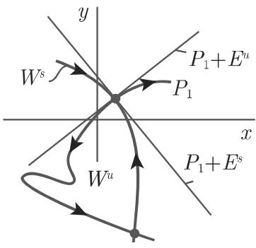
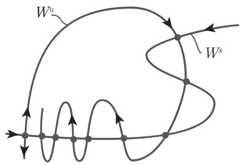

#### 17.1.3 离散动力系统

17.1.3.1 稳态、周期轨和极限集

1. 平衡点类型

当 $M \subset \mathbb { R } ^ { n }$ 时设 $x _ { 0 }$ 是方程 (17.3) 的平衡点．在特定假设下，迭代系统 (17.3)在 $x _ { 0 }$ 附近的局部行为可巾变分方程 $y _ { t + 1 } = D \varphi ( x _ { 0 } ) y _ { t } , t \in T$ 刻画．若 $D ( x _ { 0 } )$ 没有特征值 $\lambda _ { i }$ 满足 $| \lambda _ { i } | = 1$ , 则类似千微分方程情形，平衡点 $x _ { 0 }$ 称为双曲平衡点．双曲平衡点 $x _ { 0 }$ 是 $( m , k )$ 型的如果 $D f ( x _ { 0 } )$ 在复单位圆周内恰有 个特征值，在复单位圆周外恰有 $k = n - m$ 个特征值． $( m , k )$ 型双曲平衡点当 $m = n$ 时，称为汇；当 $k = n$ 时称为源；当 $m > 0$ 且 $k > 0$ 时，称为鞍点．汇是渐近稳定的；源和鞍点是不稳定的（离散系统一阶近似的稳定性定理）．

2. 周期轨

令 $\gamma ( x _ { 0 } ) = \{ \varphi ^ { k } ( x _ { 0 } ) , k = 0 , \cdot \cdot \cdot , T - 1 \}$ 是方程 (17.3) 周期解 $\left( T \geqslant 2 \right)$ 若 $x _ { 0 }$ 是映射 $\varphi ^ { T }$ 的双曲平衡点则 $\gamma ( \boldsymbol { x } _ { 0 } )$ 称为双曲 $6 4$

矩阵 $D \varphi ^ { T } ( x _ { 0 } ) = D \varphi ( \varphi ^ { T - 1 } ( x _ { 0 } ) ) \cdot \cdot \cdot D \varphi ( x _ { 0 } )$ 称为单值矩阵， $D \varphi ^ { T } ( x _ { 0 } )$ 的特征 值 $\rho _ { i }$ 是 $\gamma ( \boldsymbol { x } _ { 0 } )$ 的乘子．

若 $\gamma ( \boldsymbol { x } _ { 0 } )$ 所有乘子 $\rho _ { i }$ 的绝对值都小千 1, 则周期轨 $\gamma ( \boldsymbol { x } _ { 0 } )$ 是渐近稳定的．

3. $\omega$ 极限集的性质

当 $M = \mathbb { R } ^ { n }$ 时，系统 (17.3) 的任意 $\omega$ 极限集是闭集，并且 $\omega ( \varphi ( x ) ) = \omega ( x )$ ．若正半轨 $\gamma ^ { + } ( x )$ 有界，则 $\omega ( x ) \neq \emptyset$ 并且 $\omega ( x )$ 是 $\varphi$ 的不变集对千 $\alpha$ 极限集，也有类似的性质

·假设在匣上 $\varphi ( x ) = - x$ , 此时差分方程为 $x _ { t + 1 } = - x _ { t } , t = 0 , \pm 1 , \cdot \cdot \cdot$ 显然，当$x = 1$ 时，有 $\omega ( 1 ) = \{ 1 , - 1 \} , \omega ( \varphi ( 1 ) ) = \omega ( - 1 ) = \omega ( 1 )$ ，并且 $\varphi ( \omega ( 1 ) ) = \omega ( 1 )$ ．注意： $\omega ( 1 )$ 不是连通集，这与微分方程情形不同

17.1.3.2 不变流形

1. 分界面

设 $x _ { 0 }$ 是系统 (17.3) 的平衡点．那么， $, W ^ { s } ( x _ { 0 } ) = \{ y \in M : \varphi ^ { i } ( y ) \to x _ { 0 }$ 当 $| i $ $+ \infty \}$ 称为稳定流形， $W ^ { u } ( x _ { 0 } ) = \{ y \in M : \varphi ^ { i } ( y ) \to x _ { 0 }$ , $i \to - \infty \}$ 称为不稳定流形．稳定流形和不稳定流形也称为分界面

．阿达马—佩龙 (Hadamard-Perron) 定理

阿达马—佩龙定理给出了当 $M \subset \mathbb { R } ^ { n }$ ，离散系统分界面的重要性质．

若 $x _ { 0 }$ 是系统 (17.3) $( m , k )$ 型双曲平衡点则 $W ^ { s } ( x _ { 0 } )$ 和 $W ^ { u } ( x _ { 0 } )$ 分别是$m$ 维和 维的广义 $C ^ { r }$ 厂光滑曲面其局部类似 $C ^ { r }$ 光滑基本曲面若当 $i \to + \infty$ 或对应地， $i \to - \infty$ 时，方程 (17.3) 中一条轨道不收敛到 $x _ { 0 }$ 则当 $i \to + \infty$ 或对应地 $i \to - \infty$ 时该轨道会离开 $x _ { 0 }$ 的某个充分小的邻域曲而 $W ^ { s } ( x _ { 0 } )$ 和 $W ^ { u } ( x _ { 0 } )$ 在 $x _ { 0 }$ 处分别相切千系统 $y _ { i + 1 } = D \varphi ( x _ { 0 } ) y _ { i }$ 的稳定向量子空间

$$
E ^ {s} = \{y \in \mathbb {R} ^ {n}: [ D \varphi (x _ {0}) ] ^ {i} y \rightarrow 0 \quad {\text {当}} i \rightarrow + \infty \}
$$

和不稳定向量子空间

$$
E ^ {u} = \{y \in \mathbb {R} ^ {n}: [ D \varphi (x _ {0}) ] ^ {i} y \rightarrow 0 \quad {\text {当}} i \rightarrow - \infty \}
$$

·考虑埃农映射族导出的离散动力系统

$$
x _ {i + 1} = x _ {i} ^ {2} + y _ {i} - 2, \quad y _ {i + 1} = x _ {i}, \quad i \in \mathbb {Z}.\tag{17.23}
$$

系统 (17.23) 的两个双曲平衡点是 $P _ { 1 } = ( { \sqrt { 2 } } , { \sqrt { 2 } } )$ 和 $P _ { 2 } = ( - { \sqrt { 2 } } , - { \sqrt { 2 } } )$

$P _ { 1 }$ 局部稳定流形和不稳定流形的确定：利用变量替换 $x _ { i } = \xi _ { i } + \sqrt 2 , \quad y _ { i } =$ $\eta _ { i } + { \sqrt { 2 } } ,$ ，系统 (17.23) 转化为 $\xi _ { i + 1 } = \xi _ { i } ^ { 2 } + 2 \sqrt 2 \xi _ { i } + \eta _ { i } , \quad \eta _ { i + 1 } = \xi _ { i }$ ，其平衡点为$( 0 , 0 )$ ．雅可比矩阵 $D f ( ( 0 , 0 ) )$ 对应千特征值 $\lambda _ { 1 , 2 } = { \sqrt { 2 } } \pm { \sqrt { 3 } }$ 的特征向量为 $a _ { 1 } =$ $( { \sqrt { 2 } } + { \sqrt { 3 } } , 1 )$ ）和 $a _ { 2 } = ( { \sqrt { 2 } } - { \sqrt { 3 } } , 1 )$ . 千是， $E ^ { s } = \{ t a _ { 2 } , t \in \mathbb { R } \} , E ^ { u } = \{ t a _ { 1 } , t \in \mathbb { R } \}$ 假设 $W _ { \mathrm { l o c } } ^ { u } ( ( 0 , 0 ) ) = \{ ( \xi , \eta ) : \eta = \beta ( \xi ) , | \xi | < \Delta , \beta : ( - \Delta , \Delta ) $ 厌可微｝，我们来确定 $\beta$ 的幕级数形式 $\beta ( \xi ) = ( \sqrt { 3 } - \sqrt { 2 } ) \xi + k \xi ^ { 2 } + \cdot \cdot \cdot$ ．．由 $( \xi _ { i } , \eta _ { i } ) \in W _ { \mathrm { l o c } } ^ { u } ( ( 0 , 0 ) )$ 得 $( \xi _ { i + 1 } , \eta _ { i + 1 } ) \in W _ { \mathrm { l o c } } ^ { u } ( ( 0 , 0 ) )$ ）．由此可导出关千 $\beta$ 展开系数的方程其中 $k < 0$ 17.ll(a) 给出了稳定流形和不稳定流形的形状．

  
(a)

  
(b)  
17.11

3. 横截同宿点

系统 (17.3) 中双曲平衡点 $x _ { 0 }$ 的分界面 $W ^ { s } ( x _ { 0 } )$ 和 $W ^ { u } ( x _ { 0 } )$ 可能相交．若交集$W ^ { s } ( x _ { 0 } ) \cap W ^ { u } ( x _ { 0 } )$ 是横截的，则任意点 $y \in W ^ { s } ( x _ { 0 } ) \cap W ^ { u } ( x _ { 0 } )$ 称为横截同宿点．

事实上，若 是横截同宿点则可逆系统 (17.3) 的轨道 $\{ \varphi _ { i } ( y ) \}$ ｝仅由这些横截同宿点构成

17.1.3.3 离散系统的拓扑共扼

1. 定义

除了系统 (17.3)，假设还有一个离散系统

$$
x _ {t + 1} = \psi (x _ {t}),\tag{17.24}
$$

其中， $N \subset \mathbb { R } ^ { n } , \psi : N \to N$ 是连续映射 (M 可以是一般度量空间）．离散系统(17.3) (17.24) （或映射 $\varphi$ 和 $\psi )$ ）称为拓扑共扼，如果存在同胚映射 $h : M \to N$ 使得 $\varphi = h ^ { - 1 } \circ \psi \circ h$ 若离散系统 (17.3) (17.24) 是拓扑共辄的则同胚映射 $h$ 将系统 (17.3) 的轨道映射为方程 (17.24) 的轨道．

2. 格罗布曼—哈特曼定理

设系统 (17.3) $\varphi : \mathbb { R } ^ { n } \to \mathbb { R } ^ { n }$ 是同胚映射， $x _ { 0 }$ 是系统 (17.3) 的双曲平衡点．那么，在 $x _ { 0 }$ 的某个邻域内，系统 (17.3) 与其线性化方程 $y _ { t + 1 } = D \varphi ( x _ { 0 } ) y _ { t }$ 拓扑共扼．
