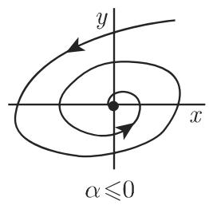
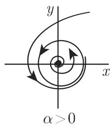

#### 17.1.4 结构稳定性

17.1.4.1 结构稳定的微分方程

1. 定义

微分方程 (17.1)，即向量场 $f : M \to \mathbb { R } ^ { n }$ 为结构稳定的，若 的小扰动系统与原系统拓扑等价．严格的定义结构稳定性需要 上两个向量场之间距离的概念下面我们将研究限定在 中的光滑向量场，它们有一个公共的连通吸收开集 $U \subset M .$ 的边界 AU 是光滑的 $n - 1$ 维超曲面并且假设有表示$\partial U = \{ x \in \mathbb { R } ^ { n } : h ( x ) = 0 \}$ ，其中 $h : \mathbb { R } ^ { n } $ R是 $C ^ { 1 }$ 函数满足在 au 的某个邻域上有 $\operatorname { g r a d h } ( x ) \neq 0$ ．令 $X ^ { 1 } ( U )$ 上全体光滑向量场构成的度量空间，装配的度量为

$$
\rho (f, g) = \sup _ {x \in U} \| f (x) - g (x) \| + \sup _ {x \in U} \| D f (x) - D g (x) \|\tag{17.25}
$$

（右端项中第一个 $\| \cdot \|$ 表示向量的欧儿里得范数，第二个 II · II 表示算子范数）．沿方向与边界 au 横截相交的光滑向量场 $f ,$ 即满足 $\mathrm { g r a d h } ( x ) ^ { T } f ( x ) \neq 0 , ( x \in \partial U )$ 且 $\varphi ^ { t } ( x ) \in U ( x \in \partial U , t > 0 )$ ，构成集合 $X _ { + } ^ { 1 } ( U ) \subset X ^ { 1 } ( U )$ ．向量场 $f \in X _ { + } ^ { 1 } ( U )$ 称为结构稳定的，如果存在 $\delta > 0$ 使得任意满足 $\rho ( f , g ) < \delta$ 的向量场 $g \in X _ { + } ^ { 1 } ( U )$ 与f是拓扑等价的．

·考虑平面微分方程 $g ( \cdot , \alpha )$

$$
\dot {x} = - y + x (\alpha - x ^ {2} - y ^ {2}), \quad \dot {y} = x + y (\alpha - x ^ {2} - y ^ {2}),\tag{17.26}
$$

其中，参数 满足 $| \alpha | < 1$ ．微分方程 属千 $X _ { + } ^ { 1 } ( U )$ ，其中 $U = \{ ( x , y ) : x ^ { 2 } + y ^ { 2 } <$ 2} （图 17.12(a) ）．显然， $\rho ( g ( \cdot , 0 ) , g ( \cdot , \alpha ) ) = | \alpha ( \sqrt { 2 } + 1 ) |$ |．向量场 $g ( \cdot , 0 )$ 是结构不稳定的．考虑方程 (17.26) 在极坐标下表示 $\dot { r } = - r ^ { 3 } + \alpha r , \quad \dot { v } = 1$ . 显而易见，存在任意靠近 $g ( \cdot , 0 )$ 的向量场与 $g ( \cdot , 0 )$ 不是拓扑等价的（图 $1 7 . 1 2 ( \mathrm { b } ) , ( \mathrm { c } ) \rangle$ ）．当 $\alpha > 0$ 时，存在稳定的极限环 $r = \sqrt { \alpha }$

  
(a)

  
(b)

  
17.12  
(c)

2. 平面上的结构稳定系统

假设 $f \in X _ { + } ^ { 1 } ( U )$ 的平面微分方程 (17.1) 是结构稳定的那么：

a) 方程 (17.1) 仅含有限个平衡点和周期轨．

b) 方程 (17.1) 中任意点 $x \in { \overline { { U } } }$ 的 $\omega$ 极限集 $\omega ( x )$ 仅含有平衡点和周期点．

安德罗诺夫蓬特里亚金 (Andronov-Pontryagin) 定理 $f \in X _ { + } ^ { 1 }$ 的平面微分方程 (17.1) 是结构稳定的，当且仅当

a) 万内所有平衡点和周期轨是双曲的．

b) 不存在分界线也就是说，没有连接鞍点和鞍点的异宿轨和同宿轨

17.1.4.2 结构稳定的时间离散系统

在时间离散动力系统 (17.3) 情形下，即 $\varphi : M  M ,$ 令 $U \subset M \subset \mathbb { R } ^ { n }$ 是有界连通开集，并且其边界光滑令 $\operatorname { D i f f } ^ { 1 } ( U )$ 上所有同胚映射构成的度量空间，装配着 $U$ 上的 $C ^ { 1 }$ 度量假设集合 $\operatorname { D i f f } _ { + } ^ { 1 } ( U ) \subset \operatorname { D i f f } ( U )$ 包含满足 $\varphi ( { \overline { { U } } } ) \subset U$ 的微分同胚 $\varphi .$ . 映射 $\varphi \in \operatorname { D i f f } _ { + } ^ { 1 } ( U )$ （和相应的动力系统 (17.3)）称为结构稳定的，如果存在 $\delta > 0$ 使得任意满足 $\rho ( \varphi , \psi ) < \delta$ 的 $\psi \in \operatorname { D i f f } _ { + } ^ { 1 } ( U )$ 与 $\varphi$ 是拓扑共辄的．

17.1.4.3 通有性质

1. 定义

度量空间 $( M , \rho )$ 上的关千元素的性质称为通有的，如果 中满足该性质的元素全体构成的集合 是笫二贝尔 (Baire) 纲集，即 可表示为 $B = \bigcap _ { m = 1 , 2 , \cdots } B _ { m }$ 其中，每个集合 $B _ { m }$ 是开集且在 中稠密

：集合腔和 $\mathbb { I } \subset \mathbb { R }$ （无理数）是第二贝尔纲集， $\mathbb { Q }$ 不是第二贝尔纲集．

：仅用稠密性刻画通有性是不充分的： $\mathbb { Q } \subset \mathbb { R }$ 和 $\mathbb { I } \subset \mathbb { R }$ 都是稠密的，但不都是通有的．

：区中集合的勒贝格测度入和贝尔纲集之间没有关系．集合 $B = \bigcap _ { k = 1 , 2 \cdots } B _ { k }$ 其中 $B _ { k } \ = \ \bigcup _ { n \geqslant 0 } \left( a _ { n } - { \frac { 1 } { k 2 ^ { n } } } , a _ { n } + { \frac { 1 } { k 2 ^ { n } } } \right) , \mathbb { Q } \ = \ \{ a _ { n } \} _ { n = 0 } ^ { \infty }$ 。表示有理数集合，是第二贝尔纲集另一方面因为 $B _ { k } \ \supset \ B _ { k + 1 } , \lambda ( B _ { k } ) < + \infty$ ，所以 $\lambda ( B ) = \operatorname* { l i m } _ { k \to \infty } B _ { k } \leqslant$ $\operatorname* { l i m } _ { k \to \infty } { \frac { 2 } { k } } { \frac { 1 } { 1 - 1 / 2 } } = 0$

2. 平面系统的通有性质、哈密顿系统

对千平面微分方程 $X _ { + } ^ { 1 } ( U )$ 中的全体结构稳定系统构成的集合是开集且在 $X _ { + } ^ { 1 }$ (U) 中稠密．因此，对千平面系统结构稳定系统是通有的．在 $X _ { + } ^ { 1 } ( U )$ 导出的平面系统中，随着时间增加趋千有限个平衡点和周期轨中某一个的轨道也是通有的．拟周期轨不是通有的．在特定假设下，对千哈密顿系统，微分方程的拟周期轨在小扰动下可以保持．因此，哈密顿系统不是通有的．

·在 $\mathbb { R } ^ { 4 }$ 中，给定作用变量—角变量下的哈密顿系统 $\dot { j } _ { 1 } = 0 , \dot { j } _ { 2 } = 0 , \dot { \theta } _ { 1 } = \frac { \partial H _ { 0 } } { \partial j _ { 1 } } , \dot { \theta } _ { 2 } =$ $\frac { \partial H _ { 0 } } { \partial j _ { 2 } }$ ，其中，哈密顿函数 $H _ { 0 } ( j _ { 1 } , j _ { 2 } )$ ）是解析函数．显然，系统的解为 $j _ { 1 } = c _ { 1 } , j _ { 2 } =$ $c _ { 2 } , \theta _ { 1 } = \omega _ { 1 } t + c _ { 3 } , \theta _ { 2 } = \omega _ { 2 } t + c _ { 4 }$ , 其中， $c _ { 1 } , \cdots , c _ { 4 }$ 是常数， $\omega _ { 1 } , \omega _ { 2 }$ 依赖与 $c _ { 1 } , c _ { 2 }$ 关系$( j _ { 1 } , j _ { 2 } ) = ( c _ { 1 } , c _ { 2 } )$ 确定了一个不变环面 $T ^ { 2 }$ ．现在考虑扰动的哈密顿函数 $H _ { 0 } ( j _ { 1 } , j _ { 2 } ) +$ $\varepsilon H _ { 1 } ( j _ { 1 } , j _ { 2 } , \theta _ { 1 } , \theta _ { 2 } )$ ），其 $H _ { 1 }$ 是解析函数， $\varepsilon > 0$ 是小参数

根据柯尔莫哥洛夫—阿诺德—莫泽(Kolmogorov-Arnold-Moser) 定理(KAM 定理），若 $H _ { 0 }$ 是非退化的，即 $\operatorname * { d e t } \left( { \frac { \partial \sp { 2 } H _ { 0 } } { \partial j _ { k } \sp { 2 } } } \right) \ne 0$ ，则在扰动的哈密顿系统中，当 $\varepsilon > 0$ 充分小时大多数的不变非共振环面不会消失，但会有轻微的变形．“大多数环面＇指的是：当 $\varepsilon$ 趋千 时，这些环面余集的勒贝格测度趋千 0. $\omega _ { 1 }$ 和 $\omega _ { 2 }$ 描述的上述环面称为非共振的如果存在常数 $c > 0$ 使得对任意正整数 $p$ 和 $q ,$ 有不等式$\left| { \frac { \omega _ { 1 } } { \omega _ { 2 } } } - { \frac { p } { q } } \right| \geqslant { \frac { c } { q ^ { 2 . 5 } } }$

3. 非游荡点、莫尔斯—斯梅尔系统

设 $\{ \varphi ^ { t } \} _ { t \in \mathbb { R } }$ 是 维紧致的可定向流形 上的动力系统点 $p \in M$ 称为 $\{ \varphi ^ { t } \}$ 的非游荡点，如果对千 $p$ 的任意邻域 $U _ { p } \subset M$ ，有

$$
\forall T > 0 \quad \exists t, | t | \geqslant T: \quad \varphi^ {t} (U _ {p}) \cap U _ {p} \neq \varnothing .\tag{17.27}
$$

·稳态解和周期轨仅含有非游荡点．

方程 (17.1) 生成的动力系统中，所有非游荡点全体构成的集合 $\varOmega ( \varphi ^ { t } )$ 是闭的，$\{ \varphi ^ { t } \}$ 的不变集，并且包括所有周期轨和所有 中点的 $\omega$ 极限集

上光滑向量场生成的动力系统 $\{ \varphi ^ { t } \} _ { t \in \mathbb { R } }$ 称为莫尔斯—斯梅尔 (Morse-Smale)系统如果满足下面的条件：

(1) 系统只有有限个平衡点和周期轨，且它们都是双曲的．

(2) 所有平衡点和周期轨的稳定流形和不稳定流形是横截相交的．

(3) 全体非游荡点的集合仅包含平衡点和周期轨．

帕利—斯梅尔 {Palis-Smale) 定理 莫尔斯—斯梅尔系统是结构稳定的．

帕利淇斤梅尔定理的逆定理不成立：当 $n = 3$ 时存在含有无穷多周期轨的结构稳定系统

当 $n \geqslant 3$ 时，结构稳定系统不是通有的．
