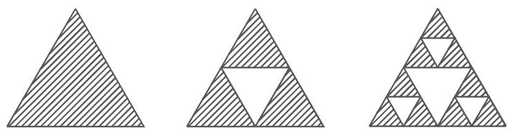
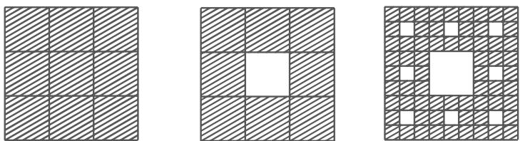
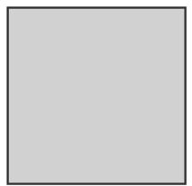
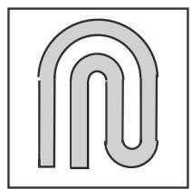
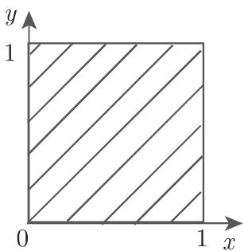
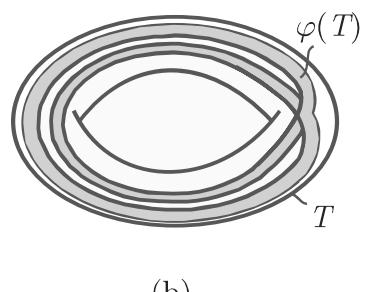
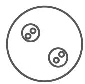

#### 17.2.4 维数

17.2.4.1 测度维数

1. 分形

动力系统的吸引子或者其他不变集在儿何构造上看可以比点、线或者环面复杂的多．分形是不依赖千动力系统的集合，它们依据诸如碎片、多孔性、复杂性和自相似性等一个或几个特征来区分彼此．通常，描述光滑曲面或曲线的维数概念不能应用千分形中，我们需要一个更加一般的维数定义，关千这方面更多细节可参[17.8], [17.20],[17.4].

·将区间 $G _ { 0 } = [ 0 , 1 ]$ 分成三段长度相等的子区间去掉三者之中位千中间的开区间后得到集合 $G _ { 1 } = \left[ 0 , { \frac { 1 } { 3 } } \right] \cup \left[ { \frac { 2 } { 3 } } , 1 \right]$ ．对 $G _ { 1 }$ 的两个子区间分别进行上述同样操作后，导到集合 $G _ { 2 } = { \bigg [ } 0 , { \frac { 1 } { 9 } } { \bigg ] } \cup { \bigg [ } { \frac { 2 } { 9 } } , { \frac { 1 } { 3 } } { \bigg ] } \cup { \bigg [ } { \frac { 2 } { 3 } } , { \frac { 7 } { 9 } } { \bigg ] } \cup { \bigg [ } { \frac { 8 } { 9 } } , 1 { \bigg ] }$ ．继续上述过程，对集合 $G _ { k - 1 }$ 的所有子区间分别移去中间的三分之一开区间后得到集合 $G _ { k }$ 如此下去我们得到一列集合 $G _ { 0 } \supset G _ { 1 } \supset \cdots \supset G _ { n } \supset \cdots$ ·，其中每个 $G _ { n }$ 九由 $2 ^ { n }$ 个长度为— $\frac { 1 } { 3 ^ { n } }$ 区间组成．

康托尔集 由属千所有集合 $G _ { n }$ 的点组成，即 $C = \bigcap _ { n = 1 } ^ { \infty } G _ { n }$ ，这是一个紧的不可数集合，其勒贝格测度为 并且是完全的，即 $C$ 为闭集且每个点为聚点．康托尔集即为一个分形的例子．

2. 豪斯多夫维数

该维数的定义来自基千勒贝格测度的体积计算．假设有界集合 $A \subset \mathbb { R } ^ { s }$ 被有限个半径 $r _ { i }$ 不超过 $\varepsilon$ 的球体 $B _ { r _ { i } }$ 覆盖，即 $\bigcup _ { i } B _ { r _ { i } } \supset A$ ，则粗略地看， 的“体积”为$\scriptstyle \sum _ { i } { \frac { 4 } { 3 } } \pi r _ { i } ^ { 3 }$ ．定义 $\textstyle \mu _ { \varepsilon } ( A ) = \operatorname* { i n f } \left\{ \sum _ { i } { \frac { 4 } { 3 } } \pi r _ { i } ^ { 3 } \right\}$ 中下确界为在 的所有尺寸不超过的球体覆盖上取．当 趋千零时，可得到集合 的勒贝格外测度入(A)．若 可测，外测度即为 的体积 vol(A).

为欧氏空间 $\mathbb { R } ^ { n }$ ，或更一般地度量为 $\rho$ 的可分度量空间， $A \subset M$ 为 M

的一个子集对任意 $d \geqslant 0 , \varepsilon \geqslant 0$ ，定义

$$
\mu_ {d, \varepsilon} (A) = \inf \left\{\sum_ {i} (\operatorname{diam} B _ {i}) ^ {d}: A \subset \bigcup B _ {i}, \operatorname{diam} B _ {i} \leqslant \varepsilon \right\}\tag{17.41a}
$$

其中 $B _ { i } \subset M$ 为任意子集， $\mathrm { d i a m } B _ { i } = \operatorname* { s u p } _ { x , y \in B _ { i } } \rho ( x , y )$

定义 的维数为 的豪斯多夫(Hausdorff)外测度

$$
\mu_ {d} (A) = \lim _ {\varepsilon \to 0} \mu_ {d, \varepsilon} (A) = \sup _ {\varepsilon > 0} \mu_ {d, \varepsilon} (A),\tag{17.41b}
$$

该值可能有限也可能无穷集合 的豪斯多夫维数 $d _ { \mathrm { H } } ( A )$ 定义为豪斯多夫测度的（唯一）临界点

$$
d _ {\mathrm{H}} (A) = \left\{ \begin{array}{l l} {+ \infty ,} & {\text {如果} \mu_ {d} (A) \neq 0, \forall d \geqslant 0,} \\ {\inf \{d \geqslant 0: \mu_ {d} (A) = 0 \}.} \end{array} \right.\tag{17.41c}
$$

注记 在贮情形下，归 $\mu _ { d , \varepsilon } ( A )$ 也可由边长不超过 的方体覆盖得到．

豪斯多夫维数的重要性质

(HDl) $d _ { H } ( \mathcal { O } ) = 0$

(HD2) 如果 $A \subset \mathbb { R } ^ { n }$ ，则 $0 \leqslant d _ { \mathrm { H } } ( A ) \leqslant n$

(HD3) 如果 $A \subset B$ 则 $d _ { \mathrm { H } } ( A ) \leqslant d _ { \mathrm { H } } ( B )$

(HD4) 如果 $A = \bigcup _ { i = 1 } ^ { \infty } A _ { i }$ ，则 $d _ { \mathrm { H } } ( A ) = \operatorname* { s u p } _ { i } d _ { \mathrm { H } } ( A _ { i } )$

(HD5) 如果 为有限集或可数集，则 $d _ { \mathrm { H } } ( A ) = 0$

(HD6) 设 $\varphi$ 是利普希茨连续函数，即存在 $L > 0$ 满足 $\rho ( \varphi ( x , \varphi ( y ) ) ) \leqslant L \rho ( x , y )$ $\forall x , y \in M$ ，则有 $d _ { \mathrm { H } } ( \varphi ( A ) ) \leqslant d _ { \mathrm { H } } ( A )$ ．如果逆映射 $\varphi ^ { - 1 }$ 存在并且也为利普希茨连续，则有 $d _ { \mathrm { H } } ( A ) = d _ { \mathrm { H } } ( \varphi ( A ) )$

·对有理数集 $\mathbb { Q } ,$ 由（HD5) 可知 $d _ { \mathrm { H } } ( \mathbb { Q } ) = 0$ ．康托尔集 的维数为 $d _ { \mathrm { H } } ( C ) = { \frac { \ln 2 } { \ln 3 } } \approx$ 0.6309 · · ·.

3. 盒维数或容量

是度量空间 $( M , \rho )$ 的一个紧子集， $N _ { \varepsilon } ( A )$ 表示用尺寸不超过 $\varepsilon$ 的集合覆所需要的集合的最小个数，

$$
\bar {d} _ {\mathrm{B}} (A) = \limsup _ {\varepsilon \to 0} \frac {\ln N _ {\varepsilon} (A)}{\ln \frac {1}{\varepsilon}}\tag{17.42a}
$$

称为 的上盒维数或上容量，

$$
\underline {{d}} _ {\mathrm{B}} (A) = \liminf _ {\varepsilon \to 0} \frac {\ln N _ {\varepsilon} (A)}{\ln \frac {1}{\varepsilon}}\tag{17.42b}
$$

称为 的下盒维数或下容量．如果 ${ \bar { d } } _ { \mathrm { B } } ( A ) = { \underline { { d } } } _ { \mathrm { B } } ( A ) : = { d } _ { \mathrm { B } } ( A )$ 成立，则称 $d _ { \mathrm { B } } ( A )$ 为的盒维数对苠 $\mathbb { R } ^ { n }$ 空间中的非闭有界集合也可定义盒维数．

若集合 $A \subset \mathbb { R } ^ { n }$ 为有界集合，那么 $N _ { \varepsilon } ( A )$ 可按如下方式定义： $\mathbb { R } ^ { n }$ 分割为边长为 维方体网格，则 $N _ { \varepsilon } ( A )$ 定义为网格中与 相交非空的方体个数．

盒维数的重要性质

(BDl) $d _ { \mathrm { H } } ( A ) \leqslant d _ { \mathrm { B } } ( A )$ 总成立

(BD2) 维曲面 $F \subset \mathbb { R } ^ { n }$ ，有 $d _ { \mathrm { H } } ( F ) = d _ { \mathrm { B } } ( F ) = m$

(BD3) 对集合 的闭包 ${ \bar { A } } .$ 有 $d _ { \mathrm { B } } ( A ) = d _ { \mathrm { B } } ( \bar { A } )$ 成立，但一般地对豪斯多夫维数， $d _ { \mathrm { H } } ( A ) < d _ { \mathrm { H } } ( \overline { { ( } } A ) )$

(BD4) 如果 $A = \bigcup _ { n } A _ { n }$ 一般地对盒维数，等式 $d _ { \mathrm { B } } ( A ) = \operatorname* { s u p } _ { n } d _ { \mathrm { B } } ( A _ { n } )$ 不成立．

·设 $A = \left\{ 0 , 1 , { \frac { 1 } { 2 } } , { \frac { 1 } { 3 } } , \cdots \right\}$ ．则 $d _ { \mathrm { H } } ( A ) = 0 , \ d _ { \mathrm { B } } ( A ) = { \frac { 1 } { 2 } }$

如果 [O, 1] 中所有有理数点构成的集合，由 (BD2) (BD3) 可知 $d _ { \mathrm { B } } ( A ) =$ 1. 另一方面， $d _ { \mathrm { H } } ( A ) = 0$

4. 自相似性

某些具有自相似性质的儿何图形可由如下过程得到：给定一个初始图形，按比例 $q > 1$ 复制 个相同图形，将它们组成一个新图形．第 步得到的图形是对初始图形按上述方式连续 次缩放组合后得到

：康托尔集： $p = 2 , q = 3$

B: 科赫 (Koth) 曲线 $p = 4 , q = 3$ . 前三步得到图形如图 7.14 所示．

：谢尔平斯基 (Sierpinski) 垫圈： $p = 3 , q = 2$ ．前三步得到图形如图 17.15 所示．

：谢尔平斯基地毯： $p = 8 , q = 3$ ．前三步得到图形如图 17.16 所示（白色方形被移去）．

A\~D 中例子：

$$
d _ {\mathrm{B}} = d _ {\mathrm{H}} = \frac {\ln p}{\ln} q.
$$

  
17.14

  
17.15

  
17.16

17.2.4.2 由不变测度定义的维数

1. 测度的维数

设 $\mu$ 为空间 $( M , \rho )$ 上支撑在集合 上的概率测度．任取 $x \in A , B _ { \delta } ( x )$ 表示$x$ 点为心，半径为 $\delta$ 的球体，则

$$
\bar {b} _ {\mu} (x) = \limsup _ {\delta \to 0} \frac {\ln \mu (B _ {\delta} (x))}{\ln \delta}\tag{17.43a}
$$

与

$$
\underline {{b}} _ {\mu} (x) = \liminf _ {\delta \to 0} \frac {\ln \mu (B _ {\delta} (x))}{\ln \delta}\tag{17.43b}
$$

分别表示 $\mu$ 在点 $x$ 处的上与下点维数．

杨氏 {Young) 定理 如果对 $\mu$ 儿乎处处 $x \in \varLambda$ 有 $d _ { \mu } ( x ) = \alpha$ ，则

$$
\alpha = d _ {\mathrm{H}} (\mu) := \inf _ {X \subset \varLambda , \mu (X) = 1} \{d _ {\mathrm{H}} (X) \}.
$$

称 $d _ { \mathrm { H } } ( \mu )$ )为测 $\mu$ µ的豪斯多夫维数

·设 $M = \mathbb { R } ^ { n } , \ A \subset \mathbb { R } ^ { n }$ 一个紧球体，具有正的勒贝格测度，即 $\lambda ( \varLambda ) > 0 .$ .记$\mu _ { \Lambda } = \frac { \lambda } { \lambda ( \varLambda ) }$ ，表示 $\mu$ 限制在 上的测度，则

$$
\mu (B _ {\delta} (x)) \sim \delta^ {n} \text {且} d _ {\mathrm{H}} (\mu) = n.\tag{17.44}
$$

2. 信息维数

设 $\{ \varphi ^ { t } \} _ { t \in \gamma }$ 的吸引子 被边长为 的方体 $Q _ { 1 } ( \varepsilon ) , \cdot \cdot \cdot , Q _ { n } ( \varepsilon )$ 覆盖（如第 114417.2.2.2), $\mu$ 为支撑在 上的不变概率测度覆盖 $Q _ { 1 } ( \varepsilon ) , \cdot \cdot \cdot , Q _ { n } ( \varepsilon )$ 的炳定义为

$$
H (\varepsilon) = - \sum_ {i = 1} ^ {n (\varepsilon)} p _ {i} (\varepsilon) \ln p _ {i} (\varepsilon), \quad \text {其中} p _ {i} (\varepsilon) = \mu (Q _ {i} (\varepsilon)) (i = 1, \dots , n (\varepsilon)).\tag{17.45}
$$

如果极限 $d _ { \mathrm { I } } ( \mu ) = \operatorname* { l i m } _ { \varepsilon  0 } \frac { H ( \varepsilon ) } { \ln \varepsilon }$ 存在，该量具有维数性质，我们称它为信息维数

杨氏定理 如果对 $\mu$ 儿乎处处 $x \in \varLambda , d _ { \mu } ( x ) = \alpha _ { \mathrm { { \ O } } }$ ，则

$$
\alpha = d _ {\mathrm{H}} (\mu) = d _ {\mathrm{I}} (\mu).\tag{17.46}
$$

A: 设 $\mu$ 支撑在 $\{ \varphi ^ { t } \}$ 的平衡点 $x _ { 0 }$ 处．对任意 $\varepsilon > 0$ , 有 $H _ { \varepsilon } ( \mu ) = - 1 \ln { 1 } = 0$ 从而小 $d _ { \mathrm { I } } ( \mu ) = 0$

B: 设 $\mu$ 为支撑在系统 $\{ \varphi ^ { t } \}$ 的极限环上的测度．对任意 $\varepsilon > 0$ ，有 $H _ { \varepsilon } ( \mu ) =$ $- \ln \varepsilon ,$ 从而 $d _ { \mathrm { I } } ( \mu ) = 1$

3. 相关维数

设 $\{ y _ { i } \} _ { i = 1 } ^ { + \infty }$ 为｛ $\{ \varphi ^ { t } \} _ { t \in \gamma }$ 的吸引子 上的一个典型点列， $\mu$ 是 上不变的概率测度，任意取定 $m \in \mathbb { N }$ 对向量序列 $x _ { i } = ( y _ { i } , \cdots , y _ { i + m } )$ 定义距离 $\mathrm { d i s t } k ( x _ { i } , x _ { j } ) : =$ $\operatorname* { m a x } _ { 0 \leqslant s \leqslant m } \{ \| y _ { i + s } - y _ { j + s } \| \}$ ，其中 $\| \cdot \|$ 表示欧氏向量范数．赫维赛德 (Heaviside) 函数$\theta = { \left\{ \begin{array} { l l } { 0 , } & { x \leqslant 0 , } \\ { 1 , } & { x > 0 , } \end{array} \right. }$

$$
\begin{array}{l} C ^ {m} (\varepsilon) = \limsup _ {N \to + \infty} \frac {1}{N ^ {2}} \text { card } \{(x _ {i}, x _ {j}): \text { dist } (x _ {i}, x _ {j}) <   \varepsilon \} \\ = \limsup _ {N \to + \infty} \frac {1}{N ^ {2}} \sum_ {i, j = 1} ^ {N} \Theta (\varepsilon - \text { dist } (x _ {i}, x _ {j})) \end{array}\tag{17.47a}
$$

称为相关积分，

$$
d _ {\mathrm{K}} = \lim _ {\varepsilon \to 0} \frac {\ln C ^ {m} (\varepsilon)}{\ln \varepsilon}\tag{17.47b}
$$

称为相关维数（如果极限存在）．

4. 广义维数

设 $\{ \varphi ^ { t } \} _ { t \in \gamma }$ 在吸引子 $\varLambda \subset M$ 上有不变的概率测度 $\mu ,$ ,A 被边长为 $\varepsilon$ 的方体覆盖，如第 1144 17.2.2.2．对任意参数 $q \in$ 良， $q \neq 1$

$$
H _ {q} (\varepsilon) = \frac {1}{1 - q} \ln \sum_ {i = 1} ^ {n (\varepsilon)} p _ {i} (\varepsilon) ^ {q}, \quad \text {其中} p _ {i} (\varepsilon) = \mu (Q _ {i} (\varepsilon))\tag{17.48a}
$$

称为关千覆盖 $Q _ { 1 } ( \varepsilon ) , \cdot \cdot \cdot , Q _ { n ( \varepsilon ) } ( \varepsilon )$ 的 $q$ 级广义嫡．

如果极限

$$
d _ {q} = - \lim _ {\varepsilon \to 0} \frac {H _ {q} (\varepsilon)}{\ln \varepsilon}\tag{17.48b}
$$

存在，称其为 $q$ 阶瑞尼 (Renyi) 维数

特殊情形下的瑞尼维数

$$
\mathrm{a)} q = 0: d _ {0} = d _ {\mathrm{C}} (\operatorname{supp} \mu).\tag{17.49a}
$$

$$
\text { b) } q = 1: d _ {1} := \lim _ {q \rightarrow 1} d _ {q} = d _ {\mathrm{I}} (\mu).\tag{17.49b}
$$

$$
\mathrm{c}) q = 2: d _ {2} = d _ {\mathrm{K}}.\tag{17.49c}
$$

5. 李雅普诺夫维数

设 $\{ \varphi ^ { t } \}$ 是 $M \subseteq \mathbb { R } ^ { n }$ 上的光滑动力系统， 为一个吸引子（或不变集）， $\mu$ 为支撑在 上不变的遍历概率测度．设 $\lambda _ { 1 } \geqslant \lambda _ { 2 } \geqslant \dotsb \geqslant \lambda _ { n }$ 为关千 $\mu$ 的李雅普诺夫指数， 为满足 $\sum _ { i = 1 } ^ { k } \lambda _ { i } \geqslant 0$ 及 $\textstyle \sum _ { i = 1 } ^ { k + 1 } \lambda _ { i } < 0$ 的最大指标，称

$$
d _ {\mathrm{L}} (\mu) = k + \frac {\sum_ {i = 1} ^ {k} \lambda_ {i}}{\left| \lambda_ {k + 1} \right|}\tag{17.50}
$$

为测度 $\mu$ 的李雅普诺夫维数

如果 $\textstyle \sum _ { i = 1 } ^ { n } \lambda _ { i } \geqslant 0$ ，则 $\begin{array} { r } { d _ { \mathrm { L } } ( \mu ) = n ; } \end{array}$ 如果 $\lambda _ { 1 } < 0$ ，则 $d _ { \mathrm { L } } ( \mu ) = 0$

列炯皮亚 (Ledrappier) 定理 设 $\{ \varphi ^ { t } \}$ 是 $M \subset \mathbb { R } ^ { n }$ 离散系统 (17.3),其中 $\varphi$ 是M上 $C ^ { 2 }$ 映射， $\mu$ 是支撑在吸引子 上不变的遍历概率测度，$d _ { \mathrm { H } } ( \mu ) \leqslant d _ { \mathrm { L } } ( \mu )$

A: 设光滑系统｛ $\{ \varphi ^ { t } \}$ 的吸引子 被 $N _ { \varepsilon }$ 个边长为 的方形覆盖， $\sigma _ { 1 } > 1 > \sigma _ { 2 }$ 为 $D \varphi$ 的奇异值．该吸引子的 $d _ { \mathrm { B } }$ 维体积 $m _ { d _ { \mathrm { B } } } \simeq N _ { \varepsilon } \cdot \varepsilon ^ { d _ { \mathrm { B } } }$ ．每个边长为 的方形被$\varphi$ 映射成边长大约分别为 $\sigma _ { 1 \varepsilon }$ 和 $\sigma _ { 2 \varepsilon }$ 的平行四边形．若将覆盖取作边长为 $\sigma _ { 2 } \varepsilon$ 的菱形，则有 $N _ { \sigma _ { 2 } \varepsilon } \simeq N _ { \varepsilon } \frac { \sigma _ { 1 } } { \sigma _ { 2 } }$ 由关系式 $N _ { \varepsilon } \varepsilon ^ { d _ { \mathrm { B } } } \simeq N _ { \sigma _ { 2 } \varepsilon } ( \varepsilon \sigma _ { 2 } ) ^ { d _ { \mathrm { B } } }$ ，可直接得到

$$
d _ {\mathrm{B}} \simeq 1 - \frac {\ln \sigma_ {1}}{\ln \sigma_ {2}} = 1 + \frac {\lambda_ {1}}{| \lambda_ {2} |}.\tag{17.51}
$$

李雅普诺夫维数公式即来自千这一启发式的估计．

B: 对埃农系统 (17.6) $a = 1 . 4 , \ b = 0 . 3$ 则（17.6) 有吸引子 （称为埃农吸引子），该吸引子有较复杂的结构．数值上计算可得盒维数 $d _ { \mathrm { B } } \simeq 1 . 2 6$ . 可证 上支撑一个 SRB 测度设李雅普诺夫指数分别为 $\lambda _ { 1 }$ 和 $\lambda _ { 2 }$ ，则有 $\lambda _ { 1 } { + } \lambda _ { 2 } = \ln \left| \operatorname* { d e t } D \varphi ( x ) \right| =$ ln $b = \ln { 0 . 3 } \simeq - 1 . 2 0 4$ 数值上计可得 $\lambda _ { 1 } \simeq 0 . 4 2$ ，从而 $\lambda _ { 2 } \simeq - 1 . 6 2$ 因此

$$
d _ {\mathrm{L}} (\mu) \simeq 1 + \frac {0 . 4 2}{1 . 6 2} \simeq 1. 2 6.\tag{17.52}
$$

17.2.4.3 来自杜阿迪和厄斯特勒的局部豪斯多夫维数

设 $\{ \varphi _ { t } \} _ { t \in \gamma }$ 是 $M \subset \mathbb { R } ^ { n }$ 上的光滑动力系统 是一个紧的不变集合．对任意取定 $t _ { 0 } \geqslant 0$ ，令 $\boldsymbol { \varPhi } = \boldsymbol { \varphi } ^ { t _ { 0 } }$

杜阿迪 (Douady)—厄斯特勒定理 (Oesterle) $\sigma _ { 1 } ( x ) \geqslant \cdot \cdot \cdot \geqslant \sigma _ { n } ( x )$ 为$D \varPhi ( x )$ 的奇异值，将 $d \in ( 0 , n ]$ 记作 $d = d _ { 0 } + s _ { \mathrm { \scriptsize { : } } }$ 其中 $d _ { 0 } \in \{ 0 , 1 , \cdots , n - 1 \}$ 2 $s \in$ $[ 0 , 1 ]$ ．如果 $\operatorname * { s u p } _ { x \in A } [ \sigma _ { 1 } ( x ) \sigma _ { 2 } ( x ) \cdot \cdot \cdot \sigma _ { d _ { 0 } } ( x ) \sigma _ { d _ { 0 } + 1 } ^ { s } ( x ) ] < 1$ , 则 $d _ { \mathrm { H } } ( \varLambda ) < d$

对微分方程的特别版本 设 $\{ \varphi ^ { t } \} _ { t \in \mathbb { R } }$ 为如 (17.1) 所述的流， 为一个紧不变集合，对任意 $x \in A , \alpha _ { 1 } ( x ) \geqslant \cdot \cdot \cdot \geqslant \alpha _ { n } ( x )$ 为对称的雅可比矩阵在该点的特征值如果将 $d \in ( 0 , n ]$ 记作 $d = d _ { 0 } + s$ ，其中 $d _ { 0 } \in \{ 0 , \cdots , n - 1 \} , \ s \in [ 0 , 1 ]$ ，且有$\operatorname* { s u p } _ { x \in A } [ \alpha _ { 1 } ( x ) + \cdot \cdot \cdot + \alpha _ { d _ { 0 } } ( x ) + s \alpha _ { d _ { 0 } + 1 } ( x ) ] < 0$ 成立，则 $d _ { \mathrm { H } } ( \varLambda ) < d _ { \mathrm { \Omega } }$ 称

$$
d _ {D O} = \left\{ \begin{array}{l l} {{0,}} & {{\alpha_ {1} \leqslant 0,}} \\ {{\sup \{d: 0 \leqslant d \leqslant n, \alpha_ {1} (x) + \dots + \alpha_ {[ d ]} (x)}} \\ {{+ (d - [ d ]) \alpha_ {[ d ] + 1} (x) \geqslant 0 \},}} & {{\text {其他}}} \end{array} \right.\tag{17.53}
$$

为点 处的厄斯特勒维数，其中 [d] 表示 的整数部分．在微分方程情形的杜阿迪—厄斯特勒定理假设下， $d _ { \mathrm { H } } ( \varLambda ) \leqslant \operatorname* { s u p } _ { x \in \varLambda } d _ { D O } ( x )$

·对洛伦茨系统 (17.2) ，当 $\sigma = 1 0 , b = 8 / 3 , r = 2 8$ 时，有一个吸引子 （称为洛伦茨吸引子），数值上计算其维数 $d _ { \mathrm { H } } ( A ) \approx 2 . 0 6$ （图 17.17 Mathematica 生成）．由杜阿迪—厄斯特勒定理，对任意 $b > 1 , \sigma > 0$ 及 $r > 0$ 可得如下估计：

$$
d _ {\mathrm{H}} (\varLambda) \leqslant 3 - \frac {\sigma + b + 1}{\kappa},\tag{17.54a}
$$

其中

$$
\kappa = \frac {1}{2} \left[ \sigma + b + \sqrt {(\sigma - b) ^ {2} + \left(\frac {b}{\sqrt {b - 1}} + 2\right) \sigma r} \right]\tag{17.54b}
$$

  
17.17

17.2.4.4 吸引子的例子

■ A: 包含稳定与不稳定流形横截交点的庞加莱映射的相关 $\frac { \pi } { 2 }$ 蹄映射．将单位方形 $M = [ 0 , 1 ] \times [ 0 , 1 ]$ 沿一个坐标方向线性拉长，另一个坐标方向线性压缩将所得矩形在中间弯折（图 17.18)．重复上述过程无穷多次可相应得到一列集合$M \supset \varphi ( M ) \supset \cdots$ ·，令

$$
\varLambda = \bigcap_ {k = 0} ^ {\infty} \varphi^ {k} (M)\tag{17.55}
$$

  
M

  
\$(M)

  
17.18  
M)

为关千 $\varphi$ 的紧不变集合集合 吸引 M 中所有点除去一点后， 可局部看作“直线 康托尔集“.

■ B: $\alpha \in \left( 1 , \frac { 1 } { 2 } \right) , M = [ 0 , 1 ] \times [ 0 , 1 ]$ 为单位方形称映射 $\varphi : M \to M$

$$
\varphi (x, y) = \left\{ \begin{array}{l l} (2 x, \alpha y), & 0 \leqslant x \leqslant \frac {1}{2}, y \in [ 0, 1 ], \\ \left(2 x - 1, \alpha y + \frac {1}{2}\right), & \frac {1}{2} <   x \leqslant 1, y \in [ 0, 1 ] \end{array} \right.\tag{17.56a}
$$

为耗散的 $\mu$ 包映射．图 17.19 给出了面包映射的前两步迭代．

  
17.19

图中可看到“千层酥”结构．集合 $\boldsymbol { \varLambda } = \bigcap _ { k = 0 } ^ { \infty } \boldsymbol { \varphi } ^ { k } ( \boldsymbol { M } )$ 在 $\varphi$ 作用下不变且 中所有点均可被 吸引，其豪斯多夫维数为

$$
d _ {\mathrm{H}} (\varLambda) = 1 + \frac {\ln 2}{- \ln \alpha}.\tag{17.56b}
$$

对系统｛ $\{ \varphi ^ { k } \}$ ，在 上存在一个不同千勒贝格测度的不变测度 $\mu .$ 在导算子存在的点上，雅可比矩阵为 $D \varphi ( ( x , y ) ) = { \binom { 2 ^ { k } \ 0 } { 0 \ \alpha ^ { k } } }$ 因此该矩阵的奇异值为 $\sigma _ { 1 } ( k , ( x , y ) ) =$ $2 ^ { k } , \ \sigma _ { 2 } ( k , ( x , y ) ) = \alpha ^ { k }$ ，从而关千 $\mu$ 的李雅普诺夫指数分别为 $\lambda _ { 1 } = \ln 2 , \ \lambda _ { 2 } = \ln \alpha$ 进而可得李雅普诺夫维数

$$
d _ {\mathrm{L}} (\mu) = 1 + \frac {\ln 2}{- \ln \alpha} = d _ {\mathrm{H}} (\varLambda).\tag{17.56c}
$$

此时测度嫡的佩辛炳公式成立，即

$$
h _ {\mu} = \sum_ {\lambda_ {i} > 0} \lambda_ {i} = \ln 2.\tag{17.56d}
$$

■ C: 是局部坐标为 $( \Theta , x , y )$ 的实心环，如图 17.20(a) 所示．

  
(a)

  
(b)  
17.20

  
(c)

映射 $\varphi : T  T$ 如下定义：

$$
\Theta_ {k + 1} = 2 \Theta_ {k}, \quad \binom{x _ {k + 1}}{y _ {k + 1}} = \frac {1}{2} \binom{\cos \Theta_ {k}}{\sin \Theta_ {k}} + \alpha \binom{x _ {k}}{y _ {k}} \quad (k = 0, 1, \dots),\tag{17.57}
$$

其中 $\alpha \in ( 0 , 1 / 2 ) . \varphi ( T ) \cap D ( \theta )$ ）及 $\varphi ^ { 2 } ( T ) \cap D ( \theta )$ 7.20(b) 17.20(C) 所示．无穷交集 $\varLambda = \bigcap _ { k = 0 } ^ { \infty } \varphi ^ { k } ( T )$ 称为螺线管．吸引子 由沿长度方向的连续曲线组成，每根曲线在 中稠且是不稳定的，与这些曲线横截相交的 的横截面是一个康托尔集．

的豪斯多夫维数 $d _ { \mathrm { H } } ( \varLambda ) = 1 - \frac { \ln 2 } { \ln \alpha }$ 有一个吸引邻域更进一步地结构稳定的，即在 $\varphi$ 的 $C ^ { 1 }$ 小扰动下，上述定性性质不变．

：螺线管是一个双曲吸引子的例子．
