#### 17.3.1 莫尔斯-斯梅尔系统中的分岔

令 $\{ \varphi _ { \varepsilon } ^ { t } \} _ { t \in T }$ 是巾 $M \subset \mathbb { R } ^ { n }$ 的某个依赖千参数 $\varepsilon \in V \subset \mathbb { R } ^ { l }$ 微分方程或映射生成的动力系统我们将每个由参数的小变化所引起的系统相图的拓扑结构的改变称为分岔若在参数 $\varepsilon = 0 \in V$ 的每个邻域中总存在某个 $\varepsilon \in V$ 使得在 上的系统 $\big \{ \varphi _ { \varepsilon } ^ { t } \big \}$ 和 $\big \{ \varphi _ { 0 } ^ { t } \big \}$ ｝不是拓扑等价或共辄的，则称参数 $\varepsilon = 0$ 是分岔值．我们称产生分岔所需的参数空间的最小维数为分岔的余维数．

局部分岔和全局分岔的区别在千：局部分岔发生在系统单个轨道的邻域附近，而全局分岔影响相空间的大部分区域．

17.3.1.1 定常状态邻域中的局部分岔

1. 中心流形

考虑含参数微分方程

$$
\dot {x} = f (x, \varepsilon) \quad \text {或} \quad \dot {x} _ {i} = f _ {i} (x _ {1}, \dots , x _ {n}, \varepsilon_ {1}, \dots , \varepsilon_ {l}) \quad (i = 1, 2, \dots , n)\tag{17.67}
$$

其中 $M \subset \mathbb { R } ^ { n }$ 和 $V \subset \mathbb { R } ^ { l }$ 是开集， $f : M \times V  \mathbb { R } ^ { n }$ 是 次连续可微的映射方程(I 7.67) 可看作是相空间 $M \times V$ 上不含参数的方程组 $\dot { x } = f ( x , \varepsilon ) , \dot { \varepsilon } = 0$ . 由皮卡德—林德勒夫定理和解关千初值的可微性定理（参见第 1118 17.1.1.1, 2.) 可知对千任意一点 $p \in M$ 和 $\varepsilon \in V$ ，在 $t = 0$ 时刻 (17.67) 有以 $p$ 为初始点的局部唯一解 $\varphi ( \cdot , p , \varepsilon )$ ，并且它关千 $p$ 和 $\varepsilon$ 次连续可微的假定在整个实轴厌上所有解存在

进一步，假设当 $\varepsilon = 0$ 时系统 (17.67) 有平衡点 $x = 0$ ，即 $f ( 0 , 0 ) = 0$ 成立．令$\lambda _ { 1 } , \cdots , \lambda _ { s }$ 是 $D _ { x } f ( 0 , 0 ) = \bigg [ \frac { \partial f _ { i } } { \partial x _ { j } } ( 0 , 0 ) \bigg ] _ { i , j = 1 } ^ { n }$ 的特征值，满足 $\mathrm { R e } \lambda _ { j } = 0 , j = 1 , \cdots , s$

进一步，假定 $D _ { x } f ( 0 , 0 )$ 恰有 个实部为负的特征值和 $k = n - s - m$ 个实部为正的特征值．

由微分方程的中 $\therefore$ 流形定理 (Shoshitaishvili 定理，见 [17.14] ）可知，对千在的邻域中的 $\varepsilon ,$ ，若范数 $\lVert \varepsilon \rVert$ 充分小，则方程 (17.67) 拓扑等价千以下系统

$$
\dot {x} = F (x, \varepsilon) \equiv A x + g (x, \varepsilon), \quad \dot {y} = - y, \quad \dot {z} = z\tag{17.68}
$$

其中 $x \in \mathbb { R } ^ { s } , y \in \mathbb { R } ^ { m } , z \in \mathbb { R } ^ { k }$ 是一个具有特征值 $\lambda _ { 1 } , \cdots , \lambda _ { s }$ 的 $( s , s )$ 型矩阵，并且 $g$ 是一个 $C ^ { r }$ 函数，满足 $g ( 0 , 0 ) = 0 , D _ { x } g ( 0 , 0 ) = 0$

由表达式 (17.68) 可知在 的邻域中的 (17.67) 的分岔可由微分方程

$$
\dot {x} = F (x, \varepsilon).\tag{17.69}
$$

唯一描述方程 (17.69) 代表约化到 (17.68) 的局部中心流形 $W _ { \mathrm { l o c } } ^ { \mathrm { c } } = \{ x , y , z : y =$ $0 , z = 0 \}$ 的简化微分方程．简化微分方程经常能被转化为一个相对简单的形式．例如通过一个含参数非线性坐标变换使得靠近所考虑的平衡点的相图的拓扑结构不发生改变，而等式右边成为多项式．这种形式就被称为正规形式一个正规形式无法被唯一决定；一般来讲，一个分岔能被不同的正规形式等价地描述．

2. 鞍结点分岔和跨临界分岔

(17.67) 中的 = l, 设映射 至少是 次可微，并且 $D _ { x } f ( 0 , 0 )$ 的特征值满足 $\lambda _ { 1 } ~ = ~ 0$ ，其余特征值的实部不为零． 在此情形下，由中心流形定理可知，附近的所有 (17.67) 的分岔可由一维简化微分方程 (17.69) 描述． 显然，此时$F ( 0 , 0 ) = \frac { \partial F } { \partial x } ( 0 , 0 ) = 0 .$ ．进一步，若 $\frac { \partial ^ { 2 } } { \partial x ^ { 2 } } F ( 0 , 0 ) \neq 0 , \frac { \partial F } { \partial \varepsilon } ( 0 , 0 ) \neq 0 ,$ 并且 (17.69)的右边有泰勒展开则表达式可通过坐标变换（见 [17.14]）转化成正规形式

$$
\dot {x} = \alpha + x ^ {2} + \dots\tag{17.70}
$$

（当 $\frac { \partial ^ { 2 } F } { \partial x ^ { 2 } } ( 0 , 0 ) > 0 \ H ^ { . } \}$ 或者 $\dot { x } = \alpha - x ^ { 2 } + \cdots \left( \exists x \ \frac { \partial ^ { 2 } F } { \partial x ^ { 2 } } ( 0 , 0 ) < 0 \right.$ 时 其中可微函数 $\alpha = \alpha ( \varepsilon )$ 满足 $\alpha ( 0 ) = 0$ ，省略号表示高阶项．当 $\alpha < 0$ (17.70)$x = 0$ 附近有两个平衡点其中一个是稳定的，另一个不稳定当 $\alpha = 0$ 时，这些平衡点融合成一个不稳定点 $x = 0$ .当 $\alpha > 0$ 时，（ 17.70) $x = 0$ 附近没有平衡点（图 7.21(b)).

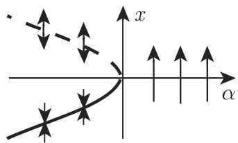  
(a)

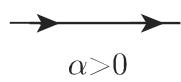  
(b)  
17.21

多维情形导致了 (17.67) 的邻域中的鞍结点分岔．当 $n = 2 , \lambda _ { 1 } = 0 , \lambda _ { 2 } < 0$ 时，这一分岔如图 17.22 所示．在扩充相空间中的鞍结点分岔如图 17.21(a) 所示对千充分光滑的向量场 (17.67)，鞍结点分岔是通有的．

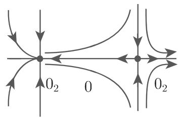  
a<O

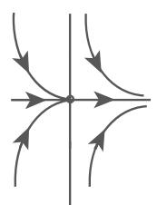  
a=O  
17.22

  
0:>0

若在这些关千 的允许有鞍结点分岔的条件中，用 $\frac { \partial F } { \partial \varepsilon } ( 0 , 0 ) = 0$ 和 $\frac { \partial ^ { 2 } F } { \partial x \partial \varepsilon } ( 0 , 0 )$ $\neq ~ 0$ 取代 $\frac { \partial F } { \partial \varepsilon } ( 0 , 0 ) \neq 0 .$ 则可由 (17.69) 得到一个跨临界分岔的截尾正规形式（没有高阶项） $\dot { x } \ = \ \alpha x - x ^ { 2 }$ ． 当 $n ~ = ~ 2 , ~ \lambda _ { 2 } ~ < ~ 0$ 时，跨临界分岔和分岔图如17.23 所示鞍结点分岔和跨临界分岔有分岔余维数 1.

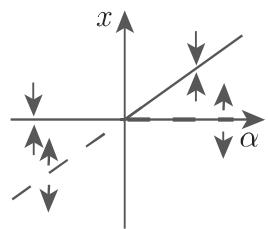

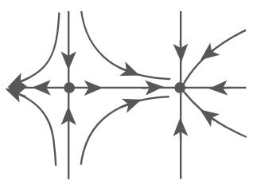  
a<O  
17.23

  
o:=0

  
a>O

3. 霍普夫分歧

(17.67) 中的 $n \geqslant 2 , l = 1 , r \geqslant 4$ . 假定对千所有满足条件 $\vert \varepsilon \vert \leqslant \varepsilon _ { 0 } \ \left( \varepsilon _ { 0 } > 0 \right.$ 且充分小）的 $f ( 0 , \varepsilon ) = 0$ 成立．假设雅可比矩阵 $D _ { x } f ( 0 , 0 )$ 的特征值满足$\lambda _ { 1 } = \overline { { \lambda _ { 2 } } } = \mathrm { i } \omega , \omega \neq 0 .$ 其余特征值的实部不为零．由中心流形定理可知，分岔可由下列形式的简化微分方程描述

$$
\dot {x} = \alpha (\varepsilon) x - \omega (\varepsilon) y + g _ {1} (x, y, \varepsilon), \quad \dot {y} = \omega (\varepsilon) x + \alpha (\varepsilon) y + g _ {2} (x, y, \varepsilon),\tag{17.71}
$$

其中 $\alpha , \omega , g _ { 1 } , g _ { 2 }$ 是可微函数，并且满足 $\omega ( 0 ) = \omega , \alpha ( 0 ) = 0$ ．通过一个非线性复坐标变换，（17.71) 在极坐标 $( r , \vartheta )$ 下可写为正规形式

$$
\dot {r} = \alpha (\varepsilon) r + a (\varepsilon) r ^ {3} + \dots , \quad \dot {\vartheta} = \omega (\varepsilon) + b (\varepsilon) r ^ {2} + \dots ,\tag{17.72}
$$

其中省略号表示高阶项由 (17.72) 的系数函数的泰勒展开可得到截尾正规形式

$$
\dot {r} = \alpha^ {\prime} (0) \varepsilon r + a (0) r ^ {3}, \quad \dot {\vartheta} = \omega (0) + \omega^ {\prime} (0) \varepsilon + b (0) r ^ {2}.\tag{17.73}
$$

安德罗诺夫 (Andronov)—霍普夫定理确保了当 $\varepsilon = 0$ 时，（17.73) 可描述在平衡点附近的 (17.72) 的分岔

在条件 $\alpha ^ { \prime } ( 0 ) > 0$ 假设下，（17.73) 有下列几种可能情形：

(1) $a ( 0 ) < 0 ($ （图 17.24(a)):

a) $\varepsilon > 0 :$ 稳定极限环和不稳定平衡点．

b) $\varepsilon = 0 \colon$ 环和平衡点融合成一个稳定平衡点．

c) $\varepsilon < 0 :$ ：当 $t \to + \infty$ 时，（0,0) 点附近的所有轨道如同情形 b) 那样螺旋式地趋向千平衡点 (0, 0).

(b)

e<0

E<O

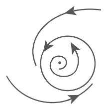  
(a)

  
17.24

(2) $a ( 0 ) > 0 ($ （图 17.24(b)):

a) $\varepsilon < 0 :$ 不稳定极限环．

b) $\varepsilon = 0 \mathrm { : }$ 环和平衡点融合成一个不稳定平衡点．

c) $\varepsilon > 0 :$ ：如同情形 b) 那样的螺旋型不稳定平衡点

对千初始系统 (17.67)，上述情形的阐释展示了一个复合平衡点（重数为复合焦点）的极限环的分岔，它被称为霍普夫分歧（或者安德罗诺夫—霍普夫分歧）．当 $a ( 0 ) < 0$ 时，它也被称为超临界，而当 $a ( 0 ) > 0$ 时，则被称为次临界（假定$\alpha ^ { \prime } ( 0 ) > 0 )$ ．当 $n = 3 , \lambda _ { 1 } = \overline { { { \lambda _ { 2 } } } } = { \mathrm { i } } , \lambda _ { 3 } < 0 , \alpha ^ { \prime } ( 0 ) > 0 , a ( 0 ) < 0$ 时，如图 17.25所示．

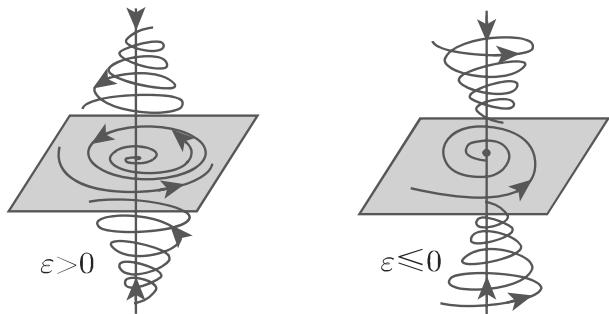  
17.25

霍普夫分歧是通有的，且有余维数为 1. 以上情形表明在上述假设下，超临界霍普夫分歧可巾焦点的稳定性识别：假设在 处的 (17.67) 右边的雅可比矩阵的特征值满足 $\lambda _ { 1 } ( 0 ) , \lambda _ { 2 } ( 0 )$ 是纯虚数，且其余特征值的实部不为零．进一步，假设$\frac { \mathrm { d } } { \mathrm { d } \varepsilon } \mathrm { R e } \lambda _ { 1 } ( \varepsilon ) _ { \vert \varepsilon = 0 } > 0$ ，且在 $\varepsilon = 0$ 处， 是系统 (17.67) 的一个渐近稳定焦点千是在$\varepsilon = 0$ 处，系统 (17.67) 有一个超临界霍普夫分歧

·含参数 的范德波尔 (van der Pol) 微分方程 $\ddot { x } + \varepsilon ( x ^ { 2 } - 1 ) \dot { x } + x = 0$ 可写成一个平面微分方程组

$$
\dot {x} = y, \quad \dot {y} = - \varepsilon (x ^ {2} - 1) y - x.\tag{17.74}
$$

当 $\varepsilon = 0$ 时，（17.74) 成为一个谐振子方程，它只有周期解和一个稳定但不是渐近稳定的平衡点．当 $\varepsilon > 0$ 时，（ 17.74) 在变换 $u = \sqrt { \varepsilon } x , v = \sqrt { \varepsilon } y$ 下可写为平面微分方程

$$
\dot {u} = v, \quad \dot {v} = - u - (u ^ {2} - \varepsilon) v.\tag{17.75}
$$

(17.75) 在平衡点 (0,0) 处的雅可比矩阵的特征值为 $\lambda _ { 1 , 2 } ( \varepsilon ) = \frac { \varepsilon } { 2 } \pm \sqrt { \frac { \varepsilon ^ { 2 } } { 4 } - 1 }$ 所以$\lambda _ { 1 , 2 } ( 0 ) = \pm \mathrm { i } , \frac { \mathrm { d } } { \mathrm { d } \varepsilon } \mathrm { R e } \lambda _ { 1 } ( \varepsilon ) _ { \left| \varepsilon = 0 \right. } = \frac { 1 } { 2 } > 0 .$

正如第 1125 17.1.2.3, 1. 中的例子，（0,0) 点是 (17.75) $\varepsilon = 0$ 处的渐近稳定平衡点．当 $\varepsilon = 0$ 时有超临界霍普夫分歧，当 $\varepsilon > 0$ 且较小时，（0,0) 是一个被极限环包围的不稳定焦点它的振幅随 增大而增大．

4. 双参数微分方程中的分岔

(1) 尖点分岔取定 (17.67) $r \geqslant 4 , l = 2$ 假设雅可比矩阵 $D _ { x } f ( 0 , 0 )$ 的特征值满足 $\lambda _ { 1 } = 0$ ，其余特征值的实部不为零．假设简化微分方程 (17.69) 满足$F ( 0 , 0 ) = \frac { \partial F } { \partial x } ( 0 , 0 ) = \frac { \partial ^ { 2 } F } { \partial x ^ { 2 } } ( 0 , 0 ) = 0$ 且 $l _ { 3 } : = \frac { \partial ^ { 3 } F } { \partial x ^ { 3 } } ( 0 , 0 ) \neq 0$ . 则由 (0,0)近的泰勒展开可得含参数 $\alpha _ { 1 } , \alpha _ { 2 }$ 的截尾正规形式（不含高阶项，参见 [17.1])

$$
\dot {x} = \alpha_ {1} + \alpha_ {2} x + \mathrm{sign} l _ {3} x ^ {3},\tag{17.76}
$$

集合 $\left\{ \left( \alpha _ { 1 } , \alpha _ { 2 } , x \right) : \alpha _ { 1 } + \alpha _ { 2 } x + \mathrm { s i g n } l _ { 3 } x ^ { 3 } = 0 \right\}$ 代表扩充相空间中的一张曲面，这张曲面被称为尖点（图 17.26(a)).

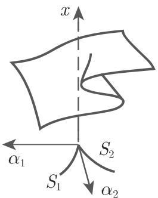

  
(b)

  
(c)

  
(d)

(a)  
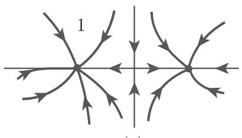  
(e)  
17.26

接下来，假定 $l _ { 3 } ~ < ~ 0 .$ . (17.76) 的非双曲平衡点可由方程组 $\alpha _ { 1 } + \alpha _ { 2 } x - x ^ { 3 } =$ $0 , \alpha _ { 2 } - 3 x ^ { 2 } = 0$ 定义它们位千由集合 $\left\{ \left( \alpha _ { 1 } , \alpha _ { 2 } \right) : 2 7 \alpha _ { 1 } ^ { 2 } - 4 \alpha _ { 2 } ^ { 3 } = 0 \right\}$ 确定的曲线$S _ { 1 } , S _ { 2 }$ 上，这些曲线形成一个尖点（图 7.26(b)）．若 $( \alpha _ { 1 } , \alpha _ { 2 } ) = ( 0 , 0 )$ ，则 (17.76)平衡点 是稳定的．例如取 $n = 2 , l _ { 3 } < 0 , \lambda _ { 1 } = 0$ 时，考虑 附近的 (17.67) 的相图当 $\lambda _ { 2 } < 0$ 时，为三重结点，如图 17.26(c) 所示；当 $\lambda _ { 2 } > 0$ 时，为三重鞍点，如17.26(d) 所示（参见 [17.14]).

从点 $( \alpha _ { 1 } , \alpha _ { 2 } ) = ( 0 , 0 )$ 转移到区域 （图 7.26(b)）的内部，（17.67) 的非双曲复合结点型平衡点会分裂成三个双曲平衡点（两个稳定结点和一个鞍点）（超临界叉型分岔）．

(17.67) 的二维相空间情形的相图如图 17.26(c), (e) 所示．当 $S _ { i } \backslash \{ ( 0 , 0 ) \} \ ( i =$ 1,2) 的参数对从区域 横截进入区域 时，则会形成一个双鞍结点型平衡点，但它最终消失，留下一个稳定双曲平衡点．

(2) 波格丹诺夫—塔肯 (Bogdanov-Takens) 分岔取 (17.67) 中的 $n \geqslant 2 , l =$ $2 , r \geqslant 2 .$ ，假设矩阵 $D _ { x } f ( 0 , 0 )$ 的特征值满足 $\lambda _ { 1 } = \lambda _ { 2 } = 0$ , 其余特征值的实部不为零令 维简化微分方程 (17.69) 拓扑等价千平面系统

$$
\dot {x} = y, \quad \dot {y} = \alpha_ {1} + \alpha_ {2} x + x ^ {2} - x y.\tag{17.77}
$$

千是在曲线 $S _ { 1 } = \{ ( \alpha _ { 1 } , \alpha _ { 2 } ) : \alpha _ { 2 } ^ { 2 } - 4 \alpha _ { 1 } = 0 \}$ 上有鞍结点分岔．从区域 $\alpha _ { 1 } < 0$ 进入到区域 $\alpha _ { 1 } > 0$ 时霍普夫分歧会在曲线 $S _ { 2 } = \{ ( \alpha _ { 1 } , \alpha _ { 2 } ) : \alpha _ { 1 } = 0 , \alpha _ { 2 } < 0 \}$ 上产生一个极限环，而在曲 $S _ { 3 } = \{ ( \alpha _ { 1 } , \alpha _ { 2 } ) : \alpha _ { 1 } = - k \alpha _ { 2 } ^ { 2 } + \cdot \cdot \cdot \}$ （常数 k>O) 上，存在一个相对千原始系统（图 17.27) 的分界线环，它在区域 中会分岔形成一个稳定极限环（参见 [17.1], [17.17]).

  
17.27

这种分岔具有全局属性，我们称之为由鞍点的同宿轨产生单一周期轨道，或者称之为分界线环消失

(3) 广义霍普夫分歧 假定在 (17.67) 中，对千 $r \geqslant 6$ 的霍普夫分歧的条件全部实现且通过坐标变换，二维简化微分方程在极坐标下有正规形式 $\dot { r } = \varepsilon _ { 1 } r + \varepsilon _ { 2 } r ^ { 3 } -$ $r ^ { 5 } + \cdots , \dot { \vartheta } = 1 + \cdot \cdot \cdot$ . 这一系统的分岔图（图 17.28) 包含直线 $S _ { 1 } = \{ ( \varepsilon _ { 1 } , \varepsilon _ { 2 } ) : \varepsilon _ { 1 } =$ $0 , \varepsilon _ { 2 } \neq 0 \}$ ，它上面的点代表一个霍普夫分歧（见 [17.1]）．在区域 中有两个周期轨，其中一个是稳定的，另一个不稳定．在曲 $S _ { 2 } = \{ ( \varepsilon _ { 1 } , \varepsilon _ { 2 } ) : \varepsilon _ { 2 } ^ { 2 } + 4 \varepsilon _ { 2 } > 0 , \varepsilon _ { 1 } < 0 \}$ 上，这些非双曲极限环融合成一个在区域 中消失的复合环．

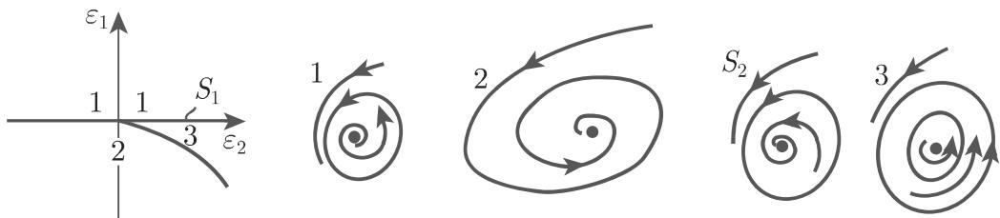  
17.28

．对称破缺

某些微分方程 (17.67) 在下列意义下有对称性：存在线性变换 （或者一个变换群）使得对千任意的 $x \in M$ 和 $\varepsilon \in V$ $f ( T x , \varepsilon ) = T f ( x , \varepsilon )$ 成立．若 $T \gamma = \gamma$ 则称 (17.67) 的轨道 $\gamma$ 关于 是对称的．

我们讨论在 $\varepsilon = 0$ 处的分岔的对称破缺．例如在 (17.67) 中（取 $l = 1 \ )$ ．当$\varepsilon < 0$ 时，若存在关千 对称的一个稳定平衡点或者一个稳定极限环；而当 $\varepsilon = 0$ 时，出现另外两个稳定定常状态或者极限环，它们关千 不再是对称的．

取 $f ( x , \varepsilon ) = \varepsilon x - x ^ { 3 }$ , 既然 $f ( - x , \varepsilon ) = - f ( x , \varepsilon ) \left( x \in \mathbb { R } , \varepsilon \in \mathbb { R } \right)$ ），则系统 (17.67)关千变换 $T : x \mapsto - x$ 是对称的．当 $\varepsilon \ < 0$ 时，点 $x _ { 1 } = 0$ 是稳定平衡点．当$\varepsilon > 0 , x _ { 1 } = 0$ 时，存在另外两个平衡点 $x _ { 2 , 3 } = \pm { \sqrt { \varepsilon } } ;$ 这两个点都不具有对称性

17.3.1.2 在周期轨邻域中的局部分岔

1. 映射的中心流形定理

当 $\varepsilon = 0$ 时令？ $\gamma$ 是 (17.67) 的周期轨，有乘子 $\rho _ { 1 } , \cdot \cdot \cdot , \rho _ { n - 1 } , \rho _ { n } = 1$ . 若当改变 $\varepsilon$ 时，至少有一个乘子位千复单位圆周上，则 $\gamma$ 附近可能出现分岔．应用横截千$\gamma$ 的曲面可定义含参数的庞加莱映射

$$
x \mapsto P (x, \varepsilon).\tag{17.78}
$$

千是对千开集 $E \subset \mathbb { R } ^ { n - 1 } , \ V \subset \mathbb { R } ^ { l }$ ，令 $P : E \times V \to \mathbb { R } ^ { n - 1 }$ 是一个 $C ^ { r }$ 映射，其中映射 ${ \tilde { P } } : E \times V \longmapsto \mathbb { R } ^ { n - 1 } \times \mathbb { R } ^ { l }$ 满足 $\tilde { P } ( x , \varepsilon ) = ( P ( x , \varepsilon ) , \varepsilon )$ 是一个 $C ^ { r }$ 微分同胚进一步，令 $P ( 0 , 0 ) = 0$ , 且假设雅可比矩阵 $D _ { x } P ( 0 , 0 )$ 的特征值满足 $| \rho _ { i } | =$ 1, $i = 1 , \cdots , s . | \rho _ { j } | < 1 , \ : j = s + 1 , \cdots , s + m . | \rho _ { i } | > 1 , \ : i = s + m + 1 , \cdots , n - 1 .$ .$k = n - s - m - 1$ ．千是，由映射的中 $\aleph _ { \aleph }$ 流形定理可知（见 [17.11]），在 $( 0 , 0 ) \in E \times V$ 点附近映射 $\tilde { P }$ 拓扑共辄千

$$
(x, y, z, \varepsilon) \mapsto (F (x, \varepsilon), A ^ {s} y, A ^ {u} z, \varepsilon)\tag{17.79}
$$

且在 $( 0 , 0 ) \in \mathbb { R } ^ { n - 1 } \times \mathbb { R } ^ { l }$ 附近有 $F ( x , \varepsilon ) = A ^ { c } x + g ( x , \varepsilon )$ ．其中 $C ^ { r }$ 光滑映射 $g$ 满足条件 $g ( 0 , 0 ) = 0 , D x g ( 0 , 0 ) = 0$ . 而矩阵 $A ^ { c } , A ^ { s }$ 和 $A ^ { u }$ 分别为 $( s , s ) , ( m , m )$ 和$( k , k )$ 型.

(17.79) 可知 (17.78) (0,0) 附近的分岔由下列定义在局部中 $\aleph _ { \aleph }$ 流形$W _ { \mathrm { l o c } } ^ { \mathrm { c } } = \{ ( x , y , z ) : y = 0 , z = 0 \}$ 上的约化映射

$$
x \mapsto F (x, \varepsilon)\tag{17.80}
$$

唯一描述

2. 二重半稳定周期轨的分岔

在系统 (17.67) 中取定 $n \geqslant 2 , r \geqslant 3 , l = 1$ . $\varepsilon = 0$ 处，假设系统 (17.67)周期轨 $\gamma ,$ 其乘子满足 $\rho _ { 1 } = + 1 , | \rho _ { i } | \neq 1 ( i = 2 , 3 , \cdots , n - 1 ) , \rho _ { n } = 1$ . 由映射的中心流形定理可得庞加莱映射 (17.78) 的分岔可由满足条件 $A ^ { c } = 1$ 维约化映(17.80) 描述若假定 $\frac { \partial ^ { 2 } F } { \partial x ^ { 2 } } ( 0 , 0 ) \neq 0$ 和— $\frac { \partial F } { \partial \varepsilon } ( 0 , 0 ) \neq 0$ 则有正规形式

$$
x \mapsto \tilde {F} (x, \alpha) = \alpha + x + x ^ {2} \quad \left(\text {当} \frac {\partial^ {2} F}{\partial x ^ {2}} (0, 0) > 0 \text {时}\right)\tag{17.81a}
$$

或者

$$
x \mapsto \alpha + x - x ^ {2} \quad \left(\text {当}   \frac {\partial^ {2} F}{\partial x ^ {2}} (0, 0) <   0   \text {时}\right).\tag{17.81b}
$$

附近对 (17.81a) 作迭代，对应千不同的 其相图如图 17.29(a) 7.29(b)所示（见 [17.1]）．当 $\alpha < 0$ 时在 $x = 0$ 附近有一个稳定平衡点和一个不稳定平衡点它们在 $\alpha = 0$ 处融合成不稳定定常状态 $x = 0$ .当 $\alpha > 0$ 时在 $x = 0$ 附近没有平衡点在 (17.80) 中由 (17.81a) 描述的分岔被称为映射的次临界鞍结点分岔

(a)  

(b)  

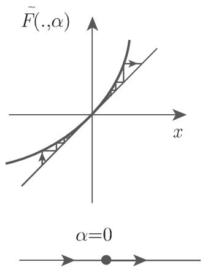  
17.29

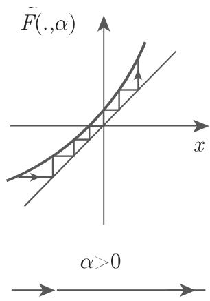

在微分方程 (17.67) 的情形下，映射 (17.81a) 的性质描述了一个二重半稳定周期轨的分岔当 $\alpha ~ < ~ 0$ 时，存在一个稳定周期轨 $\gamma _ { 1 }$ 和一个不稳定周期轨 $\gamma _ { 2 }$ 它们在 $\alpha \ : = \ : 0$ 处融合成一个半稳定轨 $\gamma ,$ 而当 $\alpha ~ > ~ 0$ 时，这个半稳定轨消失（图 17.30(a), (b)).

3. 周期加倍或 Flip 分岔

在系统 (17.67) 中取定 $n \geqslant 2 , r \geqslant 4 , l = 1$ . 考虑在 $\varepsilon = 0$ 处的周期轨 $\gamma ,$ 其乘子满足 $\rho _ { 1 } = - 1 , | \rho _ { i } | \neq 1 ( i = 2 , 3 , \cdots , n - 1 ) , \rho _ { n } = 1$ . 若假定正规形式为

$$
x \mapsto \tilde {F} (x, \alpha) = (- 1 + \alpha) x + x ^ {3},\tag{17.82}
$$

a=O

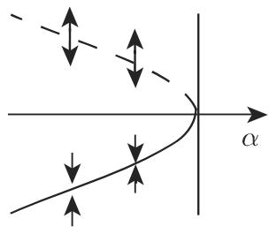  
(a)

(b)  
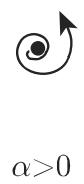  
17.30

  
(c)

则在 附近庞加莱映射的分岔行为可由满足条件 $A ^ { c } = - 1$ 维映射 (17.80)描述

当 $\alpha \geqslant 0$ 且较小时，（17.82) 的定常状态 $x = 0$ 是稳定的；当 $\alpha < 0$ 时，则不稳定当 $\alpha < 0$ 时，二次迭代映 $\tilde { F } ^ { 2 }$ 除了点 $x = 0$ 外，另有两个稳定不动点$x _ { 1 , 2 } = \pm \sqrt { - \alpha } + o ( | \alpha | )$ ），但它们不 $\tilde { F }$ 的不动点．因此，它们都是 (17.82) 的周期为的点

一般地对千 $C ^ { 4 }$ 光滑映射 (17.80) ，若满足下列条件（见 [17.2]):

$$
\begin{array}{r l} & F (0, 0) = 0, \frac {\partial F}{\partial x} (0, 0) = - 1, \frac {\partial F ^ {2}}{\partial \varepsilon} (0, 0) = 0, \\ & \frac {\partial^ {2} F ^ {2}}{\partial x \partial \varepsilon} (0, 0) \neq 0, \frac {\partial^ {2} F ^ {2}}{\partial x ^ {2}} (0, 0) = 0, \frac {\partial^ {3} F ^ {2}}{\partial x ^ {3}} (0, 0) \neq 0, \end{array}\tag{17.83}
$$

则在 $\varepsilon = 0$ 处存在一个双周期轨既然 $\frac { \partial F ^ { 2 } } { \partial x } ( 0 , 0 ) = 1 \Bigg ( \mathbb { E } \mathbb { F } \frac { \partial F } { \partial x } ( 0 , 0 ) = - 1 \Bigg )$ ，叉型分岔的条件对千映射 $F ^ { 2 }$ 成立．

对千微分方程 (17.67)，由映射 (17.82) 的性质可推出在 $\alpha = 0$ 处，具有近似双周期（周期加倍）的轨 $\gamma$ ？分裂出稳定周期 $\gamma _ { \alpha }$ ，其中？ $\gamma$ 损失了稳定性（图 17.30(c)).

定义逻辑斯谛映射 $\varphi _ { \alpha } : [ 0 , 1 ] \to [ 0 , 1 ] , 0 < \alpha \leqslant 4 , \varphi _ { \alpha } ( x ) = \alpha x ( 1 - x )$ ．即，可由离散系统

$$
x _ {t + 1} = \alpha x _ {t} (1 - x _ {t})\tag{17.84}
$$

给出．

映射具有下列分岔行为（见 [17.9]）：当 $0 < \alpha \leqslant 1$ 时系统 (17.84) 有平衡点0, [O, 1] 是它的吸引域当 $1 < \alpha < 3$ 时，（17.84) 有不稳定平衡点 和稳定平衡点$1 - 1 / \alpha$ ，后者有 (0, 1) 作为吸引域当 $\alpha _ { 1 } = 3$ 时，平衡点 $1 - 1 / \alpha$ 是不稳定的，会产生一个稳定的双周期轨．

当 $\alpha _ { 2 } = 1 + \sqrt { 6 }$ 时双周期轨也是不稳定的，会产生一个周期为 $2 ^ { 2 }$ 的稳定轨道周期加倍接连出现当 $\alpha = \alpha _ { q }$ 时，会出现周期 $2 ^ { q }$ 沪的稳定轨道数值实验表明当 $q \to \infty$ 时， $\alpha _ { q }  \alpha _ { \infty } \approx 3 . 5 7 0 \cdot \cdot \cdot$

当 $\alpha = \alpha _ { \infty }$ 时，存在具有类似康托尔集结构的吸引子 （费根鲍姆 (Feigen-baum) 吸引子）．存在任意靠近吸引子的点这些点在迭代中并不趋向千吸引子，而是趋向千一个不稳定周期轨．吸引子 有稠密轨道，且有豪斯多夫维 $d _ { \mathrm { H } } ( F ) \approx$ 0.538 · · ·.另一方面它对千初值的依赖性并不敏感在区域 $\alpha _ { \infty } < \alpha < 4$ 中，存在一个具有正勒贝格测度的参数集合 使得对千 $\alpha \in A$ 系统 (17.84) 有正勒贝格测度的混沌吸引子．在集合 上散布着周期加倍发生时所对应的窗口．

逻辑斯谛映射的分岔行为也能在一类单峰映射中找到．即，具有单个极大值的区间 上的自映射．虽然对千不同的单峰映射，周期加倍发生时所对应的参数值$\alpha _ { i }$ 彼此不同但是这些参数趋向千 $\alpha _ { \infty }$ 的速率是相同的： $\alpha _ { k } - \alpha _ { \infty } \approx C \delta ^ { - k }$ ，其中8 = 4.6692 · · ·是费根鲍姆常数(C 依赖千具体的映射）．当 $\alpha = \alpha _ { \infty }$ 时，所有吸引的豪斯多夫维数都是相同的： $d _ { \mathrm { H } } ( F ) \approx 0 . 5 3 8 \cdot \cdot \cdot$

4. 环面的产生

考虑系统 (17.67) ，取定? $\geqslant 3 , r \geqslant 6 , l = 1$ . 假定系统 (17.67) 对所有充分小的存在一个周期轨 $\gamma _ { \varepsilon }$ :• $\gamma _ { 0 }$ 的乘子满足条件 $\rho _ { 1 , 2 } = \operatorname { e } ^ { \pm \mathrm { i } \Psi }$ 业茫 $\left\{ 0 , \frac { \pi } { 2 } , \frac { 2 \pi } { 3 } , \pi \right\}$ 以及$\rho _ { n } = 1$ ，其余乘子的模长不为 1.

由中心流形定理可知此时存在一个 $C ^ { 6 }$ 光滑的 维约化映射

$$
x \mapsto F (x, \varepsilon)\tag{17.85}
$$

对千较小的 满足条件 $F ( 0 , \varepsilon ) = 0$

若对千较小的 $\varepsilon ,$ ，雅可比矩阵 $D _ { x } F ( 0 , \varepsilon )$ 有共辄复特征值 $\rho ( \varepsilon ) , { \bar { \rho } } ( \varepsilon )$ 使得 $| \rho ( 0 ) | =$ 1, $d : = \frac { \mathrm { d } } { \mathrm { d } \varepsilon } | \rho ( \varepsilon ) | _ { | \varepsilon = 0 } > 0$ 成立，且 $\rho ( 0 )$ 不是 次单位根， $q = 1 , 2 , 3 , 4$ ，则通过一个光滑依赖千 $\varepsilon$ 的坐标变换，（17.85) 可写为 $x \mapsto \tilde { F } ( x , \varepsilon ) = \tilde { F } _ { 0 } ( x , \varepsilon ) + O ( \Vert x \Vert ^ { 5 } )$ (0 是朗道 (Landau) 符号），其 $\tilde { F } _ { 0 }$ 在极坐标下可写为

$$
\binom{r}{\vartheta} \mapsto \binom{| \rho (\varepsilon) | r + a (\varepsilon) r ^ {3}}{\vartheta + \omega (\varepsilon) + b (\varepsilon) r ^ {2}},\tag{17.86}
$$

这里 $a , \omega , b$ 是可微函数假定 $a ( 0 ) < 0$ 成立．从而当 $\varepsilon < 0$ 时，（ 17.86) 的平衡点 $r = 0$ 是渐近稳定的；当 $\varepsilon > 0$ 时，则不稳定进一步，当 $\varepsilon > 0$ 时，存在在映射(17.86) 下不变的圆周 $r = \sqrt { - \frac { d \varepsilon } { a ( 0 ) } }$ 它是渐近稳定的（图 17.31(a)).

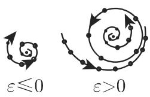  
(a)

  
(b)  
17.31

o:>0

Neimark-Sacker 定理（见 [17.18], [17.3] ）表明 (17.86) 的分岔行为与 $\tilde { F }$ 的分岔行为相似（映射的超临界霍普夫分歧）．

在映射 (17.85) 中，取定

$$
\left( \begin{array}{l} x \\ y \end{array} \right) \mapsto \frac {1}{\sqrt {2}} \left( \begin{array}{l} (1 + \varepsilon) x + y + x ^ {2} - 2 y ^ {2} \\ - x + (1 + \varepsilon) y + x ^ {2} - x ^ {3} \end{array} \right),
$$

在 $\varepsilon = 0$ 处有超临界霍普夫分歧

关千微分方程 (17.67)，映射 (17.85) 的闭不变曲线的存在意味着当 $a ( 0 ) < 0$ 时，周期轨？ $\gamma _ { 0 }$ 。是不稳定的；当 $\varepsilon > 0$ 时，会产生一个关千 (17.67) 不变的环面（图 17.31(b)).

17.3.1.3 全局分岔

除了当分界线环消失时所出现的周期生成轨，（17.67) 可以有另外的全局分岔．其中的两个作为例子在 [17.11] 中说明

1. 源自鞍结点消失的周期轨的出现

含参数系统

$$
\dot {x} = x (1 - x ^ {2} - y ^ {2}) + y (1 + x + \alpha), \quad \dot {y} = - x (1 + x + \alpha) + y (1 - x ^ {2} - y ^ {2})
$$

在极坐标 $x = r \cos \vartheta , y = r \sin \vartheta$ 下形如

$$
\dot {r} = r (1 - r ^ {2}), \quad \dot {\vartheta} = - (1 + \alpha + r \cos \vartheta).\tag{17.87}
$$

显然，对千任意参数 $\alpha ,$ 圆周 $r = 1$ (17.87) 下是不变的，当 $t \to \infty$ 时所有轨道（除了平衡点 (0,0)）都趋向千该圆周．当 $\alpha < 0$ 时，在圆周上存在一个鞍点和一个稳定结点它们在 $\alpha = 0$ 处融合成一个复合鞍结点型平衡点．当 $\alpha > 0$ 时该圆周是一个周期轨，其上没有平衡点（图 17.32).

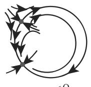  
o:<0

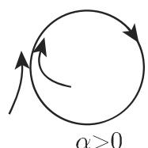  
17.32

2. 平面上鞍—鞍形分界线环的消失

考虑含参数平面微分方程

$$
\dot {x} = \alpha + 2 x y, \quad \dot {y} = 1 + x ^ {2} - y ^ {2}.\tag{17.88}
$$

当 $\alpha = 0$ 时，方程 (17.88) 有两个鞍点 (0, 1) (0, l), 轴是它的不变集异宿轨是不变集的一部分．对千较小 $| \alpha | \neq 0 ;$ ，当异宿轨消失时，鞍点被保留（图 17.33).

  
17.33
