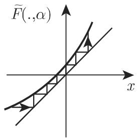
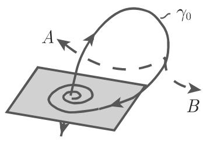
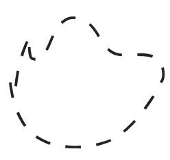
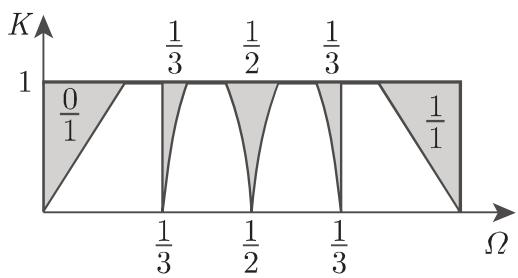
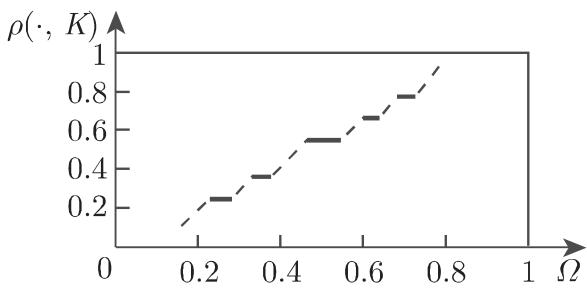

#### 17.3.2 过渡到混沌

通常一个奇异吸引子不会突然出现，而是伴随着一系列分岔而来，这些典型的分岔见 17.3.1 中阐释产生奇异吸引子或奇异不变集的最重要的方式会在下述中描述

17.3.2.1 周期倍增级联

与逻辑斯蒂方程 (17.84) 相类似周期倍增级联也能在连续时间系统中以如下方式产生．当 $\varepsilon < \varepsilon _ { 1 }$ 时假设系统 (17.67) 有稳定周期轨 $\gamma _ { \varepsilon } ^ { ( 1 ) }$ ．当 $\varepsilon = \varepsilon _ { 1 }$ 时，在$\gamma _ { \varepsilon 1 } ^ { ( 1 ) }$ 附近发生周期加倍，随着 $\varepsilon > \varepsilon _ { 1 }$ ，周期轨 $\gamma _ { \varepsilon } ^ { ( 1 ) }$ 将丧失稳定性．它会分裂出一个近似双周期的周期轨 $\gamma _ { \varepsilon 1 } ^ { ( 2 ) }$ 雇当 $\varepsilon = \varepsilon _ { 2 }$ 时，出现新的周期加倍，此时 $\gamma _ { \varepsilon 2 } ^ { ( 2 ) }$ 将丧失稳定性，同时出现一个具有近似双周期的稳定轨道 $\gamma _ { \varepsilon 2 } ^ { ( 4 ) }$ ．对千系统 (17.67) 这些重要的类型周期倍增的过程会持续出现，从而产生一组参数｛ $\left\{ \varepsilon _ { j } \right\}$

对千某些微分方程 (17.67)，诸如洛伦茨系统这样的流体方程组的数值计算表明：极限

$$
\lim _ {j \to \infty} \frac {\varepsilon_ {j + 1} - \varepsilon_ {j}}{\varepsilon_ {j + 2} - \varepsilon_ {j + 1}} = \delta\tag{17.89}
$$

存在，其中 仍然是费根鲍姆常数

当 $\varepsilon _ { * } = \operatorname* { l i m } _ { j \to + \infty } \varepsilon _ { j }$ 时，具有无穷周期的环会丧失稳定性，同时出现奇异吸引子．

(17.67)中通过一个周期倍增级联产生的奇异吸引子的儿何背景如图 7.34(a)所示．庞加莱截面近似地显示为一个面包师映射，这暗示出现了类康托尔集的结构．

  
(a)

  
(b)  
17.34

17.3.2.2 间歇混沌

考虑 (17.67) 的一个稳定周期轨．若当 $\varepsilon < 0$ 时恰有一个乘子在单位原周内取值为 ，则它在 $\varepsilon = 0$ 处丧失稳定性．由中心流形定理可得，庞加莱映射对应的鞍结点分岔可巾在正规形式 $x \mapsto { \tilde { F } } ( x , \alpha ) = \alpha + x + x ^ { 2 } + \cdot \cdot \cdot$ .下的一维映射描述，其中 $\alpha$ 是一个依赖千 $\varepsilon$ 的参数，即 $\alpha = \alpha ( \varepsilon ) , \alpha ( 0 ) = 0$ .当 $\alpha > 0$ 时， $\tilde { F } ( \cdot , \alpha )$ 的图像如图 7.34(b) 所示．

正如图 7.34(b) 中所示，当 $\alpha \gtrsim 0$ 时， $\tilde { F } ( \cdot , \alpha )$ 的迭代在隧道区域停留相对较长时间．对千方程 (17.67)，这意味着对应的轨道在原始周期轨道附近停留相对较长时间在这期间，（17.68) 的行为是近似周期的（层流相）．在通过隧道区域以后，这些轨道开始逃逸，表现出不规则运动（湍流相）．经过某段时间以后，轨道开始恢复，再次出现新的层流相．若周期轨消失，它的稳定性也走向混沌集，此时会产生奇异吸引子．鞍结点分岔只是在间歇混沌的场景中起作用的典型局部分岔中的一个．另外两个是周期加倍和环而产生

17.3.2.3 全局同宿分岔

1. 斯梅尔定理

令 $\mathbb { R } ^ { 3 }$ 上的微分方程 (17.67) 在周期轨勹附近的庞加莱映射的不变流形如第1136 页图 17.11 (b) 所示．对应千 (17.67) 的同宿轨的同宿点 $P ^ { j } ( x _ { 0 } )$ 横截千 $\gamma .$ ·在(17.67) 中这类同宿轨的存在会导致对初始条件的敏感依赖性．斯梅尔 (Smale)入了与庞加莱映射相关联的马蹄映射，得到了如下结果：

a) 在庞加莱映射 (17.80) 的横截同宿轨的每个邻域中总存在该映射的周期点（斯梅尔定理）．因此，横截同宿点的每个邻域内总存在一个 $P ^ { m } ( m \in \mathbb { N } )$ 不变集 A,它具有康托尔集结构． $P ^ { m }$ 上的限制共辄千一个伯努利移位，即共辄千一个混合系统

b) 靠近同宿轨的微分方程 (17.67) 的不变集类似千一个康托尔集与单位圆周的乘积．若这个不变集是吸引的，则它表示 (17.67) 的一个奇异吸引子．

2. 什尔尼科夫 (Shilnikov) 定理

考虑 $\mathbb { R } ^ { 3 }$ 上具有标量参数 $\varepsilon$ 的方程 (17.67) ．假定系统 (17.67) $\varepsilon = 0$ 处有一个双曲鞍结点型定常状态 ，只要 $| \varepsilon |$ 保持很小，这一定常状态就一直存在．设雅可比矩阵 $D _ { x } f ( 0 , 0 )$ 的特征值满足 $\lambda _ { 1 , 2 } = a \pm \mathrm { i } \omega , a < 0$ 以及 $\lambda _ { 3 } > 0$ . 另外，假设(17.67) $\varepsilon = 0$ 处有一个分界线环 $\gamma _ { 0 }$ ' 即当 $t \to + \infty$ 和 $t \to - \infty$ 时，一个趋千的同宿轨（图 17.35(a)）．千是，在分界线环的邻域内 (17.67) 有下列相图

a) 令 $\lambda _ { 3 } + a < 0$ ．依据图 17.35(a) 中的变化 A, 若在 $\varepsilon \neq 0$ 处分界线环破裂，则在 $\varepsilon = 0$ 处恰有一个 (17.67) 的周期轨依据图 17.35(a) 中的变化 $B _ { : }$ 若在 $\varepsilon \neq 0$ 处分界线环破裂，则没有周期轨．

  
(a)

  
(b)  
17.35

b) 令 $\lambda _ { 3 } + a > 0$ ．则当 $\varepsilon = 0$ 时（分别地，当 $| \varepsilon |$ 较小时），在分界线环 $\gamma _ { 0 }$ 附近（分别地在破裂环 $\gamma _ { 0 }$ 附近）存在可数多个鞍点型周期轨．关千一个横截千 $\gamma _ { 0 }$ 的平而的庞加莱映射在 $\varepsilon = 0$ 处生成一个马蹄映射的可数集合，而当 $| \varepsilon | \neq 0$ 且较小时从这个集合中仍然保留了有限多个．

3. 梅尔尼科夫方法

考虑平面微分方程

$$
\dot {x} = f (x) + \varepsilon g (t, x),\tag{17.90}
$$

其中 是一个小参数．当 $\varepsilon = 0$ 时，令 (17.90) 是一个哈密顿系统（参见第 113817.1.4.3, 2. ），即对千 $f = ( f _ { 1 } , f _ { 2 } )$ ，有 $f _ { 1 } = \frac { \partial H } { \partial x _ { 2 } } , f _ { 2 } = - \frac { \partial H } { \partial x _ { 1 } }$ 成立，其中假定$H : U \subset \mathbb { R } ^ { 2 } \to$ 叹是一个 $C ^ { 3 }$ 光滑函数．设依赖千时间的向量场 ：厌 $\times U \to \mathbb { R } ^ { 2 }$ 是次连续可微的，且关千第一个变量是 周期的进一步，令 f, 在有界集上是有界的．当 $\varepsilon = 0$ 时，假定关千鞍点 存在一个同宿轨，且在相空间 $\{ ( x _ { 1 } , x _ { 2 } , t ) \} , t = t _ { 0 }$ (17.90) 的庞加莱截面 $\Sigma _ { t _ { 0 } }$ 如图 7.35(b) 所示．对千较小的团，庞加莱映射$P _ { \varepsilon , t _ { 0 } } : \Sigma _ { t _ { 0 } } \to \Sigma _ { t _ { 0 } }$ 在 $x = 0$ 附近有鞍点 $p _ { \varepsilon }$ ，它具有不变流形 $W ^ { s } ( p _ { \varepsilon } )$ 和 $W ^ { u } ( p _ { \varepsilon } )$ 若定义未扰动系统的同宿轨为 $\varphi ( t - t _ { 0 } )$ ，则沿着过 $\varphi ( 0 )$ 点且垂直千 $f ( \varphi ( 0 ) )$ ）的直线所测量得到的流形 $W ^ { s } ( p _ { \varepsilon } )$ 和 $W ^ { u } ( p _ { \varepsilon } )$ 之间的距离可通过以下公式计算

$$
d (t _ {0}) = \varepsilon \frac {M (t _ {0})}{\| f (\varphi (0)) \|} + O (\varepsilon^ {2}).\tag{17.91}
$$

其中， $M ( \cdot )$ 是梅尔尼科夫 (Melnikov) 函数，定义如下

$$
M (t _ {0}) = \int_ {- \infty} ^ {+ \infty} f (\varphi (t - t _ {0})) \wedge g (t, \varphi (t - t _ {0})) \mathrm{d} t.\tag{17.92}
$$

（对千 $a = ( a _ { 1 } , a _ { 2 } ) , b = ( b _ { 1 } , b _ { 2 } )$ ， I\ 表示 $a \wedge b = a _ { 1 } b _ { 2 } - a _ { 2 } b _ { 1 } . )$ 若梅尔尼科夫函数M 在 $t _ { 0 }$ 处有单根，即 $M ( t _ { 0 } ) = 0 , M ^ { \prime } ( t _ { 0 } ) \neq 0$ 则对千充分小的 $\varepsilon > 0$ 流形 $W ^ { s } ( p _ { \varepsilon } )$ 和 $W ^ { u } ( p _ { \varepsilon } )$ 横截相交．若 没有根，则 $W ^ { s } ( p _ { \varepsilon } ) \cap W ^ { u } ( p _ { \varepsilon } ) = \emptyset$ 即没有同宿点．

假定未扰动系统 (17.90) 有由 $\varphi ( t - t _ { 0 } )$ 定义的异宿轨，它从鞍点 $0 _ { 1 }$ 运动到鞍点 $0 _ { 2 }$ ．当 $| \varepsilon |$ 较小时，令 $p _ { \varepsilon } ^ { 1 } , p _ { \varepsilon } ^ { 2 }$ 是庞加莱映射 $P _ { \varepsilon , t _ { 0 } }$ 的鞍点．若通过上述计算，M 在 $t _ { 0 }$ 。处有单根，则当 $| \varepsilon |$ 较小时， $W ^ { s } ( p _ { \varepsilon } ^ { 1 } )$ 和 $W ^ { u } ( p _ { \varepsilon } ^ { 2 } )$ 横截相交．

考虑周期扰动的单摆方程 $\ddot { x } + \sin x = \varepsilon \sin \omega t$ 即系统 ${ \dot { x } } = y , { \dot { y } } = - \sin x + $ $\varepsilon \sin \omega t .$ ，其中 $\varepsilon$ 是小参数， $\omega$ 是另一个参数未扰动系统 ${ \dot { x } } = y , { \dot { y } } = - \sin { x }$ 是一个哈密顿系统满足 $H ( x , y ) = { \frac { 1 } { 2 } } y ^ { 2 } - \cos x$ . 由 $\varphi ^ { \pm } ( t ) = \left( \pm 2 \arctan ( \sin t ) , \pm 2 { \frac { 1 } { \cosh t } } \right)$ $( t \in \mathbb { R } )$ （在其他轨道之间）定义了一对经过点(— $( - \pi , 0 ) , ( \pi , 0 )$ 的异宿轨（在圆柱相空间 $\mathbb { S } ^ { 1 } \times \mathbb { R }$ 上这些是同宿轨）．直接计算梅尔尼科夫函数可得， $M ( t _ { 0 } ) = \mp \frac { 2 \pi \sin \omega t _ { 0 } } { \cosh ( \pi \omega / 2 ) }$ 既然 M 在 $t _ { 0 } = 0$ 处有单根，则当 $\varepsilon > 0$ 且较小时，扰动系统的庞加莱映射有横截同宿点．

17.3.2.4 环面的破裂

1. 从环面到混沌

(1) 湍流的霍普夫—朗道 (Hopf-Landau) 模型 从规则运动（层流）到不规则运动（湍流）的过渡问题在含扰动参数系统中是尤其引人关注的问题．例如，这类系统可巾偏微分方程描述从这方面来看，混沌可看成是在时间上不规则但在空间上有序的行为

从另一方面看，湍流则是在时间和空间上都不规则的系统行为霍普夫—朗道模型解释了如何通过一个无穷霍普夫分歧级联产生湍流：当 $\varepsilon = \varepsilon _ { 1 }$ 时，定常状态在极限环上分岔，导致环面 $T ^ { 2 }$ 的产生，当 $\varepsilon > \varepsilon _ { 1 }$ 时极限环会变得不稳定在第这一类型分岔处，卷绕在环而上的非闭轨道会生成一个 维环而．一般来讲，霍普夫—朗道模型不会导致出现对初始条件敏感依赖且为混合的吸引子．

(2) 吕埃勒—塔肯—纽豪斯 (Ruelle- Takens-N ew house) 场景 在系统 (17.67)取定 $n \geqslant$ $l = 1$ . 同时假定随着参数的改变，分岔序列“平衡点一周期轨一环面 $T ^ { 2 } $ 环面 $T ^ { 3 } { } ^ { \dag }$ 是由接连三个霍普夫分歧造成的．

令在 $T ^ { 3 }$ 上的拟周期流是结构不稳定的．千是，（17.67) 的某些小扰动会造成环面 $T ^ { 3 }$ 的破裂和结构稳定的奇异吸引子的产生

(3) 关千光滑性损失的阿弗莱诺维奇才十尔尼科夫 (Afraimovich-Shilnikov)理和环面 $T ^ { 2 }$ 的破裂对千充分光滑的系统 (17.67) 取定 $n \geqslant 3 , l = 2$ 对千参数值 $\varepsilon _ { 0 }$ 。假定系统 (17.67) 有由稳定周期轨 $\gamma _ { s }$ 、鞍点型周期轨 $\gamma _ { u }$ 和它的不稳定流形$W ^ { u } ( \gamma _ { u } )$ 张成的光滑吸引环面 $T ^ { 2 } ( \varepsilon _ { 0 } )$ （共振环面）．

按照沿经线方向横截环面的曲面计算得到的庞加莱映射的平衡点的不变流形如图 17.36(a) 所示．假设轨道 $\gamma _ { s }$ 的离单位圆周最近的乘子 $\rho$ 是实数，且为单重．进一步，令 $\varepsilon ( \cdot ) : [ 0 , 1 ] \to V$ 是参数空间中任意一条连续曲线，满足条件 $\varepsilon ( 0 ) = \varepsilon _ { 0 }$ 且当 $\varepsilon = \varepsilon ( 1 )$ 时系统 (17.67) 没有不变共振环面千是有下列结论成立：

a) 存在 $s _ { * } \in ( 0 , 1 )$ 使得 $T ^ { 2 } ( \varepsilon ( s _ { * } ) )$ ）损失光滑性，其中，乘子 $\rho ( s _ { * } )$ 是复的或者在 $\gamma _ { s }$ 附近不稳定流形 $W ^ { u } ( \gamma _ { u } )$ 损失光滑性

b) 存在另一个参数值 $s _ { * * } \in ( s _ { * } , 1 )$ 使得当 $s \in ( s _ { * * } , 1 ]$ 时，系统 (17.67) 没有共振环面环面会以下列方式破裂：

Q) $\varepsilon = \varepsilon ( s _ { * * } )$ 时，周期轨 $\gamma _ { s }$ 丧失稳定性一个局部分岔以周期加倍或者环面形成的形式出现

3) $\varepsilon = \varepsilon ( s _ { * * } )$ ）时，周期 $\gamma _ { u }$ 和 $\gamma _ { s }$ 一致（鞍结点分岔），因此它们都会消失．

'Y) $\varepsilon = \varepsilon ( s _ { * * } )$ 时， $\gamma _ { u }$ 的稳定和不稳定流形非横截相交（参见图 17.36(C)的分岔图）．喙状曲线 $S _ { 1 }$ 的点对应了 $\gamma _ { s } , \gamma _ { u }$ 的融合（鞍结点分岔）．喙状曲线的末梢 $C _ { 1 }$ 位千曲线 $S _ { 0 }$ ，它对应了环面的分裂．

出现光滑性损失的参数点在曲线 $S _ { 2 }$ 上，而 $S _ { 3 }$ 上的点刻画了环面 $T ^ { 2 }$ 消散．对千 $\gamma _ { u }$ 的稳定和不稳定流形彼此非横截相交的参数点都在曲线 $S _ { 4 }$ 上．令 $P _ { 0 }$ 是 $\frac { \dot { \triangledown } } { \surd \mu }$ 嘴的喙状末梢上的任意一点，使得对千这一参数值有共振环面 $T ^ { 2 }$ 出现．从 $P _ { 0 }$ 过渡到 $P _ { 1 }$ ，对应了定理的情形 $\alpha )$ . 若乘子 $\rho$ 在 $S _ { 2 }$ 上变成－1, 则有周期加倍．接着周期倍增级联会导致奇异吸引子出现．若穿过 $S _ { 2 }$ 的一对复共辄乘子 $\rho _ { 1 , 2 }$ 在单位圆周上出现则会导致另一个环面的分裂，此时可再次应用阿弗莱诺维奇—什尔尼科夫定理从 $P _ { 0 }$ 过渡到 $P _ { 2 }$ ，对应了定理的情形 $\beta )$ ：环面损失光滑性，在 $S _ { 1 }$ 上穿过有鞍结点分岔环面破裂，可能出现通过间歇性过渡到混沌．从 $P _ { 0 }$ 过渡到 $P _ { 3 }$ ，最终对应了定理的情形 $\gamma )$ ：在损失光滑性之后，在 $S _ { 4 }$ 上穿过会形成一个非稳健同宿曲线此时稳定环 $\gamma _ { s }$ 被保留，出现一个非吸引的双曲集若 $\gamma _ { s }$ 消失，则会产生一个来自该集合的奇异吸引子．

  
(a)

  
(b)

17.36  

2. 单位圆周上的映射和旋转数

(1) 等价和提升映射 庞加莱映射的不变曲线的性质在光滑性损失和环面破裂中起到重要作用．若在极坐标下表出庞加莱映射，则在某些条件下可得到在单位圆上作为有益的辅助映射的角变量的解耦映射．它们在光滑曲线情形下（图 7.36(a))是可逆的，而在非光滑曲线情形下（图 7.36(b)）是不可逆的．定义映射 $F$ ：厌一股，对任意的 $\Theta \in \mathbb { R }$ 满足 $F ( \theta + 1 ) = F ( \theta ) + 1$ ，它生成动力系统

$$
\Theta_ {n + 1} = F (\Theta_ {n}),\tag{17.93}
$$

称这样的映射是等变的．对每个这样的映射，可分配一个单位圆周上的相伴映射$f : { \mathbb { S } } ^ { 1 } \to { \mathbb { S } } ^ { 1 }$ 其中 $\mathbb { S } ^ { 1 } = \mathbb { R } / \mathbb { Z } = \{ \theta \ \mathrm { ~ m o d ~ } 1 , \theta \in \mathbb { R } \}$ ｝．这里若对千等价类 [8] 有关系式 $x = [ \Theta ]$ 成立，则记 $f ( x ) : = F ( \theta )$ ．称 的提升映射．显然，这种构造不唯一．和 (17.93) 相对照

$$
x _ {t + 1} = f (x _ {t})\tag{17.94}
$$

是圆周 $\mathbb { S } ^ { 1 }$ 上的动力系统

对任意的 $\sigma \in$ IR, 定义映射 $\tilde { F } ( \sigma ; \omega , K ) = \sigma + \omega - K \sin \sigma$ ，其中 $\omega , K$ 是参数．对应的动力系统

$$
\sigma_ {n + 1} = \sigma_ {n} + \omega - K \sin \sigma_ {n}\tag{17.95}
$$

通过变换 $\sigma _ { n } = 2 \pi \theta _ { n }$ 转变为系统

$$
\Theta_ {n + 1} = \Theta_ {n} + \Omega - \frac {K}{2 \pi} \sin 2 \pi \Theta_ {n},\tag{17.96}
$$

其中 $\varOmega = \frac { \omega } { 2 \pi }$ ．有等变映射满足 $F ( \theta ; \Omega , K ) = \theta + \Omega - \frac { K } { 2 \pi } \sin 2 \pi \theta _ { n }$ ，它生成圆周映射的典范形式

(2) 旋转数 (17.93) 的轨道？ $\gamma ( \theta ) = \{ F ^ { n } ( \theta ) \}$ 是 (17.94) 的一个周期为 的轨道，当且仅当它是 (17.93) 的一个 $\frac { p } { q }$ 圆周即若存在整数 $p$ 使得 $\displaystyle \Theta _ { n + q } = \Theta _ { n } + p ( n \in \mathbb { Z } )$ 成立称映射 $f : { \mathbb { S } } ^ { 1 } \to { \mathbb { S } } ^ { 1 }$ 保定向的，若存在一个对应的提升映射 F, 它是单调递增的．若来自 (17.93) 是一个单调递增的同胚，则对任意的 $x \in$ 砓极限$\operatorname* { l i m } _ { | n | \to \infty } { \frac { F ^ { n } ( x ) } { n } }$ 存在，且不依赖千 x. 千是可定义表达式 $\rho ( F ) : = \operatorname* { l i m } _ { | n | \to \infty } { \frac { F ^ { n } ( x ) } { n } }$ ．若$f : { \mathbb { S } } ^ { 1 } \to { \mathbb { S } } ^ { 1 }$ 是一个同胚， $F$ 和 $\tilde { F }$ 是 $f$ 的两个提升映射，则有 $\rho ( F ) = \rho ( \tilde { F } ) + k .$ ，其是一个整数．基千这一性质，保定向同胚 $f : { \mathbb { S } } ^ { 1 } \to { \mathbb { S } } ^ { 1 }$ 的旋转数 $\rho ( f )$ 可定义为$\rho ( f ) = \rho ( F ) \mod 1$ ，其中 $F$ 是 $f$ 的任意一个提升．

若在 (17.94) $f : { \mathbb { S } } ^ { 1 } \to { \mathbb { S } } ^ { 1 }$ 是一个保定向同胚，则旋转数满足下列性质（见[17.11]):

a) (17.94) 有一个周期为 的轨道则存在整数 $p$ 使得 $\rho ( f ) = { \frac { p } { q } }$ 成立

b) $\rho ( f ) = 0$ 则（17.94) 有平衡点．

c) $\rho ( f ) = { \frac { p } { q } }$ ，其中 $p \neq 0$ 是整数，且 是自然数 ( $p , q$ 互素），则 (17.94)一个周期为 的轨道

d) $\rho ( f )$ 是无理数，当且仅当 (17.94) 既没有周期轨也没有平衡点．

定理（当茹瓦 (Denjoy) 定理） $f : { \mathbb { S } } ^ { 1 } \to { \mathbb { S } } ^ { 1 }$ 是一个保定向 $C ^ { 2 }$ 微分同胚，且旋转数 $\alpha = \rho ( f )$ 是无理数，则 拓扑共辄千一个纯旋转，它的提升映射是$F ( x ) = x + \alpha$

3. 环面 $T ^ { 2 }$ 上的微分方程

令

$$
\dot {\Theta} _ {1} = f _ {1} (\Theta_ {1}, \Theta_ {2}), \quad \dot {\Theta} _ {2} = f _ {2} (\Theta_ {1}, \Theta_ {2})\tag{17.97}
$$

是平面上的微分方程组，其 $f _ { 1 } , f _ { 2 }$ 是可微的，且关千两个变量都是周期为 的函数在此情形下，（17.97) 也可看作是定义在环面 $T ^ { 2 } = \mathbb { S } ^ { 1 } \times \mathbb { S } ^ { 1 }$ 上关千 $\Theta _ { 1 } , \Theta _ { 2 }$ 的流若对千任意的（ $( \theta _ { 1 } , \theta _ { 2 } ) , f _ { 1 } ( \theta _ { 1 } , \theta _ { 2 } ) > 0$ ，则 (17.97) 没有平衡点且它等价千一阶标量微分方程

$$
\frac {\mathrm{d} \Theta_ {2}}{\mathrm{d} \Theta_ {1}} = \frac {f _ {2} (\Theta_ {1} , \Theta_ {2})}{f _ {1} (\Theta_ {1} , \Theta_ {2})}\tag{17.98}
$$

满足关系式 $\Theta _ { 1 } = t , \Theta _ { 2 } = x , f = \frac { f _ { 2 } } { f _ { 1 } }$ , (17.98) 可写成一个非自治微分方程

$$
\dot {x} = f (t, x),\tag{17.99}
$$

它的右边关千 t, 有周期为 1.

令 $\varphi ( \cdot , x _ { 0 } )$ (17.99) 满足在 $t = 0$ 处有初态 $x _ { 0 }$ 的解．故对千 (17.99) 可定义 映射 $\varphi ^ { 1 } ( \cdot ) = \varphi ( 1 , \cdot )$ ，它可看成是映射 $f : { \mathbb { S } } ^ { 1 } \to { \mathbb { S } } ^ { 1 }$ 的提升映射．

令 $\omega _ { 1 } , \omega _ { 2 } \in \mathbb { R }$ 是常数，环面上的微分方 $\dot { \theta } _ { 1 } = \omega _ { 1 } , \dot { \theta } _ { 2 } = \omega _ { 2 }$ 等价千标量微分方程 $\dot { x } = \frac { \omega _ { 2 } } { \omega _ { 1 } } , ~ \omega _ { 1 } \neq 0 \mathrm { . }$ ．千是， $\varphi ( t , x _ { 0 } ) = \frac { \omega _ { 2 } } { \omega _ { 1 } } t + x _ { 0 } , \varphi ^ { 1 } ( x ) = \frac { \omega _ { 2 } } { \omega _ { 1 } } + x$

4. 圆周映射的典范形式

(1) 典范形式因为 $\frac { \partial F } { \partial \vartheta } = 1 - K \cos 2 \pi \vartheta > 0$ ，所以当 $0 \leqslant K < 1$ 时来(17.96) 的映射 是一个保定向微分同胚．当 $K = 1$ 不再是一个微分同胚，但它仍然是一个同胚而当 $K > 1$ 时，映射不可逆，故不再是同胚在参数域$0 \leqslant K \leqslant 1$ 中，对千映射 $F ( \cdot , \varOmega , K )$ 可定义旋转数 $\rho ( \varOmega , K ) : = \rho ( F ( \cdot , \Omega , K ) )$ ）．固定$K \in ( 0 , 1 )$ ，则 $\rho ( \cdot , K )$ [O, 1] 上满足下列性质

a) 函数 $\rho ( \cdot , K )$ 不是递减的，并且它是连续的但不可微．

b) 对每个有理数 $\frac { p } { q } \ \in \ [ 0 , 1 )$ ，存在一个内部非空的区间 $I _ { p / q }$ 使得对任意的$\varOmega \in I _ { p / q }$ , $\rho ( \varOmega , K ) = \frac { p } { q }$

c) 对每个无理数 $\alpha \in ( 0 , 1 )$ ，恰好存在一个 使得 $\rho ( \varOmega , K ) = \alpha$

(2) 魔鬼阶梯和阿诺尔德舌 对每个 $K \in ( 0 , 1 ) , \rho ( \cdot , K )$ 是一个康托尔函数．它的图像如图 17.37(b) 所示，被称为魔鬼阶梯．（17.96) 的分岔图如图 17.37(a)示．从 轴上的每个有理数开始，会长出一个具有非空内部的喙状区域（阿诺尔德(Arnold) 舌），其中旋转数是常数，且等千该有理数

频率同步化（频率锁定）是阿诺尔德舌形成的原因

a) $0 \leqslant K < 1$ 时，这些区域不相互交叠从 轴上的每个无理数开始，总能够引出一条到达直线 $K = 1$ 的连续曲线在满足 $\rho = 0$ 的第一个阿诺尔德舌处，动力系统 (17.96) 有平衡点若固定 ，令 增长，则这些平衡点中的两个会在第一个阿诺尔德舌边界上融合，并同时消失．由千鞍结点分岔，在 $S ^ { 1 }$ 上会出现一个稠密轨．类似的现象在离开其他阿诺尔德舌时也能被观察到．

  
(a)

  
(b)  
17.37

b) 当 $K > 1$ 时，就无法应用旋转数理论了．动力系统变得更为复杂，会出现过渡到混沌的情况．这里，类似千费根鲍姆常数的情形，会出现另外的常数．对千某些映射类这些常数相等标准圆周映射也属千这一类这些常数中的一个如下所述

(3) 黄金分割、斐波那契数无理数 $\frac { { \sqrt { 5 } } - 1 } { 2 }$ 被称为黄金分割它有一个简单的连分数表示 ${ \frac { { \sqrt { 5 } } - 1 } { 2 } } = { \frac { 1 } { 1 + { \frac { 1 } { 1 + { \frac { 1 } { 1 + \cdots } } } } } } = [ 1 ; 1 , 1 , \cdot \cdot \cdot ]$ （参见第 1.1.1.4, 3.).通过连分数相继赋值，可得到一个有理数数列｛ $\left\{ r _ { n } \right\}$ ，它收敛到 $\frac { { \sqrt { 5 } } - 1 } { 2 }$ ．数 $r _ { n }$ 可表为形如 $r _ { n } = \frac { F _ { n } } { F _ { n + 1 } }$ ，其中 $F _ { n }$ 是斐波那契数（参见第 501 5.4.1.5)，可由满足初值$F _ { 0 } = 0 , F _ { 1 } = 1$ 的迭代 $F _ { n + 1 } = F _ { n } + F _ { n - 1 } \left( n = 1 , 2 , \cdot \cdot \cdot \right)$ )确定．现在令 $\varOmega _ { \infty }$ 是满足条件 $\rho ( \varOmega _ { \infty } , 1 ) = \frac { \sqrt { 5 } - 1 } { 2 }$ (17.96) 的参数值，并且 $\varOmega _ { n }$ 是满足条件 $\rho ( \varOmega _ { n } , 1 ) = r _ { n }$ 的与 $\varOmega _ { \infty }$ 接近的值通过数值计算可得到极限 $\operatorname* { l i m } _ { n  \infty } { \frac { \Omega _ { n } - \Omega _ { n - 1 } } { \Omega _ { n + 1 } - \Omega _ { n } } } = - 2 . 8 3 3 6 \cdot \cdot \cdot$

18 优 化
