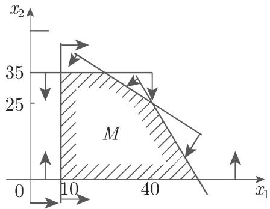

#### 18.1.1 问题的提法和几何表达

18.1.1.1 线性规划问题的形式

1. 目的

线性规划的目的是寻找有穷个变量的线性目标函数(OF) 在有穷个线性方程或不等式约束(CT) 限制下的最大值或最小值．

许多实际问题都可以直接叙述为线性规划问题，或者用线性规划问题近似建模．

2. 一般形式

线性规划问题的一般形式是

OF:

CT:

$$
\left. \begin{array}{c c c c c} f (\underline {{\boldsymbol {x}}}) = c _ {1} x _ {1} + \dots + c _ {r} x _ {r} + c _ {r + 1} x _ {r + 1} + \dots + c _ {n} x _ {n} = \max! & (1 8. 1) \\ a _ {1, 1} x _ {1} + \dots + a _ {1, r} x _ {r} + a _ {1, r + 1} x _ {r + 1} + \dots + a _ {1, n} x _ {n} \leqslant b _ {1}, \\ \vdots & \vdots & \vdots & \vdots & \vdots \\ a _ {s, 1} x _ {1} + \dots + a _ {s, r} x _ {r} + a _ {s, r + 1} x _ {r + 1} + \dots + a _ {s, n} x _ {n} \leqslant b _ {s}, \\ a _ {s + 1, 1} x _ {1} + \dots + a _ {s + 1, r} x _ {r} + a _ {s + 1, r + 1} x _ {r + 1} + \dots + a _ {s + 1, n} x _ {n} = b _ {s + 1}, \\ \vdots & \vdots & \vdots & \vdots & \vdots \\ a _ {m, 1} x _ {1} + \dots + a _ {m, r} x _ {r} + a _ {m, r + 1} x _ {r + 1} + \dots + a _ {m, n} x _ {n} = b _ {m}, \\ x _ {1} \geqslant 0, \quad \dots , x _ {r} \geqslant 0; \quad x _ {r + 1}, x _ {r + 2}, \dots , x _ {n} & \text {自由}. \end{array} \right\}\tag{18.1a}
$$

(18.lb)

采用更紧凑的向量记号，上述问题可以写成

$$
\begin{array}{r l} {\mathbf {O F}: \quad f (\underline {{{{\boldsymbol {x}}}}}) = \underline {{{{\boldsymbol {c}}}}} ^ {1   \mathrm{T}} \underline {{{{\boldsymbol {x}}}}} ^ {1} + \underline {{{{\boldsymbol {c}}}}} ^ {2   \mathrm{T}} \underline {{{{\boldsymbol {x}}}}} ^ {2} = \max!} \\ {\mathbf {C T}: \quad \left. \begin{array}{l} {A _ {1 1} \underline {{{{\boldsymbol {x}}}}} ^ {1} + A _ {1 2} \underline {{{{\boldsymbol {x}}}}} ^ {2} \leqslant \underline {{{{\boldsymbol {b}}}}} ^ {1},} \\ {A _ {2 1} \underline {{{{\boldsymbol {x}}}}} ^ {1} + A _ {2 2} \underline {{{{\boldsymbol {x}}}}} ^ {2} = \underline {{{{\boldsymbol {b}}}}} ^ {2},} \\ {\underline {{{{\boldsymbol {x}}}}} ^ {1} \geqslant \underline {{{{\boldsymbol {0}}}}}, \quad \underline {{{{\boldsymbol {x}}}}} ^ {2} \text {自由}.} \end{array} \right\}} \end{array}\tag{18.2a}
$$

(18.2b)

这里使用如下记号：

$$
\underline {{\boldsymbol {c}}} ^ {1} = \left[ \begin{array}{c} c _ {1} \\ c _ {2} \\ \vdots \\ c _ {r} \end{array} \right], \quad \underline {{\boldsymbol {c}}} ^ {2} = \left[ \begin{array}{c} c _ {r + 1} \\ c _ {r + 2} \\ \vdots \\ c _ {n} \end{array} \right], \quad \underline {{\boldsymbol {x}}} ^ {1} = \left[ \begin{array}{c} x _ {1} \\ x _ {2} \\ \vdots \\ x _ {r} \end{array} \right], \quad \underline {{\boldsymbol {x}}} ^ {2} = \left[ \begin{array}{c} x _ {r + 1} \\ x _ {r + 2} \\ \vdots \\ x _ {n} \end{array} \right].\tag{18.2c}
$$

$$
\boldsymbol {A} _ {1 1} = \left[ \begin{array}{c c c c} a _ {1, 1} & a _ {1, 2} & \dots & a _ {1, r} \\ a _ {2, 1} & a _ {2, 2} & \dots & a _ {2, r} \\ \vdots & \vdots & & \vdots \\ a _ {s, 1} & a _ {s, 2} & \dots & a _ {s, r} \end{array} \right],
$$

$$
\begin{array}{r} \pmb {A} _ {1 2} = \left[ \begin{array}{c c c c} a _ {1, r + 1} & a _ {1, r + 2} & \dots & a _ {1, n} \\ a _ {2, r + 1} & a _ {2, r + 2} & \dots & a _ {2, n} \\ \vdots & \vdots & & \vdots \\ a _ {s, r + 1} & a _ {s, r + 2} & \dots & a _ {s, n} \end{array} \right], \end{array}\tag{18.2d}
$$

$$
\begin{array}{r} \boldsymbol {A} _ {2 1} = \left[ \begin{array}{c c c c} a _ {s + 1, 1} & a _ {s + 1, 2} & \dots & a _ {s + 1, r} \\ a _ {s + 2, 1} & a _ {s + 2, 2} & \dots & a _ {s + 2, r} \\ \vdots & \vdots & & \vdots \\ a _ {m, 1} & a _ {m, 2} & \dots & a _ {m, r} \end{array} \right], \end{array}
$$

$$
\boldsymbol {A} _ {2 2} = \left[ \begin{array}{c c c c} a _ {s + 1, r + 1} & a _ {s + 1, r + 2} & \dots & a _ {s + 1, n} \\ a _ {s + 2, r + 1} & a _ {s + 2, r + 2} & \dots & a _ {s + 2, n} \\ \vdots & \vdots & & \vdots \\ a _ {m, r + 1} & a _ {m, r + 2} & \dots & a _ {m, n} \end{array} \right].\tag{18.2e}
$$

3. 约束

对千不等号” $^ { 6 6 } \geqslant ^ { 9 }$ 的约束，只要乘以(—1)，就变成上面形式的约束

4. 极小问题

对千极小问题 $f ( { \underline { { \mathbf { x } } } } ) = \operatorname* { m i n } !$ ，通过目标函数乘以(—1)，就变成等价的极大问题

$$
- f (\underline {{x}}) = \max!\tag{18.3}
$$

5. 整数规划

有时候某些变量仅限千取整数值．这里我们不讨论这样的离散问题．

6. 仅含非负变量和松弛变量情形的表达

在应用某些解法时，仅仅考虑非负变量，以及以等式形式给出的约束 (18.lb)(18.2b).

OF:

$$
f (\underline {{\boldsymbol {x}}}) = c _ {1} x _ {1} + \dots + c _ {r} x _ {r} + c _ {r + 1} x _ {r + 1} + \dots + c _ {n} x _ {n} = \max!\tag{18.4a}
$$

CT:

$$
\left. \begin{array}{c} a _ {1, 1} x _ {1} + \dots + a _ {1, n} x _ {n} = b _ {1}, \\ \vdots \qquad \qquad \qquad \vdots \qquad \qquad \vdots \\ a _ {m, 1} x _ {1} + \dots + a _ {m, n} x _ {n} = b _ {m}, \\ x _ {1} \geqslant 0, \quad \dots , \quad x _ {n} \geqslant 0. \end{array} \right\}\tag{18.4b}
$$

每个自由变量 $x _ { k }$ 必须分解成两个非负变量之差 $x _ { k } = x _ { k } ^ { 1 } - x _ { k } ^ { 2 }$ ．通过增加非负变量，不等式变成等式；这些新增的变量称作松弛变量．这就是说，问题可以在 (18.4a,18.4b) 给出的形式下进行研究这里 是增加了的变量数写成向量形式为

$$
\mathbf {O F} \colon f (\underline {{\boldsymbol {x}}}) = \underline {{\boldsymbol {c}}} ^ {\mathrm{T}} \underline {{\boldsymbol {x}}} = \max!\tag{18.5a}
$$

$$
\mathbf {C T}: \quad A \underline {{x}} = \underline {{b}}, \quad \underline {{x}} \geqslant \underline {{0}}.\tag{18.5b}
$$

一般可以假定 $m \leqslant n$ ，否则，方程组会包含线性相关或相互矛盾的方程．

7. 可行集

所有满足 (18.2b) 的向量集合称作原问题的可行集．如果自由变量做如上改写，每个形如 $^ { 6 6 } \leqslant ^ { 7 7 }$ ＂的不等式都改写成如 (18.4a) (18.4b) 的等式千是所有满足约束条件的非负向量 $\underline { { \boldsymbol { x } } } \geqslant \underline { { \mathbf { 0 } } }$ 的向量的集合称作可行集 M:

$$
M = \{\underline {{{\boldsymbol {x}}}} \in \mathbb {R} ^ {n}: \underline {{{\boldsymbol {x}}}} \geqslant \underline {{{\boldsymbol {0}}}}, A \underline {{{\boldsymbol {x}}}} = \underline {{{\boldsymbol {b}}}} \}.\tag{18.6a}
$$

如果点 ${ \underline { { \boldsymbol { x } } } } ^ { * } \in M$ 满足

$$
f (\underline {{\boldsymbol {x}}} ^ {*}) \geqslant f (\underline {{\boldsymbol {x}}}), \quad \forall \underline {{\boldsymbol {x}}} \in M,\tag{18.6b}
$$

则 $\underline { { \boldsymbol { x } } } ^ { * }$ 称作线性规划问题的极大点或解点．显然， $\underline { { \boldsymbol { x } } } ^ { * }$ 的非松弛变量分量构成原问题的解

18.1.1.2 例子和图解法

1. 生产两个产品的例子

假定为了生产两个产 $E _ { 1 }$ 止和 $E _ { 2 }$ 需要原材料 $R _ { 1 }$ , $R _ { 2 }$ 和 $R _ { 3 }$ 18.1 表明为了生产 $E _ { 1 }$ 和层 $E _ { 2 }$ 一个单位产品需要多少单位的原材料，并且还给出了可利用的原材料总数

18.1

<table><tr><td></td><td> $R_1/E_i$ </td><td> $R_2/E_i$ </td><td> $R_3/E_i$ </td></tr><tr><td> $E_1$ </td><td>12</td><td>8</td><td>0</td></tr><tr><td> $E_2$ </td><td>6</td><td>12</td><td>10</td></tr><tr><td>总数</td><td>630</td><td>620</td><td>350</td></tr></table>

售出一个单位 $E _ { 1 }$ 或 $E _ { 2 }$ 品分别可以获得 20 60 单位利润 (PR)．要求确定一个生产计划使得在至少生产 10 个单位 $E _ { 1 }$ 产品的前提下，获得最大利润

现在设 $x _ { 1 }$ 和 $x _ { 2 }$ 表示生产产品 $E _ { 1 }$ 和 $E _ { 2 }$ 单位数，问题就是

OF:

CT:

$$
\begin{array}{c} f (\underline {{x}}) = 2 0 x _ {1} + 6 0 x _ {2} = \max! \\ 1 2 x _ {1} + 6 x _ {2} \leqslant 6 3 0, \\ 8 x _ {1} + 1 2 x _ {2} \leqslant 6 2 0, \\ 1 0 x _ {2} \leqslant 3 5 0, \\ x _ {1} \quad \geqslant 1 0. \end{array}
$$

引入松弛变量 $x _ { 3 } , x _ { 4 } , x _ { 5 } , x _ { 6 } ,$ 得到

OF:

CT:

$$
\begin{array}{r l r} f (\underline {{x}}) & = 2 0 x _ {1} + 6 0 x _ {2} + 0 \cdot x _ {3} + 0 \cdot x _ {4} + 0 \cdot x _ {5} + 0 \cdot x _ {6} = \max! \\ & 1 2 x _ {1} + 6 x _ {2} + x _ {3} & = 6 3 0, \\ & 8 x _ {1} + 1 2 x _ {2} + x _ {4} & = 6 2 0, \\ & 1 0 x _ {2} + x _ {5} & = 3 5 0, \\ & - x _ {1} & + x _ {6} = - 1 0. \end{array}
$$

2. 线性规划问题的性质

基千这个例子，可以用图表示法来说明线性规划问题的某些性质这里不考虑松弛变量，仅使用原始变量

a) 直线 $a _ { 1 } x _ { 1 } + a _ { 2 } x _ { 2 } = b$ 把 $x _ { 1 } , x _ { 2 }$ 平面分成两个半平面．满足不等式 $a _ { 1 } x _ { 1 } +$ $a _ { 2 } x _ { 2 } \leqslant b$ 的点 $( x _ { 1 } , x _ { 2 } )$ ）在其中的一个半平面中．在笛卡儿坐标下，可以通过直线作出这个点集的图表示．箭头表示包含该不等式解的半平面．可行解集 M, 即满足所有不等式的点集是这些半平面的交（图 18.1)．在这个例子中， 的点构成一多边形区域． 无界或为空集都是有可能的．如果有多千两条边界直线通过这个多边形的一个顶点则此顶点就称作退化的（图 18.2).

  
18.1

  
18.2

b) $x _ { 1 } , x _ { 2 }$ 平面中满足等式 $f ( x ) = 2 0 x _ { 1 } + 6 0 x _ { 2 } = c _ { 0 }$ 的每个点都在一条直线上，即与值 $c _ { 0 }$ 相关的水平线上．选择不同的 co，就得到一族平行的直线，在其每一 $c _ { 0 } ,$ 条直线上，目标函数的值是常数儿何上，规划问题的解应该是这样一些点它们属千可行集 M，也位千水平线 $2 0 x _ { 1 } + 6 0 x _ { 2 } = c _ { 0 } , c _ { 0 }$ 为最大值在这个例子中，解点是$( x _ { 1 } , x _ { 2 } ) = ( 2 5 , 3 5 )$ ，位千直线 $2 0 x _ { 1 } + 6 0 x _ { 2 } = 2 6 0 0$ ．水平线示千图 18.3 中，这里箭头指向目标函数值增加的方向

  
18.3

显然，如果可行集 有界，那么至少有一个顶点使得目标函数取到最大值．如果可行集 M 无界，则有可能目标函数也无界
