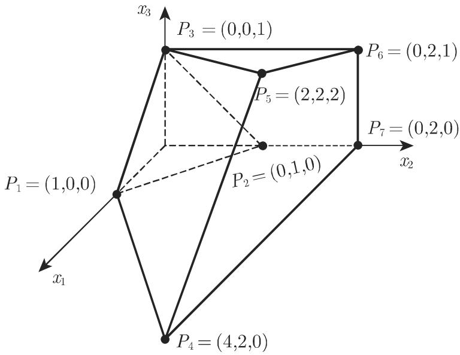

#### 18.1.2 线性规划基本概念、规范形

现在考虑线性规划问题 (18.5a, 18.5b)，相应的可行集为 M.

18.1.2.1 极端点和基

1. 极端点的定义

点 $\underline { { \boldsymbol { x } } } \in M$ 称作 的极端点或顶点，是指对千所 $\underline { { { \pmb x } } } _ { 1 } , \underline { { { \pmb x } } } _ { 2 } \in M , \ \underline { { { \pmb x } } } _ { 1 } \neq \underline { { { \pmb x } } } _ { 2 }$ ，有

$$
\underline {{x}} \neq \lambda \underline {{x}} _ {1} + (1 - \lambda) \underline {{x}} _ {2}, \quad 0 <   \lambda <   1,\tag{18.7}
$$

即 $\underline { { \boldsymbol { x } } }$ 不在连接 任意两不同点的线段的中间

2. 关千极端点的定理

如果矩阵 中与 $\mathbf { \pmb { x } } \in \boldsymbol { M }$ 的正分量有关的那些列向量是线性无关的，则点 $\underline { { \boldsymbol { x } } }$ 的极端点．

如果 的秩是 ，那么 中线性无关列的最大数是 m. 因此一个极端点至多拥有 个正分量，其分量等千零的数目至少是 $n - m$ 个．在通常情形下，正好有个正分量．如果正分量数小千 m, 则就称其为退化极端点．

3.

对千每一个极端点可以选定矩阵 的 m 个线性无关的列向量，这些列对应千其正分量．这一组线性无关列向量称作该极端点的基．通常，每一个极端点恰好有一个基然而退化的极端点就可能选定几个基从 列中选择 个线性无关向量，至多有 $\left( \begin{array} { l } { n } \\ { m } \end{array} \right)$ 可能性．因此，不同基的数目，从而不同极端点的数目是 $\left( \begin{array} { c } { { n } } \\ { { m } } \end{array} \right)$ ．如果 非空则 至少有一个极端点．

$$
\begin{array}{r l} \mathbf {O F}: f (\underline {{x}}) & = 2 x _ {1} + 3 x _ {2} + 4 x _ {3} = \max! \\ \mathbf {C T}: & x _ {1} + x _ {2} + x _ {3} \geqslant 1, \\ & x _ {2} \leqslant 2, \\ & - x _ {1} + 2 x _ {3} \leqslant 2, \\ & 2 x _ {1} - 3 x _ {2} + 2 x _ {3} \leqslant 2. \end{array}\tag{18.8}
$$

由约束条件确定的可行集示千图 18.4. 引入松弛变量 $x _ { 4 } , x _ { 5 } , x _ { 6 } , x _ { 7 }$ 后得到

$$
\begin{array}{r l r l} \mathbf {C T}: & x _ {1} + x _ {2} + x _ {3} - x _ {4} & = 1, \\ & x _ {2} + x _ {5} & = 2, \\ & - x _ {1} + 2 x _ {3} + x _ {6} & = 2, \\ & 2 x _ {1} - 3 x _ {2} + 2 x _ {3} & + x _ {7} = 2. \end{array}
$$

多面体的极端 $P _ { 2 } = ( 0 , 1 , 0 )$ 对应千扩展系统的点 $( x _ { 1 } , x _ { 2 } , x _ { 3 } , x _ { 4 } , x _ { 5 } , x _ { 6 } , x _ { 7 } ) \ =$ (0,1,0,0, 1,2,5). 2, 5, 6, 列构成相应的基．退化的极端点 $P _ { 1 }$ 对应千(1,0,0,0,2,3,0) ．这一极端点的基包含 1, 5, 列，以及 2, 列中的一列．

  
18.4

这里第一个不等式带不等号”> $^ { 6 6 } \geqslant ^ { \mathfrak { N } }$ ，从而 $x _ { 4 }$ 前不是加号而是减号．常常将带负号和相应 $b _ { i } > 0$ 的这种附加变量称作剩余变量，而非松弛变量．如在第 118918.1.3.3 所见，剩余变量的出现要在求解过程中倍加小心

4. 标函数取极大值的极端点

定理 如果 非空，并且目标函数 $f ( \underline { { \mathbf { x } } } ) = \underline { { \mathbf { c } } } ^ { \mathrm { T } } \underline { { \mathbf { x } } }$ 上有界，则 至少有一个极端点使得目标函数取极大值．

千是线性规划问题的求解就是至少确定一个极端点使得目标函数在其上达到极大值通常在实际问题中，极端点的数目是非常大的，从而需要有一种方法能够在合理的时间内找到答案．这样的方法就是单纯形法，也称作单纯形算法或单纯形程序

18.1.2.2 线性规划问题的规范形

1. 规范形和基本解

线性规划问题 (18.4a, 18.4b) 总能通过适当的变量重新排序转换成如下形式：

$$
\begin{array}{r l r} \mathbf {O F}: & f (\underline {{x}}) = c _ {1} x _ {1} + \dots + c _ {n - m} x _ {n - m} + c _ {0} = \max! \\ \mathbf {C T}: & a _ {1, 1} x _ {1} + \dots + a _ {1, n - m} x _ {n - m} + x _ {n - m + 1} & = b _ {1}, \\ & \vdots & \vdots \\ & a _ {m, 1} x _ {1} + \dots + a _ {m, n - m} x _ {n - m} & + x _ {n} = b _ {m}, \\ & x _ {1}, \dots , x _ {n - m}, x _ {n - m + 1}, \dots , x _ {n} \geqslant 0. \end{array}\tag{18.9a}
$$

(18.96)

系数矩阵的最后 列显然是线性无关的，从而形成一个基．基本解 $( x _ { 1 } , x _ { 2 } , \cdots$ $x _ { n - m } , x _ { n - m + 1 } , \cdots , x _ { n } ) = ( 0 , \cdots , 0 , b _ { 1 } , \cdots , b _ { m } )$ ）可以直接从该方程组确定，但如果$\underline { { \boldsymbol { b } } } \geqslant \underline { { \mathbf { 0 } } }$ 不成立，则它不是可行解

如果 $\underline { { \boldsymbol { b } } } \geqslant \underline { { \mathbf { 0 } } }$ ，则（18.9a, 18.9b) 称作线性规划问题的规范形或标准形．在这种情形下，基本解也是可行解，即 $\underline { { \boldsymbol { x } } } \geqslant \underline { { \mathbf { 0 } } } .$ 并且是 的极端点．变量 $x _ { 1 } , \cdots , x _ { n - m }$ 称作非基变量，而 $x _ { n - m + 1 } , \cdots , x _ { n }$ 称作基变量．目标函数在该极端点上取值 $c _ { 0 }$ , 因为非基变量等千零．

2. 规范形的确定

如果 的极端点是已知的，则线性规划问题 (18.5a, 18.5b) 的规范形可以按如下方式得到从 的列中选择对应千该极端点的一个基．通常，通过极端点的正分量可以确定这些列．假定基变量组成向最 $\underline { { \mathbf { { x } } } } _ { B }$ ，而非基变量组成 $\underline { { \boldsymbol { x } } } _ { N }$ · 与该基对应的列构成基矩阵 $A _ { B }$ ，其余列构成矩阵 $A _ { N }$ 千是

$$
\boldsymbol {A} \underline {{\boldsymbol {x}}} = \boldsymbol {A} _ {N} \underline {{\boldsymbol {x}}} _ {N} + \boldsymbol {A} _ {B} \underline {{\boldsymbol {x}}} _ {B} = \underline {{\boldsymbol {b}}}.\tag{18.10}
$$

矩阵 $A _ { B }$ 是非奇异的，其逆 $A _ { B } ^ { - 1 }$ 即所谓的基逆．用 $A _ { B } ^ { - 1 }$ (18.10) ，并根据非基变量适当调整目标函数，就得到线性规划问题的标准形：

$$
\mathbf {O F} \colon f (\underline {{\boldsymbol {x}}}) = \underline {{\boldsymbol {c}}} _ {N} ^ {\mathrm{T}} \underline {{\boldsymbol {x}}} _ {N} + c _ {0},\tag{18.11a}
$$

$$
\mathbf {C T}: \quad A _ {B} ^ {- 1} A _ {N} \underline {{x}} _ {N} + \underline {{x}} _ {B} = A _ {B} ^ {- 1} \underline {{b}}, \quad \underline {{x}} _ {N} \geqslant \underline {{0}}, \quad \underline {{x}} _ {B} \geqslant \underline {{0}}.\tag{18.11b}
$$

如果原始系统 (18.lb) 仅有 $^ { 6 6 } \leqslant ^ { 7 9 }$ 类约束，并且同时 $\underline { { \boldsymbol { b } } } \geqslant \underline { { \mathbf { 0 } } } .$ ，那么扩展系统(18.4b) 没有剩余变量（参见第 1183 18.1.2.1)．在这种情形下，立即可知规范形．选择所有松弛变量作为基变量 $\underline { { \boldsymbol { x } } } _ { B }$ 结果就是 $A _ { B } = I$ ，而 $\underline { { { \boldsymbol { x } } } } _ { B } = \underline { { { \boldsymbol { b } } } } ;$ !\_, $\underline { { \boldsymbol { x } } } _ { N } = \underline { { \mathbf { 0 } } }$ 是可行极端点．

·在上面的例子中卫；＝（0,1,o,o,1,2,s) 是一个极端点．因此，

$$
\begin{array}{r} \boldsymbol {A} _ {B} = \left( \begin{array}{c c c c} 1 & 0 & 0 & 0 \\ 1 & 1 & 0 & 0 \\ 0 & 0 & 1 & 0 \\ - 3 & 0 & 0 & 1 \end{array} \right), \quad \boldsymbol {A} _ {B} ^ {- 1} = \left( \begin{array}{c c c c} 1 & 0 & 0 & 0 \\ - 1 & 1 & 0 & 0 \\ 0 & 0 & 1 & 0 \\ 3 & 0 & 0 & 1 \end{array} \right), \quad \boldsymbol {A} _ {N} = \left( \begin{array}{c c c c} 1 & 1 & - 1 \\ 0 & 0 & 0 \\ - 1 & 2 & 0 \\ 2 & 2 & 0 \end{array} \right) \\ x _ {2} x _ {5} x _ {6} x _ {7} \end{array}\tag{18.12a}
$$

$$
\left. \begin{array}{c c c} {\pmb {A} _ {B} ^ {- 1} \pmb {A} _ {N} =} & {\left( \begin{array}{r r r} 1 & 1 & - 1 \\ - 1 & - 1 & 1 \\ - 1 & 2 & 0 \\ 5 & 5 & - 3 \end{array} \right)} & {\pmb {A} _ {B} ^ {- 1} \pmb {b} = \left( \begin{array}{c} 1 \\ 1 \\ 2 \\ 5 \end{array} \right).} \\ {x _ {1}} & {x _ {3}} & {x _ {4}} \\ {x _ {1} + x _ {2} + x _ {3} - x _ {4}} & {= 1,} \\ {- x _ {1}} & {- x _ {3} + x _ {4} + x _ {5}} & {= 1,} \\ {- x _ {1}} & {+ 2 x _ {3}} & {+ x _ {6} = 2,} \\ {5 x _ {1}} & {+ 5 x _ {3} - 3 x _ {4}} & {+ x _ {7} = 5.} \end{array} \right\}\tag{18.12b}
$$

(18.13)

从 $f ( { \underline { { \mathbf { x } } } } ) = 2 x _ { 1 } + 3 x _ { 2 } + 4 x _ { 3 }$ ，减去第一个约束的 倍，得到变换后的目标函数为

$$
f (\underline {{\boldsymbol {x}}}) = - x _ {1} + x _ {3} + 3 x _ {4} + 3.\tag{18.14}
$$
