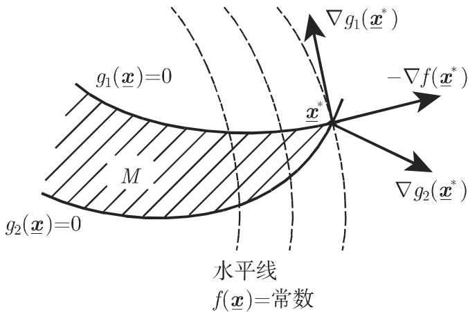

#### 18.2.1 问题的提法、理论基础

18.2.1.1 问题的提法

1. 非线性优化问题

非线性优化问题的一般形式是

$$
f (\underline {{{{\boldsymbol {x}}}}}) = \min!, \quad \underline {{{{\boldsymbol {x}}}}} \in \mathbb {R} ^ {n} \text {满足如下约束条件:}\tag{18.32a}
$$

$$
g _ {i} (\underline {{{\boldsymbol {x}}}}) \leqslant 0, \quad i \in I = \{1, \dots , m \}, \quad h _ {j} (\underline {{{\boldsymbol {x}}}}) = 0, \quad j \in J = \{1, \dots , r \},\tag{18.32b}
$$

这里函数 $f , g _ { i } , h _ { j }$ 中至少有一个是非线性的．可行解集是

$$
M = \{\underline {{{\boldsymbol {x}}}} \in \mathbb {R} ^ {n}: g _ {i} (\underline {{{\boldsymbol {x}}}}) \leqslant 0, i \in I, h _ {j} (\underline {{{\boldsymbol {x}}}}) = 0, j \in J \}.\tag{18.33}
$$

问题是要确定极小点

2. 极小点

点 ${ \underline { { \boldsymbol { x } } } } ^ { * } \in M$ 称作全局极小点，是指它满足 $f ( \underline { { \mathbf { x } } } ^ { * } ) \leqslant f ( \underline { { \mathbf { x } } } ) , \forall \underline { { \mathbf { x } } } \in M$ ．如果这个关系仅对千 $\underline { { \boldsymbol { x } } } ^ { * }$ 的某个邻域 中的点生成立，则 $\underline { { \boldsymbol { x } } } ^ { * }$ 称作局部极小点．由千等式约東 $h _ { j } ( \underline { { \pmb { x } } } ) = 0$ 可以用两个不等式约束表达：

$$
- h _ {j} (\underline {{{{\boldsymbol {x}}}}}) \leqslant 0, \quad h _ {j} (\underline {{{{\boldsymbol {x}}}}}) \leqslant 0,\tag{18.34}
$$

故可以假定集合 是空的， $J = \emptyset$

18.2.1.2 最优性条件

1. 特殊方向

a) 可行方向锥 $\underline { { \boldsymbol { x } } } \in M$ 处的可行方向锥定义为

$$
Z (\underline {{{{\boldsymbol {x}}}}}) = \{\underline {{{{\boldsymbol {d}}}}} \in \mathbb {R} ^ {n}: \exists \bar {\alpha} > 0 \text {使得} \underline {{{{\boldsymbol {x}}}}} + \alpha \underline {{{{\boldsymbol {d}}}}} \in M, 0 \leqslant \alpha \leqslant \bar {\alpha} \}, \quad \underline {{{{\boldsymbol {x}}}}} \in M,\tag{18.35}
$$

其中 $\underline { d }$ 表示方向．如果 $\underline { { d } } \in Z ( \underline { { \pmb x } } )$ ' 那么射线 $\underline { { \boldsymbol { x } } } + \alpha \underline { { \boldsymbol { d } } }$ 上的每个点当 充分小时都属千 M.

b) 下降方向 点竺处的下降方向是指一向量 $\underline { d } \in \mathbb { R } ,$ ，存在 $\bar { \alpha } > 0$ 使得

$$
f (\underline {{\boldsymbol {x}}} + \alpha \underline {{\boldsymbol {d}}}) <   f (\underline {{\boldsymbol {x}}}), \quad \forall \alpha \in (0, \bar {\alpha}).\tag{18.36}
$$

显然在极小点不存在可行下降方向．如果 可微，则当 $\nabla f ( \underline { { \pmb { x } } } ) ^ { \mathrm { T } } \underline { { \pmb { d } } } < 0$ 时， $\underline { d }$ 是下降方向．在这里 表示梯度算子，故 $\nabla f ( \underline { { \boldsymbol { x } } } )$ 表示标最值函数 在生处的梯度

2. 最优性必要条件

如果 $f$ 可微并且 $\underline { { \boldsymbol { x } } } ^ { * }$ 是一局部极小点那么

$$
\nabla f (\underline {{{{\boldsymbol {x}}}}} ^ {*}) ^ {\mathrm{T}} \underline {{{{\boldsymbol {d}}}}} \geqslant 0, \quad \forall \underline {{{{\boldsymbol {d}}}}} \in \overline {{{{Z}}}} (\underline {{{{\boldsymbol {x}}}}} ^ {*}).\tag{18.37a}
$$

特别地若 $\underline { { \boldsymbol { x } } } ^ { * }$ 是 的内点那么

$$
\nabla f (\underline {{x}} ^ {*}) = \underline {{0}}.\tag{18.37b}
$$

3. 拉格朗日函数和鞍点

最优性条件 (18.37a, 18.37b) 应该翻译成包含约束的更实用的形式．根据对千具有等式约束问题的拉格朗日乘子法（参见第 611 6.2.5.6)，构造所谓的拉格朗日函数：

$$
L (\underline {{{\boldsymbol {x}}}}, \underline {{{\boldsymbol {u}}}}) = f (\underline {{{\boldsymbol {x}}}}) + \sum_ {i = 1} ^ {m} u _ {i} g _ {i} (\underline {{{\boldsymbol {x}}}}) = f (\underline {{{\boldsymbol {x}}}}) + \underline {{{\boldsymbol {u}}}} ^ {\mathrm{T}} g (\underline {{{\boldsymbol {x}}}}), \quad \underline {{{\boldsymbol {x}}}} \in \mathbb {R} ^ {n}, \quad \underline {{{\boldsymbol {u}}}} \in \mathbb {R} _ {+} ^ {m}.\tag{18.38}
$$

点 $( \underline { { { \pmb x } } } ^ { * } , \underline { { { \pmb u } } } ^ { * } ) \in \mathbb { R } ^ { n } \times$ 称作 的鞍点，是指

$$
L \left(\underline {{{\boldsymbol {x}}}} ^ {*}, \underline {{{\boldsymbol {u}}}}\right) \leqslant L \left(\underline {{{\boldsymbol {x}}}} ^ {*}, \underline {{{\boldsymbol {u}}}} ^ {*}\right) \leqslant L \left(\underline {{{\boldsymbol {x}}}}, \underline {{{\boldsymbol {u}}}} ^ {*}\right), \quad \forall \underline {{{\boldsymbol {x}}}} \in \mathbb {R} ^ {n}, \quad \underline {{{\boldsymbol {u}}}} \in \mathbb {R} _ {+} ^ {m}.\tag{18.39}
$$

4. 全局库恩—塔克条件

如果存在 $\underline { { \pmb u } } ^ { * } \in \mathbb { R } _ { + } ^ { m }$ ， $\underline { { \boldsymbol { u } } } ^ { * } \geqslant \mathbf { 0 }$ 使得 $( \underline { { { x } } } ^ { * } , \underline { { { u } } } ^ { * } )$ 是 的鞍点则点 $x ^ { * }$ 满足全局库恩—塔克条件．至千库恩—塔克条件的证明，参见第 893 12.5.6.

．最优性充分条件

如果点（ $( \underline { { { \pmb x } } } ^ { * } , \underline { { { \pmb u } } } ^ { * } ) \in \mathbb { R } ^ { n } \times$ 配严是 的鞍点那么 $\underline { { \boldsymbol { x } } } ^ { * }$ 是 (18.32a, 18.32b) 的全局极小点．如果函数 $f$ 和 $g _ { i }$ 可微，则可以推导出局部最优性条件．

6. 局部库恩—塔克条件

如果存在数 $u _ { i } \geqslant 0 , \ i \in I _ { 0 } ( \underline { { \pmb x } } ^ { * } )$ ）使得

$$
- \nabla f (\underline {{{{\boldsymbol {x}}}}} ^ {*}) = \sum_ {i \in I _ {0} (\underline {{{{\boldsymbol {x}}}}} ^ {*})} u _ {i} \nabla g _ {i} (\underline {{{{\boldsymbol {x}}}}} ^ {*}),\tag{18.40a}
$$

其中

$$
I _ {0} (\underline {{{\boldsymbol {x}}}}) = \{i \in \{1, \dots , m \}: g _ {i} (\underline {{{\boldsymbol {x}}}}) = 0 \}\tag{18.40b}
$$

是 $\underline { { \boldsymbol { x } } }$ 处主动约束的标号集 $\underline { { \boldsymbol { x } } } ^ { * }$ 也称作库恩—塔克平稳点

这就意味着在儿何上，如果负梯度 $- \nabla f ( \underline { { \mathbf { x } } } ^ { * } )$ \*)位千 $\underline { { \boldsymbol { x } } } ^ { * }$ ＊处主动约束（即 $i \in$ $I _ { 0 } ( \underline { { \boldsymbol { x } } } ^ { * } ) )$ ））对应的诸梯度 $\nabla g _ { i } ( \underline { { \boldsymbol { x } } } ^ { * } )$ ）所张成的锥中（图 18.5)，则 $\underline { { \boldsymbol { x } } } ^ { * }$ 满足库恩—塔克条件

  
18.5

局部库恩—塔克条件 (18.40a, 18.40b) 的如下等价表述也是经常使用的：如果存在 $\underline { { \pmb u } } ^ { * } \in \mathbb { R } _ { + } ^ { m }$ 使得

$$
g (\underline {{\boldsymbol {u}}} ^ {*}) \leqslant 0,\tag{18.41a}
$$

$$
u _ {i} g _ {i} (\underline {{\boldsymbol {u}}} ^ {*}) = 0, \quad i = 1, \dots , m,\tag{18.41b}
$$

$$
\nabla f (\underline {{{{\boldsymbol {x}}}}} ^ {*}) + \sum_ {i = 1} ^ {m} u _ {i} \nabla g _ {i} (\underline {{{{\boldsymbol {x}}}}} ^ {*}) = 0,\tag{18.41c}
$$

那么 $\underline { { \boldsymbol { x } } } ^ { * } \in \mathbb { R } ^ { n }$ 足局部库恩—塔克条件．

7. 最优性必要条件和库恩—塔克条件

如果 ${ \underline { { \boldsymbol { x } } } } ^ { * } \in M$ (18.32a, 18.32b) 的局部极小点并且可行集在 $\underline { { \boldsymbol { x } } } ^ { * }$ 处满足正则性条件： $\exists \mathbf { \mathbf { \mathbf { \mathbf { d } } } } \in \mathbb { R } ^ { n }$ 九使得 $\nabla g _ { i } ( \underline { { \pmb { x } } } ^ { * } ) ^ { \mathrm { T } } \underline { { d } } < 0 , \forall i \in I _ { 0 } ( \underline { { \pmb { x } } } ^ { * } )$ ），那 $\underline { { \boldsymbol { x } } } ^ { * }$ 满足库恩—塔克条件

18.2.1.3 优化中的对偶性

1. 对偶问题

采用相关的拉格朗日函数 (18.32a, 18.32b) ，构造极大问题，即 (18.32a, 18.32b)的所谓对偶问题：

$$
L (\underline {{\boldsymbol {x}}}, \underline {{\boldsymbol {u}}}) = \max!, \quad (\underline {{\boldsymbol {x}}}, \underline {{\boldsymbol {u}}}) \in M ^ {*},\tag{18.42a}
$$

其中

$$
M ^ {*} = \left\{(\underline {{\boldsymbol {x}}}, \underline {{\boldsymbol {u}}}) \in \mathbb {R} ^ {n} \times \mathbb {R} _ {+} ^ {m}: L (\underline {{\boldsymbol {x}}}, \underline {{\boldsymbol {u}}}) = \min _ {\underline {{\boldsymbol {z}}} \in \mathbb {R} ^ {n}} L (\underline {{\boldsymbol {z}}}, \underline {{\boldsymbol {u}}}) \right\}.\tag{18.42b}
$$

．对偶性定理

如果 $\underline { { \pmb { x } } } _ { 1 } \in M$ ，并且 $( \underline { { { \pmb x } } } _ { 2 } , \underline { { { \pmb u } } } _ { 2 } ) \in M ^ { * }$ ，那么

a) $L ( \underline { { \mathbf { x } } } _ { 2 } , \underline { { \mathbf { u } } } _ { 2 } ) \leqslant f ( \underline { { \mathbf { x } } } _ { 1 } )$

b) 如果 $L ( \underline { { \mathbf { x } } } _ { 2 } , \underline { { \mathbf { u } } } _ { 2 } ) = f ( \underline { { \mathbf { x } } } _ { 1 } )$ , 则 $\underline { { \boldsymbol { x } } } _ { 1 }$ (18.32a, 18.32b) 的极小点而（ $( \underline { { \boldsymbol { x } } } _ { 2 } , \underline { { \boldsymbol { u } } } _ { 2 } )$ (18.42a, 18.42b) 的极大点
