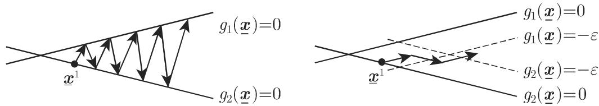
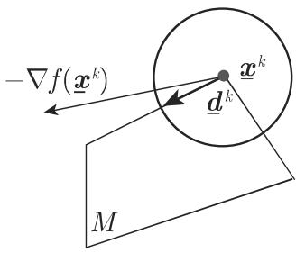
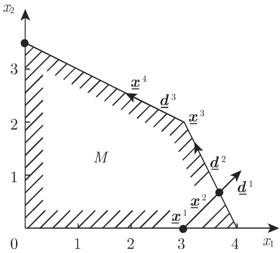
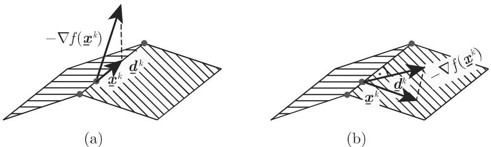

#### 18.2.7 不等式类型约束下问题的梯度法

如果问题

$$
f (\underline {{{{\pmb {x}}}}}) = \min!, \quad \text {约束条件为} g _ {i} (\underline {{{{\pmb {x}}}}}) \leqslant 0,\tag{18.95}
$$

需要采用如下类型的迭代法求解：

$$
\underline {{{{\boldsymbol {x}}}}} ^ {k + 1} = \underline {{{{\boldsymbol {x}}}}} ^ {k} + \alpha_ {k} \underline {{{{\boldsymbol {d}}}}} ^ {k} \quad (k = 1, 2, \dots),\tag{18.96}
$$

那么由千有界可行集，必须考虑另两个附加规则：

(1) 方向 $\underline { d } ^ { k }$ 必须是矿 $\scriptstyle { \pmb { x } } ^ { k }$ 的可行下降方向．

(2) 步长 $\alpha _ { k }$ 必须使得 $\underline { { \boldsymbol { x } } } ^ { k + 1 }$ 中．

基千公式 (18.96) 的各种方法的差别仅在千构造方 $\underline { { \boldsymbol { d } } } ^ { k }$ 矿的不同为了确保序列 $\{ \underline { { { x } } } ^ { k } \} \subset M$ 的可行性， $\alpha _ { k } ^ { \prime }$ 和 $\alpha _ { k } ^ { \prime \prime }$ 按如下方式确定

$\alpha _ { k } ^ { \prime }$ 从 $f ( \underline { { { \pmb x } } } ^ { k } + \alpha \underline { { { \pmb d } } } ^ { k } ) = \mathrm { m i n } ! , \alpha > 0$ 确定．

$$
\alpha_ {k} ^ {\prime \prime} = \{\alpha \in \mathbb {R}: \underline {{\boldsymbol {x}}} ^ {k} + \alpha \underline {{\boldsymbol {d}}} ^ {k} \in M \}.\tag{18.97}
$$

然后，我们得到

$$
\alpha_ {k} = \min \{\alpha_ {k} ^ {\prime}, \alpha_ {k} ^ {\prime \prime} \}.\tag{18.98}
$$

如果在某一步 没有可行方向 $\pmb { d } ^ { k }$ ，则 $\scriptstyle { \pmb { x } } ^ { k }$ 是平稳点．

18.2.7.1 可行方向方法

1. 方向搜索程序

点 $\underline { { \boldsymbol { x } } } ^ { k }$ 处的可行下降方向矿 $\pmb { d } ^ { k }$ 以通过求解下列优化问题予以确定：

$$
\sigma = \min!,\tag{18.99}
$$

$$
\nabla g _ {i} \left(\underline {{{\boldsymbol {x}}}} ^ {k}\right) ^ {\mathrm{T}} \underline {{{\boldsymbol {d}}}} \leqslant \sigma , \quad i \in I _ {0} \left(\underline {{{\boldsymbol {x}}}} ^ {k}\right),\tag{18.100a}
$$

$$
\nabla f (\underline {{\boldsymbol {x}}} ^ {k}) ^ {\mathrm{T}} \underline {{\boldsymbol {d}}} \leqslant \sigma ,\tag{18.100b}
$$

$$
\| \underline {{\boldsymbol {d}}} \| \leqslant 1,\tag{18.100c}
$$

如果 $\sigma < 0$ 则（18.lOOa) 确保该方向搜索程序结果 $\underline { d } = \underline { d } ^ { k }$ 的可行性，而 (18.lOOb)确保 $\underline { { \boldsymbol { d } } } ^ { k }$ 的下降性质根据规格化条件 (18.lOOc)，该方向搜索程序所得可行集是有界的．如果 $\sigma = 0$ , 则 $\underline { { \boldsymbol { x } } } ^ { k }$ 是平稳点因为在 $\underline { { \boldsymbol { x } } } ^ { k }$ 有可行的下降方向

(18.lOOa, 18.lOOb, 18.lOOc) 定义的方向搜索程序有可能引起序列 $\{ \underline { { \boldsymbol { x } } } ^ { k } \}$ 的锯齿形行为，而为避免这样的行为发生，只需将标号集 $I _ { 0 } ( \underline { { \boldsymbol { x } } } ^ { k } )$ ）代之以

$$
I _ {\varepsilon_ {k}} \left(\underline {{\boldsymbol {x}}} ^ {k}\right) = \{i \in \{1, \dots , m \}: - \varepsilon_ {k} \leqslant g _ {i} \left(\underline {{\boldsymbol {x}}} ^ {k}\right) \leqslant 0 \}, \quad \varepsilon_ {k} \geqslant 0,\tag{18.101}
$$

即代之以在 $x ^ { k }$ 处的所谓 $\varepsilon _ { k }$ 主动约束．千是从 $x ^ { k }$ 出发的局部下降方向被排除，并且越来越接近由 $\varepsilon _ { k }$ 主动约束组成的 的边界（图 18.7).

  
18.7

如果 $\sigma = 0$ (18.100a, 18.lOOb, 18.lOOc) 在这样修正后的解，那么仅当$I _ { 0 } ( \underline { { { \mathbf { x } } } } ^ { k } ) = I _ { \varepsilon _ { k } } ( \underline { { { \mathbf { x } } } } ^ { k } )$ ）时 $\underline { { \boldsymbol { x } } } ^ { k }$ 矿是平稳点．否则 $\varepsilon _ { k }$ 必须减少，从而方向搜索程序必须重复下去

2. 线性约束的特殊情形

如果 $g _ { i } ( \underline { { \pmb x } } )$ 是线性的即 $g _ { i } ( \underline { { { \pmb x } } } ) = \underline { { { \pmb a } } } _ { i } ^ { \mathrm { T } } \underline { { { \pmb x } } } - b _ { i }$ , 则可以建立一种比较简单的方向搜索程序：

$$
\boldsymbol {\sigma} = \nabla f (\underline {{\boldsymbol {x}}} ^ {k}) ^ {\mathrm{T}} \underline {{\boldsymbol {d}}} = \min!,\tag{18.102}
$$

其中

$$
\nabla \underline {{{{\boldsymbol {a}}}}} _ {i} ^ {\mathrm{T}} \underline {{{{\boldsymbol {d}}}}} \leqslant 0, \quad i \in I _ {0} (\underline {{{{\boldsymbol {x}}}}} ^ {k}) \quad \text {或} \quad i \in I _ {\varepsilon_ {k}} (\underline {{{{\boldsymbol {x}}}}} ^ {k}),\tag{18.103a}
$$

$$
\| \underline {{\boldsymbol {d}}} \| \leqslant 1.\tag{18.103b}
$$

选择不同范数 $\| \underline { { d } } \| = \operatorname* { m a x } \{ | d _ { i } | \} \leqslant 1$ 或 $\begin{array} { r } { \| \underline { d } \| = \sqrt { \underline { d } ^ { \mathrm { T } } \underline { d } } \leqslant 1 } \end{array}$ 的影响示千图 18.8(a),(b).

  
(a)

  
18.8  
(b)

在某种意义上，范数 $\| \underline { { d } } \| = \| \underline { { d } } \| _ { 2 } = \sqrt { \underline { { d } } ^ { \mathrm { T } } \underline { { d } } }$ 是最佳选择，因为方向搜索程序所得到的方向 $\underline { d } ^ { k }$ 与— $- \nabla f ( \underline { { \mathbf { x } } } ^ { k } )$ ）形成最小夹角在这种情形下，方向搜索程序并不是线性的，从而要求更大的计算量如果选择范数 $\| \underline { { d } } \| = \| \underline { { d } } \| _ { \infty } = \operatorname* { m a x } \{ | d _ { i } | \} \leqslant 1$ ,得到一组线性约束 $- 1 \leqslant d _ { i } \leqslant 1 \ ( i = 1 , \cdots , n )$ ，从而方向搜索程序例如可以通过单纯形法求解．

为了确保这种可行方向方法对千二次优化问题 $f ( { \underline { { x } } } ) = { \underline { { x } } } ^ { \mathrm { T } } C { \underline { { x } } } + p ^ { \mathrm { T } } { \underline { { x } } } = \operatorname* { m i n } !$ $A { \underline { { x } } } \leqslant \underline { { b } } .$ ，能够在有穷步内得到解决，可以利用如下的共辄条件来实施方向搜索程序：如果在某一步成立 $\alpha _ { k - 1 } = \alpha _ { k - 1 } ^ { \prime }$ ，即 $\scriptstyle { \boldsymbol { x } } ^ { k }$ 是一“内“点则在方向搜索程序中加上条件

$$
\underline {{\boldsymbol {d}}} ^ {k - 1 ^ {\mathrm{T}}} \boldsymbol {C} \underline {{\boldsymbol {d}}} = 0.\tag{18.104}
$$

此外，前而各步骤中相应的的条件均保留不变如果在往后的某一步有 $\alpha _ { k } = \alpha _ { k } ^ { \prime \prime }$ ，则条件 (18.104) 就去掉

■ $f ( \underline { { x } } ) = x _ { 1 } ^ { 2 } + 4 x _ { 2 } ^ { 2 } - 1 0 x _ { 1 } - 3 2 x _ { 2 } = \operatorname* { m i n } ! , g _ { 1 } ( \underline { { x } } ) = - x _ { 1 } \leqslant 0 , g _ { 2 } ( \underline { { x } } ) = - x _ { 2 } \leqslant 0 |$ $g _ { 3 } ( \underline { { x } } ) = x _ { 1 } + 2 x _ { 2 } - 7 \leqslant 0 , g _ { 4 } ( \underline { { x } } ) = 2 x _ { 1 } + x _ { 2 } - 8 \leqslant 0 .$

步从 $\underline { { \boldsymbol { x } } } ^ { 1 } = ( 3 , 0 ) ^ { \mathrm { T } }$ 出发， $\nabla f ( \underline { { { \pmb x } } } ^ { 1 } ) = ( - 4 , - 3 2 ) ^ { \mathrm { T } } , ~ I _ { 0 } ( \underline { { { \pmb x } } } ^ { 1 } ) = \{ 2 \}$

方向搜索程序 $\left\{ \begin{array} { l } { - 4 d _ { 1 } - 3 2 d _ { 2 } = \operatorname* { m i n } ! } \\ { - d _ { 2 } \leqslant 0 , \ \| \underline { d } \| _ { \infty } \leqslant 1 } \end{array} \right\} \Longrightarrow \underline { d } ^ { 1 } = ( 1 , 1 ) ^ { \mathrm { T } } .$

最小化常数： $\alpha _ { k } ^ { \prime } = - \frac { \underline { { \mathbf { { d } } } } ^ { k ^ { \mathrm { T } } } \nabla f ( \underline { { \mathbf { { x } } } } ^ { k } ) } { 2 \underline { { \mathbf { { d } } } } ^ { k ^ { \mathrm { T } } } C \underline { { \mathbf { { d } } } } ^ { k } }$ ，其中 $C = \left( \begin{array} { l l } { 1 } & { 0 } \\ { 0 } & { 4 } \end{array} \right)$

最大可行步长： $\alpha _ { k } ^ { \prime \prime } = \operatorname* { m i n } \bigg \{ \frac { - g _ { i } ( \underline { { \mathbf { x } } } ^ { k } ) } { \underline { { \mathbf { a } } } _ { i } ^ { \mathrm { T } } \underline { { \mathbf { d } } } ^ { k } }$ ． 满足 ${ \underline { { { a } } } } _ { i } ^ { \mathrm { T } } { \underline { { { d } } } } ^ { k } > 0 \bigg \} , { \ : } { \alpha } _ { 1 } ^ { \prime } = { \frac { 1 8 } { 5 } } , { \ : } { \alpha } _ { 1 } ^ { \prime \prime } =$ ${ \frac { 2 } { 3 } } \Longrightarrow \alpha _ { 1 } = \operatorname* { m i n } \left\{ { \frac { 1 8 } { 5 } } , { \frac { 2 } { 3 } } \right\} = { \frac { 2 } { 3 } } , \ { \underline { { x } } } ^ { 2 } = \left( { \frac { 1 1 } { 3 } } , { \frac { 2 } { 3 } } \right) ^ { \mathrm { T } }$

步： $\nabla f ( \underline { { { \bf x } } } ^ { 2 } ) = \bigg ( - \frac { 8 } { 3 } , - \frac { 8 0 } { 3 } \bigg ) ^ { \mathrm { T } } , ~ I _ { 0 } ( \underline { { { \bf x } } } ^ { 2 } ) = \{ 4 \}$

方向搜索程序 $\left\{ \begin{array} { c } { \displaystyle - \frac { 8 } { 3 } d _ { 1 } - \frac { 8 0 } { 3 } d _ { 2 } = \mathrm { m i n } ! } \\ { \displaystyle 2 d _ { 1 } + d _ { 2 } \leqslant 0 , \ \| \pmb { d } \| _ { \infty } \leqslant 1 } \end{array} \right\} \Longrightarrow \pmb { d } ^ { 2 } = \left( \begin{array} { c } { \displaystyle - \frac { 1 } { 2 } , 1 } \end{array} \right) ^ { \mathrm { T } } , \ \alpha _ { 2 } ^ { \prime } =$

$$
\frac {1 5 2}{5 1}, \alpha_ {2} ^ {\prime \prime} = \frac {4}{3} \Longrightarrow \alpha_ {2} = \frac {4}{3}, \underline {{{{\boldsymbol {x}}}}} ^ {3} = (3, 2) ^ {\mathrm{T}}.
$$

步： $\nabla f ( \underline { { { \pmb x } } } ^ { 3 } ) = ( - 4 , - 1 6 ) ^ { \mathrm { T } } , I _ { 0 } ( \underline { { { \pmb x } } } ^ { 3 } ) = \{ 3 , 4 \}$

方向搜索程序 $\left\{ \begin{array} { c } { { - 4 d _ { 1 } - 1 6 d _ { 2 } = \operatorname* { m i n } ! } } \\ { { d _ { 1 } + 2 d _ { 2 } \leqslant 0 , \ 2 d _ { 1 } + d _ { 2 } \leqslant 0 , \ \lVert { \underline { { d } } } \rVert _ { \infty } \leqslant 1 } } \end{array} \right\} \Longrightarrow \ d ^ { 3 } =$ ${ \biggl ( } - 1 , { \frac { 1 } { 2 } } { \biggr ) } ^ { \mathrm { T } } , \ \alpha _ { 3 } ^ { \prime } = 1 , \ \alpha _ { 3 } ^ { \prime \prime } = 3 \Longrightarrow \alpha _ { 3 } = 1 , \ { \underline { { x } } } ^ { 4 } = { \biggl ( } 2 , { \frac { 5 } { 2 } } { \biggr ) } ^ { \mathrm { T } } .$

接下来的方向搜索程序结果是 $\sigma = 0$ 从而极小点是 ${ \pmb x } ^ { * } = \underline { { { \pmb x } } } ^ { 4 }$ （图 18.9).

  
图 18.9

18.2.7.2 梯度投影方法

1. 问题的提法和求解原理

假定给定凸优化问题

$$
f (\underline {{{{\boldsymbol {x}}}}}) = \min!, \text {其中} \underline {{{{\boldsymbol {x}}}}} \text {满足} \underline {{{{\boldsymbol {a}}}}} _ {i} ^ {\mathrm{T}} \underline {{{{\boldsymbol {x}}}}} \leqslant b _ {i}, i = 1, \dots , m.\tag{18.105}
$$

点 $\underline { { \boldsymbol { x } } } ^ { k } \in M$ 处的可行下降方向 $\underline { d } ^ { k }$ 按如下方式确定

如果 $- \nabla f ( \underline { { \mathbf { x } } } ^ { k } )$ 是可行方向则选择 $\underline { { \pmb { d } } } ^ { k } = - \nabla f ( \underline { { \pmb { x } } } ^ { k } )$ ）．否则 $\scriptstyle { \pmb { x } } ^ { k }$ 矿在 的边界上，并且 $- \nabla f ( \underline { { \mathbf { x } } } ^ { k } )$ 指向 外．向量 $- \nabla f ( \underline { { \mathbf { x } } } ^ { k } )$ ）通过一个线性映射投影到 边界的一个线性流形上，该流形由 $\underline { { \boldsymbol { x } } } ^ { k }$ 处主动约束的子集确定．图 18.lO(a) 表示投影到一棱边而图 18.lO(b) 表示投影到一个面上．假定非降秩，即如果对千每个 $\underline { { \boldsymbol { x } } } \in \mathbb { R } ^ { n }$ 诸向量 $\underline { { \boldsymbol { a } } } _ { i } , i \in I _ { 0 } ( \underline { { \boldsymbol { x } } } )$ ）是线性无关的则

$$
\underline {{\boldsymbol {d}}} ^ {k} = - \boldsymbol {P} _ {k} \nabla f (\underline {{\boldsymbol {x}}} ^ {k}) = - \left(I - \boldsymbol {A} _ {k} ^ {\mathrm{T}} \left(\boldsymbol {A} _ {k} \boldsymbol {A} _ {k} ^ {\mathrm{T}}\right) ^ {- 1} A _ {k}\right) \nabla f (\underline {{\boldsymbol {x}}} ^ {k})\tag{18.106}
$$

就给出这样的投影这里 $A _ { k }$ 由这样一些向量 $\underline { { \pmb { a } } } _ { i }$ 组成其相应的约束构成一个子流形，而 $- \nabla f ( \underline { { \mathbf { x } } } ^ { k } )$ ）正好投影到这个子流形

  
18.10

2. 算法

梯度投影法由如下几个步骤组成：从 ${ \pmb x } ^ { 1 } \in M$ 开始，按照如下方式从 $k = 1$ 出发依次进行计算

I: 如果 $- \nabla f ( \underline { { \mathbf { x } } } ^ { k } )$ ）是可行方向，则代 $\underline { { \pmb { d } } } ^ { k } = - \nabla f ( \underline { { \pmb { x } } } ^ { k } )$ ），并从第 III 步继续．否则从向量 $\underline { { \mathbf { a } } } _ { i } , ~ i \in I _ { 0 } ( \underline { { \mathbf { x } } } ^ { k } )$ 构造矩阵 $\pmb { A } _ { k }$ 然后从第 II 步继续．

II: 代入 $\underline { { { d } } } ^ { k } = - \left( I - A _ { k } ^ { \mathrm { T } } ( A _ { k } A _ { k } ^ { \mathrm { T } } ) ^ { - 1 } A _ { k } \right) \nabla f ( \underline { { { x } } } ^ { k } )$ ）．如 $\underline { d } ^ { k } \neq \underline { 0 }$ ，则从第 III继续．如果 $\underline { d } ^ { k } = \underline { 0 }$ ，并且 ${ \pmb u } = - ( { \pmb A } _ { k } { \pmb A } _ { k } ^ { \mathrm { T } } ) ^ { - 1 } { \pmb A } _ { k } \nabla f ( { \underline { { \pmb x } } } ^ { k } ) \geqslant { \underline { { \pmb 0 } } }$ , 那么 $x ^ { k }$ 是极小点．局部库恩—塔克条件 $\begin{array} { r } { - \nabla f ( \underline { { \mathbf { x } } } ^ { k } ) = \sum _ { i \in I _ { 0 } ( \underline { { \mathbf { x } } } ^ { k } ) } u _ { i } \underline { { \mathbf { a } } } _ { i } = A _ { k } ^ { \mathrm { T } } \underline { { \mathbf { u } } } } \end{array}$ 显然满足．

如果 $\underline { { \boldsymbol { u } } } \not \geq \underline { { \boldsymbol { 0 } } } ,$ ，则选择一个 $i , \underline { { { u } } } _ { i } < 0$ ，删除 $A ^ { k }$ 的第 行，并继续第 II

III: 计算 $\alpha _ { k }$ 和 $\underline { { \pmb x } } ^ { k + 1 } = \underline { { \pmb x } } ^ { k } + \alpha _ { k } \underline { d } ^ { k }$ ，并让 $k = k + 1$ 回到第 步继续．

3. 关千算法的注释

如果— $\cdot \nabla f ( \underline { { \mathbf { x } } } ^ { k } )$ ）不是可行方向，则这个向量被映到包含 $\scriptstyle { \pmb { x } } ^ { k }$ 的最小维子流形上．如果 $\pmb { d } ^ { k } = \pmb { 0 }$ ，则 $- \nabla f ( \underline { { \mathbf { x } } } ^ { k } )$ ）垂直千这个子流形．如果 $\underline { { \mathbf { \delta } } } \mathbf { \delta } \mathbf { \mathcal { U } } \geqslant \mathbf { \delta } \mathbf { \underline { { \mathbf { 0 } } } }$ 不成立，则该子流形的维数通过删去一个主动约束而增加一维，从而有可能出现 $\underline { d } ^ { k } \neq \underline { 0 } ($ （图 18.lO(b) ）（投影到一个（侧）面）．由千 $\pmb { A } _ { k }$ 往往是从 $A _ { k - 1 }$ 通过增加或删掉一行而得到，故 $( \pmb { A } _ { k } \pmb { A } _ { k } ^ { \mathrm { T } } ) ^ { - 1 }$ 的计算可以利用 $( A _ { k - 1 } A _ { k - 1 } ^ { \mathrm { T } } ) ^ { - 1 }$ 而得到简化．

·本页 2. 中的例子问题的求解．

第1步: $\underline { { \boldsymbol { x } } } ^ { 1 } = ( 3 , 0 ) ^ { \mathrm { T } }$

I: $\nabla f ( \underline { { { \mathbf x } } } ^ { 1 } ) = ( - 4 , - 3 2 ) ^ { \mathrm { T } } , - \nabla f ( \underline { { { \mathbf x } } } ^ { k } )$ 是可行的， $\underline { { { d } } } ^ { 1 } = ( 4 , 3 2 ) ^ { \mathrm { T } }$

III: 如同上例确定步长为 $\alpha _ { 1 } = \frac { 1 } { 2 } , ~ \underline { { { \boldsymbol x } } } ^ { 2 } = \left( \frac { 1 6 } { 5 } , \frac { 8 } { 5 } \right) ^ { \mathrm { \scriptscriptstyle T } }$

步：

I: $\nabla f ( \underline { { { \bf x } } } ^ { 2 } ) = \left( - \ \frac { 1 8 } { 5 } , - \frac { 9 6 } { 5 } \right) ^ { \mathrm { T } }$ (不可行）， $I _ { 0 } ( \underline { { { \pmb x } } } ^ { 2 } ) = \{ 4 \} , ~ { \pmb A } _ { 2 } = ( 2 ~ 1 )$

$$
\mathbf {I I}: P _ {2} = \frac {1}{5} \left( \begin{array}{c c} 1 & - 2 \\ - 2 & 4 \end{array} \right), \underline {{d}} ^ {2} = \left(- \frac {8}{2 5}, \frac {1 6}{2 5}\right) \neq \underline {{0}}.
$$

III: $\alpha _ { 2 } = \frac { 5 } { 8 } , \ \underline { { x } } ^ { 3 } = ( 3 , 2 ) ^ { \mathrm { T } }$

步：

$$
\mathbf {I} \colon \nabla f (\underline {{{{\boldsymbol {x}}}}} ^ {3}) = (- 4, - 1 6) ^ {\mathrm{T}} (\text {不可行}), I _ {0} (\underline {{{{\boldsymbol {x}}}}} ^ {3}) = \{3, 4 \}, A _ {3} = \left( \begin{array}{l l} 1 & 2 \\ 2 & 1 \end{array} \right).
$$

$$
\mathbf {I I}: P _ {3} = \left( \begin{array}{l l} 0 & 0 \\ 0 & 0 \end{array} \right), \underline {{{d}}} ^ {3} = (0, 0) ^ {\mathrm{T}}, \underline {{{u}}} = \left(\frac {2 8}{3}, - \frac {8}{3}\right) ^ {\mathrm{T}}, u _ {2} <   0: A _ {3} = (1 2).
$$

$$
\mathbf {I I}: P _ {3} = \frac {1}{5} \left( \begin{array}{c c} 4 & - 2 \\ - 2 & 1 \end{array} \right), \underline {{d}} ^ {3} = \left(- \frac {1 6}{5}, \frac {8}{5}\right) ^ {\mathrm{T}}.
$$

$$
\mathbf {I I I}: \alpha_ {3} = \frac {5}{1 6}, \underline {{{x}}} ^ {4} = \left(2, \frac {5}{2}\right) ^ {\mathrm{T}}.
$$

步：

$$
\mathbf {I}: \nabla f (\underline {{{\boldsymbol {x}}}} ^ {4}) = (- 6, - 1 2) ^ {\mathrm{T}} (\text {不可行}), I _ {0} (\underline {{{\boldsymbol {x}}}} ^ {4}) = \{3 \}, A _ {4} = A _ {3}.
$$

$$
\mathbf {I I}: P _ {4} = P _ {3}, \underline {{d}} ^ {4} = (0, 0) ^ {\mathrm{T}}, u = 6 \geqslant 0.
$$

由此可知 $\underline { { \boldsymbol { x } } } ^ { 4 }$ 极小点．
