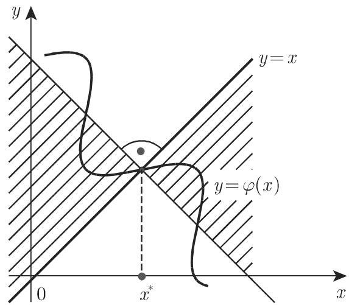

### 19.1 数值求解单变量非线性方程

任何单变量方程可以转化为一般形式：

$$
\text { 零形式: } f (x) = 0.\tag{19.1}
$$

$$
\text { 不动点形式:   } x = \varphi (x)  .\tag{19.2}
$$

设方程 (19.1) (19.2) 可以求解．其解用 $x ^ { * }$ 表示．为得到 $x ^ { * }$ 的第一个近似值，我们尝试将方程转化为形式 $f _ { 1 } \left( x \right) = f _ { 2 } \left( x \right)$ ，其中函数 $y = f _ { 1 } \left( x \right) , y = f _ { 2 } \left( x \right)$ 的曲线大致可以简单作图

■ $f \left( x \right) = x ^ { 2 } - \sin x = 0$ 根据函数 $y = x ^ { 2 } , \ y = \sin x$ 的形状，容易得到 $x _ { 1 } ^ { * } = 0$ 与$x _ { 2 } ^ { * } \approx 0 . 8 7$ 为其根（图 19.1).

  
图 19.1

#### 19.1.1 迭代法

迭代法的基本思路是：从已知的初始值 $x _ { k } \left( k = 0 , 1 , \cdots , n \right)$ 出发，进一步构造更好的逼近序列因此给定方程的解是一个收敛序列的迭代逼近．构造的序列要有尽可能快的收敛速度

19.1.1.1 一般迭代法

为了求解或许已转化为不动点形式 $x = \varphi \left( x \right)$ 的给定方程，迭代法

$$
x _ {n + 1} = \varphi \left(x _ {n}\right) \quad \left(n = 0, 1, \dots ; x _ {0} \text {给定}\right)\tag{19.3}
$$

称为一般迭代法．如果在 $x ^ { * }$ 邻域内满足

$$
\left| \frac {\varphi (x) - \varphi \left(x ^ {*}\right)}{x - x ^ {*}} \right| \leqslant K <   1,\tag{19.4}
$$

其中 为常数，而且初值在该邻域内，它将收敛到解 $x ^ { * }$ （图 19.2) ．如果函数 $\varphi \left( x \right)$ 可导，则相应的条件变为

$$
\varphi^ {\prime} (x) \leqslant K <   1,\tag{19.5}
$$

常数 越小，一般迭代法的收敛速度越快．

  
19.2

<table><tr><td rowspan="3"> $x^{2}=\sin x$ ,即 $x_{n+1}=\sqrt{\sin x_{n}}.$ 迭代过程如右表.</td><td>n</td><td>0</td><td>1</td><td>2</td><td>3</td><td>4</td><td>5</td></tr><tr><td> $x_{n}$ </td><td> $\underline{0.87}$ </td><td> $\underline{0.8742}$ </td><td> $\underline{0.8758}$ </td><td> $\underline{0.8764}$ </td><td> $\underline{0.8766}$ </td><td> $\underline{0.8767}$ </td></tr><tr><td> $\sin x_{n}$ </td><td>0.7643</td><td>0.7670</td><td>0.7681</td><td>0.7684</td><td>0.7686</td><td>0.7686</td></tr></table>

(1) 在复数解的情况下，设 $x = u + \mathrm { i } v$ ，分别对实部与虚部组成的两个未知量的方程组求解未知的实数 $u , v$

(2) 迭代法求解非线性方程组可以参见第 1249 19.2.2.

19.1.1.2 牛顿法

1. 牛顿法的公式

为了求解形如 $f \left( x \right) = 0$ 的给定方程，最常用到的牛顿法有如下形式：

$$
x _ {n + 1} = x _ {n} - {\frac {f \left(x _ {n}\right)}{f ^ {\prime} \left(x _ {n}\right)}} \quad (n = 0, 1, \dots ; x _ {0}   \text {给定}).\tag{19.6}
$$

即：为了得到新的近似值 $x _ { n + 1 }$ 需要计算函数 $f \left( x \right)$ 与其一阶导数 $f ^ { \prime } \left( x \right)$ 在点 $x _ { n }$ 处的值

2. 牛顿法的收敛条件

$$
f ^ {\prime} (x) \neq 0\tag{19.7a}
$$

是牛顿法收敛的必要条件，条件

$$
\left| \frac {f (x) f ^ {\prime \prime} (x)}{f ^ {\prime 2} (x)} \right| \leqslant K <   1\tag{19.7b}
$$

是牛顿法收敛的充分条件．需要在解 $x ^ { * }$ ＊及其邻域内所有的点 $x _ { n }$ 都满足条件 (19.7a,19.7b)．如果牛顿法收敛，其收敛速度非常快．它是平方阶收敛的，即第 $n { + 1 }$ 个近似值的误差远小千一个常数乘以第 个近似值的误差的平方．在十进制中，这意味着经过迭代准确值的位数成倍增加．

·求解方程 $f \left( x \right) = x ^ { 2 } - a = 0$ ，即计算 $x = { \sqrt { a } } \ ( a > 0$ 给定），由牛顿法得到迭代公式为

$$
x _ {n + 1} = \frac {1}{2} \left(x _ {n} + \frac {a}{x _ {n}}\right).\tag{19.8}
$$

对千 $a = 2$ ，有

<table><tr><td>n</td><td>0</td><td>1</td><td>2</td><td>3</td></tr><tr><td>xn</td><td> $\underline{1.5}$ </td><td> $\underline{1.4166666}$ </td><td> $\underline{1.4142157}$ </td><td> $\underline{1.4142136}$ </td></tr></table>

3. 儿何插值

牛顿法儿何插值可以表示为图 19.3. 牛顿法的基本思想是用函数 $y = f \left( x \right)$ 的切线得到局部近似值．

  
图 19.3

4. 修正牛顿法

如果在迭代过程中 $f ^ { \prime } \left( x _ { n } \right)$ ）的数值儿乎不变，它在一段时间内保持为常数，可用

所谓修正牛顿法

$$
x _ {n + 1} = x _ {n} - \frac {f (x _ {n})}{f ^ {\prime} (x _ {m})} \quad (m \text {给定}, m <   n).\tag{19.9}
$$

这种简化的好处是其收敛阶儿乎没有任何改变．

5. 复变量的可微函数

牛顿法对千复变量的可微函数同样适用．

19.1.1.3 试位法

1. 试位法的公式

为求解形如 $f \left( x \right) = 0$ 的方程，试位法具有如下形式：

$$
x _ {n + 1} = x _ {n} - \frac {x _ {n} - x _ {m}}{f (x _ {n}) - f (x _ {m})} f (x _ {n}) \quad (n = 1, 2, \dots ; x _ {0}, x _ {1} \text {给定}, m <   n). \tag {19.10}
$$

该方法仅需要计算函数值．该方法源千牛顿法 (19.6) ，而导数 $f ^ { \prime } \left( x _ { n } \right)$ 由 f(x) 在点$x _ { n }$ 与前一个点 $x _ { m }$ 的有限差分近似得到 $( m < n )$

2. 儿何插值

试位法儿何插值可以表示为图 19.4. 试位法的基本思想是用曲线 $y = f \left( x \right)$ 的切线得到局部近似值．

  
19.4

3. 收敛性

当选取的 使得 $f \left( x _ { n } \right)$ ）和 $f \left( x _ { m } \right)$ 一直是异号时，方法 (19.10) 是收敛的．若在迭代过程中收敛速度已经足够快，可以忽略符号改变，只要用 $x _ { m } = x _ { n - 1 }$ 就可以增加收敛速度

·计算 $f \left( x \right) = x ^ { 2 } - \sin x = 0$

<table><tr><td>n</td><td> $\Delta x_n = x_n - x_{n-1}$ </td><td> $x_n$ </td><td> $f(x_n)$ </td><td> $\Delta y_n = f(x_n) - f(x_{n-1})$ </td><td> $\frac{\Delta x_n}{\Delta y_n}$ </td></tr><tr><td>0</td><td></td><td>0.9</td><td>0.0267</td><td></td><td></td></tr><tr><td>1</td><td>-0.3</td><td>0.87</td><td>-0.0074</td><td>-0.0341</td><td>0.8798</td></tr><tr><td>2</td><td>0.0065</td><td>0.8765</td><td>-0.000252</td><td>0.007148</td><td>0.9093</td></tr><tr><td>3</td><td>0.000229</td><td>0.876729</td><td>0.000003</td><td>0.000255</td><td>0.8980</td></tr><tr><td>4</td><td>-0.000003</td><td>0.876726</td><td></td><td></td><td></td></tr></table>

$$
\Delta x _ {n} / \Delta y _ {n}
$$

4. 斯特芬森方法

应用试位法取 $x _ { m } = x _ { n - 1 }$ 求解方程 $f \left( x \right) = x - \varphi \left( x \right) = 0$ ，其收敛速度可以提高，尤其是 $\varphi ^ { \prime } \left( x \right) < - 1$ 的情况．该算法被称为斯特芬森 (Steffensen) 方法

·应用斯特芬森方法求解 $x ^ { 2 } = \sin x$ ，需要用到 $f \left( x \right) = x - { \sqrt { \sin x } } = 0$

<table><tr><td>n</td><td> $\Delta x_n = x_n - x_{n-1}$ </td><td> $x_n$ </td><td> $f(x_n)$ </td><td> $\Delta y = f(x_n) - f(x_{n-1})$ </td><td> $\frac{\Delta x_n}{\Delta y_n}$ </td></tr><tr><td>0</td><td></td><td>0.9</td><td>0.014942</td><td></td><td></td></tr><tr><td>1</td><td>-0.03</td><td>0.87</td><td>-0.004259</td><td>-0.019201</td><td>1.562419</td></tr><tr><td>2</td><td>0.006654</td><td>0.876654</td><td>-0.000046</td><td>0.004213</td><td>1.579397</td></tr><tr><td>3</td><td></td><td>0.876727</td><td>0.000001</td><td></td><td></td></tr></table>

#### 19.1.2 多项式方程的解

次多项式方程具有如下形式：

$$
f (x) = p _ {n} (x) = a _ {n} x ^ {n} + a _ {n - 1} x ^ {n - 1} + \dots + a _ {1} x + a _ {0} = 0.\tag{19.11}
$$

为求有效解需要这些函数值 $p _ { n } \left( x \right)$ 及其导数值的有效计算方法，以及根的位置的初始估计．

19.1.2.1 霍纳格式

1. 实数情况

为通过 次多项式 $p _ { n } \left( x \right)$ 的系数得到在 $x = x _ { 0 }$ 处的根，首先考虑如下分解：

$$
p _ {n} (x) = a _ {n} x ^ {n} + a _ {n - 1} x ^ {n - 1} + \dots + a _ {1} x + a _ {0} = (x - x _ {0}) p _ {n - 1} (x) + p _ {n} (x _ {0}),\tag{19.12}
$$

这里 $p _ { n - 1 } \left( x \right)$ 表示次数为 $n - 1$ 次多项式

$$
p _ {n - 1} (x) = a _ {n - 1} ^ {\prime} x ^ {n - 1} + a _ {n - 2} ^ {\prime} x ^ {n - 2} + \dots + a _ {1} ^ {\prime} x + a _ {0} ^ {\prime}.\tag{19.13}
$$

递推公式

$$
a _ {k - 1} ^ {\prime} = x _ {0} a _ {k} ^ {\prime} + a _ {k} \quad (k = n, n - 1, \dots , 0; a _ {n} ^ {\prime} = 0; a _ {- 1} ^ {\prime} = p _ {n} (x _ {0}))\tag{19.14}
$$

可以根据 (19.12) 对比 $x ^ { k }$ 的系数得到（注意 $a _ { n - 1 } ^ { \prime } = a _ { n } )$ ．通过这种方法，多项式$p _ { n - 1 } \left( x \right)$ 的系数 $a _ { k } ^ { \prime }$ 与值 $p _ { n } \left( x _ { 0 } \right)$ 可以通过 $p _ { n } \left( x \right)$ 的系数 $a _ { k }$ 确定．进一步，重复上述“传统＇的方法分解多项式 $p _ { n - 1 } \left( x \right)$ 得到 $p _ { n - 2 } \left( x \right)$

$$
p _ {n - 1} (x) = (x - x _ {0}) p _ {n - 2} (x) + p _ {n - 1} (x _ {0}),\tag{19.15}
$$

即得到多项式序列 $p _ { n } \left( x \right) , p _ { n - 1 } \left( x \right) , \cdot \cdot \cdot , p _ { 1 } \left( x \right) , p _ { 0 } \left( x \right)$ ．计算多项式的系数和相应的值可以表示为

<table><tr><td></td><td>an</td><td>an-1</td><td>an-2</td><td>···</td><td>a3</td><td>a2</td><td>a1</td><td>a0</td></tr><tr><td>x0</td><td></td><td>xn0an-1</td><td>xn0an-2</td><td>···</td><td>xn0an3</td><td>xn0an2</td><td>xn0an1</td><td>xn0an0</td></tr><tr><td></td><td>an-1</td><td>an-2</td><td>an-3</td><td>···</td><td>an2</td><td>an1</td><td>an0</td><td></td></tr><tr><td>x0</td><td></td><td>xn0an-2</td><td>xn0an-3</td><td>···</td><td>xn0an2</td><td>xn0an1</td><td>xn0an0</td><td></td></tr><tr><td></td><td>an-2</td><td>an-3</td><td>an-4</td><td>···</td><td>an1</td><td>an0</td><td></td><td>pn(x0)</td></tr><tr><td></td><td></td><td colspan="7">......</td></tr><tr><td>x0</td><td></td><td colspan="7">xn0an0(n-1)</td></tr><tr><td></td><td></td><td colspan="7"></td></tr><tr><td></td><td>an(n-1)</td><td colspan="7">p1(x0)</td></tr><tr><td>x0</td><td></td><td colspan="7"></td></tr><tr><td></td><td colspan="8">an(n) = p0(x0)</td></tr></table>

(19.16)

从格式 (19.16) 得到多项式的值 $p _ { n } \left( x _ { 0 } \right)$ 及其导数值 $p _ { n } ^ { ( k ) } \left( x _ { 0 } \right)$ 分别为

$$
p _ {n} ^ {\prime} \left(x _ {0}\right) = 1! p _ {n - 1} \left(x _ {0}\right), \quad p _ {n} ^ {\prime \prime} \left(x _ {0}\right) = 2! p _ {n - 2} \left(x _ {0}\right), \quad \dots , \quad p _ {n} ^ {(n)} \left(x _ {0}\right) = n! p _ {0} \left(x _ {0}\right).\tag{19.17}
$$

． $p _ { 4 } \left( x \right) = x ^ { 4 } + 2 x ^ { 3 } - 3 x ^ { 2 } - 7$ . 根据 (19.16) 计算 $p _ { 4 } \left( x \right)$ 及其导数在 $x _ { 0 } = 2$ 处的值．

<table><tr><td></td><td>1</td><td>2</td><td>-3</td><td>0</td><td>-7</td><td>可得</td></tr><tr><td>2</td><td></td><td>2</td><td>8</td><td>10</td><td>20</td><td> $p_{4}(2)=13,$ </td></tr><tr><td></td><td>1</td><td>4</td><td>5</td><td>10</td><td>13</td><td> $p_{4}^{\prime}(2)=44,$ </td></tr><tr><td>2</td><td></td><td>2</td><td>12</td><td>34</td><td></td><td> $p_{4}^{\prime\prime}(2)=66,$ </td></tr><tr><td></td><td>1</td><td>6</td><td>17</td><td>44</td><td></td><td> $p_{4}^{\prime\prime\prime}(2)=60,$ </td></tr><tr><td>2</td><td></td><td>2</td><td>16</td><td></td><td></td><td> $p_{4}^{(4)}(2)=24.$ </td></tr><tr><td></td><td>1</td><td>8</td><td>33</td><td></td><td></td><td></td></tr><tr><td>2</td><td></td><td>2</td><td></td><td></td><td></td><td></td></tr><tr><td></td><td>1</td><td>10</td><td></td><td></td><td></td><td></td></tr><tr><td>2</td><td></td><td></td><td></td><td></td><td></td><td></td></tr><tr><td></td><td>1</td><td></td><td></td><td></td><td></td><td></td></tr></table>

(1) 多项式 $p _ { n } \left( x \right)$ 可以表述成 $x - x _ { 0 }$ 的形式，在这个例子中

$$
p _ {4} (x) = (x - 2) ^ {4} + 1 0 (x - 2) ^ {3} + 3 3 (x - 2) ^ {2} + 4 4 (x - 2) + 1 3.
$$

(2) 霍纳格式也可以用来计算复系数 $a _ { k }$ ．这种情况下我们需要根据 (19.16)分别计算实部和虚部

2. 复数情况

如果 (19.11) 中的系数 $a _ { k }$ 为实数，则对复数值 $x _ { 0 } = u _ { 0 } + \mathrm { i } v _ { 0 }$ 也可计算 $p _ { n } \left( x _ { 0 } \right)$ 为说明这一点对 $p _ { n } \left( x \right)$ 作如下分解

$$
\begin{array}{r l} & p _ {n} (x) = a _ {n} x ^ {n} + a _ {n - 1} x ^ {n - 1} + \dots + a _ {1} x + a _ {0} \\ & \qquad = (x ^ {2} - p x - q) (a _ {n - 2} ^ {\prime} x ^ {n - 2} + \dots + a _ {0} ^ {\prime}) + r _ {1} x + r _ {0}, \end{array}\tag{19.18a}
$$

其中

$$
x ^ {2} - p x - q = (x - x _ {0}) (x - \overline {{{{x}}}} _ {0}), \text {即} p = 2 u _ {0}, q = - (u _ {0} ^ {2} + v _ {0} ^ {2}).\tag{19.18b}
$$

千是

$$
p _ {n} (x _ {0}) = r _ {1} x + r _ {0} = (r _ {1} u _ {0} + r _ {0}) + \mathrm{i} r _ {1} v _ {0}.\tag{19.18c}
$$

为得到 (19.18a) 科拉茨 (Collatz) 引进所谓双列霍纳格式 (two-row Horner scheme),其构造如下：

$$
\begin{array}{c c c c c c c c} & a _ {n} & a _ {n - 1} & a _ {n - 2} & \dots & a _ {3} & a _ {2} & a _ {1} & a _ {0} \\ q & & & q a _ {n - 2} ^ {\prime} & \dots & q a _ {3} ^ {\prime} & q a _ {2} ^ {\prime} & q a _ {1} ^ {\prime} & q a _ {0} ^ {\prime} \\ p & & p a _ {n - 2} ^ {\prime} & p a _ {n - 3} ^ {\prime} & \dots & p a _ {2} ^ {\prime} & p a _ {1} ^ {\prime} & p a _ {0} ^ {\prime} \\ \hline & a _ {n - 2} ^ {\prime} & a _ {n - 3} ^ {\prime} & a _ {n - 4} ^ {\prime} & \dots & a _ {1} ^ {\prime} & a _ {0} ^ {\prime} & r _ {1} & r _ {0} \\ & = a _ {n} \end{array}\tag{19.18d}
$$

$p _ { 4 } \left( x \right) = x ^ { 4 } + 2 x ^ { 3 } - 3 x ^ { 2 } - 7$ 在点 $x _ { 0 } = 2 - \mathrm { i }$ 处计算 $p _ { 4 }$ 的值，即由 $p = 4 , q = - 5$ 得到 $p _ { 4 } \left( x _ { 0 } \right) = 3 4 x _ { 0 } - 8 7 = - 1 9 - 3 4 \mathrm { i }$

$$
\begin{array}{c c c c c c} & 1 & 2 & - 3 & 0 & - 7 \\ - 5 & & & - 5 & - 3 0 & - 8 0 \\ 4 & & 4 & 2 4 & 6 4 & \\ \hline & 1 & 6 & 1 6 & \boxed {3 4} & - 8 7 \end{array}
$$

19.1.2.2 根的位置

1. 实根、斯图姆序列

笛卡儿符号法则给出了多项式方程 (19.11) 是否有实根的原始思想．

a) 正实根的个数等千系数序列

$$
a _ {n}, a _ {n - 1}, \dots , a _ {1}, a _ {0}\tag{19.19a}
$$

改变符号的次数，或扣除一个偶数．

b) 负实根的个数等千系数序列

$$
a _ {0}, - a _ {1}, a _ {2}, \dots , (- 1) ^ {n} a _ {n}\tag{19.19b}
$$

改变符号的次数，或扣除一个偶数．

． $p _ { 5 } \left( x \right) = x ^ { 5 } - 6 x ^ { 4 } + 1 0 x ^ { 3 } + 1 3 x ^ { 2 } - 1 5 x - 1 6$ 个或者 个正根以及 个或者个负根．为了得到给定区间 $( a , b )$ 内实根的个数，可以用斯图姆 (Sturm) 序列（参见第 57 1.6.3.2, 2. ）．在计算均匀节点 $x _ { v } = x _ { 0 } + v h$ (h 常数， $v = 0 , 1 , 2 , \cdots )$ )上的函数值 $y _ { v } = p _ { n } \left( x _ { v } \right)$ （利用霍纳格式容易执行）后，可得函数图形和根的位置的好的猜测如果 $p _ { n } \left( c \right)$ 和 $p _ { n } \left( d \right)$ 有不同的符号，在 $c$ 之间至少存在一个实根

2. 复根

为了在有界复平面区域上限定实数根或者复数根的位置，考察如下多项式方程，这是 (19.11) 的简单推广：

$$
f ^ {*} (x) = | a _ {n - 1} | r ^ {n - 1} + | a _ {n - 2} | r ^ {n - 2} + \dots + | a _ {1} | r + | a _ {0} | = | a _ {n} | r ^ {n}.\tag{19.20}
$$

通过系统的重复试错，对 (19.20) 的正根决定一个上界 $r _ { 0 }$ . 千是对 (19.11) 所有的根 $x _ { k } ^ { * } \left( k = 1 , 2 , \cdots , n \right)$ 有

$$
\left| x _ {k} ^ {*} \right| \leqslant r _ {0}.\tag{19.21}
$$

一 $\textbf { \textit { f } } ( x ) = p _ { 4 } \left( x \right) = x ^ { 4 } + 4 . 4 x ^ { 3 } - 2 0 . 0 1 x ^ { 2 } - 5 0 . 1 2 x + 2 9 . 4 5 = 0 , \textit { f } ^ { \ast } \left( x \right) = 4 . 4 x ^ { 3 } + \cdots$ $2 0 . 0 1 r ^ { 2 } + 5 0 . 1 2 r + 2 9 . 4 5 = r ^ { 4 }$ ，某些试验是

$$
\begin{array}{r l} & r = 6 \colon f ^ {*} (6) = 2 0 0 0. 9 3 > 1 2 9 6 = r ^ {4}, \\ & r = 7 \colon f ^ {*} (7) = 2 8 6 9. 9 8 > 2 4 0 1 = r ^ {4}, \\ & r = 8 \colon f ^ {*} (8) = 3 9 6 3. 8 5 <   4 0 9 6 = r ^ {4}. \end{array}
$$

据此有 $| x _ { k } ^ { * } | < 8 ( k = 1 , 2 , 3 , 4 )$ ．实际上，对千有最大绝对值的根 $x _ { 1 } ^ { * } , - 7 < x _ { 1 } ^ { * } < - 6$ 成立

为确定带负实部的复根个数，在电子技术所谓根轨迹理论中发展了一种特别的方法该方法可用来检验稳定性（见 [19.14][19.40]).

19.1.2.3 数值方法

1. 一般方法

19.1.1 讨论的方法可用来求多项式方程的实数根．牛顿法由千其快速收敛性以及函数值 $f \left( x _ { n } \right)$ 与导数值 $f ^ { \prime } \left( x _ { n } \right)$ 可用霍纳法则容易计算，非常适用千多项式方程假设多项式方程 $f \left( x \right) = 0$ 的根 $x ^ { * }$ ＊的近似值 $x _ { n }$ 充分好，则修正项 $\delta = x ^ { * } - x _ { n }$ 可以用不动点方程

$$
\delta = \frac {1}{f ^ {\prime} (x _ {n})} \left[ f (x _ {n}) + \frac {1}{2} f ^ {\prime \prime} (x _ {n}) + \dots \right] = \varphi (\delta)\tag{19.22}
$$

迭代修正

．特殊方法

贝尔斯托 (Bairstow) 法常用千求成对的根，尤其是成对的共辄复根．该方法类似千霍纳格式 (19.18a\~l9.18d)，从求给定多项式的二次因子出发，通过确定系数 $p$ 和 $q ,$ 使得线性余项 $r _ { 1 }$ 和 $r _ { 0 }$ 的系数等千零 ([19.38], [19.14], [19.40]).

如果需要计算根的绝对值的最大值与最小值，可以选择使用伯努利方法（见[19.38]).

格雷费 (Graeffe) 法有某些历史重要性．它同时给出包括复共辄根在内的所有的根；然而其计算量非常巨大 ([19.14], [19.40]).
