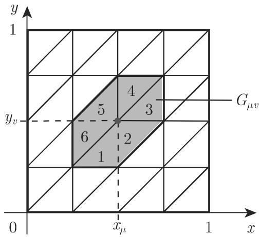
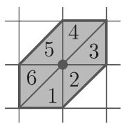
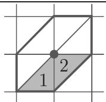
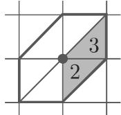
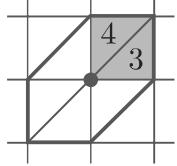
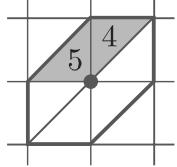
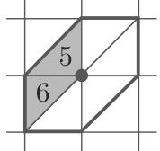
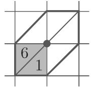

### 19.5 偏微分方程的近似求解

本节仅以带有两个独立变量及相应的边值／初值条件的线性二阶偏微分方程为例讨论偏微分方程数值解的原理

#### 19.5.1 差分法

通过选取点 $( x _ { \mu } , y _ { v } )$ ，考虑在积分区域内的正规网格．通常选等距的矩形网格：

$$
x _ {\mu} = x _ {0} + \mu h, y _ {\nu} = y _ {0} + \nu l (\mu , \nu = 1, 2, \dots).\tag{19.136}
$$

当 $l = h$ 时，得到正方形网格．若所求的解记为 $u \left( x , y \right)$ ，则按如下方式以有限差分代替出现在微分方程及边值或初值中的偏导数，其中 $u _ { \mu \nu }$ 表示函数 $u \left( x _ { \boldsymbol { \mu } } , y _ { \boldsymbol { \nu } } \right)$ 的近似值：

<table><tr><td>偏导数</td><td>有限差分</td><td>误差阶</td></tr><tr><td> $\frac{\partial u}{\partial x}(x_{\mu},y_{\nu})$ </td><td> $\frac{1}{h} (u_{\mu +1,\nu} - u_{\mu ,\nu})$ 或 $\frac{1}{2h} (u_{\mu +1,\nu} - u_{\mu -1,\nu})$ </td><td> $O(h)$ 或 $O(h^{2})$ </td></tr><tr><td> $\frac{\partial u}{\partial y}(x_{\mu},y_{\nu})$ </td><td> $\frac{1}{l} (u_{\mu ,\nu +1} - u_{\mu ,\nu})$ 或 $\frac{1}{2l} (u_{\mu ,\nu +1} - u_{\mu ,\nu -1})$ </td><td> $O(l)$ 或 $O(l^{2})$ </td></tr><tr><td> $\frac{\partial^2u}{\partial x\partial y}(x_\mu ,y_\nu)$ </td><td> $\frac{1}{4hl} (u_{\mu +1,\nu +1} - u_{\mu +1,\nu -1}$  $-u_{\mu -1,\nu +1} + u_{\mu -1,\nu -1})$ </td><td> $O(hl)$ </td></tr><tr><td> $\frac{\partial^2u}{\partial x^2}(x_\mu ,y_\nu)$ </td><td> $\frac{1}{h^2} (u_{\mu +1,\nu} - 2u_{\mu ,\nu} + u_{\mu -1,\nu})$ </td><td> $O(h^{2})$ </td></tr><tr><td> $\frac{\partial^2u}{\partial y^2}(x_\mu ,y_\nu)$ </td><td> $\frac{1}{l^2} (u_{\mu ,\nu +1} - 2u_{\mu ,\nu} + u_{\mu ,\nu -1})$ </td><td> $O(l^{2})$ </td></tr></table>

(19.137)

(19.137) 中由朗道符号 给出误差阶．

在某些情况下，应用带固定参数 $\sigma \left( 0 \leqslant \sigma \leqslant 1 \right)$ 的近似

$$
\frac {\partial^ {2} u}{\partial x ^ {2}} (x _ {\mu}, y _ {\nu}) \approx \sigma \frac {u _ {\mu + 1 , \nu + 1} - 2 u _ {\mu , \nu + 1} + u _ {\mu - 1 , \nu + 1}}{h ^ {2}} + (1 - \sigma) \frac {u _ {\mu + 1 , \nu} - 2 u _ {\mu , \nu} + u _ {\mu - 1 , \nu}}{h ^ {2}}\tag{19.138}
$$

更实用公式 (19.138) 表示由相应千 $y = y _ { \nu } , y = y _ { v + 1 }$ 的公式 (19.137) 得到的两个表达式的凸线性组合．

由公式 (19.137) 偏微分方程可以在网格的每个内点写成差分方程，这里同样考虑其边值条件与初值条件．对千小的步长 ，关千近似值 $u _ { \mu \nu }$ 的线性方程组有高的维数，通常用迭代法（参见第 1248 19.2.1.4) 来求解

：设函数 $u \left( x , y \right)$ 为定义在矩形 $| x | < 1 , | y | < 2$ 内部，并在边 $| x | = 1 , | y | = 2$ 上满足 $u = 0$ 的微分方程 $\Delta u = u _ { x x } + u _ { y y } = - 1$ 的解．对步长为 的正方形网格，相应千微分方程的差分方程为： $4 u _ { \mu , \nu } = u _ { \mu + 1 , \nu } + u _ { \mu , \nu + 1 } + u _ { \mu - 1 , \nu } + u _ { \mu , \nu - 1 } + h ^ { 2 }$ 步长 $h = 1$ （图 19.6) 导致三内点的粗网格近似： $4 u _ { 0 , 1 } = 0 + 0 + 0 + u _ { 0 , 0 } + 1$ 2$4 u _ { 0 , 0 } = 0 + u _ { 0 , 1 } + 0 + u _ { 0 , - 1 } + 1 , 4 u _ { 0 , - 1 } = 0 + u _ { 0 , 0 } + 0 + 0 + 1$

其解为 $u _ { 0 , 0 } = { \frac { 3 } { 7 } } \approx 0 . 4 2 9 , u _ { 0 , 1 } = u _ { 0 , - 1 } = { \frac { 5 } { 1 4 } } \approx 0 . 3 5 7 .$

  
19.6

：应用差分法求解偏微分方程得到的线性方程组具有非常特殊的结构以下面更一般的边值问题为例说明之．积分区域为正方形 $G : 0 \leqslant x \leqslant 1 , 0 \leqslant y \leqslant 1$ . 函数$u \left( x , y \right)$ 在区域 内满足微分方程 $\Delta u = u _ { x x } + u _ { y y } = f \left( x , y \right)$ ，在 的边界上满足$u \left( x , y \right) = g \left( x , y \right)$ ．函数 $g$ 已知．对步长 $h = l = 1 / n$ ，关联千微分方程的差分方程为

$$
u _ {\mu + 1, \nu} + u _ {\mu , \nu + 1} + u _ {\mu - 1, \nu} + u _ {\mu , \nu - 1} - 4 u _ {\mu , \nu} = \frac {1}{n ^ {2}} f (x _ {\mu}, y _ {\nu}) (\mu , \nu = 1, 2, \dots , n - 1).
$$

当 $n = 5$ 时，按 $4 \times 4$ 个内点从左到右逐行排列考虑到边界上的函数值已知则近似值 $u _ { \mu \nu }$ 的差分方程组的左边为

$$
\left( \begin{array}{c c c c c} \hline - 4 & 1 & 0 & 0 \\ 1 & - 4 & 1 & 0 \\ 0 & 1 & - 4 & 1 \\ 0 & 0 & 1 & - 4 \\ \hline \hline 1 & 0 & 0 & 0 \\ 0 & 1 & 0 & 0 \\ 0 & 0 & 1 & 0 \\ 0 & 0 & 0 & 1 \\ \hline \hline \end{array} \right) \left( \begin{array}{c} u _ {1 1} \\ u _ {2 1} \\ u _ {3 1} \\ u _ {4 1} \\ \hline u _ {1 2} \\ u _ {2 2} \\ u _ {3 2} \\ u _ {4 2} \\ \hline u _ {1 3} \\ u _ {2 3} \\ u _ {3 3} \\ u _ {4 3} \\ \hline u _ {1 4} \\ u _ {2 4} \\ u _ {3 4} \\ u _ {4 4} \\ \end{array} \right)\tag{19.139}
$$

系数矩阵是对称稀疏的．这个形式称为块三对角矩阵．显然矩阵的形式依赖千网格节点的选取．对千诸如椭圆、抛物、双曲等不同类型的二阶偏微分方程，发展了更有效的方法并研究了收敛性与稳定性条件关千这一课题有大量的著述（例如见[19.28], [19.31 l, [19.20]).

#### 19.5.2 用已知函数逼近

解 $u \left( x , y \right)$ 用如下形式的函数逼近：

$$
u (x, y) \approx v (x, y) = v _ {0} (x, y) + \sum_ {i = 1} ^ {n} a _ {i} v _ {i} (x, y).\tag{19.140}
$$

这里需要区别两种情况：

(1) $v _ { 0 } \left( x , y \right)$ 满足给定的非齐次微分方程，而函数 $v _ { i } \left( x , y \right) ( i = 1 , 2 , \cdot \cdot \cdot , n )$ 满 足相应的齐次微分方程（则要求线性组合逼近给定的边界条件）．

(2) $v _ { 0 } \left( x , y \right)$ 满足给定的非齐次微分方程的边界条件，而其他函数 $v _ { i } \left( x , y \right) ( i =$ $1 , 2 , \cdots , n )$ 满足齐次边界条件（则要求线性组合在所考虑的区域内尽可能逼近微分方程的解）．

将形如 (19.140) 的近似函数 $v \left( x , y \right)$ 在第一种情况代入边界条件，在第二种情况代入微分方程，得到称为亏量的误差项：

$$
\varepsilon = \varepsilon (x, y; a _ {1}, a _ {2}, \dots , a _ {n}).\tag{19.141}
$$

可用下列方法之一确定未知系数 $a _ { i }$

1. 配置法

亏量 应该在 个合理的不同的点为零，这 个点称为配置点 $( x _ { v } , y _ { v } ) ( v = 1$ $2 , \cdots , n )$

$$
\varepsilon (x _ {\nu}, y _ {\nu}; a _ {1}, a _ {2}, \dots , a _ {n}) = 0 \quad (\nu = 1, 2, \dots , n).\tag{19.142}
$$

第一种情况配置点在边界上（称为边界配置），第二种情况配置点为区域内点（称为区域配置）．由 (19.142) 得到系数的 个方程．边界配置通常比区域配置更受欢迎．

·用此方法求解 19.5.1 中用差分法求解的例题，其中函数

$$
v (x, y; a _ {1}, a _ {2}, a _ {3}) = - \frac {1}{4} (x ^ {2} + y ^ {2}) + a _ {1} + a _ {2} (x ^ {2} - y ^ {2}) + a _ {3} (x ^ {4} - 6 x ^ {2} y ^ {2} + y ^ {4})
$$

满足微分方程可通过在点 $\left( x _ { 1 } , y _ { 1 } \right) = \left( 1 , 0 . 5 \right) , \left( x _ { 2 } , y _ { 2 } \right) = \left( 1 , 1 . 5 \right) , \left( x _ { 3 } , y _ { 3 } \right) = \left( 0 . 5 , 2 \right)$ 满足边界条件来确定系数（边界配置）．线性方程组

$$
\begin{array}{r l} & {- 0. 3 1 2 5 + a _ {1} + 0. 7 5 a _ {2} - 0. 4 3 7 5 a _ {3} = 0,} \\ & {- 0. 8 1 2 5 + a _ {1} - 1. 2 5 a _ {2} - 7. 4 3 7 5 a _ {3} = 0,} \\ & {- 1. 0 6 2 5 + a _ {1} - 3. 7 5 a _ {2} + 1 0. 0 6 2 5 a _ {3} = 0} \end{array}
$$

的解为 $a _ { 1 } = 0 . 4 5 6 2 , a _ { 2 } = - 0 . 2 0 0 , a _ { 3 } = - 0 . 0 1 4 3$ 通过近似函数可以计算解在任意点的近似值将此值与有限差分法得到的近似值相比： $v \left( 0 , 1 \right) = 0 . 3 9 1 9 , v \left( 0 , 0 \right) =$ 0.4562.

2. 最小二乘法

依赖千近似函数是否满足微分方程或边界条件，需要：

(1) 在边界 上的线积分

$$
I = \int_ {(C)} \varepsilon^ {2} (x (t), y (t); a _ {1}, \dots , a _ {n}) \mathrm{d} t = \min,\tag{19.143a}
$$

其中边界曲线 由参数方程 $x = x \left( t \right) , y = y \left( t \right)$ 给出．

(2) 或者区域 上的二重积分

$$
I = \iint_ {(G)} \varepsilon^ {2} (x, y; a _ {1}, \dots , a _ {n}) \mathrm{d} x \mathrm{d} y = \min\tag{19.143b}
$$

由必要条件 $\frac { \partial I } { \partial a _ { i } } = 0 ( i = 1 , 2 , \cdot \cdot \cdot , n )$ 得到确定参数 $a _ { 1 } , a _ { 2 } , \cdots , a _ { n }$ 的 $n$ 个方程

#### 19.5.3 有限元方法(FEM)

在现代计算机出现后，有限元方法成为求解偏微分方程的最重要的技术．也容易说明这种强有力的方法产生的结果

对千不同类型的应用有限元方法有很不相同的实施方式故这里仅介绍其基本思想它类似千数值求解常微分方程边值问题的里茨法（参见第 1266 19.4.2.2),也涉及样条插值（参见第 1293 19.7).

有限元方法有如下步骤

1. 定义变分问题

巾已知边值问题形成变分问题．以如下边值问题为例说明其过程：

的内部 $\Delta u = u _ { x x } + u _ { y y } = f$ 的边界上 $u = 0 .$

(19.144)

在微分方程 (19.144) 两边乘以在 的边界为零的适当的光滑函数，并在整个区域上积分，得到

$$
\iint_ {(G)} \left(\frac {\partial^ {2} u}{\partial x ^ {2}} + \frac {\partial^ {2} u}{\partial y ^ {2}}\right) v \mathrm{d} x \mathrm{d} y = \iint_ {(G)} f v \mathrm{d} x \mathrm{d} y.\tag{19.145}
$$

应用高斯求积公式（参见第 945 13.2.2.1, (2) ），将 $P \left( x , y \right) = - v u _ { y } , Q \left( x , y \right) = v u _ { x }$ 代入 (13.121) ，从 (19.145) 得到变分方程

$$
a (u, v) = b (v),\tag{19.146a}
$$

其中

$$
a (u, v) = - \iint_ {(G)} \left(\frac {\partial u}{\partial x} \frac {\partial v}{\partial x} + \frac {\partial u}{\partial y} \frac {\partial v}{\partial y}\right) \mathrm{d} x \mathrm{d} y, \quad b (v) = \iint_ {(G)} f v \mathrm{d} x \mathrm{d} y.\tag{19.146b}
$$

．三角形剖分

将积分区域 分解为简单的子区域，一般用三角形剖分，即区域 被三角形覆盖，且其中相邻的三角形或共有整条边或仅有一个公共顶点．每个带曲线边界的区域可由三角形的联合很好地逼近（图 19.7).

  
19.7

为避免数值上的困难，三角形剖分中应该不包含钝角三角形．

单位正方形的三角形剖分见图 19.8. 从坐标为 $x _ { \mu } = \mu h , y _ { \nu } = \nu h ( \mu , \nu = 0 , 1$ $2 , \cdot \cdot \cdot , N ; h = 1 / N )$ 的网格剖分节点出发，有 $\left( N - 1 \right) ^ { 2 }$ 个内节点考虑到选取解函数，常用以 $( x _ { \mu } , y _ { \nu } )$ 为公共顶点的六个三角形组合成的面元 $G _ { \mu \nu }$ （在其他的情况下，三角形可能不是 个．这些面元显然互不排斥）．

  
19.8

3. 求解

对所求的函数 $u \left( x , y \right)$ 在每一个三角形上定义假设的近似解．带相应假设解的

三角形称为有限元． 的多项式是最合适的选择．在许多情况下，线性近似

$$
\tilde {u} (x, y) = a _ {1} + a _ {2} x + a _ {3} y\tag{19.147}
$$

已经足够假设近似函数在相邻三角形间必须连续，故最终的解也是连续的

(19.147) 中的系数 $a _ { 1 } , a _ { 2 } , a _ { 3 }$ 由在三角形顶点上的函数值 $u _ { 1 } , u _ { 2 } , u _ { 3 }$ 唯一确定．这同时保证了相邻三角形间的连续性假设解 (19.147) 包含了作为未知参数的要求函数的近似值 $u _ { i }$ . 在整个区域 上用来逼近要求的解 $u \left( x , y \right)$ 的假设解选为

$$
\tilde {u} (x, y) = \sum_ {\mu = 1} ^ {N - 1} \sum_ {\nu = 1} ^ {N - 1} \alpha_ {\mu \nu} u _ {\mu \nu} (x, y).\tag{19.148}
$$

确定适当的系数 $\alpha _ { \mu \nu }$ • 对函数 $u _ { \mu \nu } \left( x , y \right)$ 必须成立：根据 (19.147)，它们在 $G _ { \mu \nu }$ 的每一个三角形上是满足下面条件的线性函数：

(1)

$$
u _ {\mu \nu} \left(x _ {k}, y _ {l}\right) = \left\{ \begin{array}{l l} {{1,}} & {{k = \mu , l = \nu ,}} \\ {{0,}} & {{\mathrm{其他}.}} \end{array} \right.\tag{19.149a}
$$

(2)

$$
u _ {\mu \nu} (x, y) \equiv 0, \text {对任意} (x, y) \notin G _ {\mu \nu}.\tag{19.149b}
$$

$u _ { \mu \nu } \left( x , y \right)$ 在 $G _ { \mu \nu }$ 上的图形表示见图 19.9．在 $G _ { \mu \nu }$ 上，即在图 19.8 中从有的三角形上，计算 $u _ { \mu \nu } \left( x , y \right)$ ．这里仅说明三角形 上的计算：

$$
u _ {\mu \nu} (x, y) = a _ {1} + a _ {2} x + a _ {3},\tag{19.150}
$$

  
19.9

满足

$$
u _ {\mu \nu} (x, y) = \left\{ \begin{array}{l l} 1, & x = x _ {\mu}, y = y _ {v}, \\ 0, & x = x _ {\mu - 1}, y = y _ {v - 1}, \\ 0, & x = x _ {\mu}, y = y _ {v - 1}. \end{array} \right.\tag{19.151}
$$

(19.151) $a _ { 1 } = 1 - v , a _ { 2 } = 0 , a _ { 3 } = 1 / h$ ，随之对三角形

$$
u _ {\mu \nu} (x, y) = 1 + \left(\frac {y}{h} - v\right).\tag{19.152}
$$

类似有

$$
u _ {\mu \nu} (x, y) = \left\{ \begin{array}{l l} 1 - \left(\frac {x}{h} - \mu\right) + \left(\frac {y}{h} - v\right), & \text {三角形2}, \\ 1 - \left(\frac {x}{h} - \mu\right), & \text {三角形3}, \\ 1 - \left(\frac {y}{h} - v\right), & \text {三角形4}, \\ 1 + \left(\frac {x}{h} - \mu\right) + \left(\frac {y}{h} - v\right), & \text {三角形5}, \\ 1 + \left(\frac {x}{h} - \mu\right), & \text {三角形6}. \end{array} \right.\tag{19.153}
$$

4. 计算解的系数

解的系数 $\alpha _ { \mu \nu }$ 巾解 (19.148) 对每个解函数 $u _ { \mu \nu }$ 都满足变分问题 (19.146a)确定，即在 (19.146a) 中用 $\tilde { u } \left( x , y \right)$ 代替 $u \left( x , y \right)$ ，用 $u _ { \mu \nu } \left( x , y \right)$ 代替 $v \left( x , y \right)$ ．千是得到关千未知系数的线性方程组

$$
\sum_ {\mu = 1} ^ {N - 1} \sum_ {\nu = 1} ^ {N - 1} \alpha_ {\mu \nu} a (u _ {\mu \nu}, u _ {k l}) = b (u _ {k l}) \quad (k, l = 1, 2, \dots , N - 1),\tag{19.154}
$$

其中

$$
a \left(u _ {\mu \nu}, u _ {k l}\right) = \iint_ {G _ {k l}} \left(\frac {\partial u _ {\mu \nu}}{\partial x} \frac {\partial u _ {k l}}{\partial x} + \frac {\partial u _ {\mu \nu}}{\partial y} \frac {\partial u _ {k l}}{\partial y}\right) d x d y, \quad b \left(u _ {k l}\right) = \iint_ {G _ {k l}} f u _ {k l} d x d y.\tag{19.155}
$$

在计算 $a \left( u _ { \mu \nu } , u _ { k l } \right)$ ）时必须记住仅需计算区域 $G _ { \mu \nu }$ 和 $G _ { k l }$ 具有非空交集情况下的积分．这些区域在表 19.1 中用阴影表示．

因总是在面积为 $h ^ { 2 } / 2$ 的三角形区域上积分，故关千变量 的偏导数为

$$
\frac {1}{h ^ {2}} \left(4 \alpha_ {k l} - 2 \alpha_ {k + 1, l} - 2 \alpha_ {k - 1, l}\right) \frac {h ^ {2}}{2}.\tag{19.156a}
$$

类似得到关千变量 的偏导数

$$
\frac {1}{h ^ {2}} \left(4 \alpha_ {k l} - 2 \alpha_ {k, l + 1} - 2 \alpha_ {k, l - 1}\right) \frac {h ^ {2}}{2}.\tag{19.156b}
$$

计算 (19.154) 的右端项 $b \left( u _ { k l } \right)$ 得

$$
b (u _ {k l}) = \iint_ {G _ {k l}} f (x, y) u _ {k l} (x, y) \mathrm{d} x \mathrm{d} y \approx f _ {k l} V _ {P},\tag{19.157a}
$$

其中 $V _ { P }$ 为由 $u _ { k l } \left( x , y \right)$ 确定的 $G _ { k l }$ 上高度为 的棱锥的体积（图 19.9)．因为$V _ { P } = { \frac { 1 } { 3 } } \cdot 6 \cdot { \frac { 1 } { 2 } } h ^ { 2 }$ 故其近似值为 $b \left( u _ { k l } \right) \approx f _ { k l } h ^ { 2 }$ (19.157b)

19.1 有限元法附表

<table><tr><td>面域</td><td>图示</td><td>三角形 $G_{kl}$   $G_{\mu\nu}$ </td><td> $\frac{\partial u_{kl}}{\partial x}$ </td><td> $\frac{\partial u_{\mu\nu}}{\partial x}$ </td><td> $\sum \frac{\partial u_{kl}}{\partial x} \frac{\partial u_{\mu\nu}}{\partial x}$ </td></tr><tr><td>(1) $\mu = k$  $\nu = l$ </td><td></td><td>1 12 23 34 45 56 6</td><td>0-1/h-1/h01/h1/h</td><td>0-1/h-1/h01/h1/h</td><td> $\frac{4}{h^{2}}$ </td></tr><tr><td>(2) $\mu = k$  $\nu = l - 1$ </td><td></td><td>1 52 4</td><td>0-1/h</td><td>1/h0</td><td>0</td></tr><tr><td>(3) $\mu = k + 1$  $\nu = l$ </td><td></td><td>2 63 5</td><td>-1/h-1/h</td><td>1/h1/h</td><td> $-\frac{2}{h^{2}}$ </td></tr><tr><td>(4) $\mu = k + 1$  $\nu = l + 1$ </td><td></td><td>3 14 6</td><td>-1/h0</td><td>01/h</td><td>0</td></tr><tr><td>(5) $\mu = k$  $\nu = l + 1$ </td><td></td><td>4 25 1</td><td>0-1/h</td><td>1/h0</td><td>0</td></tr><tr><td>(6) $\mu = k - 1$  $\nu = l$ </td><td></td><td>5 36 2</td><td>1/h1/h</td><td>-1/h-1/h</td><td> $-\frac{2}{h^{2}}$ </td></tr><tr><td>(7) $\mu = k - 1$  $\nu = l - 1$ </td><td></td><td>6 41 3</td><td>1/h0</td><td>0-1/h</td><td>0</td></tr></table>

千是变分方程 (19.154) 导致确定解系数的线性方程组

$$
4 \alpha_ {k l} - \alpha_ {k + 1, l} - \alpha_ {k - 1, l} - \alpha_ {k, l + 1} - \alpha_ {k, l - 1} = h ^ {2} f _ {k l} \quad (k, l = 1, 2, \dots , N - 1).\tag{19.158}
$$

(1) 若解的系数可由 (19.158) 确定，则由 (19.148) 得到的 $\tilde { u } \left( x , y \right)$ 表示其显式近似解，可对 上任意点计算其值．

(2) 若积分区域必须被不规则的三角形网格覆盖，则要引入三角形坐标（也称重心坐标）．这样容易确定点关千三角形网格的位置，又因为每个三角形容易变换为(0, 0), (0, 1), (1, 0) 为顶点的单位三角形，从而使得 (19.155) 中多重积分的计算更容易．

(3) 若需要改善解的精度或可微性，则必须应用分片二次或三次函数以得到假设的近似（见 [19.28]).

(4) 在实际应用中，通常得到高维的线性方程组．这正是发展许多特殊方法的原因例如方程组的结构依赖千三角形网格的自动剖分和单元的实际列举．关千有限元方法的详细介绍见 [19.21], [19.13], [19.28].
