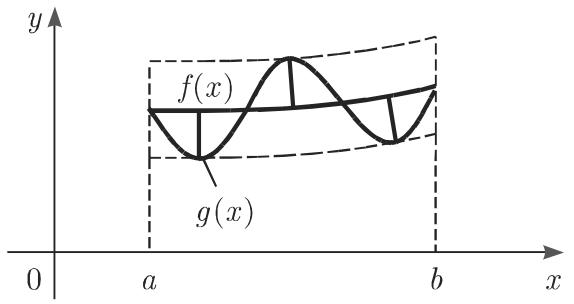
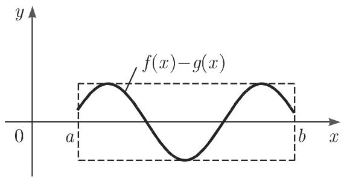
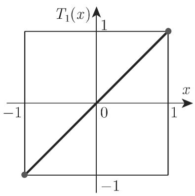
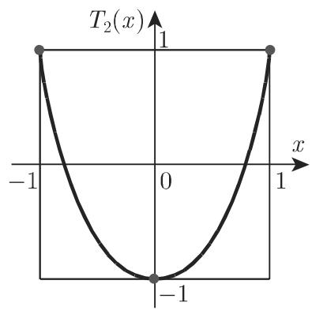
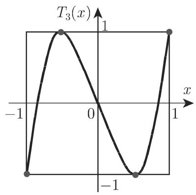
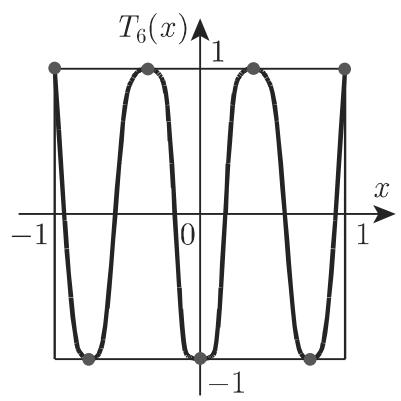

#### 19.6.3 切比雪夫逼近

19.6.3.1 问题的定义和交替点定理

1. 切比雪夫逼近原理

连续情况的切比雪夫逼近或一致逼近如下：函数 f(x) 在区间 $[ a , b ]$ 内被函数$g \left( x \right) = g \left( x ; a _ { 0 } , a _ { 1 } , \cdot \cdot \cdot , a _ { n } \right)$ ）逼近，使得由

$$
\max _ {a \leqslant x \leqslant b} | f (x) - g (x; a _ {0}, a _ {1}, \dots , a _ {n}) | = \Phi (a _ {0}, a _ {1}, \dots , a _ {n})\tag{19.195}
$$

定义的误差对千适当选取的参数 $a _ { i } ( i = 0 , 1 , \cdots , n )$ 尽可能小．如果 $f \left( x \right)$ 存在这样的近似函数，则误差的绝对值至少在区间的 $n + 2$ 点 $x _ { \nu }$ 上取得极大，在这些所谓的交替点误差变号（图 19.10)．这正是交替点定理对千切比雪夫多项式逼近问题的解的特征化的含义．

  
(a)

  
19.10  
(b)

若函数 $f \left( x \right) = x ^ { n }$ 在区间[—1, 1] 上在切比雪夫意义下被次数 $\leqslant n - 1$ 的多项式近似，则切比雪夫多项式 $T _ { n } \left( x \right)$ 可作为最大模为 的误差函数．位千区间端点和区间内 n-l 个点的交替点恰好相应千 $T _ { n } \left( x \right)$ 的极值点（图 19.11(a)\~(f)).

  
(a)

  
(c)

(b)  
  
(d)

  
(e)  
19.11

  
(f)

19.6.3.2 切比雪夫多项式的性质

1. 表达式

$$
T _ {n} (x) = \cos (n \arccos x),\tag{19.196a}
$$

$$
T _ {n} (x) = \frac {1}{2} \left[ \left(x + \sqrt {x ^ {2} - 1}\right) ^ {n} + \left(x - \sqrt {x ^ {2} - 1}\right) ^ {n} \right],\tag{19.196b}
$$

$$
T _ {n} (x) = \left\{ \begin{array}{l l} \cos n t, & x = \cos t, \quad | x | <   1, \\ \cosh n t, & x = \cosh t, \quad | x | > 1 \end{array} \right. \quad (n = 1, 2, \dots).\tag{19.196c}
$$

2. $T _ { n } ( x )$ ）的根

$$
x _ {\mu} = \cos \frac {(2 \mu - 1) \pi}{2 n} (\mu = 1, 2, \dots , n).\tag{19.197}
$$

3. $x \in [ - 1 , 1 ]$ 时 $T _ { n } \left( x \right)$ 极值点的位置

$$
x _ {\nu} = \cos \frac {\nu \pi}{n} (\nu = 0, 1, 2, \dots , n).\tag{19.198}
$$

4. 递推公式

$$
T _ {n + 1} = 2 x T _ {n} (x) - T _ {n - 1} (x) \quad (n = 1, 2, \dots ; T _ {0} (x) = 1, T _ {1} (x) = x).\tag{19.199}
$$

例如递推得到

$$
T _ {2} (x) = 2 x ^ {2} - 1, \quad T _ {3} (x) = 4 x ^ {3} - 3 x,\tag{19.200a}
$$

$$
T _ {4} (x) = 8 x ^ {4} - 8 x ^ {2} + 1, \quad T _ {5} (x) = 1 6 x ^ {5} - 2 0 x ^ {3} + 5 x,\tag{19.200b}
$$

$$
T _ {6} (x) = 3 2 x ^ {6} - 4 8 x ^ {4} + 1 8 x ^ {2} - 1,\tag{19.200c}
$$

$$
T _ {7} (x) = 6 4 x ^ {7} - 1 1 2 x ^ {5} + 5 6 x ^ {3} - 7 x,\tag{19.200d}
$$

$$
T _ {8} (x) = 1 2 8 x ^ {8} - 2 5 6 x ^ {6} + 1 6 0 x ^ {4} - 3 2 x ^ {2} + 1,\tag{19.200e}
$$

$$
T _ {9} (x) = 2 5 6 x ^ {9} - 5 7 6 x ^ {7} + 4 3 2 x ^ {5} - 1 2 0 x ^ {3} + 9 x,\tag{19.200f}
$$

$$
T _ {1 0} (x) = 5 1 2 x ^ {1 0} - 1 2 8 0 x ^ {8} + 1 1 2 0 x ^ {6} - 4 0 0 x ^ {4} + 5 0 x ^ {2} - 1.\tag{19.200g}
$$

19.6.3.3 列梅兹 (Remes) 算法

1. 交替点定理的推论

数值求解连续切比雪夫逼近问题源千交替点定理．逼近函数选为

$$
g (x) = \sum_ {i = 0} ^ {n} a _ {i} g _ {i} (x),\tag{19.201}
$$

有 $n + 1$ 个线性无关的已知函数，切比雪夫问题的解的系数记为 $a _ { i } ^ { * } ( i = 0 , 1 , \cdots , n )$ ，根据 (19.195) 最小偏差记为 $\rho = \varPhi \left( a _ { 0 } ^ { * } , a _ { 1 } ^ { * } , \cdot \cdot \cdot , a _ { n } ^ { * } \right)$ 吐）．此时当函数 $f$ 和 $g _ { i } ( i = 0 , 1 , \cdots ,$ n) 可微，由交替点定理有

$$
\sum_ {i = 0} ^ {n} a _ {i} ^ {*} g _ {i} \left(x _ {\nu}\right) + (- 1) ^ {\nu} \varrho = f \left(x _ {\nu}\right), \quad \sum_ {i = 0} ^ {n} a _ {i} ^ {*} g _ {i} ^ {\prime} \left(x _ {\nu}\right) = f ^ {\prime} \left(x _ {\nu}\right) \quad (\nu = 1, 2, \dots , n + 2).\tag{19.202}
$$

交替点 $x _ { \nu }$ 满足

$$
a \leqslant x _ {1} <   x _ {2} <   \dots <   x _ {n + 2} \leqslant b.\tag{19.203}
$$

方程组 (19.202) 对切比雪夫逼近问题的 $2 n + 4$ 个未知量，包括 $n + 1$ 个系数、 $n + 2$ 个交替点及最小偏差 $\rho ,$ 给出了 $2 n + 4$ 个条件．若区间端点也是交替点，则在该处导数条件不是必要条件

2. 根据列梅兹算法确定最小解

根据列梅兹算法数值确定最小解的步骤如下．

(1) 根据 (19.203) 确定交替点 $x _ { \nu } ^ { ( 0 ) } \left( i = 1 , 2 , \cdots , n + 2 \right)$ 的近似值，例如等距节 点或 $T _ { n + 1 } \left( x \right)$ 的极值点（见 19.6.3.2).

(2) 求解线性方程组

$$
\sum_ {i = 0} ^ {n} a _ {i} g _ {i} (x _ {\nu} ^ {(0)}) + (- 1) ^ {\nu} \varrho = f (x _ {\nu} ^ {(0)}) \quad (\nu = 1, 2, \dots , n + 2),
$$

其解为近似值 $a _ { i } ^ { ( 0 ) } ( i = 0 , 1 , \cdots , n )$ 和 $\rho _ { 0 }$

(3) 确定交替点新的近似值 $x _ { \nu } ^ { ( 1 ) } \left( i = 1 , 2 , \cdots , n + 2 \right)$ ，例如误差函数 $f \left( x \right) -$ $\sum _ { i = 0 } ^ { n } a _ { i } ^ { ( 0 ) } g _ { i } \left( x \right)$ 极值点的位置此时可以应用这些点作为近似值．

以 $x _ { \nu } ^ { ( 1 ) } , a _ { \nu } ^ { ( 1 ) }$ 代替 $x _ { \nu } ^ { ( 0 ) } , a _ { \nu } ^ { ( 0 ) }$ , 重复步骤 和步骤 3, 等等，即得到关千系数和交替点的逼近序列，其收敛性在某些条件下可以得到（见 [19.33]）．若某个迭代指标 $\mu$ 使得

$$
\left| \varrho_ {\mu} \right| = \max _ {a \leqslant x \leqslant b} \left| f (x) - \sum_ {i = 0} ^ {n} a _ {i} ^ {(\mu)} g _ {i} (x) \right|\tag{19.204}
$$

满足充分的精度，则计算停止．

19.6.3.4 离散切比雪夫逼近和最优化

从连续切比雪夫逼近问题

$$
\max _ {a \leqslant x \leqslant b} \left| f (x) - \sum_ {i = 0} ^ {n} a _ {i} g _ {i} (x) \right| = \min!\tag{19.205}
$$

若选取 个点 $x _ { \nu } \left( \nu = 1 , 2 , \cdot \cdot \cdot , N ; N \geqslant n + 2 \right)$ 满足性质 $a \leqslant x _ { 1 } < x _ { 2 } < \cdots \leqslant$ $x _ { N } \leqslant b$ 并要求

$$
\max _ {\nu = 1, 2, \dots , N} \left| f (x _ {\nu}) - \sum_ {i = 0} ^ {n} a _ {i} g _ {i} (x _ {\nu}) \right| = \min!\tag{19.206}
$$

可得相应的离散问题，代入

$$
\gamma = \max _ {\nu = 1, 2, \dots , N} \left| f (x _ {\nu}) - \sum_ {i = 0} ^ {n} a _ {i} g _ {i} (x _ {\nu}) \right|,\tag{19.207}
$$

显然有推论

$$
\left| f \left(x _ {\nu}\right) - \sum_ {i = 0} ^ {n} a _ {i} g _ {i} \left(x _ {\nu}\right) \right| \leqslant \gamma \quad (\nu = 1, 2, \dots , N).\tag{19.208}
$$

(19.208) 消去绝对值，得到关千系数 $a _ { i }$ 和？ $\gamma$ 的线性不等式组，从而 (19.206)为线性规划问题（参见第 1179 18.1.1.1):

$$
\gamma = \min!, \text {满足} \quad \left\{ \begin{array}{l l} {\gamma +  \sum_ {i = 0} ^ {n} a _ {i} g _ {i} (x _ {\nu}) \geqslant f (x _ {\nu}),} \\ {\gamma -  \sum_ {i = 0} ^ {n} a _ {i} g _ {i} (x _ {\nu}) \geqslant - f (x _ {\nu})} \end{array} \right. (\nu = 1, 2, \dots , N).\tag{19.209}
$$

对 $\gamma > 0$ 方程 (19.209) 有极小解．对千足够大的点数 及某些进一步的条件，离散问题的解可看作连续问题的解．

若用非线性依赖参数 $a _ { 0 } , a _ { 1 } , \cdots , a _ { n }$ 的非线性逼近函数 $g \left( x \right) = g ( x ; a _ { 0 } , a _ { 1 }$ $\cdots , a _ { n } )$ ）代替线性逼近函数 $g \left( x \right) = \sum _ { i = 0 } ^ { n } a _ { i } g _ { i } \left( x \right)$ ，则类似可得非线性最优化问题．其通常即使在简单函数形式下也是非凸的．这从本质上减少了非线性最优化问题的数值解法（参见第 1203 18.2.2.1).
