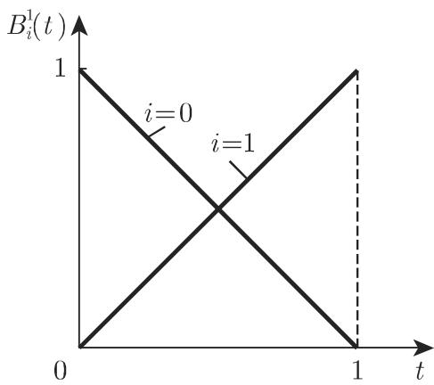
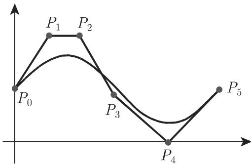

### 19.7 曲线和曲面用样条表示

#### 19.7.1 三次样条

因为高次插值逼近多项式通常有并不想要的振荡，故将近似区间用所谓的节点分为子区间并考虑在每个子区间用相对简单的近似函数是有用的特别地，常使用三次多项式．这类分片逼近要求在节点处光滑过渡

19.7.1.1 插值样条

1. 三次插值样条的定义和性质

设给定 个插值点 $\left( x _ { i } , f _ { i } \right) \left( i = 1 , 2 , \cdots , N ; x _ { 1 } < x _ { 2 } < \cdots < x _ { N } \right)$ ．三次插值样条 S(x) 由下列性质唯一确定

(l) S (x) 满足插值条件 $S \left( x _ { i } \right) = f _ { i } \left( i = 1 , 2 , \cdot \cdot \cdot , N \right)$

(2) S (x) 在任一子区间 $\left[ x _ { i } , x _ { i + 1 } \right] ( i = 1 , 2 , \cdot \cdot \cdot , N - 1 )$ 内为次数不高千 的多项式．

(3) S (x) 在整个插值区间 $[ x _ { 1 } , x _ { N } ]$ 上是二次连续可微的．

(4) $S \left( x \right)$ 满足特殊的边界条件

a) $S ^ { \prime \prime } \left( x _ { 1 } \right) = S ^ { \prime \prime } \left( x _ { N } \right) = 0$ （我们称之为自然样条）或

b) $S ^ { \prime } \left( x _ { 1 } \right) = f _ { 1 } ^ { \prime } , S ^ { \prime } \left( x _ { N } \right) = f _ { N } ^ { \prime } ( f _ { 1 } ^ { \prime } , f _ { N } ^ { \prime }$ 为已知值）或

c) $f _ { 1 } = f _ { N }$ ， $S \left( x _ { 1 } \right) = S \left( x _ { N } \right) , S ^ { \prime } \left( x _ { 1 } \right) = S ^ { \prime } \left( x _ { N } \right)$ 和 $S ^ { \prime \prime } \left( x _ { 1 } \right) = S ^ { \prime \prime } \left( x _ { N } \right)$ （称为周期样条）．

由这些性质可得对所有满足插值条件 $g \left( x _ { i } \right) = f _ { i } \left( i = 1 , 2 , \cdot \cdot \cdot , N \right)$ 的二次连续可微函数 $g \left( x \right)$ ，有

$$
\int_ {x _ {1}} ^ {x _ {N}} \left[ S ^ {\prime \prime} (x) \right] ^ {2} \mathrm{d} x \leqslant \int_ {x _ {1}} ^ {x _ {N}} \left[ g ^ {\prime \prime} (x) \right] ^ {2} \mathrm{d} x\tag{19.235}
$$

成立（霍拉迪 (Holladay) 定理）．依据 (19.235) ，可称 $S \left( x \right)$ 有最小全曲率，因为对已知曲线的曲率 $\kappa ,$ 其首次逼近为 $\kappa \approx S ^ { \prime \prime }$ （参见第 331 3.6.1.2,4. ）．可见若称为样条的细弹性尺穿过点 $\left( x _ { i } , f _ { i } \right) ( i = 1 , 2 , \cdot \cdot \cdot , N )$ ，则其弯曲线沿着三次样条 $S \left( x \right)$

2. 确定样条系数

三次插值样条 $S \left( x \right)$ 在区间 $[ x _ { i } , x _ { i + 1 } ]$ 上具有如下形式：

$$
S (x) = S _ {i} (x) = a _ {i} + b _ {i} (x - x _ {i}) + c _ {i} (x - x _ {i}) ^ {2} + d _ {i} (x - x _ {i}) ^ {3} \quad (i = 1, 2, \dots , N - 1).\tag{19.236}
$$

子区间的长度记为 $h _ { i } = x _ { i + 1 } - x _ { i }$ . 自然样条的系数以如下方式确定．

(1) 由插值条件得

$$
a _ {i} = f _ {i} \quad (i = 1, 2, \dots , N - 1).\tag{19.237}
$$

引入不出现在多项式里的附加系数 $a _ { N } = f _ { N }$ 是合理的．

(2) $S ^ { \prime \prime } \left( x \right)$ 在内节点的连续性要求

$$
d _ {i - 1} = \frac {c _ {i} - c _ {i - 1}}{3 h _ {i - 1}} (i = 2, 3, \dots , N - 1).\tag{19.238}
$$

由自然条件得到 $c _ { 1 } = 0$ 且若引入 $c _ { N } = 0$ (19.238) $i = N$ 依旧成立．

(3) $S \left( x \right)$ 在内节点的连续性得到关系

$$
b _ {i - 1} = \frac {a _ {i} - a _ {i - 1}}{h _ {i - 1}} - \frac {2 c _ {i - 1} + c _ {i}}{3} h _ {i - 1} (i = 2, 3, \dots , N).\tag{19.239}
$$

(4) $S ^ { \prime } ( x )$ 在内节点的连续性要求

$$
c _ {i - 1} h _ {i - 1} + 2 \left(h _ {i - 1} + h _ {i}\right) c _ {i} + c _ {i + 1} h _ {i} = 3 \left(\frac {a _ {i + 1} - a _ {i}}{h _ {i}} - \frac {a _ {i} - a _ {i - 1}}{h _ {i - 1}}\right) \quad (i = 2, 3, \dots , N - 1).\tag{19.240}
$$

因为 (19.237)，用来确定系数 $c _ { i } \left( i = 2 , 3 , \cdots , N - 1 ; c _ { 1 } = c _ { N } = 0 \right)$ 的线性方程组(19.240) 的右端已知．其左端有如下形式：

$$
\left( \begin{array}{c c c c c c} 2 (h _ {1} + h _ {2}) & h _ {2} & & & & \\ h _ {2} & 2 (h _ {2} + h _ {3}) & h _ {3} & & \mathbf {0} & \\ & h _ {3} & 2 (h _ {3} + h _ {4}) & h _ {4} & & \\ & & \ddots & \ddots & \ddots & \\ & \mathbf {0} & & & & h _ {N - 2} \\ & & & & h _ {N - 2} & 2 (h _ {N - 2} + h _ {N - 1}) \end{array} \right) \left( \begin{array}{c} c _ {2} \\ c _ {3} \\ c _ {4} \\ \vdots \\ \\ c _ {N - 1} \end{array} \right).\tag{19.241}
$$

系数矩阵是三对角的，故由 LR 分解（参见第 1243 19.2.1.1,2.），非常容易数值求解线性方程组 (19.240) ．千是 (19.239) (19.238) 的所有其他系数 $c _ { i }$ 可以确定

19.7.1.2 光滑样条

在实际应用中已知的函数值 $f _ { i }$ 通常是测量值，故有某些误差．在这种情况下，插值要求并不合理这就是引进三次光滑样条的原因若在三次插值样条中将插值要求换为

$$
\sum_ {i = 1} ^ {N} \left[ \frac {f _ {i} - S (x _ {i})}{\sigma_ {i}} \right] ^ {2} + \lambda \int_ {x _ {1}} ^ {x _ {N}} \left[ S ^ {\prime \prime} (x) \right] ^ {2} \mathrm{d} x = \min!\tag{19.242}
$$

可得此类样条保持 $S , S ^ { \prime } , S ^ { \prime \prime }$ 连续性的这一要求，使得确定系数的问题是一个带方程形式条件的约束最优化问题．使用拉格朗日函数（参见第 611 6.2.5.6) 即可得到解．详情可见 [19.34], [19.35].

(19.242) 中， $\lambda \left( \lambda > 0 \right)$ 表示事先给定的光滑参数作为特殊情况当 $\lambda = 0$ 时为三次插值样条．当入很大时得到光滑的近似曲线，但回到测量值不准确．作为另一种特殊情况，当 $\lambda = \infty$ 时结果是逼近回归线可适当选取入，例如通过机屏对话在 (19.242) 中的参数 $\sigma _ { i } \left( \sigma _ { i } > 0 \right)$ 表示数值 $f _ { i } ( i = 1 , 2 , \cdots , N )$ 的测量误差的标准偏差（参见第 1109 16.4.1.3, 2.).

插值点和测量点的坐标至今与样条函数的节点坐标是一致的．对大的 ，该方法导致包含大量三次函数 (19.236) 的样条．由千在许多实际应用中，只有段数很少的样条才是满意的，一个可能的解答是自由选取节点的数目和位置．从数值观点看，以下面形式的样条代替 (19.236) 也是合理的：

$$
S (x) = \sum_ {i = 1} ^ {r + 2} a _ {i} N _ {i, 4} (x),\tag{19.243}
$$

这里 表示自由选取的节点的个数，而函数 $N _ { i , 4 } \left( x \right)$ 是所谓 阶正规化 样条（基样条），即关千第 个节点的三次多项式．详情可见 [19.8], [19.6].

#### 19.7.2 双三次样条

19.7.2.1 使用双三次样条

双三次样条用千如下问题： x,y 平面的矩形 $R : a \leqslant x \leqslant b , c \leqslant y \leqslant d ,$ 被节点$\left( x _ { i } , y _ { j } \right) ( i = 0 , 1 , \cdot \cdot \cdot , n ; j = 0 , 1 , \cdot \cdot \cdot , m )$ 剖分为子区域 $R _ { i j }$

$$
a = x _ {0} <   x _ {1} <   \dots <   x _ {n} = b, \qquad c = y _ {0} <   y _ {1} <   \dots <   y _ {m} = d,\tag{19.244}
$$

其中子区域 $R _ { i j }$ 包含点 $( x , y ) \colon x _ { i } \leqslant x \leqslant x _ { i + 1 } , y _ { j } \leqslant y \leqslant y _ { j + 1 } ( i = 0 , 1 , \cdots , n ; j = 0$ $1 , \cdots , m )$ ．在节点给定函数值 $f \left( x , y \right)$

$$
f (x _ {i}, y _ {j}) = f _ {i j} \quad (i = 0, 1, \dots , n; j = 0, 1, \dots , m).\tag{19.245}
$$

要求 上可能简单的光滑曲面逼近点 (19.245).

19.7.2.2 双三次插值样条

1. 性质

双三次插值样条 $S \left( x , y \right)$ 由下列性质唯一确定

(l) $S \left( x , y \right)$ 满足插值条件

$$
S (x _ {i}, y _ {j}) = f _ {i j} \quad (i = 0, 1, \dots , n; j = 0, 1, \dots , m).\tag{19.246}
$$

(2) $S \left( x , y \right)$ 在矩形 的每个子区域 $R _ { i j }$ 恒等千一个双三次多项式，即在 $R _ { i j }$ 有

$$
S (x, y) = S _ {i j} (x, y) = \sum_ {k = 0} ^ {3} \sum_ {l = 0} ^ {3} a _ {i j k l} (x - x _ {i}) ^ {k} (y - y _ {j}) ^ {l},\tag{19.247}
$$

故 $S _ { i j } \left( x , y \right)$ 16 个系数确定，而为了确定 $S \left( x , y \right)$ 需要 l6mn 个系数．

(3) 导数

$$
\frac {\partial S}{\partial x}, \quad \frac {\partial S}{\partial y}, \quad \frac {\partial^ {2} S}{\partial x \partial y}\tag{19.248}
$$

在区域 上是连续的，从而在整个曲面上保证某种光滑性．

(4) $S \left( x , y \right)$ 满足特殊的边界条件：

$$
\frac {\partial S}{\partial x} \left(x _ {i}, y _ {i}\right) = p _ {i j}, \quad i = 0, n; \quad j = 0, 1, \dots , m,
$$

$$
\frac {\partial S}{\partial y} \left(x _ {i}, y _ {i}\right) = q _ {i j}, \quad i = 0, 1, \dots , n; \quad j = 0, m,\tag{19.249}
$$

$$
\frac {\partial^ {2} S}{\partial x \partial y} (x _ {i}, y _ {i}) = r _ {i j}, \quad i = 0, n; \quad j = 0, m,
$$

这里 $p _ { i j } , q _ { i j } , r _ { i j }$ 是预先给定的值．

一维三次样条插值的结果可用来确定系数 $a _ { i j k l }$

(1) 线性方程组的个数 $2 n + m + 3$ 非常大，但其系数矩阵是三对角矩阵

(2) 线性方程组仅右端项不同

一般对千计算量和精度来说，双三次插值样条是有用的故对千实际应用它们是合适的计算系数的实际方法见文献

2. 张量积方法

双三次样条法 (19.247) 是形如

$$
S (x, y) = \sum_ {i = 0} ^ {n} \sum_ {j = 0} ^ {m} a _ {i j} g _ {i} (x) h _ {j} (y)\tag{19.250}
$$

的所谓张量积方法的一个例子．该法特别适用千矩形网格上的逼近．函数 $g _ { i } \left( x \right) ( i =$ $0 , 1 , \cdots , n )$ 和 $h _ { j } \left( x \right) ( j = 0 , 1 , \cdot \cdot \cdot , m )$ 组成两个线性无关的函数组．从数值观点看张量积方法有大的优势，例如二维插值问题 (19.246) 可以降为一维问题求解．进一步说，若：

(1) 函数 $g _ { i } \left( x \right)$ 关千插值节点 $x _ { 0 } , x _ { 1 } , \cdots , x _ { n }$ 的一维插值问题，以及

(2) 函数 $h _ { j } \left( x \right)$ 关千插值节点 $y _ { 0 } , y _ { 1 } , \cdots , y _ { m }$ 的一维插值问题都是唯一可解的，则二维插值问题 (19.246) 用方法 (19.250) 唯一可解．一个重要的张量积方法是使用三次 样条：

$$
S (x, y) = \sum_ {i = 1} ^ {r + 2} \sum_ {j = 1} ^ {p + 2} a _ {i j} N _ {i, 4} (x) N _ {j, 4} (y),\tag{19.251}
$$

这里，函数 $N _ { i , 4 } \left( x \right)$ 和 $N _ { j , 4 } \left( y \right)$ 阶正规化 样条， 表示关千 的节点个数，表示关千 $y$ 的节点个数节点可自由选取，但其位置必须满足插值问题的某种可解性条件．

样条方法得到有带状结构系数矩阵的线性方程组，这是对数值求解有用的结构

用双三次 样条求解不同的插值问题见文献．

19.7.2.3 双三次光滑样条

一维三次近似样条主要以最优条件 (19.242) 为特征．对千二维情况可能有一整列相应的最优条件，但是仅有很少特殊的情况可能存在唯一解．用双三次 样条解逼近问题的适当的最优条件和算法见文献．

#### 19.7.3 曲线和曲面的伯恩斯坦-贝济埃表示

1. 伯恩斯坦贝济埃多项式

曲线和曲面的伯恩斯坦－贝济埃 (Bernstein Bezier) 表示（简记 B-B 表示）使用伯恩斯坦多项式

$$
B _ {i, n} (t) = \binom{n}{i} t ^ {i} (1 - t) ^ {n - i} \quad (i = 0, 1, \dots , n)\tag{19.252}
$$

并利用如下基本性质

(1)

$$
0 \leqslant B _ {i, n} (t) \leqslant 1, \quad 0 \leqslant t \leqslant 1,\tag{19.253}
$$

(2)

$$
\sum_ {i = 0} ^ {n} B _ {i, n} (t) = 1.\tag{19.254}
$$

公式 (19.254) 由二项式定理（参见第 14 1.1.6.4) 直接得到．

■ A $: B _ { 0 1 } ( t ) = 1 - t , B _ { 1 , 1 } ( t ) = t$ （图 19.12).

■ B $: B _ { 0 3 } ( t ) = ( 1 - t ) ^ { 3 } , B _ { 1 , 3 } ( t ) = 3 t ( 1 - t ) ^ { 2 } , B _ { 2 , 3 } ( t ) = 3 t ^ { 2 } ( 1 - t ) B _ { 3 , 3 } ( t ) = t ^ { 3 }$ （图 19.13).

  
19.12

  
19.13

2. 向量表示

参数表达式为 $x = x \left( t \right) , y = y \left( t \right) , z = z \left( t \right)$ 的空间曲线记为向量形式

$$
\vec {r} = \vec {r} (t) = x (t) \vec {e} _ {x} + y (t) \vec {e} _ {y} + z (t) \vec {e} _ {z},\tag{19.255}
$$

这里 为曲线的参数相应的曲而表达式为

$$
\vec {r} = \vec {r} (u, v) = x (u, v) \vec {e} _ {x} + y (u, v) \vec {e} _ {y} + z (u, v) \vec {e} _ {z}.\tag{19.256}
$$

其中 为曲面参数

19.7.3.1 B-B 曲线表示的原理

设给定位置向量为 $\vec { P _ { i } }$ 的三维多边形的 n+l 个顶点 $P _ { i } ( i = 0 , 1 , \cdots , n )$ ．引入向量值函数

$$
\vec {r} (t) = \sum_ {i = 0} ^ {n} B _ {i, n} (t) \vec {P} _ {i}.\tag{19.257}
$$

由这些点确定的空间曲线称为 B-B 曲线．由千 (19.254) 、公式 (19.257) 可看作这些给定点的“变量凸组合“．三维曲线 (19.257) 有如下重要性质

(1) $P _ { 0 }$ 和 $P _ { n }$ 插值点．

(2) 向量 $\overrightarrow { P _ { 0 } P _ { 1 } }$ 和向 $\overrightarrow { P _ { n - 1 } P _ { n } }$ 为点 $P _ { 0 }$ 和 $P _ { n }$ 处 $\vec { r } ( t )$ 的切线．多边形与 B-B 曲线间的关系见图 19.14.

  
19.14

B-B 表示可用来设计曲线因为通过改变多边形的顶点容易改变曲线的形状．常用正则化的 样条代替伯恩斯坦多项式．

相应的空间曲线称为 样条曲线．其形状基本相应千有如下优点的 B-B 曲线：

(1) 更好逼近多边形．

(2) 若改变多边形顶点仅局部改变 样条曲线．

(3) 除局部改变曲线形状外，也可能影响其可微性．

因此，可能产生间断的点和线段

19.7.3.2 B-B 曲面表示

设给定位置向量 $\vec { P } _ { i j }$ 凡的点 $P _ { i j } \left( i = 0 , 1 , \cdots , n ; j = 0 , 1 , \cdots , m \right)$ ，可以考虑沿曲面参数曲线的网格节点类似千 B-B 曲线 (19.257)，对网格节点由

$$
\vec {r} (u, v) = \sum_ {i = 0} ^ {n} \sum_ {j = 0} ^ {m} B _ {i, n} (u) B _ {j, m} (v) \vec {P} _ {i j}\tag{19.258}
$$

确定曲面因为改变网格节点就能改变曲面表达式 (19.258) 对千曲面设计是有用的．但是，每个格点的影响是全局的，故应该将伯恩斯坦多项式改为 (19.258) 中的样条
