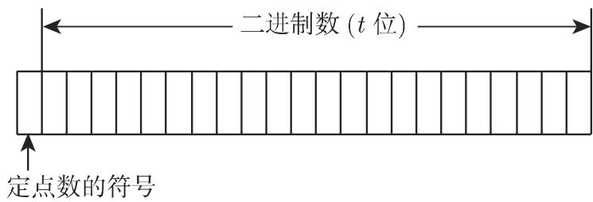
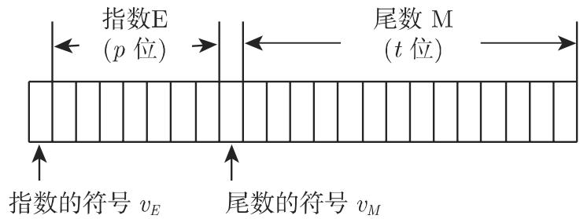
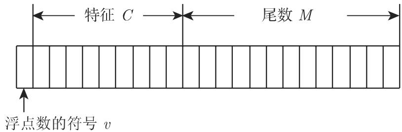

#### 19.8.1 内符号表示

计算机是用符号工作的机器．解释和处理这些符号由软件确定和控制．外符号、字母、密码和特殊符号由内部的二进制代码按照存储单元序列的形式代表．一个取的存储单元（二进制数字）是最小的可代表信息的单元．八个存储单元构成下一个单位，即字节．一个字节，可区分 $2 ^ { 8 }$ 种存储单元组合，故可确定 256符号．这样的指定称为代码有不同的代码，最普及的是 ASCII （美国信息交换标准码）．

19.8.1.1 数制

1. 表示律

数在计算机里表示为一列连续字节．内表示的基础是二进制，这是类似千十进制的多元数制

多元数制的表示律为

$$
a = \sum_ {i = - m} ^ {n} z _ {i} B ^ {i} \quad \left(m > 0, n \geqslant 0; m, n \text {为整数}\right),\tag{19.259}
$$

其中 为基数， $z _ { i } ( 0 \leqslant z _ { i } < B )$ 为该数制的数码 $i \geqslant 0$ 的位置构成整数，而 $i < 0$ 的位置则为该数的小数部分．

139.8125 的十进制数表示，即 $B = 1 0 .$ ，有形式

$$
1 3 9. 8 1 2 5 = 1 \cdot 1 0 ^ {2} + 3 \cdot 1 0 ^ {1} + 9 \cdot 1 0 ^ {0} + 8 \cdot 1 0 ^ {- 1} + 1 \cdot 1 0 ^ {- 2} + 2 \cdot 1 0 ^ {- 3} + 5 \cdot 1 0 ^ {- 4}.
$$

在表 19.3 中可见计算机里最常出现的数制．

19.3 数制

<table><tr><td>数制</td><td>基数</td><td>数码</td></tr><tr><td>二进制</td><td>2</td><td>0,1</td></tr><tr><td>八进制</td><td>8</td><td>0,1,2,3,4,5,6,7</td></tr><tr><td>十六进制</td><td>16</td><td>0,1,2,3,4,5,6,7,8,9,A,B,C,D,E,F(字母A~F赋值10~15)</td></tr><tr><td>十进制</td><td>10</td><td>0,1,2,3,4,5,6,7,8,9</td></tr></table>

2. 转换

从一个数制到另一个数制的转变称为转换若同时使用不同的数制，为了避免混乱用不同的下标表示基数．

·十进制数 139.8125 的不同表示： $1 3 9 . 8 1 2 5 _ { 1 0 } = 1 0 0 0 1 0 1 1 . 1 1 0 1 _ { 2 } = 2 1 3 . 6 4 _ { 8 } =$ $8 \mathrm { B } . \mathrm { D } _ { 1 6 }$

(1) 二进制数转换为八进制或十六进制数 将二进制数转换为八进制或十六进制数是非常简单的．从二进制小数点出发向左和向右三位或四位构成一组，确定其值这些值就是八进制或十六进制的数字

(2) 十进制数转换为二进制、八进制或十六进制数 将十进制数转换为别的数制对整数部分和分数部分分别应用如下规则：

a) 整数部分 为十进制整数，则对基数为 的数制，构造律 (19.259)

$$
G = \sum_ {i = 0} ^ {n} z _ {i} B ^ {i} \quad (n \geqslant 0).\tag{19.260}
$$

除以 ，则得到整数部分和余数：

$$
{\frac {G}{B}} = \sum_ {i = 1} ^ {n} z _ {i} B ^ {i - 1} + {\frac {z _ {0}}{B}}.\tag{19.261}
$$

这里 $z _ { 0 }$ 的值可为 O,l,···,B 1, 即要求的数的最低位数字．若重复此法求商，便可得进一步的数字

b) 分数部分 是真分数，则将其转换为以 为基数的数的方法为

$$
g B = z _ {- 1} + \sum_ {i = 2} ^ {m} z _ {- i} B ^ {- i + 1},\tag{19.262}
$$

即下一位数字可由乘积 $g B$ 的整数部分得到．用同样的方式可得数值 $z _ { - 2 } , z _ { - 3 } , \cdots .$

：将十进制数 139 转化为二进制数

$$
{ \begin{array}{r l r l} {{1 3 9: 2 = 6 9}} & {{\mathrm{余数}}} & {{1}} & {{(1 = z _ {0})}} \\ {{6 9: 2 = 3 4}} & {{\mathrm{余数}}} & {{1}} & {{(1 = z _ {1})}} \\ {{3 4: 2 = 1 7}} & {{\mathrm{余数}}} & {{0}} & {{(0 = z _ {2})}} \\ {{1 7: 2 = 8}} & {{\mathrm{余数}}} & {{1}} & {{:}} \\ {{8: 2 = 4}} & {{\mathrm{余数}}} & {{0}} & {{:}} \\ {{4: 2 = 2}} & {{\mathrm{余数}}} & {{0}} & {{:}} \\ {{2: 2 = 1}} & {{\mathrm{余数}}} & {{0}} & {{:}} \\ {{1: 2 = 0}} & {{\mathrm{余数}}} & {{1}} & {{(1 = z _ {7})}} \end{array} }
$$

：将小数 0.8125 转化为二进制数

$$
\begin{array}{r l r} & 0. 8 1 2 5 \cdot 2 = 1. 6 2 5 & (1 = z _ {- 1}) \\ & 0. 6 2 5 \cdot 2 = 1. 2 5 & (1 = z _ {- 2}) \\ & 0. 2 5 \cdot 2 = 0. 5 & (0 = z _ {- 3}) \\ & 0. 5 \cdot 2 = 1. 0 & (1 = z _ {- 4}) \\ & 0. 0 \cdot 2 = 0. 0 \end{array}
$$

$$
0. 8 1 2 5 _ {1 0} = 0. 1 1 0 1 _ {2}
$$

$$
1 3 9 _ {1 0} = 1 0 0 0 1 0 1 1 _ {2}
$$

(3) 二进制、八进制或十六进制数转换为十进制数 二进制、八进制或十六进制数转换为十进制数的算法如下：

$$
a \sum_ {i = - m} ^ {n} z _ {i} B ^ {i} \quad (m > 0, n \geqslant 0; m, n \text {为整数}),\tag{19.263}
$$

其中十进制小数点在 $z _ { 0 }$ 的后边．

转换计算用霍纳法则（参见第 1237 19.1.2.1).

$$
\blacksquare 1 1 1 0 1 _ {2} = 1 \cdot 2 ^ {4} + 1 \cdot 2 ^ {3} + 1 \cdot 2 ^ {2} + 0 \cdot 2 ^ {1} + 1 = 2 9. \quad \begin{array}{c c c c c} & 1 & 1 & 1 & 0 & 1 \\ 2 & & 2 & 6 & 1 4 & 2 8 \\ \hline & 1 & 3 & 7 & 1 4 & \framebox {2 9} \end{array}
$$

相应的霍纳格式见右边

19.8.1.2 内部数宇表示 INR

二进制数在计算机里用一个或多个字节表示．区别两种表示形式，即定点数和浮点数第一种情况小数点在一个固定的位置；第二种情况，它随着指数的改变而浮动

1. 定点数

带给定参数的定点数的范围为

$$
0 \leqslant | a | \leqslant 2 ^ {t} - 1,\tag{19.264}
$$

定点数可用图 19.15 的形式表示．

  
19.15

2. 浮点数

基本上用两种不同的形式表示浮点数，其内部完成可以详细改变．

(1) 正规化半对数形式 在第一种形式中，数 $a$ 的指数 和尾数 的符号是分别存储的

$$
a = \pm M B ^ {\pm E},\tag{19.265a}
$$

这里选取指数 使得尾数

$$
1 / B \leqslant M <   1\tag{19.265b}
$$

成立这称为正规化半对数形式（图 19.16).

  
19.16

带给定参数的浮点数的绝对值范围是

$$
2 ^ {- 2 ^ {p}} \leqslant | a | \leqslant (1 - 2 ^ {- t}) \cdot 2 ^ {(2 ^ {p} - 1)}.\tag{19.266}
$$

(2) IEEE 标准 浮点数的第二个（目前使用的）形式相应千 1985 年通过的

IEEE 标准．它处理计算机算术、舍入行为、算术运算、数的转换、比较运算和处理如上溢和下溢的特殊情况等要求

浮点数表示见图 19.17.

  
19.17

特征 来自指数 加上适当的常数 K. 这样的选取使得特征只是正数，可表示的数为

$$
a = (- 1) ^ {v} \cdot 2 ^ {E} \cdot 1. b _ {1} b _ {2} \dots b _ {t - 1}, \text {其中} E = C - K.\tag{19.267}
$$

因为保存 $C = 0 , C = 2 5 5$ 这里 $C _ { \mathrm { m i n } } = 1 , C _ { \mathrm { m a x } } = 2 5 6$

该标准给出两个基本的表示形式（单精度和双精度浮点数），但也有其他的表示形式表 19.4 包含了基本形式的参数

19.4 基本形式的参数

<table><tr><td>参数</td><td>单精度</td><td>双精度</td></tr><tr><td>存储单元字长</td><td>32</td><td>64</td></tr><tr><td>最大指数  $E_{\text{max}}$ </td><td>+127</td><td>+1023</td></tr><tr><td>最小指数  $E_{\text{min}}$ </td><td>-126</td><td>-1022</td></tr><tr><td>常数  $K$ </td><td>+127</td><td>+1023</td></tr><tr><td>指数位数</td><td>8</td><td>11</td></tr><tr><td>尾数位数</td><td>24</td><td>53</td></tr></table>
