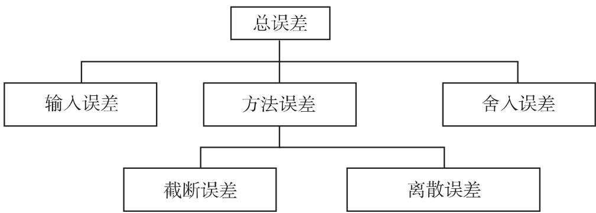

#### 19.8.2 计算机计算中的数值问题

19.8.2.1 引言、误差类型

计算机计算的一般性质与手工计算基本相同然而某些方面需要特别注意，因为精度来自数的表示和关千计算机误差的判断．更进一步，计算机要比人类手工能做的实施多得多的计算步骤．

因此，存在如何影响和控制误差的问题，例如在数学上等价的方法中选用最适当的数值方法

在后面的讨论中用到如下符号，其中 表示在大多情况下未知的量的准确值，

元表示 $x$ 的近似值：

$$
\text { 绝对误差 } \left| \Delta x \right| = \left| x - \tilde {x} \right|.\tag{19.268}
$$

$$
\text {相对误差} \left| {\frac {\Delta x}{x}} \right| = \left| {\frac {x - {\tilde {x}}}{x}} \right|.\tag{19.269}
$$

记号

$$
\varepsilon \left(x\right) = x - \tilde {x} \quad {\text {和}} \quad \varepsilon_ {\mathrm{rel}} \left(x\right) = \frac {x - \tilde {x}}{x}\tag{19.270}
$$

也经常用到

19.8.2.2 规范化十进制数和舍入

1. 规范化十进制数

每个实数 $x \neq 0$ 可表示为形如

$$
x = \pm 0. b _ {1} b _ {2} \cdot \cdot \cdot 1 0 ^ {E} \quad (b _ {1} \neq 0)\tag{19.271}
$$

的十进制数这里由数字 $b _ { i } \in \{ 0 , 1 , 2 , \cdot \cdot \cdot , 9 \}$ 构成的 $0 . b _ { 1 } b _ { 2 } \cdots$ .称为尾数．数整数是所谓关千基 10 的指数因为 $b _ { 1 } \neq 0 ,$ , (19.271) 称为正规十进制数

因为真实的计算机只能处理有限多的字节，故必须限制尾数数字的固定数目和指数 的固定范围．故形如 (19.271) 的数根据舍入（在实际计算中常用）得到

$$
\tilde {x} = \left\{ \begin{array}{l l} {{\pm 0. b _ {1} b _ {2} \cdot \cdot \cdot b _ {t} \cdot 1 0 ^ {E},}} & {{b _ {t + 1} <   5 (\mathrm{舍}),}} \\ {{\pm (0. b _ {1} b _ {2} \cdot \cdot \cdot b _ {t} + 1 0 ^ {- t}) 1 0 ^ {E},}} & {{b _ {t + 1} \geqslant 5 (\mathrm{入}),}} \end{array} \right.\tag{19.272}
$$

由舍入引起的绝对误差为

$$
| \Delta x | = | x - \tilde {x} | \leqslant 0. 5 \cdot 1 0 ^ {- t} 1 0 ^ {E}.\tag{19.273}
$$

2. 基本运算和数值计算

每个数值过程都是一系列基本运算．特别用有限位浮点表示提出问题．这里给出简要综述设 $y$ 是非零的同号规范化无误差浮点数：

$$
x = m _ {1} B ^ {E _ {1}}, \qquad y = m _ {2} B ^ {E _ {2}}\tag{19.274a}
$$

$$
m _ {i} = \sum_ {k = 1} ^ {t} a _ {- k} ^ {(i)} B ^ {- k}, \quad a _ {- 1} ^ {(i)} \neq 0,\tag{19.274b}
$$

$$
a _ {- k} ^ {(i)} = 0 \text {或} 1 \text {或} \dots \text {或} B - 1, \quad k > 1 \quad (i = 1, 2).\tag{19.274c}
$$

(1) 加法 若 $E _ { 1 } > E _ { 2 }$ 因为正规化仅允许左移，则公共指数变为 $E _ { 1 }$ . 随后尾数相加

若

$$
B ^ {- 1} \leqslant \left| m _ {1} + m _ {2} B ^ {- (E _ {1} - E _ {2})} \right| <   2\tag{19.275a}
$$

和

$$
\left| m _ {1} + m _ {2} B ^ {- (E _ {1} - E _ {2})} \right| \geqslant 1,\tag{19.275b}
$$

则将十进制小数点向左移一位而指数增加 1.

$$
0. 9 6 0 4 \cdot 1 0 ^ {3} + 0. 5 8 7 3 \cdot 1 0 ^ {2} = 0. 9 6 0 4 \cdot 1 0 ^ {3} + 0. 0 5 8 7 3 \cdot 1 0 ^ {3} = 1. 0 1 9 1 3 \cdot 1 0 ^ {3} = 0. 1 0 1 9 \cdot 1 0 ^ {4}.
$$

(2) 减法 如同在加法的情况均衡指数，随后尾数相减若

$$
\left| m _ {1} - m _ {2} B ^ {- \left(E _ {1} - E ^ {2}\right)} \right| <   1 - B ^ {- t},\tag{19.276a}
$$

以及

$$
\left| m _ {1} - m _ {2} B ^ {- (E _ {1} - E ^ {2})} \right| <   B ^ {- t},\tag{19.276b}
$$

则将十进制小数点右移 的最大值位，而指数相应减少．

$$
0. 1 0 0 4 \cdot 1 0 ^ {3} - 0. 9 9 8 8 \cdot 1 0 ^ {2} = 0. 1 0 0 4 \cdot 1 0 ^ {3} - 0. 0 9 9 8 8 \cdot 1 0 ^ {3} = 0. 0 0 0 5 2 \cdot 1 0 ^ {3} = 0. 5 2 0 0 \cdot 1 0 ^ {0}.
$$

此例显示了减法的临界情况．因为位数有限（这里是 4)，从右边引进零代替准确字符

(3) 乘法指数相加而尾数相乘，若

$$
m _ {1} m _ {2} <   B ^ {- 1},\tag{19.277}
$$

则十进制小数点向右移一位，且指数减少 1.

$$
■ \left(0. 1 0 0 4 \cdot 1 0 ^ {3}\right) \cdot \left(0. 2 5 0 4 \cdot 1 0 ^ {5}\right) = 0. 0 7 9 5 2 7 0 4 \cdot 1 0 ^ {8} = 0. 7 9 5 3 \cdot 1 0 ^ {7}.
$$

(4) 除法指数相减而尾数相除．若

$$
\frac {m _ {1}}{m _ {2}} \geqslant 1\tag{19.278}
$$

则十进制小数点向左移一位，且指数增加 1.

$$
■ \left(0. 3 1 7 6 \cdot 1 0 ^ {3}\right) / \left(0. 2 5 0 4 \cdot 1 0 ^ {5}\right) = 1. 2 6 8 3 7 0 6 \cdot 1 0 ^ {- 2} = 0. 1 2 6 8 \cdot 1 0 ^ {- 1}.
$$

(5) 结果的误差 在假定无误差项的四种基本运算中，结果的误差是舍入误差．对千位置为 基为 的数，相对误差的上限为

$$
\frac {B}{2} B ^ {- t}.\tag{19.279}
$$

(6) 减法相消 如上所述，儿乎相等的浮点数的减法是临界运算．若有可能，应通过改变运算阶或利用某种等式来避免这种情况．

$$
\begin{array}{r l} & {\text {■} x = \sqrt {1 9 8 5} - \sqrt {1 9 8 4} = 0. 4 4 5 5 \cdot 1 0 ^ {2} - 0. 4 4 5 4 \cdot 1 0 ^ {2} = 0. 1 \cdot 1 0 ^ {- 1} \text {或}} \\ & {x = \sqrt {1 9 8 5} - \sqrt {1 9 8 4} = \frac {1 9 8 5 - 1 9 8 4}{\sqrt {1 9 8 5} + \sqrt {1 9 8 4}} = 0. 1 1 2 2 \cdot 1 0 ^ {- 1}.} \end{array}
$$

19.8.2.3 数值计算的精度

1. 误差类型

数值方法有误差．有儿类误差最后结果的总误差正是由这些误差积累的（图 19.18).

  
19.18

2. 输入误差

(1) 输入误差的概念 输入误差是由不准确的输入数据产生的误差．输入数据的轻微不准确称为扰动．确定输入数据误差称为误差计算的直接问题．其反问题如下：输入数据可有多大的误差能够保证最终的输入误差不超过可以接受的允许值．在相当复杂的问题里估计输入误差是非常困难且通常几乎是不可能的．一般对实值函数 $y = f \left( { \underline { { \pmb { x } } } } \right) , { \underline { { \pmb { x } } } } = \left( x _ { 1 } , x _ { 2 } , \cdots , x _ { n } \right) ^ { \mathrm { T } }$ ，若对 $y = f ( \underline { { { \pmb { x } } } } ) = f \left( x _ { 1 } , x _ { 2 } , \cdot \cdot \cdot , x _ { n } \right)$ 应用带线性余项的泰勒公式（参见第 630 7.3.3.3)， $\xi _ { 1 } , \xi _ { 2 } , \cdots , \xi _ { n }$ ＆表示中间值，$\tilde { x } _ { 1 } , \tilde { x } _ { 2 } , \cdots , \tilde { x } _ { n }$ 玩表示 $x _ { 1 } , x _ { 2 } , \cdots , x _ { n }$ 的近似值，则输入误差的绝对值为

$$
\begin{array}{l} | \Delta y | = | f (x _ {1}, x _ {2}, \dots , x _ {n}) - f (\tilde {x} _ {1}, \tilde {x} _ {2}, \dots , \tilde {x} _ {n}) | \\ \qquad = \left| \sum_ {i = 1} ^ {n} \frac {\partial f}{\partial x _ {i}} (\xi_ {1}, \xi_ {2}, \dots , \xi_ {n}) (x _ {i} - \tilde {x} _ {i}) \right| \\ \qquad \leqslant \sum_ {i = 1} ^ {n} \left(\max _ {x} \left| \frac {\partial f}{\partial x _ {i}} (\underline {{\boldsymbol {x}}}) \right|\right) | \Delta x _ {i} |, \end{array}\tag{19.280}
$$

近似值是扰动了的输入数据．这里也考虑高斯误差传播定律（参见第 1114 16.4.2.1).

(2) 简单算术运算的输入误差 已知简单算术运算的输入误差．对四种基本运算用 (19.268),..-..,(19.270) 的记号：

$$
\varepsilon (x \pm y) = \varepsilon (x) \pm \varepsilon (y),\tag{19.281}
$$

$$
\varepsilon (x y) = y \varepsilon (x) + x \varepsilon (y) + \varepsilon (x) \varepsilon (y),\tag{19.282}
$$

$$
\varepsilon \left({\frac {x}{y}}\right) = {\frac {1}{y}} \varepsilon \left(x\right) - {\frac {x}{y ^ {2}}} \varepsilon \left(y\right) + \varepsilon \mathrm{的高阶项},\tag{19.283}
$$

$$
\varepsilon_ {\mathrm{rel}} (x \pm y) = \frac {\varepsilon_ {\mathrm{rel}} (x) \pm \varepsilon_ {\mathrm{rel}} (y)}{x \pm y},\tag{19.284}
$$

$$
\varepsilon_ {\mathrm{rel}} (x y) = \varepsilon_ {\mathrm{rel}} (x) + \varepsilon_ {\mathrm{rel}} (y) + \varepsilon_ {\mathrm{rel}} (x) \varepsilon_ {\mathrm{rel}} (y),\tag{19.285}
$$

$$
\varepsilon_ {\mathrm{rel}} \left({\frac {x}{y}}\right) = \varepsilon_ {\mathrm{rel}} \left(x\right) + \varepsilon_ {\mathrm{rel}} \left(y\right) + \varepsilon \text {的高阶项}.\tag{19.286}
$$

公式表明：对千乘法和除法，输入数据的相对误差小，导致结果的相对误差也小．对千加法和减法若 $| x \pm y | \ll | x | + | y |$ ，相对误差可能非常大．

3. 方法的误差

(1) 方法误差的记号 方法误差源千理论上连续的现象作为极限以不同的方式被数值逼近的事实因此，在极限过程中有截断误差（例如在迭代法中）及在用有限离散系（例如数值积分）逼近连续现象时的离散误差．方法误差与输入和舍入误差无关因此，仅在关系到应用解法的方法论时研究方法误差

(2) 应用迭代法 若使用迭代法，可能出现两种情况：得到问题的正确解或错误解也可能尽管有解但不能用迭代法得到

为使迭代法更清晰安全，应考虑如下建议：

a) 为避免“无穷迭代”，若步数超过预定值即停止过程（即尚未达到要求的精度便停止）．

b) 应在屏幕上以数值或者图表的形式跟踪中间结果的位置．

c) 应该用到解的所有已知性质如梯度、单调性等．

d) 应研究变量和函数计量的可能性

e) 应通过改变步长、截断条件、初始值等进行多种试验．

4. 舍入误差

产生舍入误差是因为中间结果被舍入．这对按精度要求判断数学方法时有本质的重要性舍入误差与输入误差和方法误差一起决定给定的方法是强稳定、弱稳定或不稳定若总误差随着步数增加分别减少、有相同的阶或增加便发生强稳定、弱稳定或不稳定．

在不稳定性方面我们区别舍入误差和离散误差（数值不稳定）以及理论上准确的计算中初始数据误差（自然不稳定）的灵敏度．若数值不稳定不大千自然不稳定，则计算过程是合适的．

对千舍入误差的局部误差传播，即从一个计算步到下一步的误差传递，可使用在输入误差中用过的同样的估计过程．

．数值计算的例子

上述某些问题用数值例子来说明

■ A: 二次方程的根 带实系数 a,b,c 的二次方程 $a x ^ { 2 } + b x + c = 0 , \ D \ =$ $b ^ { 2 } - 4 a c \geqslant 0$ （实根）．临界状态为

a) $| 4 a c | \ll b ^ { 2 }$ 和 b) $4 a c \approx b ^ { 2 }$ ．推荐程序：

i) $x _ { 1 } = - \frac { b + \mathrm { s i g n } \left( b \right) \sqrt { D } } { 2 a }$ $x _ { 2 } = { \frac { c } { a x _ { 1 } } }$ （韦达根定理参见第 56 1.6.3.1, 3.).

ii) 用直接法难免把 化零．因为 $\left| b \right| \gg \sqrt { D }$ 成立，将发生减法抵消除非$\left( b + \mathrm { s i g n } \left( b { \sqrt { D } } \right) \right)$ 中误差不是太大．

■ $\mathbf { B } \colon h \leqslant r$ 的薄锥壳的体积 因为 $( r + h ) \approx r , V = 4 \pi \frac { ( r + h ) ^ { 3 } - r ^ { 3 } } { 3 }$ 存在减法消去的情况．而在等式 $V = 4 \pi \frac { 3 r ^ { 2 } h + 3 r h ^ { 2 } + h ^ { 3 } } { 3 }$ 中则没有这个问题．

C: 求和 $S = \sum _ { k = 1 } ^ { \infty } { \frac { 1 } { k ^ { 2 } + 1 } } \left( S = 1 . 0 7 6 6 7 \cdots \right)$ )要求有三位有效数字的精度．用位数字进行计算，大约需要加 6000 项在作恒等变换 ${ \frac { 1 } { k ^ { 2 } + 1 } } = { \frac { 1 } { k ^ { 2 } } } - { \frac { 1 } { k ^ { 2 } \left( k ^ { 2 } + 1 \right) } }$ 后，成立

$$
S = \sum_ {k = 1} ^ {\infty} {\frac {1}{k ^ {2}}} - \sum_ {k = 1} ^ {\infty} {\frac {1}{k ^ {2} (k ^ {2} + 1)}} \quad {\text {及}} \quad S = {\frac {\pi^ {2}}{6}} - \sum_ {k = 1} ^ {\infty} {\frac {1}{k ^ {2} (k ^ {2} + 1)}}.
$$

通过这一变换后，则只需考虑

避免 $\frac { \mathbf { 0 } } { \mathbf { 0 } }$ 的状态当 $x = y = 0$ 时，函数 $z = \left( 1 - { \sqrt { 1 + x ^ { 2 } + y ^ { 2 } } } \right) { \frac { x ^ { 2 } - y ^ { 2 } } { x ^ { 2 } + y ^ { 2 } } }$ 分子和分母同时乘以 $\left( 1 + { \sqrt { 1 + x ^ { 2 } + y ^ { 2 } } } \right)$ 即可避免这一状态．

：不稳定递推过程的例子 若满足条件 $\left| { \frac { a } { 2 } } \pm { \sqrt { { \frac { a ^ { 2 } } { 4 } } + b } } \right| < 1$ ，则一般形式的算法 $y _ { n + 1 } = a y _ { n } + b y _ { n - 1 } ( n = 1 , 2 , \cdot \cdot \cdot )$ 是稳定的．特殊情况 $y _ { n + 1 } = - 3 y _ { n } +$ $4 y _ { n - 1 } \left( n = 1 , 2 , \cdot \cdot \cdot \right)$ ．)是不稳定的．若 $y _ { 0 }$ 和 $y _ { 1 }$ 有误差 $\varepsilon$ 和 $- \varepsilon$ , 则对 $y _ { 2 } , y _ { 3 } , y _ { 4 } , y _ { 5 }$ 2$y _ { 6 } , \cdot \cdot \cdot$ 误差为 $7 \varepsilon , - 2 5 \varepsilon , 1 0 3 \varepsilon , - 4 0 9 \varepsilon , 1 6 3 9 \varepsilon , \cdot \cdot \cdot$ ·，该过程对千参数 $a = - 3$ 与 $b = 4$ 是不稳定的．

：微分方程的数值求积 数值求解一阶常微分方程

$$
y ^ {\prime} = f (x, y), \quad \text {其中} f (x, y) = a y,\tag{19.287}
$$

其初值用 $y \left( x _ { 0 } \right) = y _ { 0 }$ 表示．

a) 天然不稳定 准确解 $y \left( x \right)$ 有准确初值 $y \left( x _ { 0 } \right) = y _ { 0 }$ , $u \left( x \right)$ 为扰动初值的解不失一般性，设扰动解形如：

$$
u (x) = y (x) + \varepsilon \eta (x),\tag{19.288a}
$$

其中 $\varepsilon \left( 0 < \varepsilon < 1 \right)$ 为参数，而 $\eta \left( x \right)$ 是所谓扰动函数．考虑 $u ^ { \prime } \left( x \right) = f \left( x , u \right)$ 从泰勒展开式得到（参见第 630 7.3.3.3)

$$
u ^ {\prime} (x) = f (x, y (x) + \varepsilon \eta (x)) = f (x, y) + \varepsilon \eta (x) f _ {y} (x, y) + \text {高阶项}.\tag{19.288b}
$$

这意味着微分变差方程

$$
\eta^ {\prime} (x) = f _ {y} (x, y) \eta (x).\tag{19.288c}
$$

由 $f \left( x , y \right) = a y$ 问题的解为

$$
\eta \left(x\right) = \eta_ {0} \mathrm{e} ^ {a \left(x - x _ {0}\right)}, \quad \text {其中} \eta_ {0} = \eta \left(x _ {0}\right).\tag{19.288d}
$$

对 $a > 0$ 即便是小的初始扰动 $\eta _ { 0 }$ 也导致无限增长的扰动 $\eta \left( x \right)$ ．故为天然不稳定．

b) 梯形公式的误差研究 $a = - 1$ 时，稳定的微分方程 $y ^ { \prime } \left( x \right) = - y \left( x \right)$ 有准确解

$$
y \left(x\right) = y _ {0} \mathrm{e} ^ {a \left(x - x _ {0}\right)}, \quad \text {其中} y _ {0} = y \left(x _ {0}\right).\tag{19.289a}
$$

梯形公式为

$$
\int_ {x _ {i}} ^ {x _ {i + 1}} y (x) \mathrm{d} x \approx {\frac {y _ {i} + y _ {i + 1}}{2}} h, \quad \text {其中} h = x _ {i + 1} - x _ {i}.\tag{19.289b}
$$

对给定微分方程用上述公式，成立

$$
\begin{array}{c} \tilde {y} _ {i + 1} = \tilde {y} _ {i} + \int_ {x _ {i}} ^ {x _ {i + 1}} (- y) \mathrm{d} x = \tilde {y} _ {i} - \frac {\tilde {y} _ {i} + \tilde {y} _ {i + 1}}{2} h, \quad \tilde {y} _ {i + 1} = \frac {2 - h}{2 + h} \tilde {y} _ {i}, \\ \tilde {y} _ {i} = \left(\frac {2 - h}{2 + h}\right) ^ {i} \tilde {y} _ {0}, \end{array}\tag{19.289c}
$$

其中 $x _ { i } = x _ { 0 } + i h$ ，即对 $0 \leqslant h < 2$ 有 $i = \left( x _ { i } - x _ { 0 } \right) / h$ , 得到

$$
\begin{array}{l} \tilde {y} _ {i} = \left(\frac {2 - h}{2 + h}\right) ^ {(x _ {i} - x _ {0}) / h} \tilde {y} _ {0} = \tilde {y} _ {0} \mathrm{e} ^ {c (h) (x _ {i} - x _ {0})}, \\ c (h) = \frac {\ln \left(\frac {2 - h}{2 + h}\right)}{h} = - 1 - \frac {h ^ {2}}{1 2} - \frac {h ^ {4}}{8 0} - \dots . \end{array}\tag{19.289d}
$$

若 $\tilde { y } _ { 0 } = y _ { 0 }$ ，则 $\tilde { y } _ { i } < y _ { i }$ ，且对 $h  0 , \tilde { y } _ { i }$ 也趋向千准确解 $y _ { 0 } \mathrm { e } ^ { - ( x _ { i } - x _ { 0 } ) }$

c) b) 中的输入误差 设准确和近似的初值相同现研究当 $\tilde { y } _ { 0 } ~ \ne ~ y _ { 0 }$ 及$\left| \tilde { y } _ { 0 } - y _ { 0 } \right| < \varepsilon _ { 0 }$ 。时的性态．

因为 $( \tilde { y } _ { i + 1 } - y _ { i + 1 } ) \leqslant \frac { 2 - h } { 2 + h } \left( \tilde { y } _ { i } - y _ { i } \right)$ ，有

$$
\left(\tilde {y} _ {i + 1} - y _ {i + 1}\right) \leqslant \left(\frac {2 - h}{2 + h}\right) ^ {i + 1} \left(\tilde {y} _ {0} - y _ {0}\right),\tag{19.290a}
$$

故 $\varepsilon _ { i + 1 }$ 最多和 $\varepsilon _ { 0 }$ 。同阶，且该方法关千初值是稳定的应该提到在用辛普森方法求解上述微分方程时引进了人为的不稳定．此时，对 $h \longrightarrow 0 ,$ 得到通解如：

$$
\tilde {y} _ {i} = C _ {1} \mathrm{e} ^ {- x _ {i}} + C _ {2} (- 1) ^ {i} \mathrm{e} ^ {x _ {i} / 3}.\tag{19.290b}
$$

问题是该数值解法使用了比相应的微分方程的阶更高阶的差分．
