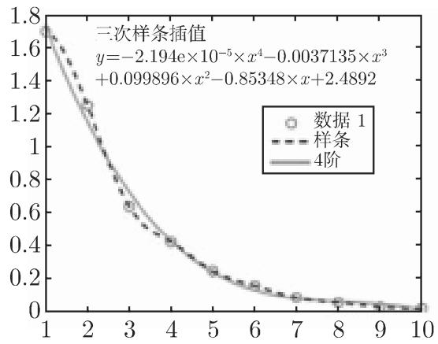
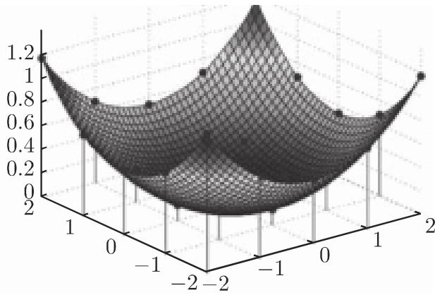
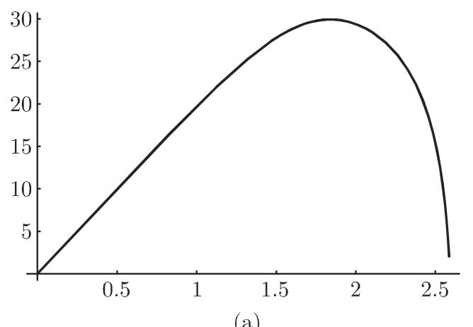
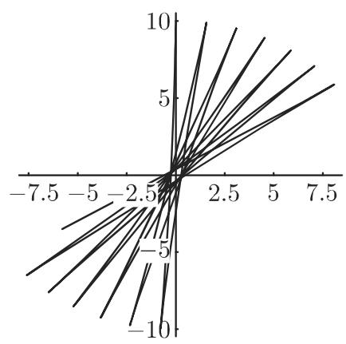

#### 19.8.4 交互程序系统和计算机代数系统的应用

19.8.4.1 Matlab

商用程序系统 Matlab （矩阵实验室）是一个数学求解公式问题的交互环境，同时也是科学技术计算的高级原本语言．优先设置线性代数的问题和算法． Matlab方便地将实现数值程序及数据和结果的先进的图形表示统一起来．根据 IEEE 标准（表 19.4) 计算大多以双精度浮点数运行．能与 Matlab 兼容的进一步的选择是可免费下载的 Scilab Octave 系统

1. 函数概述

下面是 Matlab 中程序和函数的简要概述

Allgemeine mathematische Funktionen

1. Trigonometrie

5. Koordinatentransformationen

2. Exponentialfunktion, Logarithmen

6. Rundung und gebrochener Teil

3. Spezielle Funktionen

7. Diskrete Mathematik

4. Komplexe Arithmetik

8. Mathematische Konstanten

N umerische lineare Alge bra

1. Manipulation von Feldern und Matrizen

5. Eigenwerte und Singularwerte

2. Spezielle Matrizen

6. Matrix-Faktorisierungen

3. Matrix-Analysis (Normen, Kondition)

7. Matrixfunktionen

4. Lineare G leichungssysteme

8. Verfahren fiir diinn besetzte Matrizen

N umerische Verfahren

1. Berechnung statistischer Daten

2. Korrelation und Regression

3. Diskrete Fouriertransformation

4. Polynome und Splines

5. Ein- und mehrdimensionale Interpolation

6. Triangulationen und Zerlegungen

7. Ermittlung der konvexen Hiille

8. Numerische Integration

9. Gewohnliche Differentialgleichungen

10. Partielle Differentialgleichungen

11. Nichtlineare Gleichungen

12. Minimierung von Funktionen

此外， Matlab 有许多用来求解不同类型的特殊数学问题的程序包，即所谓工具箱作为某些例子，这里提到曲线拟合、滤波器、商业数学、时间序列分析、信号和模式处理、神经网络、优化、偏微分方程、样条、统计和小波．

在下面的段落中，以简单的例子来说明 Matlab 的应用．在后面 MathematicaMaple 的数值应用中，将同样讨论这些问题

2. 数值线性代数

在开启 Matlab 命令提示符" $^ { 6 6 } > > ^ { 5 }$ ”后，命令窗口显示等待接受命令若命令不以分号”;“结束，则在命令窗口出现结果求解线性方程组 $A { \underline { { x } } } = { \underline { { b } } }$ 的基本命令（参见第 1242 19.2.1) 是反斜杠算符”\“.

·给定矩阵 $\begin{array} { r } { A = \left( \begin{array} { l l l } { 1 } & { 0 } & { 3 } \\ { 2 } & { 1 } & { 1 } \\ { 1 } & { 2 } & { 3 } \end{array} \right) } \end{array}$ 和向量 $\underline { { \boldsymbol { b } } } = ( - 2 , ~ 3 , ~ 2 ) ^ { \mathrm { T } }$ 输入

>> $\mathtt { A } = [ 1 \ 0 \ 3 ; 2 \ 1 \ 1 ; 1 \ 2 \ 3 ]$ $\boldsymbol { \mathsf { b } } = [ - 2 ; 3 ; 2 ]$ , x = A\b, norm(A \* x —b) 输出为

$$
\begin{array}{r l r l r l r l} & 1 & 0 & 3 & - 2 & 1. 0 0 0 0 \\ \mathsf {A} = & 2 & 1 & 1 & \mathsf {b} = & 3 & \mathbf {x} = & 2. 0 0 0 0 & \mathrm{ans} = 8. 8 8 1 8 \mathrm{e} - 0 1 6 \\ & 1 & 2 & 3 & 2 & - 1. 0 0 0 0 \end{array}
$$

残量的欧儿里得范数表明，得到的解（并未显示所有的数字）以允许的计算机浮点数表示的精度满足方程组

若矩阵 是非奇异的方阵，则线性方程组有唯一解．由反斜杠算符" $ \langle 6   2$ "用通常的列主元高斯消元法，得三角分解 $P A = L A$ （参见第 1242 19.2.1.1).

·矩阵 的三角分解也可由输入

$$
> > [ L, R, P ] = 1 u (A)
$$

实现得到输出

$$
\begin{array}{l} \mathrm{L} = \left( \begin{array}{c c c} 1. 0 0 0 0 & 0 & 0 \\ 0. 5 0 0 0 & 1. 0 0 0 0 & 0 \\ 0. 5 0 0 0 & - 0. 3 3 3 3 & 1. 0 0 0 0 \end{array} \right), \quad \mathrm{R} = \left( \begin{array}{c c c} 2. 0 0 0 0 & 1. 0 0 0 0 & 1. 0 0 0 0 \\ 0 & 1. 5 0 0 0 & 2. 5 0 0 0 \\ 0 & 0 & 3. 3 3 3 3 \end{array} \right), \\ \mathrm{P} = \left( \begin{array}{c c c} 0 & 1 & 0 \\ 0 & 0 & 1 \\ 1 & 0 & 0 \end{array} \right) \end{array}
$$

（这里为了避免混乱用括号表示矩阵）．

反斜杠算符首先测试系数矩阵 的性质，若 是一个三角矩阵排列则求解相应的梯队形式若是对称矩阵 A, 则应用楚列斯基方法（参见第 1245 19.2.1.2).

若系数矩阵 的条件数太大，则求解时可能产生数值问题．因此在 Matlab行期间估计条件数的倒数值，若此数过小，给出警告提示

■ $n = 1 3$ 阶的希尔伯特矩阵可作为例子，其中 $h _ { i k } = 1 / \left( i + k - 1 \right)$

$$
\begin{array}{l} \text { >>   x = hilb(13)\ \ ones(13,1); } \\ \text { Warning: Matrix is close to singular or badly scaled. } \\ \text { Results may be inaccurate. RCOND = 2.409320e - 017. } \end{array}
$$

在超定线性方程组的情况下，相应的线性拟合问题由正交化过程处理即由正交变换得到 $Q R$ 分解

$$
A = Q R
$$

（参见第 1246 19.2.1.3).

$$
\begin{array}{r l} \blacksquare & \gg A = [ 1 0 3; 2 1 1; 1 2 3; 1 1 - 1 ]; \quad b = [ - 2; 3; 2; 1 ]; \quad x = A \backslash b, \\ & \text {norm} (A * x - b) \\ & \qquad 0. 4 6 7 3 \\ & x = \quad 1. 4 3 9 3 \quad \text {ans} = 2. 0 5 0 8 \\ & \qquad - 0. 4 9 5 3 \\ & \gg [ Q, R ] = q r (A) \\ & Q = \left( \begin{array}{c c c c} - 0. 3 7 8 0 & - 0. 4 5 8 3 & 0. 6 4 6 6 & 0. 4 7 8 5 \\ - 0. 7 5 5 9 & - 0. 2 7 5 0 & - 0. 2 3 2 1 & - 0. 5 4 6 9 \\ - 0. 3 7 8 0 & 0. 8 2 5 0 & 0. 4 1 4 5 & - 0. 0 6 8 4 \\ - 0. 3 7 8 0 & 0. 1 8 3 3 & - 0. 5 9 6 9 & 0. 6 8 3 6 \end{array} \right), \end{array}
$$

$$
\mathrm{R} = \left( \begin{array}{c c c} - 2. 6 4 5 8 & - 1. 8 8 9 8 & - 2. 6 4 5 8 \\ 0 & 1. 5 5 8 4 & 0. 6 4 1 7 \\ 0 & 0 & 3. 5 4 8 0 \\ 0 & 0 & 0 \end{array} \right)
$$

反斜杠算符也对欠定和缺秩的线性方程组给出了有意义的结果如何处理大型稀疏矩阵的方法的详细介绍可见相应的 Matlab 文件和说明 [19.15],[19.30].

3. 方程的数值求解

Matlab 中用行向量 $( a _ { n } , a _ { n - 1 } , \cdots , a _ { 1 } , a _ { 0 } )$ 表示多项式

$$
p (x) = a _ {n} x ^ {n} + a _ {n - 1} x ^ {n - 1} + \dots + a _ {1} x + a _ {0}
$$

的系数．有多个函数可用来处理多项式．

·作为例子，确定多项式 $p \left( x \right) = x ^ { 6 } + 3 x ^ { 2 } - 5$ 处的值、导数（即导数多项式的 系数向量）及根

```txt
>> p = [1 0 0 0 3 0 -5];
>> polyval(p,1) ans = -1
>> polyder(p) ans = 6 0 0 0 6 0
>> roots(p) ans = 0.8673 + 1.1529i, 0.8673 - 1.1529i, 1.0743,
-0.8673 + 1.1529i, -0.8673 - 1.1529i, -1.0743
```

根作为相应伴随矩阵的特征值被确定命令 £zero 用来求非线性标量方程的近似解

·计算方程 $\mathrm { e } ^ { - x ^ { 3 } } - 4 x ^ { 2 } = 0$ 的三个解．

```txt
>> fzero(@(x)exp(-x^3) -4*x^2, 1) ans = 0.4741
>> fzero(@(x)exp(-x^3) -4*x^2, 0) ans = -0.5413
>> fzero(@(x)exp(-x^3) -4*x^2, -1) ans = -1.2085
```

在命令 fzero 下输入方程作为未命名的函数．显然它依赖千第二个变量的给定初值，其解是近似的．迭代过程用二分法和试位法的组合完成（参见第 123619.1.1.3).

4. 插值

基千给定数据的函数拟合可以通过插值（参见第 1276 19.6.1) 或最佳函数逼近（参见第 1280 19.6.2.2) 得到在 Matlab 中，命令 plot 是以图形表示数据集合的最简单的方式在自打开图表窗口的菜单中包含编辑图形（线型、符号、标题和说明）的工具，用千输出和打印基本拟合．

基本拟合是工具箱的子程序，提供了多种插值方法和不同阶的最佳逼近多项式．由函数 ”interpl” “polyfit" 来实现．

·根据输入

>> plot ([1. 70045, 1. 2523, 0. 638803, 0. 423479, 0. 249091, 0.160321, 0.0883432, 0.0570776, 0.0302744, 0.0212794]);

数据值被置千数据位置 1,2, · · ·, 10 且用图形表示．图 19.19(a) 展示了相应的三次插值样条和四阶最佳逼近多项式的数据集．

  
(a)

  
19.19  
(b)

函数 interp2 提供在二维矩形网格上给定数据作插值的适当方法（参见第 129519.7.2.1) ．对千非规则分布的数据作插值调用 griddata.

·命令序列

```matlab
>> [X,Y]=meshgrid(-2:1:2); F=4-sqrt(16-X.^2-Y.^2);
>> [Xe,Ye]=meshgrid(-2:0.1:2); S=interp2(X,Y,F,Xe,Ye,'spline');
>> surf(Xe,Ye,S)
>> hold on; stem3(X,Y,F, 'fill')
```

实现了函数 $f \left( x , y \right) ~ = ~ \sqrt { 1 6 - x ^ { 2 } - y ^ { 2 } }$ 在给定网格上的二元三次样条插值．插值样条在较细的矩形网格上求值．图 19.19(b) 描绘了插值函数而且也显示了数据点

．数值积分

Matlab 中程序 quad quadl 可用千数值积分．这两个程序基千自适应选取步长递归应用插值求积． Quad 基千辛普森公式， quadl 应用高阶洛巴托公式（参见第 1253 19.3.2)．在被积函数充分光滑的情况及较高的精度要求下， quadlquad 更有效

·作为第一个例子，考虑近似计算定积分 $I = \int _ { 0 } ^ { 1 } \frac { \sin { x } } { x } \mathrm { d } x$ （正弦积分参见第 6818.2.5,1.).

```txt
>> format long; [I, fwerte] = quad(@(x)(sin(x)./x), 0, 1)
Warning: Divide by zero. > In @(x)(sin(x)./x) In quad at 62
I = 0.94608307007653 fwerte = 14
>> format long; [I, fwerte] = quad1(@(x)(sin(x)./x), 0, 1)
```

```txt
Warning: Divide by zero. > In @(x)(sin(x)./x) In quadl at 64
I = 0.94608307036718 fwerte = 19
```

两个程序显然都认知被积函数在区间左端的不连续性，但得到积分的近似值并无困难．基千同一例子在 1257 19.3.4.2 中的结果，函数求值的数目看来很大，但可自适应递归确定

```txt
>> format long; [I, fwerte] = quad(@(x)(sin(x)./x), 0, 1, 1e-14)
I = 0.94608307036718 fwerte = 258
>> format long; [I, fwerte] = quad1(@(x)(sin(x)./x), 0, 1, 1e-14)
I = 0.94608307036718 fwerte = 19
```

（这里没有重复警告信息）．作为进一步的论证给出确定的精度为 $1 0 ^ { - 1 4 }$ （容忍误差为 $1 0 ^ { - 6 } )$ ，在这一情况下显然可见 quadl 的优越性．

<div class="mineru-algorithm" style="white-space: pre-wrap; font-family:monospace;">
■ 确定定积分  $I=\int_{-1000}^{1000}\mathrm{e}^{-x^{2}}\mathrm{d}x.$ 
&gt;&gt; format long; [I, fwerte] = quad(@(x)(exp(-x.^2)), -1000, 1000, 1e-10)
I = 1.77245385094233 fwerte = 585
&gt;&gt; format long; [I, fwerte] = quad1(@(x)(exp(-x.^2)), -1000, 1000, 1e-10)
I = 1.77245385090571 fwerte = 768
</div>

被积函数在积分区间的非常宽广的部分形状平坦，而在 x=O 处有相当陡峭的峰值，使得 quad 在这一情况下较好

6. 微分方程的数值解

Matlab 提供了许多数值求解一阶常微分方程初值问题的程序标准的程序为ode45, 其中应用带自适应步长选取的 阶和 阶龙格－库塔法（参见第 126019.4.1.2)．为达到高精度，使用预估—校正型线性多步法的程序 ode113 更有效（参见第 1262 19.4.1.4)．此外，还有些程序对刚性微分方程组特别有效（参见第 126419.4.1.5,4.).

·用龙格库塔法（参见第 1260 19.4.1.2) 求解区间 [O, 1] 上的问题 $y ^ { \prime } = { \frac { 1 } { 4 } } ( x ^ { 2 } +$ $y ^ { 2 } ) , y \left( 0 \right) = 0 ,$ 输入：

<div class="mineru-algorithm" style="white-space: pre-wrap; font-family:monospace;">
&gt;&gt; [x,y]=ode45(@ (x,y) ((x. $^{2}$+y. $^{2}$)./4),[0 1],0); plot(x,y)
</div>

得到的解如图 19.20(a) 所示．

·在区间 $0 \leqslant t \leqslant 5 0$ 上求解特殊的洛伦茨方程组（参见第 1153 17.2.4.3)

$$
x _ {1} ^ {\prime} = 1 0 (x _ {2} - x _ {1}), \quad x _ {2} ^ {\prime} = 2 8 x _ {1} - x _ {2} - x _ {1} x _ {3}, \quad x _ {3} ^ {\prime} = x _ {1} x _ {2} - \frac {8}{3} x _ {3}
$$

其初值条件为 $x \left( 0 \right) = \left( 0 , \ 1 , \ 0 \right) ^ { \mathrm { T } }$ . 使用如下命令：

```txt
>> [t, x] = ode45(@(t, x) ([10*(x(2) - x(1)) ;
```

最后的命令给出了在 $x _ { 1 } , x _ { 3 }$ 平面的相图（图 19.20(b)).


  
19.20

19.8.4.2 Mathematica

1. 求解数学问题的工具

计算机代数系统 Mathematica 是能用来求解大量数值数学问题的非常有效的工具． Mathematica 的数学程序完全不同千符号计算根据某些预先给定的原则类似千图像表示的情况 Mathematica 确定所考虑函数的数值表，并利用这些数值确定要求的解因为点数必须是有限的，这可能是一个“坏＇性态函数的问题．尽管Mathematica 在问题区域内试图选取更多的节点我们必须假定在所考虑区域上的某种连续性．这可能在最终的结果中产生误差．建议尽可能使用所考虑问题的许多信息，且若有可能在符号形式下进行计算，即使这仅对子问题有可能

在表 19.5 中，我们介绍了用千数值计算的算子．

19.5 数值运算

<table><tr><td>NIntegrate</td><td>计算定积分</td></tr><tr><td>NSum</td><td>计算和 $\sum_{i=1}^{n} f(i)$ </td></tr><tr><td>NProduct</td><td>计算积</td></tr><tr><td>NSolve</td><td>数值计算求解代数方程</td></tr><tr><td>NDSolve</td><td>数值计算求解微分方程</td></tr></table>

在启动 Mathematica “Prompt" 之后显示 $I n [ l ] : = :$ ；这表示系统准备接受输入． Mathematica out[i] 表示相应的输出．一般在行中五 [n]:＝表示输入，out[n]:＝表示 Mathemetica返回的答案．表达式中的箭头一表示 用值 代替．

2. 曲线拟合与插值

(1) 曲线拟合 Mathematica 可用最小二乘法选取函数拟合数据集（参见第 609

6.2.5)，且平均逼近离散问题（参见第 1280 19.6.2.2)．一般的指令为

$$
\mathbf {F i t} [ \{y _ {1}, y _ {2}, \dots \}, f u n k t, x ]\tag{19.291}
$$

这里数值 $y _ { i }$ 组成数据表， funkt 为用千数据拟合的可选函数表， 表示独立变量的相应区域．若 funkt 选定，例如为 ${ \mathrm { T a b l e } } \left[ x ^ { \wedge } i , \left\{ i , 0 , n \right\} \right]$ ，则是用 $n$ 次多项式进行拟合

·设给定如下数据表：

$$
\begin{array}{c} I n [ 1 ] := l = \{1. 7 0 0 4 5, 1. 2 5 2 3, 0. 6 3 8 8 0 3, 0. 4 2 3 4 7 9, 0. 2 4 9 0 9 1, 0. 1 6 0 3 2 1, 0. 0 8 8 3 4 3 2, \\ \qquad \qquad \qquad \qquad \qquad \qquad \qquad \qquad \qquad \qquad \qquad \qquad \qquad \qquad \qquad \qquad \qquad \qquad \qquad \qquad \qquad \qquad \qquad \qquad \qquad \qquad \qquad \qquad \qquad \qquad \qquad \qquad \qquad \qquad \\ \qquad \qquad \qquad \qquad \qquad \qquad \qquad \qquad \qquad \qquad \qquad \qquad \qquad \qquad \qquad \qquad \qquad \qquad \qquad \qquad \qquad \qquad \qquad \qquad \qquad \qquad \qquad \qquad \qquad \qquad \qquad \qquad \text {and} \\ \hline \text {if}   i _ {n} (i _ {n}) = i _ {n - 1} (i _ {n - 1}), & \\ & \text {if}   i _ {n - 1} (i _ {n - 1}), \\ & \text {if}   i _ {n - 1} (i _ {n - 1}), \\ & \text {if}   i _ {n - 1} (i _ {n - 1}), \\ & \text {if}   i _ {n - 1} (i _ {n - 1}), \\ & \text {if}   i _ {n - 1} (i _ {n - 1}). \\ & \text {if}   i _ {n - 1} (i _ {n - 1}). \\ & \text {if}   i _ {n - 1} (i _ {n - 1}). \\ & \text {if}   i _ {n - 1} (i _ {n - 1}). \\ & \text {if}   i _ {n - 1} (i _ {n - 1}), \\ & \text {if}   i _ {n - 1} (i _ {n - 1}). \\ & \text {if}   i _ {n - 1} (i _ {n - 1}). \\ & \text {if}   i _ {n - 1} (i _ {n - 1}), \\ & \text {if}   i _ {n - 1} (i _ {n - 1}), \\ & \text {if}   i _ {n - 1} (i _ {n - 1}). \\ & \text {if}   i _ {n - 1} (i _ {n - 1}), \\ & \text {if}   i _ {n - 1} (i _ {n - 1}). \\ & \text {if}   i _ {n - 1} (i _ {n - 1}), \\ & \text {if}   i _ {n - 1} (i _ {n - 1}), \\ & \text {if}   i _ {n - 1} (i _ {n - 1}), \\ & \text {if}   i _ {n - 1} (i _ {n - 1}) \\ & \text {if}   i _ {n - 1} (i _ {n - 1}), \\ & \text {if}   i _ {n - 1} (i _ {n - 1}). \\ & \text {if}   i _ {n - 1} (i _ {n - 1}), \\ & \text {if}   i _ {n - 1} (i _ {n - 1}) \\ & \text {if}   i _ {n - 1} (i _ {n - 1}). \\ & \text {if}   i _ {n - 1} (i _ {n - 1}), \\ & \text {if}   i _ {n - 1} (i _ {n - 1}). \\ & \text {if}   i _ {n - 1} (i _ {n - 1}) \\ & \text {if}   i _ {n - 1} (i _ {n - 1}). \\ & \text {if}   i _ {n - 1} (i _ {n - 1}). \\ & \text {if}   i _ {n - 1} (i _ {n - 1}). \\ & \text {if}   i _ {n - 1} (i _ {n - 1}) \\ & \text {if}   i _ {n - 1} (i _ {n - 1}). \\ & \text {if}   i _ {n - 1} (i _ {n - 1}) \\ & \text {if}   i _ {n - 1} (i _ {n - 1}). \\ & \text {if}   i _ {n - 1} (i _ {n - 1}), \\ & \text {if}   i _ {n - 1} (i _ {n - 1}) \\ & \text {if}   i _ {n - 1} (i _ {n - 1}) \\ & \text {if}   i _ {n - 1} (i _ {n - 1}). \\ & \text {if}   i _ {n - 1} (i _ {n - 1}). \\ & \text {if}   i _ {n - 1} (i _ {n - 1}) \\ & \text {if}   i _ {\mathrm{in}} (i _ {\mathrm{in}}) = i _ {\mathrm{in}} (i _ {\mathrm{in}}). \\ & \text {(otherwise)} \\ & \text {(otherwise)} \\ & \text {(otherwise)} \\ & \text {(otherwise)} \\ & \text {(otherwise)} \\ & \text {(otherwise)} \\ & \text {(otherwise)} \\ & \text {(otherwise)} \\ & \text {(otherwise)} \\ & \text {(otherwise)} \\ & \text {(otherwise)} \\ & \text {(otherwise)} \\ & \text {(otherwise)} \\ & \text {(otherwise)} \\ & \text {(otherwise)} \\ * {\mathrm{otherwise}} * {\mathrm{otherwise}} * {\mathrm{otherwise}} * {\mathrm{otherwise}} * {\mathrm{otherwise}} * {\mathrm{otherwise}} * {\mathrm{otherwise}} * {\mathrm{otherwise}} * {\mathrm{otherwise}} * {\mathrm{otherwise}} * {\mathrm{otherwise}} * {\mathrm{otherwise}} * {\mathrm{otherwise}} * {\mathrm{otherwise}} * {\mathrm{otherwise}} * {\mathrm{otherwise}} * {\mathrm{otherwise}} * {\mathrm{s.t.}} * {\mathrm{s.t.}} * {\mathrm{s.t.}} * {\mathrm{s.t.}} * {\mathrm{s.t.}} * {\mathrm{s.t.}} * {\mathrm{s.t.}} * {\mathrm{s.t.}} * {\mathrm{s.t.}} * {\mathrm{s.t.}} * {\mathrm{s.t.}} * {\mathrm{s.t.}} * {\mathrm{s.t.}} * {\mathrm{s.t.}} * {\mathrm{s.t.}}* {\mathrm{s.t.}} * {\mathrm{s.t.}} * {\mathrm{s.t.}} * {\mathrm{s.t.}} * {\mathrm{s.t.}} * {\mathrm{s.t.}} * {\mathrm{s.t.}} * {\mathrm{s.t.}} * {\mathrm{s.t.}} * {\mathrm{s.t.}} * {\mathrm{s.t.}} * {\mathrm{s.t.}} * {\mathrm{s.t.}} * {\mathrm{s.t.}} * {\frac {*}{\mathrm{s.t.}}} * {\frac {*}{\mathrm{s.t.}}} * {\frac {*}{\mathrm{s.t.}}} * {\frac {*}{\mathrm{s.t.}}} * {\frac {*}{\mathrm{s.t.}}} * {\frac {*}{\mathrm{s.t.}}} * {\frac {*}{\mathrm{s.t.}}} * {\frac {*}{\mathrm{s.t.}}} * {\frac {*}{\mathrm{s.t.}}} * {\frac {*}{\mathrm{s.t.}}} + {*} ^ {*} ^ {*} ^ {*} ^ {*} ^ {*} ^ {*} ^ {*} ^ {*} ^ {*} ^ {*} ^ {*} ^ {*} ^ {*} ^ {*} ^ {*} ^ {*} ^ {*} ^ {*} ^ {*} ^ {*} ^ {*} ^ {*} ^ {*} ^ {*} ^ {*} ^ {*} ^ {*} ^ {*} ^ {*} ^ {*} ^ {*} ^ {*} ^ {*} ^ {*} ^ {*} ^ {*} ^ {*} ^ {*} ^ {*} ^ {*} ^ {*} ^ {*} ^ {*} ^ {*} ^ {*} ^ {*} ^ {*} ^ {*} ^ {*} ^ {*}^ {*} ^ {*} ^ {*} ^ {*} ^ {*} ^ {*} ^ {*} ^ {*} ^ {*} ^ {*} ^ {*} ^ {*} ^ {*} ^ {*} ^ {*} ^ {*} ^ {*} ^ {*} ^ {*} ^ {*} ^ {*} ^ {*} ^ {*} ^ {*} ^ {*} ^ {*} ^ {*} ^ {*} ^ {*} ^ {*} ^ {*} ^ {*} ^ {*} ^ {*} ^ {*} ^ {*} ^ {*} ^ {*} ^ {*} ^ {*} ^ {*} ^ {*} ^ {*} ^ {*} ^ {*} ^ {*} ^ {*} ^ {*} ^ {*} ^ {*} <     <     <     <     <     <     <     <     <     <     <     <     <     <     <     <     <     <     <     <     <     <     <     <     <     <     <     <     <     <     <     <     <     <     <     <     <     <     <     <     <     <     <     <     <     <     <     <     <     <     <          >. \\ & , \\ & , \\ & , \\ & , \\ & , \\ & , \\ & , \\ & , \\ & , \\ & , \\ & , \\ & , \\ & , \\ & , \\ & , \\ & , \\ & , \\ & , \\ & , \\ & , \\ & , \\ & , \\ & , \\ & , \\ & , \\ & , \\ & , \\ & , \\ & , \\ & , \\ & , \\ & , \\ & , \\ & ,;< |content_end|>
$$

输入

$$
I n [ 2 ] := f 1 = \mathsf {F i t} [ l, \{1, x, x ^ {\wedge} 2, x ^ {\wedge} 3, x ^ {\wedge} 4 \}, x ]
$$

的元素对应 赋值 1, 2, · · ·, 10．其结果为如下四次逼近多项式

$$
O u t [ 2 ] = 2. 4 8 9 1 8 - 0. 8 5 3 4 8 7 x + 0. 0 9 9 8 9 9 6 x ^ {2} - 0. 0 0 3 7 1 3 9 3 x ^ {3} - 0. 0 0 0 0 2 1 9 2 2 4 x ^ {4}
$$

用命令

$$
I n [ 3 ] := \text { Plot } [ \text { ListPlot } [ l, \{x, 1 0 \} ], f 1, \{x, 1, 1 0 \}, \text { AxesOrigin } - > \{0, 0 \} ]
$$

可得数据表示及图 19.21(a) 给出的近似曲线．

  
(a)

  
(b)  
19.21

这完全满足给定的数据． $\mathrm { e } ^ { 1 - 0 . 5 x }$ 的级数展开取了前四项

(2) 插值 Mathematica 提供特殊的算法确定插值函数它们表示为类似千纯函数构成的所谓插值函数类．表 19.6 给出了其使用指南．取代单独的函数值 Yi，可 $y _ { i }$ 在给定点给出一列函数值与指定的导数值．

·用 $I n [ 3 ] : = \mathtt { P l o t } [ \mathtt { I n t e r p o l a t i o n } [ l ] [ x ] , \{ x , 1 , 1 0 \} ]$ 得图 19.21(b) ．显然 Mathemat-ica 给出了精确对应千数据表的结果．

19.6 插值命令

<table><tr><td>Interpolation[{y1,y2,···}]</td><td>对i为整数,xi取yi值,给出近似函数</td></tr><tr><td>Interpolation[{{x1,y1},{x2,y2},···}]</td><td>对点列(xi,yi)给出近似函数</td></tr></table>

3. 多项式方程的数值解

如同在第 1348 20.3.2.1 中所示， Mathematica 能数值确定多项式的根命令是

$$
\operatorname{NSolve} [ p (x) = = 0, x, n ]
$$

其中 $n$ 为计算需达到的精度若忽略 $n ,$ ，则计算达到机器精度．若输入 次多项式，则能得到全部 个根．

```txt
■ In [1] := NSolve[x^6 + 3x^2 - 5 == 0]

Out [1] = {x -> -1.07432}, {x -> -0.867262 - 1.15292I},
{x -> -0.867262 + 1.15292I}, {x -> 0.867262 - 1.15292I},
{x -> 0.867262 + 1.15292I}, {x -> 1.07432}
```

4. 数值积分

Mathematica 为数值积分提供了程序 Nintegrate. 不同千符号方法它用被积函数的数值表工作考虑以两个非正常积分为例（参见第 673 8.2.3).

```python
■A : In[1] := NIntegrate[Exp[-x^2], {x, -Infinity, Infinity}] Out[1] = 1.77245.
```

<div class="mineru-algorithm" style="white-space: pre-wrap; font-family:monospace;">
■B : In [2] := NIntegrate[1/x^2, {x, -1, 1}]  
Power::infy: Infinite expression $\frac{1}{0}$ encountered.  
NIntegrate::inum: Integrand ComplexInfinity is not numerical at $\{x\} = \{0\}$.
</div>

在例 中， Mathematica 认知在 x=O 处不连续并给出警告． Mathematica 使用问题区域内大量点的数值表，并认知极点．然而，答案可能仍然是错的

Mathematica 使用某些预定的选项进行数值积分，而在某些特殊情况下是不充分的可以用参数 MinRecursion MaxRecursion 确定 Mathematica 在问题区域工作的最小和最大递归步数．默认选项为 6. 若此值增加，则即使 Mathematica运行变慢，但结果更好

·五 [3] : =Nintegrate [Exp[ x/\2],{x, 1000,1000}] ，因为积分区域太大， Math-ematica 找不到 x=O 的峰值，答案是

```autohotkey
NIntegrate::ploss:
```

数值积分因失去精度停止．无法达到要求的精度或准确度的目标；怀疑有如下情况：高振荡的被积函数或积分的真值为 0.

$$
O u t [ 3 ] = 1. 3 4 9 4 6 \cdot 1 0 ^ {- 2 6}
$$

若要求为

$$
\begin{array}{l} \text {In[4]} := \text {NIntegrate} [ \text {Exp} [ - x ^ {\wedge} 2 ], \{x, - 1 0 0 0, 1 0 0 0 \}, \\ \text {MinRecursion->3,MaxRecursion->10]} \end{array}
$$

则结果是

$$
O u t [ 4 ] = 1. 7 7 2 4 5
$$

类似地可用命令

$$
\mathsf {N I n t e g r a t e} [ f u n, \{x, x _ {a}, x _ {1}, x _ {2}, \dots , x _ {e} \} ]\tag{19.292}
$$

得到接近千积分真实值的结果给出积分上下限间的奇点 $x _ { i }$ ，可使 Mathematica值更准确

5. 微分方程的数值解

Mathematica 介绍了用 InterpolatingFunction 数值求解常微分方程和方程组的结果，可得到解在给定区间任意点的数值及解函数的简略图形表示．最常用的命令见表 19.7.

19.7 微分方程数值解命令

<table><tr><td>NDSolve[dgl,y,{x,xa,xe}]</td><td>在 xa和 xe之间的区域计算微分方程数值解</td></tr><tr><td>InterpolatingFunction[liste][x]</td><td>给出点 x 处的解</td></tr><tr><td>Plot[Evaluate[y[x]/. lös], {x,xa,xe}]</td><td>解的图形表示</td></tr></table>

·求解描述重物在有摩擦的介质中运动的微分方程．二维运动方程为

$$
\ddot {x} = - \gamma \sqrt {\dot {x} ^ {2} + \dot {y} ^ {2}} \cdot \dot {x}, \qquad \ddot {y} = - g - \gamma \sqrt {\dot {x} ^ {2} + \dot {y} ^ {2}} \cdot \dot {y}.
$$

设摩擦正比千速度． $g = 1 0 , \gamma = 0 . 1$ 初值为 $x \left( 0 \right) = 0 , y \left( 0 \right) = 1 0 , \dot { x } \left( 0 \right) = 1 0 0 , \dot { y } \left( 0 \right) =$ 200，则下面的命令可用来求解运动方程：

$$
\begin{array}{r l} & {\text {In} [ 1 ] := d g = \text {NDSolve} [ \{x ^ {\prime \prime} [ t ] = = - 0. 1 \text {Sqrt} [ x ^ {\prime} [ t ] ^ {\wedge} 2 + y ^ {\prime} [ t ] ^ {\wedge} 2 ] x ^ {\prime} [ t ], y ^ {\prime \prime} [ t ] = = - 1 0} \\ & {- 0. 1 \text {Sqrt} [ x ^ {\prime} [ t ] ^ {\wedge} 2 + y ^ {\prime} [ t ] ^ {\wedge} 2 ] y ^ {\prime} [ t ], x [ 0 ] = = y [ 0 ] = = 0, x ^ {\prime} [ 0 ] = = 1 0 0, y ^ {\prime} [ 0 ] = = 2 0 0 \},} \\ & {\{x, y \}, \{t, 1 5 \} ]} \end{array}
$$

Mathematica 通过插值函数给出答案：

$$
\begin{array}{l}\text {Out[1]} = \{\{x \rightarrow \text {InterpolatingFunction} [ \{0., 1 5. \}, <   > ],\\y \rightarrow \text {InterpolatingFunction} [ \{0., 1 5. \}, <   > ] \} \}\end{array}
$$

则解

$$
I n [ 2 ] := \text { ParametricPlot } [ \{x [ t ], y [ t ] \} /. d g, \{t, 0, 2 \}, \text { PlotRange } \rightarrow \text { All } ]
$$

表示为参数曲线（图 19.22(a)).

  
(a)

  
19.22  
(b)

NDSolve 接受影响结果精度的多种选择．

计算的精度可由命令 AccuracyGoal 给出类似运行命令 PrecisionGoal. 计算过程中 Mathematica 根据所谓的 WorkingPrecision 运行，在要求更高精度的计算中应增加五个单位

Mathematica 在所考虑区域内的工作步数规定为 500. Mathematica 一般在问题区域的邻域增加节点数，在奇点邻域可能耗尽步数极限在这种情况下，可用MaxSteps 增加步数，也可对 MaxSteps 用命令 Infinity.

·傅科摆 (Foucault) 方程为

$$
\ddot {x} (t) + \omega^ {2} x (t) = 2 \varOmega \dot {y} (t), \quad \ddot {y} (t) + \omega^ {2} y (t) = - 2 \varOmega \dot {x} (t),
$$

其中 $\omega = 1 , \varOmega = 0 . 0 2 5$ ，初值条件为 $x \left( 0 \right) = 0 , y \left( 0 \right) = 1 0 , \dot { x } \left( 0 \right) = \dot { y } \left( 0 \right) = 0$ ，其解为

$$
I n [ 3 ] := d g 3 = \text {NDSolve} \left[ \left\{x ^ {\prime \prime} [ t ] = = - x [ t ] + 0. 0 5 y ^ {\prime} [ t ], y ^ {\prime \prime} [ t ] = = - y [ t ] - 0. 0 5 x ^ {\prime} [ t ], \right. \right.
$$

$$
x [ 0 ] = = 0, y [ 0 ] = = 1 0, x ^ {\prime} [ 0 ] = = y ^ {\prime} [ 0 ] = = 0 \}, \{x, y \}, \{t, 0, 4 0 \} ]
$$

$$
\text { Out } [ 3 ] = \{\{x \rightarrow \text { InterpolatingFunction } [ \{0., 4 0. \}, <   > ],
$$

$$
y \rightarrow \text { InterpolatingFunction } [ \{0., 4 0. \}, <   > ] \}
$$

加上

$$
I n [ 4 ] := \text { ParametricPlot } [ \{x [ t ], y [ t ] \} /. d g 3, \{t, 0, 4 0 \}, \text { AspectRatio } \rightarrow 1 ]
$$

得图 19.22(b).

19.8.4.3 Maple

计算机代数系统 Maple 能用内置逼近法求解许多数值数学问题计算要求的节点数，可由规定整体变量 Digits 的任意值 确定．但应记住选取比规定值大的会导致计算速度降低．

1. 表达式和函数的数值计算

在启动 Maple 后，显示符号 “Prompt"，这表示准备输入输入和输出通常连在一行中表示，由箭头算子”一“分开．

(1) 算子 evalf 能作为实数求值的包含内置和用户定义函数的表达式的数值，可用命令

$$
\mathsf {e v a l f} (e x p r, n)\tag{19.293}
$$

计算． expr 为其值待定的表达式参数 可选，估计达到 位精度．默认的精度由全局变量 Digits 确定．

·求函数 $y = f \left( x \right) = { \sqrt { x } } + \ln x$ 的数值表．首先巾箭头算子定义函数：

$$
> f := z \rightarrow \operatorname{sqrt} (z) + \ln (z); \longrightarrow f := z \rightarrow \sqrt {x} + \ln x
$$

则用命令 evalf (f (x)）可得到要求的函数值；其中 应以数值代替．

之间步长为 0.2 的函数值表可用命令

$$
> \text { for } x \text { from } 1 \text { by } 0. 2 \text { to } 4 \text { do } \operatorname{print} (f [ x ] = \operatorname{evalf} (f (x), 1 2)) \text { od }
$$

得到这里要求用 12 位字节计算

Maple 以形如 $f _ { [ 3 . 2 ] } = 2 0 9 5 2 0 0 5 1 9 1 8 1$ 的元素的一栏表格形式给出结果

(2) 算子 evalhf (exp r) 除了算子 evalf 外还有算子 evalhf. 其用法类似千evalf. 其变量也是实值表达式．使用计算机上可行的硬件浮点双精度计算，求符号表达式的数值．回到 Maple 浮点值在大多数情况下使用 evalhf 加速计算，但同时使用 evalf Digits 会损失定义的精度．例如，在 1303 19.8.2 的问题中，可能产生相当大的误差

2. 方程的数值解

大多数情况下使用 Maple 可以数值求解方程或方程组其命令是 fsolve. 其旬法为

$$
\mathsf {f s o l v e} (e q n, v a r, o p t i o n)\tag{19.294}
$$

该命令确定实数解．若 eqn 是多项式形式，则结果都是实根．若 eqn 不是多项式形式则很可能 fsolve 仅返回一个解．可用的选项在表 19.8 中给出．

19.8 命令fsolve 的选择

<table><tr><td>complex</td><td>确定一个复根(或多项式的所有根)</td></tr><tr><td>maxsols = n</td><td>确定至少n个根(仅对多项式方程)</td></tr><tr><td>fulldigits</td><td>保证不减少计算中用到的位数</td></tr><tr><td>intervall</td><td>在给定区间内求根</td></tr></table>

■ A: 确定多项式方程 $x ^ { 6 } + 3 x ^ { 3 } - 5 = 0$ 的所有解．巾

$$
> e q := x ^ {\wedge} 6 + 3 * x ^ {\wedge} 2 - 5 = 0
$$

得

$$
> \mathsf {f s o l v e} (e q, x); \longrightarrow - 1. 0 7 4 3 2 3 7 3 9, 1. 0 7 4 3 2 3 7 3 9
$$

Maple 仅得到两个实根选择 complex, 也得到复根：

$$
\begin{array}{r l} & > \text {fsolve} (e q, x, \text {complex}); \\ & - 1. 0 7 4 3 2 3 7 3 9, - 0. 8 6 7 2 6 2 0 2 4 4 - 1. 1 5 2 9 2 2 0 1 2 \mathrm{I}, - 0. 8 6 7 2 6 2 0 2 4 4 + 1. 1 5 2 9 2 2 0 1 2 \mathrm{I}, \\ & \quad \quad \quad \quad \quad \quad \quad \quad \quad \quad \quad \quad \quad \quad \quad \quad \quad \quad \quad \quad \quad \quad \quad \quad \quad \quad \quad \quad \quad \quad \quad \quad \quad \quad \quad \quad \quad \quad \quad \quad \quad \quad \quad \quad \quad \quad \quad \quad \quad \quad \text {if} \\ & \quad \quad \quad \quad \text {if} \\ & \quad \text {if} \\ & \text {if} \\ & \text {if} \\ & \text {if} \\ & \text {if} \\ & \text {if} \\ & \text {if} \\ & \text {if} \\ & \text {if} \\ & \text {if} \\ & \text {if} \\ & \text {if} \\ & \text {if} \\ & \text {if} \\ & \text {if} \\ & \end{array}
$$

：确定超越方程 $\mathrm { e } ^ { - x ^ { 3 } } - 4 x ^ { 2 } = 0$ 的两个解定义方程

$$
> e q := \mathbf {e x p} (- x ^ {\wedge} 3) - 4 * x ^ {\wedge} 2 = 0
$$

正根的结果为

$$
> \mathsf {f s o l v e} (e q, x); \longrightarrow 0. 4 7 4 0 6 2 3 5 7 2
$$

由

$$
> \text { fsolve } (e q, x, x = - 2.. 0); \longrightarrow - 0. 5 4 1 2 5 4 8 5 4 4
$$

Maple 也确定第二个（负）根

3. 数值积分

通常只可能用数值方法计算定积分的值．当被积函数太复杂，或原函数不能表示成基本函数时，正是这种情况．在 Maple 中确定定积分的命令为 evalf:

$$
\operatorname{evalf} (\operatorname{int} (f (x), x = a.. b), n)\tag{19.295}
$$

Maple 通过使用逼近公式计算定积分．

·计算定积分 $\int _ { - 2 } ^ { 2 } \mathrm { e } ^ { - x ^ { 3 } } \mathrm { d } x$ 因为原函数未知对千积分命令，得到如下答案：

$$
> \operatorname{int} (\exp (- x ^ {\wedge} 3), x = - 2.. 2); \longrightarrow \int_ {- 2} ^ {2} \mathrm{e} ^ {- x ^ {3}} \mathrm{d} x
$$

若

$$
> \operatorname{evalf} (\operatorname{int} (\exp (- x ^ {\wedge} 3), x = - 2.. 2), 1 5)
$$

则答案为： 277. 7 45841695583.

Maple 使酰置逼近法计算有 15 位数字的数值积分

在某些情况下，尤其若积分区间太大，该方法失效此时可试用图书馆的另一个逼近程序

$$
\text { readlib('evalf / int') }:
$$

该程序使用自适应牛顿法

·输入

$$
> \operatorname{evalf} (\operatorname{int} (\exp (- x ^ {\wedge} 2), x = - 1 0 0 0.. 1 0 0 0));
$$

得到误差信息．由

$$
\begin{array}{l} > \text {   readlib('evalf / int') }: \\ > ^ {\prime} \text { evalf / int'(exp(-x^2),x = -1000..1000,10,_NCrule);} \\ 1. 7 7 2 4 5 3 8 5 1 \end{array}
$$

得到正确的结果．第三个参鼠规定精度，最后一个规定逼近法的内部记号

4. 微分方程的数值解

常微分方程可用 Maple 运算 dsolve 求解然而在大多数情况下，不可能确定封闭形式的解在这些情况下必须给定相应的初值条件，可以数值求解．

为了做到这一点使用如下形式的命令 dsolve:

$$
\operatorname{dsolve} (d e q n, v a r, \text { numeric }),\tag{19.296}
$$

其中选项 numeric 作为第三参量．这里参量 deqn 包含实际的微分方程和初值条件．运算结果是一个程序，若记为 $\mathrm { f , }$ ，则使用命令 $f \left( t \right)$ ，得到独立变量在 处的解函数值．

Maple 应用龙格库塔法得到该结果（参见第 1260 19.4.1.2)．相对误差和绝对误差的默认精度为 $1 0 ^ { - \mathrm { D i g i t s } + 3 }$ . 用户可通过整体符号＿RELERR 和＿ABSERR改这些默认容许误差若在计算中有某些问题，则 Maple 给出不同的错误信息

·在解 19.4.1.2 龙格－库塔法一节中给出的问题时， Maple 给出：

$$
\begin{array}{l} > r := \text {dsolve} (\{\text {diff} (y (x), x) = (1 / 4) * (x ^ {\wedge} 2 + y (x) ^ {\wedge} 2), y (0) = 0 \}, y (x), \text {numeric}); \\ \quad r := \text {proc} ^ {\prime} \text {dsolve} / \text {numeric} / \text {result2} ^ {\prime} (x, 1 5 9 2 3 9 2, [ 1 ]) \text {end} \end{array}
$$

其中

$$
> \mathrm{r} (0. 5); \longrightarrow \{x (. 5) = 0. 5 0 0 0 0 0 0 0 0 0, y (x) (. 5) = 0. 0 1 0 4 1 8 6 0 4 7 2 \}
$$

（余德浩李金译）

我们能确定解，例如在 $x = 0 . 5$ 处的值

20章计算机代数系统一以Mathematica 为例

20.1 弓| 言
