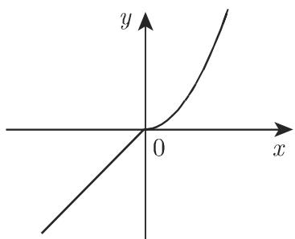

#### 2.1.2 实函数的定义方法

2.1.2.1 函数的定义

函数可以按不同方式来定义, 如值表、图示 (曲线)、公式 (解析表达式), 或不同公式构成的分段函数. 其中的自变量只有在属于解析表达式的定义域时, 函数才有意义, 即函数取得唯一有限实值. 当没有给出定义域时, 认为定义域为使得该函数有意义的最大集合.

2.1.2.2 函数的解析表示

通常采用如下三种形式:

1. 显形式

$$
y = f (x).\tag{2.4}
$$

$y = \sqrt{1 - x^2}, -1 \leqslant x \leqslant 1, y \geqslant 0.$ 其图像为以原点为圆心的单位圆的上半部分.
2. 隐形式

$$
F (x, y) = 0.\tag{2.5}
$$

此时对每个 $x$ 存在满足该方程的唯一一个 $y$ , 也可以看出哪些解是函数值.

■ $x^{2} + y^{2} - 1 = 0, -1 \leqslant x \leqslant +1, y \geqslant 0$ . 该图像仍为以原点为圆心的单位圆的上半部分, 要注意 $x^{2} + y^{2} - 1 = 0$ 本身并没有定义一个实函数.

3. 参数形式

$$
x = \varphi (t), \quad y = \psi (t).\tag{2.6}
$$

$x, y$ 是辅助变量即参数 $t$ 的函数, 并根据 $t$ 取得相应的数值. 函数 $\varphi(t)$ 和 $\psi(t)$ 的定义域必相同, 且只有当 $x = \varphi(t)$ 是 $t$ 与 $x$ 的一一对应时, 该表达式才定义一个实函数.

■ $x = \varphi(t)$ , $y = \psi(t)$ , 其中 $\varphi(t) = \cos t$ , $\psi(t) = \sin t$ , $0 \leqslant t \leqslant \pi$ . 该图像仍为以原点为圆心的单位圆的上半部分.

注 参数形式的函数有时并不能表示为不含参数的显方程或隐方程.

■ $x = t + 2\sin t = \varphi (t)$ ， $y = t - \cos t = \psi (t)$

分段函数举例：

■ A: 当 $n \leqslant x < n + 1$ 且 n 为整数时,

$$
y = E (x) = \operatorname{int} (x) = [ x ] = n.
$$

函数 $E(x)$ 或 $\operatorname{int}(x)$ (读作 “x 的整部”) 表示小于等于 x 的最大整数 (图 2.1(a)). 图 2.1(a), (b) 是相应的图示, 其中空心圆表示终点不在曲线上.

■ B: 函数 $y = \text{frac}(x) = x - [x]$ (读作 “x 的小数部分”) 表示 x 与 [x] 的差 (图 2.1(b)).

  
(a)

  
(b)  
图2.1

■ C: $y = \left\{\begin{array}{ll} x, & x \leqslant 0, \\ x^{2}, & x \geqslant 0 \end{array}\right.$ (图 2.2(a)).

■ D: $y = \text{sign}(x) = \left\{\begin{array}{ll}-1,&x<0,\\0,&x=0,(\text{图2.2(b)}),\text{sign}(x)(\text{读作“}x\text{的符号”})\text{为符}\\+1,&x>0\end{array}\right.$

号函数.

  
(a)

  
图2.2  
(b)
